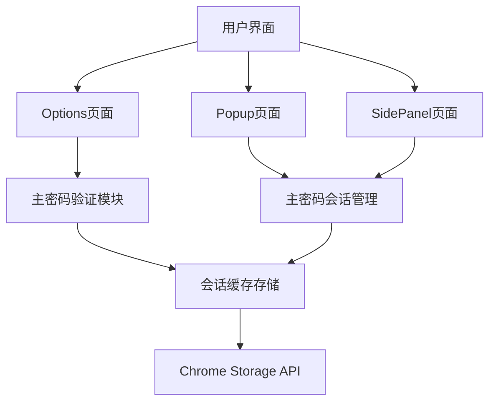

# 主密码会话有效期功能设计文档

## 1. 概述

### 1.1 功能目标
实现主密码会话有效期设置功能，允许用户配置主密码验证后的会话缓存时间（1-24小时），在有效期内访问密码列表页面和侧边栏快速填充页面无需重复输入主密码，提升用户体验。

### 1.2 核心价值
- **安全性**: 通过可配置的有效期平衡安全性和便利性
- **用户体验**: 减少重复输入主密码的频率，提高使用效率
- **一致性**: 会话缓存时间与主密码有效期设置保持同步

## 2. 架构设计

### 2.1 系统组件


### 2.2 数据流向
1. 用户在Options页面设置主密码时选择有效期（1-24小时）
2. 主密码验证通过后，将主密码和过期时间存储到会话缓存
3. 访问密码列表或侧边栏时检查会话缓存是否有效
4. 会话有效则直接访问，无效则要求重新验证主密码

## 3. 功能详细设计

### 3.1 主密码有效期设置

#### 3.1.1 配置选项
| 选项 | 值（小时） | 推荐场景 |
|------|------------|----------|
| 1小时 | 1 | 高度敏感环境 |
| 2小时 | 2 | 办公环境 |
| 4小时 | 4 | 日常使用 |
| 8小时 | 8 | 工作日使用 |
| 12小时 | 12 | 个人设备 |
| 24小时 | 24 | 默认推荐 |

#### 3.1.2 存储结构
```typescript
interface MasterPasswordSession {
  masterPassword: string;        // 主密码明文（会话缓存）
  expiryTime: number;            // 过期时间戳（毫秒）
  validityHours: number;         // 有效期（小时）
}
```

### 3.2 会话管理机制

#### 3.2.1 会话创建
当用户成功验证主密码后：
1. 获取用户设置的有效期时间
2. 计算过期时间戳（当前时间 + 有效期毫秒数）
3. 将主密码和过期时间存储到内存缓存中

#### 3.2.2 会话验证
访问受保护页面时：
1. 检查内存中是否存在会话缓存
2. 检查当前时间是否超过过期时间
3. 有效则允许访问，无效则跳转到验证页面

#### 3.2.3 会话清除
以下情况清除会话：
1. 用户主动退出登录
2. 会话过期自动清除
3. 浏览器关闭时自动清除会话缓存

## 4. 页面交互设计

### 4.1 Options页面

#### 4.1.1 设置主密码页面
- 保留现有的主密码设置表单
- 添加有效期选择下拉框，默认24小时
- 设置成功后立即创建会话缓存

#### 4.1.2 验证主密码页面
- 用户输入主密码验证
- 验证成功后创建会话缓存
- 跳转到密码管理主界面

### 4.2 SidePanel页面
- 页面加载时检查会话状态
- 会话有效：直接显示密码列表
- 会话无效：跳转到Options页面要求验证

### 4.3 Popup页面
- 点击"快速填充"时检查会话状态
- 会话有效：直接打开SidePanel
- 会话无效：打开Options页面进行验证

## 5. API设计

### 5.1 会话管理接口

| 接口 | 方法 | 参数 | 返回值 | 说明 |
|------|------|------|--------|------|
| createSession | POST | masterPassword, validityHours | boolean | 创建会话缓存 |
| validateSession | GET | - | boolean | 验证会话有效性 |
| clearSession | DELETE | - | void | 清除会话缓存 |
| getSessionExpiry | GET | - | number/null | 获取会话过期时间 |

### 5.2 存储工具扩展

#### 5.2.1 新增方法
```typescript
class StorageUtils {
  // 获取主密码有效期设置
  static async getMasterPasswordValidityHours(): Promise<number>
  
  // 设置主密码有效期
  static async setMasterPasswordValidityHours(hours: number): Promise<void>
  
  // 检查会话是否有效
  static async isSessionValid(): Promise<boolean>
  
  // 获取会话主密码
  static async getSessionMasterPassword(): Promise<string|null>
  
  // 创建会话缓存
  static async createSession(masterPassword: string, validityHours: number): Promise<void>
  
  // 清除会话缓存
  static async clearSession(): Promise<void>
  
  // 获取会话过期时间
  static async getSessionExpiryTime(): Promise<number|null>
}
```

#### 5.2.2 实现细节

##### 获取主密码有效期
```typescript
static async getMasterPasswordValidityHours(): Promise<number> {
  try {
    // 首先检查内存中的会话设置
    if (sessionValidityHours.value !== null) {
      return sessionValidityHours.value;
    }
    
    // 从存储中获取默认值
    const result = await chrome.storage.local.get('master_password_validity');
    const validityHours = result.master_password_validity || 24;
    
    // 更新内存缓存
    sessionValidityHours.value = validityHours;
    return validityHours;
  } catch (error) {
    console.error('获取主密码有效期失败:', error);
    return 24; // 默认24小时
  }
}
```

##### 设置主密码有效期
```typescript
static async setMasterPasswordValidityHours(hours: number): Promise<void> {
  try {
    // 参数验证
    if (hours < 1 || hours > 24) {
      throw new Error('有效期必须在1-24小时之间');
    }
    
    // 保存到存储
    await chrome.storage.local.set({
      master_password_validity: hours
    });
    
    // 更新内存缓存
    sessionValidityHours.value = hours;
  } catch (error) {
    console.error('设置主密码有效期失败:', error);
    throw error;
  }
}
```

##### 会话验证
```typescript
static async isSessionValid(): Promise<boolean> {
  try {
    // 检查内存中是否存在会话主密码
    if (!sessionMasterPassword.value || !sessionPasswordExpiry.value) {
      return false;
    }
    
    // 检查是否过期
    const now = Date.now();
    if (now >= sessionPasswordExpiry.value) {
      // 会话已过期，清除缓存
      await this.clearSession();
      return false;
    }
    
    return true;
  } catch (error) {
    console.error('会话验证失败:', error);
    return false;
  }
}
```

## 6. 安全性设计

### 6.1 数据保护
- 会话主密码仅存储在内存中，浏览器关闭后自动清除
- 不将会话数据持久化到localStorage或chrome.storage
- 使用时间戳验证机制防止会话劫持
- 敏感数据在使用后立即清除

### 6.2 过期处理
- 精确计算过期时间，避免时间漂移
- 前端和后端双重验证机制
- 过期后立即清除敏感数据
- 定期检查会话状态，确保及时过期

### 6.3 访问控制
- 所有受保护页面访问前必须验证会话
- 会话无效时重定向到验证页面
- 防止直接URL访问绕过验证
- 实现细粒度的权限控制

### 6.4 会话劫持防护
- 使用时间戳和随机数生成会话标识
- 实现会话固定攻击防护
- 定期刷新会话标识
- 检测异常访问模式

## 7. 用户体验优化

### 7.1 无缝验证
- 会话有效期内无需重复输入主密码
- 页面间跳转保持会话状态
- 自动过期提醒机制

### 7.2 错误处理
- 会话过期时友好的提示信息
- 一键跳转到验证页面
- 验证失败后的重试机制

### 7.3 响应式设计
- 适配不同设备屏幕尺寸
- 移动端优化的验证界面
- 快速填充功能的流畅体验

## 8. 错误处理与异常情况

### 8.1 会话过期处理
当用户会话过期时：
1. 自动跳转到主密码验证页面
2. 显示友好的过期提示信息
3. 保留用户之前的操作上下文

### 8.2 网络异常处理
- 离线状态下使用本地缓存
- 网络恢复后自动同步数据
- 提供手动重试机制

### 8.3 系统异常处理
- 内存不足时的安全清理机制
- 浏览器崩溃后的状态恢复
- 异常输入的防护机制

## 8. 技术实现方案

### 8.1 会话状态管理
使用Vue的响应式状态管理来维护会话状态：

```typescript
// 会话状态管理模块
import { ref, computed } from 'vue';

const sessionMasterPassword = ref<string | null>(null);
const sessionPasswordExpiry = ref<number | null>(null);
const sessionValidityHours = ref<number>(24);

// 检查会话是否有效
const isSessionValid = computed(() => {
  if (!sessionMasterPassword.value || !sessionPasswordExpiry.value) {
    return false;
  }
  return Date.now() < sessionPasswordExpiry.value;
});

// 创建会话
const createSession = (masterPassword: string, validityHours: number) => {
  sessionMasterPassword.value = masterPassword;
  sessionValidityHours.value = validityHours;
  sessionPasswordExpiry.value = Date.now() + validityHours * 60 * 60 * 1000;
};

// 清除会话
const clearSession = () => {
  sessionMasterPassword.value = null;
  sessionPasswordExpiry.value = null;
  sessionValidityHours.value = 24;
};

// 获取会话主密码
const getSessionMasterPassword = () => {
  return isSessionValid.value ? sessionMasterPassword.value : null;
};
```

### 8.2 Options页面修改

#### 8.2.1 设置主密码表单
在设置主密码表单中添加有效期选择：

```vue
<el-form-item label="验证有效期" prop="validityHours">
  <el-select
    v-model="setupForm.validityHours"
    placeholder="选择验证有效期"
    size="large"
    :disabled="setupLoading"
    style="width: 100%"
  >
    <el-option label="1小时" :value="1" />
    <el-option label="2小时" :value="2" />
    <el-option label="4小时" :value="4" />
    <el-option label="8小时" :value="8" />
    <el-option label="12小时" :value="12" />
    <el-option label="24小时（推荐）" :value="24" />
  </el-select>
  <div class="form-tip">验证有效期内无需重新输入主密码，超过有效期需重新验证</div>
</el-form-item>
```

#### 8.2.2 设置主密码处理
在设置主密码成功后创建会话：

```typescript
const handleSetupSubmit = async () => {
  // ... 验证逻辑 ...
  
  // 设置主密码
  await StorageUtils.setMasterPassword(setupForm.value.password.trim());
  
  // 保存有效期设置
  await StorageUtils.setMasterPasswordValidityHours(setupForm.value.validityHours);
  
  // 创建会话缓存
  createSession(setupForm.value.password.trim(), setupForm.value.validityHours);
  
  // 转入主界面
  showMasterPasswordSetup.value = false;
  isAuthenticated.value = true;
  
  await loadPasswords();
};
```

#### 8.2.3 验证主密码处理
在验证主密码成功后创建会话：

```typescript
const handleVerifySubmit = async () => {
  // ... 验证逻辑 ...
  
  const isValid = await StorageUtils.verifyMasterPassword(verifyForm.value.password.trim());
  
  if (isValid) {
    // 获取用户设置的有效期
    const validityHours = await StorageUtils.getMasterPasswordValidityHours();
    
    // 创建会话缓存
    createSession(verifyForm.value.password.trim(), validityHours);
    
    // 转入主界面
    showPasswordVerify.value = false;
    isAuthenticated.value = true;
    
    await loadPasswords();
  } else {
    // 验证失败处理
    verifyError.value = '密码错误，请重新输入';
  }
};
```

### 8.3 SidePanel页面修改

#### 8.3.1 页面加载时检查会话
```typescript
onMounted(async () => {
  // 检查会话是否有效
  if (!isSessionValid.value) {
    // 会话无效，跳转到选项页面进行验证
    openOptions();
    return;
  }
  
  await loadCurrentTab();
  await loadPasswords();
});
```

#### 8.3.2 密码加载时使用会话主密码
```typescript
const loadPasswords = async () => {
  try {
    loading.value = true;
    
    // 获取会话主密码
    const masterPassword = getSessionMasterPassword();
    
    if (masterPassword) {
      // 使用会话主密码解密密码数据
      passwords.value = await StorageUtils.getAllPasswords(masterPassword);
    } else {
      // 会话无效，跳转到验证页面
      openOptions();
      return;
    }
  } catch (error) {
    console.error('加载密码列表失败:', error);
    ElMessage.error('加载密码列表失败');
  } finally {
    loading.value = false;
  }
};
```

### 8.4 Popup页面修改

#### 8.4.1 快速填充按钮处理
```typescript
const openSidePanel = async () => {
  try {
    // 检查会话是否有效
    if (!isSessionValid.value) {
      // 会话无效，打开选项页面进行验证
      openOptions();
      return;
    }
    
    const [tab] = await chrome.tabs.query({ active: true, currentWindow: true });
    if (tab.id) {
      await chrome.sidePanel.open({ tabId: tab.id });
      window.close();
    }
  } catch (error) {
    console.error('打开侧边栏失败:', error);
  }
};
```

### 8.5 全局会话检查
在应用入口处添加全局会话检查：

```typescript
// 全局会话检查中间件
const checkSession = async () => {
  // 定期检查会话状态
  setInterval(async () => {
    if (!isSessionValid.value && isAuthenticated.value) {
      // 会话过期，清除认证状态
      isAuthenticated.value = false;
      // 跳转到验证页面
      showPasswordVerify.value = true;
      showMasterPasswordSetup.value = false;
    }
  }, 60000); // 每分钟检查一次
};
```

## 9. 测试策略

### 9.1 单元测试
- 会话创建和验证逻辑测试
- 过期时间计算准确性测试
- 边界条件测试（0小时、25小时等）
- 会话清除功能测试
- 有效期设置和获取测试

### 9.2 集成测试
- 页面间跳转的会话状态保持测试
- 多标签页会话同步测试
- 浏览器重启后会话清除测试
- 会话过期自动跳转测试
- 不同有效期设置下的功能测试

### 9.3 用户验收测试
- 不同有效期设置下的用户体验测试
- 会话过期提醒机制测试
- 异常情况下的错误处理测试
- 安全性测试（会话劫持、固定攻击等）
- 性能测试（大量密码数据下的会话管理）

### 9.4 自动化测试
- 使用Jest进行单元测试
- 使用Cypress进行端到端测试
- 模拟不同有效期设置的测试场景
- 会话过期和续期的自动化测试