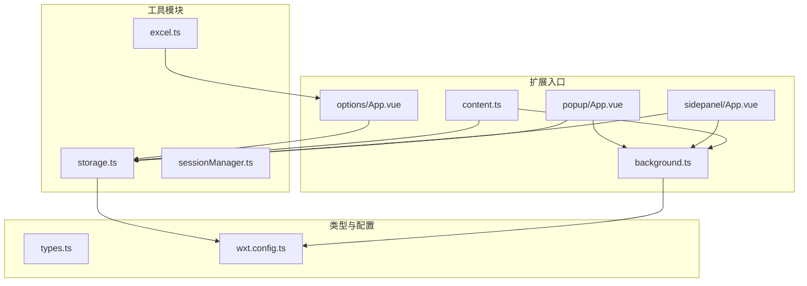
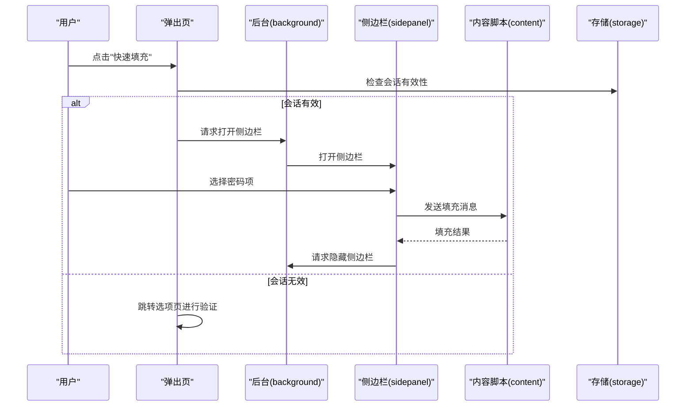
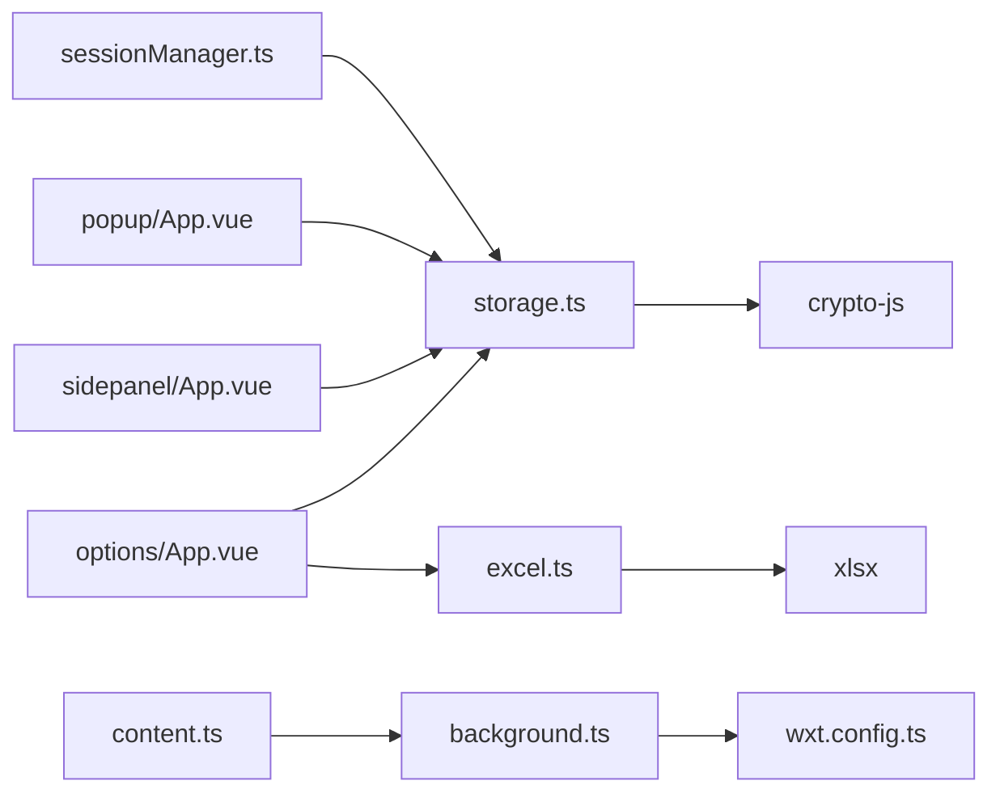

# API参考

<cite>
**本文档引用的文件**
- [package.json](file://package.json)
- [README.md](file://README.md)
- [wxt.config.ts](file://wxt.config.ts)
- [background.ts](file://entrypoints/background.ts)
- [content.ts](file://entrypoints/content.ts)
- [popup/App.vue](file://entrypoints/popup/App.vue)
- [sidepanel/App.vue](file://entrypoints/sidepanel/App.vue)
- [options/App.vue](file://entrypoints/options/App.vue)
- [storage.ts](file://utils/storage.ts)
- [excel.ts](file://utils/excel.ts)
- [types.ts](file://utils/types.ts)
- [sessionManager.ts](file://utils/sessionManager.ts)
- [PasswordFormDialog.vue](file://components/PasswordFormDialog.vue)
- [MasterPasswordDialog.vue](file://components/MasterPasswordDialog.vue)
</cite>

## 更新摘要
**变更内容**
- 新增会话管理API章节，包含会话创建、验证、清理等功能
- 新增数据迁移API章节，提供从明文到加密数据的迁移机制
- 增强存储管理API，新增会话状态管理和有效期设置
- 新增调试工具API，提供主密码配置调试功能
- 更新消息通信协议，包含新的消息类型和处理机制
- **更新** 会话检查机制：`migrateUnencryptedEntries` 函数现在会在活跃会话期间跳过执行，确保数据一致性

## 目录
1. [简介](#简介)
2. [项目结构](#项目结构)
3. [核心组件](#核心组件)
4. [架构总览](#架构总览)
5. [详细组件分析](#详细组件分析)
6. [依赖关系分析](#依赖关系分析)
7. [性能考虑](#性能考虑)
8. [故障排查指南](#故障排查指南)
9. [结论](#结论)
10. [附录](#附录)

## 简介
本文件为 Account Password Helper 的完整 API 参考文档，面向第三方开发者与集成商，系统梳理消息通信协议、工具类 API、类型定义、Chrome 扩展 API 集成方式、Excel 处理接口与存储管理 API 的操作规范，并提供错误处理机制、异常情况说明、调试指南、版本兼容性与废弃功能迁移指引。

## 项目结构
项目采用 WXT + Vue3 + TypeScript 的现代前端扩展开发架构，主要模块包括：
- 入口脚本：background（后台）、content（内容脚本）、popup/sidepanel/options（UI 入口）
- 工具模块：storage（存储与加密）、excel（Excel 导入导出）、sessionManager（会话管理）
- 类型定义：消息类型、密码条目、主密码配置等
- UI 组件：主密码对话框、密码表单对话框等

**图表来源**
- [background.ts](file://entrypoints/background.ts#L1-L241)
- [content.ts](file://entrypoints/content.ts#L1-L1892)
- [popup/App.vue](file://entrypoints/popup/App.vue#L1-L234)
- [sidepanel/App.vue](file://entrypoints/sidepanel/App.vue#L1-L911)
- [options/App.vue](file://entrypoints/options/App.vue#L1-L2456)
- [storage.ts](file://utils/storage.ts#L1-L1280)
- [excel.ts](file://utils/excel.ts#L1-L155)
- [sessionManager.ts](file://utils/sessionManager.ts#L1-L87)
- [types.ts](file://utils/types.ts#L1-L96)
- [wxt.config.ts](file://wxt.config.ts#L1-L48)

**章节来源**
- [package.json](file://package.json#L1-L49)
- [README.md](file://README.md#L1-L201)
- [wxt.config.ts](file://wxt.config.ts#L1-L48)

## 核心组件
- 存储与加密工具：提供主密码设置/校验、PBKDF2 密钥派生、AES 加密/解密、密码条目 CRUD、排序与搜索、会话有效期管理等
- Excel 工具：支持导出为 Excel、从 Excel 导入、下载模板
- 会话管理：基于存储的会话检查与过期处理
- 消息通信：定义消息类型枚举与消息接口，贯穿 background、content、UI 三端
- UI 组件：主密码对话框、密码表单对话框、选项页、弹出页、侧边栏

**章节来源**
- [storage.ts](file://utils/storage.ts#L1-L1280)
- [excel.ts](file://utils/excel.ts#L1-L155)
- [sessionManager.ts](file://utils/sessionManager.ts#L1-L87)
- [types.ts](file://utils/types.ts#L1-L96)

## 架构总览
扩展采用"后台服务 + 内容脚本 + UI 入口"的分层架构：
- background：监听快捷键、管理 sidePanel、转发消息、处理 URL 变化
- content：表单检测、侧边栏显示控制、向页面注入脚本、发送填充消息
- UI：popup/ sidepanel/ options 三个入口，分别负责快速访问、密码填充、管理与配置
- 工具层：storage/excel/sessionManager/types 提供统一能力

**图表来源**
- [popup/App.vue](file://entrypoints/popup/App.vue#L127-L151)
- [background.ts](file://entrypoints/background.ts#L75-L138)
- [sidepanel/App.vue](file://entrypoints/sidepanel/App.vue#L342-L422)
- [content.ts](file://entrypoints/content.ts#L87-L91)

## 详细组件分析

### 消息通信协议
- 消息类型枚举：PING、DETECT_FORM、FILL_PASSWORD、FILL_MOBILE_CODE、SHOW_SIDEPANEL、HIDE_SIDEPANEL、URL_CHANGED、GET_PASSWORDS
- 消息接口：type（必需）、data（可选）
- 通信方向：
  - UI → Background：SHOW_SIDEPANEL、HIDE_SIDEPANEL、URL_CHANGED
  - Background ↔ Content：表单检测、填充指令
  - SidePanel → Content：FILL_PASSWORD（账号/密码或手机号+验证码）

**章节来源**
- [types.ts](file://utils/types.ts#L52-L96)
- [background.ts](file://entrypoints/background.ts#L33-L73)
- [content.ts](file://entrypoints/content.ts#L86-L91)
- [sidepanel/App.vue](file://entrypoints/sidepanel/App.vue#L394-L400)

### 存储管理 API（StorageUtils）
- 主密码管理
  - setMasterPassword(password: string): Promise<void> —— 设置主密码（MD5+盐值）
  - verifyMasterPassword(password: string): Promise<boolean> —— 验证主密码
  - hasMasterPassword(): Promise<boolean> —— 是否已设置主密码
  - resetMasterPassword(): Promise<void> —— 清空主密码配置
- 数据加解密
  - hashPassword(password: string, salt?: string): string —— MD5 哈希
  - generateSalt(): string —— 生成盐值
  - deriveEncryptionKey(masterPassword: string): Promise<string> —— PBKDF2 派生密钥
  - encryptData(data: string, key: string): string —— AES-256-CBC 加密（含 IV）
  - decryptData(encryptedData: string, key: string): string —— AES-256-CBC 解密
  - encryptPasswordEntry(entry: PasswordEntry, masterPassword: string): Promise<EncryptedPasswordEntry>
  - decryptPasswordEntry(entry: EncryptedPasswordEntry, masterPassword: string): Promise<PasswordEntry>
- 密码条目管理
  - savePassword(entry: Omit<PasswordEntry, 'id'|'order'>, masterPassword?: string, copyItemId?: string): Promise<PasswordEntry>
  - updatePassword(id: string, updates: Partial<PasswordEntry>, masterPassword?: string): Promise<void>
  - getAllPasswords(masterPassword?: string): Promise<PasswordEntry[]>
  - getAllPasswordsRaw(): Promise<(PasswordEntry|EncryptedPasswordEntry)[]>
  - getPasswordsByUrl(url: string, masterPassword?: string): Promise<PasswordEntry[]>
  - searchPasswords(keyword: string, masterPassword?: string): Promise<PasswordEntry[]>
  - deletePassword(id: string): Promise<void>
  - deletePasswords(ids: string[]): Promise<void>
- 排序与配置
  - updatePasswordsOrder(passwords: PasswordEntry[]): Promise<void>
  - saveSortConfig(sortConfig: {prop:string,order:string}): Promise<void>
  - getSortConfig(): Promise<{prop:string,order:string}|null>
  - applySavedSortConfig(passwords: PasswordEntry[]): Promise<void>
- 会话与有效期
  - setMasterPasswordValidityHours(hours: number): Promise<void>
  - getMasterPasswordValidityHours(): Promise<number>
  - isSessionValid(): Promise<boolean>
  - clearSession(): Promise<void>
  - getSessionMasterPassword(): string | null
  - createSession(masterPassword: string, validityHours: number): Promise<void>
  - getSessionMasterPasswordDecrypted(): Promise<string | null>
  - getSessionExpiryTime(): Promise<number | null>
  - generateSessionEncryptionKey(): Promise<string>
  - isSessionActiveSync(): boolean —— 同步检查会话是否活跃
- 数据迁移
  - migrateUnencryptedEntries(masterPassword: string): Promise<void>
  - clearAllData(): Promise<void>
- 调试工具
  - debugMasterPassword(): Promise<any>

**章节来源**
- [storage.ts](file://utils/storage.ts#L37-L1280)

### Excel 处理接口（ExcelUtils）
- 导出
  - exportToExcel(passwords: PasswordEntry[], filename?: string): void —— 导出为 Excel（含列宽设置）
- 导入
  - importFromExcel(file: File): Promise<Omit<PasswordEntry,'id'|'order'>[]> —— 从 Excel 解析为密码条目（支持多列名变体）
- 模板
  - downloadTemplate(): void —— 下载标准模板文件

**章节来源**
- [excel.ts](file://utils/excel.ts#L4-L155)

### 会话管理（SessionManager）
- 单例模式：getInstance()
- 启动/停止会话检查：startSessionCheck()/stopSessionCheck()
- 会话过期处理：触发自定义事件并清理会话
- 初始化：init()

**章节来源**
- [sessionManager.ts](file://utils/sessionManager.ts#L6-L87)

### Chrome 扩展 API 集成
- 权限与快捷键
  - 权限：storage、activeTab、scripting、sidePanel
  - 快捷键：open_options（Ctrl+Shift+P）、toggle_sidepanel（Ctrl+Shift+L）
- 后台脚本
  - 监听标签页更新/激活，自动关闭 sidePanel
  - 监听快捷键命令，打开选项页或切换 sidePanel
  - 监听消息：SHOW_SIDEPANEL/HIDE_SIDEPANEL/URL_CHANGED
- 内容脚本
  - 表单检测与侧边栏显示控制
  - 与页面交互，注入脚本并发送填充消息
- UI 入口
  - popup：打开选项页、快速打开侧边栏
  - sidepanel：认证态切换、搜索过滤、填充密码、打开选项页
  - options：主密码设置/验证、密码管理、Excel 导入导出、有效期设置

**章节来源**
- [wxt.config.ts](file://wxt.config.ts#L18-L46)
- [background.ts](file://entrypoints/background.ts#L1-L241)
- [content.ts](file://entrypoints/content.ts#L1-L1892)
- [popup/App.vue](file://entrypoints/popup/App.vue#L1-L234)
- [sidepanel/App.vue](file://entrypoints/sidepanel/App.vue#L1-L911)
- [options/App.vue](file://entrypoints/options/App.vue#L1-L2456)

### UI 组件与交互
- 主密码对话框（MasterPasswordDialog）
  - 首次使用：设置主密码（含二次确认）
  - 验证：输入主密码进行验证
  - 事件：passwordSet
- 密码表单对话框（PasswordFormDialog）
  - 新增/编辑密码条目
  - 表单校验（用户名、密码必填）
  - 事件：saved

**章节来源**
- [MasterPasswordDialog.vue](file://components/MasterPasswordDialog.vue#L1-L447)
- [PasswordFormDialog.vue](file://components/PasswordFormDialog.vue#L1-L336)

## 依赖关系分析
- 工具层依赖
  - storage.ts 依赖 crypto-js（MD5/PBKDF2/AES）、chrome.storage
  - excel.ts 依赖 xlsx
  - sessionManager.ts 依赖 storage.ts
- UI 与工具层
  - options/App.vue、popup/App.vue、sidepanel/App.vue 通过 StorageUtils/ExcelUtils/SessionManager 提供能力
- 构建与配置
  - wxt.config.ts 定义入口、权限、快捷键、路径别名

**图表来源**
- [storage.ts](file://utils/storage.ts#L1-L10)
- [excel.ts](file://utils/excel.ts#L1-L2)
- [sessionManager.ts](file://utils/sessionManager.ts#L1-L2)
- [popup/App.vue](file://entrypoints/popup/App.vue#L54-L54)
- [sidepanel/App.vue](file://entrypoints/sidepanel/App.vue#L168-L168)
- [options/App.vue](file://entrypoints/options/App.vue#L795-L797)
- [background.ts](file://entrypoints/background.ts#L1-L4)
- [content.ts](file://entrypoints/content.ts#L1-L4)
- [wxt.config.ts](file://wxt.config.ts#L1-L48)

**章节来源**
- [package.json](file://package.json#L22-L46)
- [wxt.config.ts](file://wxt.config.ts#L1-L48)

## 性能考虑
- 表单检测优化
  - 使用防抖（150ms）与 MutationObserver 降低频繁重检成本
  - 字段类型缓存（WeakMap）与 Set 提升查找效率
- 存储与排序
  - 保存排序配置，避免每次渲染重新计算
  - 批量操作（批量删除）减少多次写入
- 会话检查
  - 每分钟检查一次会话状态，避免高频轮询
- Excel 导入
  - 仅解析首张工作表，按列名映射，过滤无效条目

**章节来源**
- [content.ts](file://entrypoints/content.ts#L9-L19)
- [content.ts](file://entrypoints/content.ts#L38-L51)
- [storage.ts](file://utils/storage.ts#L607-L670)
- [sessionManager.ts](file://utils/sessionManager.ts#L27-L45)
- [excel.ts](file://utils/excel.ts#L50-L114)

## 故障排查指南
- 侧边栏无法打开
  - 检查 Chrome 版本是否支持 sidePanel API（Chrome 114+）
  - 后台脚本日志：确认 SHOW_SIDEPANEL/HIDE_SIDEPANEL 处理流程
- 填充失败
  - 确认 content script 已注入（sidepanel 注入 scripting.executeScript）
  - 检查页面是否加载完成，表单是否存在
- 主密码相关
  - 验证失败：确认输入正确；检查存储中主密码配置
  - 会话过期：检查有效期设置与 sessionManager 定时任务
- Excel 导入失败
  - 确认列名符合支持范围（用户名、密码、URL、标签、备注等）
  - 文件格式是否为 .xlsx/.xls

**章节来源**
- [background.ts](file://entrypoints/background.ts#L75-L138)
- [sidepanel/App.vue](file://entrypoints/sidepanel/App.vue#L355-L422)
- [storage.ts](file://utils/storage.ts#L118-L143)
- [sessionManager.ts](file://utils/sessionManager.ts#L34-L44)
- [excel.ts](file://utils/excel.ts#L50-L114)

## 结论
本 API 参考文档系统化梳理了 Account Password Helper 的消息协议、工具类 API、类型定义与扩展集成方式。通过明确的错误处理与调试指引，可帮助第三方开发者与集成商高效对接与扩展功能。

## 附录

### API 一览（按模块）

#### 存储与加密（StorageUtils）
- 主密码管理
  - setMasterPassword(password)
  - verifyMasterPassword(password)
  - hasMasterPassword()
  - resetMasterPassword()
- 数据加解密
  - hashPassword(password, salt?)
  - generateSalt()
  - deriveEncryptionKey(masterPassword)
  - encryptData(data, key)
  - decryptData(encryptedData, key)
  - encryptPasswordEntry(entry, masterPassword)
  - decryptPasswordEntry(entry, masterPassword)
- 密码条目管理
  - savePassword(entry, masterPassword?, copyItemId?)
  - updatePassword(id, updates, masterPassword?)
  - getAllPasswords(masterPassword?)
  - getAllPasswordsRaw()
  - getPasswordsByUrl(url, masterPassword?)
  - searchPasswords(keyword, masterPassword?)
  - deletePassword(id)
  - deletePasswords(ids)
- 排序与配置
  - updatePasswordsOrder(passwords)
  - saveSortConfig(config)
  - getSortConfig()
  - applySavedSortConfig(passwords)
- 会话与有效期
  - setMasterPasswordValidityHours(hours)
  - getMasterPasswordValidityHours()
  - isSessionValid()
  - clearSession()
  - getSessionMasterPassword()
  - createSession(masterPassword, validityHours)
  - getSessionMasterPasswordDecrypted()
  - getSessionExpiryTime()
  - generateSessionEncryptionKey()
  - isSessionActiveSync()
- 数据迁移
  - migrateUnencryptedEntries(masterPassword)
  - clearAllData()
- 调试工具
  - debugMasterPassword()

#### Excel 工具（ExcelUtils）
- exportToExcel(passwords, filename?)
- importFromExcel(file)
- downloadTemplate()

#### 会话管理（SessionManager）
- getInstance()
- startSessionCheck()
- stopSessionCheck()
- init()

#### 消息类型（MessageType）
- PING, DETECT_FORM, FILL_PASSWORD, FILL_MOBILE_CODE, SHOW_SIDEPANEL, HIDE_SIDEPANEL, URL_CHANGED, GET_PASSWORDS

#### 类型定义（PasswordEntry、MasterPasswordConfig、Message）
- PasswordEntry：id、username、password、url、tag、remark、createTime、updateTime、order
- MasterPasswordConfig：hashedPassword、salt
- Message：type、data?

**章节来源**
- [storage.ts](file://utils/storage.ts#L37-L1280)
- [excel.ts](file://utils/excel.ts#L4-L155)
- [sessionManager.ts](file://utils/sessionManager.ts#L6-L87)
- [types.ts](file://utils/types.ts#L4-L96)

### 版本兼容性与废弃功能
- sidePanel API：Chrome 114+ 支持，低版本会提示不支持
- 快捷键：默认 Ctrl+Shift+P（打开选项页）、Ctrl+Shift+L（切换侧边栏）
- 废弃/保留：当前未发现明确废弃功能；手机号+验证码填充预留 MessageType.FILL_MOBILE_CODE，当前按账号密码填充

**章节来源**
- [background.ts](file://entrypoints/background.ts#L75-L138)
- [wxt.config.ts](file://wxt.config.ts#L25-L40)
- [types.ts](file://utils/types.ts#L69-L70)

### 会话管理API详解

#### 会话创建与管理
- createSession(masterPassword: string, validityHours: number): Promise<void>
  - 功能：创建加密会话，存储加密的主密码和过期时间
  - 参数：masterPassword（主密码）、validityHours（有效期小时数）
  - 返回：Promise<void>
  - 异常：创建失败时抛出错误

- isSessionValid(): Promise<boolean>
  - 功能：检查当前会话是否有效
  - 返回：Promise<boolean> - 会话有效返回true，否则false
  - 异常：检查失败时返回false并清理会话

- clearSession(): Promise<void>
  - 功能：清理会话缓存，确保所有敏感数据已加密
  - 返回：Promise<void>
  - 异常：清理失败时抛出错误

- isSessionActiveSync(): boolean
  - 功能：同步检查会话是否活跃（内存中检查）
  - 返回：boolean - 会话活跃返回true，否则false

#### 会话状态查询
- getSessionMasterPasswordDecrypted(): Promise<string | null>
  - 功能：获取解密后的会话主密码
  - 返回：Promise<string | null> - 解密后的主密码或null
  - 异常：解密失败时返回null

- getSessionExpiryTime(): Promise<number | null>
  - 功能：获取会话过期时间
  - 返回：Promise<number | null> - 过期时间戳或null

- generateSessionEncryptionKey(): Promise<string>
  - 功能：生成会话加密密钥
  - 返回：Promise<string> - 生成的32字符密钥

#### 数据迁移API
- migrateUnencryptedEntries(masterPassword: string): Promise<void>
  - 功能：将旧版本的明文数据迁移到加密数据
  - 返回：Promise<void>
  - 异常：迁移失败时记录错误但不影响正常运行
  - **更新**：在活跃会话期间会跳过执行，确保数据一致性

**章节来源**
- [storage.ts](file://utils/storage.ts#L1097-L1139)
- [sessionManager.ts](file://utils/sessionManager.ts#L27-L87)

### 调试工具API

#### 主密码调试
- debugMasterPassword(): Promise<any>
  - 功能：获取主密码配置的调试信息
  - 返回：Promise<any> - 包含主密码配置状态的对象
  - 字段：hasConfig、hasSalt、hasHashedPassword、saltLength、hashLength、saltPreview、hashPreview
  - 异常：获取失败时返回包含错误信息的对象

**章节来源**
- [storage.ts](file://utils/storage.ts#L1182-L1201)

### 会话检查机制详解

#### 会话生命周期管理
- 会话创建：createSession() 方法会：
  - 生成会话加密密钥
  - 加密存储主密码
  - 设置过期时间
  - 自动解密所有密码条目为明文存储

- 会话验证：isSessionValid() 方法会：
  - 恢复会话状态（如果从存储中恢复）
  - 检查过期时间
  - 确保数据状态一致性（自动修复加密状态）

- 会话清理：clearSession() 方法会：
  - 在会话过期前加密所有敏感字段
  - 清除内存中的会话数据
  - 清除持久化的会话信息

#### 数据一致性保证
- **新增** migrateUnencryptedEntries 函数现在会在活跃会话期间跳过执行，因为：
  - 活跃会话期间数据以明文形式存储是预期行为
  - 避免破坏当前的数据一致性状态
  - 确保迁移操作只在会话无效时执行

**章节来源**
- [storage.ts](file://utils/storage.ts#L822-L1007)
- [sessionManager.ts](file://utils/sessionManager.ts#L34-L66)