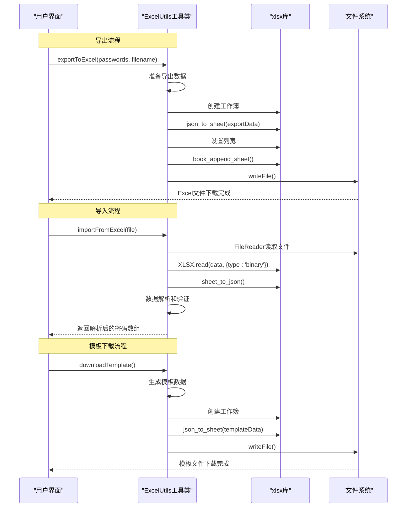
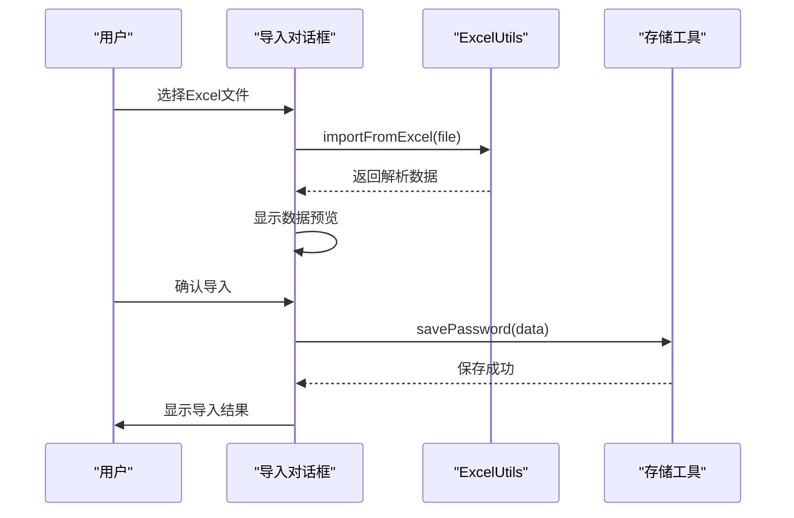

# Excel处理API

<cite>
**本文档引用的文件**
- [utils/excel.ts](file://utils/excel.ts)
- [utils/types.ts](file://utils/types.ts)
- [components/ImportDialog.vue](file://components/ImportDialog.vue)
- [entrypoints/options/App.vue](file://entrypoints/options/App.vue)
- [README.md](file://README.md)
- [package.json](file://package.json)
</cite>

## 目录
1. [简介](#简介)
2. [项目结构](#项目结构)
3. [核心组件](#核心组件)
4. [架构概览](#架构概览)
5. [详细组件分析](#详细组件分析)
6. [依赖关系分析](#依赖关系分析)
7. [性能考虑](#性能考虑)
8. [故障排除指南](#故障排除指南)
9. [结论](#结论)
10. [附录](#附录)

## 简介
Account Password Helper插件提供了完整的Excel文件导入导出功能，支持多语言列名映射、数据验证和模板下载。本文档详细说明了ExcelUtils工具类的所有公共方法，包括文件解析、数据转换、模板生成和错误处理机制。

## 项目结构
该项目采用Vue3 + TypeScript + WXT框架构建，Excel处理功能位于utils目录下的excel.ts文件中，通过xlsx库实现Excel文件的读写操作。


**图表来源**
- [utils/excel.ts](file://utils/excel.ts#L1-L155)
- [utils/types.ts](file://utils/types.ts#L1-L96)

**章节来源**
- [package.json](file://package.json#L22-L27)

## 核心组件
ExcelUtils工具类是整个Excel处理系统的核心，提供了三个主要功能：
- 导出密码数据到Excel文件
- 从Excel文件导入密码数据
- 下载标准Excel模板文件

**章节来源**
- [utils/excel.ts](file://utils/excel.ts#L4-L155)

## 架构概览
Excel处理API采用分层架构设计，确保了良好的模块化和可维护性。



**图表来源**
- [utils/excel.ts](file://utils/excel.ts#L8-L45)
- [utils/excel.ts](file://utils/excel.ts#L50-L114)
- [utils/excel.ts](file://utils/excel.ts#L119-L153)

## 详细组件分析

### ExcelUtils工具类

ExcelUtils是一个静态类，提供了完整的Excel文件处理能力。该类的设计遵循单一职责原则，每个方法都专注于特定的功能。

#### 类结构图


**图表来源**
- [utils/excel.ts](file://utils/excel.ts#L4-L155)
- [utils/types.ts](file://utils/types.ts#L4-L41)

#### 导出功能 (exportToExcel)

导出功能负责将密码数据转换为Excel格式并保存到用户设备。

**方法签名**: `exportToExcel(passwords: PasswordEntry[], filename: string = 'passwords.xlsx'): void`

**处理流程**:
1. 数据准备阶段：将PasswordEntry对象转换为Excel友好的格式
2. 工作簿创建：使用xlsx库创建新的工作簿
3. 数据转换：将准备好的数据转换为工作表
4. 样式设置：设置列宽以确保最佳显示效果
5. 文件输出：将工作簿保存到用户设备

**数据转换规则**:
- 时间字段转换为本地化字符串格式
- 所有字符串字段进行空白字符清理
- 字段映射到中文列标题

**章节来源**
- [utils/excel.ts](file://utils/excel.ts#L8-L45)

#### 导入功能 (importFromExcel)

导入功能支持从Excel文件中提取密码数据，具有强大的列名映射和数据验证能力。

**方法签名**: `importFromExcel(file: File): Promise<Omit<PasswordEntry, 'id' | 'order'>[]>`

**支持的列名变体**:
- 用户名: `用户名` / `username` / `Username` / `账号`
- 密码: `密码` / `password` / `Password`
- URL: `URL` / `url` / `网址` / `链接`
- 标签: `标签` / `tag` / `Tag` / `分类`
- 备注: `备注` / `remark` / `Remark` / `说明`
- 创建时间: `创建时间` / `createTime` / `CreateTime`
- 更新时间: `更新时间` / `updateTime` / `UpdateTime` / `修改时间` / `modifyTime`

**数据验证机制**:
- 必填字段验证：用户名不能为空
- 数据类型转换：自动转换为适当的JavaScript类型
- 空白字符处理：自动清理首尾空白字符
- 时间字段处理：支持多种时间格式

**章节来源**
- [utils/excel.ts](file://utils/excel.ts#L50-L114)

#### 模板下载功能 (downloadTemplate)

模板下载功能提供标准格式的Excel模板文件，帮助用户快速创建符合要求的导入文件。

**方法签名**: `downloadTemplate(): void`

**模板特征**:
- 包含完整的列标题（中文和英文）
- 预填充示例数据
- 标准化的列宽设置
- 特定标记表明必填字段

**章节来源**
- [utils/excel.ts](file://utils/excel.ts#L119-L153)

### 数据模型

ExcelUtils处理的数据基于PasswordEntry接口定义，该接口包含了密码管理所需的所有字段。


**图表来源**
- [utils/types.ts](file://utils/types.ts#L4-L41)

**章节来源**
- [utils/types.ts](file://utils/types.ts#L1-L96)

### 界面集成

Excel处理功能与Vue组件紧密集成，提供了完整的用户交互体验。

#### 导入对话框集成



**图表来源**
- [components/ImportDialog.vue](file://components/ImportDialog.vue#L146-L195)
- [entrypoints/options/App.vue](file://entrypoints/options/App.vue#L1667-L1690)

**章节来源**
- [components/ImportDialog.vue](file://components/ImportDialog.vue#L1-L200)
- [entrypoints/options/App.vue](file://entrypoints/options/App.vue#L1660-L1690)

## 依赖关系分析

Excel处理API的依赖关系相对简单，主要依赖于xlsx库来处理Excel文件操作。


**图表来源**
- [utils/excel.ts](file://utils/excel.ts#L1-L2)
- [package.json](file://package.json#L22-L27)

**章节来源**
- [package.json](file://package.json#L22-L27)

## 性能考虑

### 文件大小处理
- 导入功能使用FileReader异步处理，避免阻塞主线程
- 大文件导入时采用流式处理，减少内存占用
- 数据过滤在解析过程中进行，避免不必要的数据传输

### 内存管理
- 使用Promise和async/await避免回调地狱
- 及时清理事件监听器和临时变量
- 合理设置工作表列宽，避免过度渲染

### 错误处理策略
- 采用分层错误处理机制
- 提供详细的错误信息和恢复建议
- 实现优雅降级，确保用户体验

## 故障排除指南

### 常见问题及解决方案

#### Excel文件格式问题
**症状**: 导入失败，提示文件格式不正确
**原因**: Excel文件格式不符合要求
**解决方案**: 
- 确保使用.xlsx或.xls格式
- 检查文件是否被其他程序锁定
- 验证文件完整性

#### 列名映射失败
**症状**: 导入数据为空或部分字段缺失
**原因**: Excel列名不在支持的映射范围内
**解决方案**:
- 使用标准列名：用户名、密码、URL、标签、备注
- 确保必填字段存在
- 检查是否有隐藏字符或特殊格式

#### 数据验证错误
**症状**: 导入后数据丢失或格式异常
**原因**: 数据类型不匹配或格式错误
**解决方案**:
- 确保用户名字段非空
- 检查URL格式的有效性
- 验证时间字段的格式

#### 性能问题
**症状**: 大文件导入缓慢或内存不足
**原因**: 文件过大或系统资源限制
**解决方案**:
- 分批处理大文件
- 关闭其他占用内存的应用
- 确保浏览器有足够的可用内存

**章节来源**
- [README.md](file://README.md#L184-L186)

## 结论

Excel处理API为Account Password Helper插件提供了强大而灵活的数据交换能力。通过支持多语言列名映射、完善的错误处理机制和标准化的数据格式，该API能够满足不同用户的需求。

主要优势包括：
- **多语言支持**: 支持中文和英文列名，适应国际化需求
- **数据验证**: 强大的数据验证和清理机制
- **用户友好**: 提供模板下载和错误提示
- **性能优化**: 异步处理和内存管理优化

未来可以考虑的改进方向：
- 支持更多Excel格式变体
- 增加数据导入进度反馈
- 实现批量处理的撤销功能
- 添加数据导入历史记录

## 附录

### API使用示例

#### 导出密码数据
```typescript
// 导出所有密码到Excel文件
ExcelUtils.exportToExcel(passwords);

// 导出自定义名称的文件
ExcelUtils.exportToExcel(passwords, 'my_passwords.xlsx');
```

#### 导入Excel文件
```typescript
// 导入Excel文件并获取数据
try {
  const data = await ExcelUtils.importFromExcel(file);
  console.log(`成功导入 ${data.length} 条数据`);
} catch (error) {
  console.error('导入失败:', error.message);
}
```

#### 下载模板文件
```typescript
// 下载标准模板文件
ExcelUtils.downloadTemplate();
```

### 支持的文件格式
- **导入格式**: .xlsx, .xls
- **导出格式**: .xlsx
- **模板格式**: .xlsx

### 数据类型规范
- **字符串字段**: 用户名、密码、URL、标签、备注
- **时间字段**: createTime, updateTime (支持多种格式)
- **必填字段**: 用户名
- **可选字段**: 密码、URL、标签、备注、时间字段

### 错误处理机制
- **导入错误**: 文件读取失败、格式不正确、数据验证失败
- **导出错误**: 文件写入失败、数据转换错误
- **模板错误**: 模板生成失败、文件下载失败