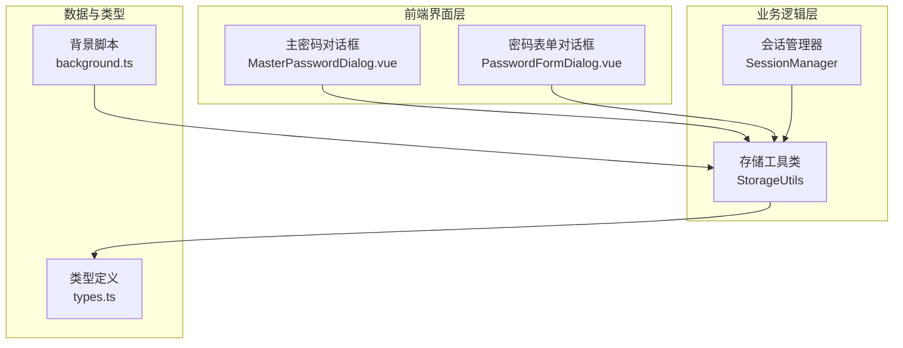
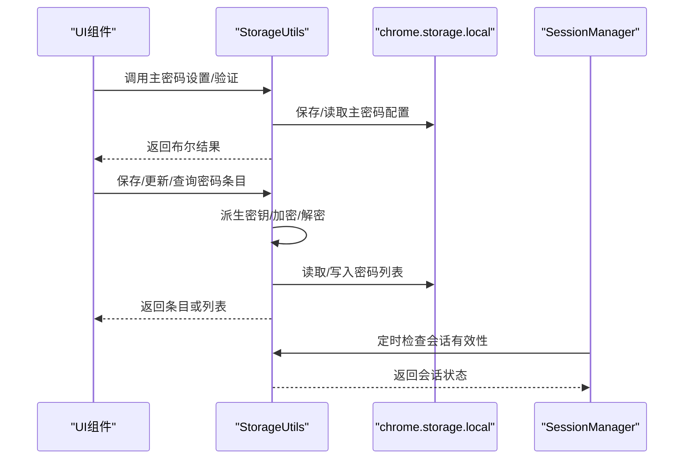
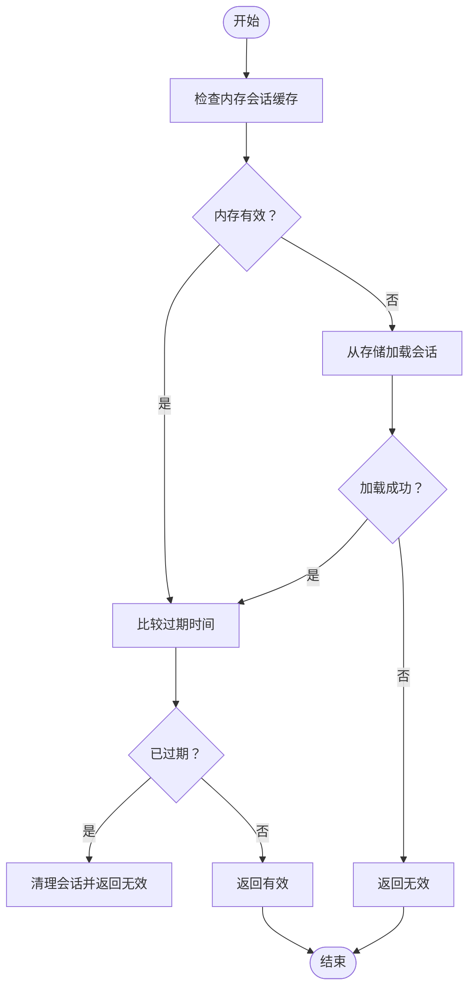
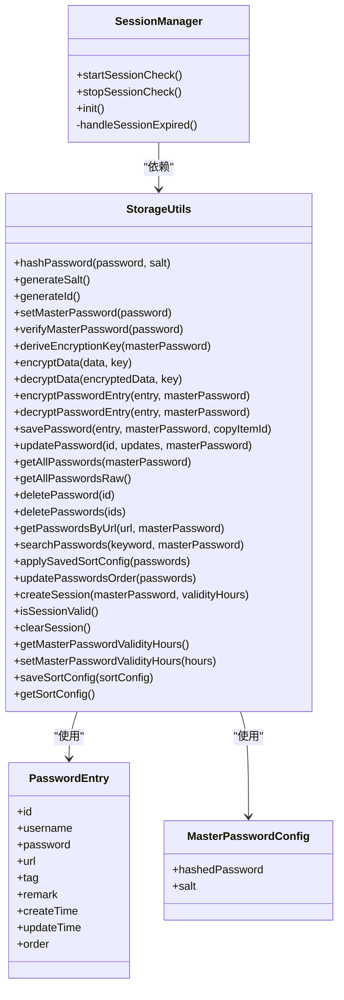

# 存储管理API

<cite>
**本文引用的文件**
- [utils/storage.ts](file://utils/storage.ts)
- [utils/types.ts](file://utils/types.ts)
- [utils/sessionManager.ts](file://utils/sessionManager.ts)
- [components/MasterPasswordDialog.vue](file://components/MasterPasswordDialog.vue)
- [components/PasswordFormDialog.vue](file://components/PasswordFormDialog.vue)
- [entrypoints/background.ts](file://entrypoints/background.ts)
- [package.json](file://package.json)
- [README.md](file://README.md)
</cite>

## 目录
1. [简介](#简介)
2. [项目结构](#项目结构)
3. [核心组件](#核心组件)
4. [架构总览](#架构总览)
5. [详细组件分析](#详细组件分析)
6. [依赖关系分析](#依赖关系分析)
7. [性能考虑](#性能考虑)
8. [故障排查指南](#故障排查指南)
9. [结论](#结论)
10. [附录](#附录)

## 简介
本文件为 Account Password Helper 的“存储管理API”提供完整接口文档，覆盖 PasswordEntry 数据模型、MasterPasswordConfig 配置结构、加密存储机制、主密码验证流程、会话管理以及所有存储操作（增删改查、批量操作、排序与搜索）。同时给出错误处理指南、数据完整性检查建议与性能优化策略，并提供实际调用示例与最佳实践。

## 项目结构
- 存储与加密核心：utils/storage.ts
- 类型定义：utils/types.ts
- 会话管理：utils/sessionManager.ts
- UI交互组件：components/MasterPasswordDialog.vue、components/PasswordFormDialog.vue
- 背景脚本：entrypoints/background.ts
- 依赖与构建：package.json
- 项目说明：README.md

图表来源
- [utils/storage.ts](file://utils/storage.ts#L37-L981)
- [utils/types.ts](file://utils/types.ts#L1-L96)
- [utils/sessionManager.ts](file://utils/sessionManager.ts#L1-L87)
- [components/MasterPasswordDialog.vue](file://components/MasterPasswordDialog.vue#L1-L447)
- [components/PasswordFormDialog.vue](file://components/PasswordFormDialog.vue#L1-L336)
- [entrypoints/background.ts](file://entrypoints/background.ts#L1-L232)

章节来源
- [utils/storage.ts](file://utils/storage.ts#L1-L981)
- [utils/types.ts](file://utils/types.ts#L1-L96)
- [utils/sessionManager.ts](file://utils/sessionManager.ts#L1-L87)
- [components/MasterPasswordDialog.vue](file://components/MasterPasswordDialog.vue#L1-L447)
- [components/PasswordFormDialog.vue](file://components/PasswordFormDialog.vue#L1-L336)
- [entrypoints/background.ts](file://entrypoints/background.ts#L1-L232)

## 核心组件
- 存储工具类 StorageUtils：提供主密码设置/验证、加密/解密、密码条目 CRUD、批量操作、排序与搜索、会话管理、配置持久化等能力。
- 会话管理器 SessionManager：负责定时检查会话有效性、触发过期事件、清理会话。
- 类型定义 types.ts：定义 PasswordEntry、MasterPasswordConfig、消息类型等。
- UI组件：主密码对话框与密码表单对话框，负责与 StorageUtils 的交互。

章节来源
- [utils/storage.ts](file://utils/storage.ts#L37-L981)
- [utils/sessionManager.ts](file://utils/sessionManager.ts#L1-L87)
- [utils/types.ts](file://utils/types.ts#L1-L96)

## 架构总览
存储管理API围绕 StorageUtils 展开，结合会话管理与UI组件，形成“主密码保护 + 本地加密存储 + 会话缓存”的整体方案。数据通过 chrome.storage.local 持久化，敏感字段（如密码）在内存中使用派生密钥加密存储；会话期间对主密码进行加密缓存，避免明文泄露。

图表来源
- [utils/storage.ts](file://utils/storage.ts#L76-L143)
- [utils/storage.ts](file://utils/storage.ts#L377-L461)
- [utils/storage.ts](file://utils/storage.ts#L514-L555)
- [utils/sessionManager.ts](file://utils/sessionManager.ts#L27-L80)

## 详细组件分析

### 数据模型与配置

#### PasswordEntry 数据模型
- 字段定义与约束
  - id: string，唯一标识，系统自动生成
  - username: string，必填，账号/邮箱/手机号/用户名/用户号
  - password: string，必填，密码（加密存储）
  - url: string，可选，网站或应用地址；为空表示全局匹配
  - tag: string，可选，标签（如工作/个人）
  - remark: string，可选，备注
  - createTime: number，必填，毫秒级时间戳
  - updateTime: number，必填，毫秒级时间戳
  - order: number，必填，排序序号

- 字段约束与语义
  - username/password 必填，确保基本可用性
  - url 支持模糊匹配，空值表示全局匹配
  - createTime/updateTime 由系统维护，用于排序与审计
  - order 由系统维护，支持拖拽排序

章节来源
- [utils/types.ts](file://utils/types.ts#L4-L41)

#### MasterPasswordConfig 配置结构
- 字段定义
  - hashedPassword: string，主密码的哈希值
  - salt: string，盐值，用于哈希与密钥派生

- 约束与用途
  - 仅保存哈希与盐值，不保存明文主密码
  - salt 用于 PBKDF2 派生密钥与 MD5 哈希

章节来源
- [utils/types.ts](file://utils/types.ts#L46-L49)

### 加密与存储机制

#### 主密码设置与验证
- 设置主密码
  - 生成随机盐值
  - 使用 MD5 对“主密码+盐值”计算哈希
  - 将 {hashedPassword, salt} 写入 chrome.storage.local
  - 立即验证设置结果
- 验证主密码
  - 读取配置，拼接输入与盐值，计算哈希并与 stored 比较
- 检查是否已设置主密码
  - 读取配置并校验字段完整性

章节来源
- [utils/storage.ts](file://utils/storage.ts#L76-L159)

#### 密钥派生与数据加解密
- 密钥派生
  - 使用 PBKDF2 从主密码 + 盐值派生 256 位密钥
  - 迭代次数 10000，提升抗暴力破解能力
- 数据加密
  - AES-256-CBC，随机 IV，Pkcs7 填充
  - 密文与 IV 拼接并 Base64 编码
- 数据解密
  - Base64 解码后提取 IV 与密文
  - 使用相同参数解密，UTF-8 解码
  - 安全降级：异常时返回原始数据或空串

章节来源
- [utils/storage.ts](file://utils/storage.ts#L164-L186)
- [utils/storage.ts](file://utils/storage.ts#L191-L214)
- [utils/storage.ts](file://utils/storage.ts#L219-L297)

#### 密码条目加密策略
- 仅对 password 字段加密，username、remark 等保持明文
- 条目保存时根据是否存在主密码决定是否加密
- 查询时自动识别加密条目并解密

章节来源
- [utils/storage.ts](file://utils/storage.ts#L302-L322)
- [utils/storage.ts](file://utils/storage.ts#L327-L356)
- [utils/storage.ts](file://utils/storage.ts#L514-L555)

### 会话管理机制
- 会话创建
  - 生成会话加密密钥（基于盐值或随机组合）
  - 加密主密码并持久化会话信息（含过期时间）
- 会话验证
  - 优先检查内存缓存，其次从存储恢复
  - 比较当前时间与过期时间，过期则清理并返回无效
- 会话清理
  - 清空内存缓存并移除持久化会话键
- 定时检查
  - 每分钟检查一次，过期触发自定义事件并清理

图表来源
- [utils/storage.ts](file://utils/storage.ts#L826-L841)
- [utils/storage.ts](file://utils/storage.ts#L865-L894)
- [utils/storage.ts](file://utils/storage.ts#L899-L916)
- [utils/sessionManager.ts](file://utils/sessionManager.ts#L27-L80)

章节来源
- [utils/storage.ts](file://utils/storage.ts#L826-L958)
- [utils/sessionManager.ts](file://utils/sessionManager.ts#L1-L87)

### 存储操作API

#### 主密码相关
- setMasterPassword(password: string): Promise<void>
  - 设置主密码并立即验证
- verifyMasterPassword(password: string): Promise<boolean>
  - 验证主密码
- hasMasterPassword(): Promise<boolean>
  - 检查是否已设置主密码
- resetMasterPassword(): Promise<void>
  - 清空主密码配置

章节来源
- [utils/storage.ts](file://utils/storage.ts#L76-L159)
- [utils/storage.ts](file://utils/storage.ts#L707-L714)

#### 密码条目管理
- savePassword(entry: Omit<PasswordEntry,'id'|'order'>, masterPassword?: string, copyItemId?: string): Promise<PasswordEntry>
  - 新增条目，自动生成 id 与 order，支持复制插入
- updatePassword(id: string, updates: Partial<PasswordEntry>, masterPassword?: string): Promise<void>
  - 更新指定条目
- getAllPasswords(masterPassword?: string): Promise<PasswordEntry[]>
  - 获取全部条目，自动解密加密条目
- getAllPasswordsRaw(): Promise<(PasswordEntry|EncryptedPasswordEntry)[]>
  - 获取原始数据（不解密）
- deletePassword(id: string): Promise<void>
  - 删除单个条目
- deletePasswords(ids: string[]): Promise<void>
  - 批量删除条目

章节来源
- [utils/storage.ts](file://utils/storage.ts#L377-L461)
- [utils/storage.ts](file://utils/storage.ts#L466-L492)
- [utils/storage.ts](file://utils/storage.ts#L497-L509)
- [utils/storage.ts](file://utils/storage.ts#L514-L555)

#### 搜索与排序
- getPasswordsByUrl(url: string, masterPassword?: string): Promise<PasswordEntry[]>
  - 根据 URL 搜索，支持模糊匹配
- searchPasswords(keyword: string, masterPassword?: string): Promise<PasswordEntry[]>
  - 按关键字搜索 username/tag/remark/url
- applySavedSortConfig(passwords: PasswordEntry[]): Promise<void>
  - 应用保存的排序配置
- updatePasswordsOrder(passwords: PasswordEntry[]): Promise<void>
  - 更新排序并持久化

章节来源
- [utils/storage.ts](file://utils/storage.ts#L558-L602)
- [utils/storage.ts](file://utils/storage.ts#L605-L690)

#### 会话与配置
- createSession(masterPassword: string, validityHours: number): Promise<void>
  - 创建会话缓存
- isSessionValid(): Promise<boolean>
  - 检查会话有效性
- clearSession(): Promise<void>
  - 清除会话
- getMasterPasswordValidityHours(): Promise<number>
  - 获取主密码有效期（小时）
- setMasterPasswordValidityHours(hours: number): Promise<void>
  - 设置主密码有效期（1-24小时）
- saveSortConfig(sortConfig: {prop:string, order:string}): Promise<void>
  - 保存排序配置
- getSortConfig(): Promise<{prop:string, order:string}|null>
  - 获取排序配置

章节来源
- [utils/storage.ts](file://utils/storage.ts#L865-L894)
- [utils/storage.ts](file://utils/storage.ts#L899-L958)
- [utils/storage.ts](file://utils/storage.ts#L719-L760)
- [utils/storage.ts](file://utils/storage.ts#L765-L788)

### UI集成与调用示例

#### 主密码对话框与存储
- 首次使用：弹窗要求设置主密码，调用 setMasterPassword 并提示成功
- 验证主密码：弹窗要求输入，调用 verifyMasterPassword 并提示成功
- 错误处理：输入为空、验证失败、网络异常均在弹窗内提示并聚焦输入框

章节来源
- [components/MasterPasswordDialog.vue](file://components/MasterPasswordDialog.vue#L178-L237)
- [utils/storage.ts](file://utils/storage.ts#L76-L159)

#### 密码表单对话框与存储
- 新增密码：表单校验通过后调用 savePassword
- 编辑密码：表单校验通过后调用 updatePassword
- 成功/失败提示：统一使用消息组件反馈

章节来源
- [components/PasswordFormDialog.vue](file://components/PasswordFormDialog.vue#L158-L199)
- [utils/storage.ts](file://utils/storage.ts#L377-L461)

## 依赖关系分析

图表来源
- [utils/storage.ts](file://utils/storage.ts#L37-L981)
- [utils/sessionManager.ts](file://utils/sessionManager.ts#L1-L87)
- [utils/types.ts](file://utils/types.ts#L1-L96)

章节来源
- [utils/storage.ts](file://utils/storage.ts#L37-L981)
- [utils/sessionManager.ts](file://utils/sessionManager.ts#L1-L87)
- [utils/types.ts](file://utils/types.ts#L1-L96)

## 性能考虑
- 加密成本控制
  - PBKDF2 迭代次数较高（10000），建议在后台线程或空闲时段执行
  - 批量操作时尽量合并存储写入，减少多次 chrome.storage.local.set 调用
- 解密策略
  - 仅对 password 字段解密，避免不必要的字段处理
  - 解密失败时安全降级，不影响其他字段
- 排序与搜索
  - 搜索与排序在内存中进行，建议限制列表规模或分页
  - 保存排序配置，避免每次渲染重复计算
- 会话检查
  - 每分钟检查一次，频率适中；可在页面不可见时降低检查频率

[本节为通用性能建议，无需特定文件引用]

## 故障排查指南
- 主密码设置失败
  - 检查输入是否为空；确认保存后立即验证
  - 查看存储写入是否成功
- 验证失败
  - 确认输入与盐值拼接后哈希一致
  - 检查存储中配置是否完整
- 解密异常
  - 检查密钥来源（主密码+盐值）是否正确
  - 检查 Base64 数据是否完整
  - 若出现畸形数据，系统会安全降级返回空串或原始数据
- 会话过期
  - 检查过期时间与当前时间
  - 清理会话后重新创建
- 存储读写失败
  - 检查 chrome.storage.local 权限与配额
  - 分批写入，避免一次性写入过多数据

章节来源
- [utils/storage.ts](file://utils/storage.ts#L110-L114)
- [utils/storage.ts](file://utils/storage.ts#L139-L142)
- [utils/storage.ts](file://utils/storage.ts#L285-L297)
- [utils/storage.ts](file://utils/storage.ts#L826-L841)
- [utils/storage.ts](file://utils/storage.ts#L422-L426)

## 结论
本存储管理API以主密码保护为核心，结合 PBKDF2 密钥派生与 AES-256-CBC 加密，实现了对敏感数据的安全存储；通过会话缓存与定时检查保障用户体验与安全性；提供完善的 CRUD、批量操作、排序与搜索能力，满足日常密码管理需求。建议在生产环境中进一步优化加密迭代次数与存储写入策略，并持续监控会话与存储稳定性。

[本节为总结性内容，无需特定文件引用]

## 附录

### API调用示例（路径指引）
- 设置主密码
  - [setMasterPassword](file://utils/storage.ts#L76-L114)
- 验证主密码
  - [verifyMasterPassword](file://utils/storage.ts#L119-L143)
- 保存密码条目
  - [savePassword](file://utils/storage.ts#L377-L426)
- 更新密码条目
  - [updatePassword](file://utils/storage.ts#L431-L461)
- 获取全部密码条目
  - [getAllPasswords](file://utils/storage.ts#L514-L555)
- 搜索密码条目
  - [searchPasswords](file://utils/storage.ts#L581-L602)
- 创建会话
  - [createSession](file://utils/storage.ts#L865-L894)
- 检查会话有效性
  - [isSessionValid](file://utils/storage.ts#L793-L841)

### 最佳实践
- 主密码管理
  - 首次使用必须设置主密码；建议使用强口令并妥善备份
  - 定期检查主密码有效期设置（1-24小时）
- 数据安全
  - 仅在需要时传入 masterPassword；避免在 UI 层暴露明文
  - 对外输出前再次确认解密成功
- 性能优化
  - 批量操作合并写入；避免频繁读写
  - 搜索与排序尽量在内存中完成，减少存储访问
- 错误处理
  - 对所有异步操作进行 try/catch 包裹
  - 对解密失败进行安全降级，保证 UI 不中断

[本节为通用建议，无需特定文件引用]