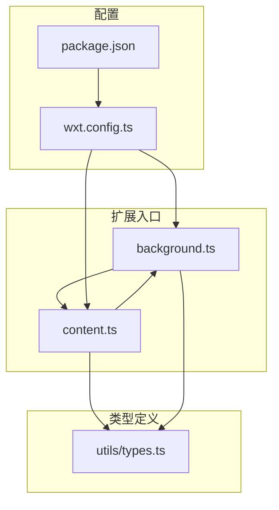
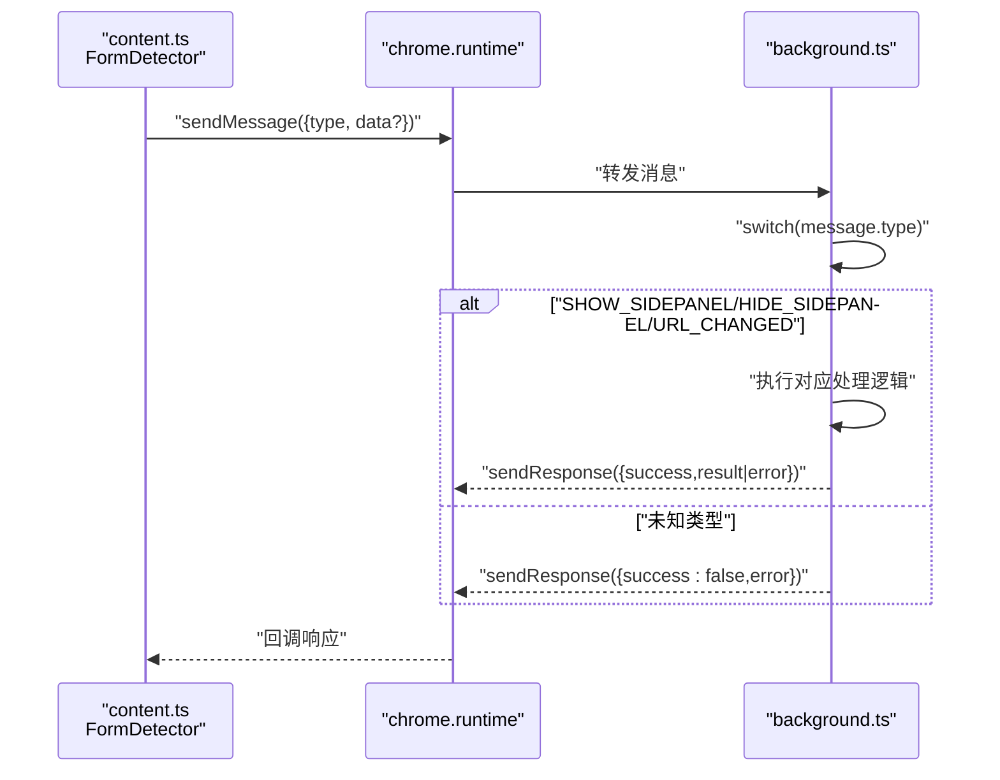
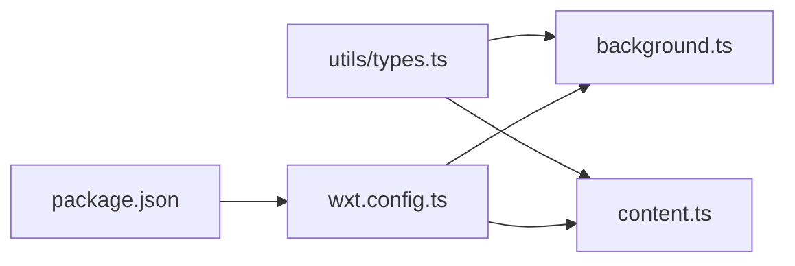

# 消息通信协议

<cite>
**本文引用的文件**
- [utils/types.ts](file://utils/types.ts)
- [entrypoints/background.ts](file://entrypoints/background.ts)
- [entrypoints/content.ts](file://entrypoints/content.ts)
- [wxt.config.ts](file://wxt.config.ts)
- [package.json](file://package.json)
</cite>

## 目录
1. [简介](#简介)
2. [项目结构](#项目结构)
3. [核心组件](#核心组件)
4. [架构总览](#架构总览)
5. [详细组件分析](#详细组件分析)
6. [依赖分析](#依赖分析)
7. [性能考量](#性能考量)
8. [故障排查指南](#故障排查指南)
9. [结论](#结论)
10. [附录](#附录)

## 简介
本文件为 Account Password Helper 插件的消息通信协议提供权威、可操作的技术文档。重点涵盖：
- Message 接口与 MessageType 枚举的完整定义
- 各消息类型的用途、参数格式与响应机制
- Chrome 扩展消息传递的完整流程（content script ↔ background script）
- 异步处理与错误处理规范
- 实际代码示例路径（以源码路径代替具体代码片段）

## 项目结构
本项目基于 WXT + Vue3 + TypeScript，消息通信主要分布在 content 脚本与 background 脚本之间，配合 utils/types.ts 中的类型定义统一消息契约。

图表来源
- [entrypoints/background.ts](file://entrypoints/background.ts#L1-L232)
- [entrypoints/content.ts](file://entrypoints/content.ts#L1-L1892)
- [utils/types.ts](file://utils/types.ts#L1-L96)
- [wxt.config.ts](file://wxt.config.ts#L1-L48)
- [package.json](file://package.json#L1-L49)

章节来源
- [entrypoints/background.ts](file://entrypoints/background.ts#L1-L232)
- [entrypoints/content.ts](file://entrypoints/content.ts#L1-L1892)
- [utils/types.ts](file://utils/types.ts#L1-L96)
- [wxt.config.ts](file://wxt.config.ts#L1-L48)
- [package.json](file://package.json#L1-L49)

## 核心组件
- Message 接口：统一消息载体，包含 type 与可选 data
- MessageType 枚举：定义所有消息类型，涵盖心跳、表单检测、密码/验证码填充、侧边栏控制、URL 变化通知、密码列表获取等
- content.ts 中的 FormDetector：负责表单检测、事件监听、消息处理与侧边栏控制
- background.ts：负责侧边栏显示/隐藏、URL 变化处理、快捷键与选项页管理

章节来源
- [utils/types.ts](file://utils/types.ts#L52-L96)
- [entrypoints/content.ts](file://entrypoints/content.ts#L1184-L1217)
- [entrypoints/background.ts](file://entrypoints/background.ts#L34-L73)

## 架构总览
消息在 content script 与 background script 之间通过 chrome.runtime.sendMessage/onMessage 实现双向通信。content script 作为“请求方”主动发送消息；background script 作为“处理方”根据消息类型执行相应逻辑并返回响应。

图表来源
- [entrypoints/content.ts](file://entrypoints/content.ts#L998-L1000)
- [entrypoints/background.ts](file://entrypoints/background.ts#L34-L73)

章节来源
- [entrypoints/content.ts](file://entrypoints/content.ts#L998-L1000)
- [entrypoints/background.ts](file://entrypoints/background.ts#L34-L73)

## 详细组件分析

### Message 接口与 MessageType 枚举
- Message 接口
  - type: MessageType（必填）
  - data: any（可选）
- MessageType 枚举
  - PING：心跳/就绪检测
  - DETECT_FORM：表单检测（由 content.ts 内部逻辑驱动，非外部显式发送）
  - FILL_PASSWORD：填充账号+密码
  - FILL_MOBILE_CODE：填充手机号（不含短信验证码）
  - SHOW_SIDEPANEL：显示侧边栏
  - HIDE_SIDEPANEL：隐藏侧边栏
  - URL_CHANGED：通知 URL 变化
  - GET_PASSWORDS：获取密码列表（当前未在 background.ts 中实现）

章节来源
- [utils/types.ts](file://utils/types.ts#L52-L96)

### PING（心跳/就绪检测）
- 用途：验证 content script 是否在线、就绪
- 发送端：任意需要确认 content script 状态的模块
- 参数：无
- 响应：success=true，message=“content script is ready”

章节来源
- [entrypoints/content.ts](file://entrypoints/content.ts#L1187-L1189)

### DETECT_FORM（表单检测）
- 用途：内部表单检测逻辑，content.ts 内部驱动，不对外暴露为外部消息
- 触发：页面加载、DOM 变化、焦点事件、定时检测
- 结果：更新内部字段集合与登录表单类型，决定是否显示侧边栏

章节来源
- [entrypoints/content.ts](file://entrypoints/content.ts#L172-L476)

### FILL_PASSWORD（填充账号+密码）
- 用途：将指定用户名与密码填充到页面对应输入框
- 发送端：popup/sidepanel 或其他调用方
- 参数：{ username: string; password: string }
- 响应：success=true，message=“填充完成”
- 行为：填充后自动勾选最近复选框，随后隐藏侧边栏

章节来源
- [entrypoints/content.ts](file://entrypoints/content.ts#L1190-L1193)
- [entrypoints/content.ts](file://entrypoints/content.ts#L1222-L1250)

### FILL_MOBILE_CODE（填充手机号）
- 用途：将手机号填充到页面输入框（不含短信验证码）
- 发送端：popup/sidepanel 或其他调用方
- 参数：{ mobile: string; code: string }（code 仅用于占位，当前实现不填充验证码）
- 响应：success=true，message=“填充完成”
- 行为：触发电话号码专用事件序列，自动勾选最近复选框，随后隐藏侧边栏

章节来源
- [entrypoints/content.ts](file://entrypoints/content.ts#L1194-L1197)
- [entrypoints/content.ts](file://entrypoints/content.ts#L1255-L1306)

### SHOW_SIDEPANEL（显示侧边栏）
- 用途：请求显示侧边栏
- 发送端：content.ts（自动检测到登录表单时）、popup/sidepanel
- 参数：无
- 响应：
  - 成功：success=true，result=“侧边栏已打开”
  - 失败：success=false，error=错误信息
- 背景处理：若检测到 chrome.sidePanel 可用，则 setOptions(enabled=true) 后 open；否则抛错

章节来源
- [entrypoints/content.ts](file://entrypoints/content.ts#L998-L1000)
- [entrypoints/background.ts](file://entrypoints/background.ts#L36-L45)
- [entrypoints/background.ts](file://entrypoints/background.ts#L76-L109)

### HIDE_SIDEPANEL（隐藏侧边栏）
- 用途：请求隐藏侧边栏
- 发送端：content.ts（页面隐藏/失焦/卸载时）、popup/sidepanel
- 参数：无
- 响应：
  - 成功：success=true，result=“侧边栏已隐藏”
  - 失败：success=false，error=错误信息
- 背景处理：若检测到 chrome.sidePanel 可用，则尝试 close；否则记录警告

章节来源
- [entrypoints/content.ts](file://entrypoints/content.ts#L1018-L1020)
- [entrypoints/background.ts](file://entrypoints/background.ts#L47-L56)
- [entrypoints/background.ts](file://entrypoints/background.ts#L112-L138)

### URL_CHANGED（URL 变化通知）
- 用途：通知后台侧边栏 URL 已变化，便于更新数据
- 发送端：content.ts（页面路由变化、历史记录变化时）
- 参数：{ url: string }
- 响应：
  - 成功：success=true，result=“URL变化处理完成”
  - 失败：success=false，error=错误信息
- 背景处理：校验 tabId，执行 URL 变化处理逻辑

章节来源
- [entrypoints/content.ts](file://entrypoints/content.ts#L1172-L1177)
- [entrypoints/background.ts](file://entrypoints/background.ts#L58-L67)
- [entrypoints/background.ts](file://entrypoints/background.ts#L184-L201)

### GET_PASSWORDS（获取密码列表）
- 用途：请求后台返回密码条目列表
- 发送端：popup/sidepanel
- 参数：无
- 响应：success=true/false，result 或 error
- 现状：当前 background.ts 中未实现该分支，将返回“未知消息类型”

章节来源
- [utils/types.ts](file://utils/types.ts#L84-L86)
- [entrypoints/background.ts](file://entrypoints/background.ts#L69-L72)

## 依赖分析
- 类型依赖：content.ts 与 background.ts 均依赖 utils/types.ts 中的 Message 与 MessageType
- 权限依赖：wxt.config.ts 声明了 storage、activeTab、scripting、sidePanel 等权限，确保消息传递与侧边栏 API 可用
- 版本依赖：Chrome 114+ 支持 sidePanel API；低版本将导致 SHOW/HIDE_SIDEPANEL 失败

图表来源
- [utils/types.ts](file://utils/types.ts#L1-L96)
- [entrypoints/content.ts](file://entrypoints/content.ts#L1-L1892)
- [entrypoints/background.ts](file://entrypoints/background.ts#L1-L232)
- [wxt.config.ts](file://wxt.config.ts#L1-L48)
- [package.json](file://package.json#L1-L49)

章节来源
- [utils/types.ts](file://utils/types.ts#L1-L96)
- [wxt.config.ts](file://wxt.config.ts#L18-L23)

## 性能考量
- content.ts 使用防抖（debounce）与缓存（WeakMap/Set）优化表单检测与侧边栏显示逻辑
- MutationObserver 仅监听关键属性与节点变化，降低不必要的重检频率
- 事件委托（focusin）减少大量监听器数量，提升性能
- 输入值设置与事件分发采用多事件序列，确保兼容性与稳定性

章节来源
- [entrypoints/content.ts](file://entrypoints/content.ts#L9-L19)
- [entrypoints/content.ts](file://entrypoints/content.ts#L38-L51)
- [entrypoints/content.ts](file://entrypoints/content.ts#L93-L170)
- [entrypoints/content.ts](file://entrypoints/content.ts#L611-L636)

## 故障排查指南
- 侧边栏不显示
  - 检查 Chrome 版本是否支持 sidePanel API（Chrome 114+）
  - 确认插件已正确安装并启用
  - 查看后台日志中关于“当前Chrome版本不支持sidePanel API”的警告
- 无法隐藏侧边栏
  - 当前官方未提供 close 方法，实现采用“禁用再启用”或“切换标签页”等变通方案
  - 若报错，检查 setOptions 调用是否成功
- URL 变化未触发
  - 确认 content.ts 的路由监听与 popstate 监听是否生效
  - 检查发送 URL_CHANGED 的 data.url 是否正确
- 填充失败
  - 检查 content.ts 的输入值设置与事件分发是否成功
  - 确认页面已完全加载，动态表单需刷新后检测
- GET_PASSWORDS 无效
  - 当前后台未实现该分支，将返回“未知消息类型”，需补充实现

章节来源
- [entrypoints/background.ts](file://entrypoints/background.ts#L95-L99)
- [entrypoints/background.ts](file://entrypoints/background.ts#L205-L231)
- [entrypoints/content.ts](file://entrypoints/content.ts#L1169-L1182)
- [entrypoints/content.ts](file://entrypoints/content.ts#L1308-L1375)
- [entrypoints/background.ts](file://entrypoints/background.ts#L69-L72)

## 结论
本消息通信协议以 Message/MessageType 为核心，围绕 content script 与 background script 的双向消息传递构建，覆盖表单检测、密码填充、侧边栏控制、URL 变化通知等关键能力。通过严格的类型约束与完善的错误处理，保证了跨脚本通信的可靠性与可维护性。后续可在 GET_PASSWORDS 等消息类型上进一步完善，以满足更丰富的业务场景。

## 附录

### 消息类型一览与规范
- PING
  - 发送：任意
  - 参数：无
  - 响应：success=true，message=“content script is ready”
- DETECT_FORM
  - 触发：content.ts 内部
  - 参数：无
  - 响应：内部处理，不对外返回
- FILL_PASSWORD
  - 发送：popup/sidepanel
  - 参数：{ username: string; password: string }
  - 响应：success=true，message=“填充完成”
- FILL_MOBILE_CODE
  - 发送：popup/sidepanel
  - 参数：{ mobile: string; code: string }
  - 响应：success=true，message=“填充完成”
- SHOW_SIDEPANEL
  - 发送：content.ts/popup/sidepanel
  - 参数：无
  - 响应：success=true/false，result/error
- HIDE_SIDEPANEL
  - 发送：content.ts/popup/sidepanel
  - 参数：无
  - 响应：success=true/false，result/error
- URL_CHANGED
  - 发送：content.ts
  - 参数：{ url: string }
  - 响应：success=true/false，result/error
- GET_PASSWORDS
  - 发送：popup/sidepanel
  - 参数：无
  - 响应：success=true/false，result/error（当前未实现）

章节来源
- [utils/types.ts](file://utils/types.ts#L52-L96)
- [entrypoints/content.ts](file://entrypoints/content.ts#L1184-L1217)
- [entrypoints/background.ts](file://entrypoints/background.ts#L34-L73)