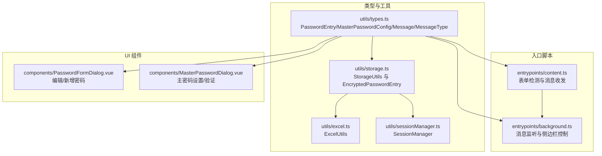
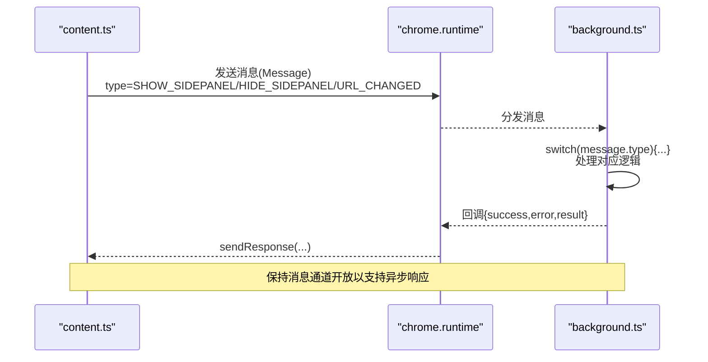
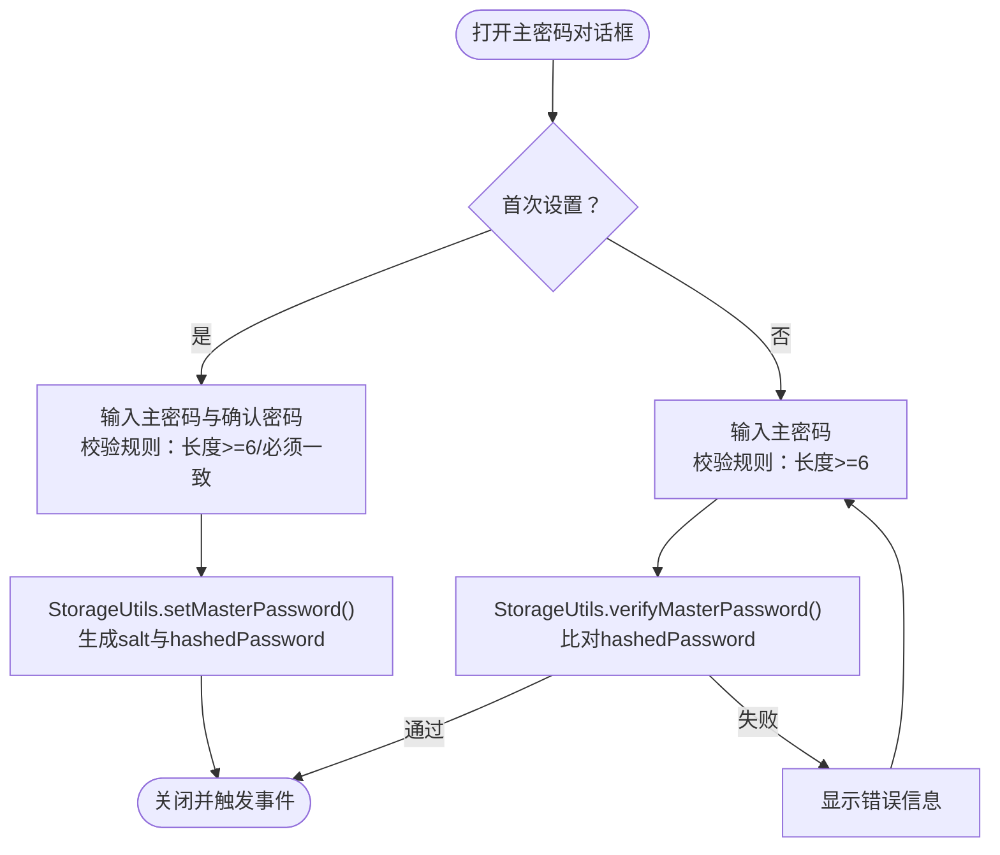
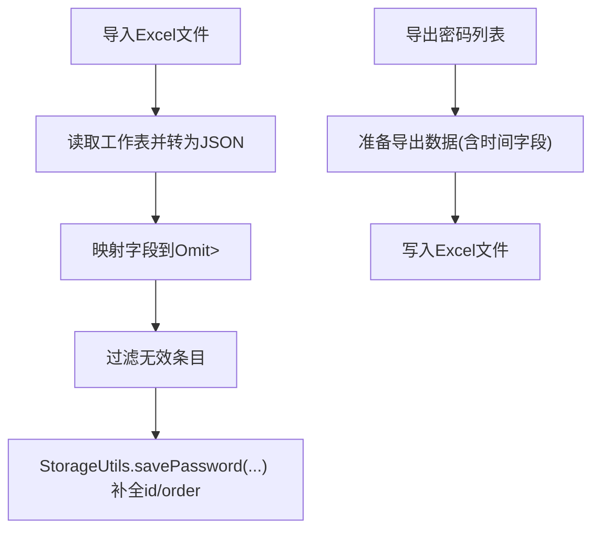
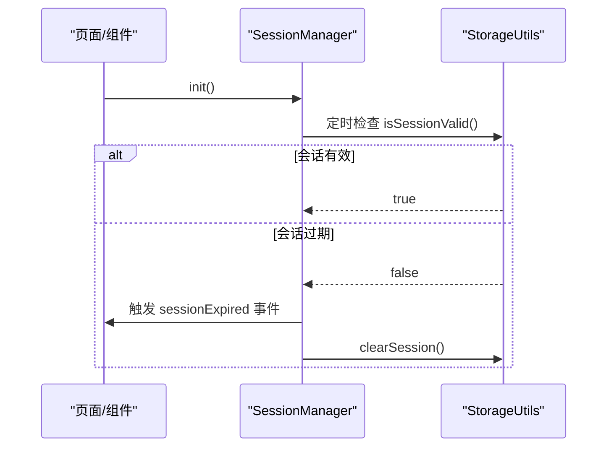
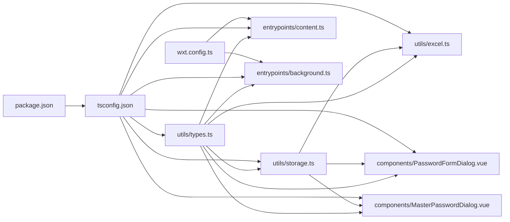

# 类型定义参考

<cite>
**本文引用的文件**
- [utils/types.ts](file://utils/types.ts)
- [utils/storage.ts](file://utils/storage.ts)
- [entrypoints/background.ts](file://entrypoints/background.ts)
- [entrypoints/content.ts](file://entrypoints/content.ts)
- [utils/excel.ts](file://utils/excel.ts)
- [components/PasswordFormDialog.vue](file://components/PasswordFormDialog.vue)
- [components/MasterPasswordDialog.vue](file://components/MasterPasswordDialog.vue)
- [utils/sessionManager.ts](file://utils/sessionManager.ts)
- [tsconfig.json](file://tsconfig.json)
- [package.json](file://package.json)
- [wxt.config.ts](file://wxt.config.ts)
</cite>

## 目录
1. [简介](#简介)
2. [项目结构](#项目结构)
3. [核心类型与接口](#核心类型与接口)
4. [架构总览](#架构总览)
5. [组件与类型关系详解](#组件与类型关系详解)
6. [依赖关系分析](#依赖关系分析)
7. [性能与类型安全建议](#性能与类型安全建议)
8. [故障排查与常见错误](#故障排查与常见错误)
9. [结论](#结论)
10. [附录：类型速查表](#附录类型速查表)

## 简介
本文件为 Account Password Helper 的 TypeScript 类型定义参考，聚焦于核心数据结构 PasswordEntry、主密码配置 MasterPasswordConfig、消息类型 Message 以及 MessageType 枚举。文档提供字段说明、数据类型、默认值与使用场景，并结合项目中的实际使用位置，给出类型安全最佳实践、编译时错误预防与常见问题的解决方案。

## 项目结构
项目采用基于入口点与工具模块的组织方式，类型定义集中在 utils/types.ts 中，业务逻辑分布在 content.ts（内容脚本）、background.ts（后台脚本）、storage.ts（存储与加解密）、excel.ts（导入导出）等文件中；UI 组件通过 Vue SFC 使用这些类型。



图表来源
- [utils/types.ts](file://utils/types.ts#L1-L96)
- [utils/storage.ts](file://utils/storage.ts#L1-L981)
- [utils/excel.ts](file://utils/excel.ts#L1-L155)
- [utils/sessionManager.ts](file://utils/sessionManager.ts#L1-L87)
- [entrypoints/background.ts](file://entrypoints/background.ts#L1-L232)
- [entrypoints/content.ts](file://entrypoints/content.ts#L1-L800)
- [components/PasswordFormDialog.vue](file://components/PasswordFormDialog.vue#L1-L200)
- [components/MasterPasswordDialog.vue](file://components/MasterPasswordDialog.vue#L1-L200)

章节来源
- [tsconfig.json](file://tsconfig.json#L1-L33)
- [package.json](file://package.json#L1-L49)
- [wxt.config.ts](file://wxt.config.ts#L1-L48)

## 核心类型与接口

### PasswordEntry（账号密码数据条目）
- 定义位置：utils/types.ts
- 字段说明
  - id: string
    - 用途：唯一标识符
    - 默认值：由生成函数提供
    - 使用场景：存储、更新、删除定位
  - username: string
    - 用途：账号/邮箱/手机号/用户名/用户号
    - 默认值：空字符串
    - 使用场景：登录表单匹配、搜索、导入导出
  - password: string
    - 用途：密码
    - 默认值：空字符串
    - 使用场景：存储（可加密）、填充、导入导出
  - url: string
    - 用途：网站或应用地址
    - 默认值：空字符串
    - 使用场景：按站点匹配、URL 变化监听
  - tag: string
    - 用途：标签
    - 默认值：空字符串
    - 使用场景：分组筛选、排序
  - remark: string
    - 用途：备注
    - 默认值：空字符串
    - 使用场景：附加说明
  - createTime: number
    - 用途：创建时间戳
    - 默认值：当前时间
    - 使用场景：排序、审计
  - updateTime: number
    - 用途：更新时间戳
    - 默认值：当前时间
    - 使用场景：排序、审计
  - order: number
    - 用途：排列顺序
    - 默认值：数组索引
    - 使用场景：拖拽排序持久化
- 复杂度与性能
  - 作为存储项，字段数量固定，访问为 O(1)，适合批量遍历与排序。
- 使用示例与注意
  - 在 UI 表单中作为表单模型使用，字段校验由 Element Plus FormRules 驱动。
  - 在存储层保存时，可通过主密码配置进行加密存储（见 StorageUtils）。

章节来源
- [utils/types.ts](file://utils/types.ts#L4-L41)
- [components/PasswordFormDialog.vue](file://components/PasswordFormDialog.vue#L113-L121)
- [utils/storage.ts](file://utils/storage.ts#L377-L426)

### MasterPasswordConfig（主密码配置）
- 定义位置：utils/types.ts
- 字段说明
  - hashedPassword: string
    - 用途：主密码经盐值哈希后的值
    - 默认值：空字符串
    - 使用场景：验证主密码
  - salt: string
    - 用途：盐值
    - 默认值：空字符串
    - 使用场景：哈希与派生密钥
- 使用示例与注意
  - 由 StorageUtils 生成并保存，后续验证与派生密钥均依赖此配置。

章节来源
- [utils/types.ts](file://utils/types.ts#L46-L49)
- [utils/storage.ts](file://utils/storage.ts#L76-L114)

### Message 与 MessageType（消息类型）
- 定义位置：utils/types.ts
- Message
  - type: MessageType
  - data?: any
- MessageType（枚举）
  - PING
  - DETECT_FORM
  - FILL_PASSWORD
  - FILL_MOBILE_CODE
  - SHOW_SIDEPANEL
  - HIDE_SIDEPANEL
  - URL_CHANGED
  - GET_PASSWORDS
- 使用场景
  - content.ts 与 background.ts 之间通过 chrome.runtime.onMessage 传递消息，驱动侧边栏显示/隐藏、URL 变化处理、密码列表获取等。
- 类型安全要点
  - 使用 Message 作为统一消息载体，配合 MessageType 精确分支，避免魔法字符串。
  - data 字段为 any，建议在具体分支内进行类型守卫与解构，保证运行时安全。

章节来源
- [utils/types.ts](file://utils/types.ts#L54-L87)
- [utils/types.ts](file://utils/types.ts#L92-L95)
- [entrypoints/background.ts](file://entrypoints/background.ts#L34-L73)
- [entrypoints/content.ts](file://entrypoints/content.ts#L87-L91)

### 复杂类型与扩展
- EncryptedPasswordEntry（扩展接口）
  - 定义位置：utils/storage.ts
  - 在 PasswordEntry 基础上增加可选字段 encrypted?: boolean，用于标识条目是否已加密。
  - 使用场景：存储层区分明文与密文条目，避免重复加密。
- 泛型与联合类型
  - Omit<PasswordEntry, 'id' | 'order'>：在新增条目时，由生成函数负责 id 与 order，调用方仅传入其余字段。
  - Partial<PasswordEntry>：在更新条目时，允许部分字段更新。
- 类型推断与编译时检查
  - 通过 tsconfig.json 的严格模式与 noEmit，确保类型错误在开发阶段暴露。
  - 通过 package.json 的 typecheck 脚本，独立执行类型检查。

章节来源
- [utils/storage.ts](file://utils/storage.ts#L4-L7)
- [utils/storage.ts](file://utils/storage.ts#L377-L381)
- [utils/storage.ts](file://utils/storage.ts#L431-L432)
- [tsconfig.json](file://tsconfig.json#L15-L18)
- [package.json](file://package.json#L12)

## 架构总览
以下序列图展示了 content.ts 与 background.ts 之间的消息流转，体现 Message 与 MessageType 的使用。



图表来源
- [entrypoints/content.ts](file://entrypoints/content.ts#L87-L91)
- [entrypoints/background.ts](file://entrypoints/background.ts#L34-L73)

## 组件与类型关系详解

### PasswordFormDialog.vue 与 PasswordEntry
- 组件通过 props 接收 PasswordEntry 或 null，内部维护表单模型 form，字段与 PasswordEntry 对应。
- 表单校验规则由 Element Plus FormRules 提供，确保 username 与 password 必填。
- 保存时，根据是否编辑决定调用 StorageUtils.savePassword 或 updatePassword，并传入 createTime/updateTime 等字段。

```mermaid
classDiagram
class PasswordFormDialog {
+props : modelValue, passwordData
+emits : update : modelValue, saved
+form : {username,password,url,tag,remark}
+rules : FormRules
+handleSave()
+handleClose()
}
class PasswordEntry {
+string id
+string username
+string password
+string url
+string tag
+string remark
+number createTime
+number updateTime
+number order
}
PasswordFormDialog --> PasswordEntry : "使用/更新"
```

图表来源
- [components/PasswordFormDialog.vue](file://components/PasswordFormDialog.vue#L93-L101)
- [components/PasswordFormDialog.vue](file://components/PasswordFormDialog.vue#L113-L121)
- [components/PasswordFormDialog.vue](file://components/PasswordFormDialog.vue#L159-L199)
- [utils/types.ts](file://utils/types.ts#L4-L41)

章节来源
- [components/PasswordFormDialog.vue](file://components/PasswordFormDialog.vue#L1-L200)
- [utils/types.ts](file://utils/types.ts#L4-L41)

### MasterPasswordDialog.vue 与 MasterPasswordConfig
- 组件负责首次设置主密码与后续验证，内部表单校验规则要求密码长度与一致性。
- 设置成功后，通过 StorageUtils.setMasterPassword 保存 MasterPasswordConfig；验证时通过 StorageUtils.verifyMasterPassword 校验。



图表来源
- [components/MasterPasswordDialog.vue](file://components/MasterPasswordDialog.vue#L178-L200)
- [utils/storage.ts](file://utils/storage.ts#L76-L143)

章节来源
- [components/MasterPasswordDialog.vue](file://components/MasterPasswordDialog.vue#L1-L200)
- [utils/storage.ts](file://utils/storage.ts#L1-L981)

### Excel 导入导出与 PasswordEntry
- ExcelUtils.exportToExcel 接受 PasswordEntry[]，导出包含用户名、密码、URL、标签、备注、创建/更新时间。
- ExcelUtils.importFromExcel 返回 Omit<PasswordEntry, 'id' | 'order'>[]，导入后由存储层补全 id 与 order。



图表来源
- [utils/excel.ts](file://utils/excel.ts#L50-L114)
- [utils/excel.ts](file://utils/excel.ts#L8-L45)
- [utils/storage.ts](file://utils/storage.ts#L377-L426)

章节来源
- [utils/excel.ts](file://utils/excel.ts#L1-L155)
- [utils/storage.ts](file://utils/storage.ts#L377-L426)

### 会话管理与类型
- SessionManager 通过 StorageUtils.isSessionValid 定时检查会话有效性，过期时触发自定义事件并清理会话。
- 会话有效期由 StorageUtils.get/setMasterPasswordValidityHours 管理，默认 24 小时。



图表来源
- [utils/sessionManager.ts](file://utils/sessionManager.ts#L27-L80)
- [utils/storage.ts](file://utils/storage.ts#L793-L800)

章节来源
- [utils/sessionManager.ts](file://utils/sessionManager.ts#L1-L87)
- [utils/storage.ts](file://utils/storage.ts#L719-L760)

## 依赖关系分析
- 类型依赖
  - utils/types.ts 为全局类型中心，被 storage.ts、content.ts、background.ts、excel.ts、Vue 组件广泛引用。
- 存储与加解密
  - storage.ts 依赖 crypto-js 进行哈希与 AES 加解密，使用 MasterPasswordConfig 与 EncryptedPasswordEntry。
- UI 与存储
  - Vue 组件通过 StorageUtils 完成 CRUD 操作，表单校验与类型约束共同保障数据质量。
- 构建与类型检查
  - tsconfig.json 开启严格模式，package.json 提供 typecheck 脚本，wxt.config.ts 提供路径别名与模块配置。



图表来源
- [utils/types.ts](file://utils/types.ts#L1-L96)
- [utils/storage.ts](file://utils/storage.ts#L1-L981)
- [utils/excel.ts](file://utils/excel.ts#L1-L155)
- [components/PasswordFormDialog.vue](file://components/PasswordFormDialog.vue#L1-L200)
- [components/MasterPasswordDialog.vue](file://components/MasterPasswordDialog.vue#L1-L200)
- [tsconfig.json](file://tsconfig.json#L1-L33)
- [package.json](file://package.json#L1-L49)
- [wxt.config.ts](file://wxt.config.ts#L1-L48)

章节来源
- [tsconfig.json](file://tsconfig.json#L1-L33)
- [package.json](file://package.json#L1-L49)
- [wxt.config.ts](file://wxt.config.ts#L1-L48)

## 性能与类型安全建议
- 类型安全最佳实践
  - 使用 Omit 与 Partial 精准表达“可省略/可部分更新”的语义，避免将完整 PasswordEntry 传入保存/更新函数。
  - 对 any 类型的 data 字段，在 switch 分支内进行类型守卫与解构，降低运行时风险。
  - 通过严格模式与 noEmit，提前暴露类型错误。
- 性能考量
  - 表单检测使用 WeakMap/WeakSet 缓存字段类型与可见性，避免重复计算。
  - MutationObserver 与防抖函数降低 DOM 变更带来的检测频率。
  - 存储层批量操作时，尽量一次性 set，减少多次 IO。
- 最佳实践清单
  - 保存/更新前对必填字段进行前端校验（Element Plus FormRules）。
  - 导入 Excel 前进行字段映射与空值处理，确保 Omit 字段齐全。
  - 主密码设置后立即验证，失败回滚并提示用户。

[本节为通用建议，不直接分析具体文件，故无章节来源]

## 故障排查与常见错误
- 常见类型错误
  - 将完整 PasswordEntry 传入 savePassword：应使用 Omit<PasswordEntry, 'id' | 'order'>。
  - 忽视 data 的 any 类型：在消息处理分支中进行类型守卫与解构。
  - 直接使用明文密码而不加密：确保在存储层调用加密流程。
- 常见运行时错误
  - 会话过期：监听 sessionExpired 事件并引导用户重新验证。
  - Excel 导入失败：检查文件格式与列名映射，确保用户名非空。
- 解决方案
  - 在组件中使用 computed 与 watch 管理表单状态，避免直接修改外部 props。
  - 在 storage 层对解密失败的条目进行容错处理，跳过并记录日志。
  - 在 background.ts 中对未知消息类型返回明确的错误信息，便于调试。

章节来源
- [utils/storage.ts](file://utils/storage.ts#L514-L555)
- [utils/storage.ts](file://utils/storage.ts#L302-L356)
- [utils/excel.ts](file://utils/excel.ts#L50-L114)
- [utils/sessionManager.ts](file://utils/sessionManager.ts#L60-L66)
- [entrypoints/background.ts](file://entrypoints/background.ts#L69-L72)

## 结论
本文系统梳理了 Account Password Helper 的核心类型定义与使用场景，强调了类型安全与性能优化的重要性。通过统一的消息协议、严格的表单校验与完善的存储加解密流程，项目在保证易用性的同时提升了安全性与可维护性。建议在后续迭代中持续强化类型守卫与错误处理，进一步提升健壮性。

[本节为总结性内容，不直接分析具体文件，故无章节来源]

## 附录：类型速查表
- PasswordEntry
  - 字段：id, username, password, url, tag, remark, createTime, updateTime, order
  - 用途：存储与传输账号密码数据
- MasterPasswordConfig
  - 字段：hashedPassword, salt
  - 用途：主密码验证与密钥派生
- Message / MessageType
  - 用途：content.ts 与 background.ts 的消息通信
  - 常用类型：SHOW_SIDEPANEL, HIDE_SIDEPANEL, URL_CHANGED, GET_PASSWORDS
- 复杂类型
  - EncryptedPasswordEntry：扩展 PasswordEntry，增加 encrypted 标记
  - Omit<PasswordEntry, 'id' | 'order'>：新增条目时省略 id 与 order
  - Partial<PasswordEntry>：更新条目时允许部分字段

[本节为汇总性内容，不直接分析具体文件，故无章节来源]