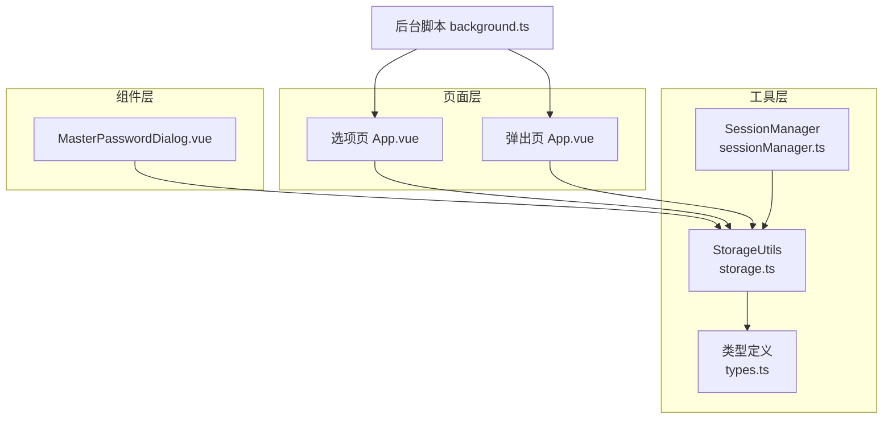
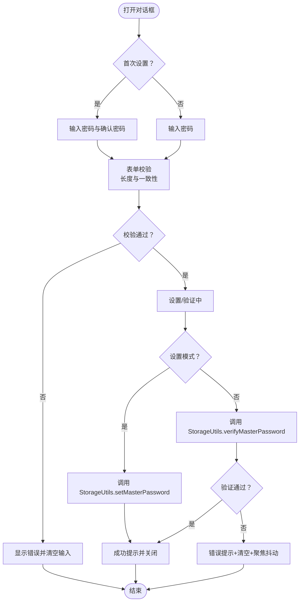
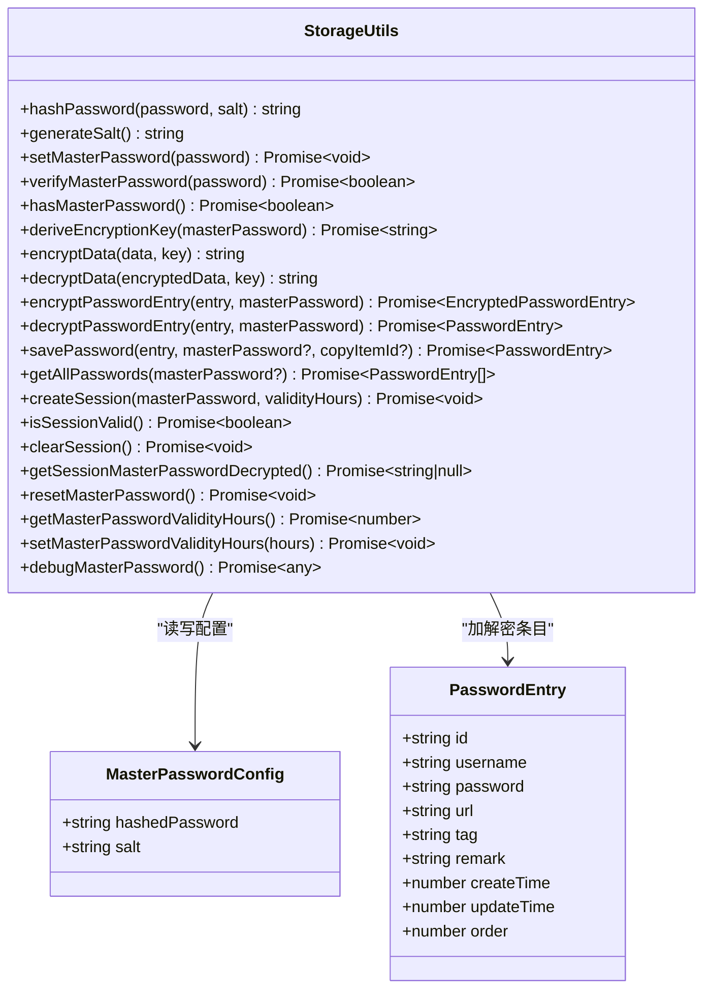
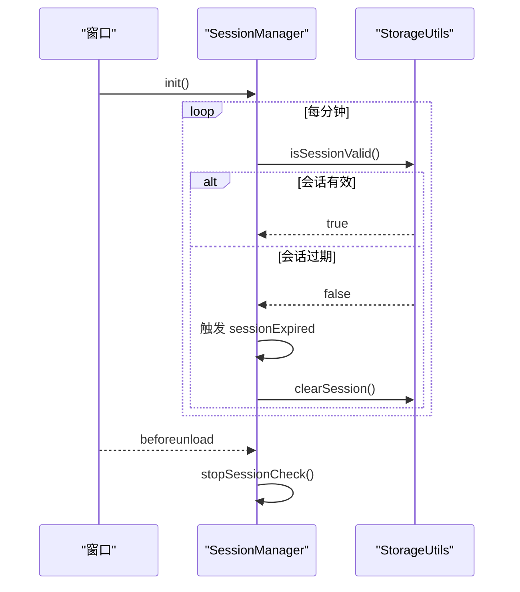
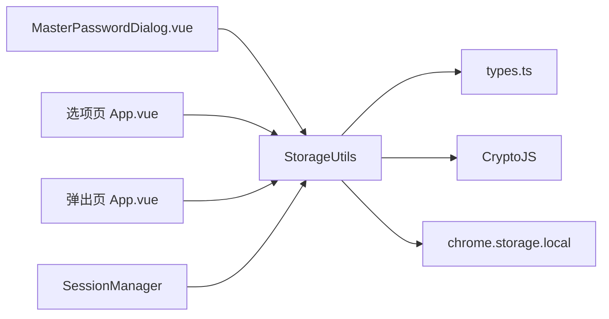

# 主密码保护

<cite>
**本文引用的文件**
- [MasterPasswordDialog.vue](file://components/MasterPasswordDialog.vue)
- [storage.ts](file://utils/storage.ts)
- [types.ts](file://utils/types.ts)
- [sessionManager.ts](file://utils/sessionManager.ts)
- [background.ts](file://entrypoints/background.ts)
- [App.vue（选项页）](file://entrypoints/options/App.vue)
- [App.vue（弹出页）](file://entrypoints/popup/App.vue)
- [README.md](file://README.md)
</cite>

## 目录
1. [简介](#简介)
2. [项目结构](#项目结构)
3. [核心组件](#核心组件)
4. [架构总览](#架构总览)
5. [组件详解](#组件详解)
6. [依赖关系分析](#依赖关系分析)
7. [性能与安全考量](#性能与安全考量)
8. [故障排除指南](#故障排除指南)
9. [结论](#结论)

## 简介
本文件围绕 Account Password Helper 的“主密码保护”机制，系统性阐述主密码的设置、验证与管理流程，包括：
- MD5 哈希算法在主密码校验中的应用
- 盐值生成与存储策略
- 主密码对话框组件的界面与交互设计
- 主密码配置的存储结构、安全存储位置与数据完整性保障
- 最佳实践、安全建议与常见问题解决方案
- 主密码重置、恢复机制与故障排除

## 项目结构
主密码保护涉及的关键模块如下：
- 组件层：主密码对话框组件负责用户交互与输入校验
- 工具层：存储与会话管理工具封装了主密码配置、哈希与盐值、会话缓存、数据加解密等
- 页面层：选项页与弹出页在不同场景下触发主密码设置与验证
- 背景层：后台脚本负责插件生命周期与消息分发



图表来源
- [MasterPasswordDialog.vue](file://components/MasterPasswordDialog.vue#L1-L447)
- [storage.ts](file://utils/storage.ts#L37-L981)
- [sessionManager.ts](file://utils/sessionManager.ts#L1-L87)
- [types.ts](file://utils/types.ts#L1-L96)
- [App.vue（选项页）](file://entrypoints/options/App.vue#L1-L800)
- [App.vue（弹出页）](file://entrypoints/popup/App.vue#L1-L234)
- [background.ts](file://entrypoints/background.ts#L1-L232)

章节来源
- [MasterPasswordDialog.vue](file://components/MasterPasswordDialog.vue#L1-L447)
- [storage.ts](file://utils/storage.ts#L37-L981)
- [sessionManager.ts](file://utils/sessionManager.ts#L1-L87)
- [types.ts](file://utils/types.ts#L1-L96)
- [App.vue（选项页）](file://entrypoints/options/App.vue#L1-L800)
- [App.vue（弹出页）](file://entrypoints/popup/App.vue#L1-L234)
- [background.ts](file://entrypoints/background.ts#L1-L232)

## 核心组件
- 主密码对话框组件：提供首次设置与后续验证两种模式，内置表单校验、错误提示与加载态控制
- 存储与会话工具：封装主密码配置的生成、保存、校验；会话缓存与过期管理；数据加解密
- 会话管理器：定时检查会话有效性，过期时清理并触发事件
- 类型定义：统一 PasswordEntry 与 MasterPasswordConfig 结构

章节来源
- [MasterPasswordDialog.vue](file://components/MasterPasswordDialog.vue#L92-L238)
- [storage.ts](file://utils/storage.ts#L37-L981)
- [sessionManager.ts](file://utils/sessionManager.ts#L6-L87)
- [types.ts](file://utils/types.ts#L4-L49)

## 架构总览
主密码保护的端到端流程如下：
- 首次使用：选项页引导设置主密码，工具层生成盐值并计算哈希，保存配置
- 后续使用：弹出页/选项页触发验证，工具层比对输入与存储的哈希
- 会话缓存：验证通过后建立会话缓存，短期内无需重复输入
- 数据访问：访问密码列表时，若存在加密条目则要求提供主密码进行解密

```mermaid
sequenceDiagram
participant U as "用户"
participant OPT as "选项页"
participant POP as "弹出页"
participant D as "主密码对话框"
participant S as "StorageUtils"
participant M as "会话管理器"
U->>OPT : 打开选项页
OPT->>D : 打开“设置主密码”对话框
D->>S : setMasterPassword(密码)
S-->>D : 保存成功/失败
D-->>U : 成功提示/错误提示
U->>POP : 点击“快速填充”
POP->>S : isSessionValid()
alt 会话有效
S-->>POP : true
POP-->>U : 打开侧边栏
else 会话无效
S-->>POP : false
POP->>D : 打开“验证主密码”对话框
D->>S : verifyMasterPassword(密码)
S-->>D : 验证结果
D-->>U : 成功/失败提示
opt 验证成功
D->>S : createSession(密码, 有效期)
S-->>D : 会话建立
D-->>U : 关闭对话框
POP-->>U : 打开侧边栏
end
end
M->>S : 定时检查 isSessionValid()
S-->>M : 过期则清理并返回false
M-->>U : 触发过期事件
```

图表来源
- [App.vue（选项页）](file://entrypoints/options/App.vue#L1-L800)
- [App.vue（弹出页）](file://entrypoints/popup/App.vue#L59-L151)
- [MasterPasswordDialog.vue](file://components/MasterPasswordDialog.vue#L177-L237)
- [storage.ts](file://utils/storage.ts#L865-L894)
- [sessionManager.ts](file://utils/sessionManager.ts#L27-L66)

## 组件详解

### 主密码对话框组件（MasterPasswordDialog.vue）
- 功能与模式
  - 首次设置：显示“设置主密码”，包含密码与确认密码输入，二次输入一致性校验
  - 验证模式：显示“验证主密码”，仅输入框，无确认密码
- 输入验证
  - 密码非空与长度校验（最小6位）
  - 首次设置时，确认密码与密码一致
- 错误处理与体验
  - 错误消息区域集中展示
  - 验证失败时清空输入并聚焦，带轻微抖动动画提示
  - 加载态避免重复提交
- 交互细节
  - Enter 键触发表单提交
  - 弹窗打开时自动聚焦输入框
  - 支持禁用输入框与自动完成提示



图表来源
- [MasterPasswordDialog.vue](file://components/MasterPasswordDialog.vue#L124-L237)

章节来源
- [MasterPasswordDialog.vue](file://components/MasterPasswordDialog.vue#L1-L447)

### 存储与会话工具（StorageUtils）
- 主密码配置结构
  - 存储键：master_password_config
  - 字段：hashedPassword（哈希值）、salt（盐值）
- MD5 哈希与盐值
  - hashPassword(password, salt)：对“密码+盐值”进行MD5计算
  - generateSalt()：生成随机盐值
- 主密码设置流程
  - 生成盐值与哈希
  - 写入 chrome.storage.local
  - 立即验证保存结果与输入一致性
- 主密码验证流程
  - 读取配置，拼接输入与盐值后哈希
  - 比对存储的 hashedPassword
- 会话缓存
  - isSessionValid()：检查内存与持久化会话信息，判断是否过期
  - createSession()：加密存储主密码、过期时间与有效期
  - clearSession()：清理内存与持久化会话
  - getSessionMasterPasswordDecrypted()：解密返回会话中的主密码
- 数据加解密
  - deriveEncryptionKey()：基于 PBKDF2 从主密码与盐值派生密钥
  - encryptData()/decryptData()：使用 AES-256-CBC（含随机 IV）进行加解密
  - encryptPasswordEntry()/decryptPasswordEntry()：对密码条目进行加解密
- 辅助能力
  - resetMasterPassword()：移除主密码配置（用于重置）
  - getMasterPasswordValidityHours()/setMasterPasswordValidityHours()：有效期设置与读取
  - debugMasterPassword()：输出主密码配置调试信息



图表来源
- [storage.ts](file://utils/storage.ts#L37-L981)
- [types.ts](file://utils/types.ts#L4-L49)

章节来源
- [storage.ts](file://utils/storage.ts#L37-L981)
- [types.ts](file://utils/types.ts#L4-L49)

### 会话管理器（SessionManager）
- 定时检查：每分钟检查一次会话有效性
- 过期处理：触发 sessionExpired 事件并清理会话
- 生命周期：随页面初始化启动，页面卸载时停止



图表来源
- [sessionManager.ts](file://utils/sessionManager.ts#L27-L87)
- [storage.ts](file://utils/storage.ts#L793-L841)

章节来源
- [sessionManager.ts](file://utils/sessionManager.ts#L1-L87)
- [storage.ts](file://utils/storage.ts#L793-L841)

### 页面集成点
- 选项页（App.vue）
  - 首次设置：展示设置主密码页面，提交后调用工具层设置并持久化
  - 验证页面：展示验证主密码页面，提交后调用工具层验证并创建会话
  - 有效期设置：允许用户调整会话有效期
- 弹出页（App.vue）
  - 初始化时检查会话有效性，有效则可访问密码列表
  - 快速填充入口：若会话无效，引导至选项页进行验证

章节来源
- [App.vue（选项页）](file://entrypoints/options/App.vue#L1-L800)
- [App.vue（弹出页）](file://entrypoints/popup/App.vue#L59-L151)

## 依赖关系分析
- 组件依赖
  - MasterPasswordDialog.vue 依赖 StorageUtils 进行主密码设置与验证
- 工具依赖
  - StorageUtils 依赖 CryptoJS 进行哈希与加解密
  - StorageUtils 依赖 chrome.storage.local 进行持久化
  - StorageUtils 依赖 types.ts 中的接口定义
- 会话依赖
  - SessionManager 依赖 StorageUtils 的会话检查与清理能力
- 页面依赖
  - 选项页与弹出页在不同场景触发主密码设置与验证流程



图表来源
- [MasterPasswordDialog.vue](file://components/MasterPasswordDialog.vue#L96)
- [storage.ts](file://utils/storage.ts#L1-L2)
- [types.ts](file://utils/types.ts#L1-L96)
- [App.vue（选项页）](file://entrypoints/options/App.vue#L795)
- [App.vue（弹出页）](file://entrypoints/popup/App.vue#L54)

章节来源
- [MasterPasswordDialog.vue](file://components/MasterPasswordDialog.vue#L96)
- [storage.ts](file://utils/storage.ts#L1-L2)
- [types.ts](file://utils/types.ts#L1-L96)
- [App.vue（选项页）](file://entrypoints/options/App.vue#L795)
- [App.vue（弹出页）](file://entrypoints/popup/App.vue#L54)

## 性能与安全考量
- 哈希与盐值
  - 使用 MD5 对“密码+盐值”进行哈希，盐值随机生成并随配置一同存储
  - 优点：实现简单、速度较快
  - 风险：MD5 不适合密码学强度要求极高的场景；建议在后续版本引入更强的哈希算法（如 SHA-256 或 bcrypt）
- 会话缓存
  - 会话主密码以 AES-256-CBC 加密存储于本地，结合过期时间控制
  - 定时检查确保过期自动清理，降低长期驻留风险
- 数据加解密
  - 使用 PBKDF2 从主密码与盐值派生密钥，增强抗暴力破解能力
  - AES-256-CBC 与随机 IV 提升加密安全性
- 存储位置
  - 主密码配置与密码条目均存储于 chrome.storage.local，本地持久化
- 错误处理
  - 解密失败时返回空或原始数据，避免崩溃并尽量容错
  - 验证失败时清空输入并聚焦，提升用户体验

章节来源
- [storage.ts](file://utils/storage.ts#L41-L58)
- [storage.ts](file://utils/storage.ts#L164-L186)
- [storage.ts](file://utils/storage.ts#L191-L214)
- [storage.ts](file://utils/storage.ts#L219-L297)
- [storage.ts](file://utils/storage.ts#L865-L894)
- [storage.ts](file://utils/storage.ts#L793-L841)

## 故障排除指南
- 问题：设置主密码失败
  - 检查：是否为空密码、保存后立即验证是否通过
  - 处理：查看工具层异常日志，确认 chrome.storage.local 可用
- 问题：验证主密码失败
  - 检查：输入是否为空、是否正确输入
  - 处理：清空输入并重新输入，确认大小写与特殊字符
- 问题：会话过期频繁
  - 检查：有效期设置是否过短
  - 处理：在选项页调整“验证有效期”
- 问题：重置主密码
  - 操作：选项页“调试信息”中提供“重置主密码”入口，将移除主密码配置
  - 风险：重置后所有数据不可恢复，请谨慎操作
- 问题：数据无法解密
  - 检查：主密码是否正确、条目是否加密
  - 处理：提供正确的主密码或检查条目状态

章节来源
- [MasterPasswordDialog.vue](file://components/MasterPasswordDialog.vue#L177-L237)
- [App.vue（选项页）](file://entrypoints/options/App.vue#L237-L241)
- [storage.ts](file://utils/storage.ts#L707-L714)
- [storage.ts](file://utils/storage.ts#L514-L555)

## 结论
Account Password Helper 的主密码保护体系以“盐值+MD5”的方式实现主密码校验，并通过会话缓存与本地存储提供便捷的安全访问体验。工具层对加解密、会话管理与错误处理进行了完善封装，组件层提供直观易用的交互。建议在后续版本中：
- 将 MD5 替换为更安全的哈希算法或专用密码学方案
- 引入更强的密钥派生与随机性策略
- 增强主密码强度校验与用户引导
- 提供更完善的备份与恢复机制