# 会话管理

<cite>
**本文档引用的文件**
- [sessionManager.ts](file://utils/sessionManager.ts)
- [storage.ts](file://utils/storage.ts)
- [types.ts](file://utils/types.ts)
- [background.ts](file://entrypoints/background.ts)
- [App.vue](file://entrypoints/options/App.vue)
- [popup/App.vue](file://entrypoints/popup/App.vue)
- [PasswordVerifyDialog.vue](file://components/PasswordVerifyDialog.vue)
- [README.md](file://README.md)
</cite>

## 目录
1. [简介](#简介)
2. [项目结构](#项目结构)
3. [核心组件](#核心组件)
4. [架构概览](#架构概览)
5. [详细组件分析](#详细组件分析)
6. [依赖关系分析](#依赖关系分析)
7. [性能考虑](#性能考虑)
8. [故障排除指南](#故障排除指南)
9. [结论](#结论)

## 简介

Account Password Helper 是一个功能强大的Chrome浏览器插件，专门用于自动管理和填充网站账号密码。本文档深入分析其会话管理系统，包括会话缓存机制、主密码有效期管理、权限验证流程、会话状态存储策略以及安全退出机制。

该系统采用多层安全设计，结合内存缓存和持久化存储，实现了高效且安全的会话管理。系统支持多种有效期配置，从1小时到24小时不等，满足不同用户的安全需求。

## 项目结构

项目采用模块化架构，主要分为以下几个核心模块：

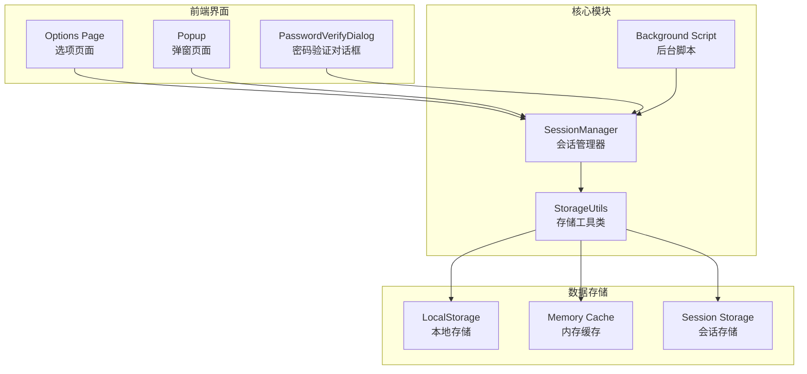

**图表来源**
- [sessionManager.ts](file://utils/sessionManager.ts#L1-L87)
- [storage.ts](file://utils/storage.ts#L1-L981)
- [background.ts](file://entrypoints/background.ts#L1-L232)

**章节来源**
- [README.md](file://README.md#L1-L201)

## 核心组件

### 会话管理器 (SessionManager)

会话管理器是整个会话系统的核心控制器，采用单例模式设计，负责监控会话状态并处理会话过期事件。

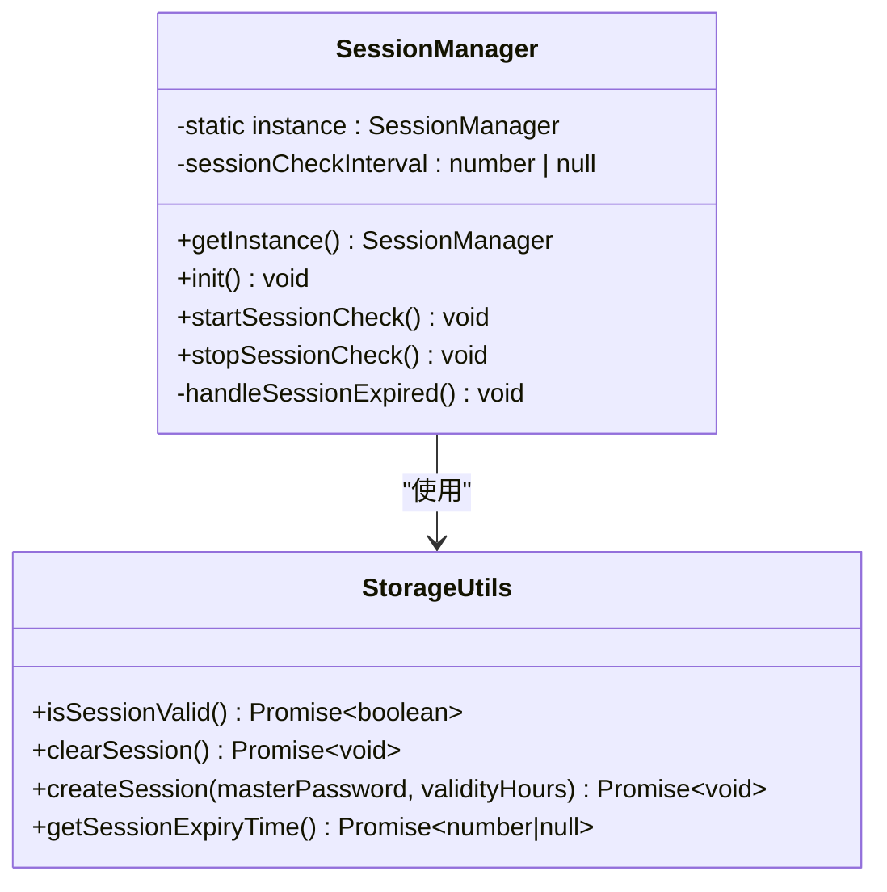

**图表来源**
- [sessionManager.ts](file://utils/sessionManager.ts#L6-L87)
- [storage.ts](file://utils/storage.ts#L791-L841)

### 存储工具类 (StorageUtils)

存储工具类提供了完整的数据存储和会话管理功能，包括主密码验证、数据加密、会话缓存等核心功能。

**章节来源**
- [sessionManager.ts](file://utils/sessionManager.ts#L1-L87)
- [storage.ts](file://utils/storage.ts#L37-L981)

## 架构概览

会话管理系统采用分层架构设计，实现了内存缓存与持久化存储的协调机制：

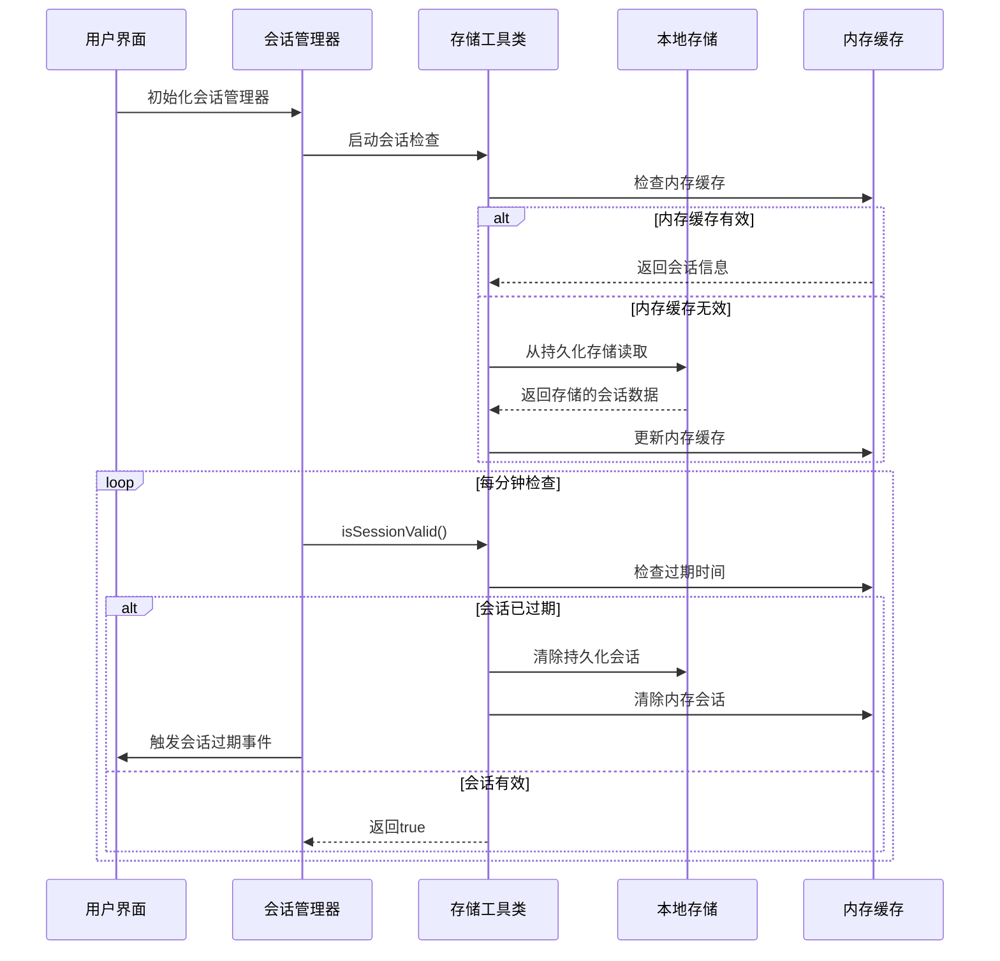

**图表来源**
- [sessionManager.ts](file://utils/sessionManager.ts#L27-L45)
- [storage.ts](file://utils/storage.ts#L793-L841)

## 详细组件分析

### 会话缓存机制

会话缓存机制采用了内存缓存与持久化存储相结合的设计，实现了高效的会话状态管理：

#### 内存缓存策略

系统在内存中维护了以下关键会话状态：

| 缓存项 | 类型 | 默认值 | 用途 |
|--------|------|--------|------|
| encryptedSessionMasterPassword | string | null | 加密存储的主密码 |
| sessionPasswordExpiry | number | null | 会话过期时间戳 |
| sessionValidityHours | number | 24 | 会话有效期（小时） |
| sessionEncryptionKey | string | null | 会话加密密钥 |

#### 持久化存储策略

会话信息通过Chrome本地存储API进行持久化：

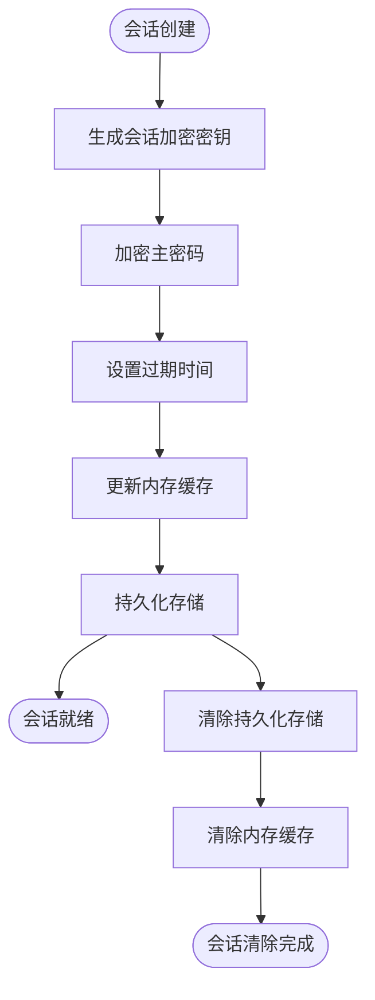

**图表来源**
- [storage.ts](file://utils/storage.ts#L865-L894)
- [storage.ts](file://utils/storage.ts#L899-L916)

#### 会话状态同步机制

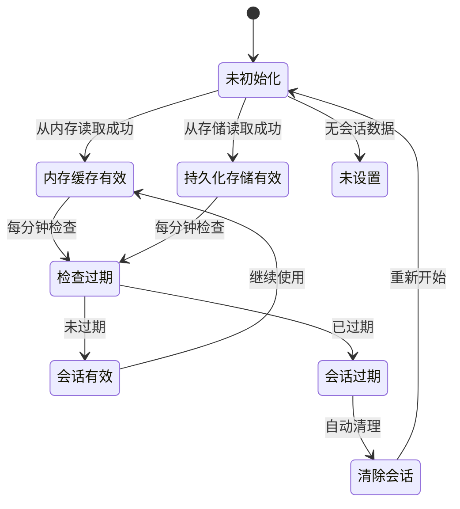

**图表来源**
- [storage.ts](file://utils/storage.ts#L793-L841)

**章节来源**
- [storage.ts](file://utils/storage.ts#L20-L35)
- [storage.ts](file://utils/storage.ts#L791-L916)

### 主密码有效期管理

主密码有效期管理是会话系统的核心安全特性，支持1-24小时的灵活配置：

#### 有效期配置流程

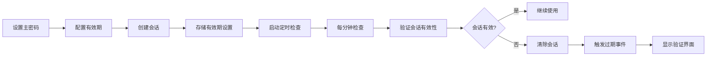

**图表来源**
- [storage.ts](file://utils/storage.ts#L719-L760)
- [sessionManager.ts](file://utils/sessionManager.ts#L27-L45)

#### 有效期验证机制

系统提供了双重验证机制来确保有效期的准确性：

1. **内存验证**：检查内存中的会话过期时间戳
2. **存储验证**：从持久化存储中读取最新的有效期设置

**章节来源**
- [storage.ts](file://utils/storage.ts#L719-L760)
- [storage.ts](file://utils/storage.ts#L791-L841)

### 权限验证流程

权限验证流程确保只有经过身份验证的用户才能访问敏感的密码数据：

#### 验证流程图

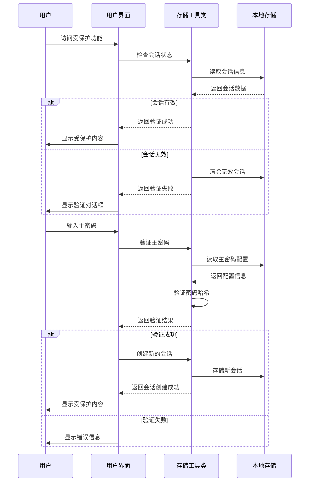

**图表来源**
- [App.vue](file://entrypoints/options/App.vue#L994-L1049)
- [PasswordVerifyDialog.vue](file://components/PasswordVerifyDialog.vue#L154-L172)

#### 验证安全机制

系统采用了多层次的安全验证机制：

1. **主密码验证**：使用哈希算法验证用户输入
2. **会话加密**：使用会话专用密钥加密存储的主密码
3. **过期控制**：基于时间戳的会话过期检查
4. **自动清理**：过期会话的自动清理机制

**章节来源**
- [storage.ts](file://utils/storage.ts#L119-L143)
- [storage.ts](file://utils/storage.ts#L865-L894)

### 会话状态存储策略

会话状态存储策略采用了混合存储架构，平衡了性能和安全性：

#### 存储层次结构

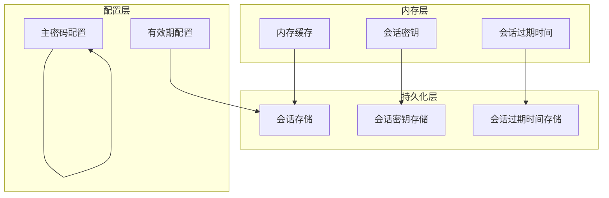

**图表来源**
- [storage.ts](file://utils/storage.ts#L20-L35)
- [storage.ts](file://utils/storage.ts#L12-L18)

#### 数据一致性保证

系统通过以下机制保证数据一致性：

1. **原子操作**：会话创建和更新采用原子操作
2. **事务性存储**：使用Chrome存储API的事务特性
3. **错误恢复**：异常情况下自动恢复到一致状态
4. **版本控制**：支持配置版本的向前兼容

**章节来源**
- [storage.ts](file://utils/storage.ts#L865-L894)
- [storage.ts](file://utils/storage.ts#L899-L916)

### 会话超时处理

会话超时处理机制确保系统在会话过期时能够安全地清理资源并提示用户重新验证：

#### 超时检测机制

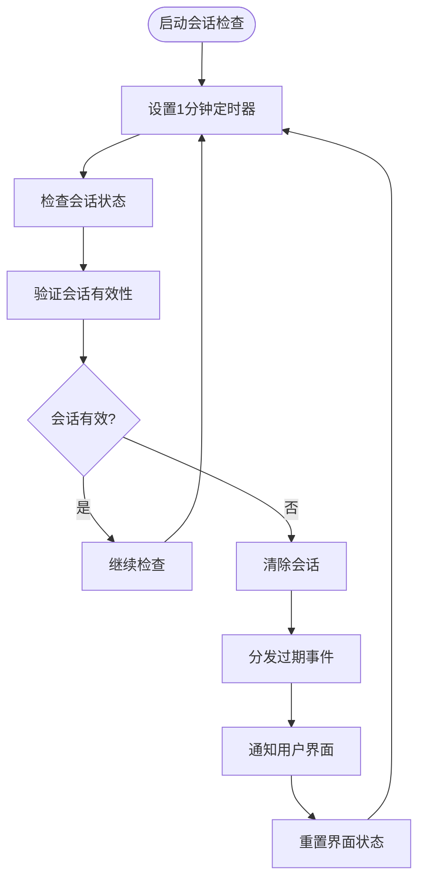

**图表来源**
- [sessionManager.ts](file://utils/sessionManager.ts#L27-L55)

#### 自动清理流程

会话超时后的自动清理流程包括：

1. **内存清理**：清除内存中的会话缓存
2. **存储清理**：从持久化存储中删除会话数据
3. **密钥清理**：清除会话专用的加密密钥
4. **状态重置**：重置用户界面到初始状态

**章节来源**
- [sessionManager.ts](file://utils/sessionManager.ts#L57-L66)
- [storage.ts](file://utils/storage.ts#L899-L916)

### 安全退出机制

安全退出机制确保用户主动退出时能够完全清理会话状态：

#### 退出流程

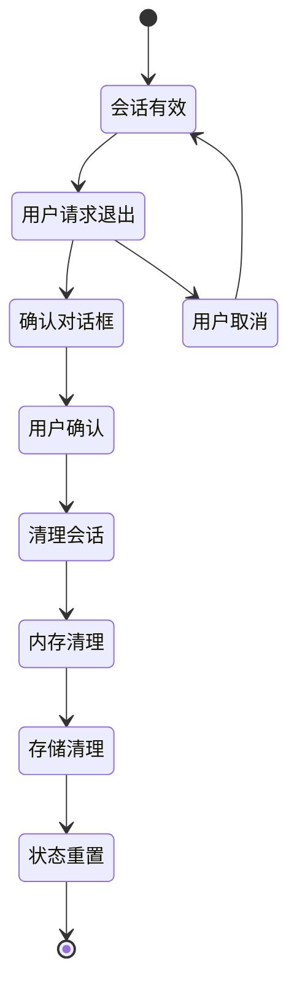

**图表来源**
- [App.vue](file://entrypoints/options/App.vue#L1400-L1439)

#### 退出安全措施

系统提供了多重安全措施：

1. **确认对话框**：防止误操作导致的意外退出
2. **数据备份**：在退出前确保重要数据已备份
3. **密钥销毁**：彻底销毁会话专用的加密密钥
4. **状态同步**：确保所有组件的状态同步更新

**章节来源**
- [App.vue](file://entrypoints/options/App.vue#L1400-L1439)

## 依赖关系分析

会话管理系统各组件之间的依赖关系如下：

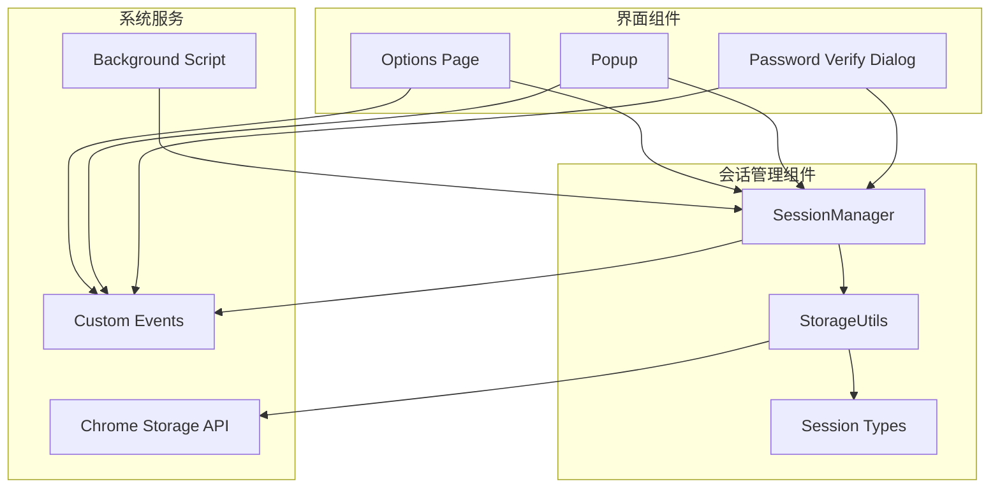

**图表来源**
- [sessionManager.ts](file://utils/sessionManager.ts#L1-L87)
- [storage.ts](file://utils/storage.ts#L1-L981)
- [types.ts](file://utils/types.ts#L1-L96)

**章节来源**
- [background.ts](file://entrypoints/background.ts#L1-L232)

## 性能考虑

会话管理系统在设计时充分考虑了性能优化：

### 内存优化策略

1. **懒加载机制**：会话数据仅在需要时从存储中加载
2. **缓存策略**：合理设置缓存大小，避免内存泄漏
3. **垃圾回收**：及时清理不再使用的会话数据

### 存储优化策略

1. **增量更新**：只更新发生变化的会话数据
2. **批量操作**：合并多个存储操作以减少I/O
3. **压缩存储**：对存储的数据进行适当的压缩

### 网络优化策略

1. **异步操作**：所有存储操作都采用异步方式
2. **错误重试**：网络错误时自动重试
3. **超时控制**：设置合理的操作超时时间

## 故障排除指南

### 常见问题及解决方案

#### 会话无法创建

**问题描述**：用户设置主密码后无法创建会话

**可能原因**：
1. 主密码配置存储失败
2. 会话加密密钥生成失败
3. 存储空间不足

**解决步骤**：
1. 检查主密码配置是否正确存储
2. 验证加密密钥生成过程
3. 清理存储空间并重试

#### 会话频繁过期

**问题描述**：会话在很短时间内就过期失效

**可能原因**：
1. 有效期设置过短
2. 系统时间不正确
3. 存储数据损坏

**解决步骤**：
1. 检查系统时间和时区设置
2. 重新设置合适的有效期
3. 清理存储数据并重新创建会话

#### 验证失败

**问题描述**：用户输入正确的主密码但仍验证失败

**可能原因**：
1. 主密码哈希验证错误
2. 存储配置损坏
3. 加密算法异常

**解决步骤**：
1. 检查主密码配置的完整性
2. 验证哈希算法的正确性
3. 重置主密码配置

### 调试工具

系统提供了丰富的调试工具来帮助诊断问题：

#### 调试信息获取

```typescript
// 获取主密码配置调试信息
const debugInfo = await StorageUtils.debugMasterPassword();
console.log('主密码配置信息:', debugInfo);
```

#### 日志记录

系统在关键操作点都有详细的日志记录，便于问题追踪和分析。

**章节来源**
- [storage.ts](file://utils/storage.ts#L960-L979)

## 结论

Account Password Helper的会话管理系统是一个设计精良、安全可靠的系统。通过内存缓存与持久化存储的协调机制，实现了高效且安全的会话管理。

### 主要优势

1. **多层次安全设计**：结合内存缓存、持久化存储和加密技术
2. **灵活的配置选项**：支持1-24小时的有效期配置
3. **自动化的生命周期管理**：自动检查、清理和恢复机制
4. **用户友好的界面**：直观的验证和配置界面

### 最佳实践建议

1. **合理设置有效期**：根据使用场景选择合适的有效期
2. **定期备份数据**：防止意外数据丢失
3. **及时更新插件**：保持系统的最新安全补丁
4. **监控系统状态**：定期检查会话状态和存储使用情况

该系统为开发者提供了完整的会话管理解决方案，具有良好的扩展性和维护性，是Chrome插件开发中会话管理的优秀范例。