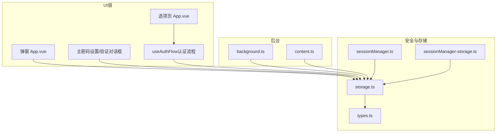
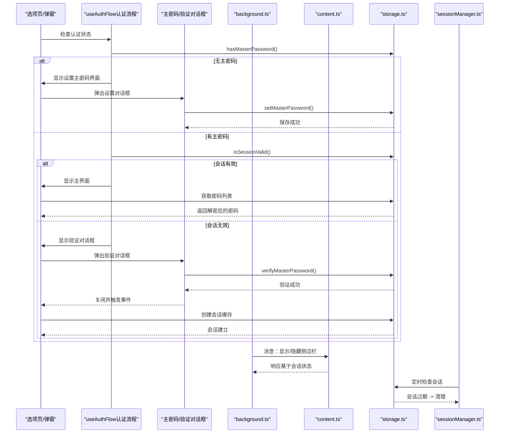
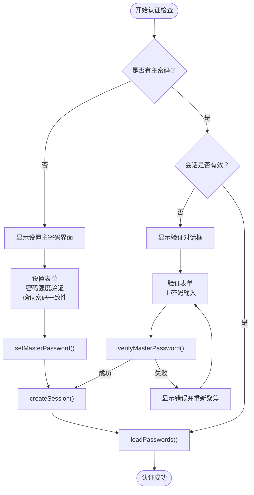
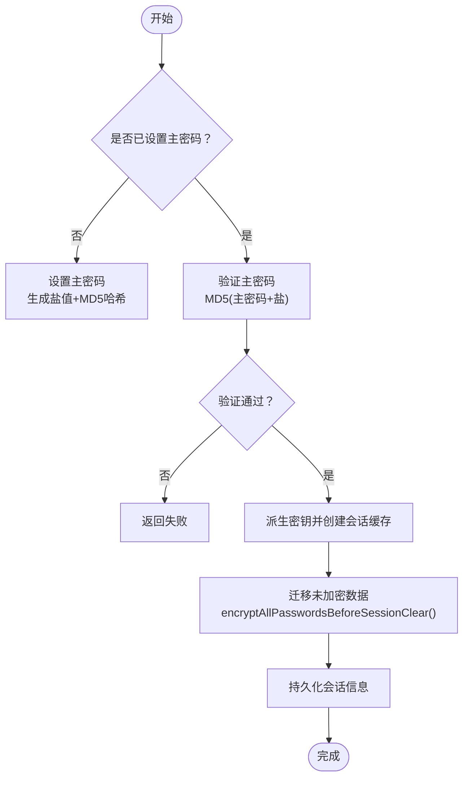
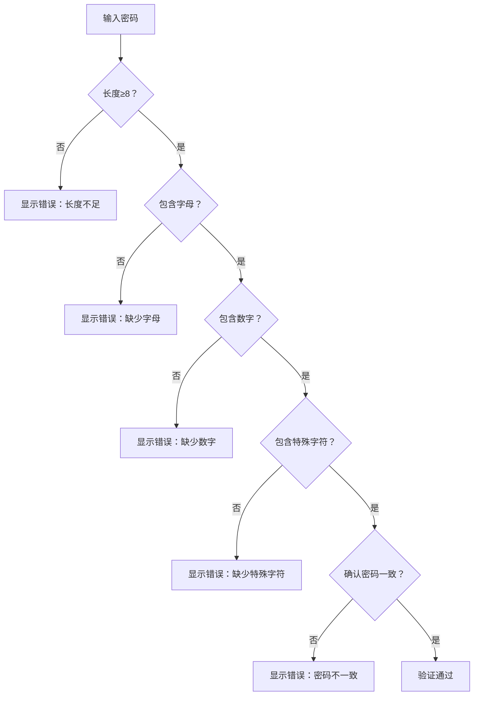
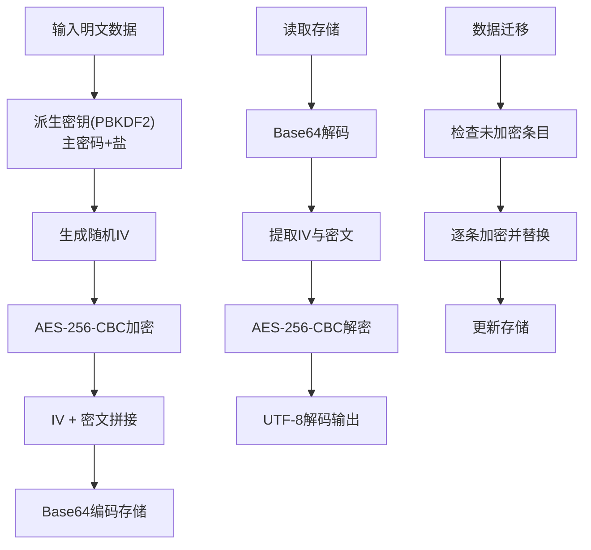
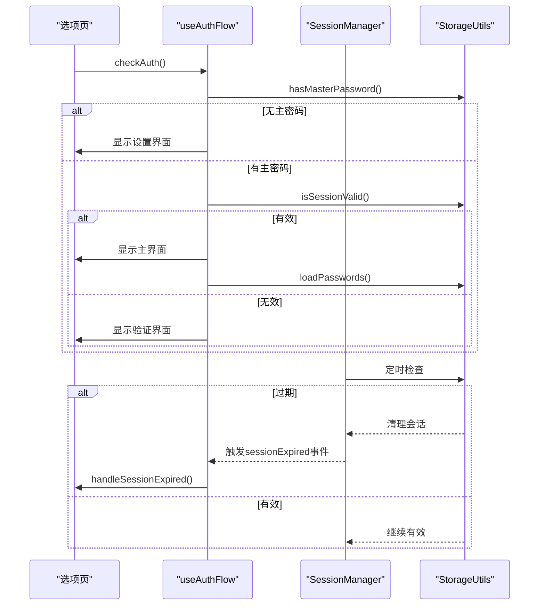
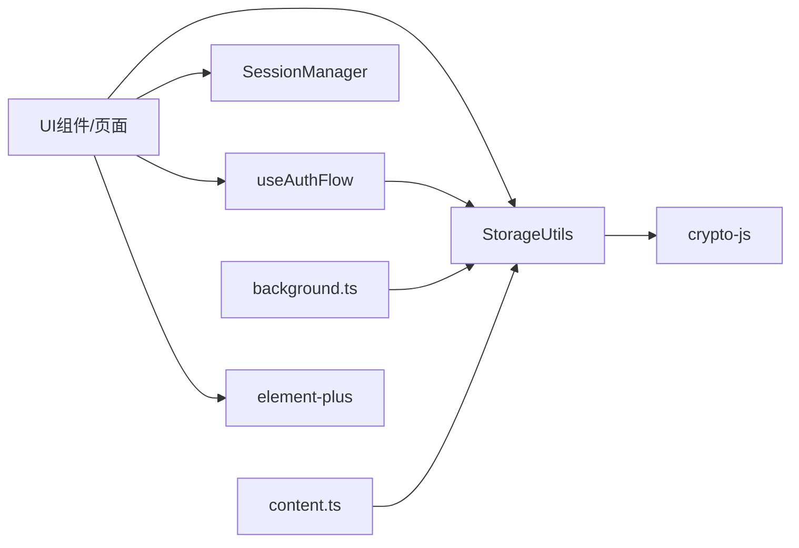

# 安全机制

<cite>
**本文引用的文件**
- [README.md](file://README.md)
- [package.json](file://package.json)
- [background.ts](file://entrypoints/background.ts)
- [content.ts](file://entrypoints/content.ts)
- [App.vue（选项页）](file://entrypoints/options/App.vue)
- [App.vue（弹窗）](file://entrypoints/popup/App.vue)
- [MasterPasswordDialog.vue](file://components/MasterPasswordDialog.vue)
- [PasswordVerifyDialog.vue](file://components/PasswordVerifyDialog.vue)
- [useAuthFlow.ts](file://composables/useAuthFlow.ts)
- [storage.ts](file://utils/storage.ts)
- [sessionManager.ts](file://utils/sessionManager.ts)
- [sessionManager-storage.ts](file://utils/sessionManager-storage.ts)
- [types.ts](file://utils/types.ts)
</cite>

## 更新摘要
**变更内容**
- 新增useAuthFlow认证流程系统，提供完整的主密码设置、验证和会话管理
- 增强密码强度验证规则，支持字母、数字、特殊字符的强制要求
- 新增数据迁移功能，自动加密未加密的密码条目
- 改进会话过期事件处理机制
- 优化UI交互和用户体验

## 目录
1. [简介](#简介)
2. [项目结构](#项目结构)
3. [核心组件](#核心组件)
4. [架构总览](#架构总览)
5. [详细组件分析](#详细组件分析)
6. [依赖关系分析](#依赖关系分析)
7. [性能考量](#性能考量)
8. [故障排查指南](#故障排查指南)
9. [结论](#结论)
10. [附录](#附录)

## 简介
本文件面向安全工程师与合规人员，系统梳理 Account Password Helper 的安全机制，重点覆盖：
- 主密码保护系统与口令验证流程
- 数据加密策略（MD5 与 PBKDF2、AES-256-CBC）
- 会话安全管理与权限验证
- 新增的useAuthFlow认证流程系统
- 密码强度验证与数据迁移机制
- 安全威胁模型与防护措施
- 安全配置指南、最佳实践与常见问题处理
- 隐私保护策略与数据本地化原则

## 项目结构
项目采用 WXT + Vue3 + TypeScript 的前端扩展架构，核心安全逻辑集中在 utils/storage.ts 与 utils/sessionManager.ts，UI 层通过组件与页面负责引导用户设置/验证主密码，并在后台脚本中协调侧边栏与页面交互。

**图表来源**
- [App.vue（选项页）:752-754](file://entrypoints/options/App.vue#L752-L754)
- [App.vue（弹窗）:59-90](file://entrypoints/popup/App.vue#L59-L90)
- [useAuthFlow.ts:11-305](file://composables/useAuthFlow.ts#L11-L305)
- [background.ts:1-232](file://entrypoints/background.ts#L1-L232)
- [content.ts:1-800](file://entrypoints/content.ts#L1-L800)
- [storage.ts:1-672](file://utils/storage.ts#L1-L672)
- [sessionManager.ts:1-87](file://utils/sessionManager.ts#L1-L87)
- [sessionManager-storage.ts:1-323](file://utils/sessionManager-storage.ts#L1-L323)
- [types.ts:1-96](file://utils/types.ts#L1-L96)

**章节来源**
- [README.md:1-201](file://README.md#L1-L201)
- [package.json:1-49](file://package.json#L1-L49)

## 核心组件
- **useAuthFlow认证流程系统**：全新的认证流程管理器，提供主密码设置、验证、会话过期处理等功能，包含完整的表单验证和UI状态管理。
- **增强的主密码与会话管理**：通过 StorageUtils 提供主密码设置/验证、PBKDF2 派生密钥、AES-256-CBC 加密、会话缓存与过期控制，支持数据迁移功能。
- **会话管理器**：SessionManager 周期性检查会话有效性，触发过期事件并清理缓存。
- **UI 交互**：MasterPasswordDialog.vue 与 PasswordVerifyDialog.vue 负责首设与验证；选项页与弹窗页面负责入口与会话状态展示。
- **后台脚本**：background.ts 协调侧边栏显示/隐藏与快捷键；content.ts 负责表单检测与消息通信。

**章节来源**
- [useAuthFlow.ts:11-305](file://composables/useAuthFlow.ts#L11-L305)
- [storage.ts:34-672](file://utils/storage.ts#L34-L672)
- [sessionManager.ts:1-87](file://utils/sessionManager.ts#L1-L87)
- [MasterPasswordDialog.vue:1-247](file://components/MasterPasswordDialog.vue#L1-L247)
- [PasswordVerifyDialog.vue:1-283](file://components/PasswordVerifyDialog.vue#L1-L283)
- [App.vue（选项页）:752-754](file://entrypoints/options/App.vue#L752-L754)
- [App.vue（弹窗）:59-90](file://entrypoints/popup/App.vue#L59-L90)
- [background.ts:1-232](file://entrypoints/background.ts#L1-L232)
- [content.ts:1-800](file://entrypoints/content.ts#L1-L800)

## 架构总览
下图展示了从 UI 到存储与会话的端到端安全流程，包括新增的useAuthFlow认证流程系统。

**图表来源**
- [useAuthFlow.ts:94-143](file://composables/useAuthFlow.ts#L94-L143)
- [MasterPasswordDialog.vue:178-200](file://components/MasterPasswordDialog.vue#L178-L200)
- [PasswordVerifyDialog.vue:156-196](file://components/PasswordVerifyDialog.vue#L156-L196)
- [background.ts:33-73](file://entrypoints/background.ts#L33-L73)
- [content.ts:86-91](file://entrypoints/content.ts#L86-L91)
- [storage.ts:124-183](file://utils/storage.ts#L124-L183)
- [sessionManager.ts:34-66](file://utils/sessionManager.ts#L34-L66)

## 详细组件分析

### useAuthFlow认证流程系统
**新增功能**：全新的认证流程管理器，提供完整的主密码设置、验证和会话管理功能。

- **设计目标**：统一管理主密码设置、验证、会话过期处理，提供完整的表单验证和UI状态管理。
- **关键特性**：
  - 自动检测主密码状态（首次设置 vs 已设置）
  - 智能会话状态判断与处理
  - 完整的表单验证规则（密码强度、确认密码一致性）
  - 会话过期事件处理
  - 数据迁移功能（自动加密未加密条目）

**图表来源**
- [useAuthFlow.ts:94-143](file://composables/useAuthFlow.ts#L94-L143)
- [useAuthFlow.ts:146-172](file://composables/useAuthFlow.ts#L146-L172)
- [useAuthFlow.ts:174-221](file://composables/useAuthFlow.ts#L174-L221)

**章节来源**
- [useAuthFlow.ts:11-305](file://composables/useAuthFlow.ts#L11-L305)
- [App.vue（选项页）:752-754](file://entrypoints/options/App.vue#L752-L754)

### 主密码保护系统
- **设计目标**：以主密码作为唯一密钥，派生对称密钥，对敏感字段进行本地加密存储；同时提供会话缓存以降低重复输入成本。
- **关键流程**：
  - 首次设置：生成随机盐值，使用 MD5 对"主密码+盐"进行哈希，保存哈希与盐；随后立即验证保存成功。
  - 验证流程：输入主密码，拼接盐值并计算哈希，与存储哈希比对。
  - 会话建立：派生密钥后，加密存储主密码（会话密钥由盐值派生或随机生成），并记录过期时间；持久化到本地存储。
  - 会话检查：周期性检查过期时间，过期则清理缓存并触发过期事件。
  - **新增**：数据迁移功能，自动加密未加密的密码条目。

**图表来源**
- [storage.ts:124-183](file://utils/storage.ts#L124-L183)
- [sessionManager-storage.ts:207-237](file://utils/sessionManager-storage.ts#L207-L237)

**章节来源**
- [storage.ts:124-183](file://utils/storage.ts#L124-L183)
- [sessionManager-storage.ts:284-316](file://utils/sessionManager-storage.ts#L284-L316)
- [MasterPasswordDialog.vue:192-228](file://components/MasterPasswordDialog.vue#L192-L228)
- [PasswordVerifyDialog.vue:169-201](file://components/PasswordVerifyDialog.vue#L169-L201)

### 密码强度验证机制
**新增功能**：增强的密码强度验证规则，确保主密码的安全性。

- **验证规则**：
  - 最小长度：8个字符（相比旧版本的6个字符）
  - 必须包含字母（a-z, A-Z）
  - 必须包含数字（0-9）
  - 必须包含特殊字符（!@#$%^&*()_+-=[]{};':"\\|,.<>/?~`）
  - 确认密码一致性验证
- **实现方式**：使用正则表达式进行实时验证，提供即时反馈

**图表来源**
- [useAuthFlow.ts:35-81](file://composables/useAuthFlow.ts#L35-L81)

**章节来源**
- [useAuthFlow.ts:35-81](file://composables/useAuthFlow.ts#L35-L81)
- [MasterPasswordDialog.vue:125-153](file://components/MasterPasswordDialog.vue#L125-L153)

### 数据加密策略
- **MD5 在主密码保护中的应用**：
  - 仅用于"主密码+盐"的哈希存储与验证，不参与数据加密。
  - 优点：实现简单、验证快速；缺点：MD5 本身不适合抗碰撞的密码学用途，但此处仅用于验证而非存储明文。
- **PBKDF2 与 AES-256-CBC**：
  - 从主密码与盐值派生 256 位密钥，使用 AES-256-CBC 加密敏感字段（如密码），并在密文前附加随机 IV，最终以 Base64 存储。
  - 解密时提取 IV 并使用相同密钥解密，容错处理畸形数据与 UTF-8 解码异常。
- **字段选择性加密**：
  - 当前实现对密码字段进行加密，用户名、备注等字段未加密（便于检索与展示）。
- **新增**：数据迁移功能，自动加密未加密的密码条目。

**图表来源**
- [storage.ts:164-186](file://utils/storage.ts#L164-L186)
- [storage.ts:191-214](file://utils/storage.ts#L191-L214)
- [storage.ts:219-297](file://utils/storage.ts#L219-L297)
- [storage.ts:302-356](file://utils/storage.ts#L302-L356)
- [sessionManager-storage.ts:284-316](file://utils/sessionManager-storage.ts#L284-L316)

**章节来源**
- [storage.ts:164-186](file://utils/storage.ts#L164-L186)
- [storage.ts:191-214](file://utils/storage.ts#L191-L214)
- [storage.ts:219-297](file://utils/storage.ts#L219-L297)
- [storage.ts:302-356](file://utils/storage.ts#L302-L356)
- [sessionManager-storage.ts:284-316](file://utils/sessionManager-storage.ts#L284-L316)

### 会话安全管理与权限验证
- **会话生命周期**：
  - 创建：派生会话加密密钥（优先使用主密码盐值派生），加密存储主密码，记录有效期。
  - 检查：每分钟轮询检查过期时间，过期则清理并触发"会话过期"事件。
  - 清理：支持主动清除会话，或在过期后自动清理。
- **权限验证**：
  - UI 层在执行敏感操作（如查看密码、导出数据）前，均需通过会话有效性检查。
  - 若会话过期，自动跳转至验证页面，要求重新输入主密码并重建会话。
- **新增**：改进的会话过期事件处理，支持UI状态同步。

**图表来源**
- [sessionManager.ts:34-66](file://utils/sessionManager.ts#L34-L66)
- [useAuthFlow.ts:224-239](file://composables/useAuthFlow.ts#L224-L239)
- [App.vue（选项页）:778-787](file://entrypoints/options/App.vue#L778-L787)

**章节来源**
- [sessionManager.ts:1-87](file://utils/sessionManager.ts#L1-L87)
- [useAuthFlow.ts:224-239](file://composables/useAuthFlow.ts#L224-L239)
- [App.vue（选项页）:778-787](file://entrypoints/options/App.vue#L778-L787)

### 安全威胁模型与防护措施
- **威胁场景**
  - 本地存储泄露：若浏览器被入侵，攻击者可能读取本地存储。
  - 会话劫持：若会话密钥或过期时间被篡改，可能导致未授权访问。
  - 明文检索：用户名/备注未加密，可能被直接读取。
  - 重放与篡改：若未校验完整性，密文可能被替换。
  - **新增**：弱密码风险：虽然有强度验证，但仍可能存在弱密码。
  - **新增**：数据迁移风险：迁移过程中可能出现数据丢失。
- **防护措施**
  - 仅对敏感字段加密，降低明文暴露面。
  - 使用 PBKDF2 + AES-256-CBC，配合随机 IV，提升抗破解能力。
  - 会话缓存仅在内存中保存加密后的主密码，过期自动清理。
  - 容错解密：对畸形数据与解码异常进行降级处理，避免崩溃。
  - 权限最小化：严格限制 UI 与后台脚本的权限范围，仅在必要时请求。
  - **新增**：密码强度验证，强制要求复杂密码。
  - **新增**：数据迁移保护，确保所有条目在会话创建时都被正确加密。

**章节来源**
- [storage.ts:191-297](file://utils/storage.ts#L191-L297)
- [storage.ts:865-894](file://utils/storage.ts#L865-L894)
- [useAuthFlow.ts:35-81](file://composables/useAuthFlow.ts#L35-L81)
- [sessionManager-storage.ts:284-316](file://utils/sessionManager-storage.ts#L284-L316)
- [README.md:20-26](file://README.md#L20-L26)

### 安全配置指南与最佳实践
- **主密码强度**
  - 建议使用至少8个字符，包含字母、数字和特殊字符的复杂密码。
  - 避免使用常见的弱密码模式。
- **会话有效期**
  - 根据使用场景选择 1–24 小时，建议默认 24 小时。
  - 在公共计算机上建议使用较短的有效期。
- **数据备份**
  - 定期导出数据，防止主密码丢失导致数据不可恢复。
  - 建议在设置主密码时做好备份。
- **最小权限**
  - 遵循最小权限原则，仅授予必要权限。
- **日志与监控**
  - 通过调试接口查看主密码配置信息，定位问题。
  - **新增**：利用useAuthFlow的调试功能检查认证状态。
- **数据迁移**
  - **新增**：系统会在设置主密码时自动迁移未加密的数据。
  - 迁移完成后会自动加密所有条目。

**章节来源**
- [useAuthFlow.ts:242-261](file://composables/useAuthFlow.ts#L242-L261)
- [App.vue（选项页）:676-752](file://entrypoints/options/App.vue#L676-L752)
- [PasswordVerifyDialog.vue:228-248](file://components/PasswordVerifyDialog.vue#L228-L248)
- [README.md:164-165](file://README.md#L164-L165)

### 常见安全问题与解决方案
- **忘记主密码**
  - 无法找回，需清空数据并重新设置。
  - **新增**：提供重置功能，但会清空所有数据。
- **会话过期频繁**
  - 调整有效期设置，或在验证页面重新输入主密码。
  - **新增**：改进的会话过期处理，提供更好的用户体验。
- **导入/导出失败**
  - 检查 Excel 列名与格式，确保包含"用户名/密码"。
- **密码强度验证失败**
  - **新增**：检查密码是否满足长度和字符类型要求。
  - 确保包含字母、数字和特殊字符。
- **数据迁移问题**
  - **新增**：系统会自动处理数据迁移，如遇问题可重新设置主密码。

**章节来源**
- [README.md:174-195](file://README.md#L174-L195)
- [PasswordVerifyDialog.vue:204-225](file://components/PasswordVerifyDialog.vue#L204-L225)
- [useAuthFlow.ts:264-282](file://composables/useAuthFlow.ts#L264-L282)
- [useAuthFlow.ts:35-81](file://composables/useAuthFlow.ts#L35-L81)

### 隐私保护策略与数据本地化
- **数据本地化**：所有数据存储在浏览器本地，不上传至服务器。
- **隐私最小化**：仅收集必要的登录表单信息，不采集无关数据。
- **用户控制**：用户可随时清空数据并重新设置主密码。
- **透明度**：提供调试功能，允许用户查看主密码配置信息。

**章节来源**
- [README.md:164-165](file://README.md#L164-L165)
- [useAuthFlow.ts:242-261](file://composables/useAuthFlow.ts#L242-L261)

## 依赖关系分析
- **外部依赖**
  - crypto-js：提供 MD5、PBKDF2、AES、Base64 等加密工具。
  - element-plus：UI 组件库，用于对话框与表单。
- **内部模块耦合**
  - UI 组件依赖 StorageUtils 与 SessionManager。
  - useAuthFlow 作为新的认证流程中心，协调多个组件。
  - 后台脚本与内容脚本通过消息传递与 StorageUtils 协同。

**图表来源**
- [package.json:22-26](file://package.json#L22-L26)
- [useAuthFlow.ts:1-5](file://composables/useAuthFlow.ts#L1-L5)
- [storage.ts:1-15](file://utils/storage.ts#L1-L15)
- [sessionManager.ts](file://utils/sessionManager.ts#L1)
- [background.ts](file://entrypoints/background.ts#L1)
- [content.ts](file://entrypoints/content.ts#L1)

**章节来源**
- [package.json:22-26](file://package.json#L22-L26)

## 性能考量
- **PBKDF2 迭代次数**：当前迭代次数为 10000，平衡安全性与性能；可根据设备性能调整。
- **AES 加解密**：对大量数据进行批量解密时，建议分批处理并避免阻塞主线程。
- **会话检查**：每分钟检查一次，频率适中；可在页面不可见时降低检查频率。
- **UI 交互**：表单检测使用防抖与事件委托，减少 DOM 监听开销。
- **新增**：useAuthFlow的表单验证采用实时验证，提供更好的用户体验。
- **新增**：数据迁移功能在后台异步执行，不影响主界面响应。

## 故障排查指南
- **会话过期**
  - 现象：页面提示需要重新验证。
  - 处理：重新输入主密码，或清除当前会话后重建。
- **解密失败**
  - 现象：密码显示为空或报错。
  - 处理：检查密钥是否正确，确认数据未被篡改；必要时重新设置主密码。
- **验证失败**
  - 现象：输入主密码后提示错误。
  - 处理：确认大小写与空格，重新输入；若仍失败，考虑重置主密码。
- **新增**：密码强度验证失败
  - 现象：设置主密码时提示密码不符合要求。
  - 处理：检查密码长度和字符类型，确保包含字母、数字和特殊字符。
- **新增**：会话过期事件处理异常
  - 现象：会话过期但UI状态未更新。
  - 处理：检查useAuthFlow的handleSessionExpired方法，确认事件监听正常。

**章节来源**
- [sessionManager.ts:57-66](file://utils/sessionManager.ts#L57-L66)
- [storage.ts:285-297](file://utils/storage.ts#L285-L297)
- [PasswordVerifyDialog.vue:179-194](file://components/PasswordVerifyDialog.vue#L179-L194)
- [useAuthFlow.ts:224-239](file://composables/useAuthFlow.ts#L224-L239)
- [useAuthFlow.ts:35-81](file://composables/useAuthFlow.ts#L35-L81)

## 结论
本项目在浏览器扩展场景下实现了较为完善的本地安全机制：以主密码为核心密钥，结合 PBKDF2 与 AES-256-CBC 对敏感字段进行加密；通过会话缓存与周期检查降低用户体验负担；UI 层提供直观的设置/验证流程。**新增的useAuthFlow认证流程系统**进一步增强了系统的安全性和用户体验，包括完整的密码强度验证、智能的会话管理、自动的数据迁移等功能。建议在生产环境中进一步强化完整性校验与日志审计能力，并持续关注加密算法演进与浏览器 API 变化。

## 附录
- 相关技术栈与依赖版本详见 package.json。
- 安全审计清单
  - 是否使用强密钥派生（PBKDF2/Argon2）与随机 IV
  - 是否对所有敏感字段进行加密
  - 会话密钥是否仅在内存中保存
  - 是否具备过期清理与降级处理
  - 是否遵循最小权限原则
  - **新增**：密码强度验证是否有效实施
  - **新增**：数据迁移功能是否可靠运行

**章节来源**
- [package.json:22-26](file://package.json#L22-L26)
- [useAuthFlow.ts:35-81](file://composables/useAuthFlow.ts#L35-L81)
- [sessionManager-storage.ts:284-316](file://utils/sessionManager-storage.ts#L284-L316)