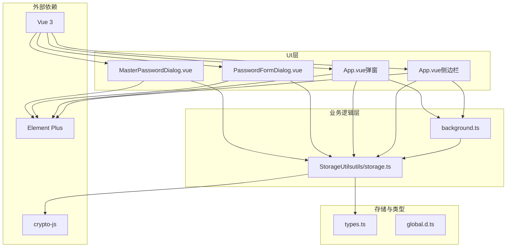
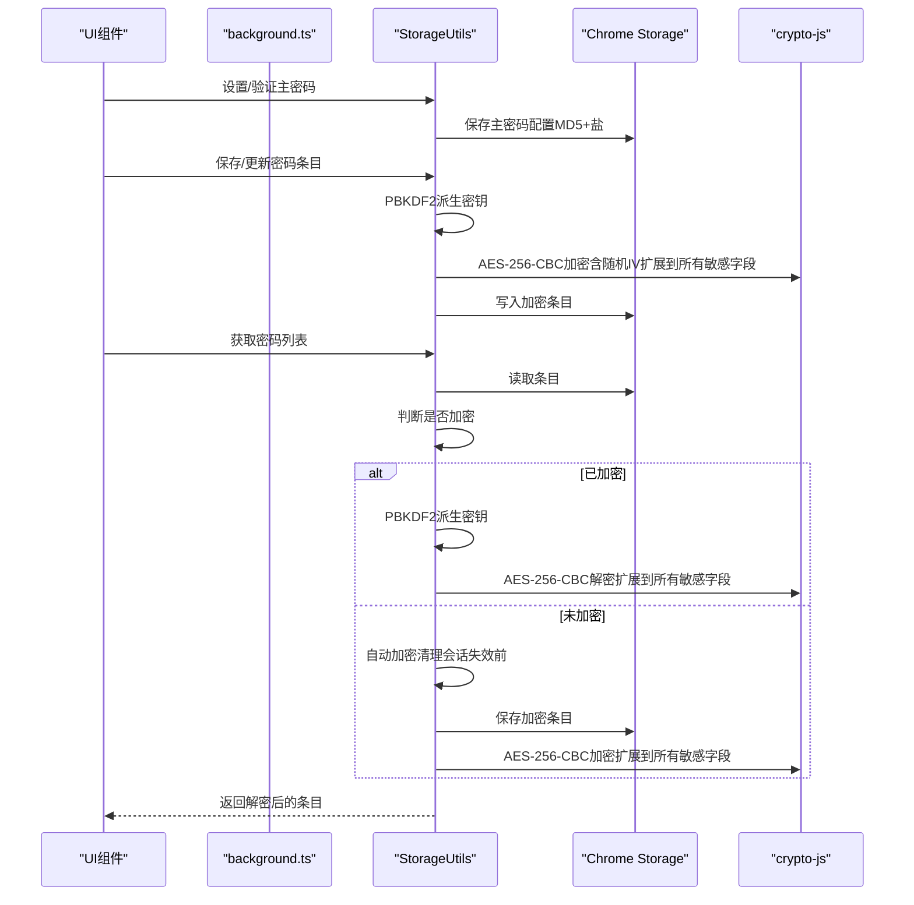
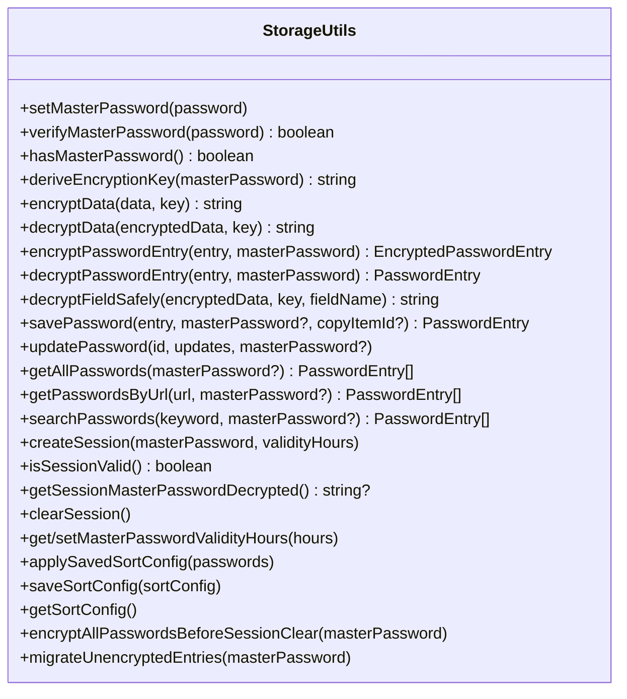
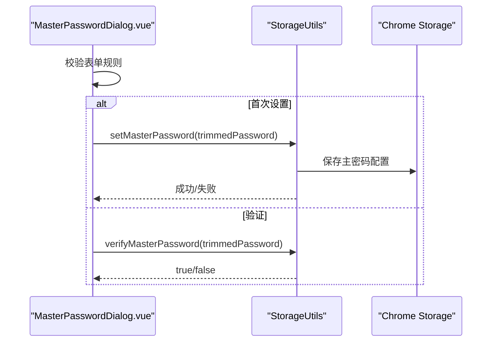
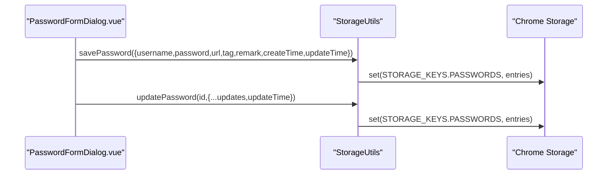
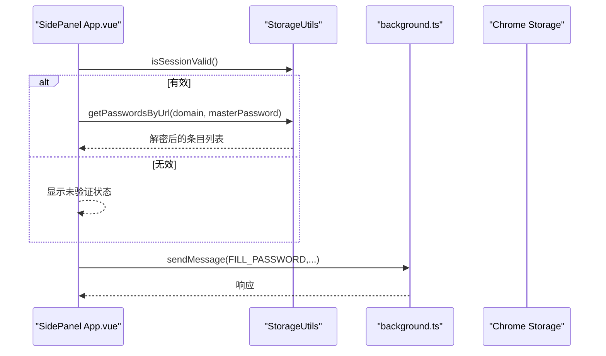
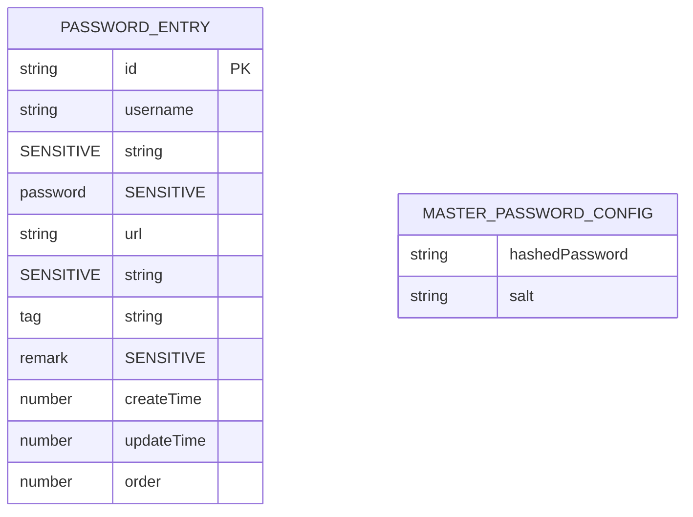
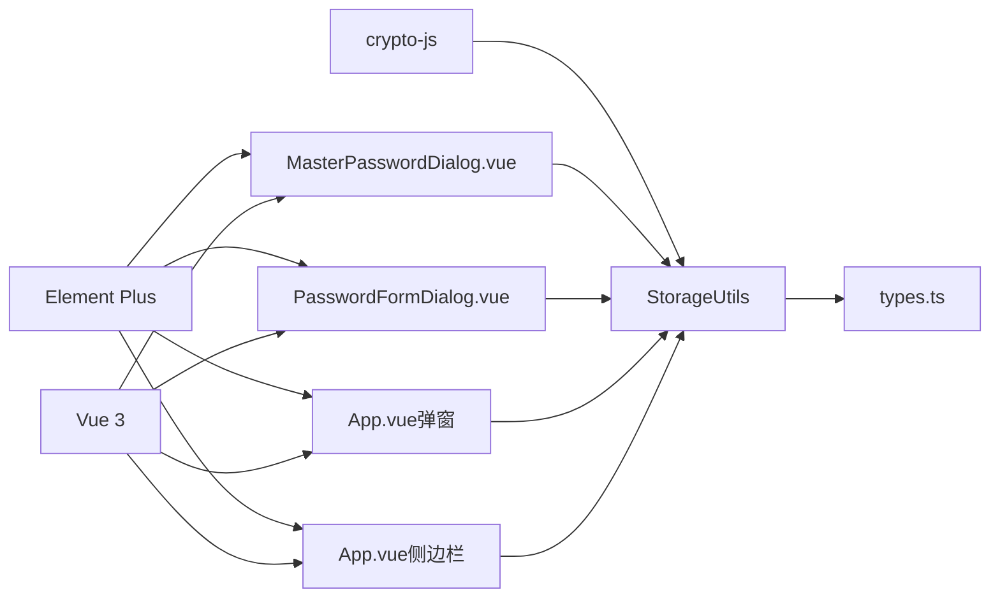

# 数据加密存储

<cite>
**本文引用的文件**
- [storage.ts](file://utils/storage.ts)
- [types.ts](file://utils/types.ts)
- [global.d.ts](file://types/global.d.ts)
- [MasterPasswordDialog.vue](file://components/MasterPasswordDialog.vue)
- [PasswordFormDialog.vue](file://components/PasswordFormDialog.vue)
- [background.ts](file://entrypoints/background.ts)
- [App.vue（侧边栏）](file://entrypoints/sidepanel/App.vue)
- [App.vue（弹窗）](file://entrypoints/popup/App.vue)
- [package.json](file://package.json)
- [README.md](file://README.md)
</cite>

## 更新摘要
**变更内容**
- 扩展加密范围：从单一密码字段加密扩展到所有敏感字段（username、password、url、remark）的全面加密保护
- 新增自动加密清理机制：在会话失效前自动加密所有未加密的密码条目，确保数据完整性
- 新增数据迁移功能：支持将旧版本明文数据自动迁移到新的加密格式
- 增强会话管理：改进会话有效性检测和自动清理机制
- 优化错误处理：增强解密失败时的安全回退机制

## 目录
1. [简介](#简介)
2. [项目结构](#项目结构)
3. [核心组件](#核心组件)
4. [架构总览](#架构总览)
5. [详细组件分析](#详细组件分析)
6. [依赖关系分析](#依赖关系分析)
7. [性能考量](#性能考量)
8. [故障排查指南](#故障排查指南)
9. [结论](#结论)
10. [附录](#附录)

## 简介
本文件针对 Account Password Helper 的"数据加密存储"子系统进行全面技术文档化，重点覆盖：
- AES-256-CBC 加密算法的实现细节与使用场景
- PBKDF2 密钥派生函数的应用与迭代参数
- 随机 IV 的生成与存储策略
- 主密码与会话密钥的管理机制
- **扩展的敏感字段加密保护**：用户名、密码、URL、备注等所有敏感字段的全面加密
- **自动加密清理机制**：会话失效前自动加密所有未加密条目的安全保障
- **数据迁移功能**：从旧版本明文数据到新版本加密格式的平滑迁移
- 密码条目的加密流程（字段选择性加密）、数据格式与解密过程
- 存储结构、数据完整性校验与错误恢复机制
- 性能优化建议、安全配置参数调整与强度评估
- 数据迁移、备份恢复与密钥管理最佳实践

## 项目结构
本项目采用前端插件架构，核心加密逻辑集中在 utils/storage.ts 中，UI 层通过 Vue 组件与后台交互，Chrome Extension API 提供存储与消息通信能力。

**图表来源**
- [storage.ts](file://utils/storage.ts#L37-L981)
- [types.ts](file://utils/types.ts#L1-L96)
- [MasterPasswordDialog.vue](file://components/MasterPasswordDialog.vue#L92-L238)
- [PasswordFormDialog.vue](file://components/PasswordFormDialog.vue#L86-L200)
- [background.ts](file://entrypoints/background.ts#L1-L232)
- [App.vue（侧边栏）](file://entrypoints/sidepanel/App.vue#L163-L700)
- [App.vue（弹窗）](file://entrypoints/popup/App.vue#L51-L163)

**章节来源**
- [storage.ts](file://utils/storage.ts#L1-L981)
- [types.ts](file://utils/types.ts#L1-L96)
- [package.json](file://package.json#L22-L46)

## 核心组件
- **StorageUtils**：封装主密码设置/验证、PBKDF2 密钥派生、AES-256-CBC 加密/解密、密码条目加解密、会话管理、存储读写等核心功能。**新增**：自动加密清理机制和数据迁移功能。
- **MasterPasswordDialog.vue**：负责首次设置主密码与后续验证，调用 StorageUtils 完成主密码持久化与校验。
- **PasswordFormDialog.vue**：负责密码条目录入/编辑，调用 StorageUtils 保存或更新条目。
- **background.ts**：插件后台，处理消息、侧边栏开关、快捷键等。
- **App.vue（侧边栏/弹窗）**：展示与交互，调用 StorageUtils 获取/搜索/填充密码。

**章节来源**
- [storage.ts](file://utils/storage.ts#L37-L981)
- [MasterPasswordDialog.vue](file://components/MasterPasswordDialog.vue#L92-L238)
- [PasswordFormDialog.vue](file://components/PasswordFormDialog.vue#L86-L200)
- [background.ts](file://entrypoints/background.ts#L1-L232)
- [App.vue（侧边栏）](file://entrypoints/sidepanel/App.vue#L163-L700)
- [App.vue（弹窗）](file://entrypoints/popup/App.vue#L51-L163)

## 架构总览
下图展示了从 UI 到存储的端到端流程，包括主密码验证、会话建立、条目加解密与存储，**特别强调了扩展的加密保护和自动清理机制**。

**图表来源**
- [storage.ts](file://utils/storage.ts#L76-L143)
- [storage.ts](file://utils/storage.ts#L164-L186)
- [storage.ts](file://utils/storage.ts#L191-L214)
- [storage.ts](file://utils/storage.ts#L219-L297)
- [storage.ts](file://utils/storage.ts#L302-L356)
- [storage.ts](file://utils/storage.ts#L514-L555)
- [storage.ts](file://utils/storage.ts#L905-L970)

## 详细组件分析

### StorageUtils：加密与存储核心
- **主密码与盐值**
  - setMasterPassword：生成随机盐值，对输入主密码执行 MD5，保存 hashedPassword 与 salt。
  - verifyMasterPassword：读取存储的 salt 与 hashedPassword，对输入密码做同样 MD5 计算并比对。
  - hasMasterPassword：检查是否存在有效的主密码配置。
- **PBKDF2 密钥派生**
  - deriveEncryptionKey：从主密码与存储的 salt 通过 PBKDF2 派生 256 位密钥，迭代次数为 10000。
- **AES-256-CBC 加密/解密**
  - encryptData：生成随机 IV（16 字节），使用 UTF-8 解析密钥，AES-256-CBC 加密，将 IV 与密文拼接后 Base64 编码。
  - decryptData：Base64 解码，提取 IV（前 16 字节）与密文，使用相同参数解密；对畸形数据与 UTF-8 解码失败进行容错处理。
- **扩展的密码条目加解密**
  - **encryptPasswordEntry**：**重大更新**：对所有敏感字段（username、password、url、remark）进行加密，空字段保持原值，标记 encrypted=true。
  - **decryptPasswordEntry**：**重大更新**：对所有敏感字段（username、password、url、remark）进行解密，即使某些字段解密失败也要继续处理其他字段。
  - **decryptFieldSafely**：对单字段解密的安全包装，失败时返回原始数据。
- **自动加密清理机制**
  - **encryptAllPasswordsBeforeSessionClear**：**新增功能**：会话失效前自动加密所有未加密的密码条目，确保所有敏感字段（username、password、url、remark）都已加密。
  - **migrateUnencryptedEntries**：**新增功能**：支持将旧版本的明文数据迁移到新的加密格式。
- **存储与检索**
  - savePassword/updatePassword：根据是否提供主密码决定是否加密；支持复制条目插入位置。
  - getAllPasswords/getPasswordsByUrl/searchPasswords：统一解密逻辑，自动处理混合加密/明文条目。
  - 批量删除与清空：deletePasswords/deleteAll。
- **会话与主密码缓存**
  - createSession：基于主密码配置的 salt 派生会话加密密钥，加密存储主密码、过期时间与有效期小时数。
  - isSessionValid：从本地存储恢复会话，检查过期并清理过期会话。
  - getSessionMasterPasswordDecrypted：解密会话中的主密码。
  - clearSession：**重大更新**：在清除会话前调用 encryptAllPasswordsBeforeSessionClear 确保所有敏感字段已加密。
  - get/setMasterPasswordValidityHours：主密码有效期配置（1-24 小时）。
- **排序与配置**
  - applySavedSortConfig/saveSortConfig/getSortConfig：保存与应用排序配置，支持多字段升/降序。

**图表来源**
- [storage.ts](file://utils/storage.ts#L37-L981)

**章节来源**
- [storage.ts](file://utils/storage.ts#L76-L143)
- [storage.ts](file://utils/storage.ts#L164-L186)
- [storage.ts](file://utils/storage.ts#L191-L214)
- [storage.ts](file://utils/storage.ts#L219-L297)
- [storage.ts](file://utils/storage.ts#L302-L377)
- [storage.ts](file://utils/storage.ts#L382-L466)
- [storage.ts](file://utils/storage.ts#L471-L560)
- [storage.ts](file://utils/storage.ts#L565-L607)
- [storage.ts](file://utils/storage.ts#L798-L970)
- [storage.ts](file://utils/storage.ts#L976-L1007)
- [storage.ts](file://utils/storage.ts#L1037-L1049)

### 主密码对话框：设置与验证
- 首次设置：校验两次输入一致，调用 StorageUtils.setMasterPassword 保存。
- 后续验证：调用 StorageUtils.verifyMasterPassword，成功后触发回调关闭弹窗并返回事件。
- UI 行为：输入框防抖、错误提示、加载态、自动聚焦与清空。

**图表来源**
- [MasterPasswordDialog.vue](file://components/MasterPasswordDialog.vue#L178-L237)
- [storage.ts](file://utils/storage.ts#L76-L143)

**章节来源**
- [MasterPasswordDialog.vue](file://components/MasterPasswordDialog.vue#L92-L238)
- [storage.ts](file://utils/storage.ts#L76-L143)

### 密码表单对话框：保存与更新
- 新增/编辑：表单校验后调用 StorageUtils.savePassword 或 updatePassword。
- 时间戳：自动设置 createTime/updateTime。
- 复制插入：支持在指定条目下方插入复制的新条目。

**图表来源**
- [PasswordFormDialog.vue](file://components/PasswordFormDialog.vue#L159-L199)
- [storage.ts](file://utils/storage.ts#L382-L466)

**章节来源**
- [PasswordFormDialog.vue](file://components/PasswordFormDialog.vue#L86-L200)
- [storage.ts](file://utils/storage.ts#L382-L466)

### 侧边栏与弹窗：会话与数据访问
- 会话检查：onMounted/onVisibilityChange/onStorageChange 监听会话有效性，自动切换认证状态。
- 数据加载：根据当前域名或全局搜索，调用 StorageUtils.getPasswordsByUrl 或 getAllPasswords。
- 填充流程：注入 content script，发送填充消息，成功后隐藏侧边栏。

**图表来源**
- [App.vue（侧边栏）](file://entrypoints/sidepanel/App.vue#L199-L247)
- [App.vue（侧边栏）](file://entrypoints/sidepanel/App.vue#L311-L335)
- [App.vue（侧边栏）](file://entrypoints/sidepanel/App.vue#L343-L422)
- [storage.ts](file://utils/storage.ts#L514-L555)
- [background.ts](file://entrypoints/background.ts#L34-L73)

**章节来源**
- [App.vue（侧边栏）](file://entrypoints/sidepanel/App.vue#L163-L700)
- [App.vue（弹窗）](file://entrypoints/popup/App.vue#L51-L163)
- [background.ts](file://entrypoints/background.ts#L1-L232)

### 数据模型与类型
- **PasswordEntry**：包含 id、username、password、url、tag、remark、createTime、updateTime、order。**扩展**：所有字段都属于敏感信息，需要加密保护。
- **MasterPasswordConfig**：包含 hashedPassword 与 salt。
- **Message/MessageType**：用于后台与 UI 的消息通信。

**图表来源**
- [types.ts](file://utils/types.ts#L4-L41)
- [types.ts](file://utils/types.ts#L46-L49)

**章节来源**
- [types.ts](file://utils/types.ts#L1-L96)

## 依赖关系分析
- **外部库**
  - crypto-js：提供 PBKDF2、AES、MD5、Base64、WordArray 等加密与编码能力。
  - element-plus：UI 组件库。
  - vue：前端框架。
- **内部模块**
  - utils/storage.ts：核心加密与存储逻辑，**新增**：自动加密清理和数据迁移功能。
  - utils/types.ts：数据模型与消息类型。
  - components/*：UI 对话框与表单。
  - entrypoints/*：插件入口与后台。

**图表来源**
- [package.json](file://package.json#L22-L46)
- [storage.ts](file://utils/storage.ts#L1-L2)
- [types.ts](file://utils/types.ts#L1-L96)
- [MasterPasswordDialog.vue](file://components/MasterPasswordDialog.vue#L96)
- [PasswordFormDialog.vue](file://components/PasswordFormDialog.vue#L91)
- [App.vue（弹窗）](file://entrypoints/popup/App.vue#L54)
- [App.vue（侧边栏）](file://entrypoints/sidepanel/App.vue#L168)

**章节来源**
- [package.json](file://package.json#L22-L46)
- [storage.ts](file://utils/storage.ts#L1-L2)
- [types.ts](file://utils/types.ts#L1-L96)

## 性能考量
- **PBKDF2 迭代次数**：当前为 10000，兼顾安全性与性能。在高并发或大量条目场景下可考虑：
  - 降低迭代次数（如 5000）以提升性能，同时评估风险。
  - 引入渐进式验证：首次解密时使用较低迭代，后续缓存派生密钥。
- **AES-256-CBC**：单条目加解密成本低，批量操作建议：
  - 分批处理（每批 100-500 条），避免阻塞 UI。
  - 使用 Web Workers 或后台线程处理大批量解密。
  - **新增**：自动加密清理机制会在会话失效前批量加密所有未加密条目，建议分批处理以避免性能问题。
- **Base64 编解码**：对大文本影响较小，建议避免重复编解码。
- **会话缓存**：合理设置有效期（默认 24 小时），减少频繁派生密钥与解密。
  - **新增**：会话清理前的自动加密清理可能涉及大量数据处理，建议在后台线程中执行。

## 故障排查指南
- **主密码设置/验证失败**
  - 检查 setMasterPassword 是否成功保存配置并验证通过。
  - verifyMasterPassword 返回 false 的常见原因：存储中缺少 salt/hashedPassword、输入为空、MD5 比对失败。
- **解密失败或返回空**
  - decryptData 对畸形数据与 UTF-8 解码失败进行容错，返回空或原始数据；检查密钥是否正确、数据是否被篡改。
  - decryptFieldSafely 对单字段解密失败会回退为原始数据，不影响其他字段。
  - **新增**：如果发现某些条目未加密，检查是否触发了自动加密清理机制。
- **会话过期**
  - isSessionValid 检查过期时间并清理缓存；可通过 clearSession 重置。
  - **新增**：会话清理前会自动加密所有未加密条目，如果出现性能问题，检查是否有大量未加密条目。
- **存储异常**
  - getAllPasswords 在无主密码时抛出错误；确保传入 masterPassword 或先验证会话。
- **UI 交互**
  - 侧边栏/弹窗在会话无效时显示未验证状态；先打开选项页面进行主密码验证。
- **新增**：**数据迁移问题**
  - migrateUnencryptedEntries 失败时不会抛出错误，但会记录日志；检查是否有权限问题或存储空间不足。
  - 如果发现数据重复或丢失，检查迁移过程中的错误处理。

**章节来源**
- [storage.ts](file://utils/storage.ts#L76-L143)
- [storage.ts](file://utils/storage.ts#L191-L297)
- [storage.ts](file://utils/storage.ts#L302-L377)
- [storage.ts](file://utils/storage.ts#L514-L555)
- [storage.ts](file://utils/storage.ts#L798-L970)
- [storage.ts](file://utils/storage.ts#L976-L1007)
- [App.vue（侧边栏）](file://entrypoints/sidepanel/App.vue#L199-L247)

## 结论
本系统通过"主密码 + PBKDF2 + AES-256-CBC + 随机 IV"的组合实现了对敏感字段（用户名、密码、URL、备注等）的全面本地加密存储，并结合会话缓存与安全容错机制保障用户体验与数据安全。**重大更新**包括扩展的加密范围和自动加密清理机制，进一步提升了数据安全性。建议在生产环境中进一步：
- 评估并优化 PBKDF2 迭代次数与缓存策略
- 引入更严格的完整性校验（如 HMAC-SHA256）与版本化存储格式
- 增强错误日志与审计能力
- 规范密钥轮换与迁移流程
- **新增**：监控自动加密清理机制的性能影响，必要时优化批量处理策略

## 附录

### 加密流程与数据格式
- **主密码保护**
  - 存储：hashedPassword + salt（MD5）
  - 验证：输入密码 + salt -> MD5 -> 比对
- **条目加密**
  - **扩展更新**：字段：username、password、url、remark（所有敏感字段）加密，其余字段保持明文
  - 格式：IV（16 字节）+ 密文（Base64 编码），组合后 Base64 编码
  - 标识：encrypted 属性标记条目是否已加密
- **会话缓存**
  - 会话主密码加密存储，过期时间与有效期小时数持久化
  - 会话加密密钥由主密码配置的 salt 派生
- **自动加密清理**
  - **新增功能**：会话失效前自动加密所有未加密条目
  - **新增功能**：数据迁移支持从明文到加密格式的平滑过渡

**章节来源**
- [storage.ts](file://utils/storage.ts#L76-L143)
- [storage.ts](file://utils/storage.ts#L164-L186)
- [storage.ts](file://utils/storage.ts#L191-L214)
- [storage.ts](file://utils/storage.ts#L304-L377)
- [storage.ts](file://utils/storage.ts#L867-L929)
- [storage.ts](file://utils/storage.ts#L935-L1007)

### 安全配置参数与强度评估
- **PBKDF2 迭代次数**：10000（中等强度）
- **密钥长度**：256 位（AES-256）
- **IV**：每次加密随机生成（16 字节）
- **填充**：PKCS7
- **加密范围**：**扩展更新**：从单一密码字段扩展到所有敏感字段（username、password、url、remark）
- **建议增强**
  - 迭代次数：根据设备性能提升至 20000-50000
  - 完整性：引入 HMAC-SHA256 校验
  - 版本化：为未来升级预留版本字段
  - **新增**：监控自动加密清理的性能影响，优化批量处理策略

**章节来源**
- [storage.ts](file://utils/storage.ts#L164-L186)
- [storage.ts](file://utils/storage.ts#L191-L214)
- [storage.ts](file://utils/storage.ts#L304-L377)

### 数据迁移、备份与恢复
- **备份**
  - 导出 Excel：通过 UI 导出条目列表（包含明文字段与加密字段）
  - 备份主密码配置与会话缓存（谨慎处理）
- **恢复**
  - 导入 Excel：重建条目并按需加密
  - 会话恢复：从本地存储恢复会话，检查过期
  - **新增**：数据迁移：使用 migrateUnencryptedEntries 将旧版本明文数据迁移到新格式
- **密钥管理**
  - 主密码不可恢复，建议定期导出备份
  - 会话过期自动清理，避免长期明文缓存
  - **新增**：自动加密清理确保数据完整性，防止会话失效导致的数据泄露

**章节来源**
- [README.md](file://README.md#L129-L134)
- [storage.ts](file://utils/storage.ts#L867-L929)
- [storage.ts](file://utils/storage.ts#L976-L1007)
- [storage.ts](file://utils/storage.ts#L1037-L1049)