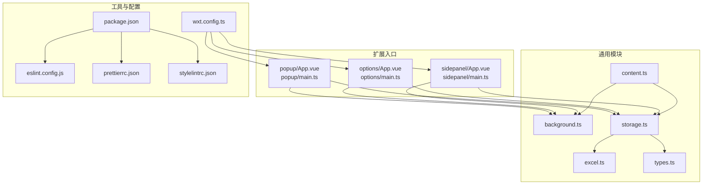
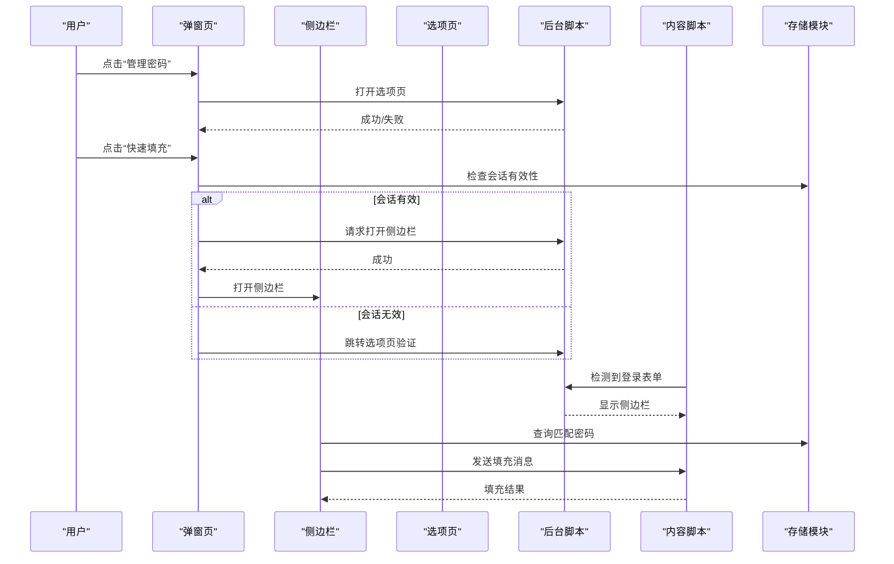
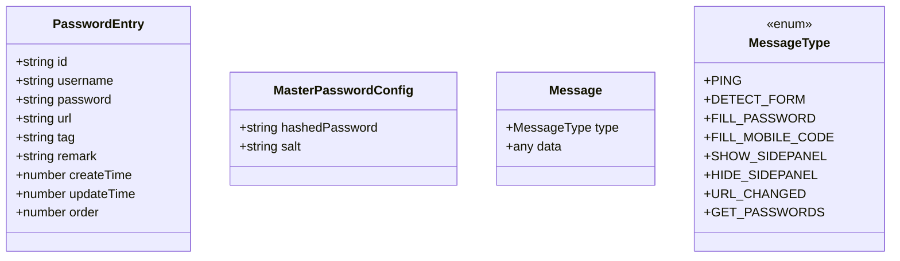
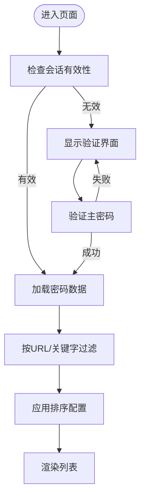
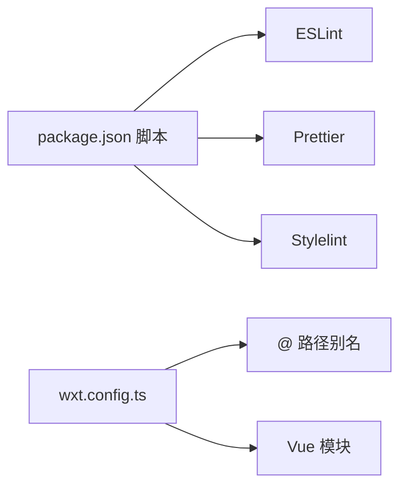

# 代码规范

<cite>
**本文引用的文件**
- [eslint.config.js](file://eslint.config.js)
- [.prettierrc.json](file://.prettierrc.json)
- [.stylelintrc.json](file://.stylelintrc.json)
- [package.json](file://package.json)
- [wxt.config.ts](file://wxt.config.ts)
- [background.ts](file://entrypoints/background.ts)
- [content.ts](file://entrypoints/content.ts)
- [storage.ts](file://utils/storage.ts)
- [excel.ts](file://utils/excel.ts)
- [types.ts](file://utils/types.ts)
- [PasswordFormDialog.vue](file://components/PasswordFormDialog.vue)
- [App.vue（选项页）](file://entrypoints/options/App.vue)
- [App.vue（弹窗页）](file://entrypoints/popup/App.vue)
- [App.vue（侧边栏）](file://entrypoints/sidepanel/App.vue)
- [main.ts（选项页入口）](file://entrypoints/options/main.ts)
- [main.ts（弹窗页入口）](file://entrypoints/popup/main.ts)
- [main.ts（侧边栏入口）](file://entrypoints/sidepanel/main.ts)
</cite>

## 目录
1. [简介](#简介)
2. [项目结构](#项目结构)
3. [核心组件](#核心组件)
4. [架构总览](#架构总览)
5. [详细组件分析](#详细组件分析)
6. [依赖关系分析](#依赖关系分析)
7. [性能考量](#性能考量)
8. [故障排查指南](#故障排查指南)
9. [结论](#结论)
10. [附录](#附录)

## 简介
本指南面向 Account Password Helper 项目，旨在建立统一、可执行的代码规范与最佳实践，覆盖以下方面：
- ESLint 规则与配置
- Prettier 格式化设置
- Stylelint 样式检查规则
- JavaScript/TypeScript 编码规范
- Vue 组件编写规范
- CSS/SCSS 样式规范与命名约定
- 代码注释标准、错误处理模式与日志记录规范
- Git 提交消息格式、分支命名规范与代码审查流程
- 具体正反面示例与对比

本规范以现有配置文件与源码为依据，结合项目实际运行机制（浏览器扩展、Vue 3 + TypeScript + WXT）制定。

## 项目结构
项目采用基于功能模块的组织方式，主要目录与职责如下：
- entrypoints：扩展三类入口（popup、options、sidepanel），分别对应弹窗页、选项页与侧边栏
- components：可复用的 Vue 组件（如对话框）
- utils：通用工具模块（存储、Excel 导入导出、类型定义、会话管理）
- 配置文件：ESLint、Prettier、Stylelint、WXT 构建配置与包管理脚本

图表来源
- [wxt.config.ts](file://wxt.config.ts#L1-L48)
- [package.json](file://package.json#L1-L49)
- [background.ts](file://entrypoints/background.ts#L1-L232)
- [content.ts](file://entrypoints/content.ts#L1-L800)
- [storage.ts](file://utils/storage.ts#L1-L981)
- [excel.ts](file://utils/excel.ts#L1-L155)
- [types.ts](file://utils/types.ts#L1-L96)
- [App.vue（弹窗页）](file://entrypoints/popup/App.vue#L1-L234)
- [App.vue（选项页）](file://entrypoints/options/App.vue#L1-L800)
- [App.vue（侧边栏）](file://entrypoints/sidepanel/App.vue#L1-L911)
- [main.ts（弹窗页入口）](file://entrypoints/popup/main.ts#L1-L10)
- [main.ts（选项页入口）](file://entrypoints/options/main.ts#L1-L11)
- [main.ts（侧边栏入口）](file://entrypoints/sidepanel/main.ts#L1-L10)

章节来源
- [wxt.config.ts](file://wxt.config.ts#L1-L48)
- [package.json](file://package.json#L1-L49)

## 核心组件
- 存储与会话：封装 Chrome Storage 与主密码校验、派生密钥、加解密、排序与有效期管理
- 内容脚本：表单检测、侧边栏显示控制、消息收发与页面交互
- 后台脚本：生命周期、快捷键、侧边栏开关、选项页打开、消息路由
- Vue 组件：弹窗页、选项页、侧边栏、对话框组件
- 工具模块：Excel 导入导出、类型定义

章节来源
- [storage.ts](file://utils/storage.ts#L1-L981)
- [content.ts](file://entrypoints/content.ts#L1-L800)
- [background.ts](file://entrypoints/background.ts#L1-L232)
- [PasswordFormDialog.vue](file://components/PasswordFormDialog.vue#L1-L336)
- [App.vue（选项页）](file://entrypoints/options/App.vue#L1-L800)
- [App.vue（弹窗页）](file://entrypoints/popup/App.vue#L1-L234)
- [App.vue（侧边栏）](file://entrypoints/sidepanel/App.vue#L1-L911)
- [excel.ts](file://utils/excel.ts#L1-L155)
- [types.ts](file://utils/types.ts#L1-L96)

## 架构总览
扩展由三个入口页与后台脚本协同工作，内容脚本在目标页面注入以检测表单并控制侧边栏展示；存储模块负责数据持久化与安全。

图表来源
- [background.ts](file://entrypoints/background.ts#L1-L232)
- [content.ts](file://entrypoints/content.ts#L1-L800)
- [storage.ts](file://utils/storage.ts#L1-L981)
- [App.vue（弹窗页）](file://entrypoints/popup/App.vue#L1-L234)
- [App.vue（侧边栏）](file://entrypoints/sidepanel/App.vue#L1-L911)
- [App.vue（选项页）](file://entrypoints/options/App.vue#L1-L800)

## 详细组件分析

### ESLint 配置与规则
- 语言环境与全局变量：启用最新 ECMAScript 特性，声明浏览器扩展常用全局对象为只读
- 规则要点：
  - 禁止 console 与 debugger（开发阶段允许，CI 中禁止）
  - 未使用变量警告、优先使用 const、强制使用 let/const
  - 忽略 dist、.output、.wxt、node_modules、类型声明与 Vue/TS 文件（当前仅对 JS 生效）

建议补充：
- 为 Vue/TS 文件单独配置规则集，启用 @typescript-eslint 与 eslint-plugin-vue
- 在 CI 中将 max-warnings 设为 0，保证质量门槛

章节来源
- [eslint.config.js](file://eslint.config.js#L1-L38)
- [package.json](file://package.json#L13-L16)

### Prettier 格式化设置
- 语句结尾分号开启、尾随逗号全部保留、单引号、行长 120、缩进 2 空格、箭头函数括号尽量省略
- 对 Vue/JSON/Markdown 文件指定解析器与行宽策略
- 对 Vue 文件启用 vueIndentScriptAndStyle=false，避免脚本/样式缩进导致差异

章节来源
- [.prettierrc.json](file://.prettierrc.json#L1-L39)

### Stylelint 样式检查规则
- 基于 stylelint-config-standard，缩短十六进制颜色、允许深度选择器语法、忽略未知伪类/伪元素
- 针对 Vue 文件使用 postcss-html 自定义语法
- 忽略 node_modules、构建输出与覆盖率目录

章节来源
- [.stylelintrc.json](file://.stylelintrc.json#L1-L39)

### JavaScript/TypeScript 编码规范
- 命名
  - 变量与函数使用小驼峰；常量使用大写下划线；类名首字母大写
  - 文件名与导出类名一致，模块内部导出使用命名导出
- 类型
  - 优先使用 TypeScript 接口描述数据结构；明确可选属性与只读字段
  - 对外部 API（如 Chrome Storage）使用类型断言时需谨慎并做防御性检查
- 错误处理
  - 所有异步调用均使用 try/catch 包裹；对可预期错误返回默认值或抛出带上下文的错误
  - 对用户可见错误使用消息提示组件反馈，避免直接抛出异常
- 日志记录
  - 开发调试使用 console；生产环境避免冗余日志；关键路径增加简要日志以便定位
- 并发与性能
  - 使用防抖/去抖优化高频事件（如 MutationObserver、输入事件）
  - 使用 WeakMap/WeakSet 避免内存泄漏；合理缓存计算结果

章节来源
- [storage.ts](file://utils/storage.ts#L1-L981)
- [content.ts](file://entrypoints/content.ts#L1-L800)
- [background.ts](file://entrypoints/background.ts#L1-L232)

### Vue 组件编写规范
- 组合式 API
  - 使用 <script setup> 与 TypeScript；明确 props/emits 类型；使用 computed/watch/ref/reactive
- 模板
  - 语义化标签与可访问性属性；避免内联样式，使用 scoped 样式与主题变量
- 样式
  - scoped 样式中使用 :deep(...) 适配第三方组件；避免深层嵌套
  - 响应式布局使用媒体查询与相对单位
- 事件与通信
  - 通过 emits 与父组件通信；跨组件共享状态使用全局状态或存储模块
- 对话框组件
  - 使用 v-model 控制显隐；表单校验前置；保存流程中使用 loading 状态与错误提示

章节来源
- [PasswordFormDialog.vue](file://components/PasswordFormDialog.vue#L1-L336)
- [App.vue（选项页）](file://entrypoints/options/App.vue#L1-L800)
- [App.vue（侧边栏）](file://entrypoints/sidepanel/App.vue#L1-L911)
- [App.vue（弹窗页）](file://entrypoints/popup/App.vue#L1-L234)

### CSS/SCSS 样式规范与命名约定
- 命名
  - 使用 BEM 或组件作用域命名，避免全局污染
  - 组件样式使用 scoped，并通过 :deep(...) 适配 Element Plus
- 结构
  - 响应式断点与布局分离；使用 CSS 变量统一主题色
- 规则
  - 禁止使用 !important；优先使用语义化选择器
  - Vue 文件中样式与模板同文件，便于维护

章节来源
- [PasswordFormDialog.vue](file://components/PasswordFormDialog.vue#L202-L336)
- [App.vue（侧边栏）](file://entrypoints/sidepanel/App.vue#L702-L911)

### 数据模型与消息协议
- PasswordEntry：账号密码条目结构，含 id、用户名、密码、URL、标签、备注、时间戳与排序
- MasterPasswordConfig：主密码哈希与盐值
- MessageType：扩展各端消息类型枚举（心跳、表单检测、填充、侧边栏开关、URL 变化、密码列表）

图表来源
- [types.ts](file://utils/types.ts#L4-L96)

章节来源
- [types.ts](file://utils/types.ts#L1-L96)

### 存储与会话管理流程

图表来源
- [storage.ts](file://utils/storage.ts#L514-L670)
- [App.vue（侧边栏）](file://entrypoints/sidepanel/App.vue#L311-L340)
- [App.vue（选项页）](file://entrypoints/options/App.vue#L345-L548)

章节来源
- [storage.ts](file://utils/storage.ts#L1-L981)
- [App.vue（侧边栏）](file://entrypoints/sidepanel/App.vue#L1-L911)
- [App.vue（选项页）](file://entrypoints/options/App.vue#L1-L800)

### 内容脚本表单检测与侧边栏控制
- 使用 MutationObserver 监听 DOM 变化，检测登录表单与按钮
- 采用防抖策略优化性能；根据字段类型与登录环境决定是否显示侧边栏
- 与后台脚本通过消息通道交互，控制侧边栏显示/隐藏

章节来源
- [content.ts](file://entrypoints/content.ts#L93-L170)
- [content.ts](file://entrypoints/content.ts#L172-L476)
- [background.ts](file://entrypoints/background.ts#L34-L73)

### Excel 导入导出
- 导出：将密码条目转换为工作表并设置列宽，写出文件
- 导入：读取文件、解析 JSON、清洗字段、过滤无效数据
- 模板：提供示例模板文件，便于用户批量导入

章节来源
- [excel.ts](file://utils/excel.ts#L1-L155)

## 依赖关系分析
- 构建与模块
  - WXT 提供 Vue 模块与路径别名配置，简化入口与资源定位
- 依赖与脚本
  - ESLint、Prettier、Stylelint 通过 npm scripts 统一执行
  - TypeScript 与 Vue 类型检查通过 tsc 与 ESLint 配合

图表来源
- [package.json](file://package.json#L6-L21)
- [wxt.config.ts](file://wxt.config.ts#L7-L17)

章节来源
- [package.json](file://package.json#L1-L49)
- [wxt.config.ts](file://wxt.config.ts#L1-L48)

## 性能考量
- 内容脚本
  - 使用防抖与缓存（WeakMap/Set）降低检测成本
  - MutationObserver 仅监听必要属性与节点，避免全量扫描
- 存储与排序
  - 分页/分批加载与本地排序，避免一次性渲染大量数据
  - 会话缓存减少重复解密与网络请求
- UI 交互
  - 按需渲染与懒加载，减少主线程阻塞

章节来源
- [content.ts](file://entrypoints/content.ts#L9-L19)
- [storage.ts](file://utils/storage.ts#L607-L670)
- [App.vue（侧边栏）](file://entrypoints/sidepanel/App.vue#L178-L197)

## 故障排查指南
- ESLint/Stylelint/Prettier
  - 使用 npm run lint:all 或 npm run fix:all 一键修复与检查
  - 若规则冲突，优先遵循项目统一配置；必要时在局部文件使用注释禁用
- 浏览器扩展
  - 后台脚本报错：检查消息通道与异步响应；确保返回 true 保持通道开放
  - 侧边栏无法打开：确认 Chrome 版本支持 sidePanel API；回退到选项页验证
- 存储与加密
  - 解密失败：检查主密码、盐值与密钥派生；对异常数据返回默认值并记录日志
- Vue 组件
  - 样式不生效：确认 scoped 与 :deep(...) 使用；检查 Element Plus 样式覆盖
  - 表单校验：确保表单实例与规则绑定；异步保存时使用 loading 状态

章节来源
- [package.json](file://package.json#L13-L21)
- [background.ts](file://entrypoints/background.ts#L34-L73)
- [storage.ts](file://utils/storage.ts#L219-L297)
- [PasswordFormDialog.vue](file://components/PasswordFormDialog.vue#L159-L199)

## 结论
本规范以现有配置与源码为基础，明确了前端工程化的工具链与代码风格，结合浏览器扩展的实际运行机制制定了可落地的编码与运维规范。建议在团队内推广并持续演进，配合 CI/CD 实现自动化质量保障。

## 附录

### 代码注释标准
- 函数/类/模块：使用 JSDoc 风格注释，说明用途、参数、返回值与异常
- 复杂逻辑：在关键步骤添加简要注释，解释业务意图与边界条件
- 重要常量与配置：注释其来源与约束

### 错误处理模式
- 同步：使用 try/catch 包裹，记录错误并返回兜底值
- 异步：Promise.catch 或 await try/catch，统一错误上报与用户提示
- 用户可见错误：通过消息组件反馈；内部错误记录日志并上报

### 日志记录规范
- 开发：console.log/warn/error 辅助定位
- 生产：避免冗余日志；关键路径与异常处记录简要上下文

### Git 提交消息格式
- 类型：feat、fix、docs、style、refactor、test、chore、perf、revert
- 格式：type(scope): subject
- 示例：feat(storage): 增加主密码有效期设置

### 分支命名规范
- 功能：feature/xxx
- 修复：fix/xxx
- 文档：docs/xxx
- 热修复：hotfix/xxx

### 代码审查流程
- 提交前：执行 npm run lint:all 与 npm run format:check
- 提交 MR：填写变更说明与风险评估
- 审查要点：代码风格、安全性、性能、可维护性与测试覆盖