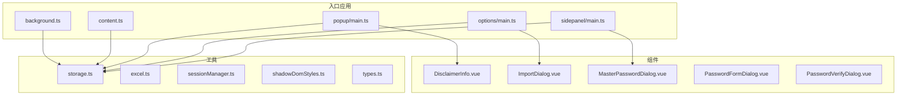
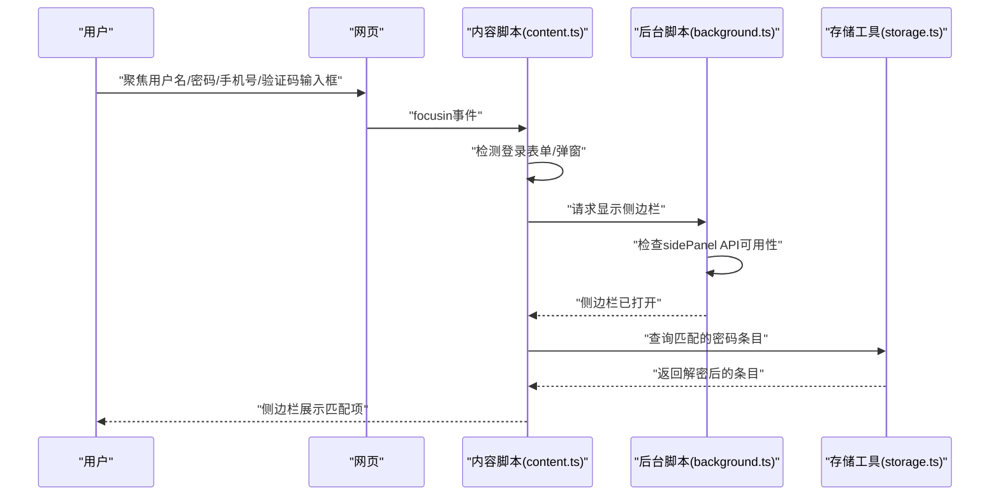
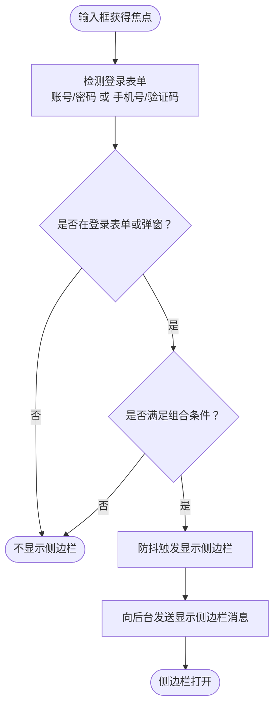
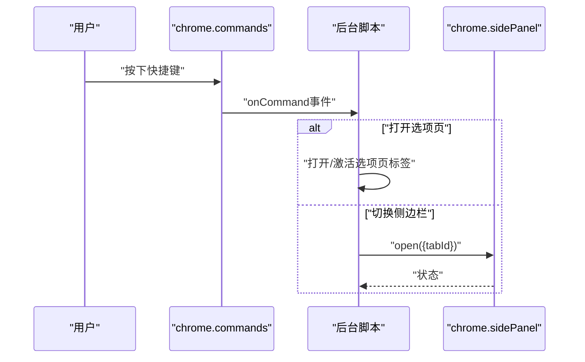
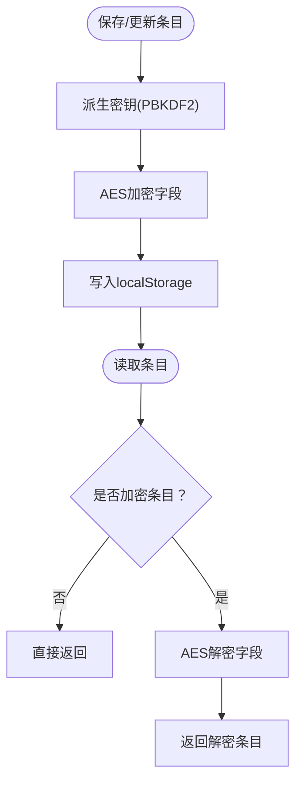
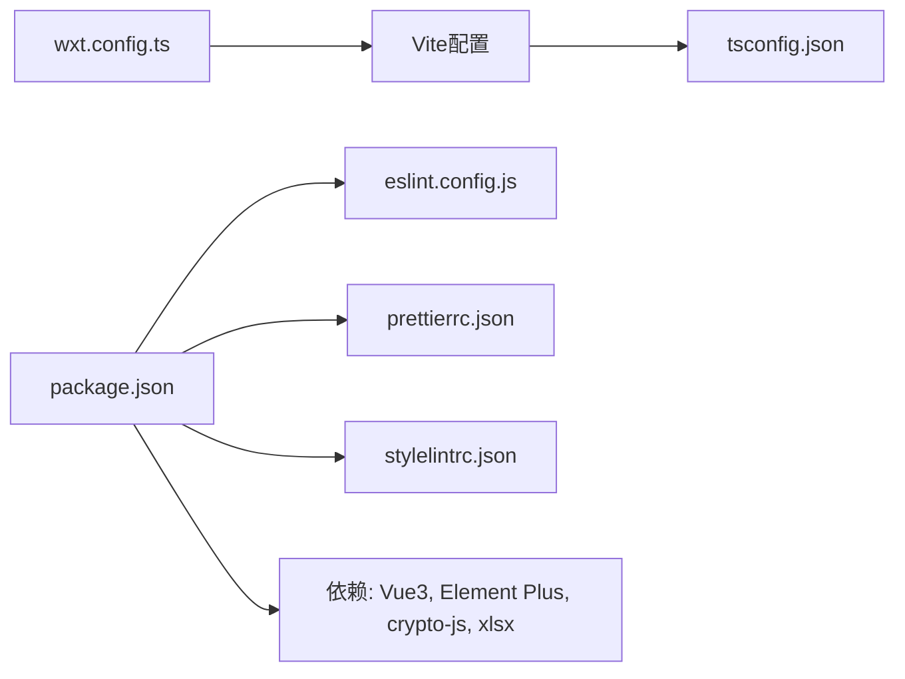

# 开发指南

<cite>
**本文引用的文件**
- [package.json](file://package.json)
- [wxt.config.ts](file://wxt.config.ts)
- [tsconfig.json](file://tsconfig.json)
- [tsconfig.node.json](file://tsconfig.node.json)
- [.prettierrc.json](file://.prettierrc.json)
- [.stylelintrc.json](file://.stylelintrc.json)
- [eslint.config.js](file://eslint.config.js)
- [README.md](file://README.md)
- [task.md](file://task.md)
- [ai-tips.md](file://ai-tips.md)
- [entrypoints/background.ts](file://entrypoints/background.ts)
- [entrypoints/content.ts](file://entrypoints/content.ts)
- [entrypoints/options/main.ts](file://entrypoints/options/main.ts)
- [entrypoints/popup/main.ts](file://entrypoints/popup/main.ts)
- [entrypoints/sidepanel/main.ts](file://entrypoints/sidepanel/main.ts)
- [utils/storage.ts](file://utils/storage.ts)
</cite>

## 目录
1. [简介](#简介)
2. [项目结构](#项目结构)
3. [核心组件](#核心组件)
4. [架构总览](#架构总览)
5. [详细组件分析](#详细组件分析)
6. [依赖关系分析](#依赖关系分析)
7. [性能考虑](#性能考虑)
8. [故障排查指南](#故障排查指南)
9. [结论](#结论)
10. [附录](#附录)

## 简介
本指南面向Account Password Helper项目的开发团队，提供从开发环境配置、代码规范、测试策略到部署流程的全流程标准化实践。项目基于WXT + Vue3 + TypeScript + Vite构建，采用Chrome Extension MV3架构，包含后台脚本、内容脚本与多入口前端应用（popup、options、sidepanel）。文档重点覆盖：
- 开发环境与工具链配置（Node、NPM脚本、TypeScript、ESLint、Prettier、Stylelint）
- 代码规范与格式化策略
- Git工作流与分支策略
- 单元测试、集成测试与端到端测试实施建议
- 构建、打包与发布流程
- 性能监控、错误追踪与调试技巧
- 团队协作规范、代码审查标准与CI配置建议

## 项目结构
项目采用“模块化分层 + 特性入口”的组织方式：
- entrypoints：多入口前端应用（popup、options、sidepanel）与后台脚本、内容脚本
- components：可复用的Vue组件
- utils：通用工具与业务逻辑（如加密、存储、会话管理）
- 类型声明：全局类型定义
- 配置文件：包管理、构建、语言与格式化配置

图表来源
- [entrypoints/popup/main.ts](file://entrypoints/popup/main.ts#L1-L10)
- [entrypoints/options/main.ts](file://entrypoints/options/main.ts#L1-L11)
- [entrypoints/sidepanel/main.ts](file://entrypoints/sidepanel/main.ts#L1-L10)
- [entrypoints/background.ts](file://entrypoints/background.ts#L1-L232)
- [entrypoints/content.ts](file://entrypoints/content.ts#L1-L800)
- [utils/storage.ts](file://utils/storage.ts#L1-L981)

章节来源
- [README.md](file://README.md#L1-L201)
- [task.md](file://task.md#L1-L24)

## 核心组件
- 后台脚本（background.ts）：负责快捷键监听、侧边栏开关控制、选项页打开、标签页状态变更处理
- 内容脚本（content.ts）：负责表单检测、登录场景识别、侧边栏显示/隐藏、消息通信
- 存储工具（storage.ts）：负责主密码设置与校验、条目加解密、排序与搜索、会话有效期管理
- 多入口前端（popup/options/sidepanel）：基于Vue3 + Element Plus构建的UI应用

章节来源
- [entrypoints/background.ts](file://entrypoints/background.ts#L1-L232)
- [entrypoints/content.ts](file://entrypoints/content.ts#L1-L800)
- [utils/storage.ts](file://utils/storage.ts#L1-L981)
- [entrypoints/popup/main.ts](file://entrypoints/popup/main.ts#L1-L10)
- [entrypoints/options/main.ts](file://entrypoints/options/main.ts#L1-L11)
- [entrypoints/sidepanel/main.ts](file://entrypoints/sidepanel/main.ts#L1-L10)

## 架构总览
整体架构围绕Chrome Extension MV3设计，内容脚本在页面上下文中执行，负责检测登录表单并触发侧边栏展示；后台脚本协调侧边栏状态与快捷键；存储工具统一管理本地数据与主密码。

图表来源
- [entrypoints/content.ts](file://entrypoints/content.ts#L1-L800)
- [entrypoints/background.ts](file://entrypoints/background.ts#L1-L232)
- [utils/storage.ts](file://utils/storage.ts#L1-L981)

## 详细组件分析

### 组件A：内容脚本（表单检测与侧边栏控制）
- 职责：检测登录表单（账号/密码、手机号/验证码）、事件委托、MutationObserver、防抖优化、登录场景识别
- 关键流程：聚焦事件 -> 表单检测 -> 登录场景判断 -> 请求后台显示侧边栏
- 性能要点：WeakMap/WeakSet缓存、事件委托、防抖、可见性判断

图表来源
- [entrypoints/content.ts](file://entrypoints/content.ts#L1-L800)
- [entrypoints/background.ts](file://entrypoints/background.ts#L1-L232)

章节来源
- [entrypoints/content.ts](file://entrypoints/content.ts#L1-L800)

### 组件B：后台脚本（侧边栏与快捷键）
- 职责：监听快捷键、打开/切换侧边栏、标签页状态变更时关闭侧边栏、消息路由
- 关键流程：快捷键 -> 打开选项页/切换侧边栏 -> API可用性检查 -> 成功/失败处理

图表来源
- [entrypoints/background.ts](file://entrypoints/background.ts#L1-L232)

章节来源
- [entrypoints/background.ts](file://entrypoints/background.ts#L1-L232)

### 组件C：存储工具（主密码与条目管理）
- 职责：主密码设置/校验、PBKDF2派生密钥、AES加解密、条目增删改查、排序与搜索、会话有效期
- 关键流程：派生密钥 -> 加密条目 -> 存储；读取时自动解密

图表来源
- [utils/storage.ts](file://utils/storage.ts#L1-L981)

章节来源
- [utils/storage.ts](file://utils/storage.ts#L1-L981)

### 组件D：多入口前端（popup/options/sidepanel）
- 职责：基于Vue3 + Element Plus构建UI，挂载到对应HTML容器
- 关键流程：创建应用实例 -> 注册Element Plus -> 挂载根组件

章节来源
- [entrypoints/popup/main.ts](file://entrypoints/popup/main.ts#L1-L10)
- [entrypoints/options/main.ts](file://entrypoints/options/main.ts#L1-L11)
- [entrypoints/sidepanel/main.ts](file://entrypoints/sidepanel/main.ts#L1-L10)

## 依赖关系分析
- 构建与运行时：WXT + Vite + Vue3 + TypeScript
- 代码质量：ESLint + Prettier + Stylelint
- 加密与Excel：crypto-js + xlsx
- UI组件：Element Plus

图表来源
- [wxt.config.ts](file://wxt.config.ts#L1-L48)
- [tsconfig.json](file://tsconfig.json#L1-L33)
- [package.json](file://package.json#L1-L49)
- [eslint.config.js](file://eslint.config.js#L1-L38)
- [.prettierrc.json](file://.prettierrc.json#L1-L39)
- [.stylelintrc.json](file://.stylelintrc.json#L1-L39)

章节来源
- [package.json](file://package.json#L1-L49)
- [wxt.config.ts](file://wxt.config.ts#L1-L48)
- [tsconfig.json](file://tsconfig.json#L1-L33)
- [eslint.config.js](file://eslint.config.js#L1-L38)
- [.prettierrc.json](file://.prettierrc.json#L1-L39)
- [.stylelintrc.json](file://.stylelintrc.json#L1-L39)

## 性能考虑
- 内容脚本
  - 使用事件委托与防抖，降低高频事件带来的性能压力
  - 使用WeakMap/WeakSet避免内存泄漏，缓存字段类型与检测结果
  - MutationObserver仅监听必要属性，减少不必要的重绘
- 存储工具
  - 仅对敏感字段（如密码）进行加密，避免过度加密导致性能损耗
  - 解密失败时采用“安全回退”，保证用户体验
- 构建与打包
  - 使用WXT/Vite按需打包，避免冗余资源
  - TypeScript严格模式与noUnused*规则减少无效代码

## 故障排查指南
- 侧边栏无法打开
  - 检查Chrome版本是否支持sidePanel API（需较新版本）
  - 确认manifest中已声明sidePanel权限
- 表单检测不生效
  - 确认内容脚本已注入（matches范围）
  - 检查登录场景关键词与选择器是否覆盖目标站点
- 主密码相关问题
  - 设置/校验失败：确认salt与hash一致性
  - 解密异常：检查密钥派生参数与数据完整性
- 快捷键冲突
  - 在Chrome扩展管理页调整快捷键绑定

章节来源
- [entrypoints/background.ts](file://entrypoints/background.ts#L1-L232)
- [entrypoints/content.ts](file://entrypoints/content.ts#L1-L800)
- [utils/storage.ts](file://utils/storage.ts#L1-L981)

## 结论
本指南提供了从开发环境到部署发布的完整实践路径，结合项目实际代码结构，明确了各模块职责、关键流程与最佳实践。建议团队在日常开发中严格执行代码规范与质量门禁，持续完善测试与监控体系，保障插件的安全性、稳定性与可维护性。

## 附录

### 开发环境与工具链配置
- Node与包管理
  - 使用NPM脚本统一管理开发、构建、打包与质量检查
- TypeScript
  - 严格模式、路径别名、类型声明与Vue/Chrome扩展类型集成
- 构建工具
  - WXT + Vite，支持Vue单文件组件与模块别名
- 代码质量
  - ESLint（TypeScript + Vue + Prettier集成）、Prettier（统一格式）、Stylelint（CSS/SCSS/Vue）

章节来源
- [package.json](file://package.json#L1-L49)
- [tsconfig.json](file://tsconfig.json#L1-L33)
- [tsconfig.node.json](file://tsconfig.node.json#L1-L11)
- [wxt.config.ts](file://wxt.config.ts#L1-L48)
- [eslint.config.js](file://eslint.config.js#L1-L38)
- [.prettierrc.json](file://.prettierrc.json#L1-L39)
- [.stylelintrc.json](file://.stylelintrc.json#L1-L39)

### 代码规范与格式化
- ESLint
  - 针对JS/TS/TSX/Vue文件的规则集，包含no-unused-vars、prefer-const、no-var等
  - 忽略目录：dist、.output、.wxt、node_modules、*.d.ts
- Prettier
  - 统一语句末尾分号、尾随逗号、单引号、最大行长、缩进等
  - 针对Vue/JSON/Markdown的特殊配置
- Stylelint
  - CSS/SCSS/Vue语法校验，忽略构建产物与缓存目录

章节来源
- [eslint.config.js](file://eslint.config.js#L1-L38)
- [.prettierrc.json](file://.prettierrc.json#L1-L39)
- [.stylelintrc.json](file://.stylelintrc.json#L1-L39)

### Git工作流程与分支策略
- 分支模型
  - main：稳定发布分支
  - develop：集成开发分支
  - feature/*：功能开发分支
  - hotfix/*：紧急修复分支
- 提交规范
  - 类型：feat/fix/docs/style/refactor/test/build/ci
  - 格式：type(scope): subject
- 合并与审查
  - Pull Request需至少一名Reviewer批准
  - 合并前必须通过CI与代码质量检查

[本节为通用流程建议，不直接分析具体文件，故无章节来源]

### 测试策略
- 单元测试
  - 针对utils/storage.ts等纯函数与工具类进行单元测试，覆盖加解密、排序、搜索等逻辑
- 集成测试
  - 基于真实浏览器扩展环境，验证内容脚本与后台脚本的交互
- 端到端测试
  - 使用自动化测试框架（如Playwright）模拟用户操作，验证表单检测与侧边栏填充流程

[本节为通用测试建议，不直接分析具体文件，故无章节来源]

### 构建、打包与发布
- 构建命令
  - 开发：wxt（支持热重载）
  - 生产：wxt build，随后wxt zip生成压缩包
  - Firefox：wxt build -b firefox
- 发布流程
  - 本地构建并通过Chrome Web Store开发者仪表板上传
  - 为Firefox通过AMO提交

章节来源
- [package.json](file://package.json#L6-L21)
- [README.md](file://README.md#L58-L83)

### 性能监控、错误追踪与调试
- 性能监控
  - 使用Performance API与网络面板分析页面渲染与脚本执行
- 错误追踪
  - 在关键路径（加解密、存储读写、消息通信）添加日志与错误上报
- 调试技巧
  - 使用Chrome DevTools断点与Console调试内容脚本
  - 在后台脚本中打印消息通道状态与sidePanel API调用结果

章节来源
- [entrypoints/content.ts](file://entrypoints/content.ts#L1-L800)
- [entrypoints/background.ts](file://entrypoints/background.ts#L1-L232)
- [utils/storage.ts](file://utils/storage.ts#L1-L981)

### 团队协作规范与代码审查标准
- 代码审查
  - 关注安全性（主密码与敏感数据处理）、可维护性（模块化与命名）、性能（缓存与防抖）
  - 通过ESLint/Stylelint/Prettier统一风格，减少主观分歧
- 持续集成
  - CI中执行：类型检查、ESLint、Stylelint、Prettier检查、构建与打包
  - 可选：单元测试与端到端测试

章节来源
- [task.md](file://task.md#L1-L24)
- [ai-tips.md](file://ai-tips.md#L1-L25)
- [eslint.config.js](file://eslint.config.js#L1-L38)
- [package.json](file://package.json#L12-L21)