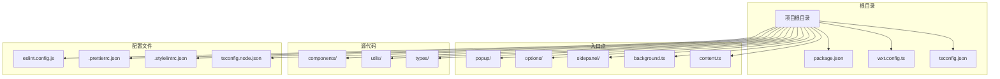
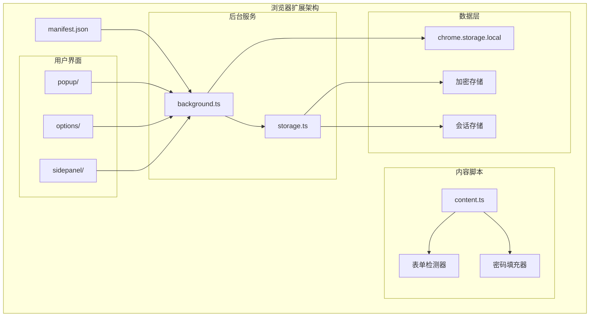
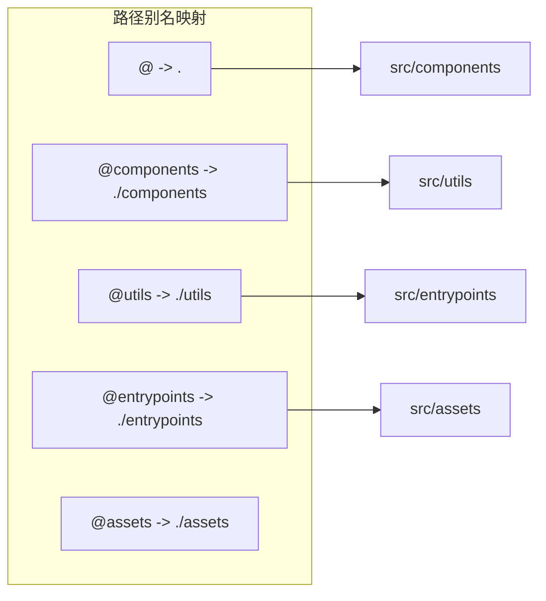
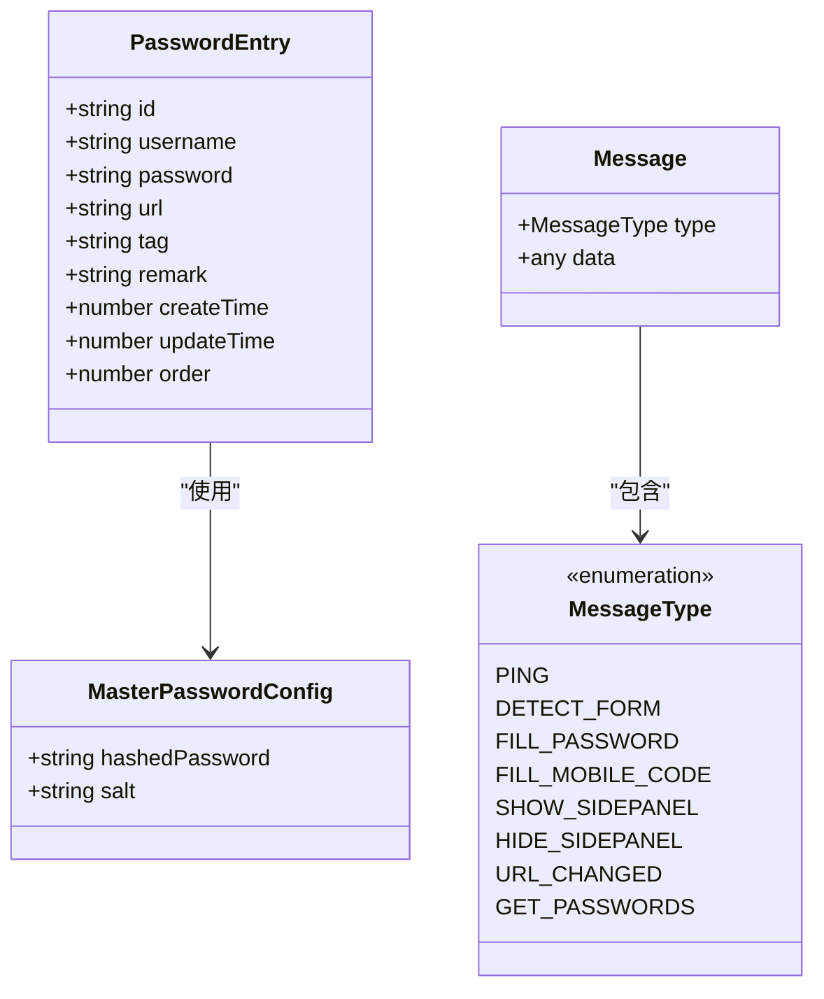
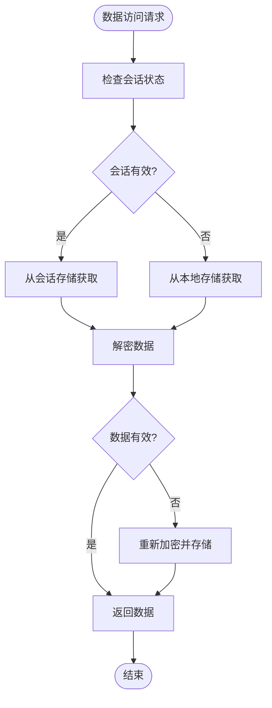

# 开发环境配置

<cite>
**本文档引用的文件**
- [package.json](file://package.json)
- [wxt.config.ts](file://wxt.config.ts)
- [tsconfig.json](file://tsconfig.json)
- [tsconfig.node.json](file://tsconfig.node.json)
- [eslint.config.js](file://eslint.config.js)
- [.prettierrc.json](file://.prettierrc.json)
- [.stylelintrc.json](file://.stylelintrc.json)
- [README.md](file://README.md)
- [entrypoints/background.ts](file://entrypoints/background.ts)
- [entrypoints/content.ts](file://entrypoints/content.ts)
- [entrypoints/options/App.vue](file://entrypoints/options/App.vue)
- [entrypoints/sidepanel/App.vue](file://entrypoints/sidepanel/App.vue)
- [entrypoints/popup/main.ts](file://entrypoints/popup/main.ts)
- [utils/types.ts](file://utils/types.ts)
- [utils/storage.ts](file://utils/storage.ts)
</cite>

## 目录
1. [简介](#简介)
2. [项目结构](#项目结构)
3. [核心组件](#核心组件)
4. [架构概览](#架构概览)
5. [详细组件分析](#详细组件分析)
6. [依赖分析](#依赖分析)
7. [性能考虑](#性能考虑)
8. [故障排除指南](#故障排除指南)
9. [结论](#结论)
10. [附录](#附录)

## 简介

Account Password Helper 是一个基于 WXT + Vue3 + TypeScript 的 Chrome 扩展程序，用于自动管理和填充网站账号密码。该项目采用了现代化的前端技术栈，包括 Vue3 组件化开发、TypeScript 类型系统、WXT 构建工具以及 Element Plus UI 组件库。

本指南将详细介绍开发环境的完整配置过程，包括 Node.js 版本要求、包管理器使用、TypeScript 编译配置和 WXT 框架设置。同时提供 IDE 设置建议、调试配置、热重载设置以及不同操作系统下的环境搭建步骤。

## 项目结构

项目采用模块化的目录结构，主要分为以下几个核心部分：



**图表来源**
- [package.json](file://package.json#L1-L49)
- [wxt.config.ts](file://wxt.config.ts#L1-L48)
- [tsconfig.json](file://tsconfig.json#L1-L33)

**章节来源**
- [package.json](file://package.json#L1-L49)
- [README.md](file://README.md#L27-L34)

## 核心组件

### Node.js 版本要求

根据项目配置，推荐使用以下 Node.js 版本：
- **最低版本**: Node.js 18.x 或更高版本
- **推荐版本**: Node.js 18.17.0 或更高版本

项目使用了现代 JavaScript 特性和 ES2020 标准，需要较新的 Node.js 版本来支持完整的功能集。

### 包管理器选择

项目同时支持 npm 和 yarn，但推荐使用 npm 作为默认包管理器：

```bash
# 使用 npm（推荐）
npm install
npm run dev

# 使用 yarn
yarn install
yarn dev
```

### TypeScript 编译配置

项目采用双 tsconfig 配置策略：

1. **主配置** (`tsconfig.json`): 针对应用代码的编译配置
2. **Node 配置** (`tsconfig.node.json`): 针对构建工具的配置

**章节来源**
- [tsconfig.json](file://tsconfig.json#L1-L33)
- [tsconfig.node.json](file://tsconfig.node.json#L1-L11)

## 架构概览

项目采用 MV3 架构，包含以下核心组件：



**图表来源**
- [entrypoints/background.ts](file://entrypoints/background.ts#L1-L232)
- [entrypoints/content.ts](file://entrypoints/content.ts#L1-L800)
- [utils/storage.ts](file://utils/storage.ts#L1-L200)

## 详细组件分析

### WXT 框架配置

WXT 是项目的核心构建工具，提供了现代化的扩展开发体验：

#### 路径别名配置



**图表来源**
- [wxt.config.ts](file://wxt.config.ts#L7-L17)

#### 权限配置

项目声明了以下核心权限：
- `storage`: 本地数据存储
- `activeTab`: 访问当前标签页
- `scripting`: 注入脚本
- `sidePanel`: 侧边栏功能

**章节来源**
- [wxt.config.ts](file://wxt.config.ts#L18-L46)

### TypeScript 类型系统

项目建立了完整的类型定义体系：



**图表来源**
- [utils/types.ts](file://utils/types.ts#L1-L96)

**章节来源**
- [utils/types.ts](file://utils/types.ts#L1-L96)

### 存储系统设计

项目实现了多层次的数据存储策略：



**图表来源**
- [utils/storage.ts](file://utils/storage.ts#L37-L200)

**章节来源**
- [utils/storage.ts](file://utils/storage.ts#L1-L200)

## 依赖分析

### 开发依赖关系

```mermaid
graph TB
subgraph "构建工具链"
WXT[WXT 0.19.16]
Vite[Vite]
TypeScript[TypeScript 5.2.2]
Vue[Vue 3.3.8]
end
subgraph "代码质量"
ESLint[ESLint 9.36.0]
Prettier[Prettier 3.6.2]
StyleLint[StyleLint 16.24.0]
end
subgraph "UI 组件"
ElementPlus[Element Plus 2.4.2]
CryptoJS[CryptoJS 4.2.0]
XLSX[XLSX 0.18.5]
end
subgraph "类型定义"
ChromeTypes[@types/chrome 0.0.251]
CryptoTypes[@types/crypto-js 4.2.1]
VueTypes[@wxt-dev/module-vue]
end
WXT --> Vite
WXT --> TypeScript
WXT --> Vue
Vue --> ElementPlus
Vue --> CryptoJS
Vue --> XLSX
ESLint --> TypeScript
StyleLint --> Vue
```

**图表来源**
- [package.json](file://package.json#L22-L47)

**章节来源**
- [package.json](file://package.json#L22-L47)

### 脚本命令分析

项目提供了丰富的开发脚本：

| 脚本命令 | 功能描述 | 使用场景 |
|---------|----------|----------|
| `npm run dev` | 启动开发服务器 | 日常开发调试 |
| `npm run build` | 构建生产版本 | 生成发布包 |
| `npm run lint` | 代码风格检查 | 代码质量保证 |
| `npm run format` | 代码格式化 | 代码美化 |
| `npm run typecheck` | TypeScript 类型检查 | 类型安全验证 |

**章节来源**
- [package.json](file://package.json#L6-L21)

## 性能考虑

### 编译优化

项目采用了多项性能优化策略：

1. **模块解析优化**: 使用 `bundler` 模式提高模块解析性能
2. **严格模式**: 启用 TypeScript 严格模式确保类型安全
3. **路径别名**: 避免深层相对路径，提高编译速度
4. **增量编译**: 利用 TypeScript 的增量编译特性

### 运行时优化

1. **懒加载**: Vue 组件按需加载
2. **缓存策略**: 使用 WeakMap 和 WeakSet 避免内存泄漏
3. **防抖机制**: 表单检测使用防抖优化性能
4. **事件委托**: 减少事件监听器数量

## 故障排除指南

### 常见开发问题

#### 1. TypeScript 编译错误

**问题**: 编译时报错，提示类型不匹配
**解决方案**: 
- 检查 `tsconfig.json` 中的严格模式设置
- 确保所有组件都正确声明了 props 类型
- 运行 `npm run typecheck` 进行类型检查

#### 2. WXT 构建失败

**问题**: `wxt build` 命令执行失败
**解决方案**:
- 确认 Node.js 版本符合要求（>= 18.17.0）
- 清理 `node_modules` 和 `package-lock.json` 后重新安装
- 检查 `wxt.config.ts` 中的配置项

#### 3. Chrome 扩展加载失败

**问题**: 在 Chrome 中加载扩展时出现错误
**解决方案**:
- 确保开发者模式已开启
- 清理浏览器缓存
- 检查 manifest 权限配置
- 确认证书和签名正确

### 调试技巧

#### 1. 控制台调试

```javascript
// 在 background 脚本中添加调试信息
console.log('Background script loaded');
console.log('Current tab:', tab);

// 在 content 脚本中调试 DOM 操作
console.log('Form detected:', formFields);
```

#### 2. 浏览器开发者工具

- **扩展页面**: `chrome://extensions/`
- **开发者工具**: 检查 Console、Sources、Network 标签
- **存储检查**: 查看 chrome.storage 中的数据状态

**章节来源**
- [entrypoints/background.ts](file://entrypoints/background.ts#L1-L232)
- [entrypoints/content.ts](file://entrypoints/content.ts#L1-L800)

## 结论

Account Password Helper 项目采用现代化的开发技术栈，提供了完整的 Chrome 扩展开发环境。通过合理的架构设计和配置管理，项目实现了良好的可维护性和扩展性。

开发环境的关键要点包括：
- 使用 Node.js 18.17.0+ 确保兼容性
- 采用 WXT 框架简化构建流程
- 利用 TypeScript 提供类型安全保障
- 实施严格的代码质量控制
- 设计合理的存储和权限管理

## 附录

### IDE 设置建议

#### VS Code 推荐插件

1. **ESLint**: 代码质量检查
2. **Prettier**: 代码格式化
3. **Vue Language Features**: Vue 开发支持
4. **TypeScript Importer**: TypeScript 导入管理
5. **Bracket Pair Colorizer**: 括号配对高亮
6. **Path Intellisense**: 路径自动补全

#### VS Code 设置

```json
{
    "editor.formatOnSave": true,
    "editor.codeActionsOnSave": {
        "source.fixAll.eslint": true
    },
    "typescript.preferences.importModuleSpecifier": "relative",
    "files.associations": {
        "*.vue": "vue"
    }
}
```

### 环境变量配置

项目当前不需要额外的环境变量配置。所有配置都通过 `wxt.config.ts` 和 `package.json` 管理。

### 热重载设置

WXT 框架内置了热重载功能，开发时自动监听文件变化并实时更新扩展。

### 不同操作系统设置

#### macOS 设置步骤

```bash
# 安装 Node.js (推荐使用 nvm)
curl -o- https://raw.githubusercontent.com/nvm-sh/nvm/v0.39.0/install.sh | bash
nvm install 18.17.0
nvm use 18.17.0

# 克隆项目
git clone <repository-url>
cd account-password-helper

# 安装依赖
npm install

# 启动开发服务器
npm run dev
```

#### Windows 设置步骤

```cmd
REM 安装 Node.js 18.17.0+
REM 下载并安装 Node.js

REM 克隆项目
git clone <repository-url>
cd account-password-helper

REM 安装依赖
npm install

REM 启动开发服务器
npm run dev
```

#### Linux 设置步骤

```bash
# 使用 nvm 安装 Node.js
curl -o- https://raw.githubusercontent.com/nvm-sh/nvm/v0.39.0/install.sh | bash
source ~/.bashrc
nvm install 18.17.0
nvm use 18.17.0

# 安装依赖
npm install

# 启动开发服务器
npm run dev
```

### 开发服务器配置

项目使用 WXT 的内置开发服务器，默认配置如下：

- **主机**: localhost
- **端口**: 3000
- **HTTPS**: 禁用
- **热重载**: 启用

如需自定义配置，可在 `wxt.config.ts` 中修改 Vite 配置。

### 代理设置

项目未配置代理服务器。如需网络访问，可通过 Chrome 扩展的 `host_permissions` 权限直接访问目标网站。