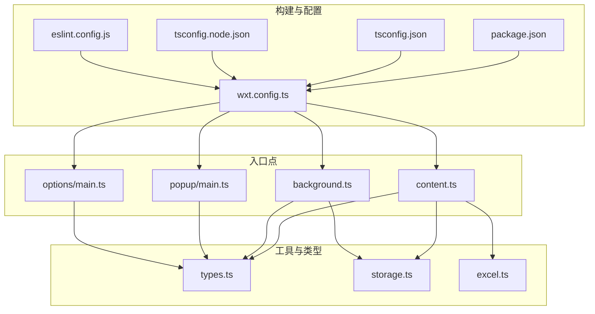
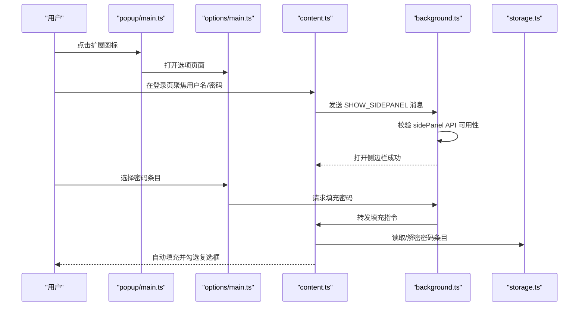
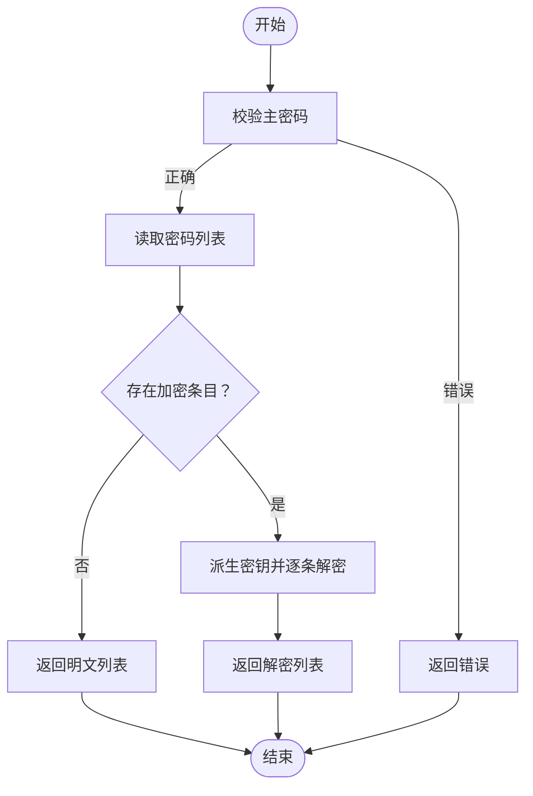
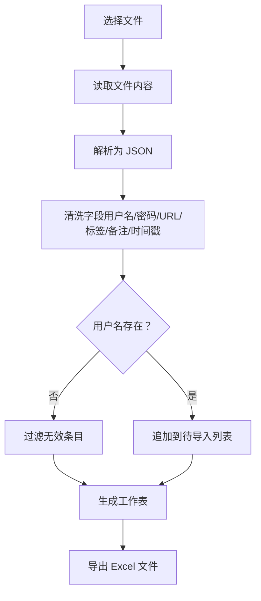
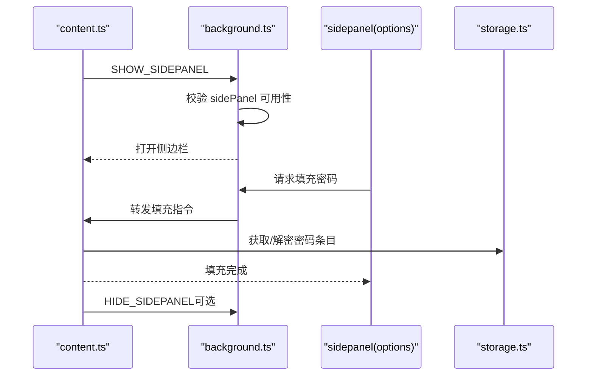
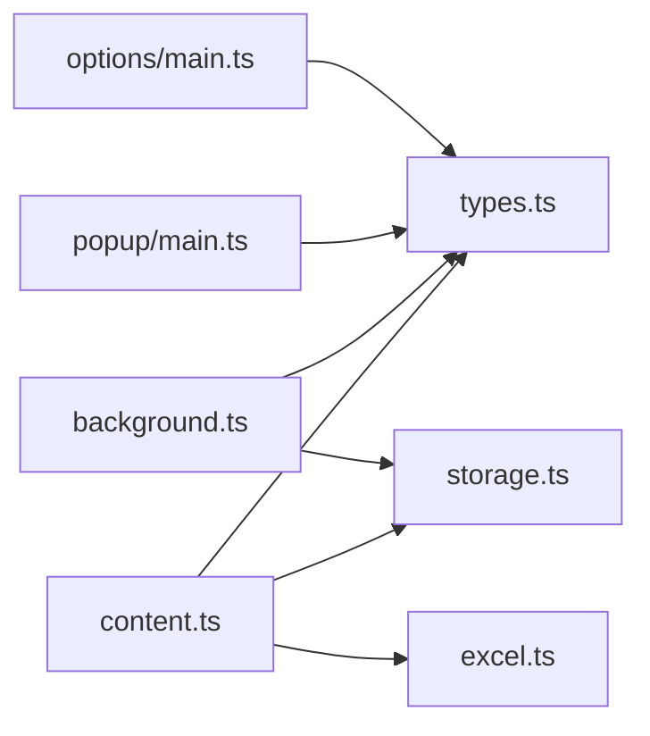

# 构建与部署

<cite>
**本文引用的文件**
- [wxt.config.ts](file://wxt.config.ts)
- [package.json](file://package.json)
- [tsconfig.json](file://tsconfig.json)
- [tsconfig.node.json](file://tsconfig.node.json)
- [eslint.config.js](file://eslint.config.js)
- [entrypoints/background.ts](file://entrypoints/background.ts)
- [entrypoints/content.ts](file://entrypoints/content.ts)
- [entrypoints/options/main.ts](file://entrypoints/options/main.ts)
- [entrypoints/popup/main.ts](file://entrypoints/popup/main.ts)
- [utils/types.ts](file://utils/types.ts)
- [utils/storage.ts](file://utils/storage.ts)
- [utils/excel.ts](file://utils/excel.ts)
- [test-page.html](file://test-page.html)
- [README.md](file://README.md)
</cite>

## 目录
1. [简介](#简介)
2. [项目结构](#项目结构)
3. [核心组件](#核心组件)
4. [架构总览](#架构总览)
5. [详细组件分析](#详细组件分析)
6. [依赖关系分析](#依赖关系分析)
7. [性能考虑](#性能考虑)
8. [故障排查指南](#故障排查指南)
9. [结论](#结论)
10. [附录](#附录)

## 简介
本指南面向 Account Password Helper 项目，提供从开发到发布的完整构建与部署方案。内容涵盖 WXT 构建配置、Webpack/Vite 打包设置、资源优化策略、开发/生产/调试版本差异、Chrome Web Store 发布流程、Manifest v3 适配与权限申请、版本管理与更新回滚策略，以及自动化部署与 CI/CD 流水线建议与发布检查清单。

## 项目结构
项目采用 WXT + Vue3 + TypeScript + Vite 的现代浏览器插件架构，入口点分为 background、content、popup、sidepanel（通过 options 页面承载）等模块，配合工具类与类型定义，形成清晰的分层结构。

图表来源
- [wxt.config.ts](file://wxt.config.ts#L1-L48)
- [package.json](file://package.json#L1-L49)
- [tsconfig.json](file://tsconfig.json#L1-L33)
- [tsconfig.node.json](file://tsconfig.node.json#L1-L11)
- [eslint.config.js](file://eslint.config.js#L1-L38)
- [entrypoints/background.ts](file://entrypoints/background.ts#L1-L232)
- [entrypoints/content.ts](file://entrypoints/content.ts#L1-L800)
- [entrypoints/options/main.ts](file://entrypoints/options/main.ts#L1-L11)
- [entrypoints/popup/main.ts](file://entrypoints/popup/main.ts#L1-L10)
- [utils/types.ts](file://utils/types.ts#L1-L96)
- [utils/storage.ts](file://utils/storage.ts#L1-L800)
- [utils/excel.ts](file://utils/excel.ts#L1-L155)

章节来源
- [README.md](file://README.md#L1-L201)
- [wxt.config.ts](file://wxt.config.ts#L1-L48)
- [package.json](file://package.json#L1-L49)

## 核心组件
- 构建配置与打包
  - WXT 配置：模块化、路径别名、Manifest v3 字段、快捷键、权限声明
  - Vite 配置：路径别名映射至 src 目录层级
  - 脚本命令：开发、构建、打包压缩、类型检查、代码规范与格式化
- 入口点
  - background：生命周期、快捷键、消息通道、侧边栏控制、选项页管理
  - content：表单检测、事件委托、侧边栏触发、消息转发
  - popup/options：Vue 应用挂载、Element Plus 集成
- 工具与类型
  - 类型定义：消息类型、密码条目、主密码配置
  - 存储：主密码校验、加密派生、AES 加解密、排序与搜索、会话有效期
  - Excel：导入导出、模板下载

章节来源
- [wxt.config.ts](file://wxt.config.ts#L1-L48)
- [package.json](file://package.json#L6-L21)
- [entrypoints/background.ts](file://entrypoints/background.ts#L1-L232)
- [entrypoints/content.ts](file://entrypoints/content.ts#L1-L800)
- [entrypoints/options/main.ts](file://entrypoints/options/main.ts#L1-L11)
- [entrypoints/popup/main.ts](file://entrypoints/popup/main.ts#L1-L10)
- [utils/types.ts](file://utils/types.ts#L1-L96)
- [utils/storage.ts](file://utils/storage.ts#L1-L800)
- [utils/excel.ts](file://utils/excel.ts#L1-L155)

## 架构总览
下图展示浏览器插件在 Manifest v3 下的运行时交互：content script 检测表单并触发侧边栏，background 管理侧边栏与选项页，popup/options 提供用户界面，工具模块负责数据与加密。

图表来源
- [entrypoints/popup/main.ts](file://entrypoints/popup/main.ts#L1-L10)
- [entrypoints/options/main.ts](file://entrypoints/options/main.ts#L1-L11)
- [entrypoints/content.ts](file://entrypoints/content.ts#L1-L800)
- [entrypoints/background.ts](file://entrypoints/background.ts#L1-L232)
- [utils/storage.ts](file://utils/storage.ts#L1-L800)

## 详细组件分析

### WXT 构建配置与打包设置
- 模块与别名
  - 启用 Vue 模块，配置 Vite 别名映射至根目录与子目录，便于统一导入
- Manifest v3 字段
  - 名称、描述、版本、权限与主机权限、快捷键命令
- 构建脚本
  - 开发：wxt
  - 生产：wxt build
  - 打包：wxt zip（postbuild 钩子）
  - Firefox：wxt -b firefox
- TypeScript 配置
  - ESNext 模块解析、严格模式、路径别名与 baseUrl
  - tsconfig.node.json 限定配置范围
- 代码规范
  - ESLint 配置忽略 dist/.output/.wxt 与类型声明文件，规则偏向宽松但保留关键检查

章节来源
- [wxt.config.ts](file://wxt.config.ts#L1-L48)
- [package.json](file://package.json#L6-L21)
- [tsconfig.json](file://tsconfig.json#L1-L33)
- [tsconfig.node.json](file://tsconfig.node.json#L1-L11)
- [eslint.config.js](file://eslint.config.js#L1-L38)

### 开发环境构建
- 启动方式
  - npm run dev 或 npm run dev:firefox
- 特性
  - 热更新、源码映射、TypeScript 类型检查、ESLint/Stylelint 校验
- 调试建议
  - 使用 test-page.html 验证表单检测与填充链路
  - 在 background/content 中设置断点观察消息流与侧边栏状态

章节来源
- [package.json](file://package.json#L6-L21)
- [test-page.html](file://test-page.html#L1-L166)

### 生产环境构建
- 构建命令
  - npm run build：生成 MV3 目标产物
  - npm run postbuild：自动打包为 ZIP
- 输出位置
  - 产物位于 .output/chrome-mv3（参考 README）
- 优化策略
  - 由 WXT/Vite 默认优化，结合 TypeScript 严格模式减少运行时错误
  - 建议在 CI 中开启压缩与体积可视化（可选）

章节来源
- [package.json](file://package.json#L6-L21)
- [README.md](file://README.md#L64-L82)

### 调试版本构建
- 建议做法
  - 通过环境变量或构建参数区分 dev/prod（可在 package.json scripts 中扩展）
  - 保留 console 日志与断点能力，便于定位 content/script 交互问题
- 与生产版本差异
  - 生产版本强调最小化与稳定性，调试版本强调可观测性

[本节为通用实践说明，不直接分析具体文件，故无“章节来源”]

### Manifest v3 适配与权限申请
- 权限
  - storage、activeTab、scripting、sidePanel
  - host_permissions：<all_urls>
- 快捷键
  - open_options、toggle_sidepanel，跨平台默认/Mac 组合键
- 适配要点
  - background 使用 defineBackground，content 使用 defineContentScript
  - 通过 chrome.sidePanel API 控制侧边栏，兼容低版本降级提示

章节来源
- [wxt.config.ts](file://wxt.config.ts#L18-L46)
- [entrypoints/background.ts](file://entrypoints/background.ts#L1-L232)

### 资源优化策略
- 代码拆分与懒加载
  - Vue 组件按需加载，入口按需引入
- 构建优化
  - 使用 WXT/Vite 默认压缩与 Tree Shaking
  - TypeScript 严格模式减少冗余代码
- 第三方库
  - crypto-js、xlsx、element-plus 已在依赖中声明，避免重复打包
- 资源体积监控
  - 建议在 CI 中集成体积报告（可选）

章节来源
- [package.json](file://package.json#L22-L46)
- [tsconfig.json](file://tsconfig.json#L1-L33)

### 数据与加密流程

图表来源
- [utils/storage.ts](file://utils/storage.ts#L514-L555)
- [utils/types.ts](file://utils/types.ts#L4-L41)

章节来源
- [utils/storage.ts](file://utils/storage.ts#L1-L800)
- [utils/types.ts](file://utils/types.ts#L1-L96)

### Excel 导入导出流程

图表来源
- [utils/excel.ts](file://utils/excel.ts#L50-L114)

章节来源
- [utils/excel.ts](file://utils/excel.ts#L1-L155)

### 侧边栏与消息通道

图表来源
- [entrypoints/content.ts](file://entrypoints/content.ts#L1-L800)
- [entrypoints/background.ts](file://entrypoints/background.ts#L1-L232)
- [utils/storage.ts](file://utils/storage.ts#L1-L800)

章节来源
- [entrypoints/content.ts](file://entrypoints/content.ts#L1-L800)
- [entrypoints/background.ts](file://entrypoints/background.ts#L1-L232)
- [utils/storage.ts](file://utils/storage.ts#L1-L800)

## 依赖关系分析
- 组件耦合
  - content 与 background 通过消息类型通信，低耦合高内聚
  - storage 作为数据层，被 content 与 options 调用
- 外部依赖
  - Vue3、Element Plus、crypto-js、xlsx、WXT、Vite
- 潜在循环依赖
  - 未发现直接循环依赖，建议保持工具模块纯函数风格

图表来源
- [entrypoints/content.ts](file://entrypoints/content.ts#L1-L800)
- [entrypoints/background.ts](file://entrypoints/background.ts#L1-L232)
- [entrypoints/popup/main.ts](file://entrypoints/popup/main.ts#L1-L10)
- [entrypoints/options/main.ts](file://entrypoints/options/main.ts#L1-L11)
- [utils/types.ts](file://utils/types.ts#L1-L96)
- [utils/storage.ts](file://utils/storage.ts#L1-L800)
- [utils/excel.ts](file://utils/excel.ts#L1-L155)

章节来源
- [entrypoints/content.ts](file://entrypoints/content.ts#L1-L800)
- [entrypoints/background.ts](file://entrypoints/background.ts#L1-L232)
- [entrypoints/popup/main.ts](file://entrypoints/popup/main.ts#L1-L10)
- [entrypoints/options/main.ts](file://entrypoints/options/main.ts#L1-L11)
- [utils/types.ts](file://utils/types.ts#L1-L96)
- [utils/storage.ts](file://utils/storage.ts#L1-L800)
- [utils/excel.ts](file://utils/excel.ts#L1-L155)

## 性能考虑
- 表单检测
  - 使用 MutationObserver 与事件委托，降低监听数量
  - 防抖优化，减少频繁触发
- 存储与加密
  - 仅在需要时解密，避免全量解密
  - PBKDF2 派生密钥，AES-CBC 加密，兼顾安全与性能
- 构建与加载
  - 使用 Vite 默认优化，按需加载组件
  - 保持 TypeScript 严格模式，减少运行时分支

[本节为通用性能建议，不直接分析具体文件，故无“章节来源”]

## 故障排查指南
- 侧边栏不显示
  - 检查 Chrome 版本是否支持 sidePanel API（Chrome 114+）
  - 确认 background.ts 中的 API 可用性判断与错误日志
- 快捷键无效
  - 在扩展管理页检查快捷键设置，确认未被系统或其他扩展占用
- Excel 导入失败
  - 确认列名符合支持格式（用户名/密码/URL/标签/备注等）
  - 检查文件是否损坏或被杀毒软件拦截
- 主密码相关
  - 忘记主密码无法找回，建议定期导出备份
  - 验证主密码时注意大小写与空格处理

章节来源
- [entrypoints/background.ts](file://entrypoints/background.ts#L1-L232)
- [utils/storage.ts](file://utils/storage.ts#L118-L143)
- [utils/excel.ts](file://utils/excel.ts#L50-L114)
- [README.md](file://README.md#L174-L194)

## 结论
本项目基于 WXT/Vite 实现了完整的 MV3 插件开发与构建流程，具备良好的模块化与可维护性。通过明确的入口点职责划分、完善的消息通道与存储加密机制，以及可扩展的构建脚本与规范配置，能够支撑从开发到发布的全流程需求。建议在 CI 中加入体积报告与自动化测试，持续提升发布质量与效率。

[本节为总结性内容，不直接分析具体文件，故无“章节来源”]

## 附录

### 版本管理与更新机制
- 版本号管理
  - 在 wxt.config.ts 与 package.json 中统一维护版本号
- 更新策略
  - 采用语义化版本，小版本用于功能迭代，补丁版本用于修复
- 回滚策略
  - 保留上一版本产物，必要时回退 ZIP 包
  - 若涉及存储结构变更，提供迁移脚本与降级兼容

章节来源
- [wxt.config.ts](file://wxt.config.ts#L21-L21)
- [package.json](file://package.json#L3-L3)

### 自动化部署与 CI/CD 流水线建议
- 触发条件
  - push 到 main 分支或打 Tag
- 步骤建议
  - 安装依赖、类型检查、代码规范检查、单元测试（可选）
  - 构建生产版本、生成 ZIP 包、上传制品
  - 生成体积报告（可选）
- 发布检查清单
  - 构建产物完整性、ZIP 包可安装性、侧边栏与快捷键功能验证、Excel 导入导出可用性、主密码与数据安全验证

[本节为通用流程建议，不直接分析具体文件，故无“章节来源”]

### Chrome Web Store 发布流程
- 准备材料
  - 已签名的 ZIP 包、应用截图、隐私政策链接、发布说明
- 提交审核
  - 登录开发者后台，创建新应用或编辑现有应用
  - 上传 ZIP 包，填写元数据与权限说明
- 上线与更新
  - 审核通过后上线，后续通过 ZIP 包进行增量更新

[本节为通用流程说明，不直接分析具体文件，故无“章节来源”]