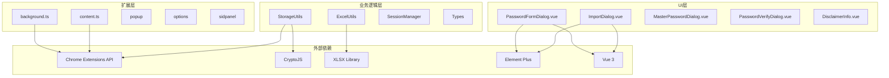
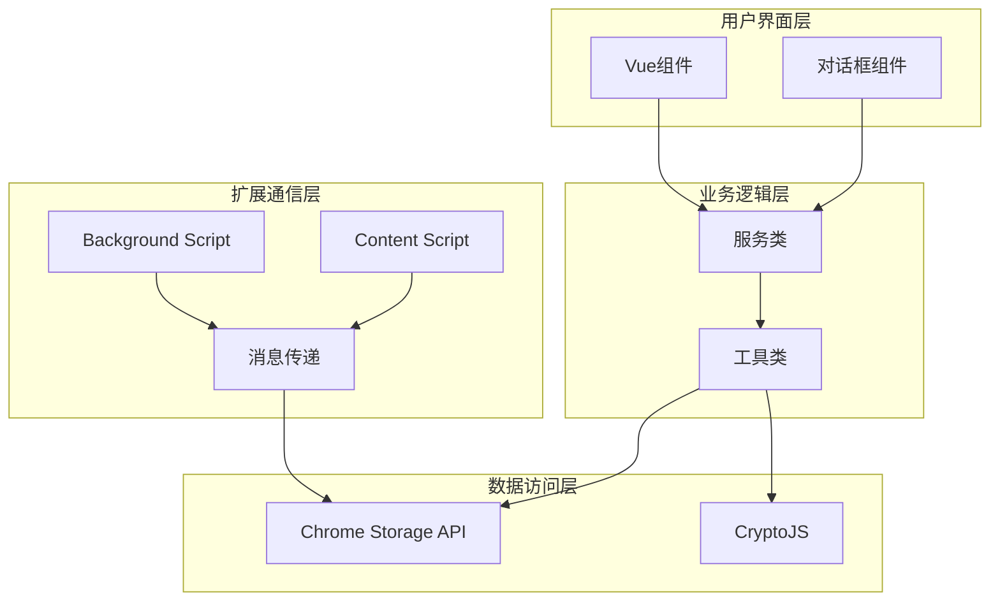
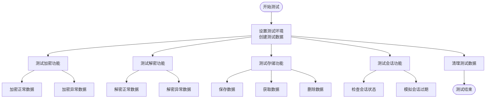
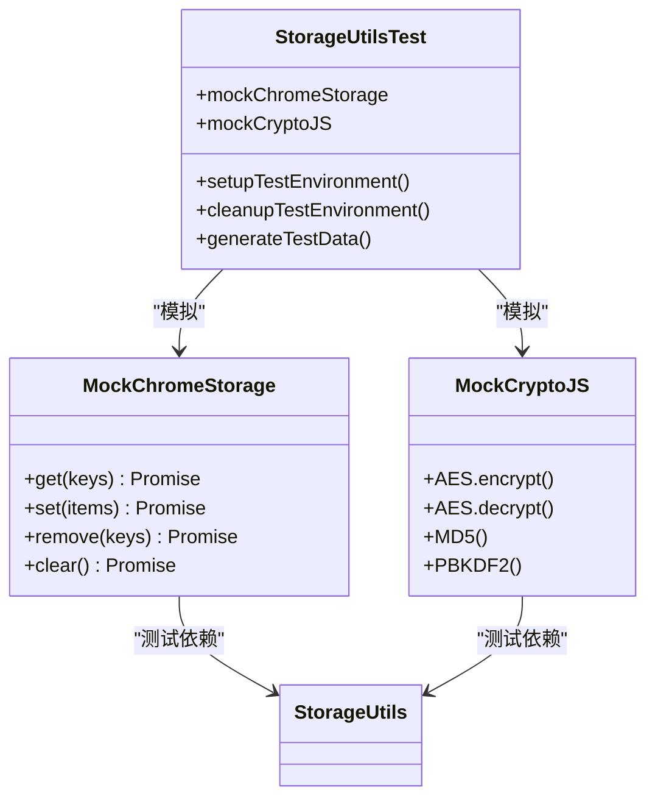
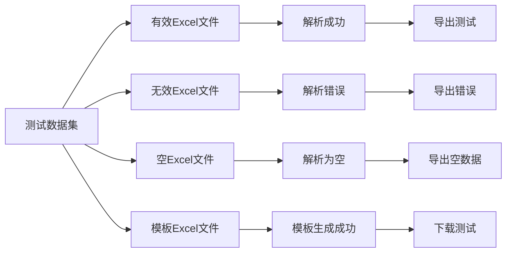
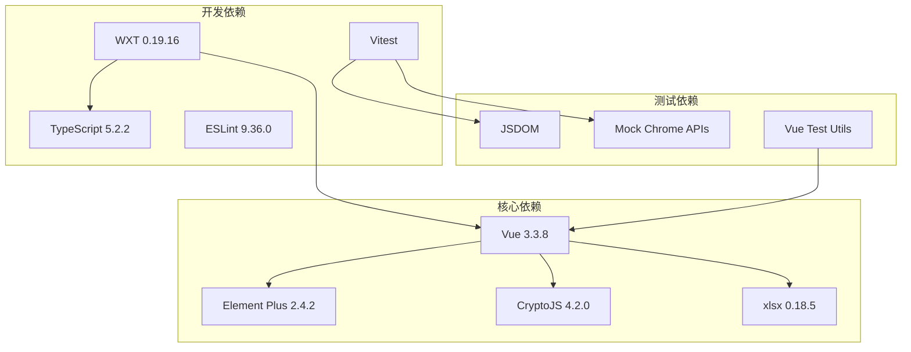
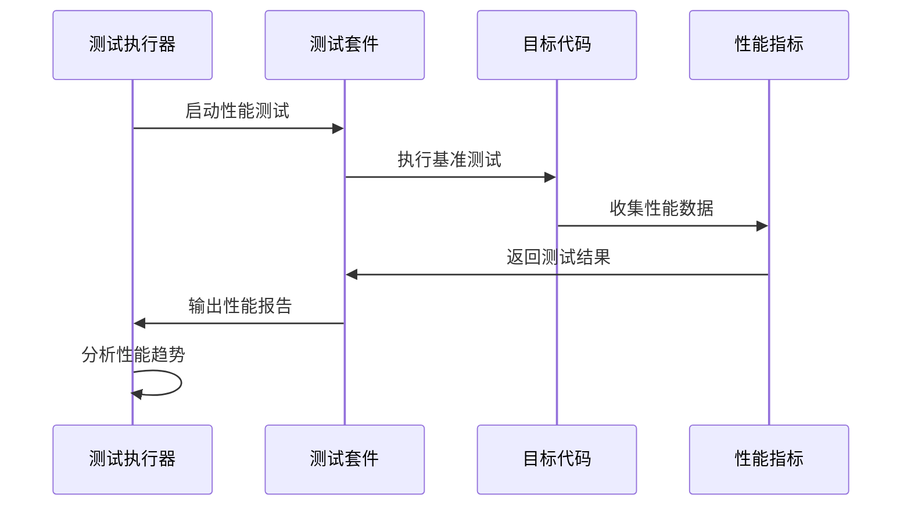

# 测试策略

<cite>
**本文档引用的文件**
- [package.json](file://package.json)
- [wxt.config.ts](file://wxt.config.ts)
- [storage.ts](file://utils/storage.ts)
- [excel.ts](file://utils/excel.ts)
- [sessionManager.ts](file://utils/sessionManager.ts)
- [types.ts](file://utils/types.ts)
- [PasswordFormDialog.vue](file://components/PasswordFormDialog.vue)
- [ImportDialog.vue](file://components/ImportDialog.vue)
- [background.ts](file://entrypoints/background.ts)
- [content.ts](file://entrypoints/content.ts)
- [test-page.html](file://test-page.html)
- [eslint.config.js](file://eslint.config.js)
</cite>

## 目录
1. [引言](#引言)
2. [项目结构](#项目结构)
3. [核心组件](#核心组件)
4. [架构概览](#架构概览)
5. [详细组件分析](#详细组件分析)
6. [依赖关系分析](#依赖关系分析)
7. [性能考虑](#性能考虑)
8. [故障排除指南](#故障排除指南)
9. [结论](#结论)
10. [附录](#附录)

## 引言

Account Password Helper是一个Chrome扩展程序，用于管理和自动填充账号密码信息。本测试策略文档旨在为该项目建立全面的测试框架，涵盖单元测试、集成测试和端到端测试，确保系统的可靠性、安全性和性能表现。

该扩展程序具有以下核心特性：
- 密码存储和加密管理
- Excel数据导入导出
- Chrome扩展消息通信
- Vue组件界面交互
- 会话管理和状态控制

## 项目结构

项目采用模块化架构，主要分为以下几个层次：

**图表来源**
- [background.ts](file://entrypoints/background.ts#L1-L232)
- [content.ts](file://entrypoints/content.ts#L1-L800)
- [storage.ts](file://utils/storage.ts#L1-L981)
- [excel.ts](file://utils/excel.ts#L1-L155)

**章节来源**
- [package.json](file://package.json#L1-L49)
- [wxt.config.ts](file://wxt.config.ts#L1-L48)

## 核心组件

### 存储管理组件 (StorageUtils)

StorageUtils是系统的核心数据管理组件，负责：
- 主密码设置和验证
- 数据加密和解密
- 密码条目的CRUD操作
- 会话状态管理
- 排序配置管理

### Excel处理组件 (ExcelUtils)

ExcelUtils提供数据导入导出功能：
- Excel文件解析和验证
- 数据格式转换
- 模板文件生成
- 错误处理和数据校验

### 会话管理器 (SessionManager)

SessionManager负责：
- 会话状态监控
- 定时检查机制
- 会话过期处理
- 事件通知机制

**章节来源**
- [storage.ts](file://utils/storage.ts#L37-L981)
- [excel.ts](file://utils/excel.ts#L4-L155)
- [sessionManager.ts](file://utils/sessionManager.ts#L6-L87)

## 架构概览

扩展程序采用分层架构设计，各层职责明确：

**图表来源**
- [background.ts](file://entrypoints/background.ts#L34-L73)
- [content.ts](file://entrypoints/content.ts#L87-L91)
- [storage.ts](file://utils/storage.ts#L37-L981)

## 详细组件分析

### 存储模块测试策略

#### 单元测试重点

1. **加密解密功能测试**
   - AES加密算法正确性验证
   - PBKDF2密钥派生测试
   - IV向量处理验证
   - 错误输入处理

2. **数据完整性测试**
   - 密码条目CRUD操作
   - 数据序列化/反序列化
   - 空值和边界条件处理
   - 类型转换验证

3. **会话管理测试**
   - 会话状态验证
   - 有效期检查
   - 内存缓存同步
   - 异常情况处理

#### 测试用例设计

**图表来源**
- [storage.ts](file://utils/storage.ts#L76-L143)
- [storage.ts](file://utils/storage.ts#L377-L426)
- [storage.ts](file://utils/storage.ts#L793-L800)

#### 模拟对象使用

**图表来源**
- [storage.ts](file://utils/storage.ts#L1-L981)

**章节来源**
- [storage.ts](file://utils/storage.ts#L37-L981)

### Excel处理测试策略

#### 单元测试重点

1. **文件解析测试**
   - Excel文件格式验证
   - 多种列名格式支持
   - 数据类型转换
   - 错误文件处理

2. **数据导出测试**
   - 表头格式验证
   - 列宽设置
   - 文件下载
   - 编码处理

3. **模板生成测试**
   - 模板文件结构
   - 示例数据验证
   - 文件命名规则

#### 测试数据准备

**图表来源**
- [excel.ts](file://utils/excel.ts#L50-L114)
- [excel.ts](file://utils/excel.ts#L8-L45)

**章节来源**
- [excel.ts](file://utils/excel.ts#L4-L155)

### Vue组件测试策略

#### PasswordFormDialog组件测试

1. **表单验证测试**
   - 必填字段验证
   - 密码强度验证
   - URL格式验证
   - 数据范围检查

2. **交互行为测试**
   - 表单提交流程
   - 加载状态显示
   - 错误消息处理
   - 成功反馈机制

3. **生命周期测试**
   - 组件挂载
   - 数据绑定
   - 事件监听
   - 组件销毁

#### ImportDialog组件测试

1. **文件上传测试**
   - 文件类型验证
   - 文件大小限制
   - 文件格式检查
   - 上传进度显示

2. **数据预览测试**
   - 数据解析验证
   - 预览表格渲染
   - 错误数据过滤
   - 分页处理

3. **批量导入测试**
   - 批量保存流程
   - 错误处理机制
   - 进度反馈
   - 完成通知

**章节来源**
- [PasswordFormDialog.vue](file://components/PasswordFormDialog.vue#L86-L200)
- [ImportDialog.vue](file://components/ImportDialog.vue#L115-L206)

### Chrome扩展测试策略

#### 背景脚本测试

1. **消息通信测试**
   - 消息类型验证
   - 参数传递测试
   - 异步响应处理
   - 错误消息处理

2. **权限测试**
   - 存储权限验证
   - 标签页操作权限
   - 侧边栏控制权限
   - 主动标签页权限

3. **生命周期测试**
   - 插件安装事件
   - 标签页更新监听
   - 快捷键命令处理
   - URL变化处理

#### 内容脚本测试

1. **表单检测测试**
   - 登录表单识别
   - 字段类型检测
   - 动态内容处理
   - 性能优化验证

2. **侧边栏控制测试**
   - 侧边栏显示控制
   - DOM操作验证
   - 事件监听测试
   - 状态同步验证

3. **消息传递测试**
   - 跨脚本通信
   - 数据传输验证
   - 异步处理测试
   - 错误传播处理

**章节来源**
- [background.ts](file://entrypoints/background.ts#L4-L202)
- [content.ts](file://entrypoints/content.ts#L22-L800)

## 依赖关系分析

**图表来源**
- [package.json](file://package.json#L22-L47)

**章节来源**
- [package.json](file://package.json#L1-L49)

## 性能考虑

### 测试性能优化

1. **测试执行优化**
   - 并行测试执行
   - 内存使用优化
   - 异步操作处理
   - 资源清理机制

2. **覆盖率优化**
   - 关键路径测试
   - 边界条件覆盖
   - 错误处理覆盖
   - 性能热点测试

3. **持续集成优化**
   - 测试分层策略
   - 缓存机制利用
   - 并行构建配置
   - 失败重试机制

### 性能测试方法

## 故障排除指南

### 常见测试问题

1. **Chrome API模拟问题**
   - 使用JSDOM环境
   - Mock Chrome Extension APIs
   - 处理异步API调用
   - 环境隔离配置

2. **Vue组件测试问题**
   - 组件挂载问题
   - 事件触发测试
   - 插槽内容测试
   - 生命周期钩子测试

3. **数据流测试问题**
   - 状态管理测试
   - Vuex/Pinia集成
   - 异步数据流
   - 错误边界处理

### 调试技巧

1. **日志记录策略**
   - 关键步骤日志
   - 错误堆栈跟踪
   - 性能指标收集
   - 状态快照记录

2. **断点调试方法**
   - 单元测试断点
   - 集成测试断点
   - 端到端测试断点
   - 性能分析断点

**章节来源**
- [eslint.config.js](file://eslint.config.js#L1-L37)

## 结论

本测试策略文档为Account Password Helper项目建立了全面的测试框架，涵盖了从底层存储模块到上层用户界面的各个层面。通过合理的测试分层、充分的测试用例设计和完善的测试环境配置，能够确保系统的质量、安全性和稳定性。

建议的测试实施顺序：
1. 首先完成核心存储模块的单元测试
2. 然后进行Excel处理功能测试
3. 接着进行Vue组件测试
4. 最后进行端到端集成测试

通过这种渐进式的测试策略，可以确保每个组件的质量，并最终形成可靠的完整测试体系。

## 附录

### 测试配置建议

1. **Jest/Vitest配置**
   - TypeScript支持配置
   - Vue组件测试配置
   - Chrome API模拟配置
   - 覆盖率报告配置

2. **测试环境设置**
   - 开发环境配置
   - 测试环境隔离
   - CI/CD集成配置
   - 性能监控配置

3. **测试数据管理**
   - 测试数据生成
   - 数据清理策略
   - 环境准备脚本
   - 回归测试数据