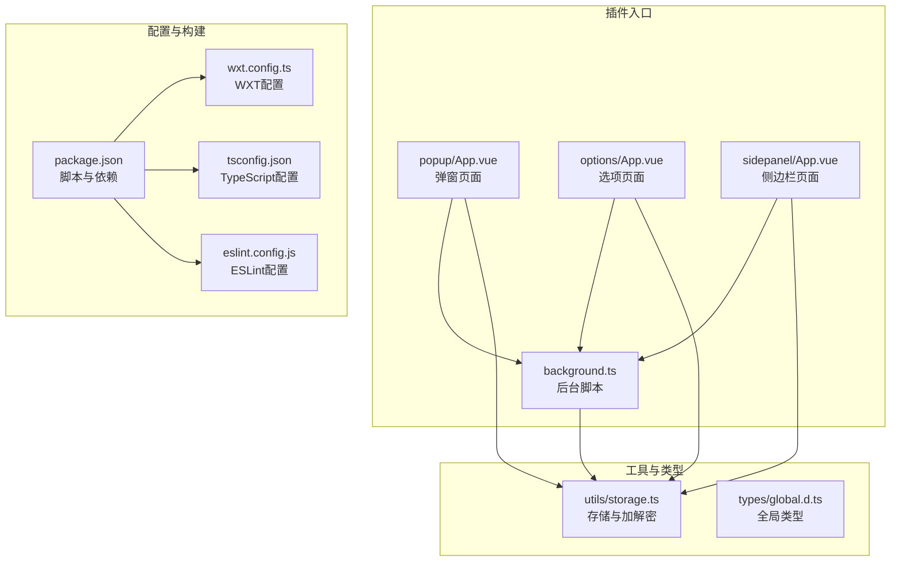
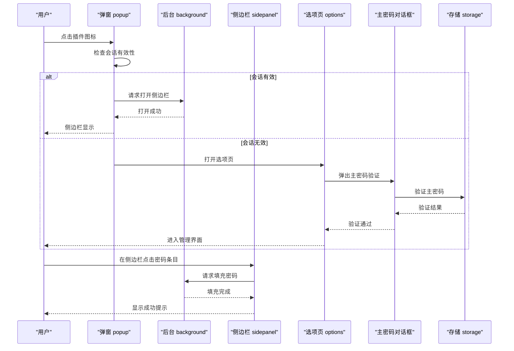
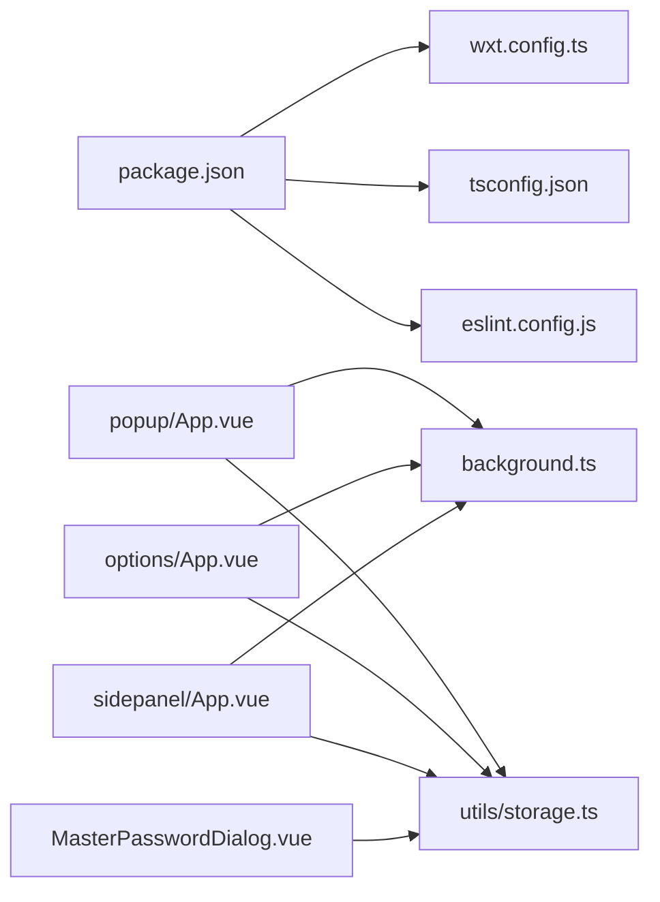

# 快速开始

<cite>
**本文引用的文件**
- [package.json](file://package.json)
- [wxt.config.ts](file://wxt.config.ts)
- [README.md](file://README.md)
- [entrypoints/background.ts](file://entrypoints/background.ts)
- [entrypoints/popup/main.ts](file://entrypoints/popup/main.ts)
- [entrypoints/options/App.vue](file://entrypoints/options/App.vue)
- [entrypoints/popup/App.vue](file://entrypoints/popup/App.vue)
- [entrypoints/sidepanel/App.vue](file://entrypoints/sidepanel/App.vue)
- [utils/storage.ts](file://utils/storage.ts)
- [components/MasterPasswordDialog.vue](file://components/MasterPasswordDialog.vue)
- [tsconfig.json](file://tsconfig.json)
- [eslint.config.js](file://eslint.config.js)
- [test-page.html](file://test-page.html)
</cite>

## 目录
1. [简介](#简介)
2. [项目结构](#项目结构)
3. [核心组件](#核心组件)
4. [架构总览](#架构总览)
5. [详细组件分析](#详细组件分析)
6. [依赖关系分析](#依赖关系分析)
7. [性能与安全考虑](#性能与安全考虑)
8. [故障排查指南](#故障排查指南)
9. [结论](#结论)
10. [附录](#附录)

## 简介
Account Password Helper 是一款基于 Chrome MV3 的浏览器插件，用于自动管理与填充网站账号密码。它提供主密码保护、侧边栏快速填充、Excel 导入导出、批量操作、快捷键等功能。本“快速开始”指南面向不同技术背景的用户，覆盖开发环境准备、项目克隆与安装、开发运行、生产构建、Chrome 安装与首次设置，以及常见问题排查。

## 项目结构
该项目采用 WXT + Vue3 + TypeScript 的现代前端工程化方案，入口点分为 popup、options、sidepanel 三个 UI 入口，配合 background 背景脚本与 content 脚本（在 manifest 中声明）协同工作；工具层封装在 utils 中，组件层位于 components。

图表来源
- [entrypoints/background.ts](file://entrypoints/background.ts#L1-L232)
- [entrypoints/popup/App.vue](file://entrypoints/popup/App.vue#L1-L234)
- [entrypoints/options/App.vue](file://entrypoints/options/App.vue#L1-L800)
- [entrypoints/sidepanel/App.vue](file://entrypoints/sidepanel/App.vue#L1-L800)
- [utils/storage.ts](file://utils/storage.ts#L1-L800)
- [package.json](file://package.json#L1-L49)
- [wxt.config.ts](file://wxt.config.ts#L1-L48)
- [tsconfig.json](file://tsconfig.json#L1-L33)
- [eslint.config.js](file://eslint.config.js#L1-L38)

章节来源
- [package.json](file://package.json#L1-L49)
- [wxt.config.ts](file://wxt.config.ts#L1-L48)
- [tsconfig.json](file://tsconfig.json#L1-L33)
- [eslint.config.js](file://eslint.config.js#L1-L38)

## 核心组件
- 后台脚本 background.ts：负责监听快捷键、标签页事件、消息分发、侧边栏开关与选项页打开等。
- 弹窗 popup：提供“管理密码”“快速填充”入口，会话校验后可直接打开侧边栏。
- 选项页 options：主密码设置/验证、密码增删改查、Excel 导入导出、有效期设置、排序等。
- 侧边栏 sidepanel：根据当前域名匹配密码，支持搜索、一键填充、复制用户名、打开选项页。
- 存储与加解密 storage.ts：主密码配置、盐值、PBKDF2 派生密钥、AES 加解密、排序配置、会话有效期等。
- 主密码对话框 MasterPasswordDialog.vue：首次设置与后续验证的全屏对话框。

章节来源
- [entrypoints/background.ts](file://entrypoints/background.ts#L1-L232)
- [entrypoints/popup/App.vue](file://entrypoints/popup/App.vue#L1-L234)
- [entrypoints/options/App.vue](file://entrypoints/options/App.vue#L1-L800)
- [entrypoints/sidepanel/App.vue](file://entrypoints/sidepanel/App.vue#L1-L800)
- [utils/storage.ts](file://utils/storage.ts#L1-L800)
- [components/MasterPasswordDialog.vue](file://components/MasterPasswordDialog.vue#L1-L447)

## 架构总览
下图展示了插件从用户交互到数据持久化的整体流程，包括主密码验证、侧边栏打开、密码填充、存储读写与会话管理。

图表来源
- [entrypoints/popup/App.vue](file://entrypoints/popup/App.vue#L59-L151)
- [entrypoints/background.ts](file://entrypoints/background.ts#L23-L31)
- [entrypoints/sidepanel/App.vue](file://entrypoints/sidepanel/App.vue#L343-L422)
- [entrypoints/options/App.vue](file://entrypoints/options/App.vue#L1-L800)
- [components/MasterPasswordDialog.vue](file://components/MasterPasswordDialog.vue#L178-L237)
- [utils/storage.ts](file://utils/storage.ts#L793-L800)

## 详细组件分析

### 开发环境与安装要求
- Node.js 版本：项目使用 npm 脚本与现代构建工具，建议使用长期支持版本（LTS）。具体版本范围可在 package.json 的依赖中参考。
- Chrome 浏览器版本：manifest 中声明了 sidePanel 权限与命令，需要 Chrome 114+（部分功能建议 116+）以支持侧边栏 API。

章节来源
- [package.json](file://package.json#L22-L46)
- [wxt.config.ts](file://wxt.config.ts#L22-L40)
- [README.md](file://README.md#L174-L194)

### 项目克隆与依赖安装
- 克隆仓库后，使用包管理器安装依赖。
- 安装完成后，可通过开发脚本启动本地调试。

章节来源
- [README.md](file://README.md#L39-L56)
- [package.json](file://package.json#L6-L21)

### 开发模式运行
- 使用开发脚本启动 WXT 开发服务器，自动热更新。
- 可通过命令行参数切换 Firefox 构建（如需）。

章节来源
- [README.md](file://README.md#L52-L56)
- [package.json](file://package.json#L9-L10)

### 生产构建与打包
- 构建产物输出至 .output/chrome-mv3，默认 ZIP 压缩。
- 可通过脚本生成 Firefox 版本（如需）。

章节来源
- [README.md](file://README.md#L58-L62)
- [package.json](file://package.json#L7-L11)
- [wxt.config.ts](file://wxt.config.ts#L1-L48)

### Chrome 浏览器安装与加载
- 构建完成后，打开 Chrome 扩展管理页，开启“开发者模式”，加载已解压的扩展目录（.output/chrome-mv3）。
- 首次使用会引导设置主密码。

章节来源
- [README.md](file://README.md#L64-L83)

### 首次使用设置向导（主密码与基本配置）
- 选项页会检测是否已设置主密码，若未设置则弹出设置向导。
- 设置向导包含主密码强度提示、有效期选择、确认密码等。
- 设置成功后进入主管理界面，可添加/编辑/删除密码条目，支持 Excel 导入导出。

章节来源
- [entrypoints/options/App.vue](file://entrypoints/options/App.vue#L1-L123)
- [components/MasterPasswordDialog.vue](file://components/MasterPasswordDialog.vue#L1-L90)
- [utils/storage.ts](file://utils/storage.ts#L76-L114)

### 快捷键与侧边栏
- 默认快捷键：
  - Ctrl+Shift+P（Mac: Command+Shift+P）：打开选项页面
  - Ctrl+Shift+L（Mac: Command+Shift+L）：打开/关闭侧边栏
- 侧边栏根据当前域名匹配密码，支持搜索与一键填充。

章节来源
- [wxt.config.ts](file://wxt.config.ts#L25-L40)
- [entrypoints/background.ts](file://entrypoints/background.ts#L23-L31)
- [entrypoints/sidepanel/App.vue](file://entrypoints/sidepanel/App.vue#L273-L295)

### 数据存储与安全
- 主密码采用盐值 + MD5 校验，实际敏感字段使用 PBKDF2 派生密钥 + AES-256-CBC 加密存储。
- 会话有效期可配置，支持清除当前会话。
- 排序配置与搜索逻辑由存储模块统一管理。

章节来源
- [utils/storage.ts](file://utils/storage.ts#L37-L800)

### 测试页面与功能验证
- 提供 test-page.html 用于模拟登录表单，验证侧边栏自动打开、密码填充与“记住我”复选框勾选等行为。

章节来源
- [test-page.html](file://test-page.html#L1-L166)

## 依赖关系分析

图表来源
- [package.json](file://package.json#L1-L49)
- [wxt.config.ts](file://wxt.config.ts#L1-L48)
- [tsconfig.json](file://tsconfig.json#L1-L33)
- [eslint.config.js](file://eslint.config.js#L1-L38)
- [entrypoints/popup/App.vue](file://entrypoints/popup/App.vue#L1-L234)
- [entrypoints/options/App.vue](file://entrypoints/options/App.vue#L1-L800)
- [entrypoints/sidepanel/App.vue](file://entrypoints/sidepanel/App.vue#L1-L800)
- [entrypoints/background.ts](file://entrypoints/background.ts#L1-L232)
- [utils/storage.ts](file://utils/storage.ts#L1-L800)
- [components/MasterPasswordDialog.vue](file://components/MasterPasswordDialog.vue#L1-L447)

章节来源
- [package.json](file://package.json#L1-L49)
- [wxt.config.ts](file://wxt.config.ts#L1-L48)
- [tsconfig.json](file://tsconfig.json#L1-L33)
- [eslint.config.js](file://eslint.config.js#L1-L38)

## 性能与安全考虑
- 性能
  - 侧边栏按域名过滤与排序，避免一次性渲染大量条目。
  - 存储读写采用本地存储，避免网络请求带来的延迟。
- 安全
  - 主密码仅做 MD5 校验，敏感字段使用 PBKDF2 + AES 加密。
  - 会话有效期可配置，降低长时间暴露风险。
  - 权限最小化，仅申请必要权限（storage、activeTab、scripting、sidePanel）。

章节来源
- [utils/storage.ts](file://utils/storage.ts#L37-L800)
- [wxt.config.ts](file://wxt.config.ts#L18-L24)

## 故障排查指南
- 侧边栏不显示
  - 检查 Chrome 版本是否满足 sidePanel API 要求（Chrome 114+，建议 116+）。
  - 确认插件已正确安装并启用。
- Excel 导入失败
  - 确保 Excel 文件包含“用户名”和“密码”列，列名可为英文或中文。
- 密码填充不生效
  - 确保页面已完全加载，某些动态表单可能需要刷新。
- 快捷键不生效
  - 检查是否与其他扩展快捷键冲突，可在扩展管理页修改。
- 忘记主密码
  - 主密码无法找回，只能清空数据重新开始。建议定期导出备份。

章节来源
- [README.md](file://README.md#L174-L194)

## 结论
本指南覆盖了从开发环境准备到生产部署、从安装到首次使用的全流程，结合常见问题与安全策略，帮助不同技术背景的用户快速上手 Account Password Helper 的开发与使用。建议在开发阶段使用测试页面验证核心功能，并在生产环境中合理设置主密码有效期与定期备份。

## 附录
- 测试页面：可用于验证表单检测与密码填充功能。
- TypeScript 配置：包含路径别名与严格模式，便于大型项目维护。
- ESLint 配置：统一代码风格与规则，减少潜在问题。

章节来源
- [test-page.html](file://test-page.html#L1-L166)
- [tsconfig.json](file://tsconfig.json#L1-L33)
- [eslint.config.js](file://eslint.config.js#L1-L38)