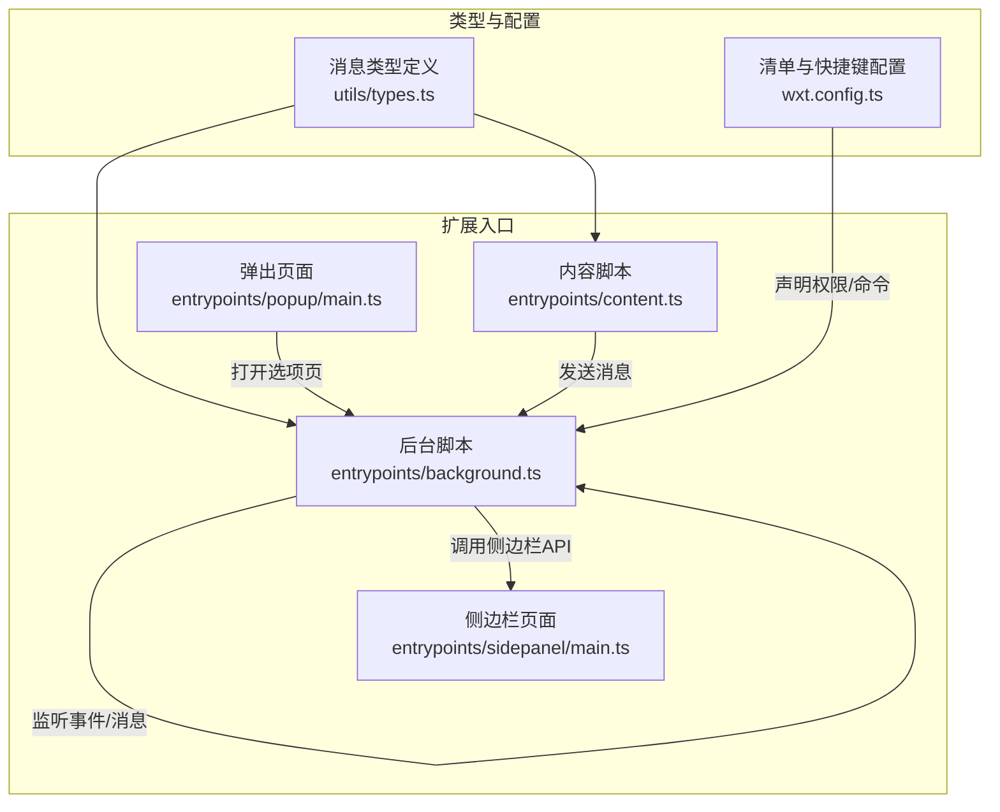
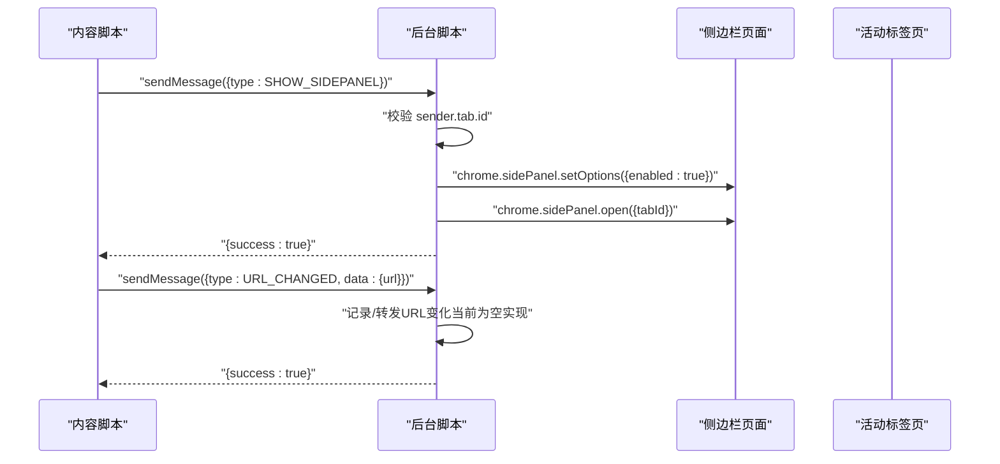
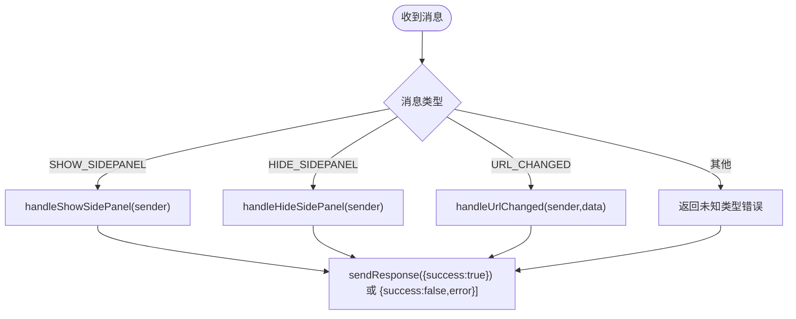
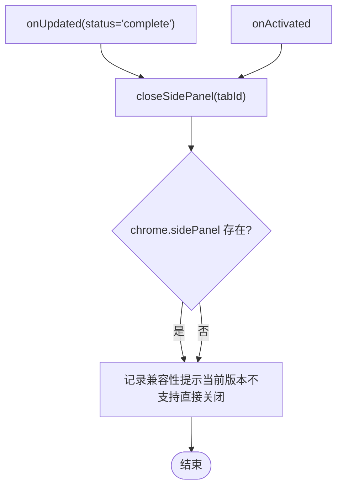
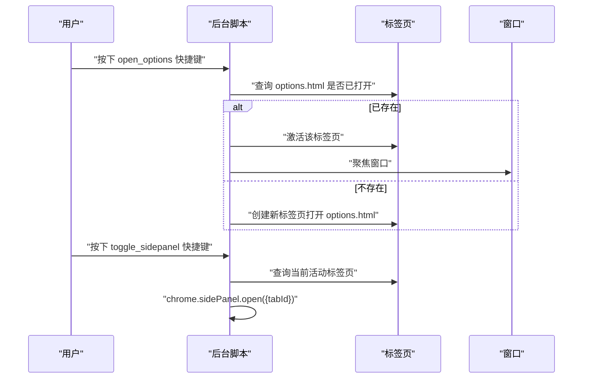
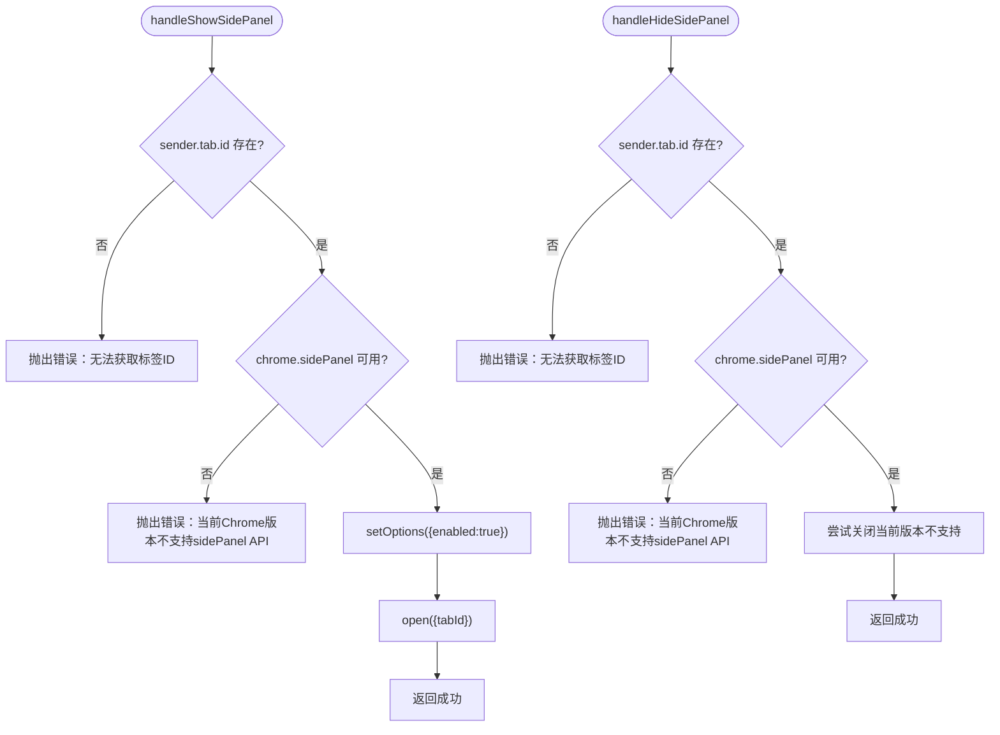
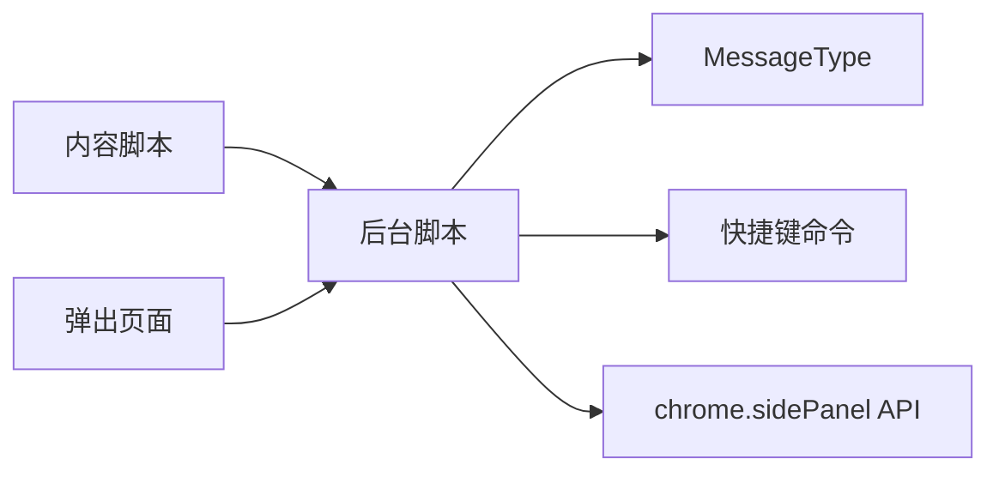

# Background Script

<cite>
**本文引用的文件**
- [entrypoints/background.ts](file://entrypoints/background.ts)
- [utils/types.ts](file://utils/types.ts)
- [wxt.config.ts](file://wxt.config.ts)
- [entrypoints/content.ts](file://entrypoints/content.ts)
- [entrypoints/popup/main.ts](file://entrypoints/popup/main.ts)
- [entrypoints/sidepanel/main.ts](file://entrypoints/sidepanel/main.ts)
- [package.json](file://package.json)
</cite>

## 目录
1. [简介](#简介)
2. [项目结构](#项目结构)
3. [核心组件](#核心组件)
4. [架构总览](#架构总览)
5. [详细组件分析](#详细组件分析)
6. [依赖分析](#依赖分析)
7. [性能考量](#性能考量)
8. [故障排查指南](#故障排查指南)
9. [结论](#结论)
10. [附录](#附录)

## 简介
本文件面向 Account Password Helper 的 Chrome 扩展后台脚本（Background Script），系统性阐述其职责边界与实现要点，重点覆盖以下方面：
- 消息处理机制：定义与处理的消息类型（如显示/隐藏侧边栏、URL 变化通知等）
- 标签页事件监听：对标签页生命周期事件的响应与侧边栏关闭策略
- 快捷键命令处理：注册与执行 open_options 与 toggle_sidepanel 命令
- 侧边栏控制功能：兼容性处理与错误恢复策略
- 最佳实践：性能优化、内存管理与调试技巧

## 项目结构
该扩展采用 WXT（WebExtension Toolkit）构建，入口位于 entrypoints/background.ts；消息类型定义于 utils/types.ts；快捷键与权限在 wxt.config.ts 中配置；content script 与 sidepanel、popup 分别在对应入口中初始化。

图表来源
- [entrypoints/background.ts](file://entrypoints/background.ts#L1-L232)
- [entrypoints/content.ts](file://entrypoints/content.ts#L1-L1892)
- [utils/types.ts](file://utils/types.ts#L52-L96)
- [wxt.config.ts](file://wxt.config.ts#L18-L46)

章节来源
- [entrypoints/background.ts](file://entrypoints/background.ts#L1-L232)
- [utils/types.ts](file://utils/types.ts#L52-L96)
- [wxt.config.ts](file://wxt.config.ts#L18-L46)

## 核心组件
- 后台脚本（Background Script）
  - 监听安装事件、标签页更新与激活事件、快捷键命令、来自 content script 与 popup 的消息
  - 提供侧边栏显示/隐藏控制、URL 变化处理、选项页打开与切换侧边栏
- 消息类型（MessageType）
  - 定义 SHOW_SIDEPANEL、HIDE_SIDEPANEL、URL_CHANGED 等消息类型
  - content script 与后台脚本通过 runtime.onMessage/runtime.sendMessage 协作
- 侧边栏 API 控制
  - 使用 chrome.sidePanel API 进行启用、打开、关闭（当前版本不支持直接关闭，采用兼容策略）
- 快捷键命令
  - open_options：打开选项页面
  - toggle_sidepanel：切换侧边栏显示状态

章节来源
- [entrypoints/background.ts](file://entrypoints/background.ts#L10-L73)
- [utils/types.ts](file://utils/types.ts#L52-L96)
- [wxt.config.ts](file://wxt.config.ts#L24-L40)

## 架构总览
后台脚本作为扩展的中枢，负责：
- 统一接收来自 content script 的侧边栏控制请求与 URL 变化通知
- 统一处理快捷键命令，打开选项页或切换侧边栏
- 对标签页生命周期事件进行响应，确保侧边栏状态与用户预期一致

图表来源
- [entrypoints/background.ts](file://entrypoints/background.ts#L34-L73)
- [entrypoints/background.ts](file://entrypoints/background.ts#L76-L109)
- [entrypoints/background.ts](file://entrypoints/background.ts#L184-L201)

## 详细组件分析

### 消息类型与处理流程
- MessageType 定义
  - 包含 PING、DETECT_FORM、FILL_PASSWORD、FILL_MOBILE_CODE、SHOW_SIDEPANEL、HIDE_SIDEPANEL、URL_CHANGED、GET_PASSWORDS 等
- 后台脚本消息处理
  - onMessage 监听来自 content script 与 popup 的消息
  - 对 SHOW_SIDEPANEL/HIDE_SIDEPANEL/URL_CHANGED 进行异步处理，并通过 sendResponse 返回结果
  - 对未知类型返回错误信息，保持消息通道开放（return true）

图表来源
- [entrypoints/background.ts](file://entrypoints/background.ts#L34-L73)
- [utils/types.ts](file://utils/types.ts#L52-L96)

章节来源
- [utils/types.ts](file://utils/types.ts#L52-L96)
- [entrypoints/background.ts](file://entrypoints/background.ts#L34-L73)

### 标签页事件监听与侧边栏关闭策略
- onUpdated（status=complete 且存在 tab.url）
  - 调用 closeSidePanel(tabId)，用于在页面加载完成后关闭侧边栏，避免残留显示
- onActivated
  - 调用 closeSidePanel(activeInfo.tabId)，在标签页切换时关闭侧边栏
- closeSidePanel 实现
  - 当前 Chrome 版本不支持直接关闭已打开的侧边栏，因此采用兼容策略（注释中给出多种思路，实际未实现具体关闭动作）

图表来源
- [entrypoints/background.ts](file://entrypoints/background.ts#L11-L20)
- [entrypoints/background.ts](file://entrypoints/background.ts#L205-L231)

章节来源
- [entrypoints/background.ts](file://entrypoints/background.ts#L11-L20)
- [entrypoints/background.ts](file://entrypoints/background.ts#L205-L231)

### 快捷键命令处理
- 注册命令
  - open_options：建议快捷键 Ctrl+Shift+P（macOS Command+Shift+P）
  - toggle_sidepanel：建议快捷键 Ctrl+Shift+L（macOS Command+Shift+L）
- 命令处理
  - open_options：打开 options.html，若已存在则激活并聚焦窗口
  - toggle_sidepanel：获取当前活动标签页并尝试打开侧边栏（幂等调用）

图表来源
- [wxt.config.ts](file://wxt.config.ts#L24-L40)
- [entrypoints/background.ts](file://entrypoints/background.ts#L22-L31)
- [entrypoints/background.ts](file://entrypoints/background.ts#L140-L165)
- [entrypoints/background.ts](file://entrypoints/background.ts#L167-L182)

章节来源
- [wxt.config.ts](file://wxt.config.ts#L24-L40)
- [entrypoints/background.ts](file://entrypoints/background.ts#L22-L31)
- [entrypoints/background.ts](file://entrypoints/background.ts#L140-L165)
- [entrypoints/background.ts](file://entrypoints/background.ts#L167-L182)

### 侧边栏控制功能与兼容性处理
- 显示侧边栏（handleShowSidePanel）
  - 校验 sender.tab.id
  - 若 chrome.sidePanel 可用，先确保 enabled=true，再 open
  - 若不可用，抛出错误并记录警告
- 隐藏侧边栏（handleHideSidePanel）
  - 校验 sender.tab.id
  - 若 chrome.sidePanel 可用，尝试关闭（当前版本不支持直接关闭，采用兼容策略）
  - 若不可用，抛出错误并记录警告
- URL 变化处理（handleUrlChanged）
  - 校验 sender.tab.id
  - 当前为空实现，可扩展为通知侧边栏刷新数据或决定是否显示侧边栏

图表来源
- [entrypoints/background.ts](file://entrypoints/background.ts#L76-L109)
- [entrypoints/background.ts](file://entrypoints/background.ts#L112-L138)
- [entrypoints/background.ts](file://entrypoints/background.ts#L184-L201)

章节来源
- [entrypoints/background.ts](file://entrypoints/background.ts#L76-L109)
- [entrypoints/background.ts](file://entrypoints/background.ts#L112-L138)
- [entrypoints/background.ts](file://entrypoints/background.ts#L184-L201)

### 与内容脚本的协作
- 内容脚本通过 runtime.sendMessage 发送消息给后台脚本，实现：
  - 显示/隐藏侧边栏请求
  - URL 变化通知
- 后台脚本在 onMessage 中统一处理，并通过 sendResponse 返回结果
- 内容脚本在页面可见性变化、窗口失焦、页面卸载等事件时，也会主动隐藏侧边栏

章节来源
- [entrypoints/content.ts](file://entrypoints/content.ts#L993-L1028)
- [entrypoints/content.ts](file://entrypoints/content.ts#L1169-L1182)
- [entrypoints/background.ts](file://entrypoints/background.ts#L34-L73)

## 依赖分析
- 权限与命令
  - permissions：storage、activeTab、scripting、sidePanel
  - host_permissions：<all_urls>
  - commands：open_options、toggle_sidepanel
- 依赖关系
  - 后台脚本依赖 utils/types.ts 中的 MessageType
  - 快捷键命令由 wxt.config.ts 声明并在后台脚本中处理
  - content script 与后台脚本通过 runtime 消息通信

图表来源
- [utils/types.ts](file://utils/types.ts#L52-L96)
- [wxt.config.ts](file://wxt.config.ts#L22-L40)
- [entrypoints/background.ts](file://entrypoints/background.ts#L1-L232)

章节来源
- [wxt.config.ts](file://wxt.config.ts#L22-L40)
- [utils/types.ts](file://utils/types.ts#L52-L96)

## 性能考量
- 事件监听与内存管理
  - MutationObserver 与事件委托在 content script 中广泛使用，需在页面卸载时清理，避免内存泄漏
  - 后台脚本监听的事件数量有限，但仍需关注异常处理与日志输出
- 异步消息处理
  - onMessage 中对 SHOW/HIDE/URL_CHANGED 的处理均为异步，需确保 sendResponse 正确返回
- 侧边栏打开的幂等性
  - chrome.sidePanel.open 为幂等调用，可安全重复调用，减少状态同步复杂度

章节来源
- [entrypoints/content.ts](file://entrypoints/content.ts#L1874-L1892)
- [entrypoints/background.ts](file://entrypoints/background.ts#L76-L109)

## 故障排查指南
- 侧边栏无法打开
  - 检查 chrome.sidePanel 是否可用（低版本 Chrome 不支持）
  - 确认 sender.tab.id 是否存在
  - 确认已启用 sidePanel 权限
- 侧边栏无法关闭
  - 当前版本不支持直接关闭，采用兼容策略（注释中给出多种思路）
- 快捷键无效
  - 检查 wxt.config.ts 中的 commands 配置与浏览器快捷键设置
  - 确认后台脚本已注册 onCommand 监听
- URL 变化未触发
  - 确认 content script 已发送 URL_CHANGED 消息
  - 检查后台脚本 onMessage 处理逻辑

章节来源
- [entrypoints/background.ts](file://entrypoints/background.ts#L76-L109)
- [entrypoints/background.ts](file://entrypoints/background.ts#L112-L138)
- [wxt.config.ts](file://wxt.config.ts#L24-L40)
- [entrypoints/content.ts](file://entrypoints/content.ts#L1169-L1182)

## 结论
后台脚本承担了扩展的核心协调职责：统一处理来自 content script 与 popup 的消息、响应标签页生命周期事件、执行快捷键命令、并通过 chrome.sidePanel API 控制侧边栏显示状态。尽管当前版本对侧边栏关闭能力有限，但通过启用与打开的幂等性以及兼容策略，仍能提供稳定的用户体验。后续可在支持的浏览器版本中逐步完善关闭逻辑，并增强 URL 变化处理与侧边栏状态同步。

## 附录
- 页面初始化与依赖
  - popup 与 sidepanel 均基于 Vue 初始化，引入 Element Plus 并挂载根组件
- 依赖项
  - crypto-js、element-plus、vue、xlsx 等运行时依赖

章节来源
- [entrypoints/popup/main.ts](file://entrypoints/popup/main.ts#L1-L10)
- [entrypoints/sidepanel/main.ts](file://entrypoints/sidepanel/main.ts#L1-L10)
- [package.json](file://package.json#L22-L27)