# 后台脚本

<cite>
**本文引用的文件**
- [entrypoints/background.ts](file://entrypoints/background.ts)
- [utils/types.ts](file://utils/types.ts)
- [utils/logger.ts](file://utils/logger.ts)
- [wxt.config.ts](file://wxt.config.ts)
- [entrypoints/content.ts](file://entrypoints/content.ts)
- [entrypoints/popup/main.ts](file://entrypoints/popup/main.ts)
- [entrypoints/sidepanel/App.vue](file://entrypoints/sidepanel/App.vue)
- [entrypoints/sidepanel/main.ts](file://entrypoints/sidepanel/main.ts)
- [package.json](file://package.json)
</cite>

## 更新摘要
**变更内容**
- **重构的错误处理机制**：新增`isExpectedCloseError`函数，专门识别预期的侧边栏关闭错误，包括"无活动标签特定侧边栏"、"扩展上下文失效"、"无标签页ID"等场景
- **增强的面板管理策略**：重构`forceCloseSidePanel`函数，提供三层降级策略：chrome.sidePanel.close API → setOptions强制禁用/恢复 → port通知窗口关闭
- **完整的密码缓存系统**：新增密码缓存接口、缓存有效期管理、域名匹配检查、存储变化监听等完整功能
- **改进的日志记录系统**：使用新的logger工具类，支持开发环境和生产环境的差异化日志输出
- **优化的选项页面管理**：改进`openOptionsPage`函数，提供更精确的重复打开防护和标签页管理
- **增强的错误恢复策略**：在侧边栏关闭失败时提供多种恢复方案，确保系统稳定性

## 目录
1. [简介](#简介)
2. [项目结构](#项目结构)
3. [核心组件](#核心组件)
4. [架构总览](#架构总览)
5. [详细组件分析](#详细组件分析)
6. [依赖分析](#依赖分析)
7. [性能考量](#性能考量)
8. [故障排查指南](#故障排查指南)
9. [结论](#结论)
10. [附录](#附录)

## 简介
本文件面向 Account Password Helper 的 Chrome 扩展后台脚本（Background Script），系统性阐述其职责边界与实现要点，重点覆盖以下方面：
- **用户手势链保护**：通过Promise链而非async/await保持用户手势上下文，确保侧边栏操作的合法性
- **重构的错误处理机制**：新增专门的错误识别函数，能够区分预期和非预期错误，提供精准的降级策略
- **增强的面板管理策略**：提供三层降级的侧边栏关闭机制，确保在各种Chrome版本和环境下都能稳定工作
- **完整的密码缓存系统**：实现内存缓存、有效期管理、域名匹配和自动失效功能
- **改进的日志记录系统**：使用统一的logger工具类，支持开发环境和生产环境的差异化日志输出
- **基于端口连接的可靠状态跟踪**：通过chrome.runtime.onConnect监听sidepanel端口连接，实现可靠的打开/关闭状态追踪
- **官方Chrome sidePanel API集成**：使用chrome.sidePanel.open/close/setOptions等官方API，支持Chrome 116+和129+
- **增强的消息处理机制**：定义与处理的消息类型（如显示/隐藏侧边栏、URL变化通知等），支持完整的消息对象参数传递
- **改进的标签页事件监听**：对标签页生命周期事件的响应与侧边栏关闭策略
- **增强的快捷键命令处理**：注册与执行 open_options 与 toggle_sidepanel 命令，具备完善的错误处理
- **优化的选项页面管理**：改进的重复打开防护机制，防止短时间内重复触发选项页面打开
- **最佳实践**：性能优化、内存管理与调试技巧，包括增强的错误处理和用户反馈机制

## 项目结构
该扩展采用 WXT（WebExtension Toolkit）构建，入口位于 entrypoints/background.ts；消息类型定义于 utils/types.ts；快捷键与权限在 wxt.config.ts 中配置；content script 与 sidepanel、popup 分别在对应入口中初始化。

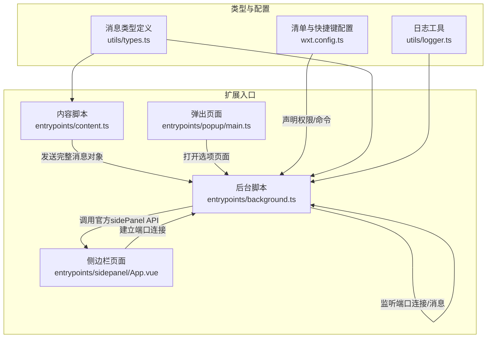

**图表来源**
- [entrypoints/background.ts:1-459](file://entrypoints/background.ts#L1-L459)
- [entrypoints/content.ts:1-200](file://entrypoints/content.ts#L1-L200)
- [utils/types.ts:52-172](file://utils/types.ts#L52-L172)
- [utils/logger.ts:1-68](file://utils/logger.ts#L1-L68)
- [wxt.config.ts:18-48](file://wxt.config.ts#L18-L48)
- [entrypoints/sidepanel/App.vue:695-752](file://entrypoints/sidepanel/App.vue#L695-L752)

**章节来源**
- [entrypoints/background.ts:1-459](file://entrypoints/background.ts#L1-L459)
- [utils/types.ts:52-172](file://utils/types.ts#L52-L172)
- [utils/logger.ts:1-68](file://utils/logger.ts#L1-L68)
- [wxt.config.ts:18-48](file://wxt.config.ts#L18-L48)

## 核心组件
- **后台脚本（Background Script）**
  - 监听安装事件、标签页更新与激活事件、快捷键命令、来自 content script 与 popup 的完整消息对象
  - 通过chrome.runtime.onConnect监听sidepanel端口连接，实现可靠的侧边栏状态跟踪
  - 提供侧边栏显示/隐藏控制、URL 变化处理、选项页打开与切换侧边栏
  - 实现重构的错误处理机制和用户反馈机制，包括用户手势链保护
  - **新增**：完整的密码缓存系统，包括内存缓存、有效期管理和域名匹配
  - **新增**：三层降级的面板管理策略，确保在各种Chrome版本下的稳定性
  - **新增**：改进的选项页面管理，提供更精确的重复打开防护
- **消息类型（MessageType）**
  - 定义 PING、DETECT_FORM、FILL_PASSWORD、FILL_MOBILE_CODE、SHOW_SIDEPANEL、HIDE_SIDEPANEL、TOGGLE_SIDEPANEL、CLOSE_SIDEPANEL、URL_CHANGED、GET_PASSWORDS、OPEN_OPTIONS_PAGE、TOGGLE_FLOATING_BUTTONS、GET_CACHED_PASSWORDS、UPDATE_PASSWORD_CACHE、INVALIDATE_PASSWORD_CACHE 等
  - content script 与后台脚本通过 runtime.onMessage/runtime.sendMessage 协作，支持完整的消息对象参数传递
- **侧边栏 API 控制**
  - 使用官方 chrome.sidePanel API 进行启用、打开、关闭（Chrome 129+支持close API）
  - 通过端口连接状态判断侧边栏是否已打开，实现可靠的双端状态同步
  - 实现三层降级的面板管理策略：chrome.sidePanel.close → setOptions强制禁用/恢复 → port通知窗口关闭
  - **新增**：专门的错误识别机制，能够区分预期和非预期错误
- **密码缓存系统**
  - **新增**：完整的内存缓存实现，支持密码条目、域名、时间戳和认证状态
  - **新增**：动态缓存有效期管理，与主密码会话有效期保持一致
  - **新增**：域名匹配检查，确保缓存数据适用于正确的网站
  - **新增**：存储变化监听，自动使缓存失效
- **日志记录系统**
  - **新增**：统一的logger工具类，支持开发环境和生产环境的差异化日志输出
  - **新增**：调试、信息、警告、错误等多级别日志记录
  - **新增**：分组日志功能，便于复杂操作的日志组织
- **快捷键命令**
  - open_options：打开选项页面
  - toggle_sidepanel：切换侧边栏显示状态
  - 通过Promise链保持用户手势链完整性
- **用户手势链保护**
  - 在快捷键处理中使用Promise链而非async/await
  - 在消息处理中使用getTabIdSync函数同步获取tabId
  - 确保所有侧边栏操作都在用户手势上下文中执行
- **优化的选项页面管理**
  - **新增**：改进的重复打开防护机制，使用isOpeningOptionsPage标志位
  - **新增**：支持带查询参数的URL匹配，兼容不同的选项页面URL格式
  - **新增**：智能标签页激活和窗口聚焦，提升用户体验

**章节来源**
- [entrypoints/background.ts:1-459](file://entrypoints/background.ts#L1-L459)
- [utils/types.ts:52-172](file://utils/types.ts#L52-L172)
- [utils/logger.ts:1-68](file://utils/logger.ts#L1-L68)
- [wxt.config.ts:24-40](file://wxt.config.ts#L24-L40)

## 架构总览
后台脚本作为扩展的中枢，负责：
- 统一接收来自 content script 的完整消息对象（包含type和data字段）
- 通过chrome.runtime.onConnect监听sidepanel端口连接，实现可靠的侧边栏状态跟踪
- 统一处理快捷键命令，打开选项页或切换侧边栏，保持用户手势链完整性
- 对标签页生命周期事件进行响应，确保侧边栏状态与用户预期一致
- 实现重构的错误处理和用户反馈机制，包括用户手势链保护和API兼容性检查
- **新增**：完整的密码缓存系统，提供内存缓存、有效期管理和自动失效功能
- **新增**：三层降级的面板管理策略，确保在各种Chrome版本和环境下稳定运行

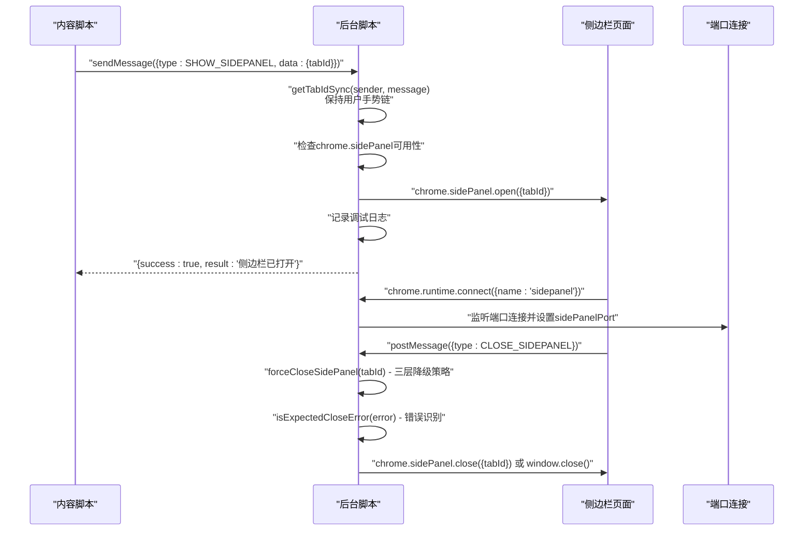

**图表来源**
- [entrypoints/background.ts:70-98](file://entrypoints/background.ts#L70-L98)
- [entrypoints/background.ts:204-207](file://entrypoints/background.ts#L204-L207)
- [entrypoints/background.ts:217-224](file://entrypoints/background.ts#L217-L224)
- [entrypoints/background.ts:260-283](file://entrypoints/background.ts#L260-L283)
- [entrypoints/sidepanel/App.vue:700-706](file://entrypoints/sidepanel/App.vue#L700-L706)

## 详细组件分析

### 重构的错误处理机制
- **专门的错误识别函数**
  - `isExpectedCloseError`函数专门识别预期的侧边栏关闭错误
  - 支持三种预期错误场景："无活动标签特定侧边栏"、"扩展上下文失效"、"无标签页ID"
  - 通过字符串匹配方式识别错误消息，提供精确的错误分类
- **三层降级策略**
  - 第一层：优先使用chrome.sidePanel.close API（Chrome 129+）
  - 第二层：如果第一层失败，使用setOptions强制禁用sidePanel，然后恢复enabled=true
  - 第三层：通过port发送CLOSE_SIDEPANEL消息，让sidepanel自行关闭
- **错误恢复机制**
  - 对于预期错误，系统将其视为"已关闭"，并清理sidePanelPort状态
  - 对于非预期错误，系统记录详细错误信息并抛出异常
  - 提供详细的日志记录，便于问题诊断和调试

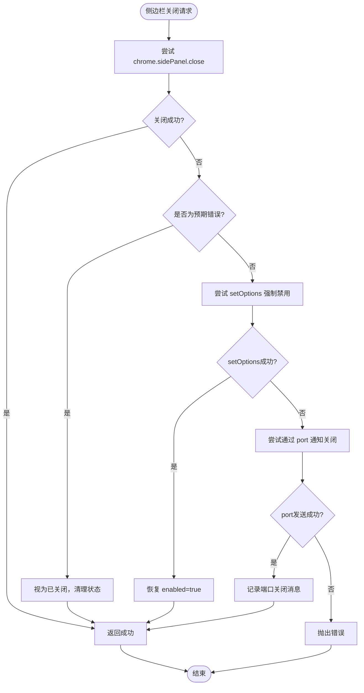

**图表来源**
- [entrypoints/background.ts:217-224](file://entrypoints/background.ts#L217-L224)
- [entrypoints/background.ts:260-283](file://entrypoints/background.ts#L260-L283)
- [entrypoints/background.ts:318-328](file://entrypoints/background.ts#L318-L328)

**章节来源**
- [entrypoints/background.ts:217-224](file://entrypoints/background.ts#L217-L224)
- [entrypoints/background.ts:260-283](file://entrypoints/background.ts#L260-L283)
- [entrypoints/background.ts:318-328](file://entrypoints/background.ts#L318-L328)

### 增强的面板管理策略
- **forceCloseSidePanel函数重构**
  - 提供完整的三层降级策略，确保在各种情况下都能成功关闭侧边栏
  - 首先尝试chrome.sidePanel.close API，这是最直接的方法
  - 如果API不可用或失败，使用setOptions强制禁用sidePanel，然后恢复enabled=true
  - 最后通过port发送CLOSE_SIDEPANEL消息，作为UI层的兜底方案
- **disableThenEnableSidePanel函数**
  - 通过setOptions({enabled: false})强制禁用sidePanel，使其立即关闭
  - 随后恢复enabled=true，确保下次能够正常打开
  - 这种方法解决了某些Chrome版本下close API不可用的问题
- **trySendCloseViaPort函数**
  - 通过port发送CLOSE_SIDEPANEL消息，让sidepanel页面自行关闭
  - 作为UI层的兜底方案，即使API层失败也能确保用户界面的一致性
  - 提供错误处理，避免port发送失败影响整体流程

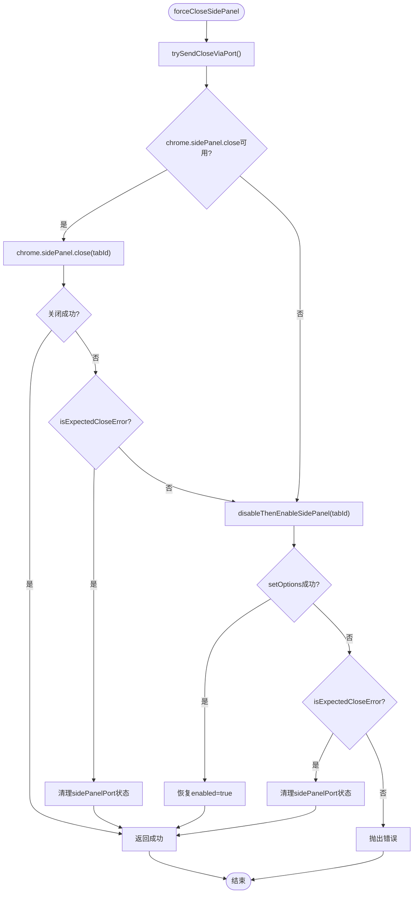

**图表来源**
- [entrypoints/background.ts:260-283](file://entrypoints/background.ts#L260-L283)
- [entrypoints/background.ts:289-313](file://entrypoints/background.ts#L289-L313)
- [entrypoints/background.ts:318-328](file://entrypoints/background.ts#L318-L328)

**章节来源**
- [entrypoints/background.ts:260-283](file://entrypoints/background.ts#L260-L283)
- [entrypoints/background.ts:289-313](file://entrypoints/background.ts#L289-L313)
- [entrypoints/background.ts:318-328](file://entrypoints/background.ts#L318-L328)

### 完整的密码缓存系统
- **PasswordCache接口设计**
  - 包含passwords、domain、timestamp、isAuthenticated四个核心字段
  - 支持密码条目数组、域名、时间戳和认证状态的完整缓存
  - 与主密码会话机制集成，确保安全性
- **动态有效期管理**
  - 通过getCacheValidityMs函数动态获取缓存有效期
  - 与主密码会话有效期保持一致，默认24小时
  - 支持从chrome.storage.local获取自定义的有效期设置
- **域名匹配检查**
  - getCachedPasswords函数支持域名参数过滤
  - 确保缓存数据适用于正确的网站环境
  - 提供灵活的缓存查询接口
- **自动失效机制**
  - 通过chrome.storage.onChanged监听存储变化
  - 检测密码数据、会话相关的变化自动使缓存失效
  - 确保缓存数据的实时性和准确性

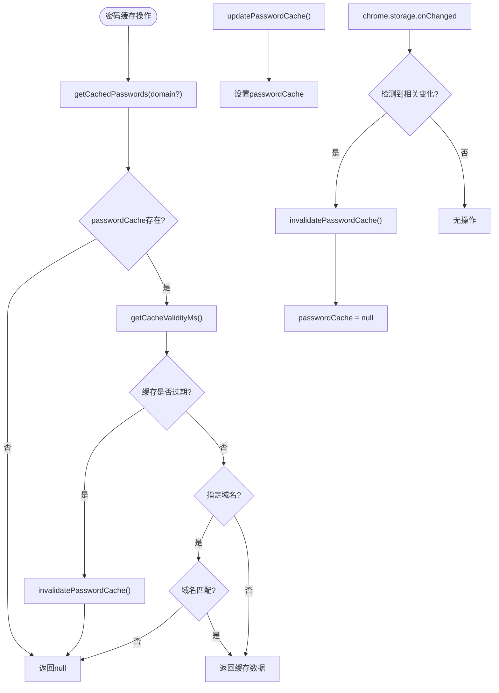

**图表来源**
- [entrypoints/background.ts:398-422](file://entrypoints/background.ts#L398-L422)
- [entrypoints/background.ts:427-435](file://entrypoints/background.ts#L427-L435)
- [entrypoints/background.ts:440-443](file://entrypoints/background.ts#L440-L443)
- [entrypoints/background.ts:446-457](file://entrypoints/background.ts#L446-L457)

**章节来源**
- [entrypoints/background.ts:398-422](file://entrypoints/background.ts#L398-L422)
- [entrypoints/background.ts:427-435](file://entrypoints/background.ts#L427-L435)
- [entrypoints/background.ts:440-443](file://entrypoints/background.ts#L440-L443)
- [entrypoints/background.ts:446-457](file://entrypoints/background.ts#L446-L457)

### 改进的日志记录系统
- **统一的Logger类**
  - 支持开发环境和生产环境的差异化日志输出
  - 提供debug、info、warn、error四种日志级别
  - 支持分组日志功能，便于复杂操作的日志组织
- **条件日志输出**
  - debug和info日志仅在开发环境输出
  - warn和error日志始终输出，确保问题能够被发现
  - 通过isDev标志控制日志输出，提高生产环境性能
- **详细的日志记录**
  - 侧边栏操作：打开、关闭、切换等关键操作都有详细日志
  - 错误处理：所有错误都会记录详细的错误信息和上下文
  - 缓存操作：密码缓存的创建、更新、失效都有日志记录
  - 选项页面：重复打开防护和标签页管理都有日志记录

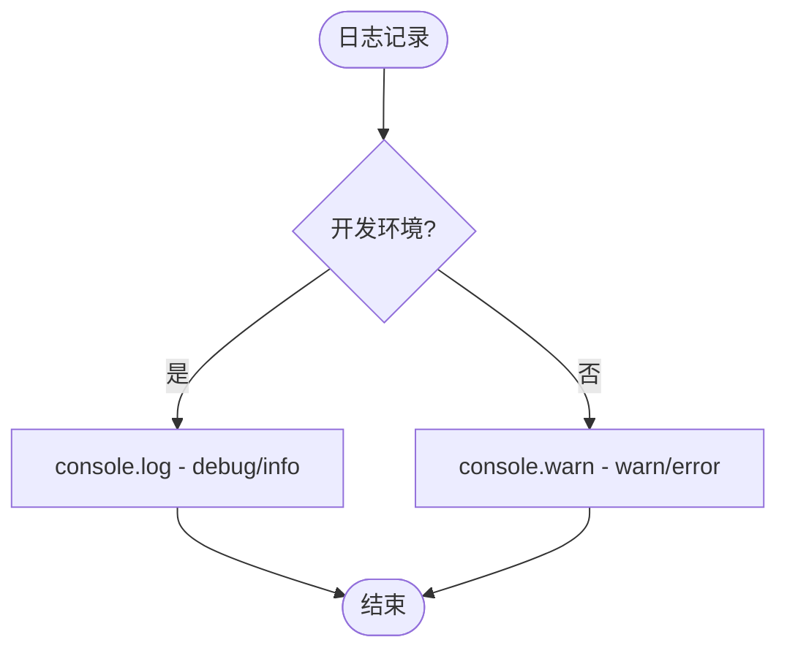

**图表来源**
- [utils/logger.ts:18-45](file://utils/logger.ts#L18-L45)

**章节来源**
- [utils/logger.ts:1-68](file://utils/logger.ts#L1-L68)

### 基于端口连接的可靠状态跟踪
- **端口连接监听**
  - 通过chrome.runtime.onConnect监听sidepanel端口连接，建立稳定的双端通信
  - 监听端口断开事件，及时清理sidePanelPort状态
  - 实现sidePanelPort全局变量管理，用于跨函数访问端口状态
- **状态跟踪机制**
  - 通过port连接状态判断侧边栏是否已打开，替代之前的Map状态跟踪
  - 支持handleToggleSidePanel根据端口连接状态智能切换
  - 提供降级机制：当chrome.sidePanel.close不可用时，通过port通知sidepanel关闭

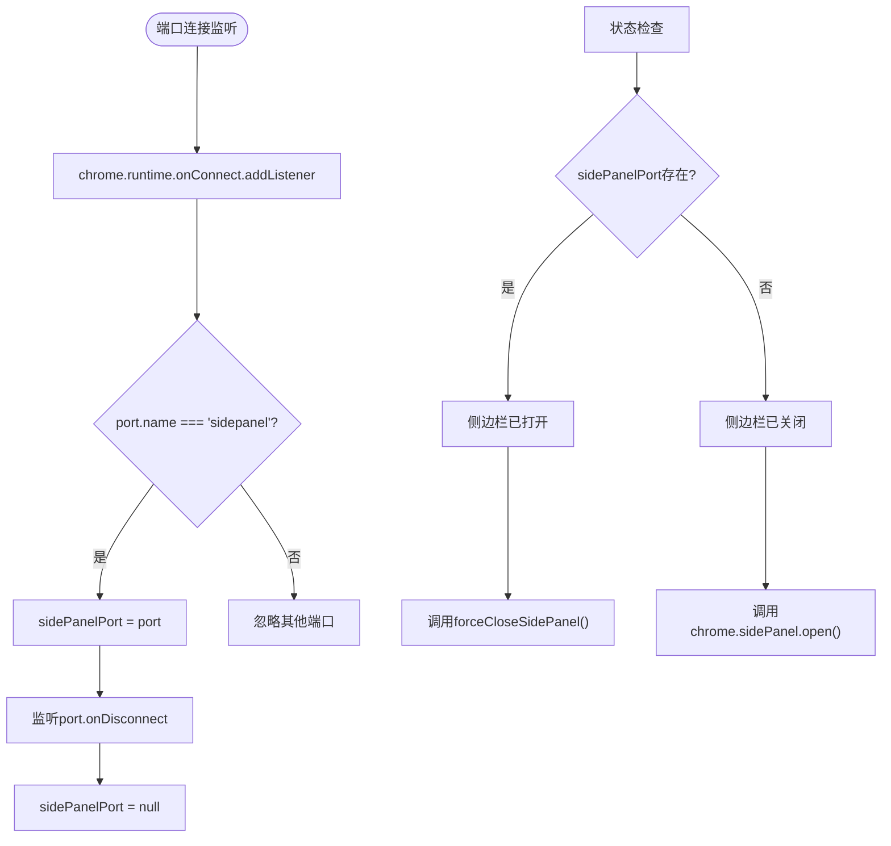

**图表来源**
- [entrypoints/background.ts:17-29](file://entrypoints/background.ts#L17-L29)
- [entrypoints/background.ts:131-147](file://entrypoints/background.ts#L131-L147)
- [entrypoints/sidepanel/App.vue:700-706](file://entrypoints/sidepanel/App.vue#L700-L706)

**章节来源**
- [entrypoints/background.ts:17-29](file://entrypoints/background.ts#L17-L29)
- [entrypoints/background.ts:131-147](file://entrypoints/background.ts#L131-L147)
- [entrypoints/sidepanel/App.vue:700-706](file://entrypoints/sidepanel/App.vue#L700-L706)

### 增强的消息处理系统
- **MessageType 定义**
  - 包含 PING、DETECT_FORM、FILL_PASSWORD、FILL_MOBILE_CODE、SHOW_SIDEPANEL、HIDE_SIDEPANEL、TOGGLE_SIDEPANEL、CLOSE_SIDEPANEL、URL_CHANGED、GET_PASSWORDS、OPEN_OPTIONS_PAGE、TOGGLE_FLOATING_BUTTONS、GET_CACHED_PASSWORDS、UPDATE_PASSWORD_CACHE、INVALIDATE_PASSWORD_CACHE 等
  - 新增CLOSE_SIDEPANEL消息类型，专门用于sidepanel关闭通信
  - 新增密码缓存相关的消息类型：GET_CACHED_PASSWORDS、UPDATE_PASSWORD_CACHE、INVALIDATE_PASSWORD_CACHE
- **后台脚本消息处理**
  - onMessage 监听来自 content script 与 popup 的完整消息对象
  - 对 SHOW_SIDEPANEL/HIDE_SIDEPANEL/TOGGLE_SIDEPANEL/URL_CHANGED/OPEN_OPTIONS_PAGE 进行异步处理
  - 使用getTabIdSync函数同步获取tabId，保持用户手势链
  - 对未知类型返回详细的错误信息，保持消息通道开放（return true）
- **密码缓存功能**
  - 实现5分钟缓存有效期机制
  - 支持域名匹配检查和缓存失效
  - 与storage变化监听器集成，自动更新缓存

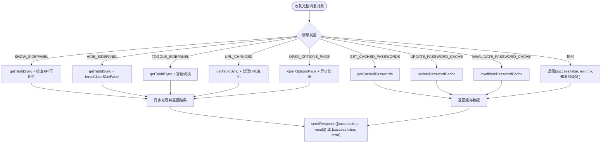

**图表来源**
- [entrypoints/background.ts:68-200](file://entrypoints/background.ts#L68-L200)
- [utils/types.ts:52-172](file://utils/types.ts#L52-L172)

**章节来源**
- [utils/types.ts:52-172](file://utils/types.ts#L52-L172)
- [entrypoints/background.ts:68-200](file://entrypoints/background.ts#L68-L200)

### 优化的选项页面管理
- **改进的重复打开防护机制**
  - 使用isOpeningOptionsPage全局标志位，防止短时间内重复触发
  - 在异步流程完成后再释放标志位，避免慢速tabs.create期间的重复触发
  - 提供详细的日志记录，便于调试和监控
- **智能标签页管理**
  - 支持带查询参数的URL匹配，兼容不同的选项页面URL格式
  - 通过lastAccessed属性选择最近访问的标签页，提升用户体验
  - 支持标签页激活和窗口聚焦，确保用户能够快速找到选项页面
- **增强的错误处理**
  - 在选项页面打开过程中添加详细的异常处理和日志记录
  - finally块确保标志位最终会被重置，防止状态泄露
  - 提供详细的错误信息，便于问题诊断

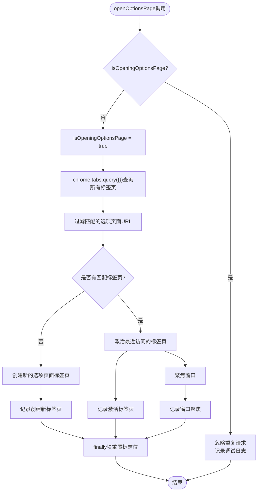

**图表来源**
- [entrypoints/background.ts:339-377](file://entrypoints/background.ts#L339-L377)

**章节来源**
- [entrypoints/background.ts:339-377](file://entrypoints/background.ts#L339-L377)

### 用户手势链保护机制
- **Promise链替代async/await**
  - 在快捷键处理中使用Promise链而非async/await，避免打断用户手势链
  - 保持chrome.commands.onCommand的用户手势上下文完整性
  - 确保chrome.sidePanel.open调用在用户手势上下文中执行
- **同步Tab ID获取**
  - 使用getTabIdSync函数同步获取tabId，避免在用户手势链中使用await
  - 通过三阶段解析：message.data.tabId → sender.tab.id → chrome.tabs.query
  - 确保所有侧边栏操作都在用户手势上下文中同步执行
- **用户手势链的重要性**
  - chrome.sidePanel.open必须在用户手势上下文中调用
  - 避免在用户手势链中使用await可能导致的操作失败
  - 保持消息通道开放，支持异步操作的用户手势上下文

**图表来源**
- [entrypoints/background.ts:37-66](file://entrypoints/background.ts#L37-L66)
- [entrypoints/background.ts:204-207](file://entrypoints/background.ts#L204-L207)

**章节来源**
- [entrypoints/background.ts:37-66](file://entrypoints/background.ts#L37-L66)
- [entrypoints/background.ts:204-207](file://entrypoints/background.ts#L204-L207)

### 标签页事件监听与侧边栏关闭策略
- **onUpdated（status=complete 且存在 tab.url）**
  - 调用 getTabIdSync，用于在页面加载完成后处理URL变化
  - 保持用户手势链完整性
- **onActivated**
  - 调用 getTabIdSync，用于在标签页切换时处理URL变化
  - 通过三阶段解析确保tabId获取的可靠性
- **handleUrlChanged 实现**
  - 使用getTabIdSync实现多级Tab ID解析策略
  - 当前为空实现，可扩展为通知侧边栏刷新数据或决定是否显示侧边栏

**图表来源**
- [entrypoints/background.ts:150-158](file://entrypoints/background.ts#L150-L158)
- [entrypoints/background.ts:204-207](file://entrypoints/background.ts#L204-L207)

**章节来源**
- [entrypoints/background.ts:150-158](file://entrypoints/background.ts#L150-L158)
- [entrypoints/background.ts:204-207](file://entrypoints/background.ts#L204-L207)

### 快捷键命令处理
- **注册命令**
  - open_options：建议快捷键 Ctrl+Shift+P（macOS Command+Shift+P）
  - toggle_sidepanel：建议快捷键 Ctrl+Shift+L（macOS Command+Shift+L）
- **命令处理**
  - open_options：打开 options.html，若已存在则激活并聚焦窗口
  - toggle_sidepanel：获取当前活动标签页并尝试打开侧边栏（幂等调用）
  - **用户手势链保护**：使用Promise链而非async/await，保持用户手势上下文
  - **API可用性检查**：在执行前检查chrome.sidePanel API可用性

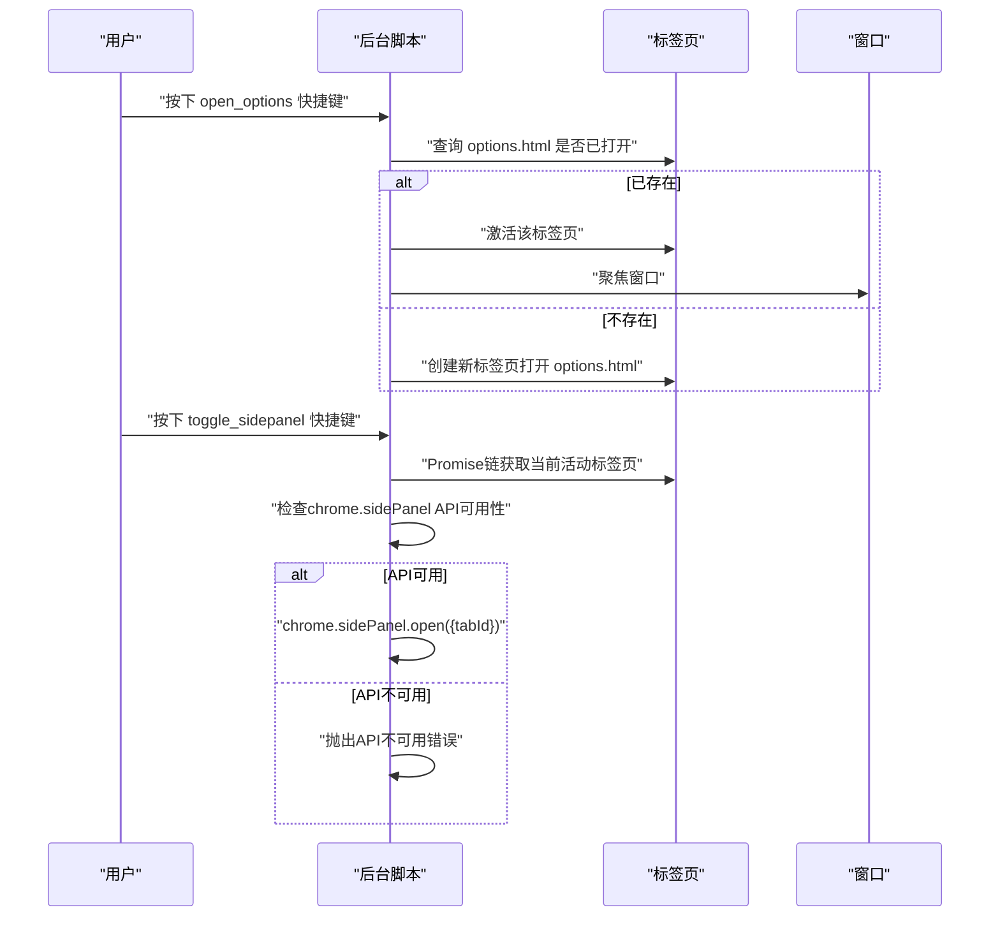

**图表来源**
- [wxt.config.ts:24-40](file://wxt.config.ts#L24-L40)
- [entrypoints/background.ts:32-66](file://entrypoints/background.ts#L32-L66)
- [entrypoints/background.ts:212-225](file://entrypoints/background.ts#L212-L225)

**章节来源**
- [wxt.config.ts:24-40](file://wxt.config.ts#L24-L40)
- [entrypoints/background.ts:32-66](file://entrypoints/background.ts#L32-L66)
- [entrypoints/background.ts:212-225](file://entrypoints/background.ts#L212-L225)

### 侧边栏控制功能与兼容性处理
- **显示侧边栏（handleShowSidePanel）**
  - 使用getTabIdSync实现多级Tab ID解析策略
  - 调用ensureSidePanelSupport()检查API可用性
  - 使用chrome.sidePanel.setOptions({enabled:true}) + chrome.sidePanel.open()
  - 保持用户手势链完整性
- **隐藏侧边栏（handleHideSidePanel）**
  - 调用ensureSidePanelSupport()检查API可用性
  - 优先使用forceCloseSidePanel()，提供三层降级策略
  - 若close()不可用，检查sidePanelPort状态并通过port.postMessage发送CLOSE_SIDEPANEL
  - 改进的降级处理和错误恢复机制
- **切换侧边栏（handleToggleSidePanel）**
  - 基于端口连接状态判断侧边栏是否已打开
  - 已打开：优先使用forceCloseSidePanel()，提供三层降级策略
  - 未打开：使用chrome.sidePanel.setOptions({enabled:true}) + chrome.sidePanel.open()
  - 保持用户手势链完整性

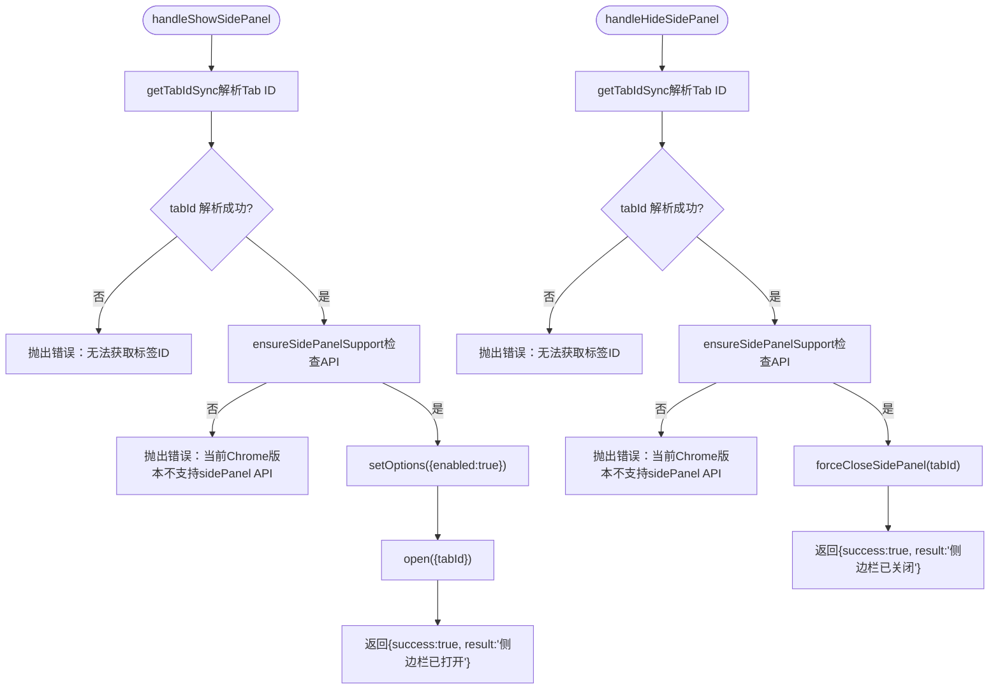

**图表来源**
- [entrypoints/background.ts:73-98](file://entrypoints/background.ts#L73-L98)
- [entrypoints/background.ts:100-114](file://entrypoints/background.ts#L100-L114)
- [entrypoints/background.ts:116-148](file://entrypoints/background.ts#L116-L148)
- [entrypoints/background.ts:260-283](file://entrypoints/background.ts#L260-L283)

**章节来源**
- [entrypoints/background.ts:73-98](file://entrypoints/background.ts#L73-L98)
- [entrypoints/background.ts:100-114](file://entrypoints/background.ts#L100-L114)
- [entrypoints/background.ts:116-148](file://entrypoints/background.ts#L116-L148)
- [entrypoints/background.ts:260-283](file://entrypoints/background.ts#L260-L283)

### 与内容脚本和侧边栏的协作
- **完整消息对象传递**
  - 内容脚本通过 runtime.sendMessage 发送包含type和data字段的完整消息对象
  - 支持传递额外的tabId参数，增强消息处理的准确性
  - 使用getTabIdSync函数同步获取tabId，保持用户手势链
- **端口连接建立**
  - 侧边栏页面通过chrome.runtime.connect({name:'sidepanel'})建立端口连接
  - 后台脚本监听端口连接并设置sidePanelPort状态
  - 侧边栏页面监听端口消息，收到CLOSE_SIDEPANEL时调用window.close()
- **增强的错误处理**
  - 后台脚本在 onMessage 中统一处理，并通过 sendResponse 返回结构化的结果对象
  - 侧边栏页面在端口连接失败时提供详细的错误日志
  - 内容脚本在页面可见性变化、窗口失焦、页面卸载等事件时，也会主动隐藏侧边栏

**章节来源**
- [entrypoints/content.ts:108-112](file://entrypoints/content.ts#L108-L112)
- [entrypoints/sidepanel/App.vue:699-706](file://entrypoints/sidepanel/App.vue#L699-L706)
- [entrypoints/background.ts:68-200](file://entrypoints/background.ts#L68-L200)

## 依赖分析
- **权限与命令**
  - permissions：storage、activeTab、scripting、sidePanel
  - host_permissions：<all_urls>
  - commands：open_options、toggle_sidepanel
- **依赖关系**
  - 后台脚本依赖 utils/types.ts 中的 MessageType 和 Message 接口
  - 快捷键命令由 wxt.config.ts 声明并在后台脚本中处理
  - content script 与后台脚本通过 runtime 消息通信，支持完整的消息对象参数传递
  - sidepanel 通过端口连接与后台脚本建立双向通信
  - **新增**：密码缓存功能依赖 PasswordCache 接口和相关存储操作
  - **新增**：日志记录功能依赖 logger 工具类
  - **新增**：错误处理功能依赖 isExpectedCloseError 函数

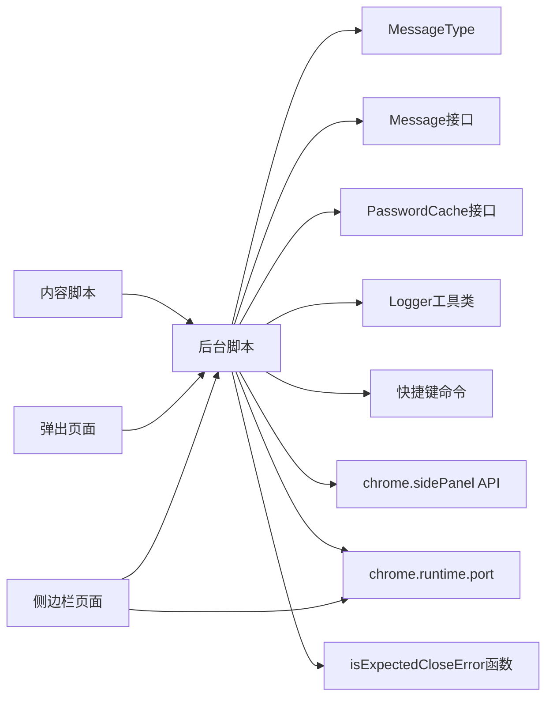

**图表来源**
- [utils/types.ts:52-172](file://utils/types.ts#L52-L172)
- [utils/types.ts:166-183](file://utils/types.ts#L166-L183)
- [utils/logger.ts:1-68](file://utils/logger.ts#L1-L68)
- [wxt.config.ts:22-40](file://wxt.config.ts#L22-L40)
- [entrypoints/background.ts:1-459](file://entrypoints/background.ts#L1-L459)
- [entrypoints/sidepanel/App.vue:699-706](file://entrypoints/sidepanel/App.vue#L699-L706)

**章节来源**
- [wxt.config.ts:22-40](file://wxt.config.ts#L22-L40)
- [utils/types.ts:52-172](file://utils/types.ts#L52-L172)
- [utils/types.ts:166-183](file://utils/types.ts#L166-L183)
- [utils/logger.ts:1-68](file://utils/logger.ts#L1-L68)

## 性能考量
- **事件监听与内存管理**
  - MutationObserver 与事件委托在 content script 中广泛使用，需在页面卸载时清理，避免内存泄漏
  - 后台脚本监听的事件数量有限，但仍需关注异常处理与日志输出
  - 端口连接状态通过全局变量管理，避免重复连接开销
- **异步消息处理**
  - onMessage 中对 SHOW/HIDE/TOGGLE/URL_CHANGED/OPEN_OPTIONS_PAGE 的处理均为异步
  - 使用getTabIdSync函数避免在用户手势链中使用await
  - 实现了完整的异步错误处理和用户反馈机制
- **侧边栏打开的幂等性**
  - chrome.sidePanel.open 为幂等调用，可安全重复调用，减少状态同步复杂度
  - 通过端口连接状态判断避免重复操作
- **Tab ID解析优化**
  - 多级解析策略减少了不必要的API调用，提高了消息处理的效率
  - 端口连接状态检查比Map状态跟踪更高效可靠
- **用户手势链优化**
  - Promise链替代async/await，保持用户手势上下文完整性
  - 同步获取tabId，避免在用户手势链中使用await
  - API可用性检查减少不必要的异步操作
- **密码缓存性能优化**
  - **新增**：内存缓存避免频繁的存储读取，提高访问性能
  - **新增**：动态有效期管理，与会话机制集成，确保数据安全性
  - **新增**：域名匹配检查，提供精确的缓存过滤
  - **新增**：存储变化监听，自动失效机制，确保数据实时性
- **错误处理性能优化**
  - **新增**：专门的错误识别函数，提供精确的错误分类
  - **新增**：三层降级策略，确保在各种情况下都能成功关闭侧边栏
  - **新增**：日志记录的条件输出，减少生产环境的性能开销
- **选项页面管理性能优化**
  - **新增**：isOpeningOptionsPage标志位提供O(1)的重复检测
  - **新增**：智能标签页管理，减少不必要的API调用
  - **新增**：带查询参数的URL匹配，支持更灵活的页面识别

**章节来源**
- [entrypoints/content.ts:1-200](file://entrypoints/content.ts#L1-L200)
- [entrypoints/background.ts:37-66](file://entrypoints/background.ts#L37-L66)
- [entrypoints/background.ts:204-207](file://entrypoints/background.ts#L204-L207)
- [entrypoints/background.ts:339-377](file://entrypoints/background.ts#L339-L377)
- [entrypoints/background.ts:398-422](file://entrypoints/background.ts#L398-L422)

## 故障排查指南
- **侧边栏无法打开**
  - 检查 chrome.sidePanel 是否可用（低版本 Chrome 不支持）
  - 确认消息中是否包含有效的 tabId 参数
  - 确认已启用 sidePanel 权限
  - 检查resolveTabId解析是否成功
  - 查看控制台中的详细错误信息
  - **新增**：检查用户手势链是否被中断（避免在用户手势链中使用await）
  - **新增**：查看forceCloseSidePanel的降级策略日志
- **侧边栏无法关闭**
  - 检查chrome.sidePanel.close API是否可用（Chrome 129+）
  - 确认端口连接状态（sidePanelPort是否为null）
  - 检查是否正确实现了 Tab ID 解析策略
  - 验证port.postMessage是否成功发送CLOSE_SIDEPANEL消息
  - **新增**：检查isExpectedCloseError函数的错误识别是否正确
  - **新增**：查看三层降级策略的执行日志
- **端口连接问题**
  - 检查侧边栏页面是否正确建立chrome.runtime.connect({name:'sidepanel'})
  - 确认后台脚本是否监听chrome.runtime.onConnect事件
  - 验证端口断开事件是否正确处理
- **快捷键无效**
  - 检查 wxt.config.ts 中的 commands 配置与浏览器快捷键设置
  - 确认后台脚本已注册 onCommand 监听
  - **新增**：检查Promise链是否正确执行，避免用户手势链中断
- **URL 变化未触发**
  - 确认 content script 已发送包含完整消息对象的 URL_CHANGED 消息
  - 检查后台脚本 onMessage 处理逻辑
  - 验证消息中的 data.url 参数是否正确传递
- **消息处理失败**
  - 检查消息对象是否包含正确的 type 和 data 字段
  - 查看后台脚本的错误日志，确认具体的错误原因
  - 验证 Tab ID 解析策略是否正常工作
  - **新增**：检查getTabIdSync函数是否正确同步获取tabId
- **密码缓存问题**
  - **新增**：检查密码缓存接口定义是否正确
  - **新增**：验证getCacheValidityMs函数是否正确获取有效期
  - **新增**：检查域名匹配逻辑是否正常工作
  - **新增**：验证存储变化监听器是否正确触发缓存失效
- **选项页面重复打开问题**
  - **新增**：检查 isOpeningOptionsPage 标志位是否正确设置和重置
  - **新增**：验证智能标签页管理逻辑是否正常工作
  - **新增**：检查带查询参数的URL匹配是否正确
  - **新增**：查看选项页面操作的详细日志记录
- **日志记录问题**
  - **新增**：检查logger工具类的环境配置
  - **新增**：验证不同日志级别的输出行为
  - **新增**：查看分组日志功能是否正常工作

**章节来源**
- [entrypoints/background.ts:260-283](file://entrypoints/background.ts#L260-L283)
- [entrypoints/background.ts:318-328](file://entrypoints/background.ts#L318-L328)
- [entrypoints/background.ts:339-377](file://entrypoints/background.ts#L339-L377)
- [entrypoints/background.ts:398-422](file://entrypoints/background.ts#L398-L422)
- [entrypoints/background.ts:446-457](file://entrypoints/background.ts#L446-L457)
- [wxt.config.ts:24-40](file://wxt.config.ts#L24-L40)
- [entrypoints/sidepanel/App.vue:699-706](file://entrypoints/sidepanel/App.vue#L699-L706)
- [utils/logger.ts:1-68](file://utils/logger.ts#L1-L68)

## 结论
后台脚本承担了扩展的核心协调职责：统一处理来自 content script 与 popup 的完整消息对象、响应标签页生命周期事件、执行快捷键命令、并通过官方 chrome.sidePanel API 控制侧边栏显示状态。通过实现重构的错误处理机制、三层降级的面板管理策略、完整的密码缓存系统和改进的日志记录功能，显著提升了系统的可靠性和用户体验。

**主要改进包括**：
- **重构的错误处理机制**：新增专门的错误识别函数，能够区分预期和非预期错误，提供精准的降级策略
- **增强的面板管理策略**：重构forceCloseSidePanel函数，提供三层降级策略：chrome.sidePanel.close API → setOptions强制禁用/恢复 → port通知窗口关闭
- **完整的密码缓存系统**：新增内存缓存、动态有效期管理、域名匹配检查和自动失效功能
- **改进的日志记录系统**：使用统一的logger工具类，支持开发环境和生产环境的差异化日志输出
- **优化的选项页面管理**：改进的重复打开防护机制和智能标签页管理
- **用户手势链保护**：在快捷键处理中使用Promise链而非async/await，确保chrome.sidePanel.open在用户手势上下文中执行
- **同步执行改进**：使用getTabIdSync函数同步获取tabId，避免在用户手势链中使用await
- **增强的错误处理**：改进的closeSidePanel和closeSidePanelWithResponse函数，支持API可用性检查和降级处理
- **Chrome版本兼容性**：增加对chrome.sidePanel.close API可用性的检查和向后兼容机制

新的端口连接机制替代了之前的Map状态跟踪，提供了更准确的侧边栏状态判断，支持Chrome 116+和129+的不同API特性，并通过降级机制确保向后兼容性。通过用户手势链保护和增强的错误处理策略，系统能够在各种Chrome版本和环境下稳定运行。新增的密码缓存系统进一步提升了性能和用户体验，而改进的日志记录功能则为问题诊断提供了更好的支持。后续可在支持的浏览器版本中进一步完善关闭逻辑，并增强消息处理的灵活性和用户反馈机制。

## 附录
- **页面初始化与依赖**
  - popup 与 sidepanel 均基于 Vue 初始化，引入 Element Plus 并挂载根组件
- **依赖项**
  - crypto-js、element-plus、vue、xlsx 等运行时依赖

**章节来源**
- [entrypoints/popup/main.ts:1-10](file://entrypoints/popup/main.ts#L1-L10)
- [entrypoints/sidepanel/main.ts:1-10](file://entrypoints/sidepanel/main.ts#L1-L10)
- [package.json:22-27](file://package.json#L22-L27)