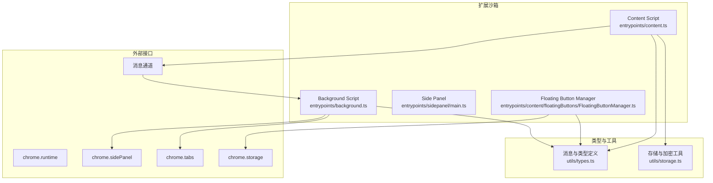
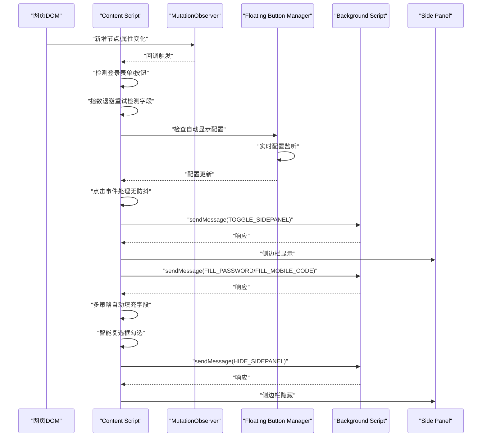
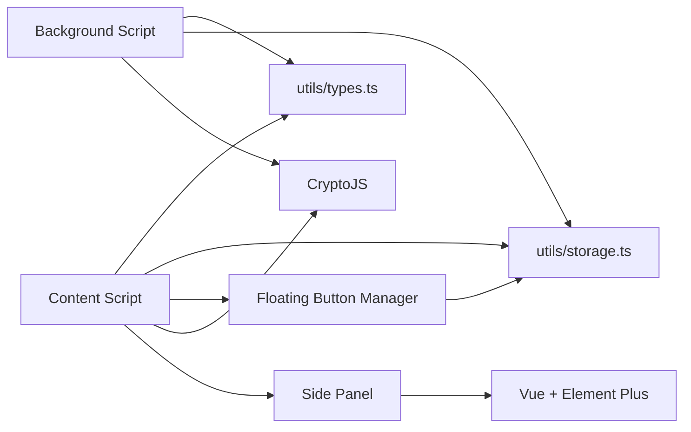

# Content Script

<cite>
**本文引用的文件**
- [entrypoints/content.ts](file://entrypoints/content.ts)
- [entrypoints/background.ts](file://entrypoints/background.ts)
- [utils/types.ts](file://utils/types.ts)
- [utils/storage.ts](file://utils/storage.ts)
- [entrypoints/sidepanel/main.ts](file://entrypoints/sidepanel/main.ts)
- [entrypoints/content/floatingButtons/FloatingButtonManager.ts](file://entrypoints/content/floatingButtons/FloatingButtonManager.ts)
- [entrypoints/content/floatingButtons/SettingsPanel.ts](file://entrypoints/content/floatingButtons/SettingsPanel.ts)
- [package.json](file://package.json)
</cite>

## 更新摘要
**变更内容**
- 新增异步密码填充功能：引入指数退避重试机制，提升动态页面的字段检测成功率
- 多策略填充方法：实现原生setter、execCommand、模拟输入三种填充策略，自动选择最优方案
- 字段检测增强：扩展选择器覆盖更多场景，改进手机号和验证码字段识别算法
- 复杂复选框勾选：实现智能复选框评分系统，支持多种勾选方式的自动尝试
- 性能优化：使用WeakMap/WeakSet缓存提高检测性能，移除防抖机制确保响应速度

## 目录
1. [简介](#简介)
2. [项目结构](#项目结构)
3. [核心组件](#核心组件)
4. [架构总览](#架构总览)
5. [组件详解](#组件详解)
6. [依赖关系分析](#依赖关系分析)
7. [性能考量](#性能考量)
8. [故障排查指南](#故障排查指南)
9. [结论](#结论)
10. [附录](#附录)

## 简介
本文件面向 Account Password Helper 的 Content Script，系统化阐述其 DOM 操作能力与表单检测引擎实现，重点包括：
- MutationObserver 的使用：DOM 变化监听、动态元素检测与表单识别算法
- 登录表单智能检测：用户名/密码字段识别规则、验证码/手机号识别、登录按钮捕获
- 与 Background Script 的消息通信协议：消息类型、数据交换格式
- 表单自动填充：字段映射、数据注入、事件触发与用户体验优化
- **新增** 异步密码填充功能：指数退避重试机制，提升动态页面兼容性
- **新增** 多策略填充方法：原生setter、execCommand、模拟输入三种策略自动切换
- **新增** 字段检测增强：扩展选择器覆盖更多场景，改进识别准确性
- **新增** 复杂复选框勾选：智能评分系统，支持多种勾选方式的自动尝试
- 安全与最佳实践：CSP 限制、跨域通信、XSS 防护、DOM 操作性能优化

## 项目结构
Content Script 位于入口目录，配合 Background Script 实现侧边栏控制与消息桥接；类型定义集中于 utils/types.ts；侧边栏前端由 Vue + Element Plus 构建；悬浮按钮系统提供自动侧边栏控制功能。

**图表来源**
- [entrypoints/content.ts:1-2118](file://entrypoints/content.ts#L1-L2118)
- [entrypoints/background.ts:1-403](file://entrypoints/background.ts#L1-L403)
- [utils/types.ts:1-234](file://utils/types.ts#L1-L234)
- [utils/storage.ts:1-1280](file://utils/storage.ts#L1-L1280)
- [entrypoints/content/floatingButtons/FloatingButtonManager.ts:1-493](file://entrypoints/content/floatingButtons/FloatingButtonManager.ts#L1-L493)

## 核心组件
- **表单检测器（FormDetector）**：负责 MutationObserver 监听、字段识别、登录按钮检测、登录环境判定、侧边栏显示/隐藏与 URL 变化通知。
- **自动侧边栏控制系统**：基于点击事件的智能侧边栏显示，移除防抖优化，确保用户手势链完整。
- **消息处理器**：接收来自 Background Script 的指令，执行填充、显示/隐藏侧边栏等动作。
- **异步自动填充引擎**：支持指数退避重试机制，实现原生setter/execCommand/模拟输入三种填充策略的自动切换。
- **智能复选框管理系统**：提供复杂的复选框评分和多种勾选方式的自动尝试。
- **悬浮按钮管理器**：提供悬浮按钮的生命周期管理、配置同步和用户交互。

## 架构总览
Content Script 通过 MutationObserver 监听 DOM 变化，结合事件委托与缓存策略，高效识别登录表单与按钮；通过消息通道与 Background Script 交互，控制侧边栏显示与 URL 变化通知；在用户点击输入框时，按策略触发侧边栏展示，并在填充完成后自动隐藏。悬浮按钮系统提供实时配置监听和自动侧边栏控制功能。

**图表来源**
- [entrypoints/content.ts:114-191](file://entrypoints/content.ts#L114-L191)
- [entrypoints/background.ts:115-147](file://entrypoints/background.ts#L115-L147)
- [utils/types.ts:54-115](file://utils/types.ts#L54-L115)
- [entrypoints/content/floatingButtons/FloatingButtonManager.ts:226-248](file://entrypoints/content/floatingButtons/FloatingButtonManager.ts#L226-L248)

## 组件详解

### 表单检测引擎（FormDetector）
- **DOM 变化监听**
  - 使用 MutationObserver 监听 body 的子节点、属性变化，过滤包含"登录/验证码/密码"等关键词的节点，触发重新检测。
  - 新增节点中若包含密码/邮箱/文本/手机号/数字输入框，或包含登录按钮选择器的元素，触发重新检测。
- **动态元素检测与表单识别算法**
  - **登录按钮检测**：遍历 button/input[type="button"/"submit"]/[role="button"] 等，结合文本、aria-label/title/value 中的登录关键词，过滤不可见按钮。
  - **字段识别**：
    - **密码字段**：筛选可见的 input[type="password"]。
    - **用户名/邮箱/账号**：多维度选择器与占位符/aria-label/autocomplete 等属性组合，避免重复收录。
    - **手机号**：tel/text/number 类型及 name/id/placeholder/aria-label/autocomplete 等特征。
    - **验证码**：text/number 类型及 code/captcha/verify 等 name/id/placeholder/aria-label/autocomplete。
    - **复选框**：过滤 disabled/display/visibility/offsetParent 等不可交互项。
  - **登录环境判定**：向上查找父元素，检查 form、role/dialog/alertdialog、固定定位、登录关键词类名/ID/aria-label，结合附近字段与按钮，缓存判定结果。
- **智能侧边栏显示策略**
  - **事件委托**：使用 `click` 事件捕获输入框点击，结合字段类型与登录环境判定，**移除防抖机制**，确保用户手势链完整。
  - **自动显示控制**：通过 `floatingButtonConfig.autoShowSidepanel` 配置控制是否自动显示侧边栏。
  - **显示/隐藏**：通过 sendMessage 触发 BACKGROUND 的 TOGGLE_SIDEPANEL，后台侧边栏 API 控制显示；URL 变化时通知后台更新数据。
- **缓存与性能**
  - WeakMap/WeakSet 缓存字段类型与登录环境判定结果，避免重复计算。
  - 可见性/窗口失焦/页面卸载监听，及时隐藏侧边栏。

**章节来源**
- [entrypoints/content.ts:20-2118](file://entrypoints/content.ts#L20-L2118)

### 异步密码填充引擎
- **指数退避重试机制**
  - `waitForFieldsDetected()` 方法实现指数退避重试，初始延迟100ms，最大延迟2000ms，最多重试10次。
  - 每次重试都会触发 `detectForms()` 重新检测字段，提升动态页面的兼容性。
- **多策略填充方法**
  - **策略1：原生setter + 完整事件序列**：使用原生 setter 设置值，触发 focus/input/input(change)/keydown/keyup/blur 完整事件序列。
  - **策略2：execCommand模拟用户输入**：使用 `document.execCommand('insertText')` 模拟用户输入，触发 change 事件。
  - **策略3：模拟逐字符输入**：逐字符触发 keydown/input/keyup 事件，模拟真实用户输入过程。
  - **自动策略切换**：按优先级依次尝试，成功即停止，记录实际使用的策略类型。
- **详细填充结果反馈**
  - `FillResult` 接口提供详细的填充结果，包括用户名字段、密码字段的发现/填充/验证状态。
  - 记录实际使用的填充策略，便于调试和优化。

**新增** 异步密码填充功能和多策略填充方法

**章节来源**
- [entrypoints/content.ts:1286-1566](file://entrypoints/content.ts#L1286-L1566)
- [utils/types.ts:208-233](file://utils/types.ts#L208-L233)

### 智能复选框管理系统
- **智能评分系统**
  - 基于距离、标签关键词、表单层级关系、DOM层级深度等多个维度进行评分。
  - 距离计算使用边缘距离算法，考虑不同层级的元素位置关系。
  - 标签关键词包含"记住"、"同意"、"接受"、"确认"等正向关键词，以及"发送"、"订阅"、"推送"等负向关键词。
- **多种勾选方式自动尝试**
  - **方式1：直接点击**：最简单直接的方式，成功率最高。
  - **方式2：设置值+事件**：直接设置 `checkbox.checked = true` 并触发多种事件。
  - **方式3：通过label点击**：查找关联的 label 元素进行点击。
  - **方式4：模拟用户交互**：模拟 mousedown/mouseup/click 鼠标事件序列。
- **位置关系评分**
  - 复选框位于密码框下方且距离较近时加分。
  - 水平对齐关系加分，增强常见布局的适配性。
  - 同一表单内的复选框加分，提升准确性。

**新增** 智能复选框管理系统

**章节来源**
- [entrypoints/content.ts:1604-2086](file://entrypoints/content.ts#L1604-L2086)

### 自动侧边栏控制系统
- **点击事件处理**
  - 使用 `click` 事件替代 focusin，确保用户手势链完整（Chrome 要求 sidePanel.open() 必须在用户手势上下文中调用）。
  - 点击输入框时立即检查是否应该显示侧边栏，**无防抖延迟**，提高响应速度。
  - 支持自动侧边栏显示配置，避免不必要的侧边栏显示。
- **实时配置监听**
  - 通过 `chrome.storage.onChanged` 监听悬浮按钮配置变化。
  - 实时更新 `floatingButtonConfig`，确保配置变更立即生效。
  - 支持 `autoShowSidepanel`、`visible`、`position`、`opacity` 等配置项的动态更新。
- **智能表单检测**
  - 基于 `shouldShowSidePanel` 方法判断是否应该显示侧边栏。
  - 支持账号+密码组合和手机号+验证码组合的智能识别。
  - 采用宽松策略，在登录环境下即使没有检测到完整表单也显示侧边栏。
- **侧边栏显示逻辑**
  - 检查字段类型是否为识别的字段（用户名、密码、手机号、验证码）。
  - 验证输入框是否在登录表单或弹窗中。
  - 检查是否存在完整的登录表单组合。
  - **移除防抖机制**，点击即响应。

**章节来源**
- [entrypoints/content.ts:621-647](file://entrypoints/content.ts#L621-L647)

### 事件委托与点击处理
- 使用 `document.addEventListener('click', handler, { capture: true })` 实现全局事件委托，捕获所有 input 点击事件。
- 根据字段类型与登录环境判定决定是否显示侧边栏，**移除防抖优化**，确保用户手势链完整。
- 支持自动侧边栏显示配置，避免不必要的侧边栏显示。

**章节来源**
- [entrypoints/content.ts:621-647](file://entrypoints/content.ts#L621-L647)

### 登录按钮与表单识别
- **登录按钮关键词**：登录、登陆、sign in、login、立即登录、密码登录、验证码登录 等。
- **表单识别**：检查 form 内 submit/button 或登录关键词，结合附近字段/按钮与文本内容，提升识别准确率。

**章节来源**
- [entrypoints/content.ts:114-175](file://entrypoints/content.ts#L114-L175)

### URL 变化与页面导航监听
- 页面可见性变化、窗口失焦、beforeunload 时隐藏侧边栏。
- SPA 路由变化与 popstate 监听，通过 MutationObserver 检测 location.href 变化，通知后台更新数据。

**章节来源**
- [entrypoints/content.ts:92-100](file://entrypoints/content.ts#L92-L100)

### 自动填充实现
- **账号+密码填充**：优先填充用户名/密码字段，触发完整事件序列（focus/input/input(change)/keydown/keyup/blur），并延迟隐藏侧边栏。
- **手机号+验证码填充**：优先填充手机号字段，额外触发 input/change/键盘事件；若无手机号字段则回退到用户名字段；验证码字段可按需填充。
- **复选框自动勾选**：基于距离、标签关键词、表单层级与位置关系评分，选择最优复选框并尝试多种勾选方式（click/设置值+事件/label点击/模拟鼠标事件）。

**章节来源**
- [entrypoints/content.ts:1316-1602](file://entrypoints/content.ts#L1316-L1602)

### 侧边栏控制与消息协议
- **Content Script -> Background**：
  - `TOGGLE_SIDEPANEL`：请求切换侧边栏显示状态，**替代 SHOW/HIDE_SIDEPANEL**，确保用户手势链完整。
  - `FILL_PASSWORD` / `FILL_MOBILE_CODE`：请求填充对应组合。
- **Background -> Content**：
  - `PING`：心跳检测，确认 Content Script 就绪。
  - `SHOW/HIDE_SIDEPANEL`：由后台控制侧边栏显示/隐藏（通过 chrome.sidePanel API）。

**章节来源**
- [utils/types.ts:54-115](file://utils/types.ts#L54-L115)
- [entrypoints/background.ts:115-147](file://entrypoints/background.ts#L115-L147)

### 与 Side Panel 的集成
- Side Panel 由 Vue + Element Plus 构建，Content Script 通过消息通道驱动其显示/隐藏与数据更新。
- 若后台侧边栏 API 不可用，Content Script 会给出兼容性提示。

**章节来源**
- [entrypoints/sidepanel/main.ts:1-10](file://entrypoints/sidepanel/main.ts#L1-L10)
- [entrypoints/background.ts:1-403](file://entrypoints/background.ts#L1-L403)

### 悬浮按钮管理系统
- **配置管理**：提供悬浮按钮的显示状态、位置、透明度、自动显示侧边栏等功能配置。
- **实时同步**：通过 `chrome.storage.onChanged` 监听配置变化，实时更新悬浮按钮状态。
- **用户交互**：支持设置面板的开关控制，用户可自定义自动侧边栏显示行为。
- **生命周期管理**：负责悬浮按钮的创建、销毁和状态维护。

**章节来源**
- [entrypoints/content/floatingButtons/FloatingButtonManager.ts:1-493](file://entrypoints/content/floatingButtons/FloatingButtonManager.ts#L1-L493)
- [entrypoints/content/floatingButtons/SettingsPanel.ts:97-136](file://entrypoints/content/floatingButtons/SettingsPanel.ts#L97-L136)

## 依赖关系分析
- **类型与消息协议**
  - utils/types.ts 定义了 PasswordEntry、MasterPasswordConfig、MessageType、Message 接口，作为 Content/Background/Side Panel 的统一契约。
  - 新增 `FloatingButtonConfig` 接口，支持悬浮按钮配置管理。
  - 新增 `FillStrategy` 类型和 `FillResult` 接口，支持多策略填充结果反馈。
- **存储与加密**
  - utils/storage.ts 提供主密码校验、PBKDF2 派生密钥、AES 加解密、密码条目 CRUD、排序与会话有效性管理等，为填充与侧边栏数据提供支撑。
  - 新增悬浮按钮配置的存储和加载功能。
- **依赖与构建**
  - package.json 指定 Vue、Element Plus、CryptoJS、WXT 等依赖，保证 Content Script 与 Side Panel 的运行时环境。

**图表来源**
- [utils/types.ts:1-234](file://utils/types.ts#L1-L234)
- [utils/storage.ts:1-1280](file://utils/storage.ts#L1-L1280)
- [entrypoints/content/floatingButtons/FloatingButtonManager.ts:1-493](file://entrypoints/content/floatingButtons/FloatingButtonManager.ts#L1-L493)
- [package.json:22-46](file://package.json#L22-L46)

## 性能考量
- **DOM 操作与事件监听**
  - 使用事件委托（click）替代为每个字段绑定监听器，显著降低内存占用与事件处理开销。
  - MutationObserver 仅监听关键属性与新增节点，避免全量扫描。
- **缓存与去重**
  - WeakMap/WeakSet 缓存字段类型与登录环境判定结果，防止重复计算。
  - 通过可见性/窗口失焦/页面卸载监听及时隐藏侧边栏，减少后台渲染压力。
- **响应速度优化**
  - **移除防抖机制**，点击即响应，提高侧边栏显示的即时性。
  - 确保用户手势链完整，满足 Chrome 要求 sidePanel.open() 必须在用户手势上下文中调用。
- **配置监听优化**
  - 通过 `chrome.storage.onChanged` 实现实时配置监听，避免轮询检查。
  - 配置更新时仅更新相关状态，减少不必要的重渲染。
- **选择器与检测策略**
  - 多维度选择器与属性匹配，减少误判；对手机号/验证码等字段采用更严格的特征匹配，避免误填充。
- **异步重试优化**
  - 指数退避重试机制避免频繁检测，提升动态页面兼容性。
  - 最大延迟2秒防止无限等待，确保用户体验。

**章节来源**
- [entrypoints/content.ts:1286-1311](file://entrypoints/content.ts#L1286-L1311)
- [entrypoints/content.ts:621-647](file://entrypoints/content.ts#L621-L647)
- [entrypoints/content.ts:1286-1311](file://entrypoints/content.ts#L1286-L1311)

## 故障排查指南
- **侧边栏无法显示**
  - 检查是否检测到登录表单：若未检测到，Content Script 会提示"未匹配到登录表单"。可通过手动触发 TOGGLE_SIDEPANEL 并观察后台响应。
  - 检查 Chrome 版本是否支持 chrome.sidePanel API；低版本会提示不支持。
  - 检查自动侧边栏显示配置：确认 `floatingButtonConfig.autoShowSidepanel` 是否为 `true`。
  - 检查事件处理：确认使用 click 事件而非 focusin，确保用户手势链完整。
- **自动侧边栏显示异常**
  - 检查悬浮按钮配置是否正确：通过设置面板确认自动显示开关状态。
  - 查看控制台日志：确认配置监听是否正常工作。
  - 验证点击事件处理：检查点击事件是否正常触发，**无防抖延迟**。
- **填充无效或事件未触发**
  - 确认字段可见且未被禁用；Content Script 会尝试多种事件序列（focus/input/input(change)/keydown/keyup/blur），若仍失败，检查页面是否拦截或重写原生事件。
  - 对手机号字段，Content Script 会额外触发 input/change/键盘事件；若页面有特殊校验，可能需要手动输入验证码。
  - **新增** 检查异步重试机制：确认 `waitForFieldsDetected()` 是否正常工作，查看重试次数和延迟。
  - **新增** 检查多策略填充：确认三种填充策略是否都能正常工作，查看实际使用的策略类型。
- **复选框未勾选**
  - 若 click/设置值/label 点击均失败，Content Script 会尝试模拟鼠标事件；若页面使用复杂 UI 框架，可能需要用户手动勾选。
  - **新增** 检查智能评分系统：确认复选框评分是否合理，查看距离、标签关键词、位置关系等评分因素。
- **URL 变化未更新**
  - 确认 SPA 路由变化监听是否生效；Content Script 会在路由变化时发送 URL_CHANGED 消息给后台。
- **配置不同步问题**
  - 检查 `chrome.storage.onChanged` 监听器是否正常工作。
  - 确认配置更新后是否正确应用到悬浮按钮管理器。

**章节来源**
- [entrypoints/content.ts:489-597](file://entrypoints/content.ts#L489-L597)
- [entrypoints/background.ts:1-403](file://entrypoints/background.ts#L1-L403)
- [entrypoints/content.ts:1316-1602](file://entrypoints/content.ts#L1316-L1602)
- [entrypoints/content.ts:1604-2086](file://entrypoints/content.ts#L1604-L2086)

## 结论
Content Script 通过高效的 MutationObserver 与事件委托机制，实现了对动态登录表单的精准识别与侧边栏智能展示；借助完善的消息协议与自动填充引擎，为用户提供了流畅的密码/手机号+验证码填充体验。**新增的异步密码填充功能**通过指数退避重试机制，显著提升了动态页面的兼容性和稳定性；**多策略填充方法**确保在各种复杂页面环境下都能成功填充数据；**智能复选框管理系统**提供了更完善的用户体验。配合缓存与性能优化策略，在保证准确性的同时兼顾性能与资源消耗。悬浮按钮管理系统提供了灵活的配置选项，用户可以根据需求自定义侧边栏显示行为。建议在复杂页面中进一步细化字段特征与事件触发策略，持续优化用户体验。

## 附录

### 消息类型与数据交换格式
- **MessageType**
  - `PING`：心跳检测
  - `DETECT_FORM`：检测表单
  - `FILL_PASSWORD`：填充账号+密码
  - `FILL_MOBILE_CODE`：填充手机号+验证码
  - `SHOW_SIDEPANEL`：显示侧边栏（已更新为 `TOGGLE_SIDEPANEL`）
  - `HIDE_SIDEPANEL`：隐藏侧边栏（已更新为 `TOGGLE_SIDEPANEL`）
  - `TOGGLE_SIDEPANEL`：切换侧边栏（用于悬浮按钮）
  - `CLOSE_SIDEPANEL`：关闭侧边栏（发送给sidepanel，让它自己关闭）
  - `URL_CHANGED`：URL 变化通知
  - `GET_PASSWORDS`：获取密码列表
  - `OPEN_OPTIONS_PAGE`：打开密码管理页面
  - `TOGGLE_FLOATING_BUTTONS`：切换悬浮按钮显示状态
  - `GET_CACHED_PASSWORDS`：获取缓存的密码列表
  - `UPDATE_PASSWORD_CACHE`：更新密码缓存
  - `INVALIDATE_PASSWORD_CACHE`：使密码缓存失效
- **Message**
  - `type`: MessageType
  - `data?`: any

**章节来源**
- [utils/types.ts:54-115](file://utils/types.ts#L54-L115)

### 字段识别规则摘要
- **密码字段**：input[type="password"]，可见性过滤
- **用户名/邮箱/账号**：email/tel/text + name/id/placeholder/aria-label/autocomplete 等
- **手机号**：tel/text/number + phone/mobile 相关属性
- **验证码**：text/number + code/captcha/verify 相关属性
- **登录按钮**：button/input[type="button"/"submit"] + 登录关键词

**章节来源**
- [entrypoints/content.ts:223-458](file://entrypoints/content.ts#L223-L458)
- [entrypoints/content.ts:114-175](file://entrypoints/content.ts#L114-L175)

### 悬浮按钮配置接口
- **FloatingButtonConfig**
  - `visible`: boolean - 是否显示悬浮按钮
  - `position`: 'left' | 'right' - 按钮位置（左侧/右侧）
  - `offsetY`: number - 垂直偏移量（像素）
  - `opacity`: number - 按钮透明度（0-1）
  - `autoShowSidepanel`: boolean - 输入框点击时是否自动展示侧边栏

**章节来源**
- [utils/types.ts:126-149](file://utils/types.ts#L126-L149)

### 填充策略与结果接口
- **FillStrategy**
  - `'native' | 'execCommand' | 'simulate'`：三种填充策略类型
- **FillResult**
  - `success`: boolean - 填充是否成功
  - `message`: string - 填充结果描述
  - `details`: 包含用户名字段、密码字段的详细结果和实际使用的策略
- **FieldFillResult**
  - `found`: boolean - 字段是否找到
  - `filled`: boolean - 字段是否已填充
  - `verified`: boolean - 字段值是否验证通过

**新增** 填充策略与结果接口

**章节来源**
- [utils/types.ts:208-233](file://utils/types.ts#L208-L233)

### 事件处理机制变更说明
- **变更前**：使用 focusin 事件，配合防抖机制，延迟显示侧边栏
- **变更后**：使用 click 事件，**移除防抖机制**，点击即响应
- **目的**：确保用户手势链完整，满足 Chrome 要求 sidePanel.open() 必须在用户手势上下文中调用
- **效果**：提高响应速度，改善用户体验

**章节来源**
- [entrypoints/content.ts:621-647](file://entrypoints/content.ts#L621-L647)

### 异步重试机制说明
- **指数退避策略**：初始延迟100ms，每次重试乘以1.5，最大延迟2000ms
- **重试次数**：最多10次重试
- **应用场景**：动态加载的登录表单，确保字段检测的可靠性
- **性能考虑**：避免频繁检测，防止影响页面性能

**新增** 异步重试机制说明

**章节来源**
- [entrypoints/content.ts:1286-1311](file://entrypoints/content.ts#L1286-L1311)