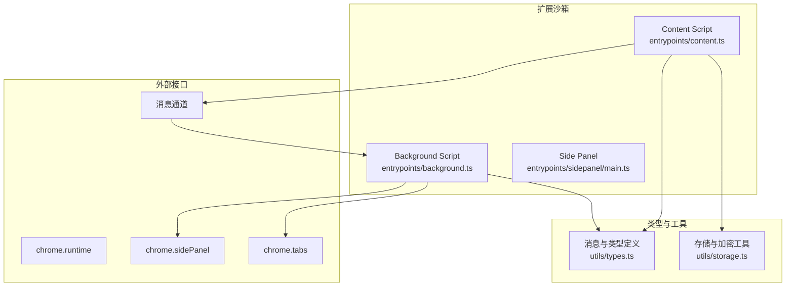
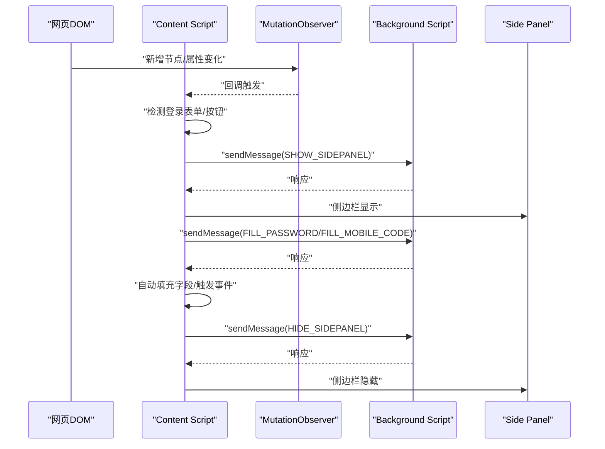
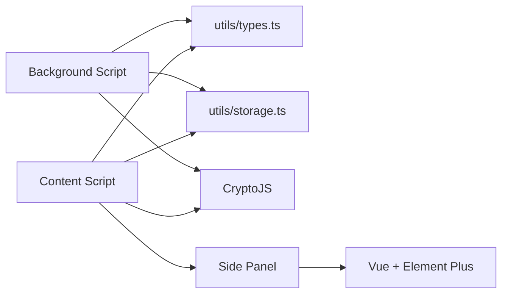

# Content Script

<cite>
**本文引用的文件**
- [entrypoints/content.ts](file://entrypoints/content.ts)
- [entrypoints/background.ts](file://entrypoints/background.ts)
- [utils/types.ts](file://utils/types.ts)
- [utils/storage.ts](file://utils/storage.ts)
- [entrypoints/sidepanel/main.ts](file://entrypoints/sidepanel/main.ts)
- [package.json](file://package.json)
</cite>

## 目录
1. [简介](#简介)
2. [项目结构](#项目结构)
3. [核心组件](#核心组件)
4. [架构总览](#架构总览)
5. [组件详解](#组件详解)
6. [依赖关系分析](#依赖关系分析)
7. [性能考量](#性能考量)
8. [故障排查指南](#故障排查指南)
9. [结论](#结论)
10. [附录](#附录)

## 简介
本文件面向 Account Password Helper 的 Content Script，系统化阐述其 DOM 操作能力与表单检测引擎实现，重点包括：
- MutationObserver 的使用：DOM 变化监听、动态元素检测与表单识别算法
- 登录表单智能检测：用户名/密码字段识别规则、验证码/手机号识别、登录按钮捕获
- 与 Background Script 的消息通信协议：消息类型、数据交换格式
- 表单自动填充：字段映射、数据注入、事件触发与用户体验优化
- 安全与最佳实践：CSP 限制、跨域通信、XSS 防护、DOM 操作性能优化

## 项目结构
Content Script 位于入口目录，配合 Background Script 实现侧边栏控制与消息桥接；类型定义集中于 utils/types.ts；侧边栏前端由 Vue + Element Plus 构建。

图表来源
- [entrypoints/content.ts](file://entrypoints/content.ts#L1-L1892)
- [entrypoints/background.ts](file://entrypoints/background.ts#L1-L232)
- [utils/types.ts](file://utils/types.ts#L1-L96)
- [utils/storage.ts](file://utils/storage.ts#L1-L981)
- [entrypoints/sidepanel/main.ts](file://entrypoints/sidepanel/main.ts#L1-L10)

章节来源
- [entrypoints/content.ts](file://entrypoints/content.ts#L1-L1892)
- [entrypoints/background.ts](file://entrypoints/background.ts#L1-L232)
- [utils/types.ts](file://utils/types.ts#L1-L96)
- [utils/storage.ts](file://utils/storage.ts#L1-L981)
- [entrypoints/sidepanel/main.ts](file://entrypoints/sidepanel/main.ts#L1-L10)

## 核心组件
- 表单检测器（FormDetector）：负责 MutationObserver 监听、字段识别、登录按钮检测、登录环境判定、侧边栏显示/隐藏与 URL 变化通知。
- 消息处理器：接收来自 Background Script 的指令，执行填充、显示/隐藏侧边栏等动作。
- 自动填充引擎：将密码条目映射到对应字段，触发完整事件序列，优化用户体验。
- 复选框自动勾选：基于距离、标签关键词、层级关系评分，选择最合适的“记住我”等复选框。

章节来源
- [entrypoints/content.ts](file://entrypoints/content.ts#L21-L1881)
- [utils/types.ts](file://utils/types.ts#L52-L96)

## 架构总览
Content Script 通过 MutationObserver 监听 DOM 变化，结合事件委托与缓存策略，高效识别登录表单与按钮；通过消息通道与 Background Script 交互，控制侧边栏显示与 URL 变化通知；在用户聚焦输入框时，按策略触发侧边栏展示，并在填充完成后自动隐藏。

图表来源
- [entrypoints/content.ts](file://entrypoints/content.ts#L93-L170)
- [entrypoints/background.ts](file://entrypoints/background.ts#L34-L73)
- [utils/types.ts](file://utils/types.ts#L54-L87)

## 组件详解

### 表单检测引擎（FormDetector）
- DOM 变化监听
  - 使用 MutationObserver 监听 body 的子节点、属性变化，过滤包含“登录/验证码/密码”等关键词的节点，触发重新检测。
  - 新增节点中若包含密码/邮箱/文本/手机号/数字输入框，或包含登录按钮选择器的元素，触发重新检测。
- 动态元素检测与表单识别算法
  - 登录按钮检测：遍历 button/input[type="button"/"submit"]/[role="button"] 等，结合文本、aria-label/title/value 中的登录关键词，过滤不可见按钮。
  - 字段识别：
    - 密码字段：筛选可见的 input[type="password"]。
    - 用户名/邮箱/账号：多维度选择器与占位符/aria-label/autocomplete 等属性组合，避免重复收录。
    - 手机号：tel/text/number 类型及 name/id/placeholder/aria-label/autocomplete 等特征。
    - 验证码：text/number 类型及 code/captcha/verify 等 name/id/placeholder/aria-label/autocomplete。
    - 复选框：过滤 disabled/display/visibility/offsetParent 等不可交互项。
  - 登录环境判定：向上查找父元素，检查 form、role/dialog/alertdialog、固定定位、登录关键词类名/ID/aria-label，结合附近字段与按钮，缓存判定结果。
- 侧边栏显示策略
  - 事件委托：使用 focusin 捕获输入框焦点，结合字段类型与登录环境判定，使用防抖函数延迟显示侧边栏，避免频繁触发。
  - 显示/隐藏：通过 sendMessage 触发 BACKGROUND 的 SHOW/HIDE_SIDEPANEL，后台侧边栏 API 控制显示；URL 变化时通知后台更新数据。
- 缓存与性能
  - WeakMap/WeakSet 缓存字段类型与登录环境判定结果，避免重复计算。
  - 可见性/窗口失焦/页面卸载监听，及时隐藏侧边栏。
  - 防抖函数降低高频事件影响。

章节来源
- [entrypoints/content.ts](file://entrypoints/content.ts#L21-L1881)

### 事件委托与焦点处理
- 使用 document.addEventListener('focusin', handler, { capture: true }) 实现全局事件委托，捕获所有 input 获焦事件。
- 根据字段类型与登录环境判定决定是否显示侧边栏，防抖优化响应速度。

章节来源
- [entrypoints/content.ts](file://entrypoints/content.ts#L607-L636)

### 登录按钮与表单识别
- 登录按钮关键词：登录、登陆、sign in、login、立即登录、密码登录、验证码登录 等。
- 表单识别：检查 form 内 submit/button 或登录关键词，结合附近字段/按钮与文本内容，提升识别准确率。

章节来源
- [entrypoints/content.ts](file://entrypoints/content.ts#L1040-L1117)

### URL 变化与页面导航监听
- 页面可见性变化、窗口失焦、beforeunload 时隐藏侧边栏。
- SPA 路由变化与 popstate 监听，通过 MutationObserver 检测 location.href 变化，通知后台更新数据。

章节来源
- [entrypoints/content.ts](file://entrypoints/content.ts#L1119-L1182)

### 自动填充实现
- 账号+密码填充：优先填充用户名/密码字段，触发完整事件序列（focus/input/input(change)/keydown/keyup/blur），并延迟隐藏侧边栏。
- 手机号+验证码填充：优先填充手机号字段，额外触发 input/change/键盘事件；若无手机号字段则回退到用户名字段；验证码字段可按需填充。
- 复选框自动勾选：基于距离、标签关键词、表单层级与位置关系评分，选择最优复选框并尝试多种勾选方式（click/设置值+事件/label点击/模拟鼠标事件）。

章节来源
- [entrypoints/content.ts](file://entrypoints/content.ts#L1219-L1859)

### 侧边栏控制与消息协议
- Content Script -> Background：
  - SHOW_SIDEPANEL：请求显示侧边栏，若当前页面未检测到登录表单，显示“未匹配到登录表单”的提示。
  - HIDE_SIDEPANEL：请求隐藏侧边栏。
  - URL_CHANGED：通知 URL 发生变化，便于侧边栏更新数据。
  - FILL_PASSWORD / FILL_MOBILE_CODE：请求填充对应组合。
- Background -> Content：
  - PING：心跳检测，确认 Content Script 就绪。
  - SHOW/HIDE_SIDEPANEL：由后台控制侧边栏显示/隐藏（通过 chrome.sidePanel API）。

章节来源
- [utils/types.ts](file://utils/types.ts#L54-L96)
- [entrypoints/content.ts](file://entrypoints/content.ts#L1184-L1217)
- [entrypoints/background.ts](file://entrypoints/background.ts#L34-L73)

### 与 Side Panel 的集成
- Side Panel 由 Vue + Element Plus 构建，Content Script 通过消息通道驱动其显示/隐藏与数据更新。
- 若后台侧边栏 API 不可用，Content Script 会给出兼容性提示。

章节来源
- [entrypoints/sidepanel/main.ts](file://entrypoints/sidepanel/main.ts#L1-L10)
- [entrypoints/background.ts](file://entrypoints/background.ts#L75-L138)

## 依赖关系分析
- 类型与消息协议
  - utils/types.ts 定义了 PasswordEntry、MasterPasswordConfig、MessageType、Message 接口，作为 Content/Background/Side Panel 的统一契约。
- 存储与加密
  - utils/storage.ts 提供主密码校验、PBKDF2 派生密钥、AES 加解密、密码条目 CRUD、排序与会话有效性管理等，为填充与侧边栏数据提供支撑。
- 依赖与构建
  - package.json 指定 Vue、Element Plus、CryptoJS、WXT 等依赖，保证 Content Script 与 Side Panel 的运行时环境。

图表来源
- [utils/types.ts](file://utils/types.ts#L1-L96)
- [utils/storage.ts](file://utils/storage.ts#L1-L981)
- [package.json](file://package.json#L22-L46)

章节来源
- [utils/types.ts](file://utils/types.ts#L1-L96)
- [utils/storage.ts](file://utils/storage.ts#L1-L981)
- [package.json](file://package.json#L1-L49)

## 性能考量
- DOM 操作与事件监听
  - 使用事件委托（focusin）替代为每个字段绑定监听器，显著降低内存占用与事件处理开销。
  - MutationObserver 仅监听关键属性与新增节点，避免全量扫描。
- 缓存与去重
  - WeakMap/WeakSet 缓存字段类型与登录环境判定结果，防止重复计算。
  - 通过可见性/窗口失焦/页面卸载监听及时隐藏侧边栏，减少后台渲染压力。
- 防抖与延迟
  - 防抖函数降低高频事件触发频率；填充完成后延迟隐藏侧边栏，确保用户操作完成。
- 选择器与检测策略
  - 多维度选择器与属性匹配，减少误判；对手机号/验证码等字段采用更严格的特征匹配，避免误填充。

章节来源
- [entrypoints/content.ts](file://entrypoints/content.ts#L9-L19)
- [entrypoints/content.ts](file://entrypoints/content.ts#L607-L636)
- [entrypoints/content.ts](file://entrypoints/content.ts#L93-L170)

## 故障排查指南
- 侧边栏无法显示
  - 检查是否检测到登录表单：若未检测到，Content Script 会提示“未匹配到登录表单”。可通过手动触发 SHOW_SIDEPANEL 并观察后台响应。
  - 检查 Chrome 版本是否支持 chrome.sidePanel API；低版本会提示不支持。
- 填充无效或事件未触发
  - 确认字段可见且未被禁用；Content Script 会尝试多种事件序列（focus/input/input(change)/keydown/keyup/blur），若仍失败，检查页面是否拦截或重写原生事件。
  - 对手机号字段，Content Script 会额外触发 input/change/键盘事件；若页面有特殊校验，可能需要手动输入验证码。
- 复选框未勾选
  - 若 click/设置值/label 点击均失败，Content Script 会尝试模拟鼠标事件；若页面使用复杂 UI 框架，可能需要用户手动勾选。
- URL 变化未更新
  - 确认 SPA 路由变化监听是否生效；Content Script 会在路由变化时发送 URL_CHANGED 消息给后台。

章节来源
- [entrypoints/content.ts](file://entrypoints/content.ts#L993-L1028)
- [entrypoints/background.ts](file://entrypoints/background.ts#L75-L138)
- [entrypoints/content.ts](file://entrypoints/content.ts#L1219-L1859)

## 结论
Content Script 通过高效的 MutationObserver 与事件委托机制，实现了对动态登录表单的精准识别与侧边栏智能展示；借助完善的消息协议与自动填充引擎，为用户提供了流畅的密码/手机号+验证码填充体验。配合缓存与防抖策略，在保证准确性的同时兼顾性能与资源消耗。建议在复杂页面中进一步细化字段特征与事件触发策略，持续优化用户体验。

## 附录

### 消息类型与数据交换格式
- MessageType
  - PING：心跳检测
  - DETECT_FORM：检测表单
  - FILL_PASSWORD：填充账号+密码
  - FILL_MOBILE_CODE：填充手机号+验证码
  - SHOW_SIDEPANEL：显示侧边栏
  - HIDE_SIDEPANEL：隐藏侧边栏
  - URL_CHANGED：URL 变化通知
  - GET_PASSWORDS：获取密码列表
- Message
  - type: MessageType
  - data?: any

章节来源
- [utils/types.ts](file://utils/types.ts#L54-L96)

### 字段识别规则摘要
- 密码字段：input[type="password"]，可见性过滤
- 用户名/邮箱/账号：email/tel/text + name/id/placeholder/aria-label/autocomplete 等
- 手机号：tel/text/number + phone/mobile 相关属性
- 验证码：text/number + code/captcha/verify 相关属性
- 登录按钮：button/input[type="button"/"submit"] + 登录关键词

章节来源
- [entrypoints/content.ts](file://entrypoints/content.ts#L191-L437)
- [entrypoints/content.ts](file://entrypoints/content.ts#L1040-L1117)