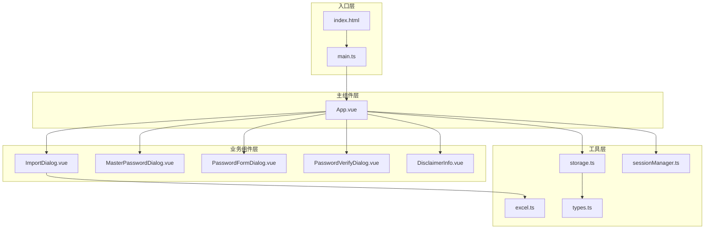
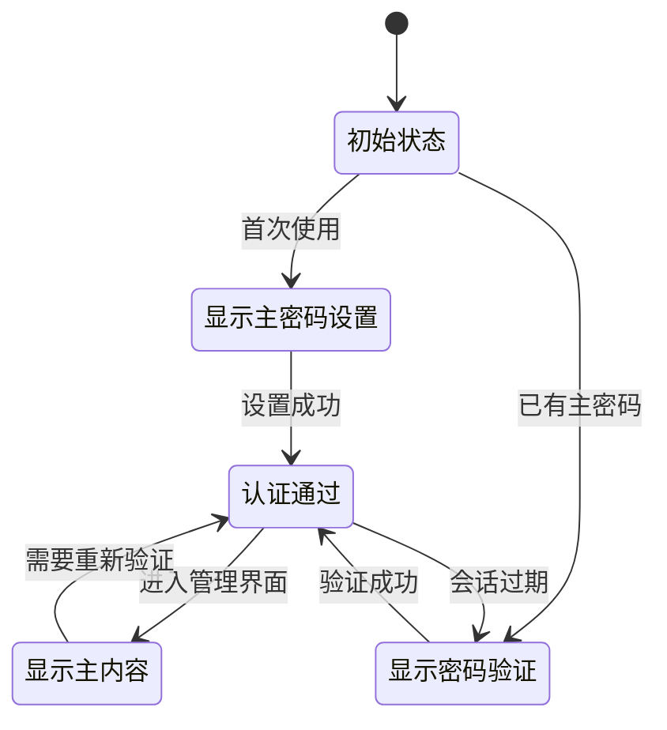
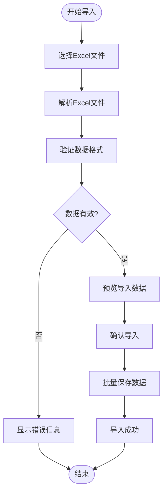
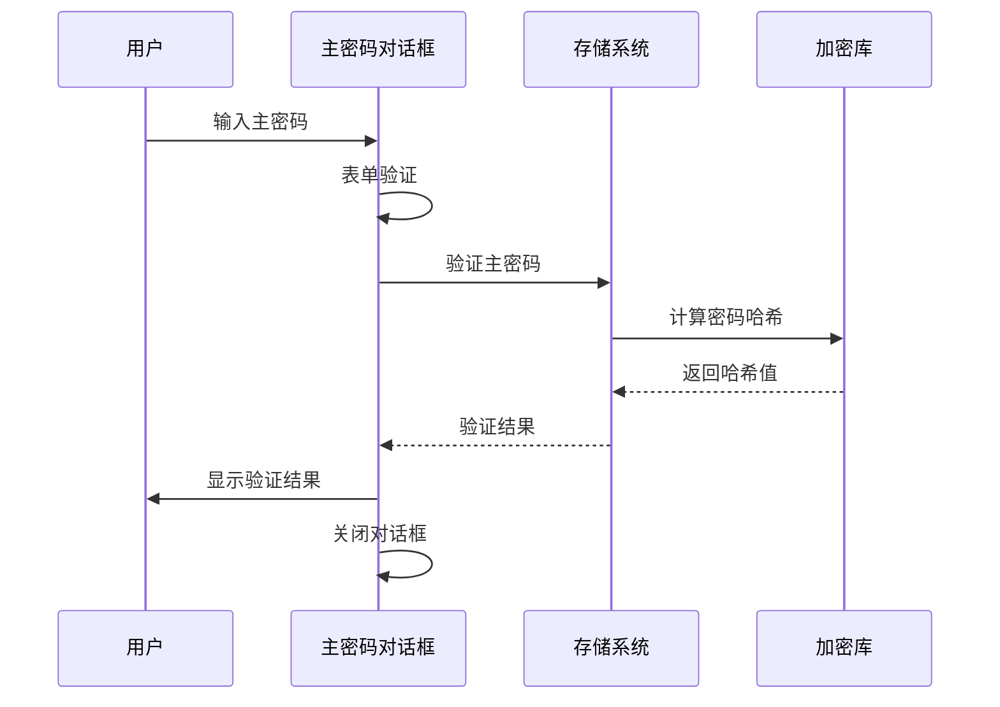
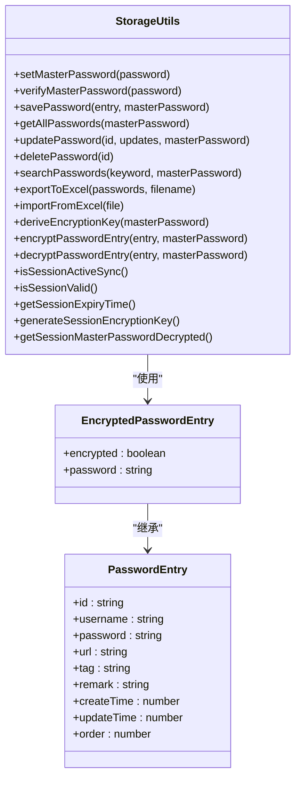
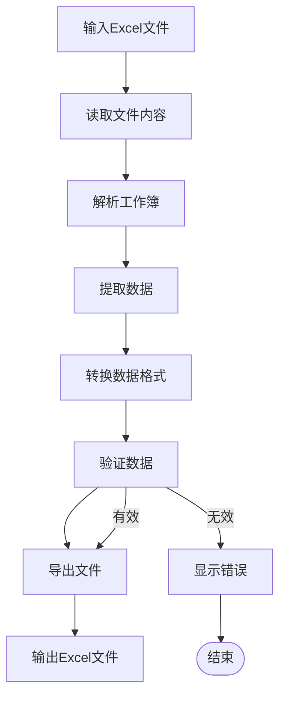
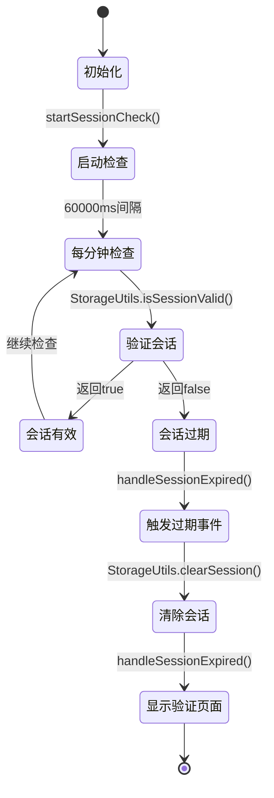
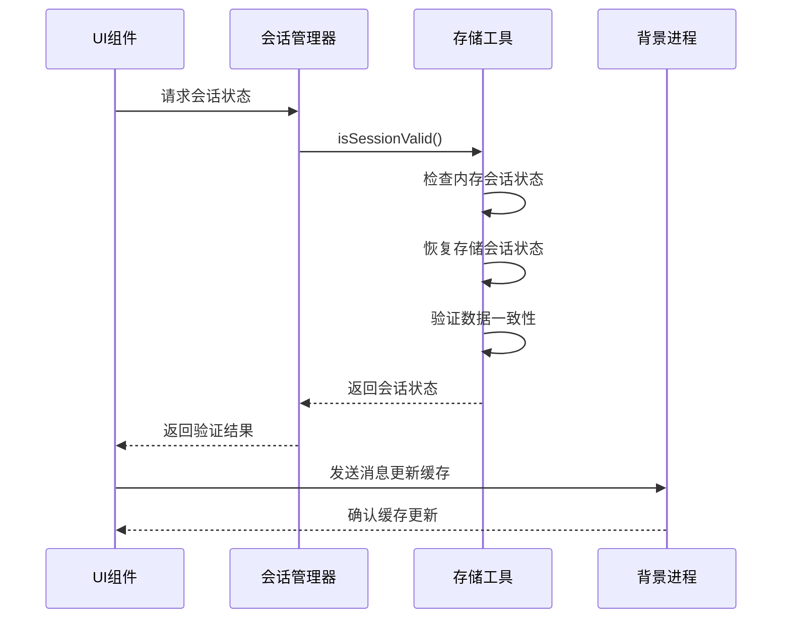
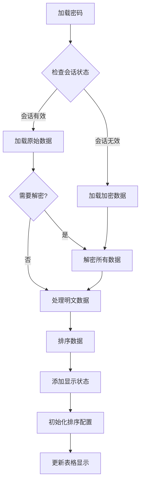

# Options界面

<cite>
**本文档引用的文件**
- [App.vue](file://entrypoints/options/App.vue)
- [main.ts](file://entrypoints/options/main.ts)
- [index.html](file://entrypoints/options/index.html)
- [ImportDialog.vue](file://components/ImportDialog.vue)
- [MasterPasswordDialog.vue](file://components/MasterPasswordDialog.vue)
- [PasswordFormDialog.vue](file://components/PasswordFormDialog.vue)
- [PasswordVerifyDialog.vue](file://components/PasswordVerifyDialog.vue)
- [storage.ts](file://utils/storage.ts)
- [excel.ts](file://utils/excel.ts)
- [sessionManager.ts](file://utils/sessionManager.ts)
- [types.ts](file://utils/types.ts)
- [DisclaimerInfo.vue](file://components/DisclaimerInfo.vue)
- [package.json](file://package.json)
</cite>

## 更新摘要
**变更内容**
- 新增会话感知API适配的详细说明
- 优化密码加载逻辑和早期会话验证检查
- 简化UI组件的API调用，提升响应性和一致性
- 增强会话状态检查和数据一致性保障
- 完善会话过期处理和用户界面反馈机制

## 目录
1. [简介](#简介)
2. [项目结构](#项目结构)
3. [核心组件](#核心组件)
4. [架构概览](#架构概览)
5. [详细组件分析](#详细组件分析)
6. [会话感知API系统](#会话感知api系统)
7. [密码加载优化机制](#密码加载优化机制)
8. [依赖关系分析](#依赖关系分析)
9. [性能考虑](#性能考虑)
10. [故障排除指南](#故障排除指南)
11. [结论](#结论)

## 简介

Account Password Helper的Options界面是一个功能完整的Chrome扩展设置页面，专为账号密码管理而设计。该界面采用现代化的Vue 3 + TypeScript架构，结合Element Plus组件库，提供了安全、直观的账号密码管理体验。系统支持主密码设置与验证、密码条目管理、Excel数据导入导出、以及完整的数据持久化机制。

**更新** 新增了会话感知API适配和UI组件优化功能，显著提升了用户体验和系统稳定性。会话管理器实现了智能检查机制，确保主密码会话的有效性和安全性，同时优化了密码加载逻辑和API调用简化。

## 项目结构

Options界面采用模块化的Vue单文件组件架构，主要由以下层次组成：



**图表来源**
- [index.html](file://entrypoints/options/index.html#L1-L19)
- [main.ts](file://entrypoints/options/main.ts#L1-L11)
- [App.vue](file://entrypoints/options/App.vue#L1-L800)

**章节来源**
- [index.html](file://entrypoints/options/index.html#L1-L19)
- [main.ts](file://entrypoints/options/main.ts#L1-L11)

## 核心组件

Options界面的核心组件包括三个主要状态页面和多个交互组件：

### 主要状态页面

1. **主密码设置页面** - 首次使用时引导用户设置主密码
2. **主密码验证页面** - 日常使用时验证主密码有效性
3. **主内容区域** - 包含密码管理的完整功能界面

### 交互组件

1. **导入Excel对话框** - 支持批量数据导入
2. **密码表单对话框** - 添加和编辑密码条目
3. **主密码对话框** - 首次设置和验证主密码
4. **密码验证对话框** - 验证主密码并提供调试功能

**章节来源**
- [App.vue](file://entrypoints/options/App.vue#L1-L800)
- [ImportDialog.vue](file://components/ImportDialog.vue#L1-L343)
- [MasterPasswordDialog.vue](file://components/MasterPasswordDialog.vue#L1-L447)

## 架构概览

Options界面采用分层架构设计，实现了清晰的关注点分离：

```mermaid
graph TB
subgraph "表现层"
UI[Vue组件层]
DIALOGS[对话框组件]
TABLE[表格组件]
LOADING[加载状态管理]
SESSION_UI[会话状态显示]
END
subgraph "业务逻辑层"
SERVICES[业务服务层]
VALIDATION[表单验证]
SEARCH[搜索过滤]
SORT[排序处理]
SESSION_LOGIC[会话管理逻辑]
COPY_OPTIMIZATION[复制优化]
END
subgraph "数据访问层"
STORAGE[Chrome存储API]
CRYPTO[CryptoJS加密]
FILEIO[文件I/O]
END
subgraph "工具层"
UTILS[工具函数]
TYPES[类型定义]
CONFIG[配置管理]
SESSION_MANAGER[会话管理器]
END
UI --> SERVICES
DIALOGS --> SERVICES
TABLE --> SERVICES
LOADING --> UI
LOADING --> DIALOGS
LOADING --> TABLE
SESSION_UI --> SESSION_LOGIC
SESSION_LOGIC --> SESSION_MANAGER
SERVICES --> STORAGE
SERVICES --> CRYPTO
SERVICES --> FILEIO
STORAGE --> UTILS
CRYPTO --> TYPES
FILEIO --> CONFIG
SESSION_MANAGER --> STORAGE
COPY_OPTIMIZATION --> SERVICES
```

**图表来源**
- [App.vue](file://entrypoints/options/App.vue#L777-L800)
- [storage.ts](file://utils/storage.ts#L37-L800)
- [excel.ts](file://utils/excel.ts#L4-L155)
- [sessionManager.ts](file://utils/sessionManager.ts#L1-L87)

## 详细组件分析

### App.vue - 主组件设计

App.vue作为Options界面的核心，采用了条件渲染和状态管理相结合的设计模式：

#### 状态管理架构



**图表来源**
- [App.vue](file://entrypoints/options/App.vue#L1-L800)

#### 核心功能模块

1. **主密码管理系统**
   - 主密码设置与验证
   - 会话状态管理
   - 密码有效期配置

2. **密码条目管理**
   - 增删改查操作
   - 搜索过滤功能
   - 排序和分页

3. **Excel数据处理**
   - 数据导入导出
   - 模板下载
   - 批量操作支持

4. **会话感知API系统** - **新增**
   - 智能会话检查
   - 早期会话验证
   - 数据一致性保障
   - API调用简化

5. **密码加载优化机制** - **新增**
   - 会话感知的数据加载
   - 智能加密/解密决策
   - 性能优化的数据处理

**章节来源**
- [App.vue](file://entrypoints/options/App.vue#L1-L800)

### ImportDialog.vue - Excel导入系统

ImportDialog提供了完整的Excel数据导入解决方案：

#### 导入流程设计



**图表来源**
- [ImportDialog.vue](file://components/ImportDialog.vue#L146-L205)

#### 关键特性

1. **多列名支持** - 支持中文和英文列名
2. **数据验证** - 自动过滤无效数据
3. **批量处理** - 高效处理大量数据
4. **预览功能** - 导入前数据预览
5. **加载状态管理** - **新增** 导入过程中的状态反馈

**章节来源**
- [ImportDialog.vue](file://components/ImportDialog.vue#L1-L343)

### MasterPasswordDialog.vue - 主密码安全系统

MasterPasswordDialog实现了严格的安全验证机制：

#### 安全验证流程



**图表来源**
- [MasterPasswordDialog.vue](file://components/MasterPasswordDialog.vue#L177-L237)

#### 安全特性

1. **密码哈希** - 使用MD5算法加盐哈希
2. **会话管理** - 支持有效期配置
3. **错误处理** - 安全的错误信息显示
4. **防重放攻击** - 防止重复验证

**章节来源**
- [MasterPasswordDialog.vue](file://components/MasterPasswordDialog.vue#L1-L447)

### PasswordFormDialog.vue - 密码表单管理

PasswordFormDialog提供了灵活的密码条目编辑功能：

#### 表单处理流程


**图表来源**
- [PasswordFormDialog.vue](file://components/PasswordFormDialog.vue#L158-L199)

**章节来源**
- [PasswordFormDialog.vue](file://components/PasswordFormDialog.vue#L1-L336)

### storage.ts - 数据持久化系统

storage.ts实现了完整的数据存储和管理功能：

#### 数据存储架构



**图表来源**
- [storage.ts](file://utils/storage.ts#L37-L800)

#### 核心功能

1. **加密存储** - 使用AES-256-CBC加密
2. **数据完整性** - 支持数据校验和恢复
3. **批量操作** - 高效的批量数据处理
4. **排序配置** - 支持自定义排序规则
5. **会话感知API** - **新增** 智能会话状态检查和管理

**章节来源**
- [storage.ts](file://utils/storage.ts#L1-L981)

### excel.ts - Excel数据处理

excel.ts提供了完整的Excel文件处理能力：

#### 文件处理流程



**图表来源**
- [excel.ts](file://utils/excel.ts#L50-L114)

**章节来源**
- [excel.ts](file://utils/excel.ts#L1-L155)

## 会话感知API系统

**新增** Options界面实现了完善的会话感知API系统，确保主密码验证的有效性和安全性，并优化了UI组件的API调用。

### 系统架构

```mermaid
graph TB
subgraph "会话感知管理器"
SESSION_MANAGER[SessionManager]
CHECK_INTERVAL[检查间隔]
EVENT_HANDLER[事件处理器]
CLEAR_SESSION[清除会话]
END
subgraph "会话状态"
SESSION_ACTIVE[会话有效]
SESSION_EXPIRED[会话过期]
SESSION_CHECK[会话检查]
END
subgraph "用户界面"
SESSION_INFO[会话信息显示]
TIMER[定时器]
CLEAR_BUTTON[清除按钮]
END
subgraph "存储系统"
STORAGE_API[Chrome存储API]
ENCRYPTION_KEY[会话加密密钥]
EXPIRY_TIME[过期时间]
END
SESSION_MANAGER --> CHECK_INTERVAL
SESSION_MANAGER --> EVENT_HANDLER
EVENT_HANDLER --> CLEAR_SESSION
SESSION_ACTIVE --> SESSION_INFO
SESSION_EXPIRED --> TIMER
SESSION_INFO --> CLEAR_BUTTON
CLEAR_BUTTON --> CLEAR_SESSION
CLEAR_SESSION --> STORAGE_API
CLEAR_SESSION --> ENCRYPTION_KEY
CLEAR_SESSION --> EXPIRY_TIME
```

**图表来源**
- [sessionManager.ts](file://utils/sessionManager.ts#L1-L87)
- [App.vue](file://entrypoints/options/App.vue#L988-L1007)

### 核心状态管理

#### 会话检查机制

会话管理器实现了智能检查机制，确保会话状态的实时性和准确性：



**图表来源**
- [sessionManager.ts](file://utils/sessionManager.ts#L27-L66)

#### 会话状态显示

用户界面提供了实时的会话状态反馈：

1. **会话信息展示**
   - 当前会话状态标签
   - 剩余时间显示
   - 清除会话按钮

2. **定时器管理**
   - 每秒更新剩余时间
   - 弹窗关闭时停止定时器
   - 页面卸载时清理定时器

3. **过期处理**
   - 自动触发验证页面
   - 清除会话缓存
   - 重新聚焦输入框

**章节来源**
- [App.vue](file://entrypoints/options/App.vue#L696-L1595)
- [sessionManager.ts](file://utils/sessionManager.ts#L1-L87)

### 会话感知API优化

#### 早期会话验证检查

系统实现了智能的早期会话验证检查机制：



**图表来源**
- [App.vue](file://entrypoints/options/App.vue#L1032-L1061)
- [storage.ts](file://utils/storage.ts#L833-L892)

#### API调用简化

UI组件通过会话感知API实现了更简洁的API调用：

1. **智能数据加载**
   - 会话有效时自动使用明文数据
   - 会话无效时自动处理加密数据
   - 无需手动传递主密码参数

2. **统一状态管理**
   - 单一入口的会话状态检查
   - 自动化的数据一致性保障
   - 简化的错误处理机制

3. **性能优化**
   - 减少不必要的加密/解密操作
   - 智能的缓存策略
   - 优化的UI响应机制

**章节来源**
- [App.vue](file://entrypoints/options/App.vue#L1233-L1275)
- [storage.ts](file://utils/storage.ts#L527-L630)

## 密码加载优化机制

**新增** Options界面优化了密码加载机制，通过会话感知API实现了更高效的密码数据处理。

### 加载流程优化



**图表来源**
- [App.vue](file://entrypoints/options/App.vue#L1233-L1275)

### 核心优化特性

#### 会话感知的数据处理

1. **智能会话检测**
   - 使用`isSessionValid()`进行会话状态检查
   - 自动处理会话恢复和数据一致性
   - 优化的性能表现

2. **条件数据处理**
   - 会话有效时直接使用明文数据
   - 会话无效时自动进行解密处理
   - 减少不必要的加密操作

3. **缓存优化**
   - 会话有效期内的数据缓存
   - 智能的内存管理
   - 减少存储访问频率

#### API调用简化

1. **参数简化**
   - 会话有效时无需传递主密码
   - 自动化的数据处理流程
   - 简化的错误处理

2. **性能提升**
   - 减少加密/解密操作次数
   - 优化的数据加载策略
   - 更快的UI响应速度

**章节来源**
- [App.vue](file://entrypoints/options/App.vue#L1233-L1275)
- [storage.ts](file://utils/storage.ts#L527-L575)

### 数据一致性保障

#### 边界情况处理

系统通过会话感知API实现了完善的数据一致性保障：

1. **会话恢复检查**
   - 浏览器崩溃恢复时的数据修复
   - 会话有效但数据仍加密的自动处理
   - 数据状态的自动同步

2. **错误容错机制**
   - 会话验证失败时的安全处理
   - 数据解密失败时的降级处理
   - 用户友好的错误提示

3. **性能监控**
   - 会话状态的实时监控
   - 数据一致性检查的自动化
   - 性能指标的统计分析

**章节来源**
- [storage.ts](file://utils/storage.ts#L898-L921)
- [App.vue](file://entrypoints/options/App.vue#L1521-L1536)

## 依赖关系分析

Options界面的依赖关系体现了清晰的模块化设计：

```mermaid
graph LR
subgraph "外部依赖"
VUE[Vue 3]
ELEMENT[Element Plus]
CRYPTO[CryptoJS]
XLSX[XLSX]
END
subgraph "内部模块"
OPTIONS[Options组件]
COMPONENTS[组件库]
UTILS[工具库]
TYPES[类型定义]
END
subgraph "Chrome扩展API"
STORAGE[chrome.storage]
TABS[chrome.tabs]
MESSAGING[chrome.runtime]
END
VUE --> OPTIONS
ELEMENT --> COMPONENTS
CRYPTO --> UTILS
XLSX --> UTILS
OPTIONS --> COMPONENTS
COMPONENTS --> UTILS
UTILS --> TYPES
OPTIONS --> STORAGE
COMPONENTS --> MESSAGING
UTILS --> STORAGE
```

**图表来源**
- [package.json](file://package.json#L22-L47)
- [App.vue](file://entrypoints/options/App.vue#L794-L798)

**章节来源**
- [package.json](file://package.json#L1-L49)

## 性能考虑

Options界面在设计时充分考虑了性能优化：

### 内存管理策略

1. **懒加载机制** - 仅在需要时加载数据
2. **虚拟滚动** - 大数据集时使用虚拟滚动
3. **缓存策略** - 会话级别的数据缓存
4. **垃圾回收** - 及时清理不再使用的资源

### 数据处理优化

1. **批量操作** - Excel导入使用批量处理
2. **增量更新** - 支持增量数据更新
3. **索引优化** - 关键字段建立索引
4. **压缩存储** - 大数据时启用压缩

### 用户体验优化

1. **响应式设计** - 适配不同屏幕尺寸
2. **加载状态** - 明确的操作反馈
3. **错误处理** - 友好的错误提示
4. **离线支持** - 本地数据缓存

**更新** 新增会话感知API优化：
- **智能会话检查** - 每分钟精确检查，避免频繁验证
- **会话感知数据处理** - 会话有效时直接使用明文数据
- **API调用简化** - UI组件无需手动处理加密/解密
- **数据一致性保障** - 自动化的数据状态检查和修复
- **性能监控** - 实时的会话状态和性能指标跟踪

## 故障排除指南

### 常见问题及解决方案

#### 主密码相关问题

1. **主密码设置失败**
   - 检查密码强度要求
   - 确认浏览器存储权限
   - 验证磁盘空间充足

2. **主密码验证失败**
   - 检查输入的密码是否正确
   - 确认会话是否过期
   - 查看浏览器控制台错误信息

#### 会话感知API问题

1. **会话检查失败**
   - 检查存储API的可用性
   - 验证会话数据的完整性
   - 确认定时器是否正常运行

2. **会话过期处理异常**
   - 检查事件监听器是否正确绑定
   - 验证会话清除逻辑
   - 查看控制台错误日志

3. **会话感知数据加载失败**
   - 检查会话状态的正确性
   - 验证数据一致性检查
   - 确认API调用的参数正确性

#### 密码加载问题

1. **密码列表加载缓慢**
   - 检查会话状态是否有效
   - 验证数据处理流程
   - 查看性能监控指标

2. **会话感知API调用失败**
   - 检查会话管理器的初始化
   - 验证存储权限
   - 确认Chrome扩展权限

#### 数据导入导出问题

1. **Excel文件导入失败**
   - 确认文件格式正确
   - 检查文件是否被其他程序占用
   - 验证文件大小限制

2. **数据导出异常**
   - 检查浏览器兼容性
   - 确认有足够的存储空间
   - 验证数据格式正确性

#### 性能问题

1. **界面响应缓慢**
   - 清理浏览器缓存
   - 关闭不必要的标签页
   - 检查系统资源使用情况

2. **数据同步延迟**
   - 检查网络连接状态
   - 验证Chrome扩展权限
   - 重启浏览器扩展

**章节来源**
- [MasterPasswordDialog.vue](file://components/MasterPasswordDialog.vue#L177-L237)
- [ImportDialog.vue](file://components/ImportDialog.vue#L146-L205)
- [sessionManager.ts](file://utils/sessionManager.ts#L34-L44)
- [App.vue](file://entrypoints/options/App.vue#L1605-L1652)

## 结论

Account Password Helper的Options界面展现了现代Chrome扩展开发的最佳实践。通过合理的架构设计、完善的功能实现和严格的用户体验考虑，该界面为用户提供了安全、高效、易用的账号密码管理解决方案。

### 设计亮点

1. **安全性优先** - 采用多重加密和验证机制
2. **用户体验优秀** - 直观的界面设计和流畅的操作体验
3. **功能完整** - 覆盖账号密码管理的各个方面
4. **可维护性强** - 清晰的代码结构和完善的文档

**更新** 新增会话感知API系统和UI组件优化亮点：
- **智能会话管理** - 实现了自动检查、过期处理和数据一致性保障
- **API调用简化** - UI组件通过会话感知API实现更简洁的API调用
- **性能优化显著** - 会话感知的数据处理提升了整体性能表现
- **用户体验提升** - 更快的响应速度和更一致的界面反馈
- **错误处理完善** - 健壮的错误捕获和状态恢复能力
- **可扩展性增强** - 为未来功能扩展提供良好的基础架构

### 技术优势

1. **现代化技术栈** - Vue 3 + TypeScript + Element Plus
2. **模块化设计** - 良好的关注点分离
3. **性能优化** - 多层次的性能考虑
4. **扩展性强** - 易于功能扩展和维护

该Options界面不仅满足了当前的功能需求，还通过会话感知API系统为未来的功能扩展奠定了坚实的基础，是Chrome扩展开发的优秀范例。