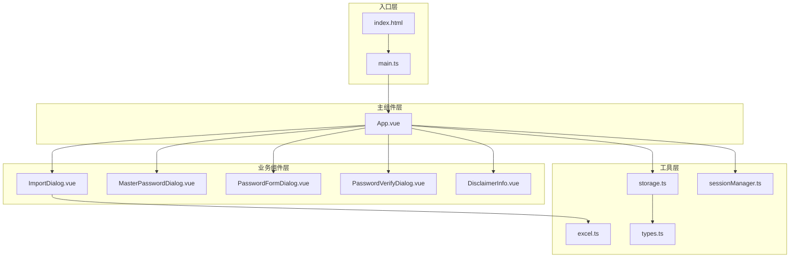
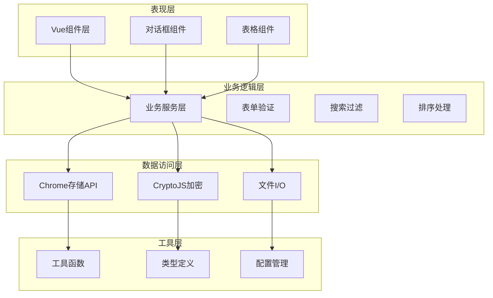
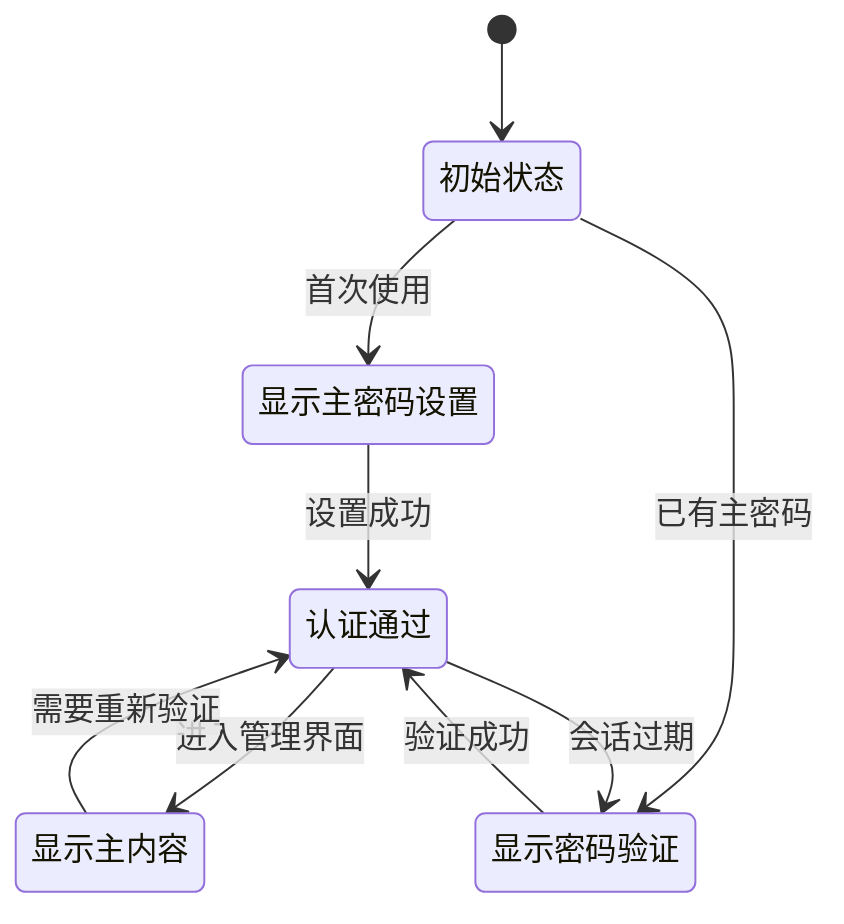
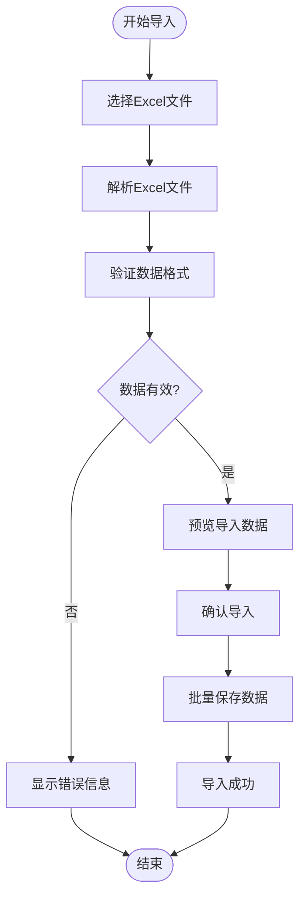
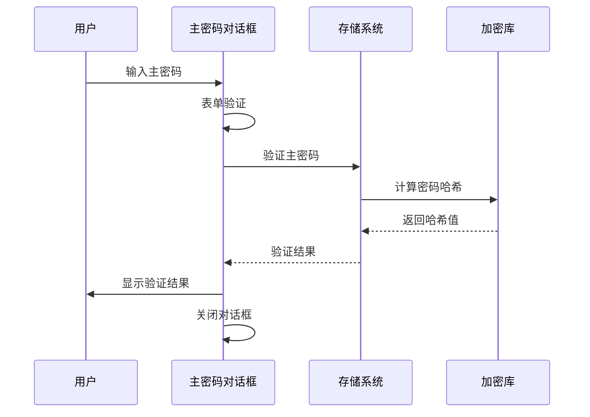
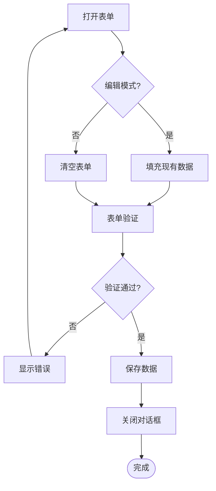
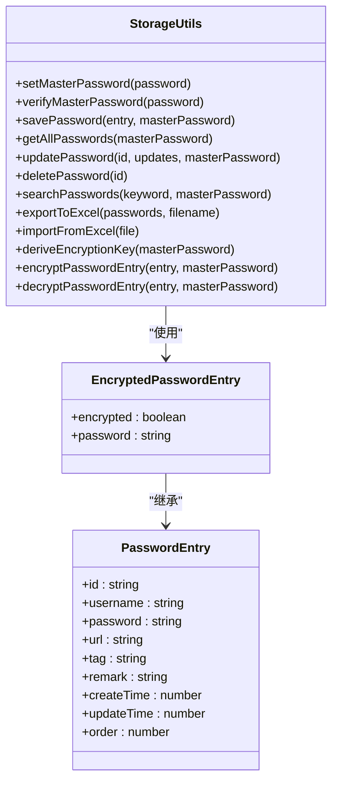
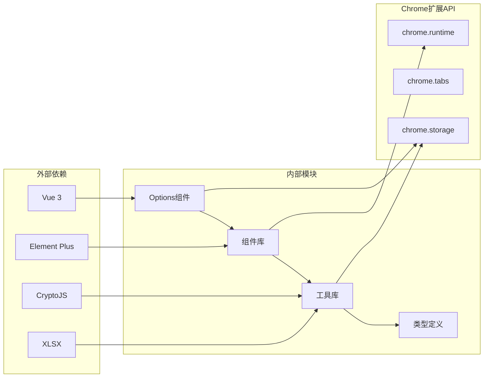

# Options界面

<cite>
**本文档引用的文件**
- [App.vue](file://entrypoints/options/App.vue)
- [main.ts](file://entrypoints/options/main.ts)
- [index.html](file://entrypoints/options/index.html)
- [ImportDialog.vue](file://components/ImportDialog.vue)
- [MasterPasswordDialog.vue](file://components/MasterPasswordDialog.vue)
- [PasswordFormDialog.vue](file://components/PasswordFormDialog.vue)
- [PasswordVerifyDialog.vue](file://components/PasswordVerifyDialog.vue)
- [storage.ts](file://utils/storage.ts)
- [excel.ts](file://utils/excel.ts)
- [sessionManager.ts](file://utils/sessionManager.ts)
- [types.ts](file://utils/types.ts)
- [DisclaimerInfo.vue](file://components/DisclaimerInfo.vue)
- [package.json](file://package.json)
</cite>

## 目录
1. [简介](#简介)
2. [项目结构](#项目结构)
3. [核心组件](#核心组件)
4. [架构概览](#架构概览)
5. [详细组件分析](#详细组件分析)
6. [依赖关系分析](#依赖关系分析)
7. [性能考虑](#性能考虑)
8. [故障排除指南](#故障排除指南)
9. [结论](#结论)

## 简介

Account Password Helper的Options界面是一个功能完整的Chrome扩展设置页面，专为密码管理而设计。该界面采用现代化的Vue 3 + TypeScript架构，结合Element Plus组件库，提供了安全、直观的密码管理体验。系统支持主密码设置与验证、密码条目管理、Excel数据导入导出、以及完整的数据持久化机制。

## 项目结构

Options界面采用模块化的Vue单文件组件架构，主要由以下层次组成：

**图表来源**
- [index.html](file://entrypoints/options/index.html#L1-L19)
- [main.ts](file://entrypoints/options/main.ts#L1-L11)
- [App.vue](file://entrypoints/options/App.vue#L1-L800)

**章节来源**
- [index.html](file://entrypoints/options/index.html#L1-L19)
- [main.ts](file://entrypoints/options/main.ts#L1-L11)

## 核心组件

Options界面的核心组件包括三个主要状态页面和多个交互组件：

### 主要状态页面

1. **主密码设置页面** - 首次使用时引导用户设置主密码
2. **主密码验证页面** - 日常使用时验证主密码有效性
3. **主内容区域** - 包含密码管理的完整功能界面

### 交互组件

1. **导入Excel对话框** - 支持批量数据导入
2. **密码表单对话框** - 添加和编辑密码条目
3. **主密码对话框** - 首次设置和验证主密码
4. **密码验证对话框** - 验证主密码并提供调试功能

**章节来源**
- [App.vue](file://entrypoints/options/App.vue#L1-L800)
- [ImportDialog.vue](file://components/ImportDialog.vue#L1-L343)
- [MasterPasswordDialog.vue](file://components/MasterPasswordDialog.vue#L1-L447)

## 架构概览

Options界面采用分层架构设计，实现了清晰的关注点分离：

**图表来源**
- [App.vue](file://entrypoints/options/App.vue#L777-L800)
- [storage.ts](file://utils/storage.ts#L37-L800)
- [excel.ts](file://utils/excel.ts#L4-L155)

## 详细组件分析

### App.vue - 主组件设计

App.vue作为Options界面的核心，采用了条件渲染和状态管理相结合的设计模式：

#### 状态管理架构

**图表来源**
- [App.vue](file://entrypoints/options/App.vue#L1-L800)

#### 核心功能模块

1. **主密码管理系统**
   - 主密码设置与验证
   - 会话状态管理
   - 密码有效期配置

2. **密码条目管理**
   - 增删改查操作
   - 搜索过滤功能
   - 排序和分页

3. **Excel数据处理**
   - 数据导入导出
   - 模板下载
   - 批量操作支持

**章节来源**
- [App.vue](file://entrypoints/options/App.vue#L1-L800)

### ImportDialog.vue - Excel导入系统

ImportDialog提供了完整的Excel数据导入解决方案：

#### 导入流程设计

**图表来源**
- [ImportDialog.vue](file://components/ImportDialog.vue#L146-L205)

#### 关键特性

1. **多列名支持** - 支持中文和英文列名
2. **数据验证** - 自动过滤无效数据
3. **批量处理** - 高效处理大量数据
4. **预览功能** - 导入前数据预览

**章节来源**
- [ImportDialog.vue](file://components/ImportDialog.vue#L1-L343)

### MasterPasswordDialog.vue - 主密码安全系统

MasterPasswordDialog实现了严格的安全验证机制：

#### 安全验证流程

**图表来源**
- [MasterPasswordDialog.vue](file://components/MasterPasswordDialog.vue#L177-L237)

#### 安全特性

1. **密码哈希** - 使用MD5算法加盐哈希
2. **会话管理** - 支持有效期配置
3. **错误处理** - 安全的错误信息显示
4. **防重放攻击** - 防止重复验证

**章节来源**
- [MasterPasswordDialog.vue](file://components/MasterPasswordDialog.vue#L1-L447)

### PasswordFormDialog.vue - 密码表单管理

PasswordFormDialog提供了灵活的密码条目编辑功能：

#### 表单处理流程

**图表来源**
- [PasswordFormDialog.vue](file://components/PasswordFormDialog.vue#L158-L199)

**章节来源**
- [PasswordFormDialog.vue](file://components/PasswordFormDialog.vue#L1-L336)

### storage.ts - 数据持久化系统

storage.ts实现了完整的数据存储和管理功能：

#### 数据存储架构

**图表来源**
- [storage.ts](file://utils/storage.ts#L37-L800)

#### 核心功能

1. **加密存储** - 使用AES-256-CBC加密
2. **数据完整性** - 支持数据校验和恢复
3. **批量操作** - 高效的批量数据处理
4. **排序配置** - 支持自定义排序规则

**章节来源**
- [storage.ts](file://utils/storage.ts#L1-L981)

### excel.ts - Excel数据处理

excel.ts提供了完整的Excel文件处理能力：

#### 文件处理流程

**图表来源**
- [excel.ts](file://utils/excel.ts#L50-L114)

**章节来源**
- [excel.ts](file://utils/excel.ts#L1-L155)

## 依赖关系分析

Options界面的依赖关系体现了清晰的模块化设计：

**图表来源**
- [package.json](file://package.json#L22-L47)
- [App.vue](file://entrypoints/options/App.vue#L794-L798)

**章节来源**
- [package.json](file://package.json#L1-L49)

## 性能考虑

Options界面在设计时充分考虑了性能优化：

### 内存管理策略

1. **懒加载机制** - 仅在需要时加载数据
2. **虚拟滚动** - 大数据集时使用虚拟滚动
3. **缓存策略** - 会话级别的数据缓存
4. **垃圾回收** - 及时清理不再使用的资源

### 数据处理优化

1. **批量操作** - Excel导入使用批量处理
2. **增量更新** - 支持增量数据更新
3. **索引优化** - 关键字段建立索引
4. **压缩存储** - 大数据时启用压缩

### 用户体验优化

1. **响应式设计** - 适配不同屏幕尺寸
2. **加载状态** - 明确的操作反馈
3. **错误处理** - 友好的错误提示
4. **离线支持** - 本地数据缓存

## 故障排除指南

### 常见问题及解决方案

#### 主密码相关问题

1. **主密码设置失败**
   - 检查密码强度要求
   - 确认浏览器存储权限
   - 验证磁盘空间充足

2. **主密码验证失败**
   - 检查输入的密码是否正确
   - 确认会话是否过期
   - 查看浏览器控制台错误信息

#### 数据导入导出问题

1. **Excel文件导入失败**
   - 确认文件格式正确
   - 检查文件是否被其他程序占用
   - 验证文件大小限制

2. **数据导出异常**
   - 检查浏览器兼容性
   - 确认有足够的存储空间
   - 验证数据格式正确性

#### 性能问题

1. **界面响应缓慢**
   - 清理浏览器缓存
   - 关闭不必要的标签页
   - 检查系统资源使用情况

2. **数据同步延迟**
   - 检查网络连接状态
   - 验证Chrome扩展权限
   - 重启浏览器扩展

**章节来源**
- [MasterPasswordDialog.vue](file://components/MasterPasswordDialog.vue#L177-L237)
- [ImportDialog.vue](file://components/ImportDialog.vue#L146-L205)

## 结论

Account Password Helper的Options界面展现了现代Chrome扩展开发的最佳实践。通过合理的架构设计、完善的功能实现和严格的用户体验考虑，该界面为用户提供了安全、高效、易用的密码管理解决方案。

### 设计亮点

1. **安全性优先** - 采用多重加密和验证机制
2. **用户体验优秀** - 直观的界面设计和流畅的操作体验
3. **功能完整** - 覆盖密码管理的各个方面
4. **可维护性强** - 清晰的代码结构和完善的文档

### 技术优势

1. **现代化技术栈** - Vue 3 + TypeScript + Element Plus
2. **模块化设计** - 良好的关注点分离
3. **性能优化** - 多层次的性能考虑
4. **扩展性强** - 易于功能扩展和维护

该Options界面不仅满足了当前的功能需求，还为未来的功能扩展奠定了坚实的基础，是Chrome扩展开发的优秀范例。