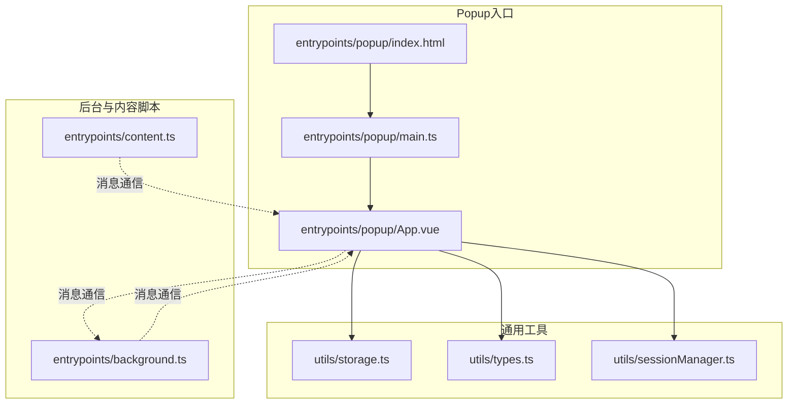
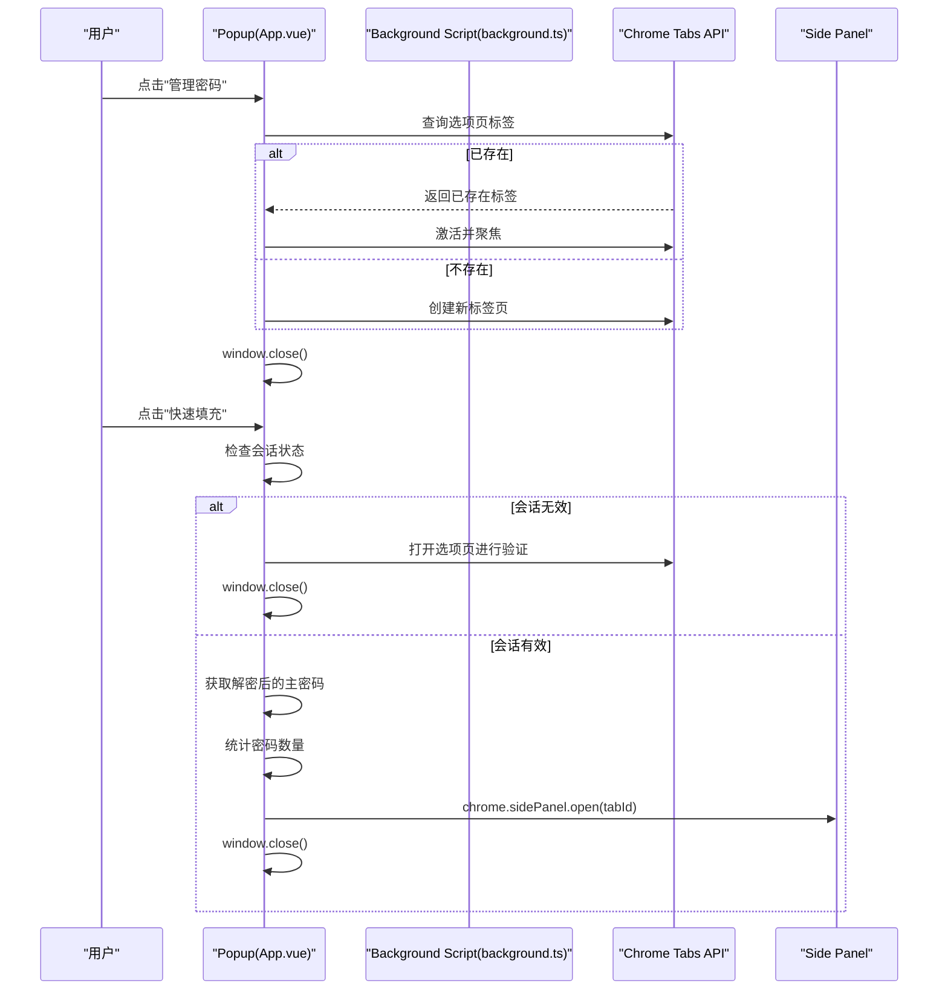
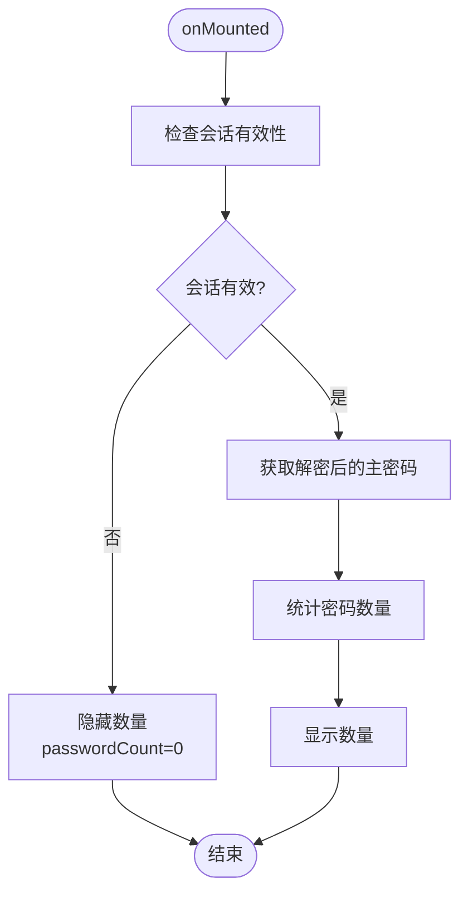
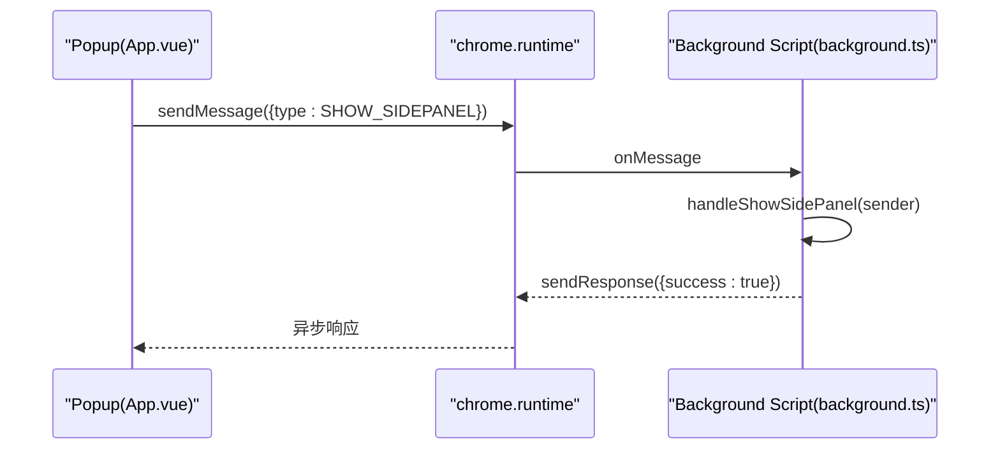
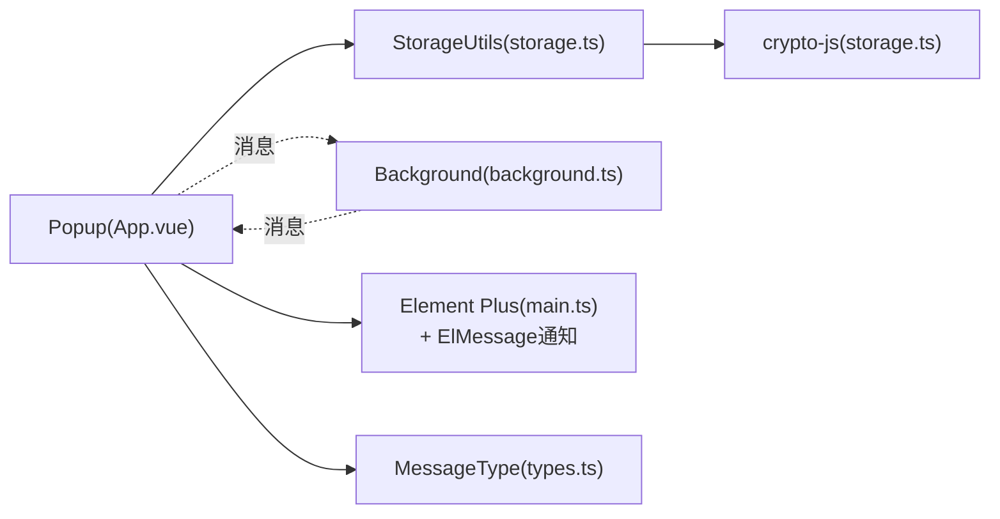

# Popup界面

<cite>
**本文引用的文件**
- [App.vue](file://entrypoints/popup/App.vue)
- [main.ts](file://entrypoints/popup/main.ts)
- [index.html](file://entrypoints/popup/index.html)
- [background.ts](file://entrypoints/background.ts)
- [storage.ts](file://utils/storage.ts)
- [types.ts](file://utils/types.ts)
- [sessionManager.ts](file://utils/sessionManager.ts)
- [content.ts](file://entrypoints/content.ts)
- [wxt.config.ts](file://wxt.config.ts)
- [package.json](file://package.json)
- [README.md](file://README.md)
</cite>

## 更新摘要
**变更内容**
- 更新了Popup界面的会话状态检查逻辑：在会话有效时直接获取解密后的主密码，优化了密码数量获取流程
- 增强了初始化性能：通过直接获取解密后的主密码，减少了不必要的数据解密步骤
- 优化了错误处理机制：在会话无效时静默处理并隐藏密码数量，避免泄露敏感信息
- 保持了原有的多层回退机制、通知系统集成和错误处理机制

## 目录
1. [简介](#简介)
2. [项目结构](#项目结构)
3. [核心组件](#核心组件)
4. [架构总览](#架构总览)
5. [详细组件分析](#详细组件分析)
6. [依赖关系分析](#依赖关系分析)
7. [性能考量](#性能考量)
8. [故障排查指南](#故障排查指南)
9. [结论](#结论)
10. [附录](#附录)

## 简介
本文件聚焦于Account Password Helper插件的Popup界面，系统性阐述其设计理念、用户交互流程、Vue组件架构、生命周期与状态管理、与Background Script的通信机制、在Chrome扩展中的特殊注意事项（组件加载、样式隔离、事件处理）、用户体验设计原则（布局优化、响应速度、错误处理），以及最佳实践与常见问题解决方案。Popup作为用户最直接的入口，承担"快速访问""基本操作""临时任务处理"的功能定位，是连接用户与后台数据与服务的关键枢纽。

## 项目结构
Popup位于独立的入口目录中，采用Vue 3 + TypeScript + Element Plus的现代前端技术栈，结合WXT构建工具链，实现模块化、可维护的扩展界面。



**图表来源**
- [index.html](file://entrypoints/popup/index.html#L1-L19)
- [main.ts](file://entrypoints/popup/main.ts#L1-L10)
- [App.vue](file://entrypoints/popup/App.vue#L1-L264)
- [storage.ts](file://utils/storage.ts#L1-L1217)
- [types.ts](file://utils/types.ts#L1-L172)
- [sessionManager.ts](file://utils/sessionManager.ts#L1-L87)
- [background.ts](file://entrypoints/background.ts#L1-L351)
- [content.ts](file://entrypoints/content.ts#L1-L1892)

**章节来源**
- [index.html](file://entrypoints/popup/index.html#L1-L19)
- [main.ts](file://entrypoints/popup/main.ts#L1-L10)
- [App.vue](file://entrypoints/popup/App.vue#L1-L264)

## 核心组件
- **Popup主组件**：负责渲染头部、主要操作按钮、快速动作区、联系方式等；在挂载阶段执行会话校验与密码数量统计；提供打开选项页、打开侧边栏、邮件链接处理等交互。
- **应用启动器**：在HTML中挂载Vue应用，引入Element Plus主题样式，保证UI一致性。
- **通信层**：通过Chrome扩展消息API与Background Script交互，实现侧边栏开关、URL变更通知等。
- **通知系统**：集成Element Plus的ElMessage，提供用户友好的错误提示和操作反馈。

**章节来源**
- [App.vue](file://entrypoints/popup/App.vue#L1-L264)
- [main.ts](file://entrypoints/popup/main.ts#L1-L10)

## 架构总览
Popup与Background Script之间的消息协议基于统一的Message与MessageType枚举，实现"显示/隐藏侧边栏""URL变化"等跨进程通信。Popup在初始化时检查会话有效性，决定是否展示密码数量；在用户点击按钮时，通过Chrome Tabs API打开选项页或侧边栏，并在必要时关闭自身。

**更新** 实现了优化的会话状态检查逻辑，在会话有效时直接获取解密后的主密码，避免不必要的数据解密步骤。



**图表来源**
- [App.vue](file://entrypoints/popup/App.vue#L129-L187)
- [background.ts](file://entrypoints/background.ts#L33-L73)
- [background.ts](file://entrypoints/background.ts#L75-L139)

**章节来源**
- [App.vue](file://entrypoints/popup/App.vue#L59-L90)
- [background.ts](file://entrypoints/background.ts#L33-L73)

## 详细组件分析

### Popup主组件（App.vue）
- **设计理念**
  - 简洁直观：顶部Logo与标题，中部主按钮"管理密码"，底部快速动作"快速填充"，联系方式区提供反馈入口。
  - 会话感知：仅在会话有效时展示密码数量，避免未授权访问。
  - 低耦合：与Background Script通过消息通信，不直接依赖内容脚本。
  - **优化的会话检查**：在会话有效时直接获取解密后的主密码，优化性能。
  - **多层回退机制**：实现三层回退策略确保侧边栏可靠打开。
  - **通知系统集成**：使用Element Plus ElMessage提供用户友好的反馈。
- **生命周期与状态管理**
  - onMounted：执行会话校验，读取主密码并统计密码数量，异常时静默处理并隐藏数量。
  - 事件处理：打开选项页、打开侧边栏、邮件链接点击。
- **用户交互流程**
  - "管理密码"：优先激活已存在的选项页标签，否则新建；随后关闭Popup。
  - "快速填充"：若会话有效，调用Background Script打开侧边栏；若会话无效，先引导至选项页进行验证。
  - **改进的错误处理**：通过ElMessage提供即时的用户反馈。
- **数据流**
  - 通过StorageUtils.isSessionValid与getAllPasswords获取数据，避免在Popup中直接暴露敏感数据。
- **错误处理**
  - 初始化失败时隐藏数量并记录日志；打开侧边栏失败时通过ElMessage提供用户提示。

**更新** 优化了会话状态检查逻辑，在会话有效时直接获取解密后的主密码，避免不必要的数据解密步骤，提升了初始化性能。

**更新** 实现了多层回退机制，包括直接调用、消息通信和手动提示三个层级，确保侧边栏能够可靠地打开。



**图表来源**
- [App.vue](file://entrypoints/popup/App.vue#L61-L92)
- [storage.ts](file://utils/storage.ts#L1105-L1117)

**章节来源**
- [App.vue](file://entrypoints/popup/App.vue#L51-L199)
- [storage.ts](file://utils/storage.ts#L1105-L1117)

### 应用启动器（main.ts）
- **职责**
  - 创建Vue应用实例，注册Element Plus，挂载到#app。
- **特殊考虑**
  - 在Chrome扩展中，Element Plus样式需显式引入，避免UI缺失。
  - 采用模块化脚本加载，符合WXT规范。

**章节来源**
- [main.ts](file://entrypoints/popup/main.ts#L1-L10)

### HTML入口（index.html）
- **职责**
  - 提供最小化的DOM结构，加载main.ts模块。
- **特殊考虑**
  - 严格控制head元信息，确保Popup尺寸与样式稳定。

**章节来源**
- [index.html](file://entrypoints/popup/index.html#L1-L19)

### 与Background Script的通信（background.ts）
- **消息协议**
  - onMessage监听：SHOW_SIDEPANEL/HIDE_SIDEPANEL/URL_CHANGED等，返回异步响应。
  - openOptionsPage/toggleSidePanel：快捷键触发的常用操作。
- **侧边栏控制**
  - handleShowSidePanel：检查tabId与sidePanel API可用性，启用并打开侧边栏。
  - handleHideSidePanel：尝试关闭侧边栏（当前版本限制，通过其他方式"hack"实现）。
- **URL变化处理**
  - handleUrlChanged：接收URL变化消息，可扩展为侧边栏联动逻辑。

**更新** 改进了错误处理机制，增加了详细的错误日志记录和用户友好的错误提示。



**图表来源**
- [App.vue](file://entrypoints/popup/App.vue#L155-L162)
- [background.ts](file://entrypoints/background.ts#L33-L73)
- [background.ts](file://entrypoints/background.ts#L75-L139)

**章节来源**
- [background.ts](file://entrypoints/background.ts#L33-L73)
- [types.ts](file://utils/types.ts#L54-L115)

### 会话与存储（storage.ts、sessionManager.ts）
- **会话管理**
  - StorageUtils.isSessionValid：综合检查会话主密码与有效期。
  - sessionManager：每分钟轮询检查会话状态，过期时触发自定义事件并清理会话。
  - **优化的会话检查**：在会话有效时直接获取解密后的主密码，避免不必要的数据解密步骤。
- **存储策略**
  - 主密码配置、密码条目、排序配置、会话状态均通过chrome.storage.local持久化。
  - 密码条目支持加密存储与解密读取，确保敏感数据安全。

**更新** 增强了会话状态检查的性能优化，在会话有效时直接获取解密后的主密码。

**章节来源**
- [storage.ts](file://utils/storage.ts#L816-L864)
- [sessionManager.ts](file://utils/sessionManager.ts#L27-L66)

### 内容脚本（content.ts）
- **与Popup的间接关系**
  - Popup不直接与content.ts通信；Popup通过Background Script与content.ts协作（例如侧边栏打开后由content脚本检测表单并填充）。
- **作用边界**
  - content.ts专注于页面内表单检测与填充，与Popup的职责互补。

**章节来源**
- [content.ts](file://entrypoints/content.ts#L1-L1892)

## 依赖关系分析
- **组件耦合**
  - Popup与StorageUtils高内聚，负责数据读取与会话校验。
  - Popup与Background Script通过消息API弱耦合，职责清晰。
- **外部依赖**
  - Element Plus：提供UI组件与样式，包括ElMessage通知系统。
  - crypto-js：用于主密码哈希与数据加解密。
  - WXT：构建与打包，提供Vue模块支持与别名配置。

**更新** 集成了Element Plus的ElMessage通知系统，增强了用户体验。



**图表来源**
- [App.vue](file://entrypoints/popup/App.vue#L51-L199)
- [storage.ts](file://utils/storage.ts#L1-L1217)
- [background.ts](file://entrypoints/background.ts#L1-L351)
- [types.ts](file://utils/types.ts#L54-L115)

**章节来源**
- [package.json](file://package.json#L22-L47)
- [wxt.config.ts](file://wxt.config.ts#L1-L48)

## 性能考量
- **初始化性能**
  - Popup仅在挂载时进行一次会话校验与数据统计，避免阻塞主线程。
  - **优化的会话检查**：在会话有效时直接获取解密后的主密码，避免不必要的数据解密步骤。
  - 使用异步消息与Promise处理后台操作，避免同步等待。
- **交互响应**
  - 打开选项页与侧边栏采用标签页复用策略，减少重复创建。
  - 侧边栏打开后由content脚本负责页面内交互，Popup保持轻量。
- **样式与资源**
  - Element Plus样式按需引入，避免冗余体积。
  - HTML最小化，仅保留必要的模块加载脚本。
- **错误处理性能**
  - 多层回退机制确保操作的可靠性，避免因单一失败导致整个流程中断。

**更新** 通过优化会话状态检查逻辑，显著提升了Popup的初始化性能。

**更新** 多层回退机制虽然增加了错误处理的复杂性，但显著提高了系统的可靠性。

## 故障排查指南
- **Popup无法显示密码数量**
  - 检查会话是否有效；若无效，先在选项页验证主密码。
- **打开侧边栏失败**
  - 确认Chrome版本支持sidePanel API；检查tabId是否有效；查看Background Script日志。
  - **多层回退机制**：如果直接调用失败，系统会自动尝试通过消息通信；如果仍失败，会通过ElMessage提示用户手动打开。
- **打开选项页失败**
  - 检查chrome.tabs权限与URL匹配；确认标签页是否被其他窗口遮挡。
- **邮件链接无法唤起客户端**
  - 确认mailto协议可用；在部分系统中需配置默认邮件客户端。
- **ElMessage通知不显示**
  - 确认Element Plus已正确引入；检查浏览器控制台是否有相关错误。

**更新** 新增了多层回退机制和ElMessage通知系统的故障排查指南。

**章节来源**
- [App.vue](file://entrypoints/popup/App.vue#L129-L187)
- [background.ts](file://entrypoints/background.ts#L75-L139)
- [README.md](file://README.md#L174-L195)

## 结论
Popup界面以简洁、安全、高效为核心目标，通过会话感知与消息通信实现与后台的无缝协作。其Vue组件架构清晰、生命周期管理合理、错误处理稳健，配合WXT构建工具与Element Plus UI，为用户提供流畅的初始体验。

**更新** 通过实现优化的会话状态检查逻辑和多层回退机制，显著提升了系统的性能和可靠性。标题更新为"账号密码管理助手"，保持了与扩展功能命名的一致性。建议在后续迭代中进一步完善错误提示的国际化支持和用户自定义配置选项。

## 附录

### Vue 3在Chrome扩展中的特殊考虑
- **组件加载**
  - 通过HTML中的模块脚本加载main.ts，再由main.ts创建并挂载Vue应用。
- **样式隔离**
  - Element Plus样式需显式引入，避免UI缺失；scoped样式在扩展环境中表现稳定。
- **事件处理**
  - 使用Chrome扩展API（tabs、runtime、storage）时，注意异步回调与错误捕获。
- **通知系统集成**
  - Element Plus的ElMessage提供了统一的用户反馈机制，支持多种消息类型。

**更新** 新增了Element Plus通知系统的集成考虑。

**章节来源**
- [index.html](file://entrypoints/popup/index.html#L12-L16)
- [main.ts](file://entrypoints/popup/main.ts#L1-L10)

### 最佳实践与常见问题
- **最佳实践**
  - 会话校验前置：在Popup挂载时尽早检查会话状态。
  - 标签页复用：优先激活已存在的选项页或侧边栏标签，避免重复创建。
  - **优化的会话检查**：在会话有效时直接获取解密后的主密码，提升性能。
  - **多层回退机制**：实现可靠的侧边栏打开策略，确保用户体验。
  - **错误静默**：对非关键错误进行静默处理，避免影响用户体验。
  - **权限最小化**：仅申请必要权限，遵循扩展安全规范。
  - **通知系统**：使用ElMessage提供一致的用户反馈。
- **常见问题**
  - 会话过期：通过sessionManager定时检查与事件分发，及时清理会话状态。
  - 侧边栏不可用：检查Chrome版本与sidePanel API可用性。
  - 数据安全：主密码采用哈希与PBKDF2派生密钥，密码条目支持AES加密存储。
  - **多层回退机制**：理解三层回退策略的工作原理和适用场景。

**更新** 新增了优化会话检查和多层回退机制的最佳实践指导。

**章节来源**
- [sessionManager.ts](file://utils/sessionManager.ts#L27-L66)
- [storage.ts](file://utils/storage.ts#L164-L186)
- [README.md](file://README.md#L151-L201)

### 优化的会话状态检查机制
**更新** 新增了优化会话状态检查机制的技术实现说明。

Popup中的会话状态检查逻辑经过优化，实现了更高效的性能：

1. **会话有效性检查**
   - 使用StorageUtils.isSessionValid()检查会话状态
   - 在会话有效时直接获取解密后的主密码，避免不必要的数据解密步骤

2. **解密后的主密码获取**
   - 使用StorageUtils.getSessionMasterPasswordDecrypted()直接获取解密后的主密码
   - 避免在Popup中直接暴露加密的主密码

3. **密码数量统计优化**
   - 在会话有效时，直接使用解密后的主密码统计密码数量
   - 避免重复的解密操作，提升初始化性能

4. **错误处理优化**
   - 会话无效时静默处理并隐藏密码数量
   - 避免泄露任何敏感信息

这种优化确保了Popup界面在会话有效时能够快速获取所需数据，同时在会话无效时保持安全性和隐私保护。

**章节来源**
- [App.vue](file://entrypoints/popup/App.vue#L61-L92)
- [storage.ts](file://utils/storage.ts#L1105-L1117)

### 多层回退机制详解
**更新** 新增了多层回退机制的技术实现说明。

Popup中的openSidePanel函数实现了三层回退机制：

1. **第一层：直接调用**
   - 直接使用`chrome.sidePanel.open({ tabId: tab.id })`尝试打开侧边栏
   - 这在用户手势上下文中通常是最可靠的方式

2. **第二层：消息通信**
   - 如果直接调用失败，通过`chrome.runtime.sendMessage()`发送SHOW_SIDEPANEL消息给Background Script
   - Background Script在handleShowSidePanel中处理并打开侧边栏

3. **第三层：手动提示**
   - 如果前两层都失败，使用`alert()`提示用户手动打开侧边栏
   - 提供清晰的用户指导和操作建议

这种设计确保了即使在某些环境下侧边栏无法自动打开，用户也能得到适当的反馈和替代方案。

**章节来源**
- [App.vue](file://entrypoints/popup/App.vue#L129-L187)
- [background.ts](file://entrypoints/background.ts#L75-L139)

### 键盘快捷键配置
**更新** 新增了键盘快捷键配置的详细说明。

插件支持以下快捷键操作，已在manifest配置中定义：

- **Ctrl+Shift+P** (Mac: Cmd+Shift+P)：打开账号密码管理选项页面
- **Ctrl+Shift+L** (Mac: Cmd+Shift+L)：打开/关闭密码快速填充侧边栏

这些快捷键通过WXT的commands配置实现，描述信息明确反映了新的功能范围，从简单的"密码管理"扩展为"账号密码管理"。

**章节来源**
- [wxt.config.ts](file://wxt.config.ts#L24-L40)
- [README.md](file://README.md#L111-L116)

### 标题命名一致性
**更新** 新增了标题命名一致性的说明。

插件的标题命名在不同文件中保持了一致性：

- **扩展清单**：`Account Password Helper`（主名称）
- **扩展描述**：`账号密码管理助手 - 自动填充和保存账号密码`
- **Popup界面**：`账号密码管理助手`（当前已更新）
- **选项页面**：`账号密码管理助手`（已更新）
- **SidePanel界面**：`账号密码管理助手`（已更新）
- **README文档**：`# Account Password Helper - 账号密码管理助手`

这种一致性确保了用户在不同界面中都能获得统一的品牌认知。

**章节来源**
- [wxt.config.ts](file://wxt.config.ts#L18-L21)
- [App.vue](file://entrypoints/popup/App.vue#L4-L5)
- [README.md](file://README.md#L0)

### 邮件反馈主题更新
**更新** 新增了邮件反馈主题变更的说明。

在Popup界面中，邮件反馈主题已从"密码管理助手反馈"更新为"账号密码管理助手反馈"，确保与整体品牌命名保持一致。这一变更体现在handleEmailClick方法中：

```javascript
const subject = '账号密码管理助手反馈';
const mailtoLink = `mailto:${email}?subject=${encodeURIComponent(subject)}`;
```

这种一致性不仅体现在界面标题上，也体现在用户反馈渠道中，增强了品牌的统一性和专业性。

**章节来源**
- [App.vue](file://entrypoints/popup/App.vue#L183-L192)