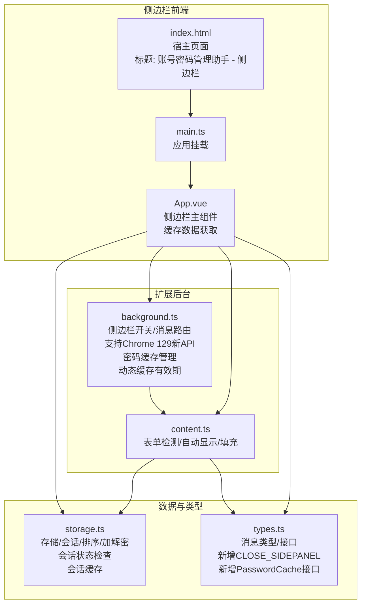
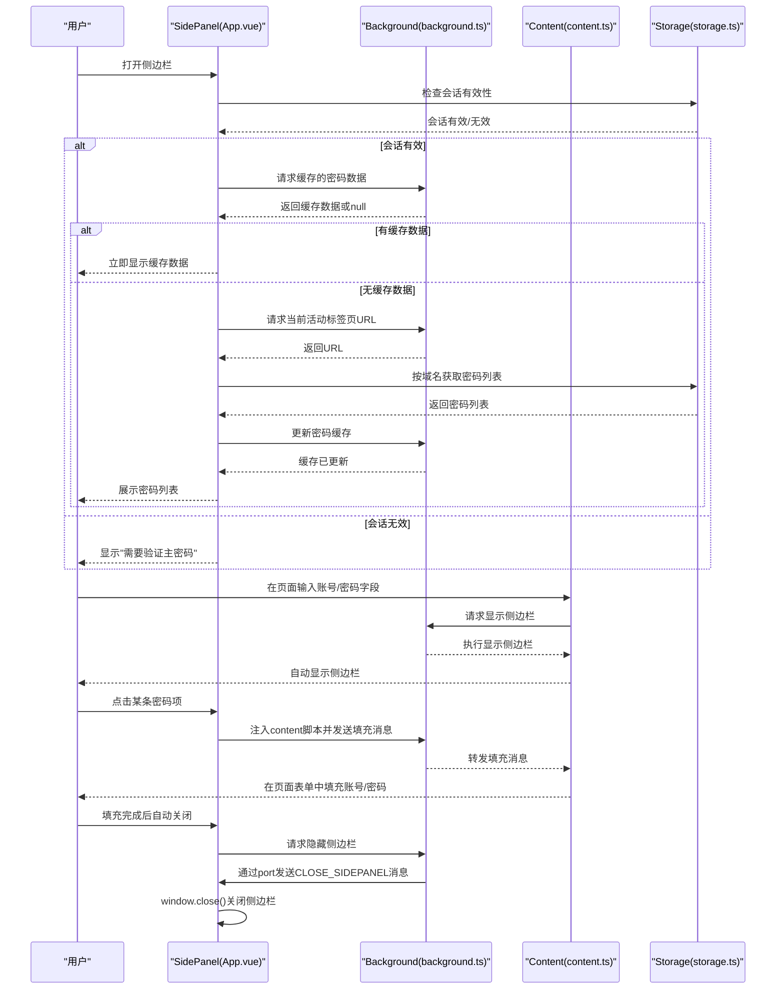
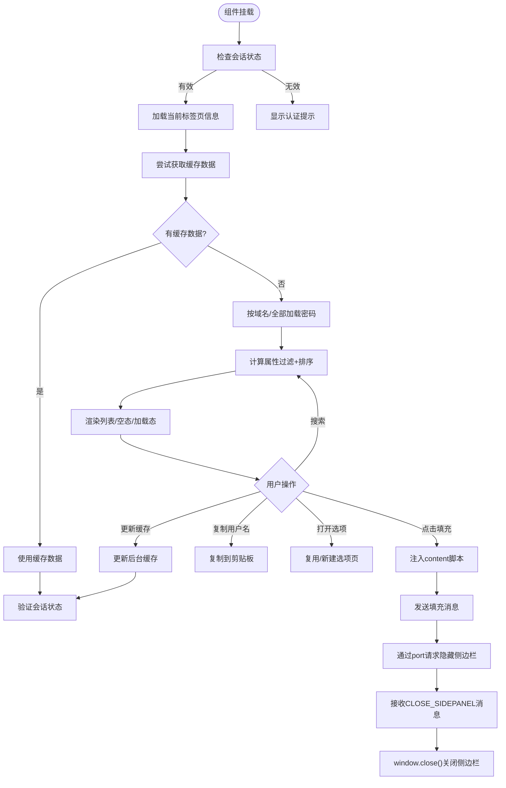
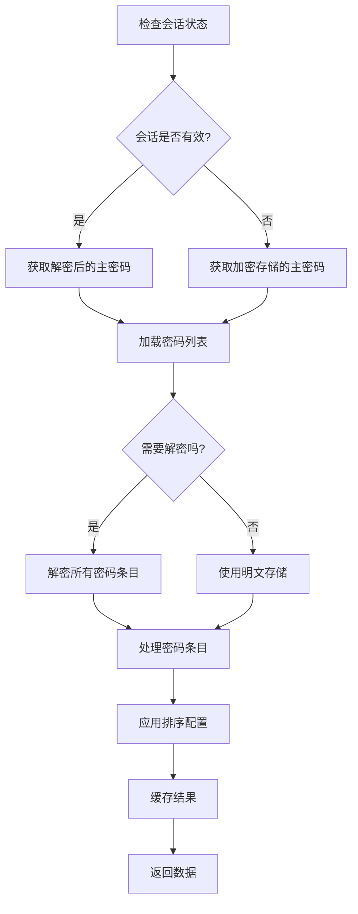
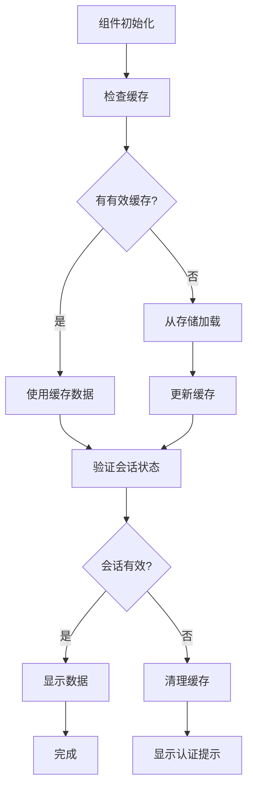
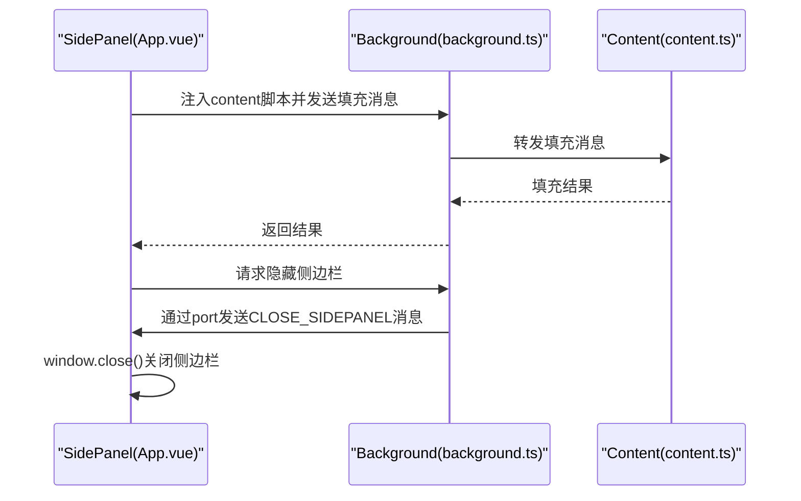
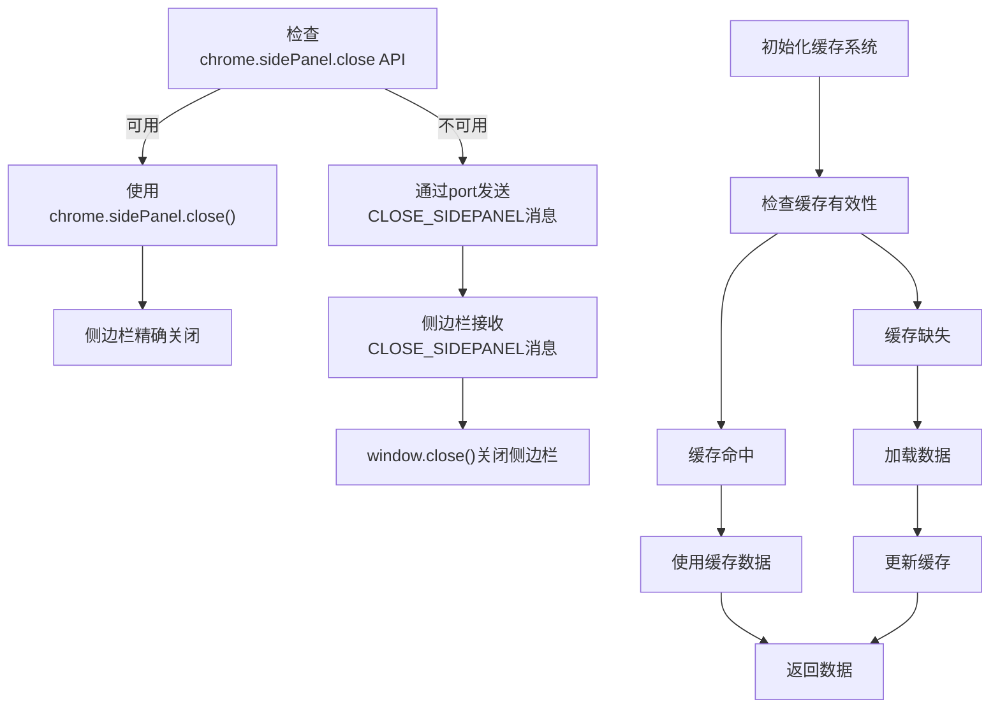
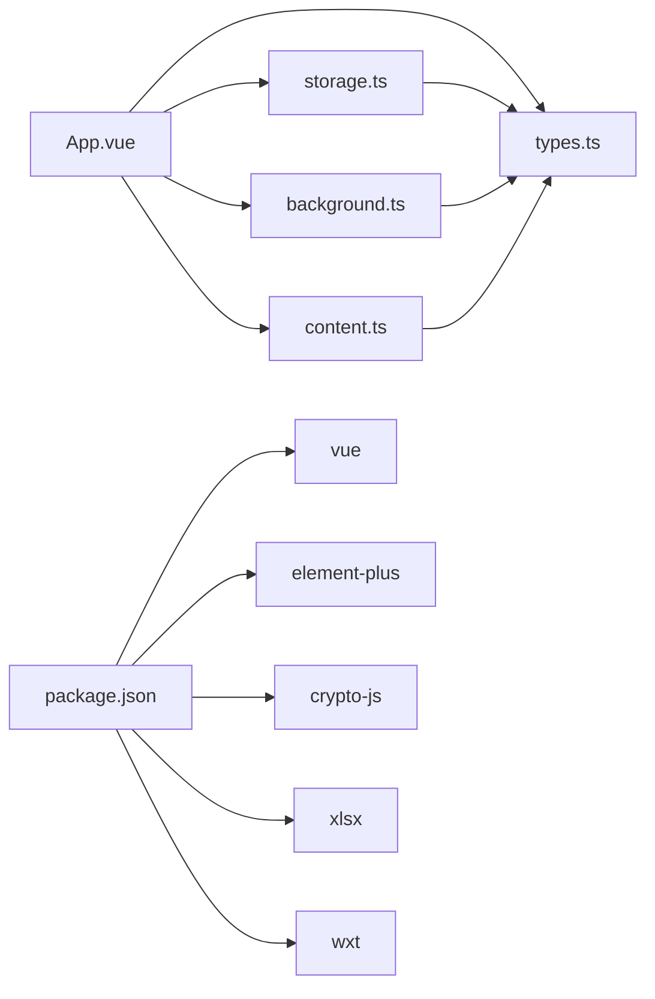

# 侧边栏界面

<cite>
**本文档引用的文件**
- [App.vue](file://entrypoints/sidepanel/App.vue)
- [main.ts](file://entrypoints/sidepanel/main.ts)
- [index.html](file://entrypoints/sidepanel/index.html)
- [content.ts](file://entrypoints/content.ts)
- [background.ts](file://entrypoints/background.ts)
- [types.ts](file://utils/types.ts)
- [storage.ts](file://utils/storage.ts)
- [popup/App.vue](file://entrypoints/popup/App.vue)
- [options/App.vue](file://entrypoints/options/App.vue)
- [README.md](file://README.md)
- [package.json](file://package.json)
- [wxt.config.ts](file://wxt.config.ts)
</cite>

## 更新摘要
**变更内容**
- 密码缓存系统完全重构：从固定5分钟缓存改为基于会话有效期的动态缓存
- 新增缓存消息类型：GET_CACHED_PASSWORDS、UPDATE_PASSWORD_CACHE、INVALIDATE_PASSWORD_CACHE
- 新增PasswordCache接口：支持密码列表、域名、时间戳和认证状态的缓存
- 侧边栏初始化流程优化：优先尝试从后台获取缓存数据，提供更快的用户体验
- 会话状态检查逻辑增强：优化了密码列表加载流程，根据会话有效性动态决定是否使用解密后的主密码
- 增强数据加载策略：在会话有效时使用解密后的主密码，在会话无效时使用加密存储的主密码
- 改进缓存机制：新增基于会话有效期的动态缓存，提升加载性能
- 优化会话管理：改进了会话创建、验证和清理流程，确保数据安全和性能平衡
- 增强错误处理：完善了会话状态检查和数据加载过程中的错误处理机制

## 目录
1. [简介](#简介)
2. [项目结构](#项目结构)
3. [核心组件](#核心组件)
4. [架构总览](#架构总览)
5. [详细组件分析](#详细组件分析)
6. [依赖关系分析](#依赖关系分析)
7. [性能考虑](#性能考虑)
8. [故障排查指南](#故障排查指南)
9. [结论](#结论)
10. [附录](#附录)

## 简介
本文件面向 Account Password Helper 插件的"侧边栏界面"（Side Panel），系统性阐述其设计目标、Vue 组件架构、响应式布局与状态管理、核心功能（密码搜索、快速填充、实时数据展示）、与 Content Script 的数据交互机制、用户体验优化策略、Chrome 侧边栏 API 使用指南（含兼容性与降级方案）、性能优化策略（懒加载、虚拟滚动、内存管理）以及开发最佳实践与调试技巧。文档严格基于仓库现有源码进行分析与总结，避免臆测。

**更新** 应用已完成品牌重塑，现使用"账号密码管理助手"作为正式品牌名称，确保所有界面元素的一致性和专业性。侧边栏界面已全面支持Chrome 129新sidePanel API，包括`chrome.sidePanel.close()`精确关闭功能和向后兼容的降级方案。同时，侧边栏界面已简化可见性控制逻辑，移除了复杂的DOM操作和URL监控系统，采用了更简洁高效的实现方式。新增的会话状态检查逻辑显著优化了密码列表加载流程，提升了应用的安全性和性能表现。

**更新** 密码缓存系统已完全重构，从原有的固定5分钟缓存改为基于会话有效期的动态缓存。新增了GET_CACHED_PASSWORDS、UPDATE_PASSWORD_CACHE、INVALIDATE_PASSWORD_CACHE消息类型，以及PasswordCache接口。侧边栏初始化流程现在优先尝试从后台获取缓存数据，提供更快的用户体验。

## 项目结构
侧边栏入口位于 sidepanel 目录，采用 Vue 3 + Element Plus 构建，配合 WXT 打包与 Chrome Extension Manifest V3 规范运行。整体结构如下：
- sidepanel 主入口：App.vue（模板/逻辑/样式）、main.ts（应用挂载）、index.html（宿主页面）
- 背景页：background.ts（侧边栏开关控制、消息路由、新API支持、密码缓存管理）
- 内容脚本：content.ts（表单检测、自动显示侧边栏、填充策略）
- 数据层：storage.ts（主密码、会话、排序、加解密、存储、会话缓存）
- 类型定义：types.ts（消息类型、密码条目接口、PasswordCache接口）
- 其他入口：popup、options 等（与侧边栏协同）

**图表来源**
- [App.vue](file://entrypoints/sidepanel/App.vue#L1-L1008)
- [main.ts](file://entrypoints/sidepanel/main.ts#L1-L10)
- [index.html](file://entrypoints/sidepanel/index.html#L1-L19)
- [background.ts](file://entrypoints/background.ts#L1-L384)
- [content.ts](file://entrypoints/content.ts#L1-L1966)
- [storage.ts](file://utils/storage.ts#L1-L1217)
- [types.ts](file://utils/types.ts#L1-L172)

**章节来源**
- [App.vue](file://entrypoints/sidepanel/App.vue#L1-L1008)
- [main.ts](file://entrypoints/sidepanel/main.ts#L1-L10)
- [index.html](file://entrypoints/sidepanel/index.html#L1-L19)
- [background.ts](file://entrypoints/background.ts#L1-L384)
- [content.ts](file://entrypoints/content.ts#L1-L1966)
- [storage.ts](file://utils/storage.ts#L1-L1217)
- [types.ts](file://utils/types.ts#L1-L172)

## 核心组件
- 侧边栏主组件（App.vue）
  - 负责渲染头部（Logo、当前域名）、搜索框、认证状态提示、密码列表、底部操作区
  - 状态管理：加载态、搜索关键词、密码列表、当前域名、认证状态、显示控制
  - 功能：搜索过滤、排序、认证状态监听、URL变化处理、密码填充、复制用户名、打开选项页
  - **新增**：缓存数据获取、会话状态验证、缓存更新机制
- 应用入口（main.ts）
  - 创建 Vue 应用实例，注册 Element Plus，挂载到 #app
- 宿主页面（index.html）
  - 提供最小化 HTML 结构与模块入口脚本，标题为"账号密码管理助手 - 侧边栏"

**章节来源**
- [App.vue](file://entrypoints/sidepanel/App.vue#L1-L161)
- [main.ts](file://entrypoints/sidepanel/main.ts#L1-L10)
- [index.html](file://entrypoints/sidepanel/index.html#L1-L19)

## 架构总览
侧边栏与内容脚本、后台页通过消息通信协作：
- 侧边栏启动时检查会话状态，加载当前标签页域名并尝试获取缓存数据
- 内容脚本检测登录表单，必要时自动显示侧边栏
- 填充密码时，侧边栏注入 content script 并向页面发送填充消息
- 后台页负责侧边栏开关（Chrome sidePanel API）与 URL 变化广播
- **新增**：Chrome 129支持`chrome.sidePanel.close()`精确关闭，降级时通过port通信让侧边栏自行关闭
- **新增**：基于会话有效期的动态密码缓存系统，显著提升加载性能

**图表来源**
- [App.vue](file://entrypoints/sidepanel/App.vue#L657-L751)
- [background.ts](file://entrypoints/background.ts#L168-L200)
- [content.ts](file://entrypoints/content.ts#L86-L91)
- [storage.ts](file://utils/storage.ts#L514-L576)

**章节来源**
- [App.vue](file://entrypoints/sidepanel/App.vue#L657-L751)
- [background.ts](file://entrypoints/background.ts#L168-L200)
- [content.ts](file://entrypoints/content.ts#L86-L91)
- [storage.ts](file://utils/storage.ts#L514-L576)

## 详细组件分析

### 侧边栏主组件（App.vue）架构
- 模板结构
  - 头部：Logo、标题、当前域名显示
  - 搜索区域：输入框绑定搜索关键词，clearable，前置图标
  - 认证状态：未认证时显示"需要验证主密码"，认证后显示密码列表
  - 密码列表：加载态、空态、列表项（用户名、标签、URL、备注、复制按钮、快速填充动作）
  - 底部：打开"密码管理"按钮
- 响应式与状态
  - 响应式数据：loading、searchKeyword、passwords、currentDomain、isAuthenticated、showSidepanel
  - 计算属性：filteredPasswords（大小写不敏感搜索 + 排序）
  - 监听器：会话变化、存储变化、页面可见性、标签页更新/激活、URL变化消息
- 业务流程
  - 初始化：检查会话、加载当前标签页、尝试获取缓存数据
  - 搜索：通过计算属性实时过滤
  - 填充：注入 content script，发送填充消息，成功后隐藏侧边栏
  - 复制：复制用户名到剪贴板
  - 打开选项：复用标签页或新建标签页
  - 标签颜色：基于标签内容的缓存映射
  - 排序：读取保存的排序配置，支持多字段升/降序
  - **新增**：缓存数据获取、会话状态验证、缓存更新机制

**更新** 可见性控制逻辑已简化：移除了复杂的DOM操作和URL监控系统，采用更简洁的方式管理侧边栏显示状态。通过showSidepanel响应式变量控制显示，结合后台页的消息通信实现更可靠的隐藏机制。新增port连接用于接收关闭消息，实现更精确的侧边栏控制。新增基于会话有效期的动态密码缓存系统，显著提升加载性能。

**图表来源**
- [App.vue](file://entrypoints/sidepanel/App.vue#L694-L784)
- [App.vue](file://entrypoints/sidepanel/App.vue#L657-L751)
- [App.vue](file://entrypoints/sidepanel/App.vue#L674-L692)

**章节来源**
- [App.vue](file://entrypoints/sidepanel/App.vue#L1-L1008)

### 会话状态检查与数据加载优化
- 会话状态检查
  - 通过 `StorageUtils.isSessionValid()` 检查会话有效性
  - 支持内存状态检查和存储恢复机制
  - 自动处理会话过期和清理
- 动态主密码加载策略
  - 会话有效时：使用解密后的主密码，支持明文存储以提升性能
  - 会话无效时：使用加密存储的主密码，确保数据安全
- 密码列表加载流程
  - 根据当前域名加载匹配的密码条目
  - 支持全部密码加载和域名过滤
  - 应用保存的排序配置进行排序

**更新** 新增的会话状态检查逻辑显著优化了密码列表加载流程。当会话有效时，应用会解密所有密码条目并以明文形式存储，大幅提升读取性能。当会话无效时，应用会使用加密存储的主密码进行解密，确保数据安全。这种动态策略在保证安全性的前提下最大化了性能表现。

**图表来源**
- [App.vue](file://entrypoints/sidepanel/App.vue#L313-L344)
- [storage.ts](file://utils/storage.ts#L816-L864)

**章节来源**
- [App.vue](file://entrypoints/sidepanel/App.vue#L313-L344)
- [storage.ts](file://utils/storage.ts#L816-L864)

### 基于会话有效期的动态密码缓存系统
- 缓存机制
  - **重构**：从固定5分钟缓存改为基于会话有效期的动态缓存
  - 缓存密码列表、域名和认证状态
  - **新增**：动态获取缓存有效期（与主密码会话有效期一致）
  - 自动失效和更新机制
- 缓存策略
  - 首次加载时检查缓存有效性
  - 缓存命中时立即显示数据
  - 缓存过期时重新加载
  - **新增**：域名匹配检查，确保缓存适用于当前域名
- 存储监听
  - 监听存储变化自动使缓存失效
  - 支持密码数据和会话相关变化
- **新增**：缓存消息类型
  - GET_CACHED_PASSWORDS：获取缓存的密码数据
  - UPDATE_PASSWORD_CACHE：更新密码缓存
  - INVALIDATE_PASSWORD_CACHE：使密码缓存失效

**更新** 新增的基于会话有效期的动态密码缓存系统显著提升了应用性能。通过与主密码会话有效期保持一致的缓存策略，侧边栏可以在会话有效期内避免重复加载和解密操作。缓存系统还支持自动失效和更新机制，确保数据的新鲜度和一致性。新增的缓存消息类型提供了完整的缓存管理能力。

**图表来源**
- [App.vue](file://entrypoints/sidepanel/App.vue#L728-L751)
- [background.ts](file://entrypoints/background.ts#L323-L347)

**章节来源**
- [App.vue](file://entrypoints/sidepanel/App.vue#L657-L692)
- [background.ts](file://entrypoints/background.ts#L323-L347)
- [types.ts](file://utils/types.ts#L152-L171)

### 侧边栏与 Content Script 的数据交互
- 表单上下文获取
  - 内容脚本检测页面中的账号/密码、手机号/验证码、登录按钮等字段
  - 使用 MutationObserver 与事件委托监听 DOM 变化与焦点事件，自动判断是否应在登录环境显示侧边栏
- 填充策略
  - 侧边栏点击某条密码项后，先注入 content script，再发送填充消息（账号+密码）
  - 填充成功后，通过后台页发送隐藏侧边栏的消息
- 消息类型
  - FILL_PASSWORD：填充账号/密码
  - SHOW_SIDEPANEL/HIDE_SIDEPANEL：显示/隐藏侧边栏
  - URL_CHANGED：URL 变化通知
  - **新增** CLOSE_SIDEPANEL：专门用于侧边栏关闭的消息类型
  - **新增** GET_CACHED_PASSWORDS：获取缓存的密码数据
  - **新增** UPDATE_PASSWORD_CACHE：更新密码缓存
  - **新增** INVALIDATE_PASSWORD_CACHE：使密码缓存失效

**图表来源**
- [App.vue](file://entrypoints/sidepanel/App.vue#L351-L431)
- [background.ts](file://entrypoints/background.ts#L168-L200)
- [content.ts](file://entrypoints/content.ts#L86-L91)
- [types.ts](file://utils/types.ts#L104-L114)

**章节来源**
- [App.vue](file://entrypoints/sidepanel/App.vue#L351-L431)
- [content.ts](file://entrypoints/content.ts#L1-L1966)
- [background.ts](file://entrypoints/background.ts#L168-L200)
- [types.ts](file://utils/types.ts#L104-L114)

### 侧边栏与后台页（Background）的集成
- 侧边栏开关
  - 通过 Chrome sidePanel API 打开/隐藏侧边栏
  - **新增** Chrome 129支持`chrome.sidePanel.close()`精确关闭API
  - **新增** 向后兼容降级方案：当新API不可用时，通过port通信让侧边栏自行关闭
- URL 变化
  - 标签页更新/激活时，后台页可关闭侧边栏或通知侧边栏更新
- 消息路由
  - 路由 SHOW_SIDEPANEL/HIDE_SIDEPANEL/URL_CHANGED/CLOSE_SIDEPANEL 等消息
  - **新增** 路由 GET_CACHED_PASSWORDS/UPDATE_PASSWORD_CACHE/INVALIDATE_PASSWORD_CACHE 消息
- **新增** 密码缓存管理
  - 基于会话有效期的动态缓存系统
  - 自动失效和更新机制
  - 存储监听和缓存清理
  - **新增** 动态缓存有效期（与主密码会话有效期一致）

**更新** 后台页已完全支持Chrome 129新sidePanel API，包括`chrome.sidePanel.close()`的精确关闭功能。同时实现了完善的降级方案：当`chrome.sidePanel.close()`不可用时，通过port连接向侧边栏发送`CLOSE_SIDEPANEL`消息，让侧边栏自行调用`window.close()`关闭。新增的基于会话有效期的动态密码缓存管理系统显著提升了应用性能。

**图表来源**
- [background.ts](file://entrypoints/background.ts#L212-L250)
- [background.ts](file://entrypoints/background.ts#L323-L368)

**章节来源**
- [background.ts](file://entrypoints/background.ts#L212-L250)
- [background.ts](file://entrypoints/background.ts#L323-L368)

### 数据层与状态管理
- 会话与认证
  - 会话有效期、加密存储会话主密码、过期自动清理
  - 会话有效时才允许加载密码列表
  - **新增** 会话状态检查逻辑，支持内存状态和存储恢复
  - **新增** 会话创建时解密所有密码条目，会话结束时重新加密
- 存储与排序
  - 支持按 username/url/tag/remark/createTime/updateTime 排序
  - 支持保存排序配置，重启后仍生效
- 加密与安全
  - 主密码使用 PBKDF2 派生密钥，AES-CBC 加密存储密码字段
  - 会话加密密钥基于主密码盐值派生，避免明文存储
  - **新增** 会话创建时解密所有密码条目，会话结束时重新加密
- **新增** 基于会话有效期的动态密码缓存系统
  - **重构**：从固定5分钟缓存改为基于会话有效期的动态缓存
  - 缓存密码列表、域名和认证状态
  - **新增** 动态获取缓存有效期（与主密码会话有效期一致）
  - 自动失效和更新机制

**章节来源**
- [storage.ts](file://utils/storage.ts#L832-L864)
- [storage.ts](file://utils/storage.ts#L997-L1037)
- [storage.ts](file://utils/storage.ts#L514-L670)
- [storage.ts](file://utils/storage.ts#L816-L864)

### 用户体验优化
- 自动展开
  - 内容脚本在登录表单环境中自动显示侧边栏
- 智能定位
  - 仅在登录表单或弹窗中显示侧边栏，避免误触发
- 键盘导航支持
  - 输入框聚焦时触发侧边栏显示；搜索框支持清空
- 反馈与提示
  - 加载态、空态、错误提示、成功/警告消息
- **新增** 缓存优化
  - 基于会话有效期的动态密码缓存系统显著减少加载时间
  - 会话状态检查优化数据加载流程
  - **新增** 缓存数据获取机制，提供更快的用户体验

**章节来源**
- [content.ts](file://entrypoints/content.ts#L679-L770)
- [App.vue](file://entrypoints/sidepanel/App.vue#L67-L89)
- [App.vue](file://entrypoints/sidepanel/App.vue#L414-L431)

### Chrome 侧边栏 API 使用指南
- 权限与清单
  - manifest 中声明 permissions: ['sidePanel']，commands 配置快捷键
- 打开/隐藏
  - 通过 chrome.sidePanel.open/close（或模拟隐藏）实现
  - **新增** Chrome 129+ 支持精确的`chrome.sidePanel.close()` API
- 兼容性与降级
  - 若 API 不可用，记录警告并提示升级浏览器版本
  - **新增** 降级方案：通过port通信让侧边栏自行关闭
- 版本适配
  - 仅在 Chrome 116+ 支持 sidePanel API
  - **新增** Chrome 129+ 支持精确关闭API

**更新** Chrome 129新API支持已完全实现，包括`chrome.sidePanel.close()`的精确关闭功能。同时保留了向后兼容的降级方案，确保在旧版本Chrome中也能正常工作。

**章节来源**
- [wxt.config.ts](file://wxt.config.ts#L18-L46)
- [background.ts](file://entrypoints/background.ts#L212-L250)

### 性能优化策略
- 懒加载
  - 仅在会话有效时加载密码列表；搜索通过计算属性实时过滤，避免额外请求
  - **新增** 基于会话有效期的动态密码缓存系统，显著提升重复访问性能
- 虚拟滚动
  - 未实现虚拟滚动；可通过第三方库（如 vue-virtual-scroller）在长列表场景下优化
- 内存管理
  - WeakMap/WeakSet 缓存字段类型与可见性，避免内存泄漏
  - MutationObserver 与事件委托降低监听成本
  - **新增** 会话状态检查优化内存使用
- 防抖
  - 表单检测与侧边栏显示采用防抖，减少频繁触发
- **新增** 会话优化
  - 会话有效时使用明文存储，会话无效时使用加密存储
  - 自动清理和恢复机制
  - **新增** 基于会话有效期的动态缓存系统

**章节来源**
- [content.ts](file://entrypoints/content.ts#L38-L51)
- [content.ts](file://entrypoints/content.ts#L93-L170)
- [content.ts](file://entrypoints/content.ts#L611-L636)

### 开发最佳实践与调试技巧
- 最佳实践
  - 使用计算属性进行搜索与排序，避免直接修改原始数据
  - 通过消息类型枚举统一消息协议，便于维护
  - 会话状态变化时及时清理与重建监听器
  - **新增** 利用基于会话有效期的动态缓存系统优化数据加载流程
- 调试技巧
  - 使用 ElMessage 输出关键日志（如"会话有效/无效"、"URL变化处理完成"）
  - 在 storage.ts 中提供调试工具（如 debugMasterPassword）查看主密码配置信息
  - 在 background.ts 中捕获 API 不可用异常并记录警告
  - **新增** 利用动态密码缓存系统进行性能测试和优化

**章节来源**
- [App.vue](file://entrypoints/sidepanel/App.vue#L200-L219)
- [storage.ts](file://utils/storage.ts#L1119-L1138)
- [background.ts](file://entrypoints/background.ts#L212-L250)

## 依赖关系分析
- 组件耦合
  - App.vue 与 storage.ts、types.ts 高内聚；与 background.ts 通过消息弱耦合
  - content.ts 与 background.ts 通过消息路由弱耦合
- 外部依赖
  - Vue 3、Element Plus、CryptoJS、xlsx
- 构建与打包
  - WXT + Vue 模块，Vite 别名配置

**图表来源**
- [App.vue](file://entrypoints/sidepanel/App.vue#L163-L169)
- [types.ts](file://utils/types.ts#L1-L172)
- [storage.ts](file://utils/storage.ts#L1-L1217)
- [background.ts](file://entrypoints/background.ts#L1-L384)
- [content.ts](file://entrypoints/content.ts#L1-L1966)
- [package.json](file://package.json#L22-L47)

**章节来源**
- [package.json](file://package.json#L22-L47)
- [wxt.config.ts](file://wxt.config.ts#L1-L48)

## 性能考虑
- 计算属性与响应式
  - filteredPasswords 通过计算属性实现，避免在每次输入时触发昂贵操作
- DOM 事件与监听
  - 使用事件委托与防抖，减少监听器数量与触发频率
- 存储与排序
  - 本地存储 + 会话缓存，避免重复解密与网络请求
  - **新增** 基于会话有效期的动态密码缓存系统，显著提升性能
- 会话优化
  - 会话有效时使用明文存储，会话无效时使用加密存储
  - 自动清理和恢复机制
- **新增** 缓存优化
  - 基于会话有效期的动态缓存系统，与会话生命周期保持一致
  - 缓存命中时立即显示数据，显著减少加载时间
- 建议
  - 长列表场景引入虚拟滚动；对搜索关键词做去抖处理；对 MutationObserver 的回调进行节流

## 故障排查指南
- 无法打开侧边栏
  - 检查 Chrome 版本是否支持 sidePanel API；查看后台日志是否有"不支持 sidePanel API"的警告
- 会话无效
  - 确认主密码验证是否通过；检查会话过期时间；必要时重新验证
  - **新增** 检查会话状态检查逻辑是否正常工作
- 填充失败
  - 确认页面已注入 content script；检查消息转发链路；查看 ElMessage 提示
- URL 变化未更新
  - 确认 background.ts 是否收到 URL_CHANGED 消息；检查标签页更新/激活监听
- **新增** 侧边栏无法关闭
  - 检查Chrome版本是否支持`chrome.sidePanel.close()`；查看后台日志确认API可用性
  - 确认侧边栏是否正确接收`CLOSE_SIDEPANEL`消息；检查port连接状态
- **新增** 密码加载缓慢
  - 检查基于会话有效期的动态密码缓存系统是否正常工作
  - 确认会话状态检查逻辑；验证会话创建和清理流程是否正确执行
- **新增** 缓存问题
  - 检查缓存有效期设置是否正确；确认会话有效期与缓存有效期一致
  - 验证缓存消息类型（GET_CACHED_PASSWORDS、UPDATE_PASSWORD_CACHE、INVALIDATE_PASSWORD_CACHE）是否正常工作

**章节来源**
- [background.ts](file://entrypoints/background.ts#L212-L250)
- [App.vue](file://entrypoints/sidepanel/App.vue#L233-L247)
- [content.ts](file://entrypoints/content.ts#L86-L91)
- [background.ts](file://entrypoints/background.ts#L212-L250)

## 结论
Account Password Helper 的侧边栏界面以 Vue 3 + Element Plus 构建，结合 WXT 打包与 Chrome Extension API，实现了"认证驱动的密码管理、自动表单检测、快速填充与实时数据展示"。通过消息路由与会话状态管理，侧边栏与内容脚本、后台页形成清晰的职责边界。在性能方面，采用计算属性过滤、防抖与缓存策略；在用户体验方面，提供自动展开、智能定位与键盘导航支持。

**更新** 侧边栏界面已全面支持Chrome 129新sidePanel API，包括`chrome.sidePanel.close()`精确关闭功能和向后兼容的降级方案。品牌重塑后的"账号密码管理助手"提供了更加专业和明确的品牌形象，确保用户能够准确识别插件的功能定位。通过port通信实现的混合关闭机制，既保证了新版本的精确控制，又确保了老版本的兼容性。

**更新** 新增的基于会话有效期的动态密码缓存系统显著优化了应用性能和安全性。从原有的固定5分钟缓存重构为与会话有效期保持一致的动态缓存，通过GET_CACHED_PASSWORDS、UPDATE_PASSWORD_CACHE、INVALIDATE_PASSWORD_CACHE消息类型提供了完整的缓存管理能力。会话有效时使用明文存储提升性能，会话无效时使用加密存储确保安全。这些优化措施在保证数据安全的前提下，最大化了应用的响应速度和用户体验。

## 附录
- 相关入口
  - 弹窗入口：popup/App.vue（打开侧边栏、打开选项页）
  - 选项页入口：options/App.vue（主密码设置/验证）
- 快捷键
  - Ctrl+Shift+P：打开选项页面
  - Ctrl+Shift+L：打开/关闭侧边栏

**章节来源**
- [popup/App.vue](file://entrypoints/popup/App.vue#L127-L181)
- [options/App.vue](file://entrypoints/options/App.vue#L1-L200)
- [wxt.config.ts](file://wxt.config.ts#L24-L40)