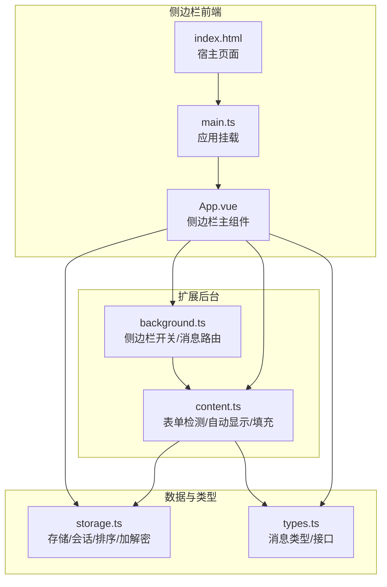
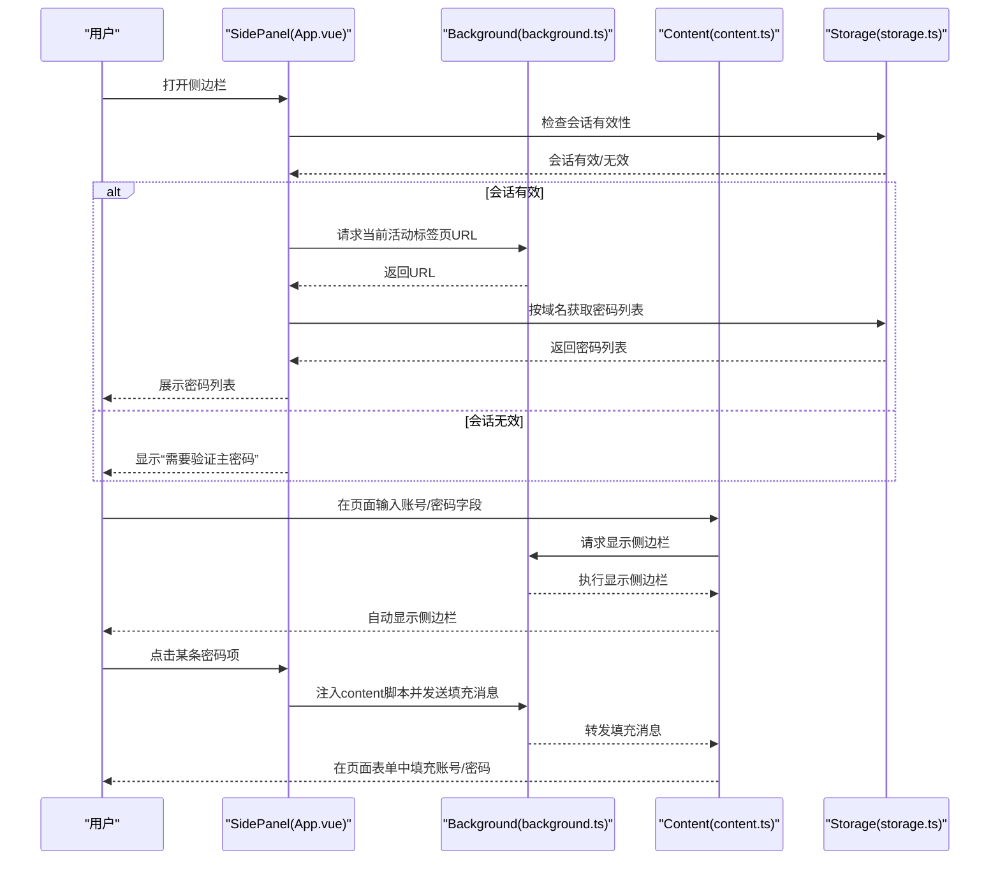
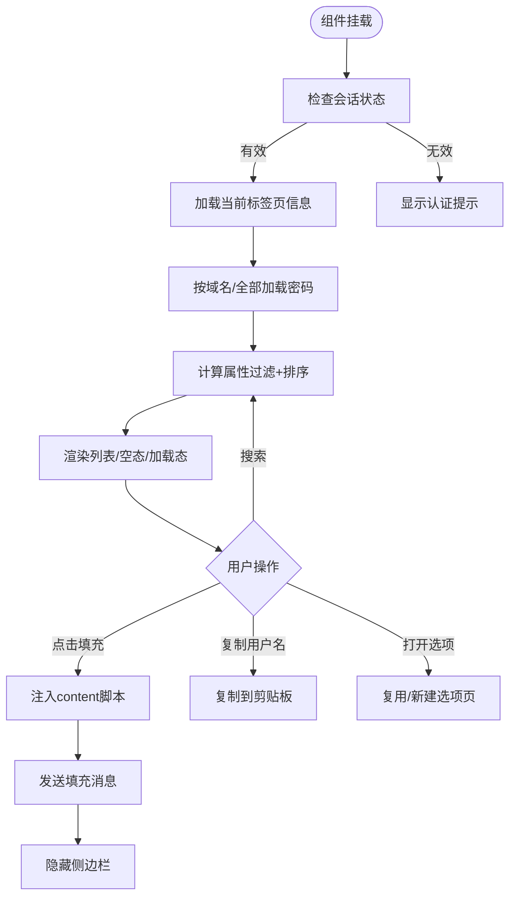
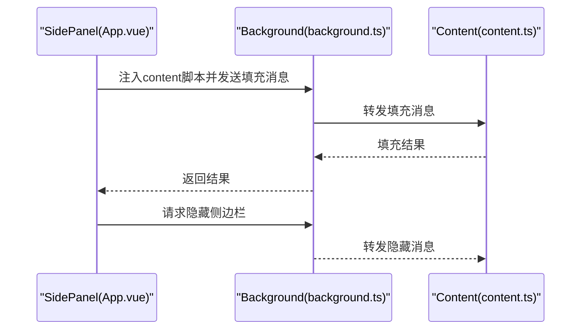
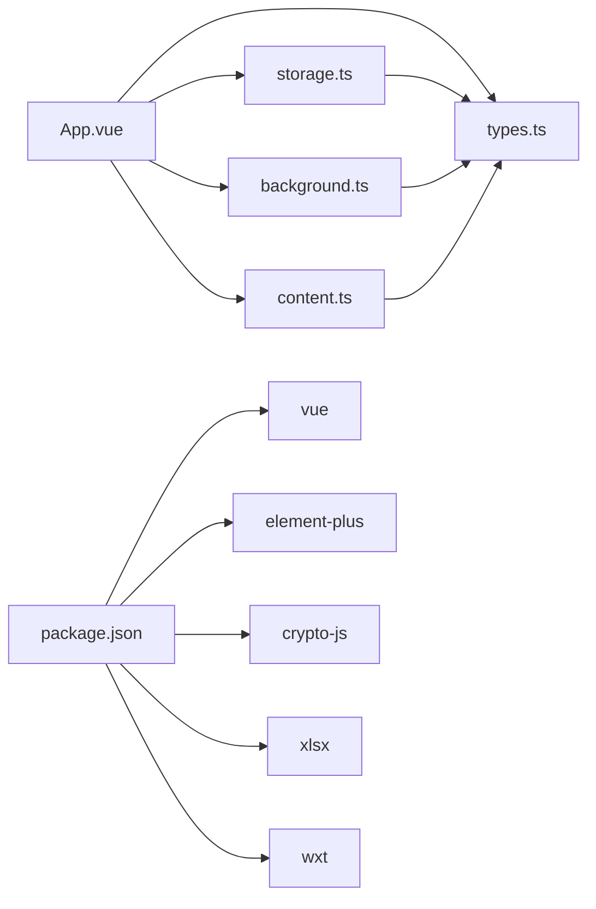

# 侧边栏界面

<cite>
**本文档引用的文件**
- [App.vue](file://entrypoints/sidepanel/App.vue)
- [main.ts](file://entrypoints/sidepanel/main.ts)
- [index.html](file://entrypoints/sidepanel/index.html)
- [content.ts](file://entrypoints/content.ts)
- [background.ts](file://entrypoints/background.ts)
- [types.ts](file://utils/types.ts)
- [storage.ts](file://utils/storage.ts)
- [popup/App.vue](file://entrypoints/popup/App.vue)
- [options/App.vue](file://entrypoints/options/App.vue)
- [package.json](file://package.json)
- [wxt.config.ts](file://wxt.config.ts)
</cite>

## 目录
1. [简介](#简介)
2. [项目结构](#项目结构)
3. [核心组件](#核心组件)
4. [架构总览](#架构总览)
5. [详细组件分析](#详细组件分析)
6. [依赖关系分析](#依赖关系分析)
7. [性能考虑](#性能考虑)
8. [故障排查指南](#故障排查指南)
9. [结论](#结论)
10. [附录](#附录)

## 简介
本文件面向 Account Password Helper 插件的“侧边栏界面”（Side Panel），系统性阐述其设计目标、Vue 组件架构、响应式布局与状态管理、核心功能（密码搜索、快速填充、实时数据展示）、与 Content Script 的数据交互机制、用户体验优化策略、Chrome 侧边栏 API 使用指南（含兼容性与降级方案）、性能优化策略（懒加载、虚拟滚动、内存管理）以及开发最佳实践与调试技巧。文档严格基于仓库现有源码进行分析与总结，避免臆测。

## 项目结构
侧边栏入口位于 sidepanel 目录，采用 Vue 3 + Element Plus 构建，配合 WXT 打包与 Chrome Extension Manifest V3 规范运行。整体结构如下：
- sidepanel 主入口：App.vue（模板/逻辑/样式）、main.ts（应用挂载）、index.html（宿主页面）
- 背景页：background.ts（侧边栏开关控制、消息路由）
- 内容脚本：content.ts（表单检测、自动显示侧边栏、填充策略）
- 数据层：storage.ts（主密码、会话、排序、加解密、存储）
- 类型定义：types.ts（消息类型、密码条目接口）
- 其他入口：popup、options 等（与侧边栏协同）

图表来源
- [App.vue](file://entrypoints/sidepanel/App.vue#L1-L911)
- [main.ts](file://entrypoints/sidepanel/main.ts#L1-L10)
- [index.html](file://entrypoints/sidepanel/index.html#L1-L19)
- [background.ts](file://entrypoints/background.ts#L1-L232)
- [content.ts](file://entrypoints/content.ts#L1-L800)
- [storage.ts](file://utils/storage.ts#L1-L981)
- [types.ts](file://utils/types.ts#L1-L96)

章节来源
- [App.vue](file://entrypoints/sidepanel/App.vue#L1-L911)
- [main.ts](file://entrypoints/sidepanel/main.ts#L1-L10)
- [index.html](file://entrypoints/sidepanel/index.html#L1-L19)
- [background.ts](file://entrypoints/background.ts#L1-L232)
- [content.ts](file://entrypoints/content.ts#L1-L800)
- [storage.ts](file://utils/storage.ts#L1-L981)
- [types.ts](file://utils/types.ts#L1-L96)

## 核心组件
- 侧边栏主组件（App.vue）
  - 负责渲染头部（Logo、当前域名）、搜索框、认证状态提示、密码列表、底部操作区
  - 状态管理：加载态、搜索关键词、密码列表、当前域名、认证状态、显示控制
  - 功能：搜索过滤、排序、认证状态监听、URL变化处理、密码填充、复制用户名、打开选项页
- 应用入口（main.ts）
  - 创建 Vue 应用实例，注册 Element Plus，挂载到 #app
- 宿主页面（index.html）
  - 提供最小化 HTML 结构与模块入口脚本

章节来源
- [App.vue](file://entrypoints/sidepanel/App.vue#L1-L161)
- [main.ts](file://entrypoints/sidepanel/main.ts#L1-L10)
- [index.html](file://entrypoints/sidepanel/index.html#L1-L19)

## 架构总览
侧边栏与内容脚本、后台页通过消息通信协作：
- 侧边栏启动时检查会话状态，加载当前标签页域名并拉取匹配密码
- 内容脚本检测登录表单，必要时自动显示侧边栏
- 填充密码时，侧边栏注入 content script 并向页面发送填充消息
- 后台页负责侧边栏开关（Chrome sidePanel API）与 URL 变化广播

图表来源
- [App.vue](file://entrypoints/sidepanel/App.vue#L233-L422)
- [background.ts](file://entrypoints/background.ts#L33-L73)
- [content.ts](file://entrypoints/content.ts#L86-L91)
- [storage.ts](file://utils/storage.ts#L514-L576)

章节来源
- [App.vue](file://entrypoints/sidepanel/App.vue#L233-L422)
- [background.ts](file://entrypoints/background.ts#L33-L73)
- [content.ts](file://entrypoints/content.ts#L86-L91)
- [storage.ts](file://utils/storage.ts#L514-L576)

## 详细组件分析

### 侧边栏主组件（App.vue）架构
- 模板结构
  - 头部：Logo、标题、当前域名显示
  - 搜索区域：输入框绑定搜索关键词，clearable，前置图标
  - 认证状态：未认证时显示“需要验证主密码”，认证后显示密码列表
  - 密码列表：加载态、空态、列表项（用户名、标签、URL、备注、复制按钮、快速填充动作）
  - 底部：打开“密码管理”按钮
- 响应式与状态
  - 响应式数据：loading、searchKeyword、passwords、currentDomain、isAuthenticated、showSidepanel
  - 计算属性：filteredPasswords（大小写不敏感搜索 + 排序）
  - 监听器：会话变化、存储变化、页面可见性、标签页更新/激活、URL变化消息
- 业务流程
  - 初始化：检查会话、加载当前标签页、加载密码
  - 搜索：通过计算属性实时过滤
  - 填充：注入 content script，发送填充消息，成功后隐藏侧边栏
  - 复制：复制用户名到剪贴板
  - 打开选项：复用标签页或新建标签页
  - 标签颜色：基于标签内容的缓存映射
  - 排序：读取保存的排序配置，支持多字段升/降序

图表来源
- [App.vue](file://entrypoints/sidepanel/App.vue#L163-L687)
- [App.vue](file://entrypoints/sidepanel/App.vue#L690-L700)

章节来源
- [App.vue](file://entrypoints/sidepanel/App.vue#L1-L911)

### 侧边栏与 Content Script 的数据交互
- 表单上下文获取
  - 内容脚本检测页面中的账号/密码、手机号/验证码、登录按钮等字段
  - 使用 MutationObserver 与事件委托监听 DOM 变化与焦点事件，自动判断是否应在登录环境显示侧边栏
- 填充策略
  - 侧边栏点击某条密码项后，先注入 content script，再发送填充消息（账号+密码）
  - 填充成功后，通过后台页发送隐藏侧边栏的消息
- 消息类型
  - FILL_PASSWORD：填充账号/密码
  - SHOW_SIDEPANEL/HIDE_SIDEPANEL：显示/隐藏侧边栏
  - URL_CHANGED：URL 变化通知

图表来源
- [App.vue](file://entrypoints/sidepanel/App.vue#L342-L422)
- [background.ts](file://entrypoints/background.ts#L33-L73)
- [content.ts](file://entrypoints/content.ts#L86-L91)

章节来源
- [App.vue](file://entrypoints/sidepanel/App.vue#L342-L422)
- [content.ts](file://entrypoints/content.ts#L1-L800)
- [background.ts](file://entrypoints/background.ts#L33-L73)
- [types.ts](file://utils/types.ts#L54-L87)

### 侧边栏与后台页（Background）的集成
- 侧边栏开关
  - 通过 Chrome sidePanel API 打开/隐藏侧边栏
  - 兼容性处理：若 API 不可用，记录警告并提示升级浏览器版本
- URL 变化
  - 标签页更新/激活时，后台页可关闭侧边栏或通知侧边栏更新
- 消息路由
  - 路由 SHOW_SIDEPANEL/HIDE_SIDEPANEL/URL_CHANGED 等消息

章节来源
- [background.ts](file://entrypoints/background.ts#L75-L138)
- [background.ts](file://entrypoints/background.ts#L184-L201)

### 数据层与状态管理
- 会话与认证
  - 会话有效期、加密存储会话主密码、过期自动清理
  - 会话有效时才允许加载密码列表
- 存储与排序
  - 支持按 username/url/tag/remark/createTime/updateTime 排序
  - 支持保存排序配置，重启后仍生效
- 加密与安全
  - 主密码使用 PBKDF2 派生密钥，AES-CBC 加密存储密码字段
  - 会话加密密钥基于主密码盐值派生，避免明文存储

章节来源
- [storage.ts](file://utils/storage.ts#L791-L841)
- [storage.ts](file://utils/storage.ts#L865-L894)
- [storage.ts](file://utils/storage.ts#L514-L670)

### 用户体验优化
- 自动展开
  - 内容脚本在登录表单环境中自动显示侧边栏
- 智能定位
  - 仅在登录表单或弹窗中显示侧边栏，避免误触发
- 键盘导航支持
  - 输入框聚焦时触发侧边栏显示；搜索框支持清空
- 反馈与提示
  - 加载态、空态、错误提示、成功/警告消息

章节来源
- [content.ts](file://entrypoints/content.ts#L679-L770)
- [App.vue](file://entrypoints/sidepanel/App.vue#L67-L89)
- [App.vue](file://entrypoints/sidepanel/App.vue#L414-L421)

### Chrome 侧边栏 API 使用指南
- 权限与清单
  - manifest 中声明 permissions: ['sidePanel']，commands 配置快捷键
- 打开/隐藏
  - 通过 chrome.sidePanel.open/close（或模拟隐藏）实现
- 兼容性与降级
  - 若 API 不可用，记录警告并提示升级浏览器版本
- 版本适配
  - 仅在 Chrome 116+ 支持 sidePanel API

章节来源
- [wxt.config.ts](file://wxt.config.ts#L18-L46)
- [background.ts](file://entrypoints/background.ts#L75-L138)

### 性能优化策略
- 懒加载
  - 仅在会话有效时加载密码列表；搜索通过计算属性实时过滤，避免额外请求
- 虚拟滚动
  - 未实现虚拟滚动；可通过第三方库（如 vue-virtual-scroller）在长列表场景下优化
- 内存管理
  - WeakMap/WeakSet 缓存字段类型与可见性，避免内存泄漏
  - MutationObserver 与事件委托降低监听成本
- 防抖
  - 表单检测与侧边栏显示采用防抖，减少频繁触发

章节来源
- [content.ts](file://entrypoints/content.ts#L38-L51)
- [content.ts](file://entrypoints/content.ts#L93-L170)
- [content.ts](file://entrypoints/content.ts#L611-L636)

### 开发最佳实践与调试技巧
- 最佳实践
  - 使用计算属性进行搜索与排序，避免直接修改原始数据
  - 通过消息类型枚举统一消息协议，便于维护
  - 会话状态变化时及时清理与重建监听器
- 调试技巧
  - 使用 ElMessage 输出关键日志（如“会话有效/无效”、“URL变化处理完成”）
  - 在 storage.ts 中提供调试工具（如 debugMasterPassword）查看主密码配置信息
  - 在 background.ts 中捕获 API 不可用异常并记录警告

章节来源
- [App.vue](file://entrypoints/sidepanel/App.vue#L200-L219)
- [storage.ts](file://utils/storage.ts#L960-L979)
- [background.ts](file://entrypoints/background.ts#L95-L99)

## 依赖关系分析
- 组件耦合
  - App.vue 与 storage.ts、types.ts 高内聚；与 background.ts 通过消息弱耦合
  - content.ts 与 background.ts 通过消息路由弱耦合
- 外部依赖
  - Vue 3、Element Plus、CryptoJS、xlsx
- 构建与打包
  - WXT + Vue 模块，Vite 别名配置

图表来源
- [App.vue](file://entrypoints/sidepanel/App.vue#L163-L169)
- [types.ts](file://utils/types.ts#L1-L96)
- [storage.ts](file://utils/storage.ts#L1-L981)
- [background.ts](file://entrypoints/background.ts#L1-L232)
- [content.ts](file://entrypoints/content.ts#L1-L91)
- [package.json](file://package.json#L22-L47)

章节来源
- [package.json](file://package.json#L22-L47)
- [wxt.config.ts](file://wxt.config.ts#L1-L48)

## 性能考虑
- 计算属性与响应式
  - filteredPasswords 通过计算属性实现，避免在每次输入时触发昂贵操作
- DOM 事件与监听
  - 使用事件委托与防抖，减少监听器数量与触发频率
- 存储与排序
  - 本地存储 + 会话缓存，避免重复解密与网络请求
- 建议
  - 长列表场景引入虚拟滚动；对搜索关键词做去抖处理；对 MutationObserver 的回调进行节流

[本节为通用性能讨论，不直接分析具体文件]

## 故障排查指南
- 无法打开侧边栏
  - 检查 Chrome 版本是否支持 sidePanel API；查看后台日志是否有“不支持 sidePanel API”的警告
- 会话无效
  - 确认主密码验证是否通过；检查会话过期时间；必要时重新验证
- 填充失败
  - 确认页面已注入 content script；检查消息转发链路；查看 ElMessage 提示
- URL 变化未更新
  - 确认 background.ts 是否收到 URL_CHANGED 消息；检查标签页更新/激活监听

章节来源
- [background.ts](file://entrypoints/background.ts#L95-L99)
- [App.vue](file://entrypoints/sidepanel/App.vue#L233-L247)
- [content.ts](file://entrypoints/content.ts#L86-L91)

## 结论
Account Password Helper 的侧边栏界面以 Vue 3 + Element Plus 构建，结合 WXT 打包与 Chrome Extension API，实现了“认证驱动的密码管理、自动表单检测、快速填充与实时数据展示”。通过消息路由与会话状态管理，侧边栏与内容脚本、后台页形成清晰的职责边界。在性能方面，采用计算属性过滤、防抖与缓存策略；在用户体验方面，提供自动展开、智能定位与键盘导航支持。未来可在长列表场景引入虚拟滚动，并进一步完善侧边栏隐藏策略与错误恢复机制。

[本节为总结性内容，不直接分析具体文件]

## 附录
- 相关入口
  - 弹窗入口：popup/App.vue（打开侧边栏、打开选项页）
  - 选项页入口：options/App.vue（主密码设置/验证）
- 快捷键
  - Ctrl+Shift+P：打开选项页面
  - Ctrl+Shift+L：打开/关闭侧边栏

章节来源
- [popup/App.vue](file://entrypoints/popup/App.vue#L127-L151)
- [options/App.vue](file://entrypoints/options/App.vue#L1-L200)
- [wxt.config.ts](file://wxt.config.ts#L24-L40)