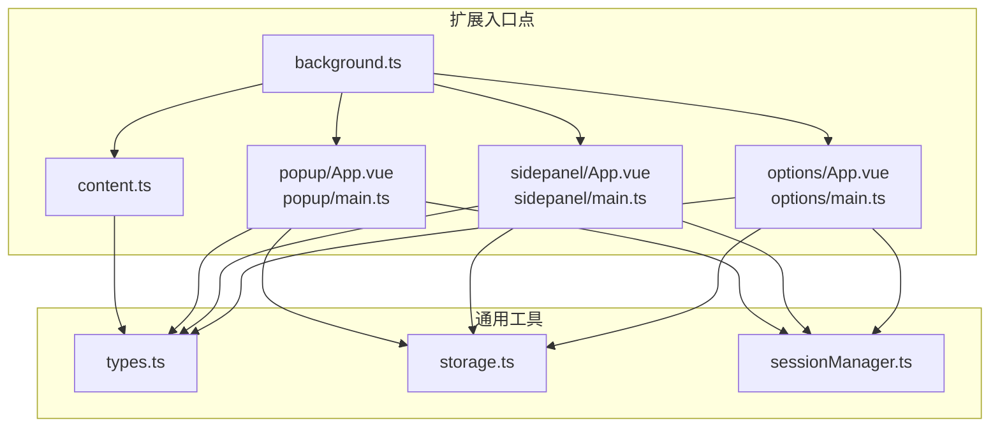
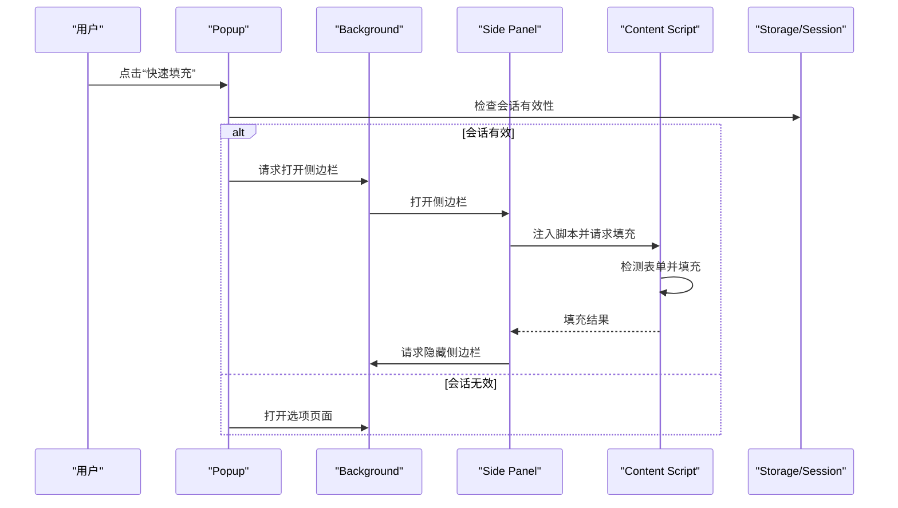
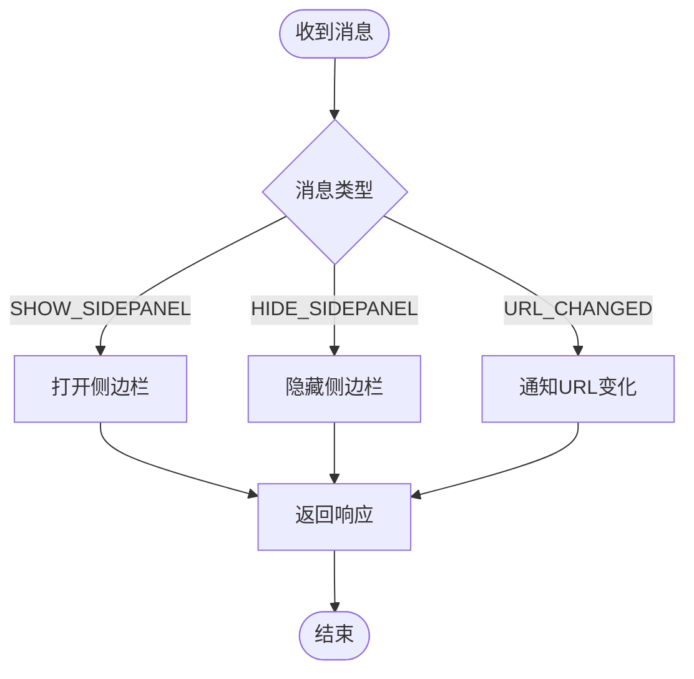
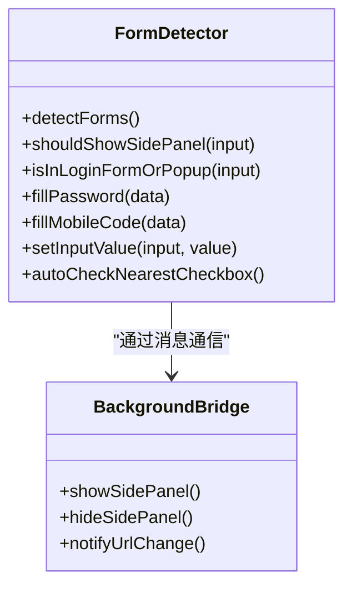
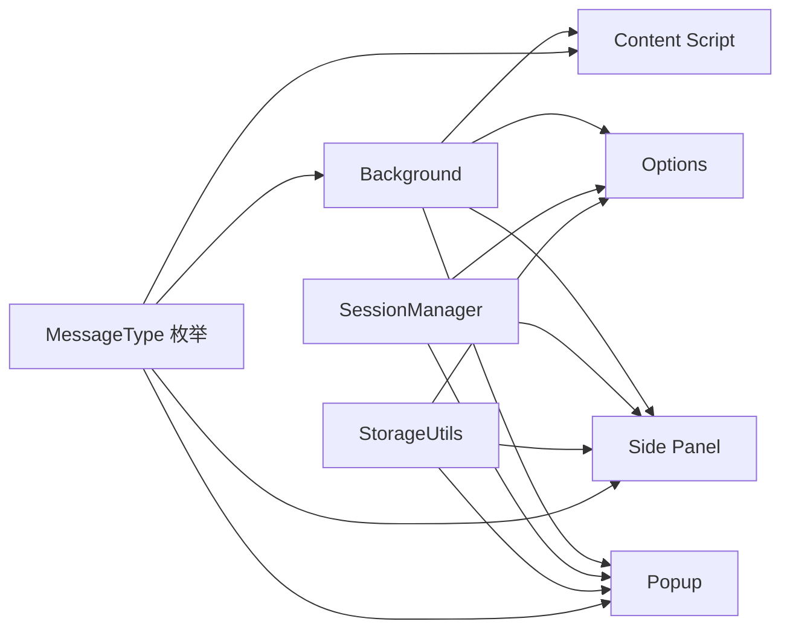

# 扩展入口点

<cite>
**本文档引用的文件**
- [entrypoints/background.ts](file://entrypoints/background.ts)
- [entrypoints/content.ts](file://entrypoints/content.ts)
- [entrypoints/popup/App.vue](file://entrypoints/popup/App.vue)
- [entrypoints/popup/main.ts](file://entrypoints/popup/main.ts)
- [entrypoints/sidepanel/App.vue](file://entrypoints/sidepanel/App.vue)
- [entrypoints/sidepanel/main.ts](file://entrypoints/sidepanel/main.ts)
- [entrypoints/options/App.vue](file://entrypoints/options/App.vue)
- [entrypoints/options/main.ts](file://entrypoints/options/main.ts)
- [utils/types.ts](file://utils/types.ts)
- [utils/storage.ts](file://utils/storage.ts)
- [utils/sessionManager.ts](file://utils/sessionManager.ts)
- [package.json](file://package.json)
- [wxt.config.ts](file://wxt.config.ts)
</cite>

## 目录
1. [简介](#简介)
2. [项目结构](#项目结构)
3. [核心组件](#核心组件)
4. [架构总览](#架构总览)
5. [详细组件分析](#详细组件分析)
6. [依赖关系分析](#依赖关系分析)
7. [性能考量](#性能考量)
8. [故障排查指南](#故障排查指南)
9. [结论](#结论)
10. [附录](#附录)

## 简介
本文件系统化梳理 Account Password Helper 扩展的入口点与核心模块，围绕 Background Script、Content Script、Popup、Side Panel、Options 页面的职责边界、生命周期与功能实现展开；并给出消息通信协议、数据共享机制与状态同步策略，辅以性能优化、内存管理与错误处理的最佳实践，帮助开发者高效构建与维护 Chrome 扩展。

## 项目结构
扩展采用 WXT + Vue 3 的现代工程化组织方式，入口点位于 entrypoints 目录，通用工具与类型定义位于 utils 目录，组件化 UI 位于 components 目录。整体结构清晰、职责分离明确，便于独立开发与测试。

**图表来源**
- [entrypoints/background.ts](file://entrypoints/background.ts#L1-L232)
- [entrypoints/content.ts](file://entrypoints/content.ts#L1-L1892)
- [entrypoints/popup/App.vue](file://entrypoints/popup/App.vue#L1-L234)
- [entrypoints/popup/main.ts](file://entrypoints/popup/main.ts#L1-L10)
- [entrypoints/sidepanel/App.vue](file://entrypoints/sidepanel/App.vue#L1-L911)
- [entrypoints/sidepanel/main.ts](file://entrypoints/sidepanel/main.ts#L1-L10)
- [entrypoints/options/App.vue](file://entrypoints/options/App.vue#L1-L2414)
- [entrypoints/options/main.ts](file://entrypoints/options/main.ts#L1-L11)
- [utils/types.ts](file://utils/types.ts#L1-L96)
- [utils/storage.ts](file://utils/storage.ts#L1-L981)
- [utils/sessionManager.ts](file://utils/sessionManager.ts#L1-L87)

**章节来源**
- [wxt.config.ts](file://wxt.config.ts#L1-L48)
- [package.json](file://package.json#L1-L49)

## 核心组件
- Background Script：负责扩展生命周期事件、快捷键、标签页事件、与 Content/Side Panel 的消息桥接、侧边栏开关控制与选项页打开。
- Content Script：负责页面 DOM 检测、登录表单识别、输入焦点事件处理、侧边栏显示/隐藏、向页面注入脚本与执行填充。
- Popup：轻量交互入口，提供“打开选项”“快速填充”等快捷操作，负责会话校验与侧边栏打开。
- Side Panel：密码快速填充面板，负责认证状态监听、URL 变化、密码列表加载与填充、注入 Content Script 并触发填充。
- Options：主配置页面，负责主密码设置/验证、有效期设置、密码增删改查、导入导出、排序配置与调试。

**章节来源**
- [entrypoints/background.ts](file://entrypoints/background.ts#L1-L232)
- [entrypoints/content.ts](file://entrypoints/content.ts#L1-L1892)
- [entrypoints/popup/App.vue](file://entrypoints/popup/App.vue#L1-L234)
- [entrypoints/sidepanel/App.vue](file://entrypoints/sidepanel/App.vue#L1-L911)
- [entrypoints/options/App.vue](file://entrypoints/options/App.vue#L1-L2414)

## 架构总览
扩展采用“后台桥接 + 内容脚本 + 多入口 UI”的架构模式。Background 作为中枢协调各入口；Content 负责页面感知与表单检测；UI 入口通过消息与 Storage/Session 管理器协作完成数据持久化与状态同步。

**图表来源**
- [entrypoints/popup/App.vue](file://entrypoints/popup/App.vue#L127-L151)
- [entrypoints/background.ts](file://entrypoints/background.ts#L140-L165)
- [entrypoints/sidepanel/App.vue](file://entrypoints/sidepanel/App.vue#L342-L422)
- [entrypoints/content.ts](file://entrypoints/content.ts#L993-L1028)
- [utils/storage.ts](file://utils/storage.ts#L791-L840)
- [utils/sessionManager.ts](file://utils/sessionManager.ts#L1-L87)

## 详细组件分析

### Background Script（后台桥接）
- 职责
  - 监听安装事件、标签页更新/激活、快捷键命令。
  - 处理来自 Content/Side Panel 的消息：显示/隐藏侧边栏、URL 变化通知。
  - 打开选项页面、切换侧边栏显示状态。
- 生命周期
  - 扩展安装时初始化日志；常驻进程，监听全局事件。
- 关键实现要点
  - 使用 chrome.sidePanel API 控制侧边栏；对 API 可用性做降级处理。
  - 对消息处理采用异步响应并返回统一结构，便于前端诊断。
  - 通过标签页 ID 与侧边栏联动，避免重复打开或无法关闭的问题。

**图表来源**
- [entrypoints/background.ts](file://entrypoints/background.ts#L34-L73)
- [entrypoints/background.ts](file://entrypoints/background.ts#L76-L138)
- [entrypoints/background.ts](file://entrypoints/background.ts#L184-L201)

**章节来源**
- [entrypoints/background.ts](file://entrypoints/background.ts#L1-L232)

### Content Script（内容脚本）
- 职责
  - 页面 DOM 检测与登录表单识别，防抖优化与缓存策略。
  - 输入焦点事件委托与侧边栏显示/隐藏。
  - 接收来自 Side Panel 的填充指令并执行账号/密码填充。
  - 页面可见性、导航事件监听，URL 变化通知后台。
- 关键实现要点
  - 使用 MutationObserver 检测动态表单与按钮；事件委托减少监听器数量。
  - 字段类型缓存（WeakMap）、Set 提升查找效率，避免内存泄漏。
  - 填充时触发完整事件序列（input/change/键盘事件），并自动勾选最近的复选框。
  - 针对手机号+验证码场景，支持用户名字段作为手机号的兼容处理。

**图表来源**
- [entrypoints/content.ts](file://entrypoints/content.ts#L22-L170)
- [entrypoints/content.ts](file://entrypoints/content.ts#L800-L926)
- [entrypoints/content.ts](file://entrypoints/content.ts#L1184-L1217)
- [entrypoints/content.ts](file://entrypoints/content.ts#L1222-L1306)

**章节来源**
- [entrypoints/content.ts](file://entrypoints/content.ts#L1-L1892)

### Popup（弹出面板）
- 职责
  - 快速入口：打开选项页面、打开侧边栏。
  - 会话状态检查：若会话无效则引导至选项页面验证。
  - 显示密码数量统计（会话有效时）。
- 关键实现要点
  - 使用 StorageUtils 检查会话有效性；若无效则打开选项页面。
  - 通过 chrome.tabs API 打开/激活选项页面标签页，避免重复创建。
  - 侧边栏打开后自动关闭弹窗，提升用户体验。

**章节来源**
- [entrypoints/popup/App.vue](file://entrypoints/popup/App.vue#L1-L234)
- [entrypoints/popup/main.ts](file://entrypoints/popup/main.ts#L1-L10)

### Side Panel（侧边栏面板）
- 职责
  - 认证状态监听：会话过期自动回退到未认证状态。
  - URL 变化监听：标签页更新/激活时更新当前域名并重新加载密码。
  - 密码列表加载与搜索：支持按用户名/标签/备注/URL 搜索与排序。
  - 填充执行：注入 Content Script 并发送填充消息，完成后隐藏侧边栏。
- 关键实现要点
  - 使用 chrome.storage.onChanged 监听会话状态变化，实时响应。
  - 通过 chrome.tabs.sendMessage 与 Content Script 通信，执行账号/密码填充。
  - 填充成功后主动请求 Background 隐藏侧边栏，保证状态一致。

**章节来源**
- [entrypoints/sidepanel/App.vue](file://entrypoints/sidepanel/App.vue#L1-L911)
- [entrypoints/sidepanel/main.ts](file://entrypoints/sidepanel/main.ts#L1-L10)

### Options（选项页面）
- 职责
  - 主密码设置/验证：首次使用引导设置主密码，后续验证登录。
  - 有效期设置：可调整会话缓存时长，支持即时生效与会话清除。
  - 密码管理：增删改查、搜索、排序、复制、导入导出。
  - 调试与重置：查看主密码配置调试信息，重置所有数据。
- 关键实现要点
  - 会话过期事件监听：通过自定义事件触发页面回退到验证页。
  - 排序配置持久化：保存排序字段与方向，页面加载时恢复。
  - 数据导入导出：基于 Excel 工具链，支持模板下载与批量导入。

**章节来源**
- [entrypoints/options/App.vue](file://entrypoints/options/App.vue#L1-L2414)
- [entrypoints/options/main.ts](file://entrypoints/options/main.ts#L1-L11)

## 依赖关系分析
- 消息协议
  - 通过统一的 MessageType 枚举定义消息类型，确保前后端契约一致。
  - 消息结构包含 type 与 data 字段，便于扩展与兼容。
- 数据与状态
  - StorageUtils 提供主密码、排序配置、密码条目等本地存储封装。
  - SessionManager 周期性检查会话有效性，触发过期事件并清理会话。
- 外部依赖
  - Vue 3 + Element Plus 构建 UI；CryptoJS 实现加密；xlsx 支持 Excel 导入导出。

**图表来源**
- [utils/types.ts](file://utils/types.ts#L54-L87)
- [utils/storage.ts](file://utils/storage.ts#L1-L981)
- [utils/sessionManager.ts](file://utils/sessionManager.ts#L1-L87)
- [entrypoints/background.ts](file://entrypoints/background.ts#L1-L232)
- [entrypoints/content.ts](file://entrypoints/content.ts#L1-L1892)
- [entrypoints/sidepanel/App.vue](file://entrypoints/sidepanel/App.vue#L1-L911)
- [entrypoints/popup/App.vue](file://entrypoints/popup/App.vue#L1-L234)
- [entrypoints/options/App.vue](file://entrypoints/options/App.vue#L1-L2414)

**章节来源**
- [utils/types.ts](file://utils/types.ts#L1-L96)
- [utils/storage.ts](file://utils/storage.ts#L1-L981)
- [utils/sessionManager.ts](file://utils/sessionManager.ts#L1-L87)
- [package.json](file://package.json#L22-L46)

## 性能考量
- DOM 检测与事件
  - 使用 MutationObserver 与事件委托，降低监听器数量与内存占用。
  - 表单检测采用防抖与缓存（WeakMap/Set）提升响应速度与稳定性。
- 填充流程
  - 触发完整事件序列确保第三方表单逻辑兼容；填充后延迟隐藏侧边栏，避免竞态。
- 存储与会话
  - 会话状态周期性检查，避免长时间占用资源；排序配置本地持久化，减少每次计算成本。
- UI 体验
  - 侧边栏打开/隐藏采用幂等 API，避免重复操作带来的性能损耗。

[本节为通用指导，无需具体文件引用]

## 故障排查指南
- 侧边栏无法打开/隐藏
  - 检查 chrome.sidePanel API 是否可用；确认标签页 ID 获取成功。
  - 若 API 不可用，需引导用户升级 Chrome 版本。
- 填充失败
  - 确认 Content Script 已注入；检查消息类型与参数是否正确。
  - 观察事件分发是否成功，必要时增加日志定位。
- 会话过期
  - 监听 sessionExpired 事件并回退到验证页；检查有效期设置与剩余时间。
- 选项页面无法打开
  - 使用 chrome.tabs.query 检查是否已存在标签页，避免重复创建。

**章节来源**
- [entrypoints/background.ts](file://entrypoints/background.ts#L76-L138)
- [entrypoints/content.ts](file://entrypoints/content.ts#L993-L1028)
- [entrypoints/sidepanel/App.vue](file://entrypoints/sidepanel/App.vue#L342-L422)
- [utils/sessionManager.ts](file://utils/sessionManager.ts#L27-L66)

## 结论
本扩展通过清晰的入口点划分与统一的消息协议，实现了从页面感知、侧边栏控制到配置管理的完整闭环。借助缓存、防抖与会话管理等策略，兼顾了性能与可靠性。建议在后续迭代中进一步完善侧边栏关闭能力、增强表单识别鲁棒性，并持续优化填充事件的兼容性。

[本节为总结性内容，无需具体文件引用]

## 附录

### 消息通信协议（MessageType）
- PING：心跳检测
- DETECT_FORM：检测表单（当前未在代码中使用）
- FILL_PASSWORD：填充账号+密码
- FILL_MOBILE_CODE：填充手机号+验证码（当前实现合并为账号密码）
- SHOW_SIDEPANEL/HIDE_SIDEPANEL：显示/隐藏侧边栏
- URL_CHANGED：URL 变化通知
- GET_PASSWORDS：获取密码列表（当前未在代码中使用）

**章节来源**
- [utils/types.ts](file://utils/types.ts#L54-L87)

### 权限与快捷键
- 权限
  - storage、activeTab、scripting、sidePanel
- 快捷键
  - Ctrl+Shift+P 打开选项页面
  - Ctrl+Shift+L 打开/关闭侧边栏

**章节来源**
- [wxt.config.ts](file://wxt.config.ts#L18-L46)