# 扩展入口点

<cite>
**本文档引用的文件**
- [entrypoints/background.ts](file://entrypoints/background.ts)
- [entrypoints/content.ts](file://entrypoints/content.ts)
- [entrypoints/popup/App.vue](file://entrypoints/popup/App.vue)
- [entrypoints/popup/main.ts](file://entrypoints/popup/main.ts)
- [entrypoints/sidepanel/App.vue](file://entrypoints/sidepanel/App.vue)
- [entrypoints/sidepanel/main.ts](file://entrypoints/sidepanel/main.ts)
- [entrypoints/options/App.vue](file://entrypoints/options/App.vue)
- [entrypoints/options/main.ts](file://entrypoints/options/main.ts)
- [entrypoints/content/FormDetector.ts](file://entrypoints/content/FormDetector.ts)
- [entrypoints/content/CheckboxHandler.ts](file://entrypoints/content/CheckboxHandler.ts)
- [entrypoints/content/LoginFormAnalyzer.ts](file://entrypoints/content/LoginFormAnalyzer.ts)
- [entrypoints/content/InputFiller.ts](file://entrypoints/content/InputFiller.ts)
- [entrypoints/content/NativeNotification.ts](file://entrypoints/content/NativeNotification.ts)
- [entrypoints/content/formSelectors.ts](file://entrypoints/content/formSelectors.ts)
- [entrypoints/content/floatingButtons/FloatingButtonManager.ts](file://entrypoints/content/floatingButtons/FloatingButtonManager.ts)
- [utils/createVueApp.ts](file://utils/createVueApp.ts)
- [utils/types.ts](file://utils/types.ts)
- [utils/storage.ts](file://utils/storage.ts)
- [utils/sessionManager.ts](file://utils/sessionManager.ts)
- [composables/useChromeListeners.ts](file://composables/useChromeListeners.ts)
- [package.json](file://package.json)
- [wxt.config.ts](file://wxt.config.ts)
</cite>

## 更新摘要
**变更内容**
- 新增统一的Vue应用工厂函数，简化了选项页、弹出页和侧边栏的初始化流程
- 新增CheckboxHandler组件，提供智能复选框勾选算法
- 新增LoginFormAnalyzer组件，提供登录表单和弹窗的智能识别
- 新增InputFiller组件，提供多种填充策略
- 新增NativeNotification组件，提供原生通知显示功能
- 增强FormDetector组件，集成新组件并改进填充流程
- 重构了表单检测和填充的架构，提高了鲁棒性和兼容性

## 目录
1. [简介](#简介)
2. [项目结构](#项目结构)
3. [核心组件](#核心组件)
4. [架构总览](#架构总览)
5. [详细组件分析](#详细组件分析)
6. [依赖关系分析](#依赖关系分析)
7. [性能考量](#性能考量)
8. [故障排查指南](#故障排查指南)
9. [结论](#结论)
10. [附录](#附录)

## 简介
本文件系统化梳理 Account Password Helper 扩展的入口点与核心模块，围绕 Background Script、Content Script、Popup、Side Panel、Options 页面的职责边界、生命周期与功能实现展开；并给出消息通信协议、数据共享机制与状态同步策略，辅以性能优化、内存管理与错误处理的最佳实践，帮助开发者高效构建与维护 Chrome 扩展。

## 项目结构
扩展采用 WXT + Vue 3 的现代工程化组织方式，入口点位于 entrypoints 目录，通用工具与类型定义位于 utils 目录，组件化 UI 位于 components 目录。整体结构清晰、职责分离明确，便于独立开发与测试。

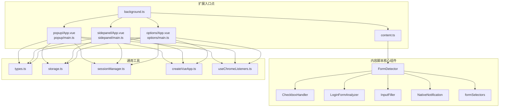

**图表来源**
- [entrypoints/background.ts:1-403](file://entrypoints/background.ts#L1-L403)
- [entrypoints/content.ts:1-25](file://entrypoints/content.ts#L1-L25)
- [entrypoints/popup/App.vue:1-264](file://entrypoints/popup/App.vue#L1-L264)
- [entrypoints/popup/main.ts:1-5](file://entrypoints/popup/main.ts#L1-L5)
- [entrypoints/sidepanel/App.vue:1-1065](file://entrypoints/sidepanel/App.vue#L1-L1065)
- [entrypoints/sidepanel/main.ts:1-5](file://entrypoints/sidepanel/main.ts#L1-L5)
- [entrypoints/options/App.vue:1-2511](file://entrypoints/options/App.vue#L1-L2511)
- [entrypoints/options/main.ts:1-5](file://entrypoints/options/main.ts#L1-L5)
- [entrypoints/content/FormDetector.ts:1-876](file://entrypoints/content/FormDetector.ts#L1-L876)
- [entrypoints/content/CheckboxHandler.ts:1-388](file://entrypoints/content/CheckboxHandler.ts#L1-L388)
- [entrypoints/content/LoginFormAnalyzer.ts:1-210](file://entrypoints/content/LoginFormAnalyzer.ts#L1-L210)
- [entrypoints/content/InputFiller.ts:1-162](file://entrypoints/content/InputFiller.ts#L1-L162)
- [entrypoints/content/NativeNotification.ts:1-96](file://entrypoints/content/NativeNotification.ts#L1-L96)
- [entrypoints/content/formSelectors.ts:1-301](file://entrypoints/content/formSelectors.ts#L1-L301)
- [utils/createVueApp.ts:1-20](file://utils/createVueApp.ts#L1-L20)
- [utils/types.ts:1-246](file://utils/types.ts#L1-L246)
- [utils/storage.ts:1-1280](file://utils/storage.ts#L1-L1280)
- [utils/sessionManager.ts:1-87](file://utils/sessionManager.ts#L1-L87)
- [composables/useChromeListeners.ts:1-112](file://composables/useChromeListeners.ts#L1-L112)

**章节来源**
- [wxt.config.ts:1-48](file://wxt.config.ts#L1-L48)
- [package.json:1-49](file://package.json#L1-L49)

## 核心组件
- Background Script：负责扩展生命周期事件、快捷键、标签页事件、与 Content/Side Panel 的消息桥接、侧边栏开关控制与选项页打开。**更新**：增强了智能tab ID检测和Chrome版本兼容性处理。
- Content Script：负责页面 DOM 检测、登录表单识别、输入焦点事件处理、侧边栏显示/隐藏、向页面注入脚本与执行填充。**更新**：改进了扩展上下文有效性检查，增加了对Extension context invalidated的专门处理。
- Popup：轻量交互入口，提供"打开选项""快速填充"等快捷操作，负责会话校验与侧边栏打开。
- Side Panel：密码快速填充面板，负责认证状态监听、URL 变化、密码列表加载与填充、注入 Content Script 并触发填充。
- Options：主配置页面，负责主密码设置/验证、有效期设置、密码增删改查、导入导出、排序配置与调试。
- **新增** FormDetector：表单检测编排器，负责检测页面中的登录表单字段，自动显示侧边栏，以及填充密码。
- **新增** CheckboxHandler：复选框处理器，负责在登录表单中自动勾选协议/记住密码等复选框。
- **新增** LoginFormAnalyzer：登录表单分析器，负责判断输入框是否位于登录表单或登录弹窗中。
- **新增** InputFiller：输入填充器，提供多种策略来填充表单输入框的值。
- **新增** NativeNotification：原生通知组件，提供模拟 Element Plus ElMessage 样式的通知显示。

**章节来源**
- [entrypoints/background.ts:1-403](file://entrypoints/background.ts#L1-L403)
- [entrypoints/content.ts:1-25](file://entrypoints/content.ts#L1-L25)
- [entrypoints/popup/App.vue:1-264](file://entrypoints/popup/App.vue#L1-L264)
- [entrypoints/sidepanel/App.vue:1-1065](file://entrypoints/sidepanel/App.vue#L1-L1065)
- [entrypoints/options/App.vue:1-2511](file://entrypoints/options/App.vue#L1-L2511)
- [entrypoints/content/FormDetector.ts:1-876](file://entrypoints/content/FormDetector.ts#L1-L876)
- [entrypoints/content/CheckboxHandler.ts:1-388](file://entrypoints/content/CheckboxHandler.ts#L1-L388)
- [entrypoints/content/LoginFormAnalyzer.ts:1-210](file://entrypoints/content/LoginFormAnalyzer.ts#L1-L210)
- [entrypoints/content/InputFiller.ts:1-162](file://entrypoints/content/InputFiller.ts#L1-L162)
- [entrypoints/content/NativeNotification.ts:1-96](file://entrypoints/content/NativeNotification.ts#L1-L96)

## 架构总览
扩展采用"后台桥接 + 内容脚本 + 多入口 UI"的架构模式。Background 作为中枢协调各入口；Content 负责页面感知与表单检测；UI 入口通过消息与 Storage/Session 管理器协作完成数据持久化与状态同步。**更新**：新增统一的Vue应用工厂函数，简化了入口点的初始化流程。

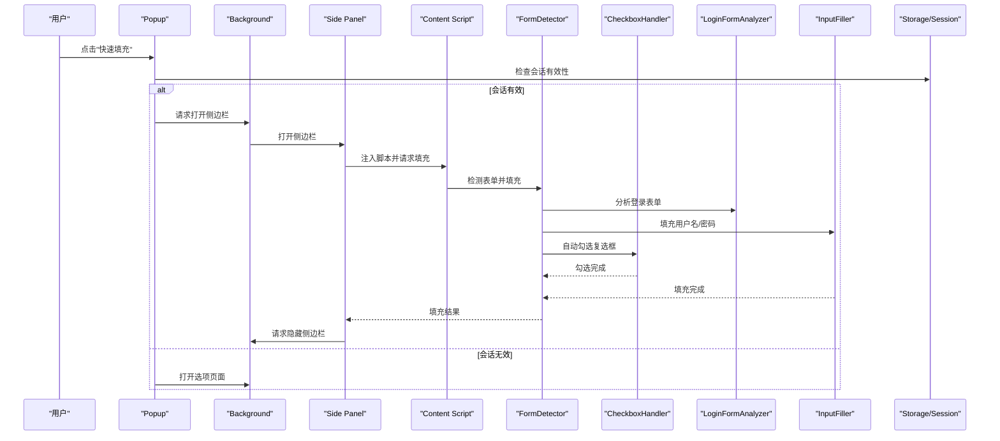

**图表来源**
- [entrypoints/popup/App.vue:129-181](file://entrypoints/popup/App.vue#L129-L181)
- [entrypoints/background.ts:70-200](file://entrypoints/background.ts#L70-L200)
- [entrypoints/sidepanel/App.vue:412-493](file://entrypoints/sidepanel/App.vue#L412-L493)
- [entrypoints/content.ts:108-112](file://entrypoints/content.ts#L108-L112)
- [entrypoints/content/FormDetector.ts:718-795](file://entrypoints/content/FormDetector.ts#L718-L795)
- [entrypoints/content/CheckboxHandler.ts:16-37](file://entrypoints/content/CheckboxHandler.ts#L16-L37)
- [entrypoints/content/LoginFormAnalyzer.ts:41-141](file://entrypoints/content/LoginFormAnalyzer.ts#L41-L141)
- [entrypoints/content/InputFiller.ts:30-54](file://entrypoints/content/InputFiller.ts#L30-L54)
- [utils/storage.ts:527-575](file://utils/storage.ts#L527-L575)
- [utils/sessionManager.ts:1-87](file://utils/sessionManager.ts#L1-L87)

## 详细组件分析

### Vue应用工厂函数（新增）
**更新**：新增统一的Vue应用工厂函数，简化了入口点的初始化流程

- 职责
  - 提供统一的Vue应用创建和挂载接口
  - 统一Element Plus的引入和配置
  - 标准化的应用初始化流程
- 关键实现要点
  - 使用createApp创建Vue应用实例
  - 自动引入Element Plus UI库
  - 支持自定义挂载选择器
  - 返回应用实例以便进一步配置

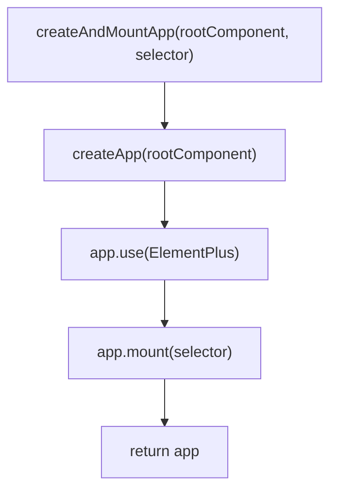

**图表来源**
- [utils/createVueApp.ts:14-19](file://utils/createVueApp.ts#L14-L19)

**章节来源**
- [utils/createVueApp.ts:1-20](file://utils/createVueApp.ts#L1-L20)

### FormDetector（表单检测编排器，新增）
**更新**：新增核心表单检测编排器，集成多个新组件

- 职责
  - 检测页面中的登录表单字段（密码、用户名、手机号、验证码、复选框、登录按钮）
  - 自动显示侧边栏，以及填充密码
  - 作为主编排器，组合 InputFiller、CheckboxHandler、LoginFormAnalyzer 等模块
- 生命周期
  - 初始化时设置存储监听器、事件委托、MutationObserver
  - 页面加载完成后检测表单，监听消息通信
- 关键实现要点
  - 使用 WeakMap 和 WeakSet 提高缓存和查找效率
  - 支持动态加载的登录表单检测
  - 提供多种填充策略和结果验证
  - 集成复选框自动勾选功能
  - 支持登录按钮自动触发

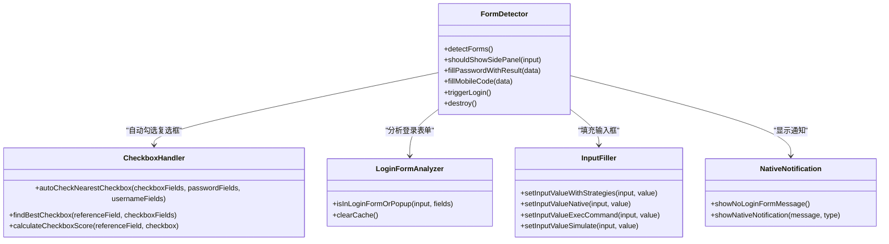

**图表来源**
- [entrypoints/content/FormDetector.ts:30-81](file://entrypoints/content/FormDetector.ts#L30-L81)
- [entrypoints/content/CheckboxHandler.ts:9-37](file://entrypoints/content/CheckboxHandler.ts#L9-L37)
- [entrypoints/content/LoginFormAnalyzer.ts:23-32](file://entrypoints/content/LoginFormAnalyzer.ts#L23-L32)
- [entrypoints/content/InputFiller.ts:23-54](file://entrypoints/content/InputFiller.ts#L23-L54)
- [entrypoints/content/NativeNotification.ts:37-95](file://entrypoints/content/NativeNotification.ts#L37-L95)

**章节来源**
- [entrypoints/content/FormDetector.ts:1-876](file://entrypoints/content/FormDetector.ts#L1-L876)

### CheckboxHandler（复选框处理器，新增）
**更新**：新增智能复选框勾选算法

- 职责
  - 自动勾选距离参考字段最近的合适复选框
  - 通过打分算法找到最合适的复选框并尝试多种方式勾选
- 关键实现要点
  - 使用精确距离计算（欧几里得距离）
  - 基于关键词的正负评分系统
  - 位置评分（垂直距离、水平重叠）
  - DOM 层级关系评分（公共祖先深度）
  - 多种勾选策略：直接点击、设置属性、触发事件、点击label、模拟鼠标交互

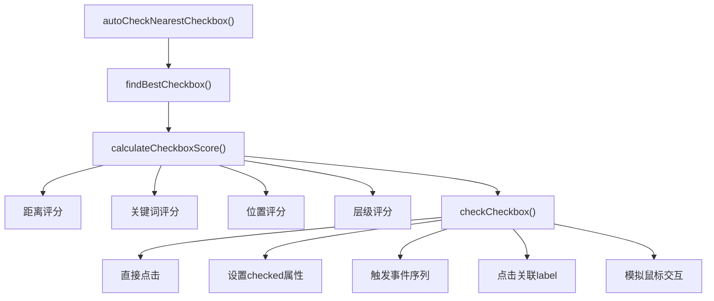

**图表来源**
- [entrypoints/content/CheckboxHandler.ts:16-104](file://entrypoints/content/CheckboxHandler.ts#L16-L104)
- [entrypoints/content/CheckboxHandler.ts:279-327](file://entrypoints/content/CheckboxHandler.ts#L279-L327)

**章节来源**
- [entrypoints/content/CheckboxHandler.ts:1-388](file://entrypoints/content/CheckboxHandler.ts#L1-L388)

### LoginFormAnalyzer（登录表单分析器，新增）
**更新**：新增登录表单和弹窗的智能识别

- 职责
  - 判断输入框是否位于登录表单或登录弹窗中
  - 通过多种启发式规则进行检测
- 关键实现要点
  - 使用 WeakMap 缓存检查结果，避免内存泄漏
  - 检测登录字段组合（用户名+密码、手机号+验证码）
  - 检测表单元素、容器关键词、弹窗角色、定位方式
  - 检查元素附近的登录相关字段和按钮
  - 支持固定/绝对定位的弹窗检测

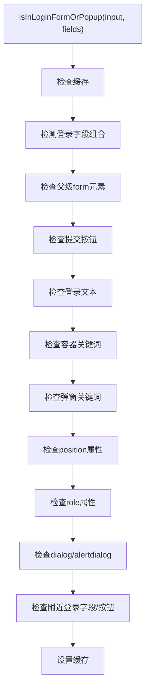

**图表来源**
- [entrypoints/content/LoginFormAnalyzer.ts:41-141](file://entrypoints/content/LoginFormAnalyzer.ts#L41-L141)

**章节来源**
- [entrypoints/content/LoginFormAnalyzer.ts:1-210](file://entrypoints/content/LoginFormAnalyzer.ts#L1-L210)

### InputFiller（输入填充器，新增）
**更新**：新增多种填充策略

- 职责
  - 提供多种策略来填充表单输入框的值
  - 依次尝试直到成功：原生setter + 完整事件序列、execCommand模拟用户输入、逐字符模拟输入
- 关键实现要点
  - 策略1：原生setter + 完整事件序列（focus -> select -> execCommand -> 设置值 -> 触发事件）
  - 策略2：execCommand模拟用户输入（selectAll -> insertText -> change事件）
  - 策略3：逐字符模拟输入（keydown -> input -> keyup事件序列）
  - 每个策略后都有验证步骤，确保值正确填充
  - 提供详细的填充结果反馈（filled、verified、strategy）

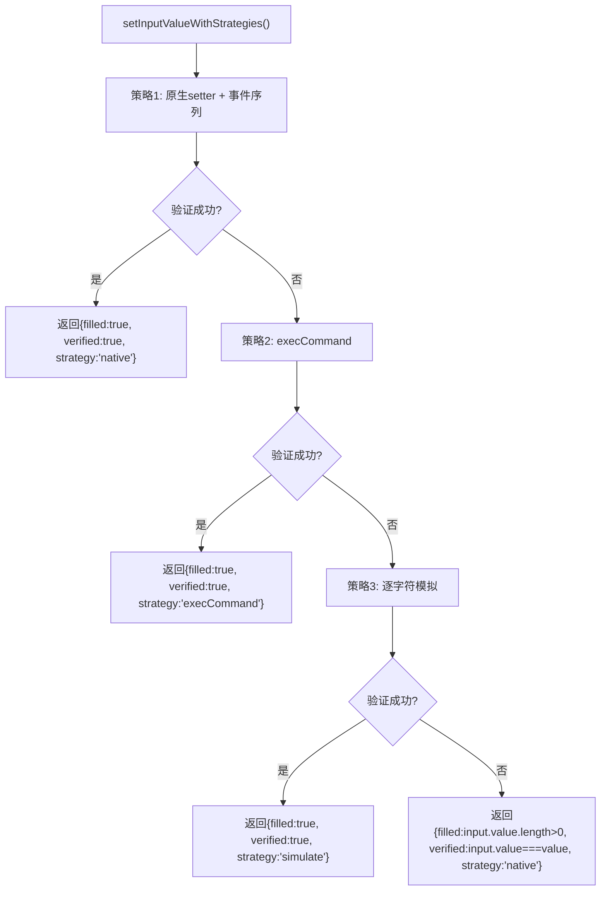

**图表来源**
- [entrypoints/content/InputFiller.ts:30-54](file://entrypoints/content/InputFiller.ts#L30-L54)
- [entrypoints/content/InputFiller.ts:61-108](file://entrypoints/content/InputFiller.ts#L61-L108)
- [entrypoints/content/InputFiller.ts:115-125](file://entrypoints/content/InputFiller.ts#L115-L125)
- [entrypoints/content/InputFiller.ts:132-152](file://entrypoints/content/InputFiller.ts#L132-L152)

**章节来源**
- [entrypoints/content/InputFiller.ts:1-162](file://entrypoints/content/InputFiller.ts#L1-L162)

### NativeNotification（原生通知组件，新增）
**更新**：新增原生通知显示功能

- 职责
  - 显示"未匹配到登录表单"的提示通知
  - 提供模拟 Element Plus ElMessage 样式的通知显示
- 关键实现要点
  - 支持四种通知类型：success、warning、info、error
  - 使用颜色映射配置背景色、边框色、文字色
  - 在页面右上角显示通知，3秒后自动消失
  - 支持图标显示和文本内容
  - 使用z-index: 2147483647 确保通知显示在最顶层

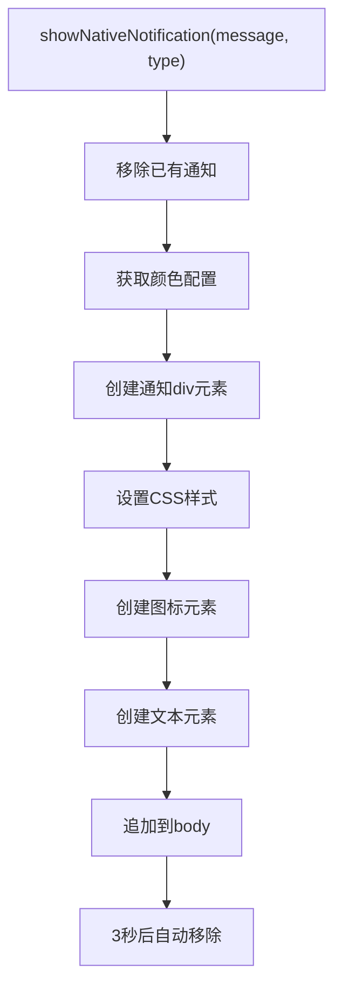

**图表来源**
- [entrypoints/content/NativeNotification.ts:47-95](file://entrypoints/content/NativeNotification.ts#L47-L95)

**章节来源**
- [entrypoints/content/NativeNotification.ts:1-96](file://entrypoints/content/NativeNotification.ts#L1-L96)

### Background Script（后台桥接）
- 职责
  - 监听安装事件、标签页更新/激活、快捷键命令。
  - 处理来自 Content/Side Panel 的消息：显示/隐藏侧边栏、URL 变化通知。
  - 打开选项页面、切换侧边栏显示状态。
- 生命周期
  - 扩展安装时初始化日志；常驻进程，监听全局事件。
- 关键实现要点
  - 使用 chrome.sidePanel API 控制侧边栏；对 API 可用性做降级处理。
  - 对消息处理采用异步响应并返回统一结构，便于前端诊断。
  - **更新**：通过多层tab ID检测策略避免重复打开或无法关闭的问题。当消息中未提供tabId时，优先使用sender.tab.id，如果仍为空则查询当前活动标签页，最后才抛出错误。
  - **更新**：增强了Chrome版本兼容性处理，对chrome.sidePanel API进行可用性检测，提供用户友好的错误提示和降级方案。

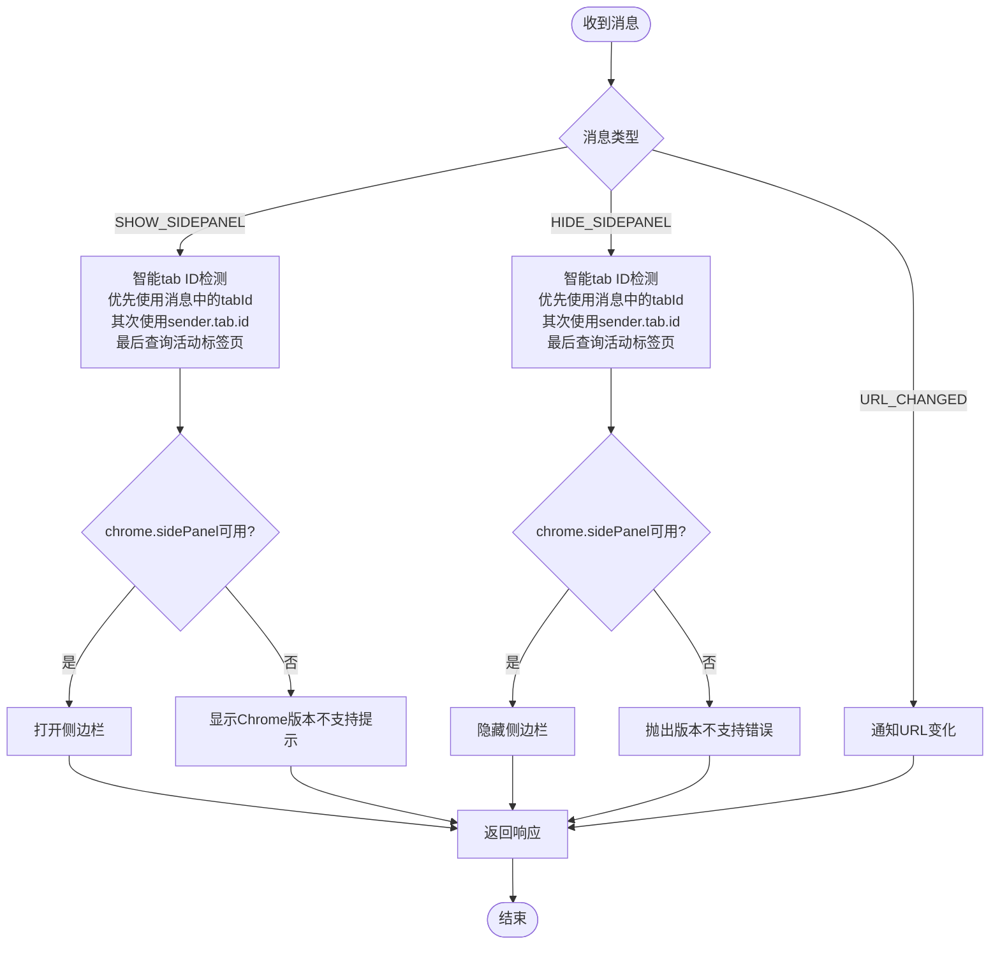

**图表来源**
- [entrypoints/background.ts:70-200](file://entrypoints/background.ts#L70-L200)
- [entrypoints/background.ts:205-207](file://entrypoints/background.ts#L205-L207)
- [entrypoints/background.ts:212-250](file://entrypoints/background.ts#L212-L250)

**章节来源**
- [entrypoints/background.ts:1-403](file://entrypoints/background.ts#L1-L403)

### Content Script（内容脚本）
- 职责
  - 页面 DOM 检测与登录表单识别，防抖优化与缓存策略。
  - 输入焦点事件委托与侧边栏显示/隐藏。
  - 接收来自 Side Panel 的填充指令并执行账号/密码填充。
  - 页面可见性、导航事件监听，URL 变化通知后台。
- 关键实现要点
  - 使用 MutationObserver 检测动态表单与按钮；事件委托减少监听器数量。
  - 字段类型缓存（WeakMap）、Set 提升查找效率，避免内存泄漏。
  - 填充时触发完整事件序列（input/change/键盘事件），并自动勾选最近的复选框。
  - 针对手机号+验证码场景，支持用户名字段作为手机号的兼容处理。
  - **更新**：增加了扩展上下文有效性检查，在执行任何操作前检查chrome.runtime?.id的存在性，防止Extension context invalidated错误。
  - **更新**：改进了错误处理机制，专门检测"Extension context invalidated"错误消息，提供用户友好的刷新页面提示。

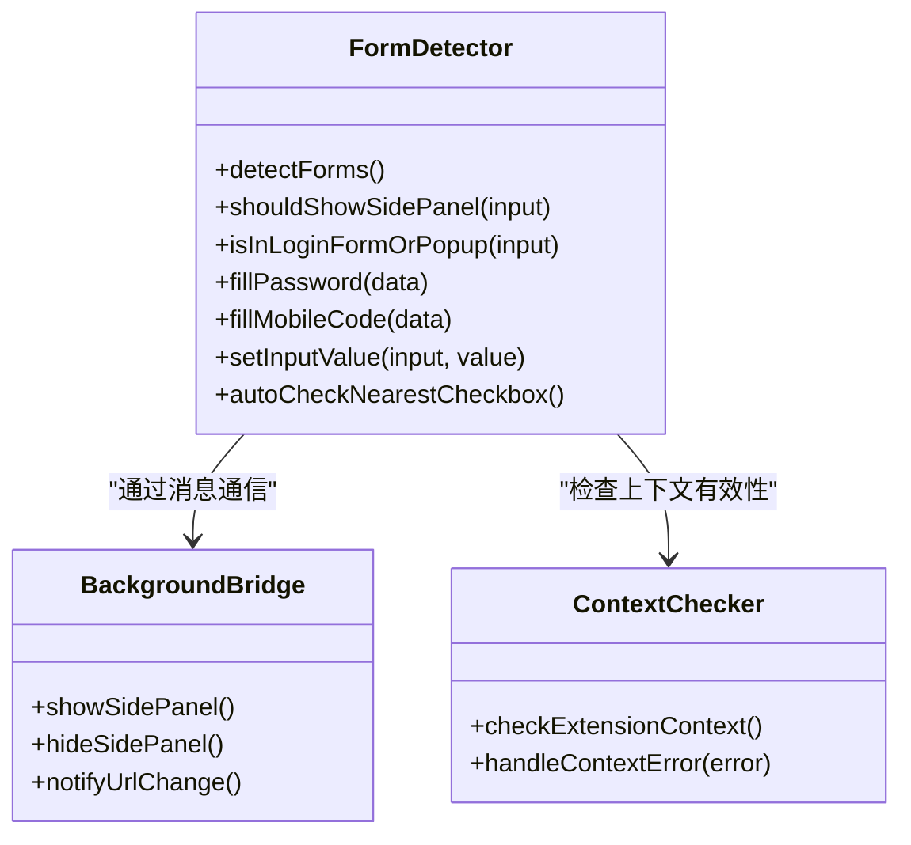

**图表来源**
- [entrypoints/content.ts:19-200](file://entrypoints/content.ts#L19-L200)
- [entrypoints/content.ts:108-112](file://entrypoints/content.ts#L108-L112)
- [entrypoints/content.ts:193-200](file://entrypoints/content.ts#L193-L200)
- [entrypoints/content.ts:412-493](file://entrypoints/content.ts#L412-L493)
- [entrypoints/content.ts:91-100](file://entrypoints/content.ts#L91-L100)

**章节来源**
- [entrypoints/content.ts:1-25](file://entrypoints/content.ts#L1-L25)

### Popup（弹出面板）
- 职责
  - 快速入口：打开选项页面、打开侧边栏。
  - 会话状态检查：若会话无效则引导至选项页面验证。
  - 显示密码数量统计（会话有效时）。
- 关键实现要点
  - 使用 StorageUtils 检查会话有效性；若无效则打开选项页面。
  - 通过 chrome.tabs API 打开/激活选项页面标签页，避免重复创建。
  - 侧边栏打开后自动关闭弹窗，提升用户体验。
  - **更新**：使用统一的Vue应用工厂函数进行初始化，简化了应用创建流程。

**章节来源**
- [entrypoints/popup/App.vue:1-264](file://entrypoints/popup/App.vue#L1-L264)
- [entrypoints/popup/main.ts:1-5](file://entrypoints/popup/main.ts#L1-L5)

### Side Panel（侧边栏面板）
- 职责
  - 认证状态监听：会话过期自动回退到未认证状态。
  - URL 变化监听：标签页更新/激活时更新当前域名并重新加载密码。
  - 密码列表加载与搜索：支持按用户名/标签/备注/URL 搜索与排序。
  - 填充执行：注入 Content Script 并发送填充消息，完成后隐藏侧边栏。
- 关键实现要点
  - 使用 chrome.storage.onChanged 监听会话状态变化，实时响应。
  - 通过 chrome.tabs.sendMessage 与 Content Script 通信，执行账号/密码填充。
  - 填充成功后主动请求 Background 隐藏侧边栏，保证状态一致。
  - **更新**：使用统一的Vue应用工厂函数进行初始化，简化了应用创建流程。
  - **更新**：使用组合式函数useChromeListeners管理Chrome API事件监听，自动清理避免内存泄漏。

**章节来源**
- [entrypoints/sidepanel/App.vue:1-1065](file://entrypoints/sidepanel/App.vue#L1-L1065)
- [entrypoints/sidepanel/main.ts:1-5](file://entrypoints/sidepanel/main.ts#L1-L5)
- [composables/useChromeListeners.ts:1-112](file://composables/useChromeListeners.ts#L1-L112)

### Options（选项页面）
- 职责
  - 主密码设置/验证：首次使用引导设置主密码，后续验证登录。
  - 有效期设置：可调整会话缓存时长，支持即时生效与会话清除。
  - 密码管理：增删改查、搜索、排序、复制、导入导出。
  - 调试与重置：查看主密码配置调试信息，重置所有数据。
- 关键实现要点
  - 会话过期事件监听：通过自定义事件触发页面回退到验证页。
  - 排序配置持久化：保存排序字段与方向，页面加载时恢复。
  - 数据导入导出：基于 Excel 工具链，支持模板下载与批量导入。
  - **更新**：使用统一的Vue应用工厂函数进行初始化，简化了应用创建流程。

**章节来源**
- [entrypoints/options/App.vue:1-2511](file://entrypoints/options/App.vue#L1-L2511)
- [entrypoints/options/main.ts:1-5](file://entrypoints/options/main.ts#L1-L5)

## 依赖关系分析
- 消息协议
  - 通过统一的 MessageType 枚举定义消息类型，确保前后端契约一致。
  - 消息结构包含 type 与 data 字段，便于扩展与兼容。
- 数据与状态
  - StorageUtils 提供主密码、排序配置、密码条目等本地存储封装。
  - SessionManager 周期性检查会话有效性，触发过期事件并清理会话。
- 外部依赖
  - Vue 3 + Element Plus 构建 UI；CryptoJS 实现加密；xlsx 支持 Excel 导入导出。
- **更新**：新增组件依赖关系
  - FormDetector 依赖 CheckboxHandler、LoginFormAnalyzer、InputFiller、NativeNotification
  - 所有入口点都依赖createVueApp.ts进行统一的Vue应用初始化
  - 统一的Element Plus引入和配置

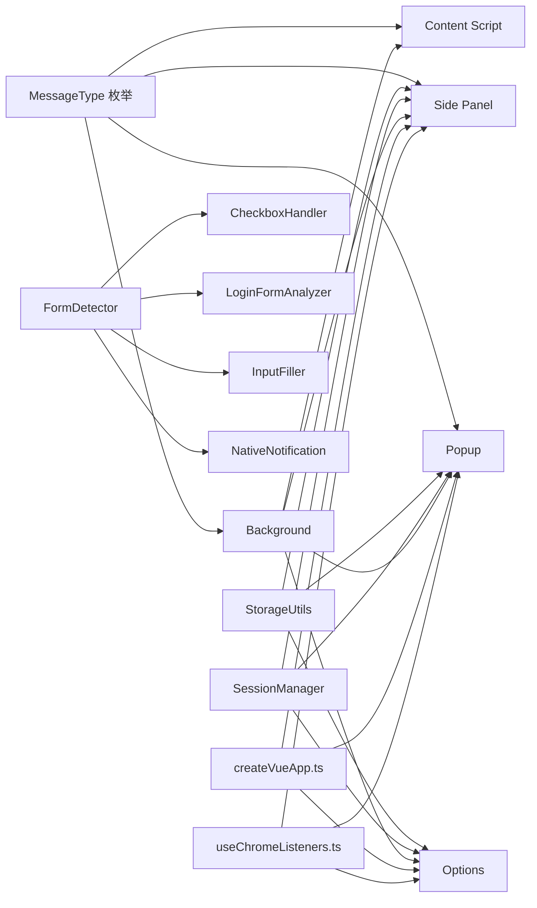

**图表来源**
- [utils/types.ts:62-123](file://utils/types.ts#L62-L123)
- [utils/storage.ts:1-1280](file://utils/storage.ts#L1-L1280)
- [utils/sessionManager.ts:1-87](file://utils/sessionManager.ts#L1-L87)
- [utils/createVueApp.ts:1-20](file://utils/createVueApp.ts#L1-L20)
- [composables/useChromeListeners.ts:1-112](file://composables/useChromeListeners.ts#L1-L112)
- [entrypoints/background.ts:1-403](file://entrypoints/background.ts#L1-L403)
- [entrypoints/content.ts:1-25](file://entrypoints/content.ts#L1-L25)
- [entrypoints/sidepanel/App.vue:1-1065](file://entrypoints/sidepanel/App.vue#L1-L1065)
- [entrypoints/popup/App.vue:1-264](file://entrypoints/popup/App.vue#L1-L264)
- [entrypoints/options/App.vue:1-2511](file://entrypoints/options/App.vue#L1-L2511)
- [entrypoints/content/FormDetector.ts:61-66](file://entrypoints/content/FormDetector.ts#L61-L66)

**章节来源**
- [utils/types.ts:1-246](file://utils/types.ts#L1-L246)
- [utils/storage.ts:1-1280](file://utils/storage.ts#L1-L1280)
- [utils/sessionManager.ts:1-87](file://utils/sessionManager.ts#L1-L87)
- [utils/createVueApp.ts:1-20](file://utils/createVueApp.ts#L1-L20)
- [package.json:22-46](file://package.json#L22-L46)

## 性能考量
- DOM 检测与事件
  - 使用 MutationObserver 与事件委托，降低监听器数量与内存占用。
  - 表单检测采用防抖与缓存（WeakMap/Set）提升响应速度与稳定性。
  - **更新**：新增组件的性能优化
    - CheckboxHandler 使用 WeakMap 缓存计算结果
    - LoginFormAnalyzer 使用 WeakMap 缓存检查结果
    - InputFiller 提供多种策略，自动选择最优方案
- 填充流程
  - 触发完整事件序列确保第三方表单逻辑兼容；填充后延迟隐藏侧边栏，避免竞态。
  - **更新**：增强的填充流程
    - 多策略填充算法，自动选择最适合的填充方式
    - 填充结果验证，确保数据正确性
    - 自动勾选复选框，提升用户体验
- 存储与会话
  - 会话状态周期性检查，避免长时间占用资源；排序配置本地持久化，减少每次计算成本。
- UI 体验
  - 侧边栏打开/隐藏采用幂等 API，避免重复操作带来的性能损耗。
  - **更新**：Vue应用初始化优化
    - 统一的Vue应用工厂函数减少了重复代码，提高了初始化效率
    - Element Plus的统一引入避免了重复加载
- **更新**：错误处理优化
  - Content Script在执行任何操作前进行上下文检查，避免无效操作导致的性能浪费。
  - Background Script的tab ID检测采用多层fallback策略，减少不必要的API调用。
  - 新增组件的错误处理和降级策略，提升整体稳定性。

## 故障排查指南
- 侧边栏无法打开/隐藏
  - 检查 chrome.sidePanel API 是否可用；确认标签页 ID 获取成功。
  - 若 API 不可用，需引导用户升级 Chrome 版本。
  - **更新**：检查tab ID获取的多层fallback逻辑，确保在不同情况下都能正确获取tabId。
- 填充失败
  - 确认 Content Script 已注入；检查消息类型与参数是否正确。
  - 观察事件分发是否成功，必要时增加日志定位。
  - **更新**：检查扩展上下文有效性，确认chrome.runtime.id是否仍然有效。
  - **更新**：检查FormDetector的填充流程，确认各组件是否正常工作。
- 会话过期
  - 监听 sessionExpired 事件并回退到验证页；检查有效期设置与剩余时间。
- 选项页面无法打开
  - 使用 chrome.tabs.query 检查是否已存在标签页，避免重复创建。
- **更新**：Vue应用初始化问题
  - 检查createVueApp函数是否正确导入和使用
  - 确认Element Plus的CSS样式是否正确加载
- **更新**：新增组件问题排查
  - CheckboxHandler：检查复选框选择器和关键词配置
  - LoginFormAnalyzer：检查表单检测逻辑和缓存机制
  - InputFiller：检查填充策略和事件触发
  - NativeNotification：检查样式注入和DOM元素创建
- **更新**：扩展上下文失效问题
  - 当出现"Extension context invalidated"错误时，提示用户刷新页面。
  - 检查chrome.runtime.id的存在性，避免在无效上下文中执行操作。

**章节来源**
- [entrypoints/background.ts:70-200](file://entrypoints/background.ts#L70-L200)
- [entrypoints/content.ts:108-112](file://entrypoints/content.ts#L108-L112)
- [entrypoints/sidepanel/App.vue:412-493](file://entrypoints/sidepanel/App.vue#L412-L493)
- [utils/sessionManager.ts:27-66](file://utils/sessionManager.ts#L27-L66)
- [utils/createVueApp.ts:1-20](file://utils/createVueApp.ts#L1-L20)
- [entrypoints/content/FormDetector.ts:718-795](file://entrypoints/content/FormDetector.ts#L718-L795)
- [entrypoints/content/CheckboxHandler.ts:16-37](file://entrypoints/content/CheckboxHandler.ts#L16-L37)
- [entrypoints/content/LoginFormAnalyzer.ts:41-141](file://entrypoints/content/LoginFormAnalyzer.ts#L41-L141)
- [entrypoints/content/InputFiller.ts:30-54](file://entrypoints/content/InputFiller.ts#L30-L54)
- [entrypoints/content/NativeNotification.ts:47-95](file://entrypoints/content/NativeNotification.ts#L47-L95)

## 结论
本扩展通过清晰的入口点划分与统一的消息协议，实现了从页面感知、侧边栏控制到配置管理的完整闭环。借助缓存、防抖与会话管理等策略，兼顾了性能与可靠性。**更新**：通过新增的Vue应用工厂函数，进一步简化了入口点的初始化流程，提高了代码复用性和维护性。**更新**：通过增强的错误处理和上下文检测机制，进一步提升了扩展的稳定性和用户体验。**更新**：新增的FormDetector及其组件大幅提升了表单检测的智能化程度，提供了更强大的密码填充能力。建议在后续迭代中进一步完善侧边栏关闭能力、增强表单识别鲁棒性，并持续优化填充事件的兼容性。

## 附录

### 消息通信协议（MessageType）
- PING：心跳检测
- DETECT_FORM：检测表单（当前未在代码中使用）
- FILL_PASSWORD：填充账号+密码
- FILL_MOBILE_CODE：填充手机号+验证码（当前实现合并为账号密码）
- SHOW_SIDEPANEL/HIDE_SIDEPANEL：显示/隐藏侧边栏
- URL_CHANGED：URL 变化通知
- GET_PASSWORDS：获取密码列表（当前未在代码中使用）
- **更新**：新增消息类型
  - TOGGLE_SIDEPANEL：切换侧边栏显示状态
  - CLOSE_SIDEPANEL：关闭侧边栏
  - OPEN_OPTIONS_PAGE：打开选项页面
  - GET_CACHED_PASSWORDS：获取缓存的密码列表
  - UPDATE_PASSWORD_CACHE：更新密码缓存
  - INVALIDATE_PASSWORD_CACHE：使密码缓存失效

**章节来源**
- [utils/types.ts:62-123](file://utils/types.ts#L62-L123)

### 权限与快捷键
- 权限
  - storage、activeTab、scripting、sidePanel
- 快捷键
  - Ctrl+Shift+P 打开选项页面
  - Ctrl+Shift+L 打开/关闭侧边栏

**章节来源**
- [wxt.config.ts:18-46](file://wxt.config.ts#L18-L46)

### 错误处理与上下文检测机制
**更新**：扩展的错误处理和上下文检测机制

#### Background Script 错误处理
- **智能tab ID检测**：采用三层检测策略
  1. 优先使用消息中传来的tabId
  2. 其次使用sender.tab.id
  3. 最后查询当前活动标签页
- **Chrome版本兼容性**：对chrome.sidePanel API进行可用性检测
  - API可用时正常处理
  - API不可用时提供用户友好的错误提示
  - 记录详细的错误日志便于调试

#### Content Script 上下文检测
- **扩展上下文检查**：在执行任何操作前检查chrome.runtime?.id
- **错误降级处理**：专门检测"Extension context invalidated"错误
  - 提供用户友好的刷新页面提示
  - 避免在无效上下文中执行操作
  - 重置内部状态以便下次重试

#### 新增组件的错误处理机制
**更新**：新增组件的错误处理和降级策略

- **FormDetector**：统一的错误捕获和日志记录
- **CheckboxHandler**：复选框勾选失败的降级处理
- **LoginFormAnalyzer**：表单检测失败的缓存清理
- **InputFiller**：填充策略失败的自动切换
- **NativeNotification**：通知显示失败的降级处理

#### Vue应用工厂函数
**更新**：新增的Vue应用工厂函数机制
- **统一初始化**：提供createAndMountApp函数简化Vue应用创建
- **自动配置**：自动引入Element Plus UI库和样式
- **标准化流程**：统一的挂载选择器和应用实例返回

#### 错误降级策略
- **API可用性检测**：在调用任何Chrome API前进行可用性检查
- **用户友好提示**：提供清晰的错误信息和解决方案
- **状态重置**：错误发生后重置内部状态，避免状态污染

**章节来源**
- [entrypoints/background.ts:70-200](file://entrypoints/background.ts#L70-L200)
- [entrypoints/content.ts:108-112](file://entrypoints/content.ts#L108-L112)
- [entrypoints/content.ts:193-200](file://entrypoints/content.ts#L193-L200)
- [utils/createVueApp.ts:1-20](file://utils/createVueApp.ts#L1-L20)
- [entrypoints/content/FormDetector.ts:486-504](file://entrypoints/content/FormDetector.ts#L486-L504)
- [entrypoints/content/CheckboxHandler.ts:324-327](file://entrypoints/content/CheckboxHandler.ts#L324-L327)
- [entrypoints/content/LoginFormAnalyzer.ts:139-140](file://entrypoints/content/LoginFormAnalyzer.ts#L139-L140)
- [entrypoints/content/InputFiller.ts:104-108](file://entrypoints/content/InputFiller.ts#L104-L108)
- [entrypoints/content/NativeNotification.ts:324-327](file://entrypoints/content/NativeNotification.ts#L324-L327)