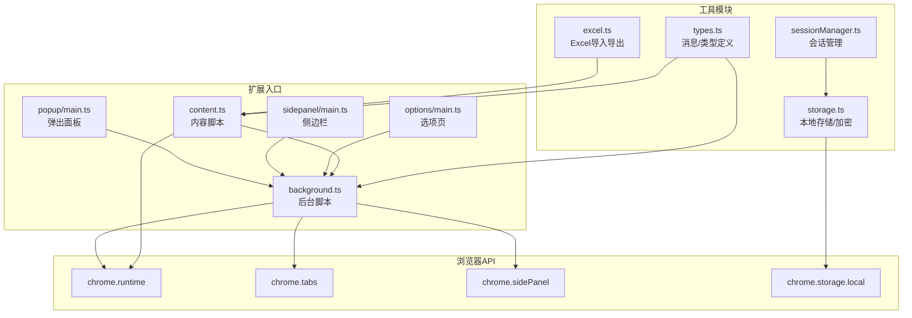
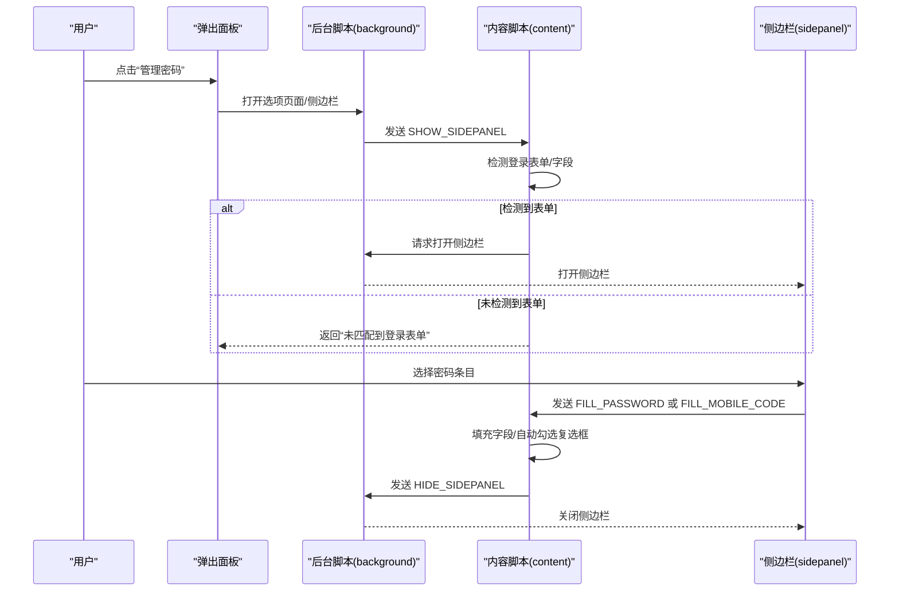
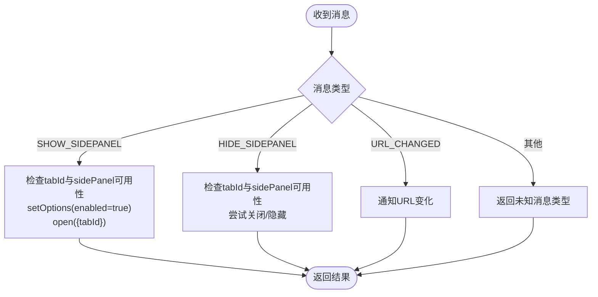
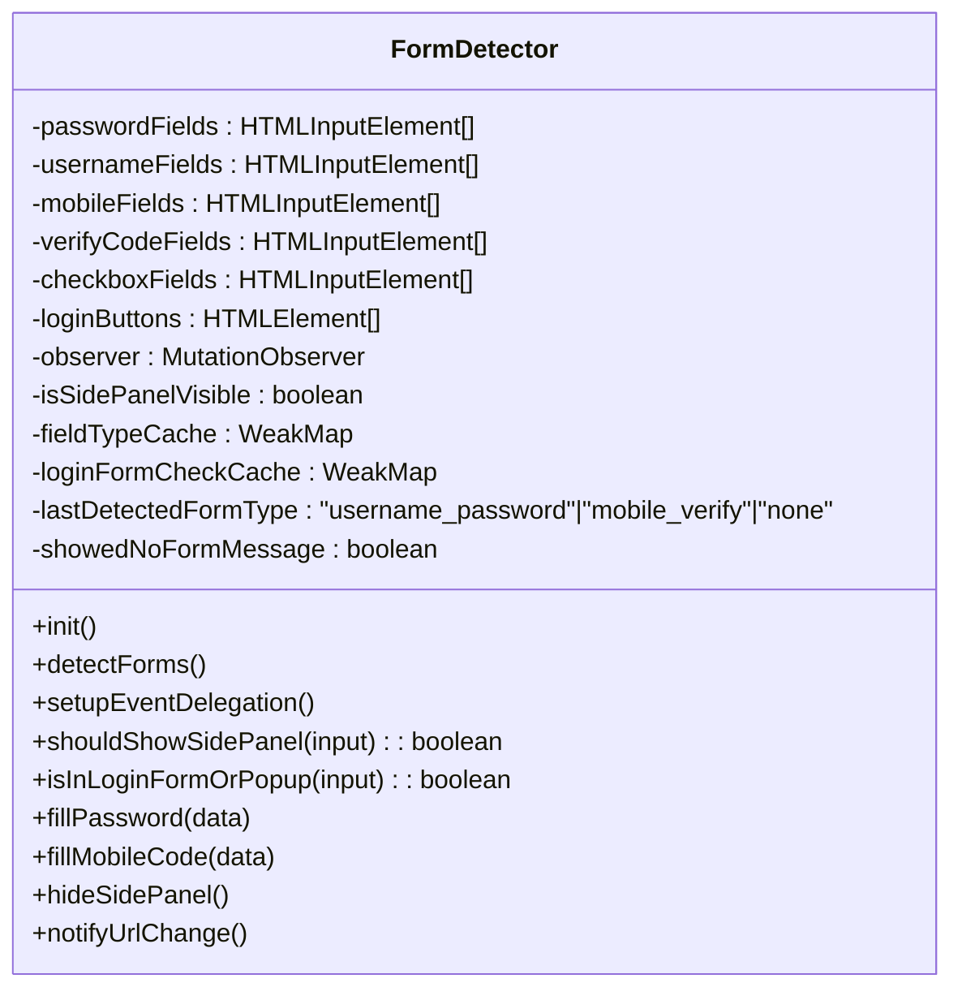
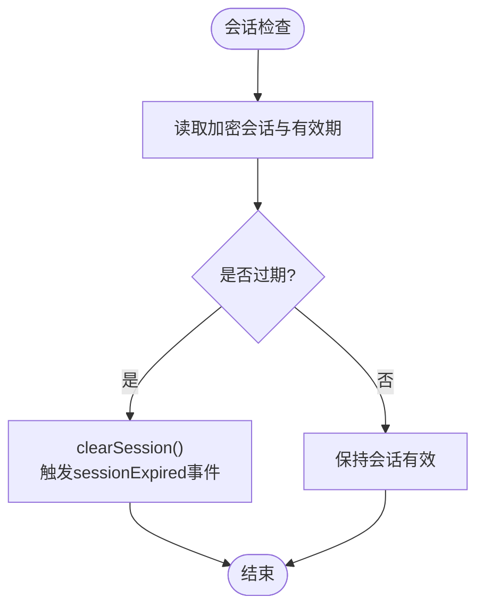
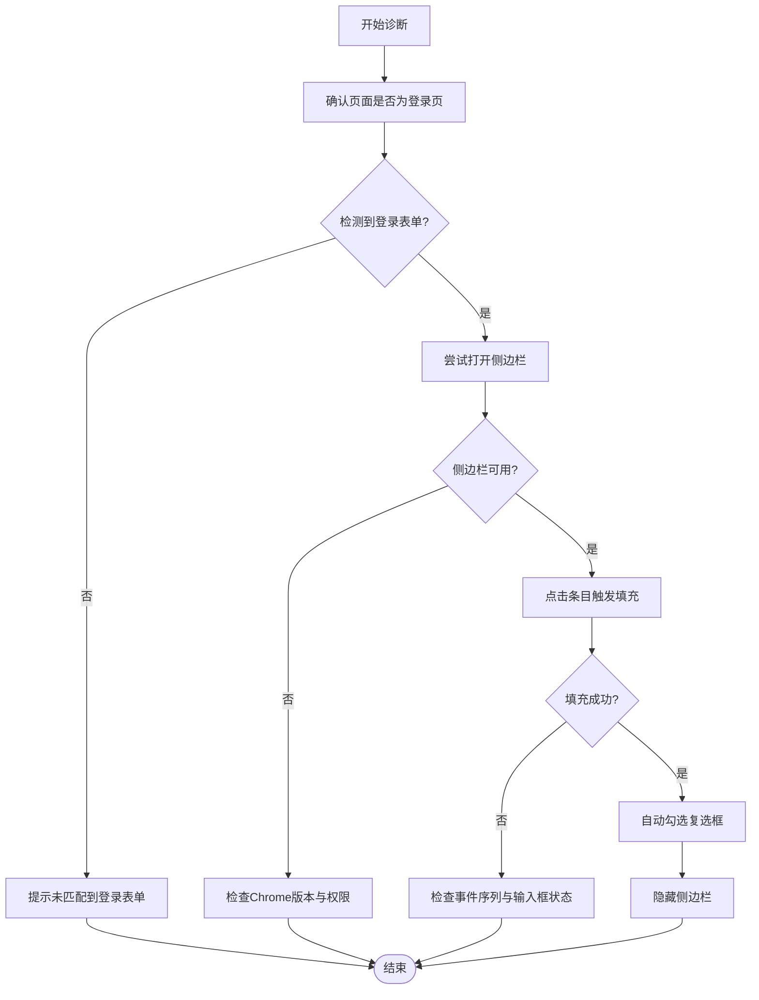

# 故障排除

<cite>
**本文引用的文件**
- [README.md](file://README.md)
- [package.json](file://package.json)
- [wxt.config.ts](file://wxt.config.ts)
- [entrypoints/background.ts](file://entrypoints/background.ts)
- [entrypoints/content.ts](file://entrypoints/content.ts)
- [utils/storage.ts](file://utils/storage.ts)
- [utils/sessionManager.ts](file://utils/sessionManager.ts)
- [utils/excel.ts](file://utils/excel.ts)
- [utils/types.ts](file://utils/types.ts)
- [entrypoints/popup/main.ts](file://entrypoints/popup/main.ts)
- [entrypoints/options/main.ts](file://entrypoints/options/main.ts)
- [entrypoints/sidepanel/main.ts](file://entrypoints/sidepanel/main.ts)
</cite>

## 目录
1. [简介](#简介)
2. [项目结构](#项目结构)
3. [核心组件](#核心组件)
4. [架构总览](#架构总览)
5. [详细组件分析](#详细组件分析)
6. [依赖分析](#依赖分析)
7. [性能考量](#性能考量)
8. [故障排除指南](#故障排除指南)
9. [结论](#结论)
10. [附录](#附录)

## 简介
本指南面向技术支持与高级用户，系统化梳理 Account Password Helper 插件在安装、功能、性能与兼容性方面的常见问题与解决方案；提供调试方法、日志分析技巧、问题诊断流程，并重点覆盖 Chrome 扩展特有问题（权限、消息通信、DOM 操作）。文档同时给出性能优化建议、内存泄漏检测与资源占用分析方法，并汇总用户反馈与官方解决方案。

## 项目结构
插件采用 WXT + Vue3 + TypeScript 架构，核心入口分为 background（后台）、content（注入脚本）、popup（弹出面板）、sidepanel（侧边栏）、options（选项页）五个入口，配合工具模块（存储、会话、Excel、类型定义）实现密码管理与自动填充能力。

**图表来源**
- [entrypoints/background.ts](file://entrypoints/background.ts#L1-L232)
- [entrypoints/content.ts](file://entrypoints/content.ts#L1-L1892)
- [utils/storage.ts](file://utils/storage.ts#L1-L981)
- [utils/sessionManager.ts](file://utils/sessionManager.ts#L1-L87)
- [utils/excel.ts](file://utils/excel.ts#L1-L155)
- [utils/types.ts](file://utils/types.ts#L1-L96)
- [entrypoints/popup/main.ts](file://entrypoints/popup/main.ts#L1-L10)
- [entrypoints/options/main.ts](file://entrypoints/options/main.ts#L1-L11)
- [entrypoints/sidepanel/main.ts](file://entrypoints/sidepanel/main.ts#L1-L10)

**章节来源**
- [wxt.config.ts](file://wxt.config.ts#L1-L48)
- [package.json](file://package.json#L1-L49)

## 核心组件
- 后台脚本（background.ts）：负责快捷键、侧边栏开关、标签页事件、消息路由与错误日志输出。
- 内容脚本（content.ts）：负责表单检测、侧边栏显示/隐藏、密码/验证码填充、复选框自动勾选、事件监听与 MutationObserver。
- 存储与会话（storage.ts、sessionManager.ts）：负责主密码校验、数据加解密、会话有效期控制、排序与搜索、导出/导入辅助。
- Excel 工具（excel.ts）：负责模板下载、导入解析、导出写入。
- 类型与消息（types.ts）：统一消息类型与数据结构，保障跨脚本通信一致性。
- 入口应用（popup/main.ts、sidepanel/main.ts、options/main.ts）：Vue 应用挂载点，承载 UI 交互。

**章节来源**
- [entrypoints/background.ts](file://entrypoints/background.ts#L1-L232)
- [entrypoints/content.ts](file://entrypoints/content.ts#L1-L1892)
- [utils/storage.ts](file://utils/storage.ts#L1-L981)
- [utils/sessionManager.ts](file://utils/sessionManager.ts#L1-L87)
- [utils/excel.ts](file://utils/excel.ts#L1-L155)
- [utils/types.ts](file://utils/types.ts#L1-L96)
- [entrypoints/popup/main.ts](file://entrypoints/popup/main.ts#L1-L10)
- [entrypoints/sidepanel/main.ts](file://entrypoints/sidepanel/main.ts#L1-L10)
- [entrypoints/options/main.ts](file://entrypoints/options/main.ts#L1-L11)

## 架构总览
消息通信采用 chrome.runtime.sendMessage/onMessage，content 与 background 之间通过 MessageType 枚举约定消息类型，确保填充、侧边栏控制、URL 变更等流程一致可靠。

**图表来源**
- [entrypoints/background.ts](file://entrypoints/background.ts#L34-L73)
- [entrypoints/content.ts](file://entrypoints/content.ts#L993-L1028)
- [utils/types.ts](file://utils/types.ts#L54-L87)

## 详细组件分析

### 后台脚本（background.ts）
- 负责快捷键 open_options/toggle_sidepanel 的监听与执行。
- 统一处理来自 content 的 SHOW/HIDE_SIDEPANEL、URL_CHANGED 消息。
- 侧边栏控制通过 chrome.sidePanel.open/setOptions，兼容旧版 API 的降级与错误日志。
- 标签页状态变更（完成加载、激活）时尝试关闭侧边栏，避免残留。

**图表来源**
- [entrypoints/background.ts](file://entrypoints/background.ts#L34-L73)
- [entrypoints/background.ts](file://entrypoints/background.ts#L76-L138)

**章节来源**
- [entrypoints/background.ts](file://entrypoints/background.ts#L1-L232)

### 内容脚本（content.ts）
- 表单检测：基于 MutationObserver 与多种选择器，识别用户名/密码、手机号/验证码、登录按钮、复选框。
- 事件委托：使用 focusin 事件委托，降低监听器数量，提升性能。
- 侧边栏控制：通过 sendMessage 与后台通信，支持防抖显示、无表单提示、URL 变更通知。
- 填充逻辑：分别处理账号密码与手机号验证码组合，触发完整事件序列并自动勾选最近复选框。
- 可见性与导航：监听页面隐藏、窗口失焦、beforeunload、SPA 路由变化，自动隐藏侧边栏。

**图表来源**
- [entrypoints/content.ts](file://entrypoints/content.ts#L22-L1892)

**章节来源**
- [entrypoints/content.ts](file://entrypoints/content.ts#L1-L1892)

### 存储与会话（storage.ts、sessionManager.ts）
- 主密码：MD5 + 盐值存储配置，PBKDF2 派生密钥，AES-256-CBC 加密密码字段。
- 会话：基于 chrome.storage.local 的加密会话缓存，定时检查有效期，过期触发清理与事件广播。
- 数据操作：保存/更新/删除/批量删除、按 URL/关键词搜索、排序配置持久化与应用。
- Excel：导出字段映射、导入列名兼容、模板下载。

**图表来源**
- [utils/sessionManager.ts](file://utils/sessionManager.ts#L27-L66)
- [utils/storage.ts](file://utils/storage.ts#L793-L841)

**章节来源**
- [utils/storage.ts](file://utils/storage.ts#L1-L981)
- [utils/sessionManager.ts](file://utils/sessionManager.ts#L1-L87)
- [utils/excel.ts](file://utils/excel.ts#L1-L155)

### 类型与消息（types.ts）
- MessageType 枚举：PING、DETECT_FORM、FILL_PASSWORD、FILL_MOBILE_CODE、SHOW_SIDEPANEL、HIDE_SIDEPANEL、URL_CHANGED、GET_PASSWORDS。
- Message 接口：type + data，保证跨脚本通信一致性。

**章节来源**
- [utils/types.ts](file://utils/types.ts#L1-L96)

## 依赖分析
- 构建与框架：WXT + Vue3 + TypeScript，Element Plus UI。
- 加解密：crypto-js（MD5、PBKDF2、AES）。
- Excel：xlsx。
- 权限：storage、activeTab、scripting、sidePanel；host_permissions: <all_urls>。
- 快捷键：open_options（Ctrl+Shift+P / Cmd+Shift+P）、toggle_sidepanel（Ctrl+Shift+L / Cmd+Shift+L）。

**章节来源**
- [package.json](file://package.json#L1-L49)
- [wxt.config.ts](file://wxt.config.ts#L18-L46)

## 性能考量
- 内容脚本优化
  - 使用 WeakMap/WeakSet 缓存字段类型与检测结果，避免内存泄漏。
  - MutationObserver 仅监听关键属性与新增节点，延迟重检策略（短/中/长延时）平衡实时性与性能。
  - 事件委托（focusin）替代为每个字段单独绑定监听，显著降低监听器数量。
  - 防抖显示侧边栏（150ms），避免频繁触发。
- 存储与会话
  - PBKDF2 迭代次数提升安全性；AES-256-CBC 增强数据保护。
  - 会话有效期默认 24 小时，内存缓存 sessionEncryptionKey 与 sessionValidityHours，减少重复派生与查询。
- Excel 导入导出
  - sheet_to_json 后过滤无效条目，避免空用户名导致的异常。

**章节来源**
- [entrypoints/content.ts](file://entrypoints/content.ts#L38-L68)
- [entrypoints/content.ts](file://entrypoints/content.ts#L93-L170)
- [utils/storage.ts](file://utils/storage.ts#L164-L186)
- [utils/storage.ts](file://utils/storage.ts#L191-L214)
- [utils/excel.ts](file://utils/excel.ts#L68-L96)

## 故障排除指南

### 一、安装与加载问题
- 症状
  - 插件无法加载或报错。
  - 侧边栏不显示。
- 诊断步骤
  - 确认已使用构建命令生成产物并以“已解压扩展”方式加载。
  - 检查 Chrome 版本是否支持 sidePanel API（Chrome 114+）。
  - 核对 manifest 权限与 host_permissions 是否包含所需站点。
- 解决方案
  - 使用构建命令生成 .output/chrome-mv3 并加载。
  - 升级 Chrome 至 114+；若版本过低，侧边栏 API 不可用。
  - 如需访问特定站点，确保 host_permissions 生效。

**章节来源**
- [README.md](file://README.md#L64-L83)
- [wxt.config.ts](file://wxt.config.ts#L18-L24)

### 二、功能异常

#### 1. 侧边栏不显示/无法打开
- 症状
  - 点击输入框后侧边栏未出现。
- 诊断步骤
  - 检查 content 是否检测到登录表单（用户名+密码或手机号+验证码组合）。
  - 查看后台日志：是否抛出“不支持sidePanel API”或“无法获取标签ID”。
  - 确认后台已监听 SHOW_SIDEPANEL 并调用 chrome.sidePanel.open。
- 解决方案
  - 若未检测到表单，content 会提示“未匹配到登录表单”，请在正确的登录页操作。
  - 确保 Chrome 版本支持 sidePanel；否则升级浏览器。
  - 检查标签页 ID 是否有效；若无效，刷新页面或重新聚焦标签页。

**章节来源**
- [entrypoints/content.ts](file://entrypoints/content.ts#L993-L1008)
- [entrypoints/background.ts](file://entrypoints/background.ts#L76-L109)

#### 2. 密码填充不生效
- 症状
  - 点击侧边栏条目后页面未填充。
- 诊断步骤
  - 确认 content 已收到 FILL_PASSWORD/FILL_MOBILE_CODE 消息。
  - 检查对应输入框是否存在（可见且可交互），事件序列是否触发（focus/input/change/blur）。
  - 若为手机号+验证码场景，确认验证码字段是否需要手动填写。
- 解决方案
  - 确保页面已完全加载；动态表单需刷新后重试。
  - 手动触发输入框焦点，再次点击填充。
  - 对于手机号+验证码场景，验证码字段通常不自动填充，按页面提示手动输入。

**章节来源**
- [entrypoints/content.ts](file://entrypoints/content.ts#L1184-L1217)
- [entrypoints/content.ts](file://entrypoints/content.ts#L1222-L1306)

#### 3. 自动勾选复选框异常
- 症状
  - 填充后未勾选“记住我”等复选框。
- 诊断步骤
  - 检查 content 是否检测到复选框集合，是否找到最佳候选。
  - 查看复选框标签文本评分与位置评分，确认是否命中预期项。
- 解决方案
  - 调整表单布局或复选框标签文案，使其更易识别。
  - 手动勾选或等待下一次自动勾选尝试。

**章节来源**
- [entrypoints/content.ts](file://entrypoints/content.ts#L1377-L1525)

#### 4. Excel 导入/导出失败
- 症状
  - 导入报错“文件格式不正确”或“缺少用户名列”。
  - 导出文件无法打开或列名不匹配。
- 诊断步骤
  - 确认导入文件第一张表存在，列名包含“用户名/密码/URL/标签/备注”之一。
  - 导出列宽与模板一致，文件未被杀软拦截。
- 解决方案
  - 使用“下载模板”生成标准格式，按模板填写。
  - 导入前检查文件编码与格式，确保为 .xlsx。

**章节来源**
- [utils/excel.ts](file://utils/excel.ts#L48-L114)
- [utils/excel.ts](file://utils/excel.ts#L119-L155)
- [README.md](file://README.md#L135-L150)

#### 5. 主密码相关问题
- 症状
  - 忘记主密码；验证失败；查看/导出数据时报错。
- 诊断步骤
  - 检查主密码配置是否存在，盐值与哈希是否正确。
  - 确认会话是否过期，是否需要重新创建会话。
- 解决方案
  - 忘记主密码无法找回，需清空数据后重设；建议定期导出备份。
  - 验证失败时，确认输入密码与盐值匹配；必要时重新设置主密码。
  - 会话过期将触发清理，重新输入主密码创建会话。

**章节来源**
- [README.md](file://README.md#L174-L196)
- [utils/storage.ts](file://utils/storage.ts#L119-L143)
- [utils/storage.ts](file://utils/storage.ts#L865-L894)
- [utils/sessionManager.ts](file://utils/sessionManager.ts#L57-L66)

### 三、性能问题

- 症状
  - 页面卡顿、侧边栏打开慢、填充延迟明显。
- 诊断步骤
  - 检查 MutationObserver 是否频繁触发，是否存在大量动态节点。
  - 查看事件委托是否生效，焦点事件监听数量是否过多。
  - 评估 AES 加解密与 PBKDF2 迭代次数对首帧的影响。
- 优化建议
  - 保持防抖与延迟重检策略，避免高频检测。
  - 使用 WeakMap/WeakSet 缓存，减少对象持有导致的 GC 压力。
  - 适当降低 PBKDF2 迭代次数（权衡安全与性能）。
  - 分批处理大量数据（导入/导出）与排序。

**章节来源**
- [entrypoints/content.ts](file://entrypoints/content.ts#L9-L19)
- [entrypoints/content.ts](file://entrypoints/content.ts#L93-L170)
- [utils/storage.ts](file://utils/storage.ts#L174-L186)

### 四、兼容性问题

- 症状
  - 旧版 Chrome 不支持 sidePanel API；快捷键冲突。
- 诊断步骤
  - 检查浏览器版本与 manifest 中 permissions/host_permissions。
  - 确认快捷键是否被其他扩展占用。
- 解决方案
  - 升级至支持 sidePanel 的 Chrome 版本。
  - 在扩展管理页面修改快捷键设置。

**章节来源**
- [wxt.config.ts](file://wxt.config.ts#L22-L40)
- [README.md](file://README.md#L192-L194)

### 五、Chrome 扩展特有问题

- 权限问题
  - 症状：无法访问某些站点或无法读取存储。
  - 解决：确认 host_permissions 与 activeTab/scripting 权限已授予；在受控站点测试。
- 消息通信失败
  - 症状：content 无法收到后台消息或返回未知类型。
  - 解决：检查 MessageType 是否一致；确保后台 onMessage 返回 true 以保持通道开放。
- DOM 操作异常
  - 症状：事件分发失败、输入框值未更新。
  - 解决：使用原生 setter 与事件序列触发；对异常事件进行 try/catch 降级处理。

**章节来源**
- [utils/types.ts](file://utils/types.ts#L54-L87)
- [entrypoints/background.ts](file://entrypoints/background.ts#L34-L73)
- [entrypoints/content.ts](file://entrypoints/content.ts#L1308-L1375)

### 六、调试方法与日志分析

- 日志定位
  - 后台：handleShowSidePanel/handleHideSidePanel/URL_CHANGED 错误日志。
  - 内容：表单检测、填充、侧边栏控制、URL 变更通知的日志。
  - 存储：主密码设置/验证、会话创建/清理、Excel 导入/导出错误。
- 调试技巧
  - 在后台与内容脚本中增加条件断点，观察消息类型与参数。
  - 使用浏览器开发者工具的“网络/扩展”面板检查 sidePanel API 调用与权限。
  - 对关键路径（填充、加解密、MutationObserver）添加计时器，评估耗时。
- 诊断流程图

**图表来源**
- [entrypoints/content.ts](file://entrypoints/content.ts#L993-L1028)
- [entrypoints/background.ts](file://entrypoints/background.ts#L76-L138)

### 七、内存泄漏与资源占用

- 风险点
  - 大量监听器与闭包持有 DOM 引用；WeakMap/WeakSet 使用不当。
  - MutationObserver 未断开；定时器未清理。
- 检测方法
  - 使用 Performance/Heap 工具观察对象增长趋势。
  - 检查是否存在长期存活的闭包引用输入框/按钮。
- 修复建议
  - 确保 MutationObserver.disconnect() 与定时器清理。
  - 使用 WeakMap/WeakSet 缓存 DOM 引用，避免强引用链。
  - 控制事件委托范围，避免过度捕获。

**章节来源**
- [entrypoints/content.ts](file://entrypoints/content.ts#L38-L68)
- [entrypoints/content.ts](file://entrypoints/content.ts#L93-L170)
- [utils/sessionManager.ts](file://utils/sessionManager.ts#L48-L55)

### 八、用户反馈与官方解决方案

- 常见问题
  - 忘记主密码无法找回，建议定期导出备份。
  - 侧边栏不显示，需确认 Chrome 版本与插件安装状态。
  - Excel 导入失败，需使用模板并确保列名正确。
  - 密码填充不生效，需刷新页面或手动触发焦点。
  - 快捷键冲突，可在扩展管理页面修改。
- 官方建议
  - 首次使用设置主密码并妥善保管。
  - 定期导出数据，防止意外丢失。
  - 使用最新版 Chrome 以获得完整功能支持。

**章节来源**
- [README.md](file://README.md#L174-L196)

## 结论
本指南围绕安装、功能、性能与兼容性四类问题，结合代码实现细节，提供了系统化的诊断与修复路径。通过理解消息通信、表单检测、存储与会话机制，以及 Chrome 扩展特有约束，可高效定位并解决问题。建议在生产环境中持续监控日志、关注内存与性能指标，并定期备份数据以降低风险。

## 附录

### A. 快速检查清单
- 浏览器版本与权限：是否满足 sidePanel API 与 host_permissions。
- 页面状态：是否为登录页，表单是否可见且可交互。
- 消息通道：MessageType 是否一致，onMessage 是否返回 true。
- 存储状态：主密码配置与会话是否有效。
- Excel 模板：导入列名与格式是否符合要求。

### B. 相关文件索引
- 后台脚本：[entrypoints/background.ts](file://entrypoints/background.ts#L1-L232)
- 内容脚本：[entrypoints/content.ts](file://entrypoints/content.ts#L1-L1892)
- 存储与会话：[utils/storage.ts](file://utils/storage.ts#L1-L981)、[utils/sessionManager.ts](file://utils/sessionManager.ts#L1-L87)
- Excel 工具：[utils/excel.ts](file://utils/excel.ts#L1-L155)
- 类型与消息：[utils/types.ts](file://utils/types.ts#L1-L96)
- 入口应用：[entrypoints/popup/main.ts](file://entrypoints/popup/main.ts#L1-L10)、[entrypoints/options/main.ts](file://entrypoints/options/main.ts#L1-L11)、[entrypoints/sidepanel/main.ts](file://entrypoints/sidepanel/main.ts#L1-L10)