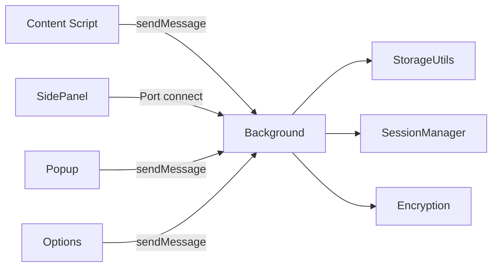

# 架构设计

<cite>
**参考文件**
- [README.md](file://README.md)
- [docs/ARCHITECTURE.md](file://docs/ARCHITECTURE.md)
- [wxt.config.ts](file://wxt.config.ts)
- [utils/encryption.ts](file://utils/encryption.ts)
- [utils/sessionManager.ts](file://utils/sessionManager.ts)
</cite>

## 目录
1. [简介](#简介)
2. [扩展入口点](#扩展入口点)
3. [消息与数据流](#消息与数据流)
4. [会话生命周期](#会话生命周期)
5. [加密机制](#加密机制)
6. [顶层项目结构](#顶层项目结构)
7. [文档分层](#文档分层)

## 简介

「账号密码管理助手」是基于 WXT + Vue 3 + TypeScript + Element Plus 的 Chrome MV3 扩展，提供本地加密的账号密码管理与自动填充能力。核心安全模型：PBKDF2（600000 次迭代）派生 256-bit 密钥 + AES-256-GCM 随机 IV 加密，敏感字段（username/password/url/remark/totp）全部密文存储，零网络传输。

## 扩展入口点

| 入口点 | 职责 |
| --- | --- |
| Background | Service Worker：消息路由（判别联合类型）、密码缓存（域名无关）、侧边栏状态（Port 连接追踪）、快捷键处理；6 子模块位于 entrypoints/background/ |
| Content Script | 注入所有页面，初始化表单检测与悬浮按钮 |
| Popup | 扩展图标弹窗，「管理密码」与「快速填充」快捷入口 |
| Options | 密码管理主页面：完整 CRUD、导入导出、会话/有效期管理 |
| SidePanel | 侧边栏快速填充：搜索、排序、域名匹配、缓存加速 |

**Sources** · [entrypoints/background/messageRouter.ts](file://entrypoints/background/messageRouter.ts) · [entrypoints/content.ts](file://entrypoints/content.ts)

## 消息与数据流



- Background 是消息路由中心，处理跨组件通信
- SidePanel 通过 `chrome.runtime.connect()` 建立 Port 实现可靠状态追踪
- Content Script 使用 `chrome.runtime.sendMessage()`

**Sources** · [entrypoints/background/messageRouter.ts](file://entrypoints/background/messageRouter.ts) · [entrypoints/background/sidePanelManager.ts](file://entrypoints/background/sidePanelManager.ts)

## 会话生命周期

设置/验证主密码 → 创建会话 → 密码批量解密为明文缓存 → SessionManager 每分钟检查（页面可见性变化也触发）→ 过期时触发 sessionExpired 事件 → 批量加密回密文 → 清空缓存/关闭侧边栏。会话恢复后自动检测并修复加密状态不一致的数据。

**Sources** · [utils/sessionManager.ts](file://utils/sessionManager.ts) · [utils/sessionManager-storage.ts](file://utils/sessionManager-storage.ts)

## 加密机制

```
主密码 + 盐值 → PBKDF2 (600000次迭代) → 256-bit 密钥
明文 + 密钥 + 随机IV → AES-256-GCM → Base64(IV + 密文)
```

- 空字段不参与加密（写空字符串）；Base64 解码失败安全降级返回原始数据，GCM 解密失败抛错由调用方处理
- 内存中的主密码副本使用 HKDF + SHA-256 派生会话密钥，AES-256-GCM 二次加密后再存入 chrome.storage.local

**Sources** · [utils/encryption.ts](file://utils/encryption.ts) · [utils/crypto-light.ts](file://utils/crypto-light.ts)

## 顶层项目结构

```
├── entrypoints/   # WXT 入口点：background/、content/、popup/、options/、sidepanel/
├── components/    # Vue 组件（options/ 与 sidepanel/ 子目录）
├── composables/   # Vue 组合函数（认证、会话、侧边栏、TOTP、快捷键等）
├── utils/         # 核心工具库：storage/、i18n/、加密、会话、备份、安全体检等
├── assets/        # 源 SVG 图标与主题 CSS Design Tokens
├── public/icon/   # 构建期 PNG 产物（WXT 自动注入 manifest）
└── wxt.config.ts  # WXT 配置
```

完整的逐文件注释结构树维护在 [docs/ARCHITECTURE.md](file://docs/ARCHITECTURE.md) 的「项目结构」章节。

## 文档分层

项目文档采用分层策略（2026-07 重构）：

- **README.md / README.en.md**（约 300 行）：橱窗定位——简介、截图、分组核心特性、安装、基础用法、架构概览、精选 FAQ，双文件人工同步维护
- **docs/ARCHITECTURE.md / docs/ARCHITECTURE.en.md**：开发者深度文档——完整架构设计、逐文件项目结构树、21 节功能实现详解（含源码链接）、开发补充（图标工作流/测试页面/性能设计）
- **index.html（GitHub Pages）与 HelpDialog.vue**：用户向完整操作指引与双语 FAQ
- 功能实现细节的唯一事实来源是 docs/ARCHITECTURE.md，README 中不再罗列实现级描述与源码链接

**Sources** · [README.md](file://README.md) · [docs/ARCHITECTURE.md](file://docs/ARCHITECTURE.md)
