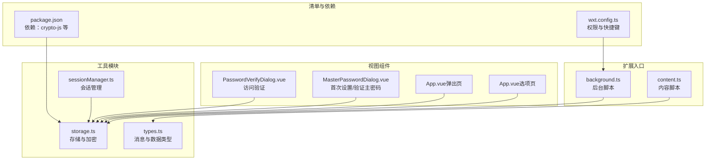
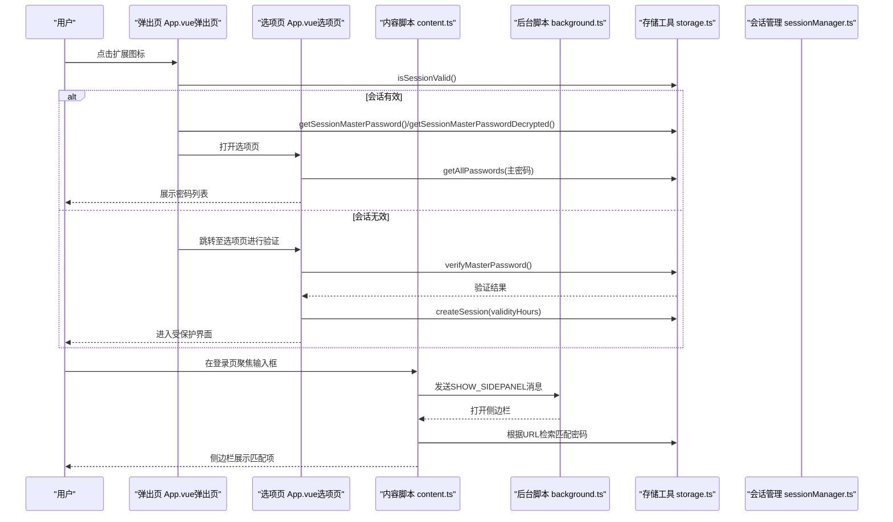
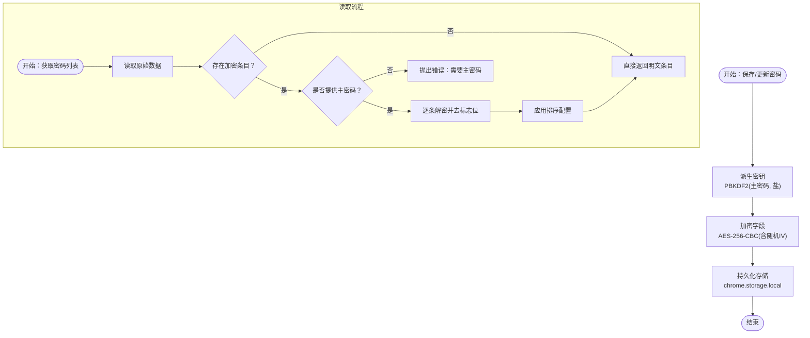
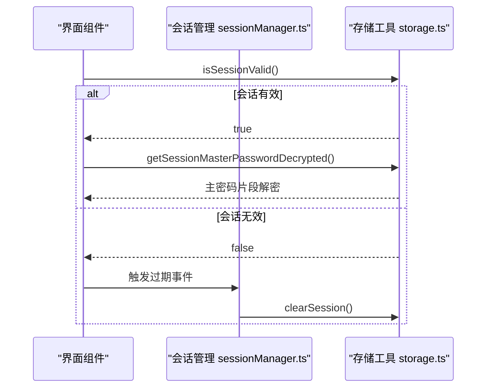
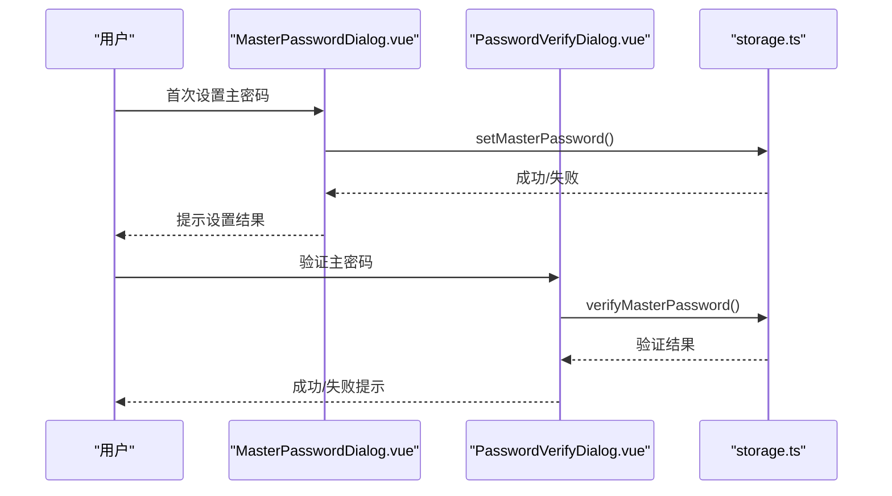
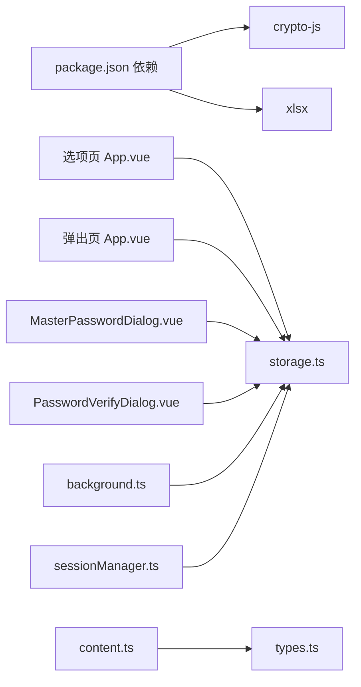

# 安全架构设计

<cite>
**本文引用的文件**
- [README.md](file://README.md)
- [background.ts](file://entrypoints/background.ts)
- [content.ts](file://entrypoints/content.ts)
- [storage.ts](file://utils/storage.ts)
- [sessionManager.ts](file://utils/sessionManager.ts)
- [MasterPasswordDialog.vue](file://components/MasterPasswordDialog.vue)
- [PasswordVerifyDialog.vue](file://components/PasswordVerifyDialog.vue)
- [wxt.config.ts](file://wxt.config.ts)
- [types.ts](file://utils/types.ts)
- [App.vue（选项页）](file://entrypoints/options/App.vue)
- [App.vue（弹出页）](file://entrypoints/popup/App.vue)
- [package.json](file://package.json)
</cite>

## 目录
1. [引言](#引言)
2. [项目结构](#项目结构)
3. [核心组件](#核心组件)
4. [架构总览](#架构总览)
5. [详细组件分析](#详细组件分析)
6. [依赖关系分析](#依赖关系分析)
7. [性能考量](#性能考量)
8. [故障排查指南](#故障排查指南)
9. [结论](#结论)
10. [附录](#附录)

## 引言
本文件面向Account Password Helper的安全架构设计，系统阐述密码存储策略（主密码验证、数据加密算法、密钥管理）、会话安全（超时、缓存清理、权限验证）、Chrome扩展特有安全边界与沙箱机制、数据传输与防篡改、用户隐私与数据最小化原则，以及威胁分析与最佳实践。目标是帮助开发者与使用者全面理解系统的安全设计与落地实现。

## 项目结构
项目采用WXT + Vue3 + TypeScript的现代扩展开发框架，核心安全逻辑集中在工具模块与对话组件中：
- 工具层：加密、存储、会话管理
- 视图层：主密码设置/验证对话框、选项页、弹出页
- 扩展入口：后台脚本、内容脚本、清单配置

图表来源
- [background.ts](file://entrypoints/background.ts#L1-L232)
- [content.ts](file://entrypoints/content.ts#L1-L800)
- [storage.ts](file://utils/storage.ts#L1-L981)
- [sessionManager.ts](file://utils/sessionManager.ts#L1-L87)
- [types.ts](file://utils/types.ts#L1-L96)
- [MasterPasswordDialog.vue](file://components/MasterPasswordDialog.vue#L1-L447)
- [PasswordVerifyDialog.vue](file://components/PasswordVerifyDialog.vue#L1-L474)
- [wxt.config.ts](file://wxt.config.ts#L1-L48)
- [package.json](file://package.json#L1-L49)

章节来源
- [wxt.config.ts](file://wxt.config.ts#L18-L46)
- [package.json](file://package.json#L22-L27)

## 核心组件
- 存储与加密工具（StorageUtils）
  - 主密码配置与校验（MD5盐值）
  - PBKDF2派生密钥
  - AES-256-CBC加密/解密（含随机IV）
  - 会话缓存（加密存储主密码、有效期）
  - 数据读写与搜索
- 会话管理（SessionManager）
  - 定时检查会话有效性
  - 过期事件与清理
- 主密码对话组件
  - 首次设置与二次验证
  - 密码强度与一致性校验
- 扩展入口
  - 后台脚本：侧边栏控制、快捷键、消息分发
  - 内容脚本：表单检测与侧边栏联动

章节来源
- [storage.ts](file://utils/storage.ts#L37-L981)
- [sessionManager.ts](file://utils/sessionManager.ts#L6-L87)
- [MasterPasswordDialog.vue](file://components/MasterPasswordDialog.vue#L92-L238)
- [PasswordVerifyDialog.vue](file://components/PasswordVerifyDialog.vue#L100-L225)
- [background.ts](file://entrypoints/background.ts#L1-L232)
- [content.ts](file://entrypoints/content.ts#L1-L800)

## 架构总览
下图展示了扩展在Chrome沙箱内的安全交互：内容脚本负责页面内表单检测与侧边栏联动；后台脚本负责快捷键与侧边栏生命周期；存储工具在本地持久化并加密敏感数据；会话管理在内存与持久化层协同保证访问时效性。

图表来源
- [App.vue（弹出页）](file://entrypoints/popup/App.vue#L59-L151)
- [App.vue（选项页）](file://entrypoints/options/App.vue#L777-L800)
- [content.ts](file://entrypoints/content.ts#L86-L91)
- [background.ts](file://entrypoints/background.ts#L33-L73)
- [storage.ts](file://utils/storage.ts#L514-L576)
- [sessionManager.ts](file://utils/sessionManager.ts#L27-L87)

## 详细组件分析

### 密码存储与加密策略
- 主密码验证
  - 存储主密码配置（哈希值与盐值），使用MD5对“主密码+盐”进行哈希，确保不可逆。
  - 验证流程：读取配置 -> 用输入密码+盐 -> MD5哈希 -> 与存储哈希比对。
- 数据加密算法
  - PBKDF2：从主密码与盐值派生256位密钥，迭代次数增强抗暴力破解能力。
  - AES-256-CBC：对敏感字段（如密码）进行加密；每次加密生成随机IV并拼接在密文前，便于解密。
- 密钥管理机制
  - 会话加密：在会话建立时，基于主密码盐值派生稳定会话密钥，加密存储主密码明文片段，仅在内存中短暂持有解密后的主密码片段，降低泄露面。
  - 持久化：会话信息（加密主密码、过期时间、有效期）存储于本地存储，避免明文留存。
- 数据读写与搜索
  - 读取时自动识别加密条目并解密；搜索与排序在解密后执行，保证界面展示安全可控。
  - 支持批量删除、排序配置持久化。

图表来源
- [storage.ts](file://utils/storage.ts#L164-L186)
- [storage.ts](file://utils/storage.ts#L191-L214)
- [storage.ts](file://utils/storage.ts#L228-L297)
- [storage.ts](file://utils/storage.ts#L302-L356)
- [storage.ts](file://utils/storage.ts#L514-L576)

章节来源
- [storage.ts](file://utils/storage.ts#L37-L981)

### 会话安全设计
- 会话超时与有效期
  - 会话有效期可配置（1-24小时），存储于本地并缓存于内存；到期自动清理。
- 缓存清理
  - 会话过期或异常时，清除内存中的会话密钥与加密主密码片段，并移除持久化会话信息。
- 权限验证
  - 所有敏感操作（查看、导出、编辑）均需通过主密码验证；会话有效期内可免重复输入。
- 会话检查
  - 定时任务每分钟检查一次会话状态，过期则触发事件并清理。

图表来源
- [sessionManager.ts](file://utils/sessionManager.ts#L27-L87)
- [storage.ts](file://utils/storage.ts#L793-L841)
- [storage.ts](file://utils/storage.ts#L899-L916)

章节来源
- [sessionManager.ts](file://utils/sessionManager.ts#L6-L87)
- [storage.ts](file://utils/storage.ts#L793-L981)

### Chrome扩展安全边界与沙箱机制
- 权限最小化
  - 清单声明：storage、activeTab、scripting、sidePanel；host_permissions为<all_urls>。
- 内容隔离
  - 内容脚本与后台脚本在不同上下文中运行，通信通过chrome.runtime消息通道，避免直接共享内存。
- 侧边栏沙箱
  - 通过sidePanel API控制侧边栏生命周期，避免跨页面状态泄漏。
- 快捷键与UI
  - 通过commands与UI组件触发后台脚本，后台脚本再协调侧边栏与页面交互。

章节来源
- [wxt.config.ts](file://wxt.config.ts#L18-L46)
- [background.ts](file://entrypoints/background.ts#L23-L31)
- [content.ts](file://entrypoints/content.ts#L1-L800)

### 数据传输与防篡改
- 本地存储为主
  - 所有敏感数据仅在本地存储，不上传至服务器，符合隐私与最小化原则。
- 加密传输
  - 本地加密（AES）与哈希（MD5+盐）结合，防止离线泄露与暴力破解。
- 防篡改机制
  - 解密失败时返回空或原始数据，避免污染；对畸形数据进行容错处理。

章节来源
- [README.md](file://README.md#L20-L26)
- [storage.ts](file://utils/storage.ts#L219-L297)

### 用户隐私与数据最小化
- 最小权限原则：仅申请必要权限，避免过度授权。
- 数据最小化：仅存储必要的账号、密码、URL、标签、备注与元信息；导出/导入遵循用户明确授权。
- 透明性：提供调试信息与重置能力，保障用户可控。

章节来源
- [README.md](file://README.md#L20-L26)
- [PasswordVerifyDialog.vue](file://components/PasswordVerifyDialog.vue#L204-L225)
- [wxt.config.ts](file://wxt.config.ts#L18-L24)

### 主密码对话与权限验证
- 首次设置
  - 强制输入两次主密码，校验一致性；提示主密码重要性与备份建议。
- 验证对话
  - 输入主密码后进行即时校验，成功后进入受保护界面；失败时清空输入并提示。
- 选项页集成
  - 选项页在认证后展示密码列表与操作；支持有效期设置与会话清理。

图表来源
- [MasterPasswordDialog.vue](file://components/MasterPasswordDialog.vue#L177-L238)
- [PasswordVerifyDialog.vue](file://components/PasswordVerifyDialog.vue#L153-L202)
- [storage.ts](file://utils/storage.ts#L76-L143)

章节来源
- [MasterPasswordDialog.vue](file://components/MasterPasswordDialog.vue#L92-L238)
- [PasswordVerifyDialog.vue](file://components/PasswordVerifyDialog.vue#L100-L225)
- [App.vue（选项页）](file://entrypoints/options/App.vue#L777-L800)

### 表单检测与侧边栏联动
- 表单检测
  - 内容脚本通过MutationObserver与事件委托检测登录表单，支持多种选择器与动态场景。
- 侧边栏控制
  - 通过后台脚本接收消息，打开/隐藏侧边栏；在标签页状态变化时自动关闭侧边栏，避免状态漂移。

章节来源
- [content.ts](file://entrypoints/content.ts#L21-L800)
- [background.ts](file://entrypoints/background.ts#L10-L21)
- [background.ts](file://entrypoints/background.ts#L75-L138)

## 依赖关系分析
- 外部依赖
  - crypto-js：提供MD5、PBKDF2、AES等加密原语。
  - xlsx：Excel导入导出。
- 内部依赖
  - storage.ts被各组件与后台脚本广泛调用，是安全控制的核心。
  - sessionManager.ts依赖storage.ts进行会话状态维护。

图表来源
- [package.json](file://package.json#L22-L27)
- [App.vue（选项页）](file://entrypoints/options/App.vue#L795-L796)
- [App.vue（弹出页）](file://entrypoints/popup/App.vue#L54)
- [MasterPasswordDialog.vue](file://components/MasterPasswordDialog.vue#L96)
- [PasswordVerifyDialog.vue](file://components/PasswordVerifyDialog.vue#L104)
- [background.ts](file://entrypoints/background.ts#L1-L232)
- [content.ts](file://entrypoints/content.ts#L1-L800)
- [sessionManager.ts](file://utils/sessionManager.ts#L1-L87)

章节来源
- [package.json](file://package.json#L22-L27)
- [storage.ts](file://utils/storage.ts#L1-L9)

## 性能考量
- 解密与渲染分离：解密在后台完成，界面仅展示明文，避免主线程阻塞。
- 缓存与懒加载：会话有效期与排序配置缓存于内存，减少存储访问。
- 事件与观察者：MutationObserver与事件委托降低监听成本，提升动态页面适配能力。

## 故障排查指南
- 主密码错误
  - 现象：验证失败，输入框高亮抖动。
  - 处理：清空输入并重新输入；确认大小写与键盘布局。
- 会话过期
  - 现象：界面提示过期，需重新验证。
  - 处理：重新输入主密码；检查会话有效期设置。
- 侧边栏不显示
  - 现象：聚焦登录字段后未出现侧边栏。
  - 处理：确认Chrome版本支持sidePanel API；检查页面是否动态加载导致检测延迟。
- 数据无法解密
  - 现象：部分条目显示为空或报错。
  - 处理：检查主密码是否正确；查看调试信息；必要时重置数据（注意：将清空所有数据）。

章节来源
- [PasswordVerifyDialog.vue](file://components/PasswordVerifyDialog.vue#L179-L202)
- [sessionManager.ts](file://utils/sessionManager.ts#L57-L87)
- [content.ts](file://entrypoints/content.ts#L93-L170)
- [storage.ts](file://utils/storage.ts#L219-L297)

## 结论
本项目在Chrome扩展沙箱内实现了端到端的本地安全存储与访问控制：通过MD5+盐的主密码校验、PBKDF2+AES-256-CBC的加密策略、会话超时与缓存清理机制，有效平衡了易用性与安全性。配合最小权限原则与隐私保护实践，整体安全架构具备良好的可维护性与可扩展性。

## 附录

### 安全威胁与缓解
- 主密码泄露
  - 缓解：MD5+盐存储；会话仅缓存解密片段；支持重置。
- 离线数据泄露
  - 缓解：AES-256-CBC加密；仅本地存储。
- 会话劫持/过期绕过
  - 缓解：定时检查；过期清理；UI提示。
- 动态页面表单检测不准确
  - 缓解：MutationObserver与事件委托；多选择器覆盖。

### 最佳实践与配置建议
- 主密码策略
  - 使用高强度主密码（长度≥6，建议≥8，包含字母、数字、特殊字符）。
- 会话有效期
  - 根据使用场景设置1-24小时；高频使用建议较短有效期。
- 权限与清单
  - 严格遵循最小权限原则；host_permissions仅用于必要站点。
- 数据备份
  - 定期导出Excel备份；妥善保管备份文件。

章节来源
- [MasterPasswordDialog.vue](file://components/MasterPasswordDialog.vue#L125-L153)
- [wxt.config.ts](file://wxt.config.ts#L18-L24)
- [README.md](file://README.md#L159-L165)