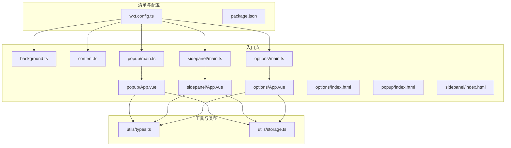
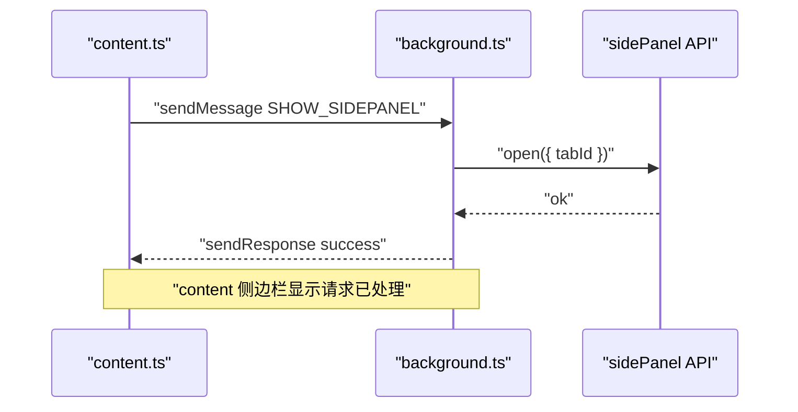
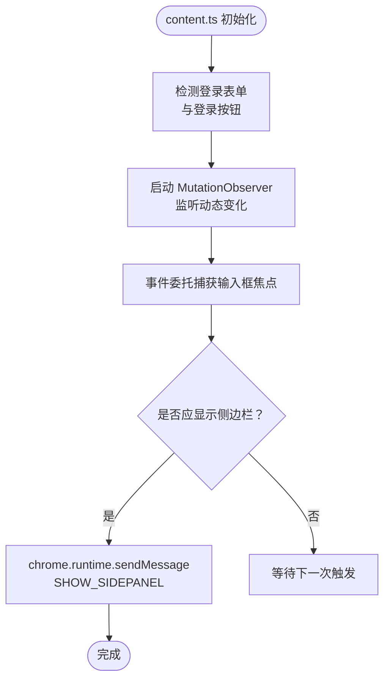
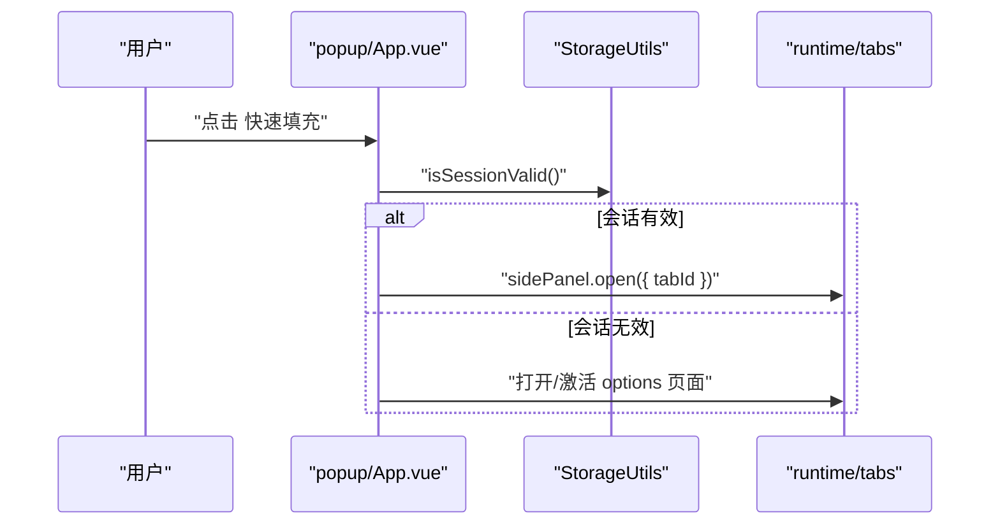
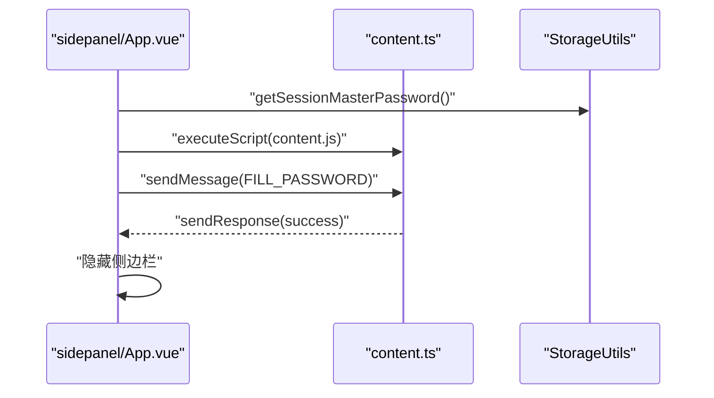
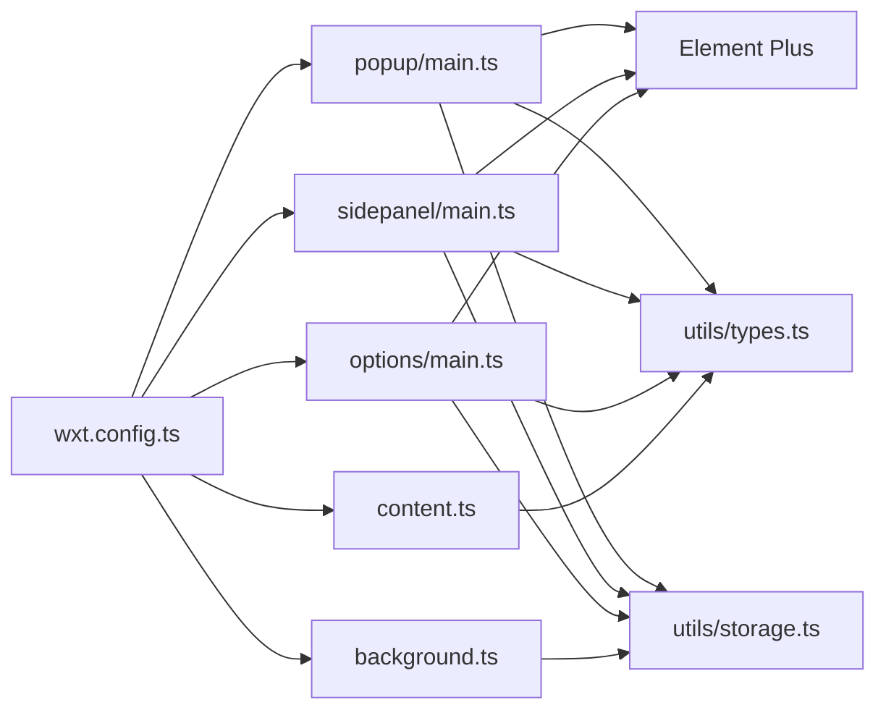

# 扩展入口点架构

<cite>
**本文档引用的文件**
- [wxt.config.ts](file://wxt.config.ts)
- [background.ts](file://entrypoints/background.ts)
- [content.ts](file://entrypoints/content.ts)
- [popup/main.ts](file://entrypoints/popup/main.ts)
- [popup/App.vue](file://entrypoints/popup/App.vue)
- [sidepanel/main.ts](file://entrypoints/sidepanel/main.ts)
- [sidepanel/App.vue](file://entrypoints/sidepanel/App.vue)
- [options/main.ts](file://entrypoints/options/main.ts)
- [options/App.vue](file://entrypoints/options/App.vue)
- [options/index.html](file://entrypoints/options/index.html)
- [popup/index.html](file://entrypoints/popup/index.html)
- [sidepanel/index.html](file://entrypoints/sidepanel/index.html)
- [types.ts](file://utils/types.ts)
- [storage.ts](file://utils/storage.ts)
- [package.json](file://package.json)
- [README.md](file://README.md)
</cite>

## 目录
1. [引言](#引言)
2. [项目结构](#项目结构)
3. [核心组件](#核心组件)
4. [架构总览](#架构总览)
5. [详细组件分析](#详细组件分析)
6. [依赖关系分析](#依赖关系分析)
7. [性能考量](#性能考量)
8. [故障排查指南](#故障排查指南)
9. [结论](#结论)
10. [附录](#附录)

## 引言
本文件系统性阐述 Account Password Helper 的 Chrome 扩展入口点架构，围绕 WXT 框架组织的五个标准入口点（background、content、popup、sidepanel、options）展开，解释其设计原理、职责分工、初始化流程、生命周期管理与资源占用，并总结入口点间协作模式与数据共享机制。文档同时提供最佳实践与性能优化建议，并给出基于仓库源码的实际配置与代码示例路径。

## 项目结构
该项目采用 WXT（WebExtension Toolkit）组织多入口点前端应用，入口点位于 entrypoints 目录，配套 Vue3 + Element Plus UI，工具层位于 utils 目录，构建与清单配置位于根目录。



**图表来源**
- [wxt.config.ts](file://wxt.config.ts#L1-L48)
- [background.ts](file://entrypoints/background.ts#L1-L232)
- [content.ts](file://entrypoints/content.ts#L1-L1892)
- [popup/main.ts](file://entrypoints/popup/main.ts#L1-L10)
- [popup/App.vue](file://entrypoints/popup/App.vue#L1-L234)
- [sidepanel/main.ts](file://entrypoints/sidepanel/main.ts#L1-L10)
- [sidepanel/App.vue](file://entrypoints/sidepanel/App.vue#L1-L911)
- [options/main.ts](file://entrypoints/options/main.ts#L1-L11)
- [options/App.vue](file://entrypoints/options/App.vue#L1-L2414)
- [options/index.html](file://entrypoints/options/index.html#L1-L19)
- [popup/index.html](file://entrypoints/popup/index.html#L1-L19)
- [sidepanel/index.html](file://entrypoints/sidepanel/index.html#L1-L19)
- [types.ts](file://utils/types.ts#L1-L96)
- [storage.ts](file://utils/storage.ts#L1-L981)

**章节来源**
- [wxt.config.ts](file://wxt.config.ts#L1-L48)
- [package.json](file://package.json#L1-L49)

## 核心组件
- 入口点清单与权限：manifest 中声明名称、描述、版本、权限（storage、activeTab、scripting、sidePanel）、主机权限（<all_urls>）与快捷键命令（open_options、toggle_sidepanel）。
- 消息类型与数据模型：统一的 MessageType 枚举与 PasswordEntry 接口，支撑跨入口点通信与数据传递。
- 存储与会话：StorageUtils 提供主密码校验、加密/解密、会话缓存、排序配置、URL 匹配查询等功能，贯穿各入口点的数据访问。

**章节来源**
- [wxt.config.ts](file://wxt.config.ts#L18-L46)
- [types.ts](file://utils/types.ts#L54-L96)
- [storage.ts](file://utils/storage.ts#L12-L18)

## 架构总览
五个入口点的职责与协作：
- background：生命周期与系统事件监听（安装、标签页更新/激活、快捷键）、侧边栏开关控制、选项页打开、消息路由。
- content：页面脚本注入与表单检测、侧边栏显示/隐藏、密码填充、URL 变化通知。
- popup：扩展图标弹窗，提供“管理密码”“快速填充”入口，会话状态检查与选项页跳转。
- sidepanel：侧边栏面板，展示匹配密码、搜索、填充、URL 变化响应、会话状态联动。
- options：设置页面，主密码设置/验证、密码管理、导入导出、有效期设置、排序配置。

```mermaid
graph LR
subgraph "浏览器"
TABS["标签页"]
RUNTIME["扩展运行时"]
end
BG["background.ts"] --> RUNTIME
CT["content.ts"] --> TABS
POP["popup/App.vue"] --> RUNTIME
SID["sidepanel/App.vue"] --> RUNTIME
OPT["options/App.vue"] --> RUNTIME
BG <- --> CT
BG <- --> POP
BG <- --> SID
BG <- --> OPT
CT --> |"表单检测/填充"| TABS
SID --> |"注入脚本/填充"| CT
POP --> |"打开侧边栏/选项页"| RUNTIME
```

**图表来源**
- [background.ts](file://entrypoints/background.ts#L4-L202)
- [content.ts](file://entrypoints/content.ts#L4-L1217)
- [popup/App.vue](file://entrypoints/popup/App.vue#L59-L151)
- [sidepanel/App.vue](file://entrypoints/sidepanel/App.vue#L273-L422)
- [options/App.vue](file://entrypoints/options/App.vue#L1-L2414)

## 详细组件分析

### Background 入口点（后台脚本）
- 设计原理：作为扩展中枢，集中处理系统事件与跨页面消息，协调侧边栏与页面脚本交互。
- 职责分工：
  - 监听安装事件、标签页更新/激活、快捷键命令。
  - 通过 runtime.onMessage 处理来自 content/popup 的消息，实现 SHOW/HIDE_SIDEPANEL、URL_CHANGED 等。
  - 通过 sidePanel API 控制侧边栏显示/隐藏，兼容旧版本降级处理。
  - 打开选项页（去重激活或新建标签页）。
- 生命周期管理：常驻进程，随扩展加载；通过事件监听器响应外部状态变化。
- 资源占用：轻量，主要为事件监听与 API 调用；注意避免重复监听与未清理的定时器。
- 与 content 的协作：通过 chrome.runtime.sendMessage 与 chrome.runtime.onMessage 实现双向通信。
- 与 sidepanel 的协作：通过 sidePanel API 控制侧边栏状态；URL 变化通过消息通知。



**图表来源**
- [background.ts](file://entrypoints/background.ts#L34-L109)
- [content.ts](file://entrypoints/content.ts#L993-L1008)

**章节来源**
- [background.ts](file://entrypoints/background.ts#L4-L202)

### Content 入口点（内容脚本）
- 设计原理：注入到目标页面，负责表单检测、侧边栏显示/隐藏、密码填充、URL 变化通知。
- 职责分工：
  - 使用 MutationObserver 检测动态表单与登录按钮，结合可见性与页面导航事件优化触发时机。
  - 通过防抖与缓存（WeakMap/Set）降低性能开销。
  - 通过 chrome.runtime.sendMessage 与 background 通信，实现侧边栏控制与填充指令。
  - 填充逻辑：账号+密码组合与手机号+验证码组合（当前实现合并为账号密码填充）。
  - 自动勾选“记住我”等复选框，基于位置与标签文本评分。
- 生命周期管理：随页面加载注入，页面卸载或 beforeunload 时清理。
- 资源占用：DOM 观察器与事件监听器需谨慎管理，避免内存泄漏；使用 WeakMap/WeakSet 与缓存策略。
- 与 background 的协作：消息路由与 URL 变化通知。
- 与 sidepanel 的协作：通过注入脚本与 sendMessage 交互，执行填充动作。



**图表来源**
- [content.ts](file://entrypoints/content.ts#L22-L170)
- [content.ts](file://entrypoints/content.ts#L611-L636)
- [content.ts](file://entrypoints/content.ts#L993-L1008)

**章节来源**
- [content.ts](file://entrypoints/content.ts#L4-L1892)

### Popup 入口点（弹窗）
- 设计原理：扩展图标点击后弹出的 UI，提供快速入口与会话状态检查。
- 职责分工：
  - 会话有效性检查：通过 StorageUtils.isSessionValid 决定是否允许打开侧边栏。
  - “管理密码”按钮：打开/激活 options 页面。
  - “快速填充”按钮：直接调用 sidePanel API 打开侧边栏。
- 生命周期管理：窗口级组件，随用户交互显示/关闭。
- 资源占用：轻量 UI，依赖 StorageUtils 与 chrome.tabs API。
- 与 options 的协作：通过 options.html 与 chrome.tabs.query/ create 实现去重与激活。



**图表来源**
- [popup/App.vue](file://entrypoints/popup/App.vue#L127-L151)
- [popup/App.vue](file://entrypoints/popup/App.vue#L92-L125)

**章节来源**
- [popup/App.vue](file://entrypoints/popup/App.vue#L59-L162)
- [popup/main.ts](file://entrypoints/popup/main.ts#L1-L10)

### Sidepanel 入口点（侧边栏）
- 设计原理：独立的侧边栏面板，展示匹配密码、搜索、填充与 URL 变化响应。
- 职责分工：
  - 会话状态检查与 URL 变化监听，动态更新密码列表。
  - 搜索过滤与排序配置应用。
  - 注入 content-script 并发送填充消息，完成账号/密码填充。
  - 打开/激活 options 页面。
- 生命周期管理：随侧边栏显示/隐藏，注册/注销监听器。
- 资源占用：Vue 组件渲染与存储访问，注意监听器清理与内存释放。
- 与 content 的协作：通过注入脚本与 sendMessage 交互，执行填充动作。



**图表来源**
- [sidepanel/App.vue](file://entrypoints/sidepanel/App.vue#L342-L422)
- [sidepanel/App.vue](file://entrypoints/sidepanel/App.vue#L273-L295)

**章节来源**
- [sidepanel/App.vue](file://entrypoints/sidepanel/App.vue#L163-L700)
- [sidepanel/main.ts](file://entrypoints/sidepanel/main.ts#L1-L10)

### Options 入口点（选项页）
- 设计原理：完整的设置与管理页面，包含主密码设置/验证、密码管理、导入导出、有效期设置、排序配置。
- 职责分工：
  - 主密码设置/验证与会话缓存。
  - 密码增删改查、搜索、排序、批量操作。
  - Excel 导入导出与模板下载。
  - 有效期设置与会话清理。
- 生命周期管理：页面级组件，随页面加载/卸载。
- 资源占用：表格渲染与文件处理，注意大列表的虚拟滚动与分页（当前实现为完整列表）。
- 与 storage 的协作：通过 StorageUtils 完成加密/解密、排序、URL 匹配与会话管理。

**章节来源**
- [options/App.vue](file://entrypoints/options/App.vue#L1-L2414)
- [options/main.ts](file://entrypoints/options/main.ts#L1-L11)
- [options/index.html](file://entrypoints/options/index.html#L1-L19)

## 依赖关系分析
- WXT 配置：模块化引入 @wxt-dev/module-vue，路径别名配置，清单权限与快捷键。
- 入口点依赖：popup/sidepanel/options 均依赖 Element Plus 与 Vue3；content/background 依赖 chrome.* API。
- 数据与工具：所有入口点共享 utils/types.ts 与 utils/storage.ts，确保消息类型一致与数据访问统一。



**图表来源**
- [wxt.config.ts](file://wxt.config.ts#L4-L17)
- [popup/main.ts](file://entrypoints/popup/main.ts#L1-L10)
- [sidepanel/main.ts](file://entrypoints/sidepanel/main.ts#L1-L10)
- [options/main.ts](file://entrypoints/options/main.ts#L1-L11)
- [types.ts](file://utils/types.ts#L1-L96)
- [storage.ts](file://utils/storage.ts#L1-L981)

**章节来源**
- [wxt.config.ts](file://wxt.config.ts#L1-L48)
- [package.json](file://package.json#L22-L46)

## 性能考量
- content 脚本优化
  - 使用防抖与事件委托，减少监听器数量与回调频率。
  - 使用 WeakMap/WeakSet 缓存字段类型与检测结果，避免内存泄漏。
  - MutationObserver 仅监听必要属性与节点，缩短检测周期。
- sidepanel 与 popup
  - 会话状态检查与 URL 变化监听需及时清理，避免重复注册。
  - 大列表渲染建议分页或虚拟滚动（当前实现为完整列表）。
- background
  - 避免在 onMessage 中执行阻塞操作，异步处理并及时返回响应。
  - 侧边栏 API 调用需兼容旧版本，避免异常中断。
- 存储访问
  - 批量读写与排序应用尽量一次性完成，减少多次存储调用。
  - 加密/解密操作在会话有效期内复用密钥，避免重复派生。

[本节为通用性能指导，不直接分析具体文件，故无“章节来源”]

## 故障排查指南
- 侧边栏不显示
  - 检查 Chrome 版本是否支持 sidePanel API（Chrome 114+）。
  - 确认 background.ts 中 handleShowSidePanel 的错误日志与 API 返回。
- 无法连接页面脚本
  - sidepanel 注入 content-script 失败时，检查 scripting 权限与脚本路径。
- 填充失败
  - content.ts 中 fillPassword/fillMobileCode 的事件分发与输入框可见性检查。
  - sidepanel 发送消息后未收到响应，检查 content.ts 的 onMessage 处理。
- 会话过期
  - StorageUtils.isSessionValid 与 createSession/clearSession 的状态同步。
- 选项页无法打开
  - popup/options 中通过 chrome.tabs.query/ create 实现去重激活或新建标签页。

**章节来源**
- [background.ts](file://entrypoints/background.ts#L75-L138)
- [content.ts](file://entrypoints/content.ts#L993-L1028)
- [sidepanel/App.vue](file://entrypoints/sidepanel/App.vue#L354-L422)
- [storage.ts](file://utils/storage.ts#L793-L841)

## 结论
本项目以 WXT 为基础，清晰划分五个入口点的职责边界：background 作为中枢协调、content 负责页面交互、popup/sidepanel 提供用户入口与填充、options 提供完整管理能力。通过统一的消息类型与存储工具，实现高效、可维护的扩展架构。建议在后续迭代中进一步优化 content 的检测策略、sidepanel 的渲染性能与 background 的错误处理健壮性。

[本节为总结性内容，不直接分析具体文件，故无“章节来源”]

## 附录

### 入口点选择最佳实践
- 何时使用 background：需要跨页面状态协调、系统事件监听、侧边栏控制。
- 何时使用 content：需要直接操作页面 DOM、检测表单、注入脚本。
- 何时使用 popup：提供快速入口与轻量交互。
- 何时使用 sidepanel：需要富交互面板与实时数据展示。
- 何时使用 options：需要复杂设置与管理功能。

### 配置与清单要点
- 权限与主机权限：storage、activeTab、scripting、sidePanel、<all_urls>。
- 快捷键：open_options（Ctrl+Shift+P）、toggle_sidepanel（Ctrl+Shift+L）。
- 路径别名：@、@/components、@/utils、@/entrypoints、@/assets。

**章节来源**
- [wxt.config.ts](file://wxt.config.ts#L18-L46)
- [package.json](file://package.json#L6-L21)