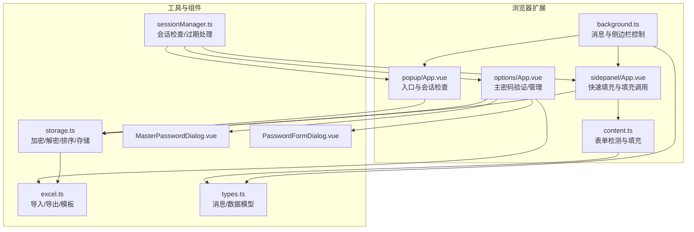
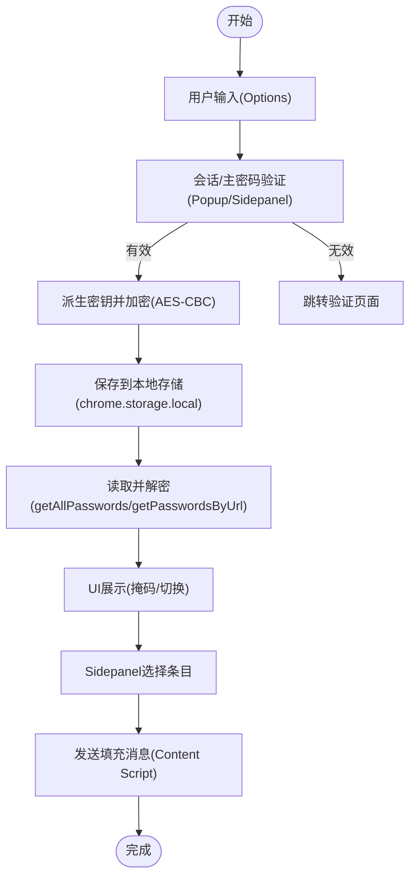
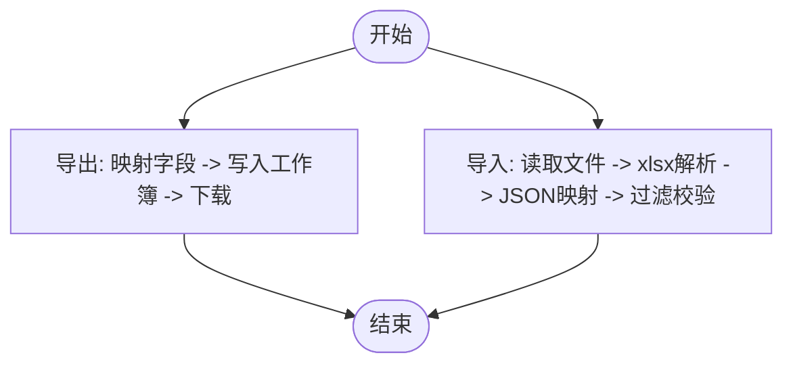
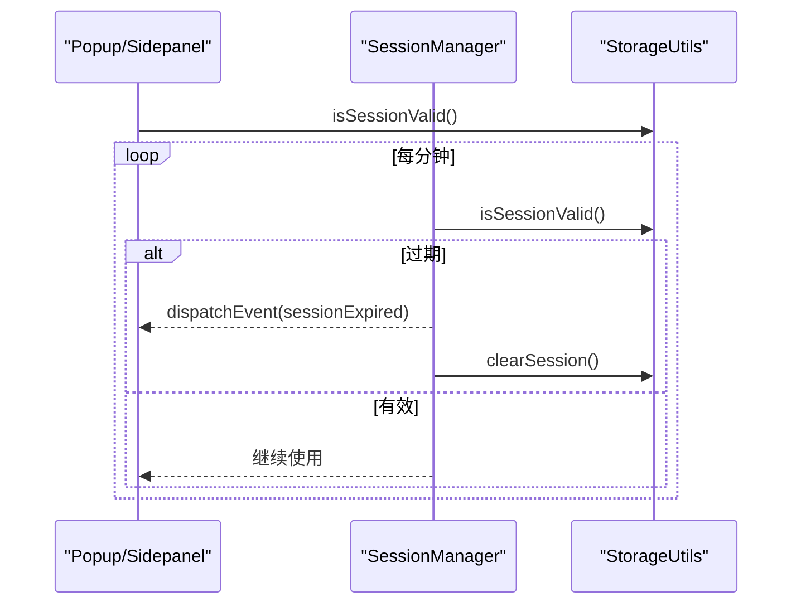
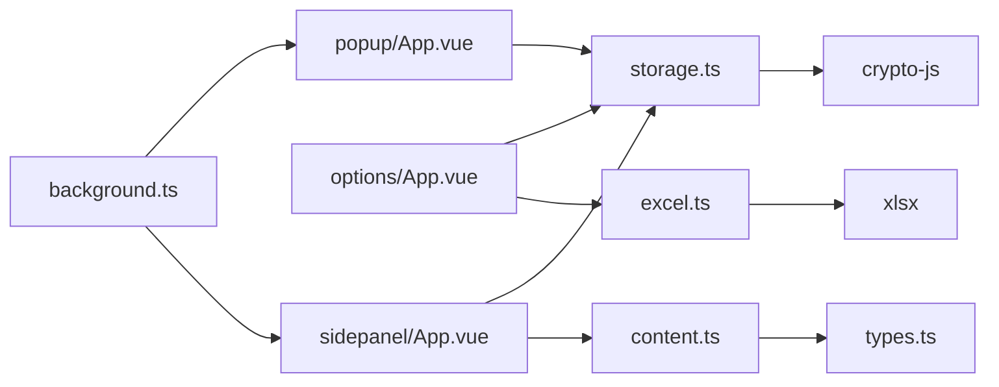

# 数据流设计

<cite>
**本文引用的文件**
- [README.md](file://README.md)
- [package.json](file://package.json)
- [entrypoints/background.ts](file://entrypoints/background.ts)
- [entrypoints/content.ts](file://entrypoints/content.ts)
- [entrypoints/popup/App.vue](file://entrypoints/popup/App.vue)
- [entrypoints/options/App.vue](file://entrypoints/options/App.vue)
- [entrypoints/sidepanel/App.vue](file://entrypoints/sidepanel/App.vue)
- [utils/storage.ts](file://utils/storage.ts)
- [utils/excel.ts](file://utils/excel.ts)
- [utils/sessionManager.ts](file://utils/sessionManager.ts)
- [utils/types.ts](file://utils/types.ts)
- [components/PasswordFormDialog.vue](file://components/PasswordFormDialog.vue)
- [components/MasterPasswordDialog.vue](file://components/MasterPasswordDialog.vue)
</cite>

## 目录
1. [简介](#简介)
2. [项目结构](#项目结构)
3. [核心组件](#核心组件)
4. [架构总览](#架构总览)
5. [详细组件分析](#详细组件分析)
6. [依赖关系分析](#依赖关系分析)
7. [性能考量](#性能考量)
8. [故障排查指南](#故障排查指南)
9. [结论](#结论)
10. [附录](#附录)

## 简介
本文件围绕 Account Password Helper 的数据流设计展开，系统性阐述从用户输入、数据传输、本地存储、解密展示到 Excel 导入导出的完整流程；解释主密码与会话管理的缓存与失效机制；分析数据一致性与并发访问控制；并提供监控与调试方法及可视化图示。

## 项目结构
项目采用 WXT + Vue3 + TypeScript 架构，核心模块分布如下：
- 背景页：负责快捷键、侧边栏开关、标签页事件与消息路由
- 内容脚本：负责表单检测、侧边栏触发与密码填充
- Popup/Options/Sidepanel：三个入口页面，分别承载入口操作、管理界面与快速填充
- 工具层：存储、Excel、会话管理、类型定义
- 组件层：对话框组件封装常用交互



图表来源
- [entrypoints/background.ts](file://entrypoints/background.ts#L1-L232)
- [entrypoints/content.ts](file://entrypoints/content.ts#L1-L800)
- [entrypoints/popup/App.vue](file://entrypoints/popup/App.vue#L1-L234)
- [entrypoints/options/App.vue](file://entrypoints/options/App.vue#L1-L800)
- [entrypoints/sidepanel/App.vue](file://entrypoints/sidepanel/App.vue#L1-L911)
- [utils/storage.ts](file://utils/storage.ts#L1-L981)
- [utils/excel.ts](file://utils/excel.ts#L1-L155)
- [utils/sessionManager.ts](file://utils/sessionManager.ts#L1-L87)
- [utils/types.ts](file://utils/types.ts#L1-L96)
- [components/MasterPasswordDialog.vue](file://components/MasterPasswordDialog.vue#L1-L447)
- [components/PasswordFormDialog.vue](file://components/PasswordFormDialog.vue#L1-L336)

章节来源
- [README.md](file://README.md#L1-L201)
- [package.json](file://package.json#L1-L49)

## 核心组件
- 存储与加密：提供主密码设置/校验、基于盐值的MD5摘要、PBKDF2派生密钥、AES-CBC加解密、原始/解密数据读取、URL/关键词检索、排序与持久化
- Excel 工具：导出为Excel、从Excel导入、下载模板
- 会话管理：定时检查会话有效性、过期事件广播、清理会话
- 类型与消息：统一的消息类型枚举、密码条目模型
- UI 组件：主密码对话框、密码表单对话框

章节来源
- [utils/storage.ts](file://utils/storage.ts#L1-L981)
- [utils/excel.ts](file://utils/excel.ts#L1-L155)
- [utils/sessionManager.ts](file://utils/sessionManager.ts#L1-L87)
- [utils/types.ts](file://utils/types.ts#L1-L96)
- [components/MasterPasswordDialog.vue](file://components/MasterPasswordDialog.vue#L1-L447)
- [components/PasswordFormDialog.vue](file://components/PasswordFormDialog.vue#L1-L336)

## 架构总览
整体数据流由“用户输入”驱动，经“会话验证/主密码校验”后进入“存储/Excel处理”，最终在“UI 展示/填充”中消费。

```mermaid
sequenceDiagram
participant U as "用户"
participant POP as "Popup"
participant OPT as "Options"
participant SP as "Sidepanel"
participant BG as "Background"
participant CT as "Content Script"
participant ST as "StorageUtils"
participant EX as "ExcelUtils"
U->>POP : 打开弹窗
POP->>ST : isSessionValid()
alt 会话有效
POP->>ST : getSessionMasterPassword()
POP->>ST : getAllPasswords()
POP-->>U : 显示密码数量
else 会话无效
POP-->>OPT : 跳转验证
end
U->>SP : 点击快速填充
SP->>ST : isSessionValid()
alt 会话有效
SP->>ST : getSessionMasterPassword()
SP->>ST : getPasswordsByUrl(domain)
SP-->>U : 展示匹配项
U->>SP : 选择条目
SP->>CT : sendMessage(FILL_PASSWORD)
CT-->>SP : 响应(成功/失败)
else 会话无效
SP-->>OPT : 跳转验证
end
U->>OPT : 导入/导出
OPT->>EX : importFromExcel()/exportToExcel()
OPT->>ST : savePassword()/getAllPasswords()
```

图表来源
- [entrypoints/popup/App.vue](file://entrypoints/popup/App.vue#L59-L90)
- [entrypoints/sidepanel/App.vue](file://entrypoints/sidepanel/App.vue#L342-L422)
- [entrypoints/background.ts](file://entrypoints/background.ts#L34-L73)
- [entrypoints/content.ts](file://entrypoints/content.ts#L87-L91)
- [utils/storage.ts](file://utils/storage.ts#L514-L576)
- [utils/excel.ts](file://utils/excel.ts#L8-L45)

## 详细组件分析

### 密码数据生命周期与数据流
- 用户输入：Options 中的表单对话框收集用户名、密码、URL、标签、备注
- 会话与主密码：Popup/Sidepanel 在使用前调用 isSessionValid()，若有效则获取会话主密码
- 加密存储：StorageUtils.savePassword() 通过 PBKDF2 派生密钥，对密码字段执行 AES-CBC 加密，保存至 chrome.storage.local
- 检索与解密：StorageUtils.getAllPasswords()/getPasswordsByUrl() 读取后对加密条目逐条解密，非加密条目直接返回
- UI 展示：Sidepanel/Options 仅在会话有效时解密并展示；密码字段默认掩码显示，支持切换
- 填充流程：Sidepanel 选择条目后向 Content Script 发送消息，Content Script 完成表单填充



图表来源
- [components/PasswordFormDialog.vue](file://components/PasswordFormDialog.vue#L158-L199)
- [entrypoints/popup/App.vue](file://entrypoints/popup/App.vue#L63-L83)
- [entrypoints/sidepanel/App.vue](file://entrypoints/sidepanel/App.vue#L342-L422)
- [utils/storage.ts](file://utils/storage.ts#L302-L356)
- [utils/storage.ts](file://utils/storage.ts#L514-L576)

章节来源
- [components/PasswordFormDialog.vue](file://components/PasswordFormDialog.vue#L1-L336)
- [entrypoints/options/App.vue](file://entrypoints/options/App.vue#L551-L774)
- [entrypoints/sidepanel/App.vue](file://entrypoints/sidepanel/App.vue#L1-L911)
- [utils/storage.ts](file://utils/storage.ts#L1-L981)

### Excel 导入/导出与格式兼容
- 导出：遍历解密后的密码列表，映射为中文列名，写入工作簿并下载
- 导入：FileReader 读取二进制，xlsx 解析为 JSON，支持多语言列名别名，过滤无用户名条目
- 模板：生成示例数据并下载，便于用户批量录入



图表来源
- [utils/excel.ts](file://utils/excel.ts#L8-L45)
- [utils/excel.ts](file://utils/excel.ts#L50-L114)
- [utils/excel.ts](file://utils/excel.ts#L119-L153)

章节来源
- [utils/excel.ts](file://utils/excel.ts#L1-L155)
- [README.md](file://README.md#L135-L150)

### 会话管理与缓存策略
- 会话检查：每分钟轮询检查，若过期触发自定义事件并清理会话
- 会话状态：内存缓存 + chrome.storage.local 存储键，支持有效期小时数配置
- UI 响应：Popup/Sidepanel 监听会话变化，自动切换“未验证/已验证”状态



图表来源
- [utils/sessionManager.ts](file://utils/sessionManager.ts#L27-L66)
- [utils/storage.ts](file://utils/storage.ts#L793-L870)
- [entrypoints/sidepanel/App.vue](file://entrypoints/sidepanel/App.vue#L199-L219)

章节来源
- [utils/sessionManager.ts](file://utils/sessionManager.ts#L1-L87)
- [utils/storage.ts](file://utils/storage.ts#L719-L760)

### 并发访问控制与数据一致性
- 存储一致性：chrome.storage.local 为单一命名空间，写入前读取全量列表，更新/删除后整体回写，避免竞态
- 解密一致性：解密失败的条目会被跳过并记录警告，不影响其他条目
- 排序一致性：应用保存的排序配置，避免 UI 层多次排序导致的不一致

章节来源
- [utils/storage.ts](file://utils/storage.ts#L377-L461)
- [utils/storage.ts](file://utils/storage.ts#L514-L576)
- [utils/storage.ts](file://utils/storage.ts#L607-L670)

### 数据流监控与调试
- 日志输出：各模块在关键路径打印日志，便于定位问题
- 错误提示：UI 使用 ElMessage 展示错误/警告
- 会话调试：Options 提供“调试信息”入口，辅助排查会话状态
- 文件导出：支持导出密码数据，便于离线审计

章节来源
- [entrypoints/sidepanel/App.vue](file://entrypoints/sidepanel/App.vue#L414-L421)
- [entrypoints/options/App.vue](file://entrypoints/options/App.vue#L229-L241)
- [utils/excel.ts](file://utils/excel.ts#L8-L45)

## 依赖关系分析
- 存储依赖：StorageUtils 依赖 crypto-js 实现 MD5/PBKDF2/AES
- Excel 依赖：xlsx 读写 Excel
- UI 依赖：Element Plus 组件库
- 类型依赖：统一的消息类型与数据模型



图表来源
- [package.json](file://package.json#L22-L26)
- [utils/storage.ts](file://utils/storage.ts#L1-L50)
- [utils/excel.ts](file://utils/excel.ts#L1-L5)
- [entrypoints/content.ts](file://entrypoints/content.ts#L1-L10)
- [utils/types.ts](file://utils/types.ts#L54-L87)

章节来源
- [package.json](file://package.json#L1-L49)
- [utils/types.ts](file://utils/types.ts#L1-L96)

## 性能考量
- 表单检测：MutationObserver + 事件委托 + 缓存字段类型，降低重复扫描成本
- UI 渲染：计算属性过滤与排序，避免不必要的重渲染
- 存储读写：批量读取/写入，减少多次 IO
- 会话检查：定时器每分钟一次，避免高频轮询

章节来源
- [entrypoints/content.ts](file://entrypoints/content.ts#L9-L19)
- [entrypoints/content.ts](file://entrypoints/content.ts#L611-L636)
- [entrypoints/sidepanel/App.vue](file://entrypoints/sidepanel/App.vue#L178-L197)

## 故障排查指南
- 无法打开侧边栏：检查 Chrome 版本是否支持 sidePanel API，或参考 background 的错误日志
- 导入失败：确认 Excel 列名是否包含“用户名/密码”，或下载模板校验格式
- 填充失败：确认页面已完全加载，Content Script 已注入，或刷新页面重试
- 会话过期：检查有效期设置，或手动清除当前会话后重新验证
- 无法获取密码数量：Popup 会在会话无效时隐藏数量显示

章节来源
- [entrypoints/background.ts](file://entrypoints/background.ts#L75-L138)
- [utils/excel.ts](file://utils/excel.ts#L104-L113)
- [entrypoints/sidepanel/App.vue](file://entrypoints/sidepanel/App.vue#L354-L421)
- [utils/sessionManager.ts](file://utils/sessionManager.ts#L57-L66)
- [entrypoints/popup/App.vue](file://entrypoints/popup/App.vue#L63-L83)

## 结论
本项目通过“会话验证 + 主密码派生密钥 + AES 加密”的组合，保障密码数据在本地的安全存储与展示；借助 chrome.storage.local 的原子写入与排序配置，维持数据一致性；Excel 导入导出提供便捷的批量操作；Sidepanel 与 Content Script 的消息通信实现“所见即所得”的自动填充体验。建议持续关注浏览器 API 兼容性与性能优化点，以提升用户体验与稳定性。

## 附录
- 安全要点：主密码采用 MD5 + 盐值摘要与 PBKDF2 派生密钥，密码字段使用 AES-CBC 加密；建议定期导出备份
- 兼容性：Chrome 114+ 支持 sidePanel API；动态表单场景下 Content Script 通过 MutationObserver 与事件委托提升检测鲁棒性

章节来源
- [README.md](file://README.md#L86-L164)
- [entrypoints/content.ts](file://entrypoints/content.ts#L93-L170)