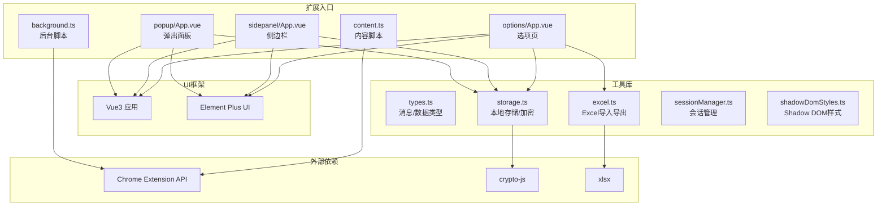
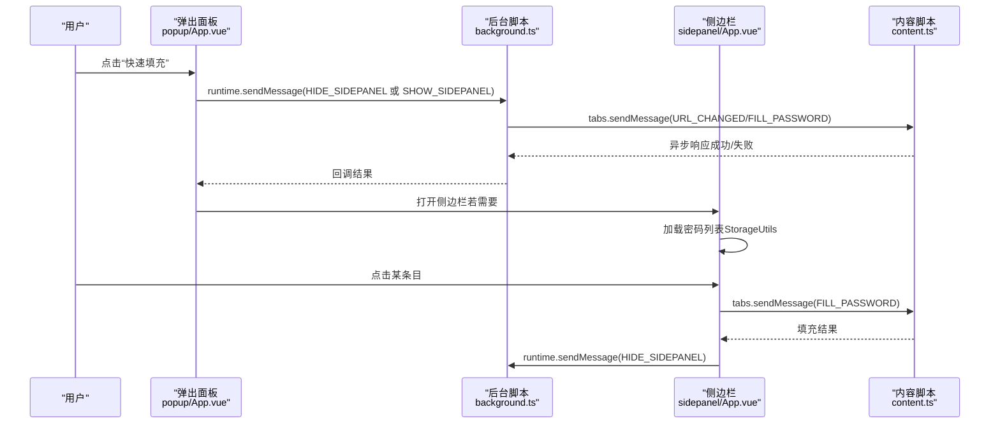
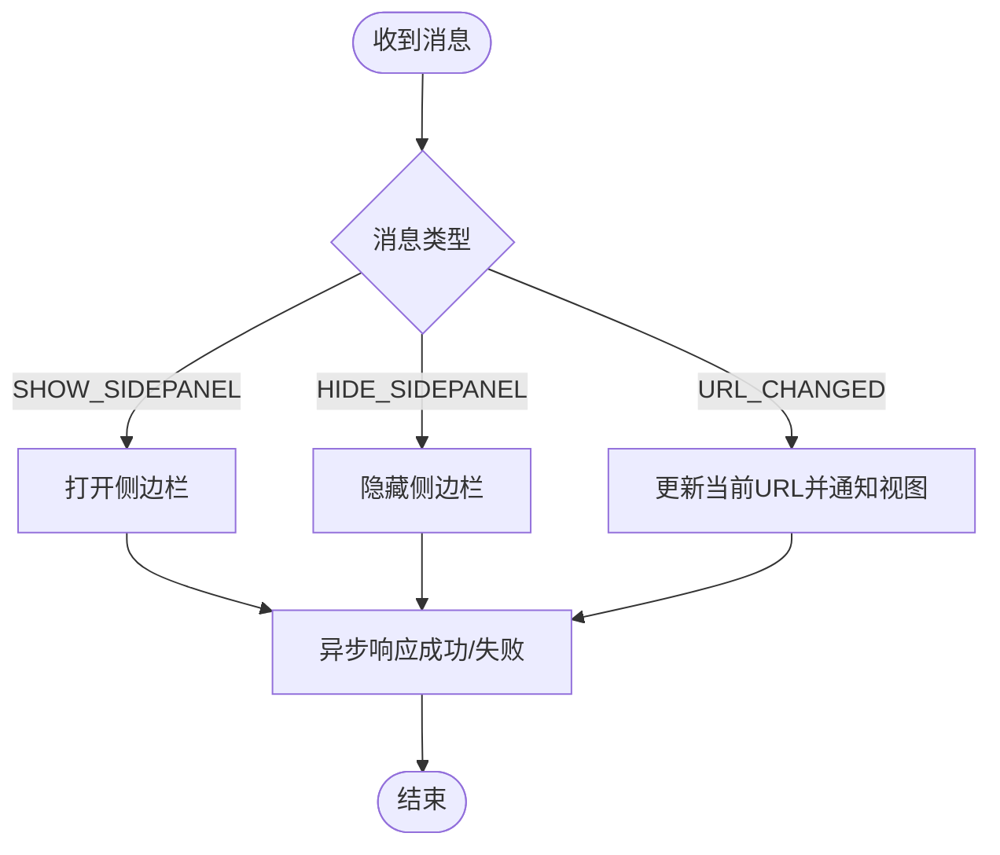
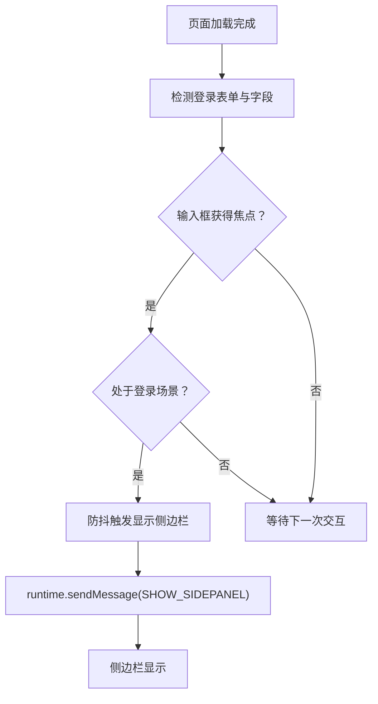
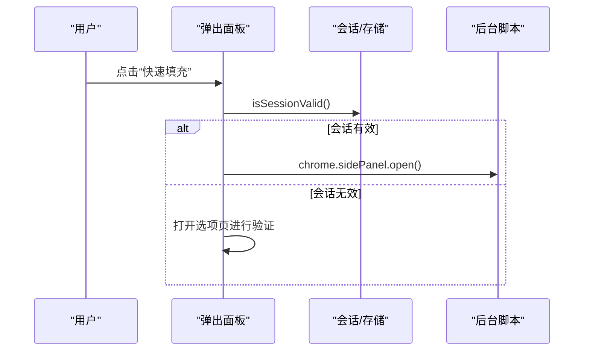
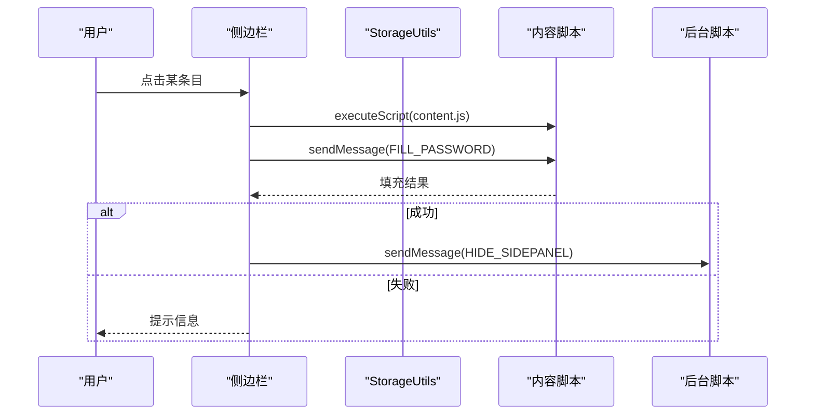
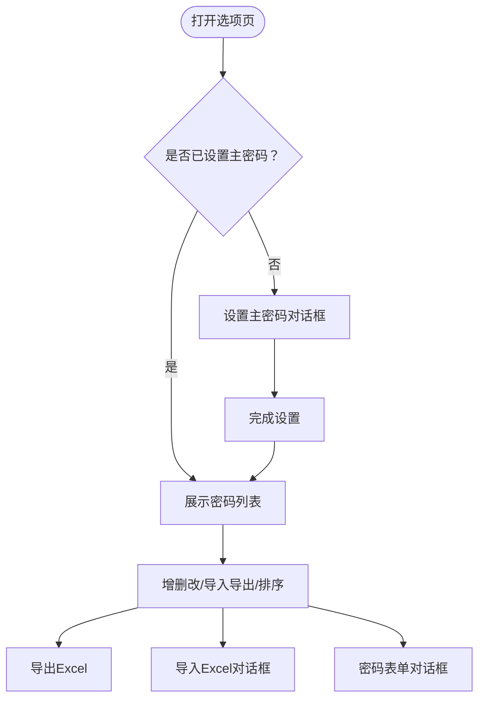
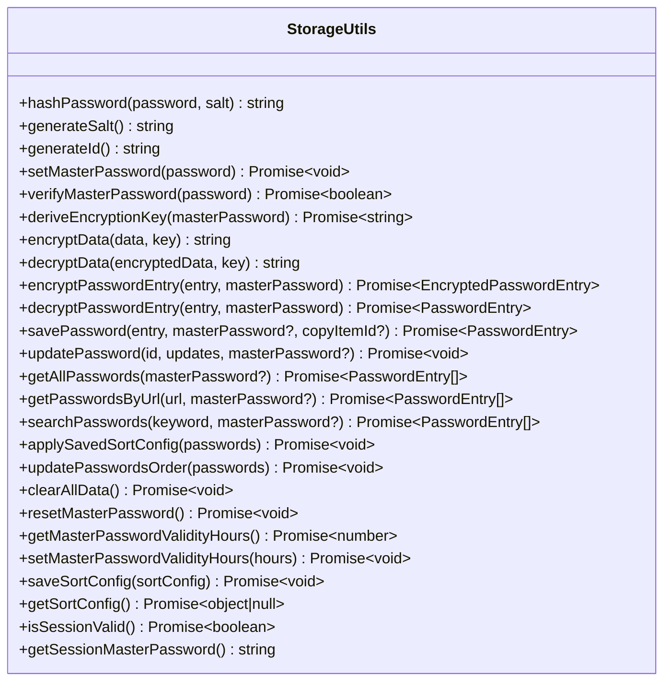
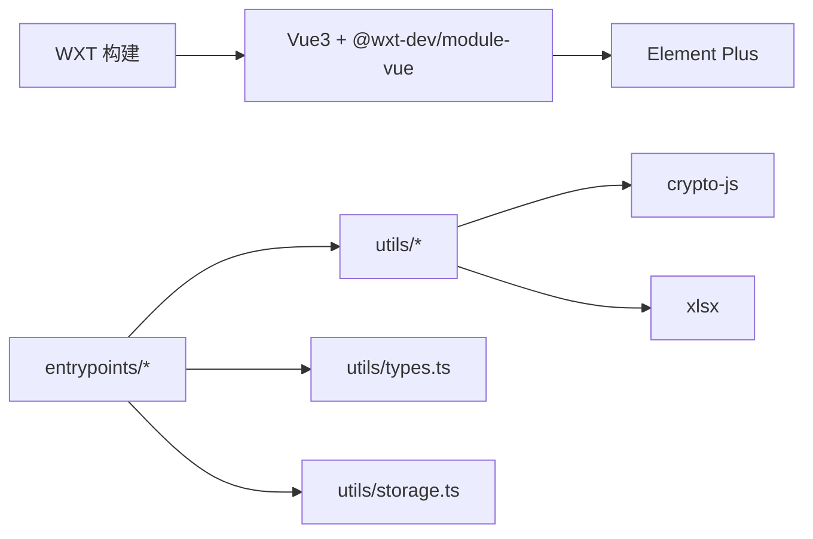

# 架构设计

<cite>
**本文引用的文件**
- [package.json](file://package.json)
- [wxt.config.ts](file://wxt.config.ts)
- [background.ts](file://entrypoints/background.ts)
- [content.ts](file://entrypoints/content.ts)
- [popup/main.ts](file://entrypoints/popup/main.ts)
- [popup/App.vue](file://entrypoints/popup/App.vue)
- [sidepanel/main.ts](file://entrypoints/sidepanel/main.ts)
- [sidepanel/App.vue](file://entrypoints/sidepanel/App.vue)
- [options/main.ts](file://entrypoints/options/main.ts)
- [options/App.vue](file://entrypoints/options/App.vue)
- [types.ts](file://utils/types.ts)
- [storage.ts](file://utils/storage.ts)
- [PasswordFormDialog.vue](file://components/PasswordFormDialog.vue)
- [MasterPasswordDialog.vue](file://components/MasterPasswordDialog.vue)
- [ImportDialog.vue](file://components/ImportDialog.vue)
- [README.md](file://README.md)
</cite>

## 目录
1. [引言](#引言)
2. [项目结构](#项目结构)
3. [核心组件](#核心组件)
4. [架构总览](#架构总览)
5. [详细组件分析](#详细组件分析)
6. [依赖分析](#依赖分析)
7. [性能考量](#性能考量)
8. [故障排查指南](#故障排查指南)
9. [结论](#结论)
10. [附录](#附录)

## 引言
本项目是一个基于 Chrome MV3 的账号密码管理扩展，采用 WXT + Vue3 + TypeScript 技术栈，结合 MVVM 架构与消息传递模式，实现“智能表单检测 + 侧边栏快速填充”的核心能力。扩展通过后台脚本（background）、内容脚本（content）、弹出面板（popup）、侧边栏（sidepanel）与选项页（options）五大入口协同工作，配合本地存储与加密模块，提供安全、易用、可扩展的密码管理体验。

## 项目结构
项目采用“入口点 + 组件 + 工具库”的分层组织方式：
- 入口点（entrypoints）：background、content、popup、sidepanel、options，分别对应扩展的不同运行上下文与职责边界。
- 组件（components）：可复用的 UI 组件，如导入对话框、主密码对话框、密码表单对话框等。
- 工具库（utils）：类型定义、存储与加密、Excel 导入导出、会话管理、Shadow DOM 样式注入等。
- 配置（根目录）：包管理、构建配置、清单与权限声明等。

图表来源
- [background.ts](file://entrypoints/background.ts#L1-L232)
- [content.ts](file://entrypoints/content.ts#L1-L800)
- [popup/App.vue](file://entrypoints/popup/App.vue#L1-L234)
- [sidepanel/App.vue](file://entrypoints/sidepanel/App.vue#L1-L800)
- [options/App.vue](file://entrypoints/options/App.vue#L1-L800)
- [types.ts](file://utils/types.ts#L1-L96)
- [storage.ts](file://utils/storage.ts#L1-L800)

章节来源
- [README.md](file://README.md#L27-L34)
- [wxt.config.ts](file://wxt.config.ts#L1-L48)
- [package.json](file://package.json#L1-L49)

## 核心组件
- 后台脚本（background）：负责扩展生命周期事件、快捷键命令、侧边栏开关控制、标签页变更通知等。
- 内容脚本（content）：监听页面 DOM 变化与用户交互，智能检测登录表单，决定何时显示侧边栏。
- 弹出面板（popup）：提供最简入口，打开选项页或快速打开侧边栏；在会话有效时展示密码数量。
- 侧边栏（sidepanel）：核心交互区，展示匹配密码、搜索过滤、填充密码、打开选项页等。
- 选项页（options）：主管理界面，设置/验证主密码、管理密码条目、导入导出、排序配置等。
- 类型与存储：统一的消息类型、密码条目结构与本地存储/加密抽象，保障跨模块一致性。
- 可复用组件：主密码对话框、导入对话框、密码表单对话框等，提升开发与维护效率。

章节来源
- [background.ts](file://entrypoints/background.ts#L1-L232)
- [content.ts](file://entrypoints/content.ts#L1-L800)
- [popup/App.vue](file://entrypoints/popup/App.vue#L1-L234)
- [sidepanel/App.vue](file://entrypoints/sidepanel/App.vue#L1-L800)
- [options/App.vue](file://entrypoints/options/App.vue#L1-L800)
- [types.ts](file://utils/types.ts#L1-L96)
- [storage.ts](file://utils/storage.ts#L1-L800)

## 架构总览
本扩展采用 MVVM 架构与消息传递模式：
- 视图层（Vue3 + Element Plus）：弹出面板、侧边栏、选项页三套视图，分别承载不同职责。
- VM（ViewModel）：各入口的 main.ts 作为应用挂载点，App.vue 作为视图模型，封装状态与交互。
- Model（数据模型）：PasswordEntry、MasterPasswordConfig、Message/MessageType 等类型定义；StorageUtils 提供数据持久化与加密。
- 通信机制：Chrome runtime messaging（runtime.onMessage、tabs.sendMessage、runtime.sendMessage）实现后台、内容、视图间的消息传递。

图表来源
- [popup/App.vue](file://entrypoints/popup/App.vue#L127-L151)
- [background.ts](file://entrypoints/background.ts#L33-L73)
- [sidepanel/App.vue](file://entrypoints/sidepanel/App.vue#L342-L422)
- [content.ts](file://entrypoints/content.ts#L86-L91)

章节来源
- [types.ts](file://utils/types.ts#L52-L87)
- [storage.ts](file://utils/storage.ts#L514-L555)

## 详细组件分析

### 后台脚本（background）职责与交互
- 生命周期与快捷键：监听扩展安装、标签页更新/激活、命令触发（打开选项页、切换侧边栏）。
- 侧边栏控制：根据消息类型（SHOW/HIDE_SIDEPANEL）调用 chrome.sidePanel API 打开/隐藏侧边栏；对异常进行错误处理与回传。
- URL 变更通知：接收 content 侧的 URL_CHANGED 消息，驱动 sidepanel 数据刷新。
- 与视图通信：通过 runtime.onMessage 接收消息并异步响应，保持通道开放。

图表来源
- [background.ts](file://entrypoints/background.ts#L33-L73)
- [background.ts](file://entrypoints/background.ts#L75-L138)
- [background.ts](file://entrypoints/background.ts#L184-L201)

章节来源
- [background.ts](file://entrypoints/background.ts#L1-L232)

### 内容脚本（content）职责与交互
- 表单检测：通过 MutationObserver 与事件委托，检测页面中登录表单、密码/用户名/手机号/验证码字段，决定何时显示侧边栏。
- 侧边栏触发：当焦点落在识别字段上且处于登录场景时，触发防抖后的侧边栏显示。
- 与后台通信：监听 runtime.onMessage，处理后台下发的 URL_CHANGED 等消息；向后台发送心跳/检测等消息。
- 注入与填充：在侧边栏请求时，确保 content 脚本已注入页面，再向页面发送填充消息。

图表来源
- [content.ts](file://entrypoints/content.ts#L6-L91)
- [content.ts](file://entrypoints/content.ts#L172-L476)
- [content.ts](file://entrypoints/content.ts#L611-L636)

章节来源
- [content.ts](file://entrypoints/content.ts#L1-L800)

### 弹出面板（popup）职责与交互
- 会话校验：启动时检查会话有效性，仅在有效时展示密码数量。
- 快速入口：提供“管理密码”和“快速填充”两大入口；快速填充会检查会话并打开侧边栏。
- 选项页导航：查询/创建选项页标签，确保用户能快速进入管理界面。

图表来源
- [popup/App.vue](file://entrypoints/popup/App.vue#L59-L90)
- [popup/App.vue](file://entrypoints/popup/App.vue#L127-L151)

章节来源
- [popup/App.vue](file://entrypoints/popup/App.vue#L1-L234)
- [popup/main.ts](file://entrypoints/popup/main.ts#L1-L10)

### 侧边栏（sidepanel）职责与交互
- 会话与数据：启动时检查会话有效性，加载当前域名匹配的密码列表；支持搜索过滤与排序。
- 填充流程：点击条目后注入 content 脚本，发送填充消息；成功后通过后台隐藏侧边栏。
- URL 变更：监听标签页更新/激活与后台 URL_CHANGED 消息，动态刷新数据。
- 选项页导航：提供“去验证主密码”“去添加密码”等入口。

图表来源
- [sidepanel/App.vue](file://entrypoints/sidepanel/App.vue#L342-L422)
- [sidepanel/App.vue](file://entrypoints/sidepanel/App.vue#L233-L247)
- [sidepanel/App.vue](file://entrypoints/sidepanel/App.vue#L257-L270)

章节来源
- [sidepanel/App.vue](file://entrypoints/sidepanel/App.vue#L1-L800)
- [sidepanel/main.ts](file://entrypoints/sidepanel/main.ts#L1-L10)

### 选项页（options）职责与交互
- 主密码管理：首次使用设置主密码，后续验证主密码；支持有效期设置与会话清除。
- 密码管理：表格展示密码条目，支持增删改、搜索、排序、复制、批量删除。
- 导入导出：Excel 导入预览与批量保存；导出为 Excel。
- 对话框组件：主密码对话框、导入对话框、密码表单对话框等。

图表来源
- [options/App.vue](file://entrypoints/options/App.vue#L1-L800)
- [MasterPasswordDialog.vue](file://components/MasterPasswordDialog.vue#L1-L447)
- [ImportDialog.vue](file://components/ImportDialog.vue#L1-L343)
- [PasswordFormDialog.vue](file://components/PasswordFormDialog.vue#L1-L336)

章节来源
- [options/App.vue](file://entrypoints/options/App.vue#L1-L800)
- [options/main.ts](file://entrypoints/options/main.ts#L1-L11)

### 存储与加密（StorageUtils）
- 数据模型：PasswordEntry、MasterPasswordConfig；消息类型：MessageType。
- 存储键：本地存储主密码配置、密码条目、排序配置、主密码有效期等。
- 加密策略：MD5 用于主密码校验（配合盐值），AES-256-CBC 用于密码字段加密（带随机 IV）；支持安全解密与字段级容错。
- 会话管理：基于内存与本地存储的会话缓存，支持有效期与自动续期。

图表来源
- [storage.ts](file://utils/storage.ts#L37-L800)
- [types.ts](file://utils/types.ts#L1-L96)

章节来源
- [storage.ts](file://utils/storage.ts#L1-L800)
- [types.ts](file://utils/types.ts#L1-L96)

## 依赖分析
- 构建与框架：WXT 提供 MV3 构建与模块化支持；@wxt-dev/module-vue 与 Vue3 生态集成。
- UI 组件：Element Plus 提供丰富的 UI 组件与主题样式。
- 加密与文件处理：crypto-js 实现哈希与 AES 加密；xlsx 实现 Excel 导入导出。
- 权限与清单：storage、activeTab、scripting、sidePanel 等权限；快捷键 commands 配置。

图表来源
- [package.json](file://package.json#L22-L46)
- [wxt.config.ts](file://wxt.config.ts#L1-L48)

章节来源
- [package.json](file://package.json#L1-L49)
- [wxt.config.ts](file://wxt.config.ts#L1-L48)

## 性能考量
- 内容脚本性能优化
  - 使用 WeakMap/WeakSet 缓存字段类型与检测结果，避免内存泄漏。
  - 使用防抖（debounce）控制侧边栏显示频率，降低频繁触发带来的性能损耗。
  - MutationObserver 仅监听关键属性与新增节点，减少不必要的重检。
- 侧边栏渲染优化
  - 计算属性（computed）实现搜索与排序，避免重复计算。
  - 分页/虚拟滚动：当前实现为完整列表渲染，建议在大量数据时引入虚拟滚动与分页。
- 存储与加密
  - 仅对敏感字段（如密码）进行加密，减少加密/解密开销。
  - 会话缓存与内存变量减少频繁读写本地存储。
- 网络与 I/O
  - Excel 导入采用一次性解析与批量保存，避免逐条写入导致的多次 I/O。

## 故障排查指南
- 侧边栏不显示
  - 检查 Chrome 版本是否支持 sidePanel API；确认后台脚本已正确调用 chrome.sidePanel.open。
  - 若 API 不可用，需引导用户升级浏览器版本。
- 填充失败
  - 确认内容脚本已注入；检查页面是否动态加载导致时机过早；适当增加注入后的等待时间。
  - 检查目标表单字段是否被识别（选择器覆盖范围）。
- 选项页无法打开
  - 检查后台脚本是否正确查询/创建选项页标签；确认 options.html 资源已打包。
- 主密码相关
  - 验证失败：确认输入一致且未包含前后空格；检查存储键是否存在。
  - 重置主密码：谨慎使用，会清空主密码配置与会话缓存。

章节来源
- [background.ts](file://entrypoints/background.ts#L75-L138)
- [content.ts](file://entrypoints/content.ts#L354-L422)
- [options/App.vue](file://entrypoints/options/App.vue#L1-L800)

## 结论
本扩展通过 MVVM 架构与消息传递模式，实现了清晰的职责分离与高内聚低耦合的模块化设计。后台脚本承担协调者角色，内容脚本专注页面交互，视图层以 Vue3 组件化形式提供一致的用户体验。结合本地存储与加密、Excel 导入导出、会话管理等能力，系统在保证安全性的同时具备良好的可扩展性与可维护性。未来可在大数据量场景引入虚拟滚动与分页、进一步优化加密策略与缓存命中率，并持续完善错误提示与调试能力。

## 附录
- 技术选型说明
  - WXT：简化 MV3 构建与模块化开发，提供热重载与多浏览器支持。
  - Vue3 + Element Plus：组件化与丰富的 UI 能力，便于快速迭代。
  - crypto-js/xlsx：成熟稳定的加密与 Excel 处理方案。
- 安全与隐私
  - 主密码保护与本地存储；最小权限原则；不上传任何数据至服务器。
- 可扩展性
  - 新增消息类型与视图入口；扩展存储键与加密策略；引入插件化组件与主题系统。