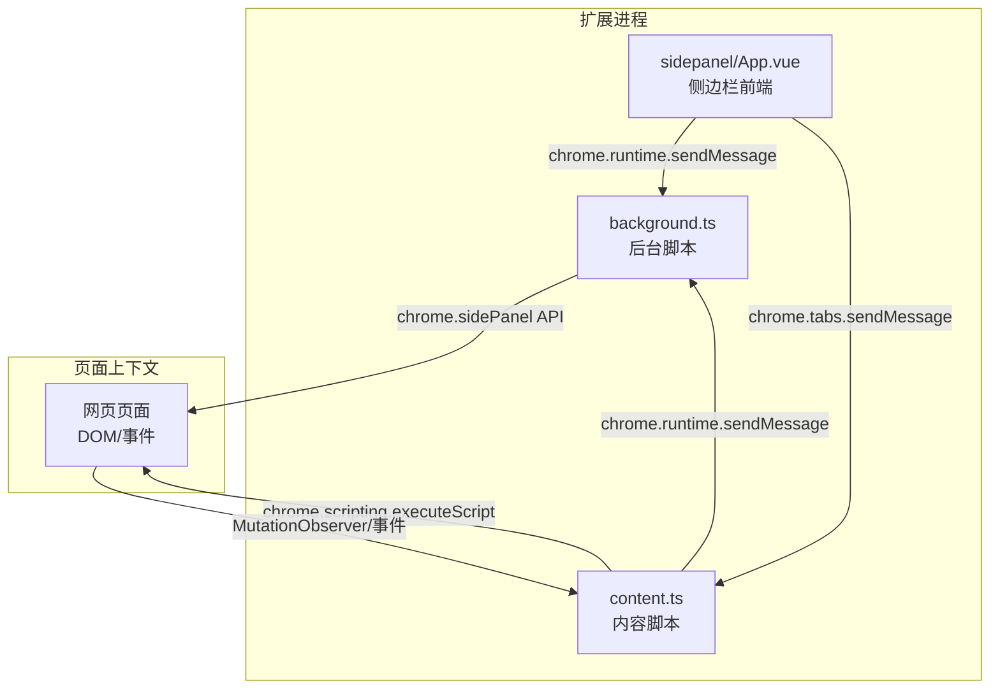
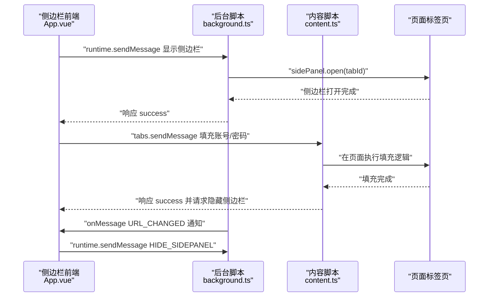
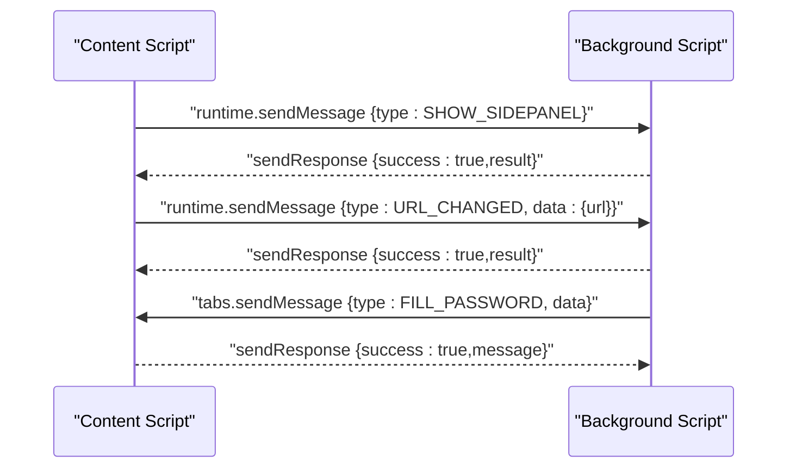
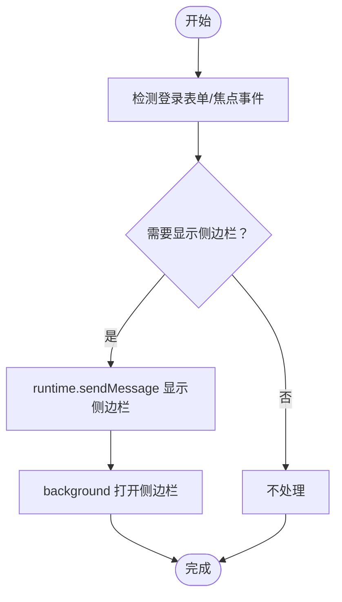
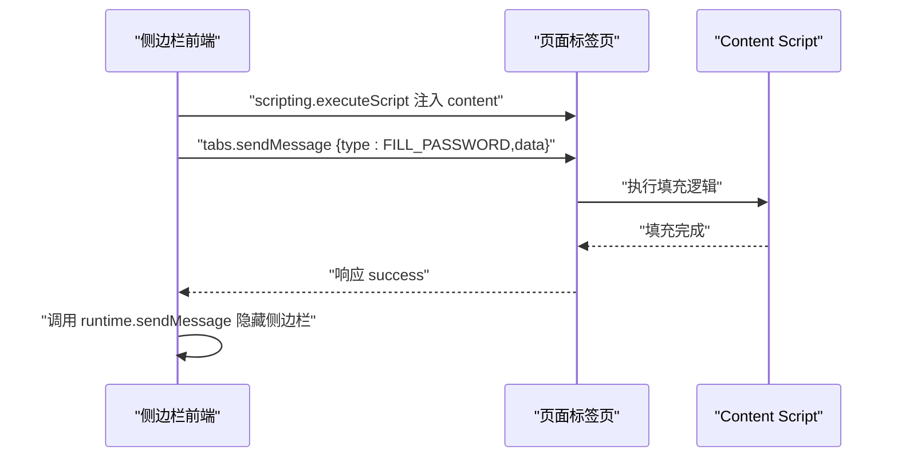
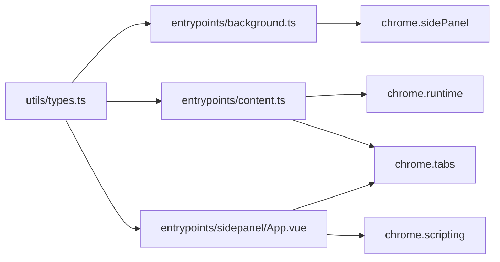

# 消息通信机制

<cite>
**本文引用的文件**
- [entrypoints/background.ts](file://entrypoints/background.ts)
- [entrypoints/content.ts](file://entrypoints/content.ts)
- [entrypoints/sidepanel/App.vue](file://entrypoints/sidepanel/App.vue)
- [utils/types.ts](file://utils/types.ts)
- [wxt.config.ts](file://wxt.config.ts)
- [package.json](file://package.json)
</cite>

## 目录
1. [简介](#简介)
2. [项目结构](#项目结构)
3. [核心组件](#核心组件)
4. [架构总览](#架构总览)
5. [详细组件分析](#详细组件分析)
6. [依赖分析](#依赖分析)
7. [性能考量](#性能考量)
8. [故障排查指南](#故障排查指南)
9. [结论](#结论)

## 简介
本文件系统化梳理 Account Password Helper 插件的消息通信机制，重点覆盖以下方面：
- Chrome 扩展消息传递 API 的使用：runtime.sendMessage、tabs.sendMessage、runtime.onMessage 等
- Content Script 与 Background Script 之间的双向通信协议：请求-响应模式与事件通知机制
- 消息类型定义、参数传递与错误处理策略
- 异步消息处理的性能考虑与调试技巧
- 消息通信的安全性保障与权限控制
- 常见通信场景的实现方案与最佳实践

## 项目结构
该项目采用 WXT（WebExtension Toolkit）组织多入口架构，主要涉及以下入口与通信角色：
- background：后台脚本，负责监听标签页事件、快捷键命令以及来自 content 的消息，并协调侧边栏显示/隐藏
- content：内容脚本，负责表单检测、侧边栏显示/隐藏触发、向页面注入脚本、向 content 发送填充指令
- sidepanel：侧边栏前端，负责密码列表展示、搜索、主密码校验、向 content 发送填充消息
- types：统一的消息类型与数据模型定义
- manifest 权限：storage、activeTab、scripting、sidePanel 等

图表来源
- [entrypoints/background.ts](file://entrypoints/background.ts#L1-L232)
- [entrypoints/content.ts](file://entrypoints/content.ts#L1-L1892)
- [entrypoints/sidepanel/App.vue](file://entrypoints/sidepanel/App.vue#L350-L422)

章节来源
- [wxt.config.ts](file://wxt.config.ts#L18-L46)
- [package.json](file://package.json#L22-L48)

## 核心组件
- 消息类型与数据模型
  - MessageType：定义了心跳、表单检测、密码填充、手机号验证码填充、显示/隐藏侧边栏、URL 变化、获取密码列表等消息类型
  - Message：统一消息结构，包含 type 与可选 data
- background.ts
  - 监听 runtime.onMessage，处理 SHOW_SIDEPANEL/HIDE_SIDEPANEL/URL_CHANGED 等消息，异步处理并返回响应
  - 通过 chrome.sidePanel API 控制侧边栏显示/隐藏
- content.ts
  - 监听 runtime.onMessage，接收来自 sidepanel 的填充指令并执行
  - 通过 chrome.runtime.sendMessage 与 background 通信，触发侧边栏显示/隐藏与 URL 变化通知
  - 通过 chrome.tabs.sendMessage 将填充指令下发给页面注入脚本
- sidepanel/App.vue
  - 通过 chrome.scripting.executeScript 注入 content 脚本
  - 通过 chrome.tabs.sendMessage 发送填充消息（账号/密码或手机号/验证码）
  - 通过 chrome.runtime.sendMessage 请求隐藏侧边栏

章节来源
- [utils/types.ts](file://utils/types.ts#L51-L96)
- [entrypoints/background.ts](file://entrypoints/background.ts#L33-L73)
- [entrypoints/content.ts](file://entrypoints/content.ts#L86-L91)
- [entrypoints/sidepanel/App.vue](file://entrypoints/sidepanel/App.vue#L354-L422)

## 架构总览
下图展示了消息通信的总体流向与职责边界：

图表来源
- [entrypoints/background.ts](file://entrypoints/background.ts#L33-L73)
- [entrypoints/content.ts](file://entrypoints/content.ts#L993-L1028)
- [entrypoints/sidepanel/App.vue](file://entrypoints/sidepanel/App.vue#L393-L422)

## 详细组件分析

### 消息类型与协议设计
- 消息类型
  - SHOW_SIDEPANEL/HIDE_SIDEPANEL：控制侧边栏显示/隐藏
  - URL_CHANGED：通知 URL 变化，便于侧边栏更新数据
  - FILL_PASSWORD/FILL_MOBILE_CODE：向页面注入脚本执行密码/手机号验证码填充
  - DETECT_FORM/PING：用于表单检测与心跳
  - GET_PASSWORDS：获取密码列表（可用于后续扩展）
- 参数约定
  - type：严格使用 MessageType 枚举
  - data：按消息类型约定携带必要参数（如 URL、账号/密码、手机号/验证码）

章节来源
- [utils/types.ts](file://utils/types.ts#L51-L96)

### Content Script 与 Background Script 的双向通信
- Content -> Background
  - 触发显示/隐藏侧边栏：chrome.runtime.sendMessage({ type: SHOW_SIDEPANEL/HIDE_SIDEPANEL })
  - URL 变化通知：chrome.runtime.sendMessage({ type: URL_CHANGED, data: { url } })
- Background -> Content
  - 填充指令：chrome.tabs.sendMessage(tabId, { type: FILL_PASSWORD/FILL_MOBILE_CODE, data })
  - 侧边栏控制：chrome.runtime.sendMessage({ type: SHOW_SIDEPANEL/HIDE_SIDEPANEL })

图表来源
- [entrypoints/content.ts](file://entrypoints/content.ts#L997-L1028)
- [entrypoints/background.ts](file://entrypoints/background.ts#L33-L73)

章节来源
- [entrypoints/content.ts](file://entrypoints/content.ts#L993-L1028)
- [entrypoints/background.ts](file://entrypoints/background.ts#L33-L73)

### 侧边栏显示/隐藏控制流程
- 显示侧边栏
  - sidepanel 通过 runtime.sendMessage 请求 background 显示
  - background 调用 chrome.sidePanel.open(tabId)，并返回响应
- 隐藏侧边栏
  - sidepanel 在填充完成后请求 background 隐藏
  - background 返回响应；content 侧在 URL 变化或页面失焦时也会主动隐藏

图表来源
- [entrypoints/content.ts](file://entrypoints/content.ts#L993-L1008)
- [entrypoints/background.ts](file://entrypoints/background.ts#L75-L109)

章节来源
- [entrypoints/content.ts](file://entrypoints/content.ts#L993-L1028)
- [entrypoints/background.ts](file://entrypoints/background.ts#L75-L138)

### 页面注入与填充流程
- 侧边栏前端通过 scripting.executeScript 注入 content 脚本
- 侧边栏前端向页面 tab 发送填充消息（账号/密码）
- content 脚本执行填充逻辑并返回响应，随后请求隐藏侧边栏

图表来源
- [entrypoints/sidepanel/App.vue](file://entrypoints/sidepanel/App.vue#L354-L422)
- [entrypoints/content.ts](file://entrypoints/content.ts#L1184-L1217)

章节来源
- [entrypoints/sidepanel/App.vue](file://entrypoints/sidepanel/App.vue#L354-L422)
- [entrypoints/content.ts](file://entrypoints/content.ts#L1184-L1217)

### 错误处理与健壮性
- background 对每类消息均进行 try/catch，并在异常时返回 { success: false, error }，便于调用方感知
- content 对 URL 变化通知、侧边栏显示/隐藏、填充执行均进行 try/catch 并记录日志
- sidepanel 在注入失败、连接失败、填充失败时给出用户提示与兜底行为

章节来源
- [entrypoints/background.ts](file://entrypoints/background.ts#L33-L73)
- [entrypoints/content.ts](file://entrypoints/content.ts#L993-L1028)
- [entrypoints/sidepanel/App.vue](file://entrypoints/sidepanel/App.vue#L414-L422)

### 性能优化与最佳实践
- 异步消息处理
  - background 对所有消息处理函数返回 Promise，并在 onMessage 中 return true 以保持通道开放，避免响应丢失
- 防抖与事件委托
  - content 使用防抖函数减少频繁触发
  - 使用 focusin 事件委托降低监听器数量，提升性能
- DOM 操作与事件分发
  - content 在填充输入框时，模拟完整的事件序列（focus/input/change/blur 等），提升兼容性
- MutationObserver
  - content 使用 MutationObserver 监听 DOM 变化，按需重检表单，避免轮询带来的性能损耗

章节来源
- [entrypoints/background.ts](file://entrypoints/background.ts#L33-L73)
- [entrypoints/content.ts](file://entrypoints/content.ts#L9-L19)
- [entrypoints/content.ts](file://entrypoints/content.ts#L611-L614)
- [entrypoints/content.ts](file://entrypoints/content.ts#L1308-L1375)
- [entrypoints/content.ts](file://entrypoints/content.ts#L93-L170)

## 依赖分析
- 消息类型定义集中于 utils/types.ts，确保各入口一致引用
- background 依赖 chrome.sidePanel API 控制侧边栏
- content 依赖 chrome.runtime 与 chrome.tabs API 进行消息收发与页面注入
- sidepanel 依赖 chrome.scripting 与 chrome.tabs API 实现脚本注入与消息转发

图表来源
- [utils/types.ts](file://utils/types.ts#L51-L96)
- [entrypoints/background.ts](file://entrypoints/background.ts#L1-L232)
- [entrypoints/content.ts](file://entrypoints/content.ts#L1-L1892)
- [entrypoints/sidepanel/App.vue](file://entrypoints/sidepanel/App.vue#L1-L911)

章节来源
- [utils/types.ts](file://utils/types.ts#L51-L96)
- [wxt.config.ts](file://wxt.config.ts#L18-L46)

## 性能考量
- 使用 MutationObserver 替代定时轮询，按需检测表单变化
- 使用事件委托与防抖，降低事件监听与回调频率
- 异步消息处理避免阻塞 UI 线程，保持响应流畅
- 在填充输入框时模拟完整事件序列，减少因事件缺失导致的二次触发

[本节为通用性能建议，不直接分析具体文件]

## 故障排查指南
- 无法建立连接
  - sidepanel 在连接失败时提示“无法连接到页面脚本”，建议刷新页面后重试
- 注入失败
  - sidepanel 注入 content 脚本失败时提示“无法在当前页面中注入脚本”，建议刷新页面后重试
- 侧边栏无法隐藏
  - background 提供了隐藏侧边栏的逻辑；若 API 不可用，content 会在 URL 变化或页面失焦时主动隐藏
- URL 变化未触发
  - content 通过 popstate 与 MutationObserver 监听路由变化，若 SPA 路由未触发，可检查监听逻辑

章节来源
- [entrypoints/sidepanel/App.vue](file://entrypoints/sidepanel/App.vue#L414-L422)
- [entrypoints/sidepanel/App.vue](file://entrypoints/sidepanel/App.vue#L354-L368)
- [entrypoints/content.ts](file://entrypoints/content.ts#L1141-L1182)
- [entrypoints/background.ts](file://entrypoints/background.ts#L111-L138)

## 结论
本项目的消息通信机制围绕 runtime.sendMessage、tabs.sendMessage、runtime.onMessage 构建，形成了清晰的 Content <-> Background <-> SidePanel 三层协作模式。通过统一的消息类型定义、异步响应与错误处理、性能优化手段（防抖、事件委托、MutationObserver），以及完善的侧边栏控制与页面注入流程，实现了稳定高效的扩展通信。建议在后续迭代中：
- 明确区分请求-响应与事件通知两类消息，避免混用
- 对敏感操作增加权限校验与主密码验证
- 增强消息超时与重试策略，提升弱网环境下的可靠性