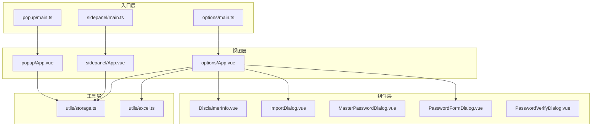
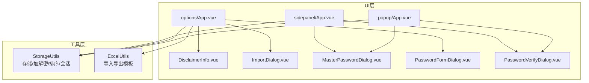
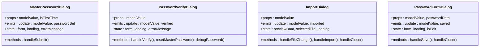
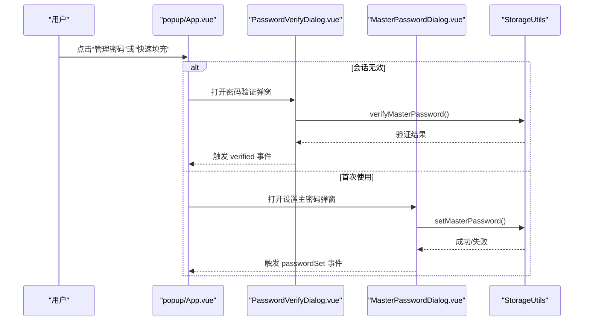
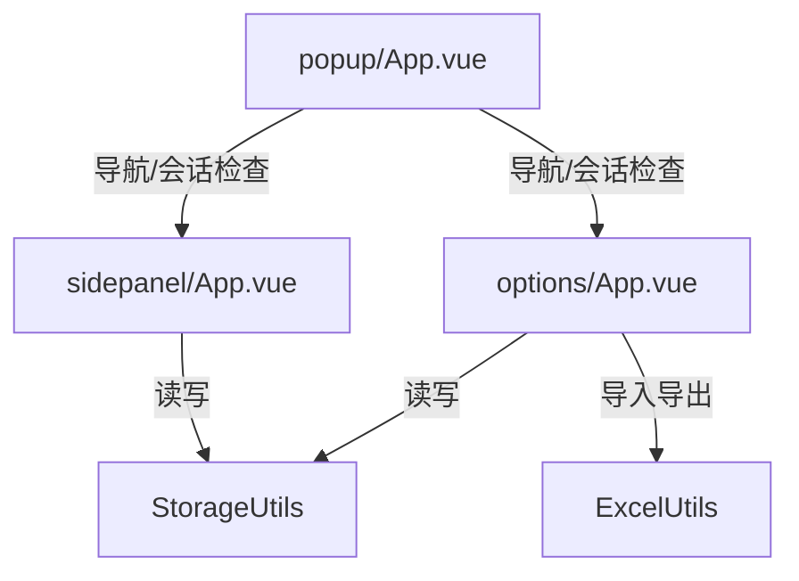
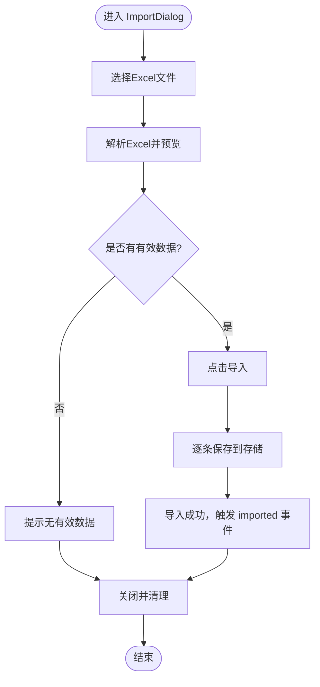
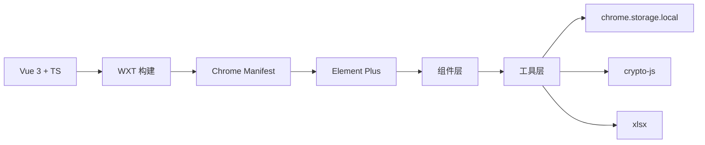

# 组件化架构设计

<cite>
**本文引用的文件**
- [README.md](file://README.md)
- [package.json](file://package.json)
- [wxt.config.ts](file://wxt.config.ts)
- [components/DisclaimerInfo.vue](file://components/DisclaimerInfo.vue)
- [components/ImportDialog.vue](file://components/ImportDialog.vue)
- [components/MasterPasswordDialog.vue](file://components/MasterPasswordDialog.vue)
- [components/PasswordFormDialog.vue](file://components/PasswordFormDialog.vue)
- [components/PasswordVerifyDialog.vue](file://components/PasswordVerifyDialog.vue)
- [entrypoints/popup/App.vue](file://entrypoints/popup/App.vue)
- [entrypoints/options/App.vue](file://entrypoints/options/App.vue)
- [entrypoints/sidepanel/App.vue](file://entrypoints/sidepanel/App.vue)
- [entrypoints/popup/main.ts](file://entrypoints/popup/main.ts)
- [entrypoints/options/main.ts](file://entrypoints/options/main.ts)
- [entrypoints/sidepanel/main.ts](file://entrypoints/sidepanel/main.ts)
- [utils/storage.ts](file://utils/storage.ts)
- [utils/excel.ts](file://utils/excel.ts)
</cite>

## 目录
1. [引言](#引言)
2. [项目结构](#项目结构)
3. [核心组件](#核心组件)
4. [架构总览](#架构总览)
5. [详细组件分析](#详细组件分析)
6. [依赖关系分析](#依赖关系分析)
7. [性能考虑](#性能考虑)
8. [故障排查指南](#故障排查指南)
9. [结论](#结论)
10. [附录](#附录)

## 引言
本项目是一个基于 WXT + Vue 3 + TypeScript 的 Chrome 扩展，提供账号密码的管理、导入导出、侧边栏快速填充等功能。本文围绕“Account Password Helper”的组件化架构设计展开，重点阐述 Vue 3 Composition API 在 Chrome 扩展中的应用，包括响应式数据管理、生命周期钩子与组件间通信；总结可复用组件的设计原则与实现模式（尤其是对话框组件的通用化设计）；分析职责分离、状态管理与事件处理机制；梳理组件树层次结构与数据流向；并给出可测试性与可维护性的设计建议及性能优化策略。

## 项目结构
项目采用多入口（popup、options、sidepanel）与组件库分层组织，结合 WXT 的模块化配置与路径别名，形成清晰的前端工程化结构。

图表来源
- [wxt.config.ts](file://wxt.config.ts#L7-L16)
- [entrypoints/popup/main.ts](file://entrypoints/popup/main.ts#L1-L10)
- [entrypoints/options/main.ts](file://entrypoints/options/main.ts#L1-L11)
- [entrypoints/sidepanel/main.ts](file://entrypoints/sidepanel/main.ts#L1-L10)
- [entrypoints/popup/App.vue](file://entrypoints/popup/App.vue#L1-L234)
- [entrypoints/options/App.vue](file://entrypoints/options/App.vue#L1-L800)
- [entrypoints/sidepanel/App.vue](file://entrypoints/sidepanel/App.vue#L1-L911)
- [components/DisclaimerInfo.vue](file://components/DisclaimerInfo.vue#L1-L20)
- [components/ImportDialog.vue](file://components/ImportDialog.vue#L1-L343)
- [components/MasterPasswordDialog.vue](file://components/MasterPasswordDialog.vue#L1-L447)
- [components/PasswordFormDialog.vue](file://components/PasswordFormDialog.vue#L1-L336)
- [components/PasswordVerifyDialog.vue](file://components/PasswordVerifyDialog.vue#L1-L474)
- [utils/storage.ts](file://utils/storage.ts#L1-L981)
- [utils/excel.ts](file://utils/excel.ts#L1-L155)

章节来源
- [wxt.config.ts](file://wxt.config.ts#L1-L48)
- [package.json](file://package.json#L1-L49)

## 核心组件
- 对话框组件群：统一采用 v-model + emit 的双向绑定模式，集中处理表单校验、加载态、错误提示与关闭清理，便于复用与一致性体验。
- 列表与表单组件：在 options 页面中承担 CRUD 与导入导出职责；在 sidepanel 中承担快速填充与搜索过滤职责。
- 公共信息组件：免责声明组件用于跨页面复用，提升一致性与可维护性。

章节来源
- [components/ImportDialog.vue](file://components/ImportDialog.vue#L1-L343)
- [components/MasterPasswordDialog.vue](file://components/MasterPasswordDialog.vue#L1-L447)
- [components/PasswordFormDialog.vue](file://components/PasswordFormDialog.vue#L1-L336)
- [components/PasswordVerifyDialog.vue](file://components/PasswordVerifyDialog.vue#L1-L474)
- [components/DisclaimerInfo.vue](file://components/DisclaimerInfo.vue#L1-L20)

## 架构总览
系统由三个入口页面构成独立的 SPA，共享同一套工具层与组件层。数据流主要通过 chrome.storage 与工具方法进行持久化与解密，对话框组件负责交互与业务流程编排。

图表来源
- [entrypoints/popup/App.vue](file://entrypoints/popup/App.vue#L51-L162)
- [entrypoints/options/App.vue](file://entrypoints/options/App.vue#L777-L800)
- [entrypoints/sidepanel/App.vue](file://entrypoints/sidepanel/App.vue#L163-L700)
- [utils/storage.ts](file://utils/storage.ts#L37-L981)
- [utils/excel.ts](file://utils/excel.ts#L4-L155)

## 详细组件分析

### 对话框组件通用化设计
- 统一的 v-model 双向绑定：通过 computed getter/setter 将外部 v-model 与内部状态解耦，保证父组件可控、子组件可复用。
- 表单校验与错误提示：内置 FormRules 与错误消息状态，减少父组件样板代码。
- 生命周期与焦点管理：利用 watch + nextTick 在弹窗打开时重置表单、清除校验与聚焦输入框，提升可用性。
- 加载态与事件发射：统一 loading 状态与 saved/imported/close 等事件，便于上层统一处理。

图表来源
- [components/MasterPasswordDialog.vue](file://components/MasterPasswordDialog.vue#L92-L238)
- [components/PasswordVerifyDialog.vue](file://components/PasswordVerifyDialog.vue#L100-L249)
- [components/ImportDialog.vue](file://components/ImportDialog.vue#L115-L206)
- [components/PasswordFormDialog.vue](file://components/PasswordFormDialog.vue#L86-L200)

章节来源
- [components/MasterPasswordDialog.vue](file://components/MasterPasswordDialog.vue#L92-L238)
- [components/PasswordVerifyDialog.vue](file://components/PasswordVerifyDialog.vue#L100-L249)
- [components/ImportDialog.vue](file://components/ImportDialog.vue#L115-L206)
- [components/PasswordFormDialog.vue](file://components/PasswordFormDialog.vue#L86-L200)

### 数据流与状态管理
- 会话状态：通过 StorageUtils 维护主密码会话有效性与有效期，配合内存缓存减少频繁读取。
- 列表与排序：options 与 sidepanel 均调用 StorageUtils 获取数据并应用保存的排序配置，确保一致性。
- 加密与解密：对敏感字段采用 PBKDF2 派生密钥与 AES-256-CBC 加解密，避免明文存储。

图表来源
- [entrypoints/popup/App.vue](file://entrypoints/popup/App.vue#L59-L151)
- [components/PasswordVerifyDialog.vue](file://components/PasswordVerifyDialog.vue#L154-L202)
- [components/MasterPasswordDialog.vue](file://components/MasterPasswordDialog.vue#L178-L237)
- [utils/storage.ts](file://utils/storage.ts#L119-L143)

章节来源
- [utils/storage.ts](file://utils/storage.ts#L793-L800)
- [utils/storage.ts](file://utils/storage.ts#L719-L760)
- [utils/storage.ts](file://utils/storage.ts#L765-L788)

### 组件树与数据流向
- popup：负责入口导航与会话检查，必要时引导至 options 或 sidepanel。
- options：承载主密码设置/验证、密码列表、导入导出、表单弹窗等完整管理能力。
- sidepanel：专注快速填充与搜索，按域名过滤匹配项并注入 content 脚本进行表单填充。

图表来源
- [entrypoints/popup/App.vue](file://entrypoints/popup/App.vue#L59-L151)
- [entrypoints/options/App.vue](file://entrypoints/options/App.vue#L777-L800)
- [entrypoints/sidepanel/App.vue](file://entrypoints/sidepanel/App.vue#L311-L422)
- [utils/storage.ts](file://utils/storage.ts#L514-L576)
- [utils/excel.ts](file://utils/excel.ts#L8-L45)

章节来源
- [entrypoints/popup/App.vue](file://entrypoints/popup/App.vue#L59-L151)
- [entrypoints/options/App.vue](file://entrypoints/options/App.vue#L344-L548)
- [entrypoints/sidepanel/App.vue](file://entrypoints/sidepanel/App.vue#L177-L335)

### 复杂逻辑组件流程图（以导入流程为例）

图表来源
- [components/ImportDialog.vue](file://components/ImportDialog.vue#L147-L206)
- [utils/excel.ts](file://utils/excel.ts#L50-L114)
- [utils/storage.ts](file://utils/storage.ts#L377-L426)

章节来源
- [components/ImportDialog.vue](file://components/ImportDialog.vue#L147-L206)
- [utils/excel.ts](file://utils/excel.ts#L50-L114)
- [utils/storage.ts](file://utils/storage.ts#L377-L426)

## 依赖关系分析
- 框架与构建：Vue 3 + TypeScript + WXT，Element Plus 提供 UI 基础组件。
- 存储与加密：chrome.storage.local + crypto-js 实现主密码配置、会话与数据加解密。
- Excel 处理：xlsx 实现导入导出与模板下载。

图表来源
- [package.json](file://package.json#L22-L27)
- [wxt.config.ts](file://wxt.config.ts#L1-L48)
- [utils/storage.ts](file://utils/storage.ts#L1-L7)
- [utils/excel.ts](file://utils/excel.ts#L1-L2)

章节来源
- [package.json](file://package.json#L22-L27)
- [wxt.config.ts](file://wxt.config.ts#L18-L46)

## 性能考虑
- 响应式与计算属性：在 sidepanel 的搜索与排序中使用 computed 与本地数组副本，避免重复计算与副作用。
- 事件与监听：在组件卸载时移除 chrome.storage/onMessage/tabs 等监听器，防止内存泄漏。
- 加载与渲染：对长列表使用虚拟滚动与分页策略（当前项目使用 Element Plus 表格，建议在大数据量时引入虚拟化）。
- 加密成本：PBKDF2 迭代次数与 AES 加解密在后台执行，避免阻塞 UI；对频繁读取的会话有效期与排序配置做内存缓存。
- 图标与样式：统一使用 Element Plus 图标与样式，减少自定义样式的复杂度与体积。

## 故障排查指南
- 主密码相关
  - 验证失败：检查盐值与哈希是否正确，确认输入密码前后去空格处理。
  - 重置主密码：通过弹窗确认后清空存储并刷新页面。
- Excel 导入
  - 文件格式不正确：确保包含“用户名”列且为必填，其他列名支持多语言别名。
  - 无有效数据：检查列名映射与空值过滤逻辑。
- 侧边栏填充
  - 无法注入脚本：检查 content script 注入与页面加载状态，必要时刷新页面重试。
  - 未匹配到密码：确认域名匹配规则与 URL 字段填写情况。

章节来源
- [components/PasswordVerifyDialog.vue](file://components/PasswordVerifyDialog.vue#L205-L225)
- [utils/excel.ts](file://utils/excel.ts#L50-L114)
- [entrypoints/sidepanel/App.vue](file://entrypoints/sidepanel/App.vue#L355-L422)

## 结论
本项目通过 Vue 3 Composition API 与 WXT 的组合，实现了清晰的多入口架构与可复用的对话框组件体系。借助统一的状态管理与工具层封装，组件职责明确、数据流向清晰、可测试性与可维护性良好。后续可在大数据量场景下引入虚拟化与懒加载、进一步优化加密与存储策略，并完善单元测试与端到端测试覆盖。

## 附录
- 最佳实践
  - 对话框组件：统一 v-model + emit，内置表单校验与错误提示，利用 watch + nextTick 管理焦点与状态。
  - 状态管理：将会话与配置缓存于内存，减少存储访问；对敏感数据采用 PBKDF2 + AES 加密。
  - 组件通信：父子组件通过 props/emits，跨页面通过 chrome.runtime 与 chrome.storage。
  - 可测试性：将业务逻辑抽离至工具类（StorageUtils/ExcelUtils），便于单元测试；对 UI 交互使用端到端测试。
- 性能优化
  - 使用 computed 与本地副本减少重复计算。
  - 合理拆分组件，避免一次性渲染超大列表。
  - 对高频操作（如搜索、排序）增加防抖与节流。
  - 对图片与图标资源进行压缩与按需加载。