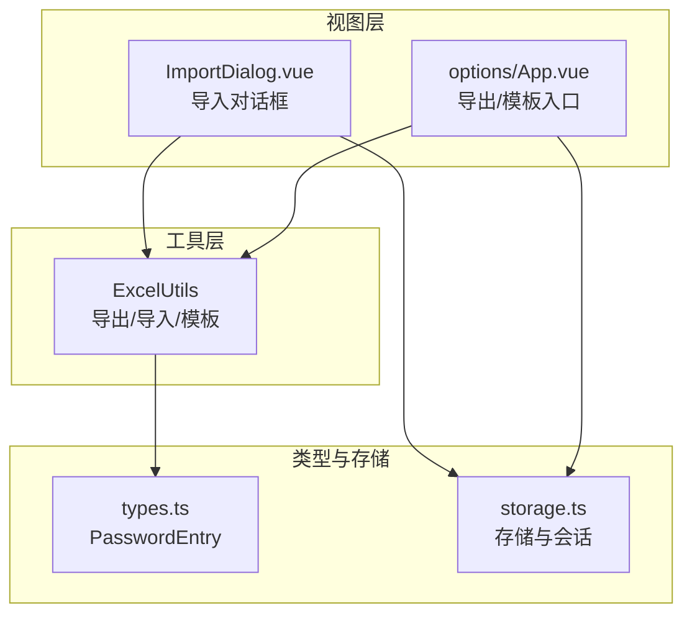
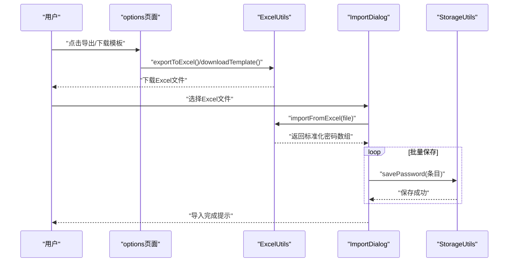
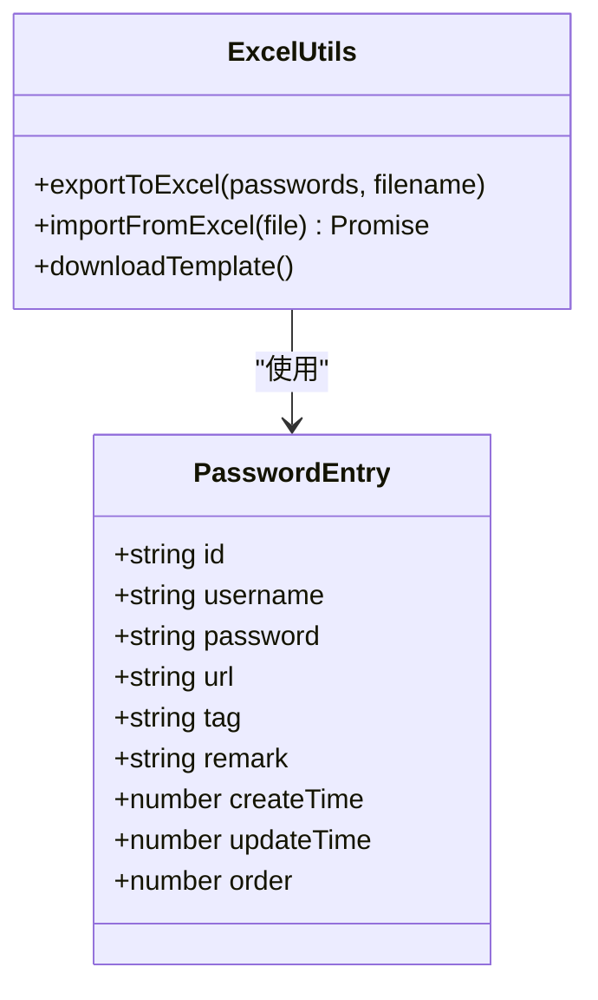
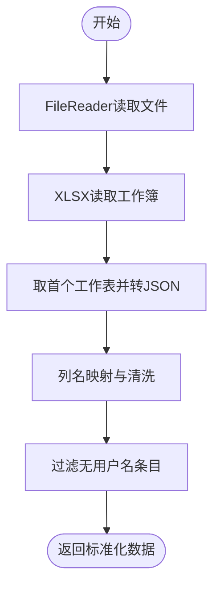
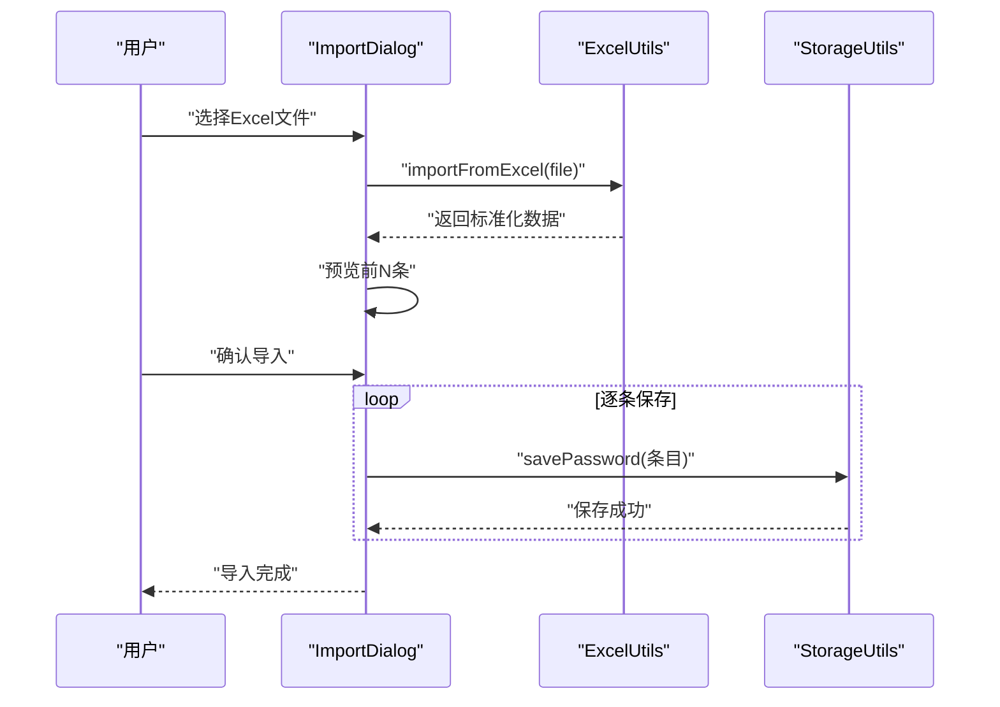
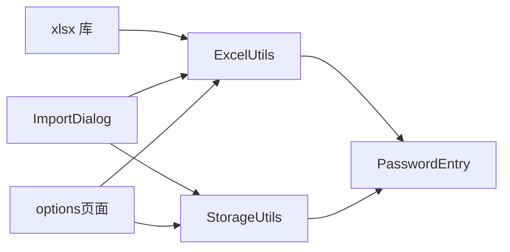

# Excel数据处理

<cite>
**本文引用的文件**
- [utils/excel.ts](file://utils/excel.ts)
- [components/ImportDialog.vue](file://components/ImportDialog.vue)
- [entrypoints/options/App.vue](file://entrypoints/options/App.vue)
- [utils/types.ts](file://utils/types.ts)
- [utils/storage.ts](file://utils/storage.ts)
- [README.md](file://README.md)
- [package.json](file://package.json)
</cite>

## 目录
1. [简介](#简介)
2. [项目结构](#项目结构)
3. [核心组件](#核心组件)
4. [架构总览](#架构总览)
5. [详细组件分析](#详细组件分析)
6. [依赖关系分析](#依赖关系分析)
7. [性能考量](#性能考量)
8. [故障排查指南](#故障排查指南)
9. [结论](#结论)
10. [附录](#附录)

## 简介
本文件面向Account Password Helper插件中的Excel数据处理模块，系统性介绍ExcelUtils类的功能实现与使用方式，涵盖Excel文件读取、数据解析、格式转换、批量导入与导出机制；解释支持的Excel格式（.xlsx、.xls）、列名映射规则与数据验证逻辑；提供导入导出与模板下载的实践路径；并给出批量操作优化、性能考虑与常见问题解决方案。

## 项目结构
Excel数据处理模块主要由以下部分组成：
- 工具层：ExcelUtils（Excel读写与模板生成）
- 视图层：ImportDialog（导入对话框，负责文件选择与预览）
- 应用层：options页面（导出、模板下载入口）
- 类型定义：PasswordEntry（密码条目结构）
- 存储层：StorageUtils（密码持久化与会话管理）

图表来源
- [utils/excel.ts](file://utils/excel.ts#L1-L155)
- [components/ImportDialog.vue](file://components/ImportDialog.vue#L1-L343)
- [entrypoints/options/App.vue](file://entrypoints/options/App.vue#L1662-L1690)
- [utils/types.ts](file://utils/types.ts#L1-L96)
- [utils/storage.ts](file://utils/storage.ts#L1-L200)

章节来源
- [utils/excel.ts](file://utils/excel.ts#L1-L155)
- [components/ImportDialog.vue](file://components/ImportDialog.vue#L1-L343)
- [entrypoints/options/App.vue](file://entrypoints/options/App.vue#L1662-L1690)
- [utils/types.ts](file://utils/types.ts#L1-L96)
- [utils/storage.ts](file://utils/storage.ts#L1-L200)

## 核心组件
- ExcelUtils：提供导出到Excel、从Excel导入、下载模板三类能力，基于xlsx库实现。
- ImportDialog：提供Excel文件选择、预览、批量导入到本地存储的能力。
- options页面：提供导出全部密码到Excel、下载模板的入口。
- PasswordEntry：统一的数据模型，包含用户名、密码、URL、标签、备注及时间戳等字段。
- StorageUtils：负责密码条目的持久化与会话管理，导入流程中逐条调用保存。

章节来源
- [utils/excel.ts](file://utils/excel.ts#L4-L154)
- [components/ImportDialog.vue](file://components/ImportDialog.vue#L115-L205)
- [entrypoints/options/App.vue](file://entrypoints/options/App.vue#L1662-L1690)
- [utils/types.ts](file://utils/types.ts#L4-L41)
- [utils/storage.ts](file://utils/storage.ts#L37-L200)

## 架构总览
Excel数据处理的端到端流程如下：
- 导出：应用层触发导出，ExcelUtils将内存中的密码列表转为工作表并写出文件。
- 导入：用户选择Excel文件，ImportDialog调用ExcelUtils解析，得到标准化数据后逐条保存至本地存储。
- 模板：ExcelUtils生成标准模板文件，供用户按规范填写后导入。

图表来源
- [entrypoints/options/App.vue](file://entrypoints/options/App.vue#L1662-L1690)
- [utils/excel.ts](file://utils/excel.ts#L8-L45)
- [utils/excel.ts](file://utils/excel.ts#L50-L114)
- [components/ImportDialog.vue](file://components/ImportDialog.vue#L147-L195)
- [utils/storage.ts](file://utils/storage.ts#L37-L200)

## 详细组件分析

### ExcelUtils类
ExcelUtils是Excel数据处理的核心工具类，提供三类能力：
- 导出到Excel：将密码列表转换为工作表，设置列宽，写入文件。
- 从Excel导入：读取文件，解析为JSON，映射列名，清洗与过滤，返回标准化数据。
- 下载模板：生成标准模板文件，包含示例数据与列宽设置。

图表来源
- [utils/excel.ts](file://utils/excel.ts#L4-L154)
- [utils/types.ts](file://utils/types.ts#L4-L41)

章节来源
- [utils/excel.ts](file://utils/excel.ts#L4-L154)
- [utils/types.ts](file://utils/types.ts#L4-L41)

#### 导出到Excel
- 数据准备：将每个密码条目映射为中文列名，时间戳转本地字符串。
- 工作簿与工作表：创建book、生成sheet、设置列宽。
- 文件写出：使用默认文件名或传入名称写出。

章节来源
- [utils/excel.ts](file://utils/excel.ts#L8-L45)

#### 从Excel导入
- 文件读取：FileReader二进制读取，XLSX读取为工作簿。
- 表格解析：取首个工作表，sheet转JSON。
- 列名映射：支持多语言/多大小写列名，统一映射到中文字段。
- 数据清洗：字符串化、trim、时间字段回退默认值。
- 过滤规则：仅保留存在用户名的条目。
- 错误处理：分层捕获，抛出明确错误信息。

图表来源
- [utils/excel.ts](file://utils/excel.ts#L50-L114)

章节来源
- [utils/excel.ts](file://utils/excel.ts#L50-L114)

#### 下载模板
- 生成示例数据，创建工作簿与工作表，设置列宽，写出模板文件。

章节来源
- [utils/excel.ts](file://utils/excel.ts#L119-L153)

### ImportDialog导入对话框
- 文件选择：限制为.xlsx/.xls，支持单文件。
- 预览：解析后展示前N条，统计总数。
- 导入：逐条调用StorageUtils保存，完成后提示并关闭对话框。

图表来源
- [components/ImportDialog.vue](file://components/ImportDialog.vue#L147-L195)
- [utils/excel.ts](file://utils/excel.ts#L50-L114)
- [utils/storage.ts](file://utils/storage.ts#L37-L200)

章节来源
- [components/ImportDialog.vue](file://components/ImportDialog.vue#L1-L343)
- [utils/excel.ts](file://utils/excel.ts#L50-L114)
- [utils/storage.ts](file://utils/storage.ts#L37-L200)

### 应用层导出与模板
- 导出：options页面调用ExcelUtils导出当前内存中的密码列表。
- 模板：下载标准模板，便于用户按规范填写后导入。

章节来源
- [entrypoints/options/App.vue](file://entrypoints/options/App.vue#L1662-L1690)
- [utils/excel.ts](file://utils/excel.ts#L8-L45)
- [utils/excel.ts](file://utils/excel.ts#L119-L153)

## 依赖关系分析
- 第三方库：xlsx用于Excel读写；crypto-js用于加密（与Excel模块无直接耦合）。
- 内部依赖：ExcelUtils依赖PasswordEntry类型；ImportDialog依赖ExcelUtils与StorageUtils；options页面依赖ExcelUtils与StorageUtils。
- 外部集成：Chrome Extension API通过StorageUtils进行本地存储。

图表来源
- [package.json](file://package.json#L22-L27)
- [utils/excel.ts](file://utils/excel.ts#L1-L2)
- [utils/types.ts](file://utils/types.ts#L4-L41)
- [utils/storage.ts](file://utils/storage.ts#L1-L200)
- [components/ImportDialog.vue](file://components/ImportDialog.vue#L115-L122)
- [entrypoints/options/App.vue](file://entrypoints/options/App.vue#L797-L798)

章节来源
- [package.json](file://package.json#L22-L27)
- [utils/excel.ts](file://utils/excel.ts#L1-L2)
- [utils/types.ts](file://utils/types.ts#L4-L41)
- [utils/storage.ts](file://utils/storage.ts#L1-L200)
- [components/ImportDialog.vue](file://components/ImportDialog.vue#L115-L122)
- [entrypoints/options/App.vue](file://entrypoints/options/App.vue#L797-L798)

## 性能考量
- 导入批处理：ImportDialog采用逐条保存，避免一次性大量写入导致阻塞。若需进一步优化，可在导入前合并为批量写入（例如分批提交），减少存储层往返。
- 文件读取：使用FileReader二进制读取，适合中小规模Excel文件；对于超大文件，建议拆分或提示用户。
- 列宽设置：导出时设置列宽，提升可读性，但对性能影响较小。
- 时间戳处理：导出时将时间戳转本地字符串，避免复杂格式转换；导入时支持多种时间字段别名，减少用户填写负担。

[本节为通用性能建议，不直接分析具体文件]

## 故障排查指南
- Excel文件格式不正确
  - 现象：导入时报“Excel文件格式不正确”。
  - 原因：列名不符合映射规则或缺少必填字段。
  - 处理：使用模板下载功能，按模板规范填写后再导入。
  
  章节来源
  - [utils/excel.ts](file://utils/excel.ts#L98-L101)
  - [components/ImportDialog.vue](file://components/ImportDialog.vue#L161-L165)

- 读取文件失败
  - 现象：导入时报“读取文件失败”。
  - 原因：文件损坏或权限问题。
  - 处理：更换文件或检查浏览器权限设置。
  
  章节来源
  - [utils/excel.ts](file://utils/excel.ts#L104-L106)

- 没有找到有效数据
  - 现象：解析后预览为空。
  - 原因：Excel中缺少用户名列或数据为空。
  - 处理：确保包含“用户名”列，且至少有一条有效记录。
  
  章节来源
  - [utils/excel.ts](file://utils/excel.ts#L95-L96)
  - [components/ImportDialog.vue](file://components/ImportDialog.vue#L156-L160)

- 导入失败
  - 现象：导入过程中报错。
  - 原因：存储层异常或网络问题（扩展内为本地存储，通常为扩展权限或磁盘空间问题）。
  - 处理：重试导入，检查扩展权限与可用空间。
  
  章节来源
  - [components/ImportDialog.vue](file://components/ImportDialog.vue#L189-L194)

- 模板下载失败
  - 现象：点击下载模板报错。
  - 原因：浏览器阻止下载或文件生成异常。
  - 处理：允许弹窗，刷新页面后重试。
  
  章节来源
  - [utils/excel.ts](file://utils/excel.ts#L149-L152)

## 结论
ExcelUtils提供了完整的Excel导入导出与模板下载能力，配合ImportDialog与options页面，实现了从文件选择、解析、校验到批量保存的闭环流程。其列名映射与数据清洗逻辑提升了兼容性与易用性；模板设计降低了用户操作成本。建议在大规模导入场景下结合批量写入策略进一步优化性能，并持续完善错误提示与日志记录以便定位问题。

[本节为总结性内容，不直接分析具体文件]

## 附录

### 支持的Excel格式与列名映射
- 支持格式：.xlsx、.xls
- 导入列名映射（任选其一即可）：
  - 用户名：用户名/username/Username/账号
  - 密码：密码/password/Password
  - URL：URL/url/网址/链接
  - 标签：标签/tag/Tag/分类
  - 备注：备注/remark/Remark/说明
  - 时间字段：创建时间/createTime/CreateTime 或使用当前时间
  - 时间字段：更新时间/updateTime/UpdateTime/修改时间/modifyTime 或使用当前时间
- 必填字段：用户名

章节来源
- [README.md](file://README.md#L135-L150)
- [utils/excel.ts](file://utils/excel.ts#L70-L83)

### 模板设计与数据完整性检查
- 模板包含示例数据与列宽设置，便于用户直接填写。
- 导入时会过滤掉无用户名的条目，保证数据完整性。
- 建议在导入前先下载模板，按模板规范填写，减少错误率。

章节来源
- [utils/excel.ts](file://utils/excel.ts#L119-L153)
- [utils/excel.ts](file://utils/excel.ts#L95-L96)

### 批量操作优化与最佳实践
- 导入：逐条保存，保证每条数据的独立性与可回滚性；如需更高性能，可在导入前合并为批量写入。
- 导出：一次性导出全部数据，适合离线备份；如数据量极大，建议分批导出或压缩。
- 错误处理：对文件读取、解析、保存各阶段分别捕获异常，提供明确提示。

章节来源
- [components/ImportDialog.vue](file://components/ImportDialog.vue#L174-L195)
- [utils/excel.ts](file://utils/excel.ts#L8-L45)

### 常见问题与解决方案
- Excel导入失败：检查列名是否符合映射规则，确保包含“用户名”列。
- 模板下载失败：允许浏览器弹窗，刷新页面后重试。
- 导入后无数据：确认Excel中有有效记录且用户名非空。

章节来源
- [README.md](file://README.md#L184-L186)
- [utils/excel.ts](file://utils/excel.ts#L98-L101)
- [utils/excel.ts](file://utils/excel.ts#L149-L152)
- [utils/excel.ts](file://utils/excel.ts#L95-L96)