# 会话管理

<cite>
**本文引用的文件**
- [utils/sessionManager.ts](file://utils/sessionManager.ts)
- [utils/storage.ts](file://utils/storage.ts)
- [entrypoints/options/App.vue](file://entrypoints/options/App.vue)
- [components/MasterPasswordDialog.vue](file://components/MasterPasswordDialog.vue)
- [components/PasswordVerifyDialog.vue](file://components/PasswordVerifyDialog.vue)
- [entrypoints/background.ts](file://entrypoints/background.ts)
- [utils/types.ts](file://utils/types.ts)
- [package.json](file://package.json)
</cite>

## 更新摘要
**变更内容**
- 新增自动数据一致性检查能力，实现 ensureDataConsistencyWithSession() 方法，增强会话验证逻辑，支持浏览器崩溃后的数据恢复
- 优化密码加密/解密逻辑，增强会话创建和清理过程的安全性
- 改进会话清理机制，确保所有状态变量正确重置
- **更新** 会话管理与密码缓存系统深度集成，新增 getCacheValidityMs() 函数实现动态缓存过期机制
- **更新** 缓存有效期与主密码会话有效期保持一致，替代原有的固定5分钟缓存策略
- **更新** 新增 getMasterPasswordValidityHours() 方法，从存储中获取 master_password_validity 配置

## 目录
1. [简介](#简介)
2. [项目结构](#项目结构)
3. [核心组件](#核心组件)
4. [架构总览](#架构总览)
5. [详细组件分析](#详细组件分析)
6. [依赖分析](#依赖分析)
7. [性能考虑](#性能考虑)
8. [故障排查指南](#故障排查指南)
9. [结论](#结论)
10. [附录](#附录)

## 简介
本章节面向 Account Password Helper 的"会话管理"模块，系统性阐述 SessionManager 类的设计与实现，覆盖主密码验证、会话缓存机制、有效期管理、安全验证流程、会话状态跟踪、内存缓存策略、持久化存储方案、超时处理与异常恢复策略，并结合实际代码路径给出会话建立、验证、更新与清理的流程图与序列图，帮助开发者快速理解并安全地扩展会话能力。

**更新** 会话管理现已与密码缓存系统深度集成，通过 getCacheValidityMs() 函数实现动态缓存过期机制，确保缓存有效期与主密码会话有效期保持一致，替代原有的固定5分钟缓存策略。**新增** 自动数据一致性检查能力，通过 ensureDataConsistencyWithSession() 方法确保浏览器崩溃后数据状态的一致性，提供更好的用户体验。

## 项目结构
会话管理涉及以下关键文件与职责划分：
- utils/sessionManager.ts：全局会话管理器，负责周期性检查会话有效性、触发过期事件、清理会话与生命周期管理。
- utils/storage.ts：存储与会话核心逻辑，包含主密码配置、会话创建/校验/清理、有效期设置与读取、内存缓存与持久化交互、**新增** 数据一致性检查与自动修复。
- entrypoints/options/App.vue：选项页入口，负责初始化会话管理器、监听会话过期事件、引导用户进行主密码设置或验证。
- components/MasterPasswordDialog.vue 与 components/PasswordVerifyDialog.vue：主密码设置与验证对话框，驱动会话建立与续期。
- entrypoints/background.ts：后台脚本，提供插件运行时能力，包含密码缓存系统，与会话管理深度集成。
- utils/types.ts：类型定义，包括密码条目与消息类型等。
- package.json：依赖声明，包含加密库 crypto-js 等。

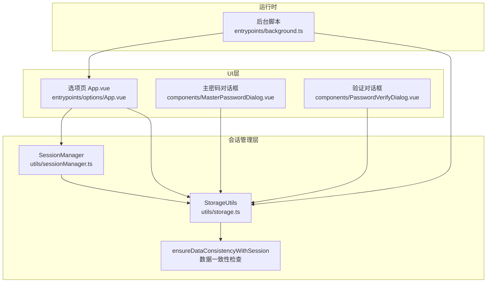

**图表来源**
- [utils/sessionManager.ts](file://utils/sessionManager.ts#L1-L87)
- [utils/storage.ts](file://utils/storage.ts#L1-L1274)
- [entrypoints/options/App.vue](file://entrypoints/options/App.vue#L956-L1049)
- [components/MasterPasswordDialog.vue](file://components/MasterPasswordDialog.vue#L177-L237)
- [components/PasswordVerifyDialog.vue](file://components/PasswordVerifyDialog.vue#L153-L202)
- [entrypoints/background.ts](file://entrypoints/background.ts#L1-L403)

**章节来源**
- [utils/sessionManager.ts](file://utils/sessionManager.ts#L1-L87)
- [utils/storage.ts](file://utils/storage.ts#L1-L1274)
- [entrypoints/options/App.vue](file://entrypoints/options/App.vue#L956-L1049)

## 核心组件
- SessionManager：单例会话管理器，负责启动/停止会话检查、处理会话过期事件、清理会话。
- StorageUtils：会话与存储的核心实现，提供主密码设置/验证、会话创建/校验/清理、有效期设置/读取、内存缓存与持久化同步、加解密辅助、**新增** 数据一致性检查与自动修复。
- **更新** Background Cache System：后台缓存系统，与会话管理深度集成，实现动态缓存过期机制。
- **新增** Data Consistency Manager：数据一致性管理器，负责检测和修复浏览器崩溃后的数据状态不一致问题。

关键职责与边界：
- 会话检查：每分钟检查一次，若无效则触发过期事件并清理会话。
- 会话建立：基于主密码与有效期创建会话，加密存储会话主密码与过期时间。
- 会话验证：恢复内存缓存、校验过期时间、**新增** 检查数据一致性并自动修复、必要时清理并返回无效。
- 会话清理：清除内存与持久化中的会话数据，停止定时器。
- **更新** 缓存集成：后台缓存系统通过 getCacheValidityMs() 获取动态缓存有效期，与会话有效期保持一致。
- **新增** 数据修复：自动检测会话有效但数据仍处于加密状态的情况并自动解密。

**章节来源**
- [utils/sessionManager.ts](file://utils/sessionManager.ts#L6-L87)
- [utils/storage.ts](file://utils/storage.ts#L791-L916)
- [entrypoints/background.ts](file://entrypoints/background.ts#L308-L317)

## 架构总览
会话管理采用"UI驱动 + 存储驱动 + 定时器驱动 + 缓存集成 + 数据修复"的模式：
- UI层通过对话框发起主密码设置/验证，调用 StorageUtils 创建/校验会话。
- StorageUtils 维护内存缓存（会话主密码、过期时间、有效期小时数、会话加密密钥），并持久化到 chrome.storage.local。
- SessionManager 以定时器周期性调用 StorageUtils.isSessionValid，一旦无效触发自定义事件，UI 层监听并引导用户重新验证。
- **更新** 后台缓存系统通过 getCacheValidityMs() 获取动态缓存有效期，确保缓存与会话有效期保持一致，替代原有固定5分钟策略。
- **新增** 数据一致性检查：在会话恢复时自动检测数据状态，确保会话有效时数据也处于正确的明文状态。

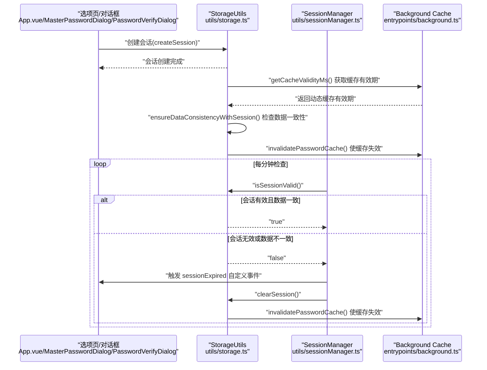

**图表来源**
- [utils/storage.ts](file://utils/storage.ts#L865-L894)
- [utils/storage.ts](file://utils/storage.ts#L791-L841)
- [utils/sessionManager.ts](file://utils/sessionManager.ts#L27-L45)
- [utils/sessionManager.ts](file://utils/sessionManager.ts#L60-L66)
- [entrypoints/options/App.vue](file://entrypoints/options/App.vue#L972-L991)
- [entrypoints/background.ts](file://entrypoints/background.ts#L308-L317)
- [entrypoints/background.ts](file://entrypoints/background.ts#L365-L368)

**章节来源**
- [utils/sessionManager.ts](file://utils/sessionManager.ts#L1-L87)
- [utils/storage.ts](file://utils/storage.ts#L1-L1274)
- [entrypoints/background.ts](file://entrypoints/background.ts#L1-L403)

## 详细组件分析

### SessionManager 类分析
- 设计要点
  - 单例模式：getInstance 确保全局唯一实例。
  - 定时器：每分钟执行一次 isSessionValid 检查；支持 start/stop 控制。
  - 事件驱动：会话过期时触发自定义事件，供 UI 层监听并处理。
  - 生命周期：init 时启动检查并在 beforeunload 停止定时器，避免泄漏。

- 关键方法与行为
  - startSessionCheck：启动定时器，调用 isSessionValid 并处理过期。
  - stopSessionCheck：清理定时器。
  - handleSessionExpired：触发 sessionExpired 事件并调用 StorageUtils.clearSession。
  - init：启动检查并绑定 beforeunload 清理。

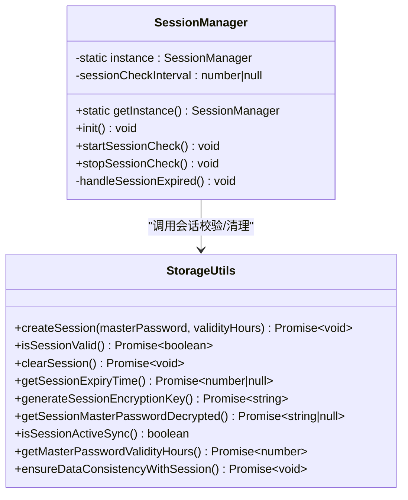

**图表来源**
- [utils/sessionManager.ts](file://utils/sessionManager.ts#L6-L87)
- [utils/storage.ts](file://utils/storage.ts#L791-L916)

**章节来源**
- [utils/sessionManager.ts](file://utils/sessionManager.ts#L6-L87)

### StorageUtils 会话机制分析
- 内存缓存策略
  - 会话主密码：encryptedSessionMasterPassword（加密存储于持久化层，内存中仅持有引用）
  - 过期时间：sessionPasswordExpiry（毫秒时间戳）
  - 有效期小时数：sessionValidityHours（默认24，可配置）
  - 会话加密密钥：sessionEncryptionKey（用于加密内存中的会话主密码）

- 持久化存储方案
  - 使用 chrome.storage.local 存储会话相关键：
    - SESSION_STORAGE_KEYS.MASTER_PASSWORD：加密后的会话主密码
    - SESSION_STORAGE_KEYS.PASSWORD_EXPIRY：过期时间戳
    - SESSION_STORAGE_KEYS.VALIDITY_HOURS：有效期小时数
  - 主密码配置与有效期配置分别存储于不同键空间，互不影响。
  - **更新** 新增 STORAGE_KEYS.MASTER_PASSWORD_VALIDITY 键，用于存储主密码有效期配置。

- 会话建立流程
  - 依据主密码配置的盐值派生稳定会话加密密钥，或回退生成临时密钥。
  - 加密主密码并写入持久化，同时计算过期时间并写入。
  - 更新内存缓存。
  - **更新** 会话创建后解密所有密码条目并明文存储，提高读取性能。
  - **新增** 发送 INVALIDATE_PASSWORD_CACHE 消息，使后台缓存失效。

- 会话验证流程
  - 若内存缓存缺失，尝试从持久化恢复。
  - 校验过期时间，若已过期则清理并返回无效。
  - **新增** 检查数据一致性，如果会话有效但数据仍加密，则自动解密。
  - 异常时清理会话，确保安全。

- 会话清理流程
  - **更新** 增强的清理过程：在会话终止时正确重置所有会话相关状态变量
  - 清空内存缓存并从持久化移除会话键
  - **新增** 加密密钥清理：确保会话加密密钥也被正确重置
  - **新增** 密码条目加密保障：在清理前确保所有密码条目已加密
  - **更新** 会话失效前加密所有密码条目，确保敏感数据安全。

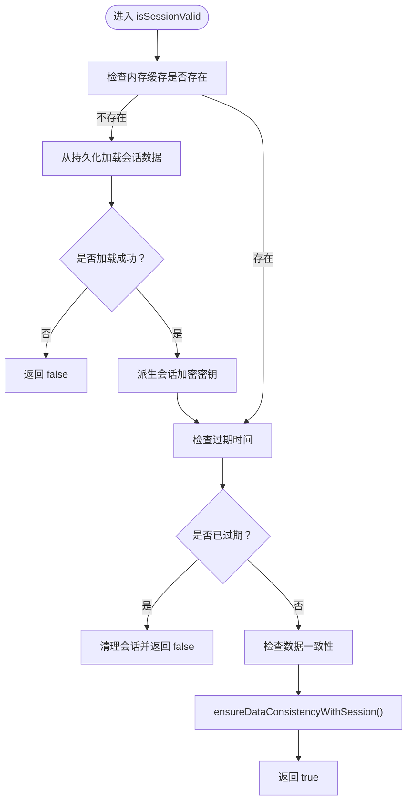

**图表来源**
- [utils/storage.ts](file://utils/storage.ts#L791-L841)
- [utils/storage.ts](file://utils/storage.ts#L865-L894)
- [utils/storage.ts](file://utils/storage.ts#L898-L921)

**章节来源**
- [utils/storage.ts](file://utils/storage.ts#L20-L36)
- [utils/storage.ts](file://utils/storage.ts#L791-L916)

### 新增的自动数据一致性检查
**更新** 新增了 ensureDataConsistencyWithSession() 方法，提供自动数据一致性检查和修复能力：

- **检测机制**：检查存储中的密码条目是否仍处于加密状态
- **修复逻辑**：如果会话有效但数据仍加密，自动解密所有密码条目
- **边界情况处理**：处理浏览器崩溃恢复等特殊情况
- **安全性保障**：不会抛出异常影响会话验证流程

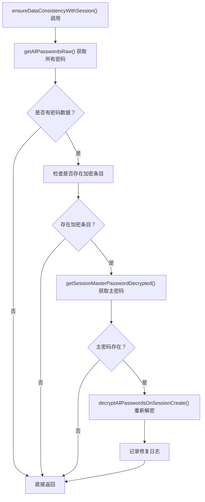

**图表来源**
- [utils/storage.ts](file://utils/storage.ts#L898-L921)
- [utils/storage.ts](file://utils/storage.ts#L1063-L1104)

**章节来源**
- [utils/storage.ts](file://utils/storage.ts#L898-L921)

### 增强的会话验证逻辑
**更新** 会话验证流程现已得到显著增强，增加了数据一致性检查：

- **会话恢复检测**：标记是否需要检查数据一致性（从存储恢复时需要）
- **数据修复集成**：在会话有效时自动检查并修复数据状态
- **异常容错**：即使数据修复失败也不会影响会话验证结果
- **性能优化**：只在需要时进行数据修复，避免不必要的操作

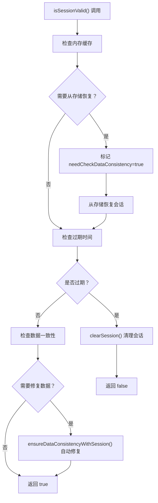

**图表来源**
- [utils/storage.ts](file://utils/storage.ts#L833-L892)

**章节来源**
- [utils/storage.ts](file://utils/storage.ts#L833-L892)

### 新增的同步会话验证方法
**更新** 新增了 isSessionActiveSync() 方法，提供高性能的内存状态检查：

- **同步检查机制**：仅检查内存中的会话状态，不进行持久化读取
- **性能优化**：避免异步I/O操作，适用于频繁调用的场景
- **使用场景**：主要用于 savePassword 和 updatePassword 操作中快速判断是否需要加密

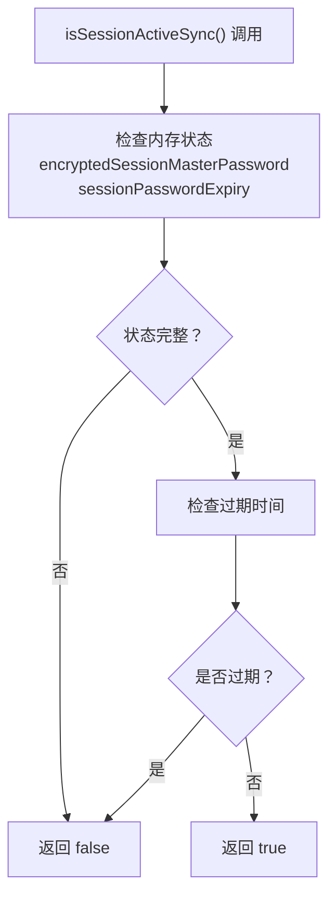

**图表来源**
- [utils/storage.ts](file://utils/storage.ts#L822-L827)

**章节来源**
- [utils/storage.ts](file://utils/storage.ts#L822-L827)

### 增强的会话清理机制
**更新** 会话清理过程现已得到显著增强，确保在会话终止时正确重置所有会话相关状态变量：

- **状态变量重置**：在会话清理过程中，系统会正确重置以下状态变量：
  - `encryptedSessionMasterPassword`：加密的主密码
  - `sessionPasswordExpiry`：密码过期时间戳
  - `sessionValidityHours`：有效期小时数
  - `sessionEncryptionKey`：会话加密密钥

- **数据一致性保障**：清理过程包含以下步骤：
  1. 在清理前确保所有密码条目已加密
  2. 清空内存中的会话数据
  3. 从持久化存储中移除会话信息
  4. 重置所有会话相关状态变量为 null

- **安全机制**：通过清理会话加密密钥，防止会话结束后仍保留敏感的加密凭据

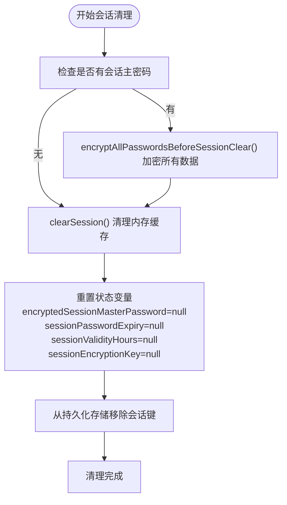

**图表来源**
- [utils/storage.ts](file://utils/storage.ts#L992-L1016)

**章节来源**
- [utils/storage.ts](file://utils/storage.ts#L992-L1016)

### 优化的密码加密/解密逻辑
**更新** 会话管理中的密码处理逻辑得到了显著优化：

- **会话创建时的解密处理**：会话建立后，系统会解密所有密码条目并以明文形式存储，提高读取性能
- **会话清理前的加密处理**：会话失效前，系统会确保所有密码条目都已加密，防止敏感数据泄露
- **智能加密决策**：根据 isSessionActiveSync() 的结果决定是否进行加密操作
- **更新** 会话创建后解密所有密码条目，会话失效前再加密，确保数据安全与性能平衡
- **新增** 数据修复时的自动解密：当检测到数据状态不一致时自动解密

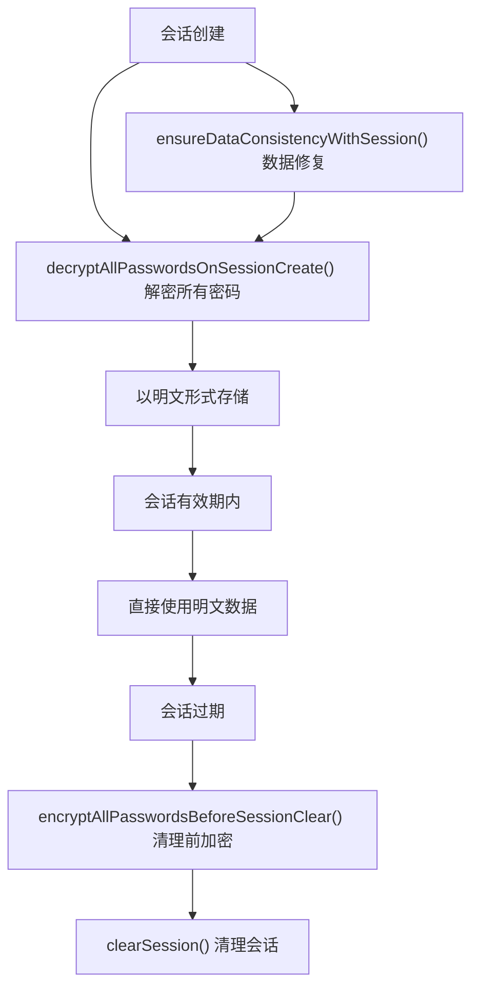

**图表来源**
- [utils/storage.ts](file://utils/storage.ts#L945-L986)
- [utils/storage.ts](file://utils/storage.ts#L992-L1016)
- [utils/storage.ts](file://utils/storage.ts#L1063-L1104)

**章节来源**
- [utils/storage.ts](file://utils/storage.ts#L945-L986)
- [utils/storage.ts](file://utils/storage.ts#L992-L1016)
- [utils/storage.ts](file://utils/storage.ts#L1063-L1104)

### **新增** 动态缓存过期机制
**更新** 会话管理现已与密码缓存系统深度集成，实现动态缓存过期机制：

- **getCacheValidityMs() 函数**：从存储中获取 master_password_validity 配置，实现动态缓存过期
- **缓存有效期同步**：缓存有效期与主密码会话有效期保持一致，替代原有的固定5分钟缓存策略
- **后台缓存系统**：通过 getCacheValidityMs() 获取动态缓存有效期，确保缓存与会话状态同步
- **缓存失效机制**：会话清理时发送 INVALIDATE_PASSWORD_CACHE 消息，确保缓存一致性

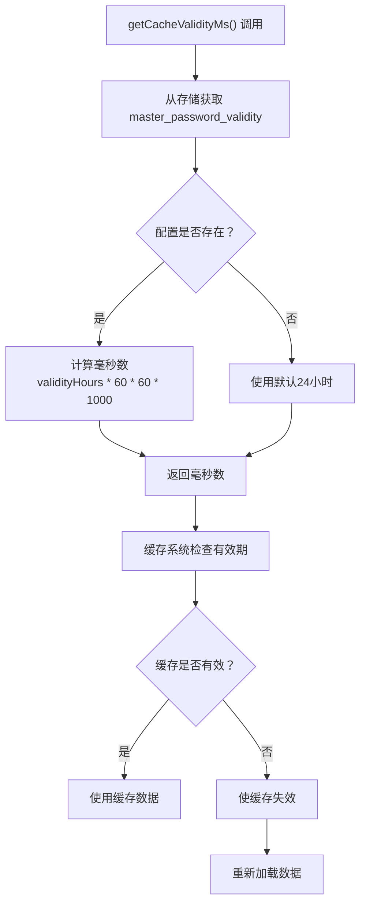

**图表来源**
- [entrypoints/background.ts](file://entrypoints/background.ts#L327-L336)
- [entrypoints/background.ts](file://entrypoints/background.ts#L342-L366)

**章节来源**
- [entrypoints/background.ts](file://entrypoints/background.ts#L327-L336)
- [entrypoints/background.ts](file://entrypoints/background.ts#L342-L366)

### **新增** 主密码有效期管理
**更新** 新增了 getMasterPasswordValidityHours() 方法，提供更完整的有效期管理：

- **配置存储**：使用 STORAGE_KEYS.MASTER_PASSWORD_VALIDITY 键存储有效期配置
- **内存缓存**：支持内存中的会话设置缓存，避免重复读取存储
- **默认值处理**：默认有效期为24小时，参数范围1-24小时
- **UI集成**：选项页通过此方法获取和设置有效期配置

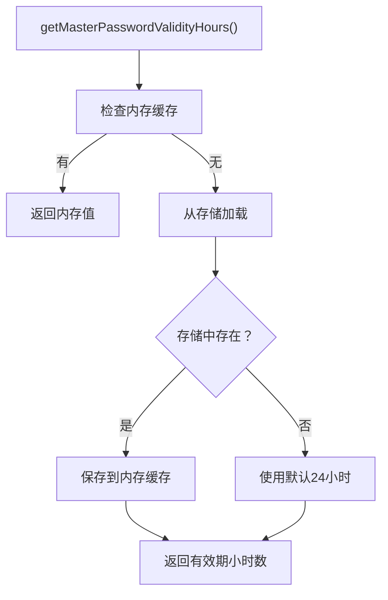

**图表来源**
- [utils/storage.ts](file://utils/storage.ts#L731-L749)

**章节来源**
- [utils/storage.ts](file://utils/storage.ts#L731-L749)

### UI 集成与会话生命周期
- 选项页初始化
  - onMounted 中调用 sessionManager.init() 启动会话检查。
  - 监听 window.sessionExpired 事件，切换到验证页面并初始化有效期。
  - **更新** 通过 StorageUtils.getMasterPasswordValidityHours() 获取有效期配置。

- 主密码设置与验证
  - MasterPasswordDialog：首次设置主密码并通过 StorageUtils.setMasterPassword 与 createSession 完成会话建立。
  - PasswordVerifyDialog：验证主密码后通过 StorageUtils.verifyMasterPassword 与 createSession 完成会话续期。

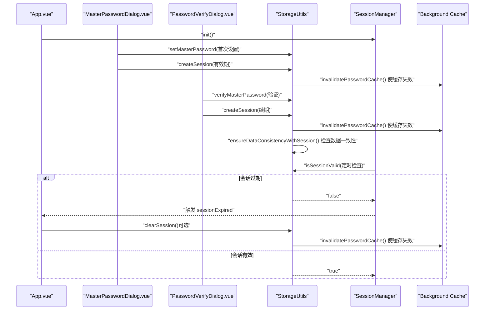

**图表来源**
- [entrypoints/options/App.vue](file://entrypoints/options/App.vue#L970-L1007)
- [components/MasterPasswordDialog.vue](file://components/MasterPasswordDialog.vue#L177-L237)
- [components/PasswordVerifyDialog.vue](file://components/PasswordVerifyDialog.vue#L153-L202)
- [utils/storage.ts](file://utils/storage.ts#L791-L916)
- [utils/sessionManager.ts](file://utils/sessionManager.ts#L27-L45)
- [entrypoints/background.ts](file://entrypoints/background.ts#L384-L387)

**章节来源**
- [entrypoints/options/App.vue](file://entrypoints/options/App.vue#L970-L1007)
- [components/MasterPasswordDialog.vue](file://components/MasterPasswordDialog.vue#L177-L237)
- [components/PasswordVerifyDialog.vue](file://components/PasswordVerifyDialog.vue#L153-L202)

## 依赖分析
- 外部依赖
  - crypto-js：提供 MD5、PBKDF2、AES 加解密能力，用于主密码哈希、密钥派生与会话数据加密。
  - element-plus：UI 组件库，用于对话框与表单。
  - vue：前端框架，承载会话 UI 与交互。
  - xlsx：Excel 导入导出工具（与会话无直接关系）。

- 内部依赖
  - App.vue 依赖 SessionManager 与 StorageUtils。
  - MasterPasswordDialog.vue 与 PasswordVerifyDialog.vue 依赖 StorageUtils。
  - SessionManager 依赖 StorageUtils 的 isSessionValid/clearSession/createSession。
  - **更新** Background Cache System 依赖 StorageUtils 的 getMasterPasswordValidityHours()。
  - **新增** StorageUtils 依赖 Background Cache System 的缓存失效机制。

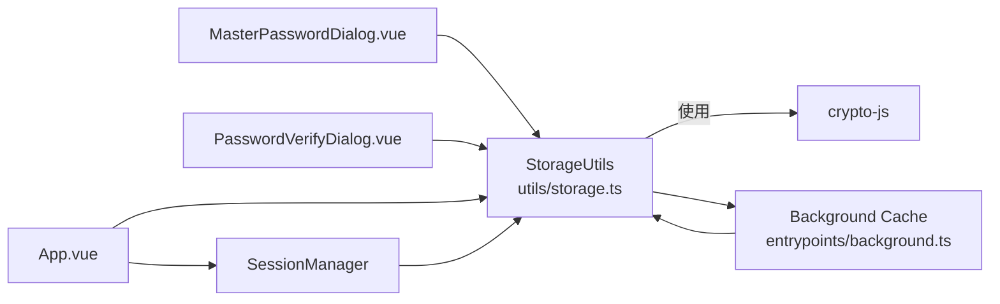

**图表来源**
- [package.json](file://package.json#L22-L27)
- [utils/storage.ts](file://utils/storage.ts#L1-L2)
- [components/MasterPasswordDialog.vue](file://components/MasterPasswordDialog.vue#L96)
- [components/PasswordVerifyDialog.vue](file://components/PasswordVerifyDialog.vue#L104)
- [entrypoints/options/App.vue](file://entrypoints/options/App.vue#L970-L1007)
- [utils/sessionManager.ts](file://utils/sessionManager.ts#L1-L2)
- [entrypoints/background.ts](file://entrypoints/background.ts#L384-L387)

**章节来源**
- [package.json](file://package.json#L22-L27)

## 性能考虑
- 定时检查频率：每分钟检查一次，折中考虑用户体验与资源消耗。可根据场景调整（需同步修改定时器间隔）。
- 内存缓存命中：优先使用内存缓存，减少持久化读取次数；仅在内存缺失时才从持久化恢复。
- **新增** 同步检查优化：isSessionActiveSync() 提供高性能的内存状态检查，避免异步I/O操作。
- **新增** 智能加密策略：会话有效期内以明文存储密码条目，会话失效前自动加密，平衡性能与安全。
- **更新** 动态缓存过期：通过 getCacheValidityMs() 实现动态缓存过期，避免固定5分钟策略的性能问题。
- **新增** 数据修复优化：ensureDataConsistencyWithSession() 只在需要时进行数据修复，避免不必要的操作。
- 加密成本：PBKDF2 与 AES 加解密在移动端可能带来额外开销，建议：
  - 仅在必要时进行解密（如加载密码列表时）。
  - 避免频繁重复派生密钥，复用已派生的 sessionEncryptionKey。
- I/O 优化：批量读取/写入 chrome.storage.local，减少多次往返。
- **新增** 清理效率：增强的会话清理过程减少了内存泄漏风险，提高了系统长期运行的稳定性。
- **更新** 缓存一致性：后台缓存系统与会话管理保持同步，避免数据不一致问题。
- **新增** 异常容错：数据修复失败不会影响会话验证，确保系统稳定性。

## 故障排查指南
- 会话过期未触发 UI
  - 确认 SessionManager.init 是否被调用，定时器是否启动。
  - 检查 window.sessionExpired 事件监听是否注册。
  - 参考：[utils/sessionManager.ts](file://utils/sessionManager.ts#L71-L79)，[entrypoints/options/App.vue](file://entrypoints/options/App.vue#L970-L986)

- 会话验证失败
  - 检查 StorageUtils.isSessionValid 的返回值与异常日志。
  - 确认持久化中的会话数据是否完整（主密码、过期时间、有效期小时数）。
  - **新增** 检查 isSessionActiveSync() 是否正确返回内存状态。
  - **新增** 检查 getMasterPasswordValidityHours() 是否正确获取有效期配置。
  - **新增** 检查 ensureDataConsistencyWithSession() 是否正常工作。
  - 参考：[utils/storage.ts](file://utils/storage.ts#L791-L841)

- 会话清理后仍提示已登录
  - 确认 clearSession 是否被调用，内存与持久化是否同步清空。
  - **更新** 检查状态变量是否正确重置为 null。
  - **新增** 确认 sessionEncryptionKey 是否被正确清理。
  - **新增** 检查会话失效前的密码加密是否正常执行。
  - **新增** 检查 encryptAllPasswordsBeforeSessionClear() 是否正常工作。
  - 参考：[utils/storage.ts](file://utils/storage.ts#L899-L916)

- 主密码设置/验证异常
  - 检查 setMasterPassword/verifyMasterPassword 的错误日志与返回值。
  - **新增** 检查会话创建和清理过程中的加密/解密逻辑。
  - **新增** 检查 getMasterPasswordValidityHours() 的配置存储与读取。
  - **新增** 检查 INVALIDATE_PASSWORD_CACHE 消息是否正常发送。
  - 参考：[utils/storage.ts](file://utils/storage.ts#L76-L143)，[components/MasterPasswordDialog.vue](file://components/MasterPasswordDialog.vue#L177-L237)，[components/PasswordVerifyDialog.vue](file://components/PasswordVerifyDialog.vue#L153-L202)

- **新增** 缓存过期问题
  - 检查 getCacheValidityMs() 是否正确返回缓存有效期。
  - 确认后台缓存系统是否正确监听存储变化。
  - **新增** 检查 master_password_validity 配置是否正确存储。
  - **新增** 检查 INVALIDATE_PASSWORD_CACHE 消息是否正常处理。
  - 参考：[entrypoints/background.ts](file://entrypoints/background.ts#L327-L336)

- **新增** 数据一致性问题
  - 检查 ensureDataConsistencyWithSession() 是否正常检测和修复数据状态。
  - 确认会话有效时密码条目是否处于明文状态。
  - **新增** 检查数据修复过程中的异常处理。
  - 参考：[utils/storage.ts](file://utils/storage.ts#L898-L921)

**章节来源**
- [utils/sessionManager.ts](file://utils/sessionManager.ts#L71-L79)
- [entrypoints/options/App.vue](file://entrypoints/options/App.vue#L970-L1007)
- [utils/storage.ts](file://utils/storage.ts#L791-L921)
- [components/MasterPasswordDialog.vue](file://components/MasterPasswordDialog.vue#L177-L237)
- [components/PasswordVerifyDialog.vue](file://components/PasswordVerifyDialog.vue#L153-L202)
- [entrypoints/background.ts](file://entrypoints/background.ts#L327-L336)

## 结论
会话管理模块通过"UI驱动 + 存储驱动 + 定时器驱动 + 缓存集成 + 数据修复"的协同，实现了主密码验证、会话缓存与有效期管理的安全闭环。SessionManager 负责周期性检查与事件分发，StorageUtils 负责会话数据的内存与持久化同步，UI 层负责引导用户完成会话建立与续期。**更新** 新增的同步会话验证方法 isSessionActiveSync() 提供了高性能的内存状态检查，优化了密码加密/解密逻辑，增强了会话清理机制确保了系统在会话终止时能够正确重置所有状态变量，提高了系统的安全性和稳定性。**更新** 最重要的改进是会话管理与密码缓存系统的深度集成，通过 getCacheValidityMs() 函数实现动态缓存过期机制，确保缓存有效期与主密码会话有效期保持一致，替代原有的固定5分钟缓存策略，显著提升了系统的性能和用户体验。**新增** 最关键的功能是自动数据一致性检查能力，通过 ensureDataConsistencyWithSession() 方法确保浏览器崩溃后数据状态的一致性，提供更好的用户体验和系统稳定性。整体设计清晰、边界明确，具备良好的可维护性与扩展性。

## 附录

### 会话配置选项
- 有效期小时数（1-24 小时）
  - 设置：StorageUtils.setMasterPasswordValidityHours(hours)
  - 读取：StorageUtils.getMasterPasswordValidityHours()
  - 默认：24 小时
  - **更新** 通过 STORAGE_KEYS.MASTER_PASSWORD_VALIDITY 键存储配置
  - 参考：[utils/storage.ts](file://utils/storage.ts#L719-L760)

### 会话建立/验证/更新/清理示例路径
- 建立会话（首次设置主密码）
  - [components/MasterPasswordDialog.vue](file://components/MasterPasswordDialog.vue#L192-L209)
  - [utils/storage.ts](file://utils/storage.ts#L76-L143)
  - [utils/storage.ts](file://utils/storage.ts#L865-L894)

- 验证会话（登录/续期）
  - [components/PasswordVerifyDialog.vue](file://components/PasswordVerifyDialog.vue#L169-L202)
  - [utils/storage.ts](file://utils/storage.ts#L119-L143)
  - [utils/storage.ts](file://utils/storage.ts#L865-L894)

- 更新有效期
  - [entrypoints/options/App.vue](file://entrypoints/options/App.vue#L1389-L1398)
  - [utils/storage.ts](file://utils/storage.ts#L742-L760)

- 清理会话
  - **更新** 增强的清理过程，确保所有状态变量正确重置
  - [entrypoints/options/App.vue](file://entrypoints/options/App.vue#L1400-L1439)
  - [utils/storage.ts](file://utils/storage.ts#L899-L916)

### 数据一致性与安全机制
- 数据一致性
  - 会话建立时同时更新内存与持久化，确保两者一致。
  - 定时检查失败时主动清理会话，避免状态漂移。
  - **更新** 增强的清理过程确保所有状态变量正确重置。
  - **新增** 会话创建和清理过程中的智能加密/解密策略。
  - **更新** 缓存系统与会话管理保持同步，避免数据不一致。
  - **新增** ensureDataConsistencyWithSession() 自动检测和修复数据状态不一致问题。
  - 参考：[utils/storage.ts](file://utils/storage.ts#L865-L894)，[utils/storage.ts](file://utils/storage.ts#L898-L921)

- 安全机制
  - 会话主密码在内存中以加密形式存储，仅在需要时解密。
  - PBKDF2 与 AES 加密用于保护敏感数据。
  - 会话过期自动清理，降低泄露风险。
  - **更新** 增强的清理过程确保会话加密密钥也被正确重置。
  - **新增** isSessionActiveSync() 提供快速的内存状态检查，避免不必要的I/O操作。
  - **更新** 会话失效前自动加密所有密码条目，确保数据安全。
  - **新增** 数据修复过程中的异常容错，确保系统稳定性。
  - 参考：[utils/storage.ts](file://utils/storage.ts#L164-L186)，[utils/storage.ts](file://utils/storage.ts#L191-L214)，[utils/storage.ts](file://utils/storage.ts#L847-L1016)

### 会话清理流程详解
**新增** 详细的会话清理过程：

1. **状态检查**：检查是否存在会话主密码
2. **数据加密**：如果存在会话主密码，在清理前确保所有密码条目已加密
3. **内存清理**：重置所有会话相关状态变量为 null
4. **持久化清理**：从 chrome.storage.local 移除会话相关键
5. **安全验证**：确保会话加密密钥也被正确清理

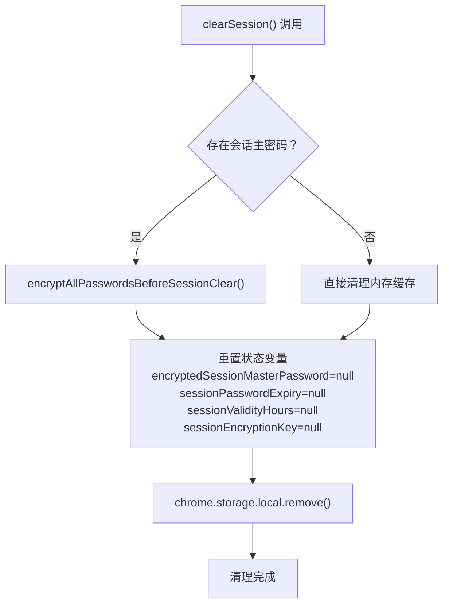

**图表来源**
- [utils/storage.ts](file://utils/storage.ts#L992-L1016)

**章节来源**
- [utils/storage.ts](file://utils/storage.ts#L992-L1016)

### 同步会话验证详解
**新增** isSessionActiveSync() 方法的详细实现：

1. **内存状态检查**：检查 encryptedSessionMasterPassword 和 sessionPasswordExpiry 是否存在
2. **过期时间验证**：比较当前时间与 sessionPasswordExpiry
3. **快速返回**：避免异步I/O操作，提供即时响应

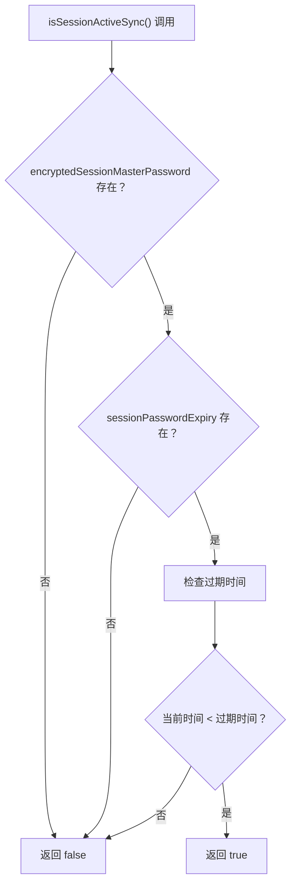

**图表来源**
- [utils/storage.ts](file://utils/storage.ts#L822-L827)

**章节来源**
- [utils/storage.ts](file://utils/storage.ts#L822-L827)

### **新增** 自动数据一致性检查详解
**新增** ensureDataConsistencyWithSession() 方法的详细实现：

1. **数据检测**：获取所有密码条目并检查是否存在加密状态
2. **条件判断**：只有在会话有效但数据仍加密时才进行修复
3. **自动解密**：获取会话主密码并重新解密所有密码条目
4. **异常处理**：即使修复失败也不影响会话验证流程

**图表来源**
- [utils/storage.ts](file://utils/storage.ts#L898-L921)

**章节来源**
- [utils/storage.ts](file://utils/storage.ts#L898-L921)

### **新增** 动态缓存过期机制详解
**新增** getCacheValidityMs() 函数的详细实现：

1. **存储读取**：从 chrome.storage.local 获取 master_password_validity 配置
2. **默认值处理**：如果配置不存在，默认使用24小时
3. **单位转换**：将小时数转换为毫秒数返回
4. **错误处理**：捕获异常并返回默认值

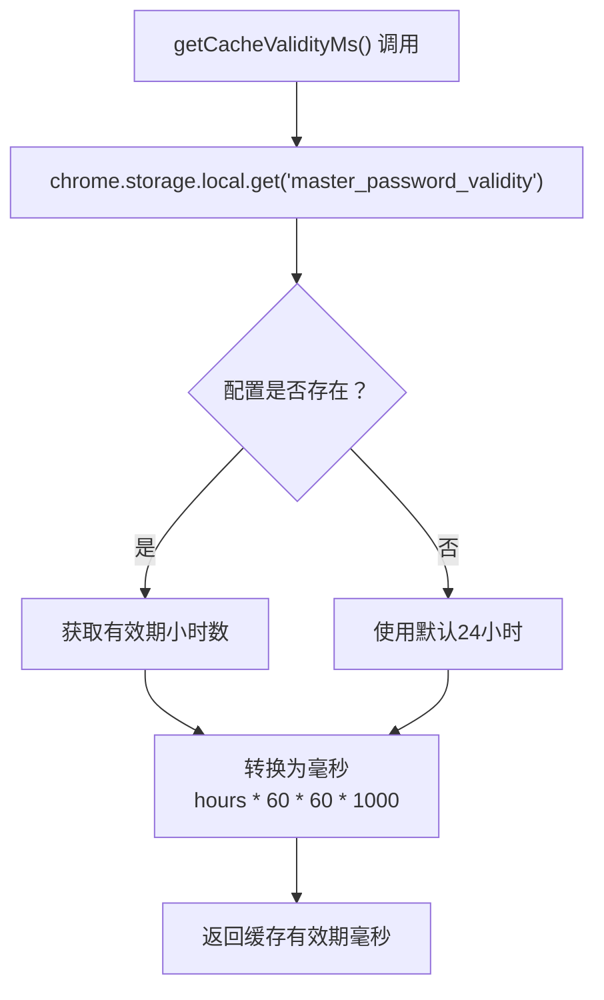

**图表来源**
- [entrypoints/background.ts](file://entrypoints/background.ts#L327-L336)

**章节来源**
- [entrypoints/background.ts](file://entrypoints/background.ts#L327-L336)

### **新增** 主密码有效期管理详解
**新增** getMasterPasswordValidityHours() 方法的详细实现：

1. **内存检查**：首先检查内存中的 sessionValidityHours 缓存
2. **存储读取**：如果内存缓存不存在，从存储中读取配置
3. **默认值处理**：如果存储中也没有配置，默认使用24小时
4. **缓存更新**：将读取到的配置更新到内存缓存
5. **参数验证**：确保返回值在1-24小时范围内

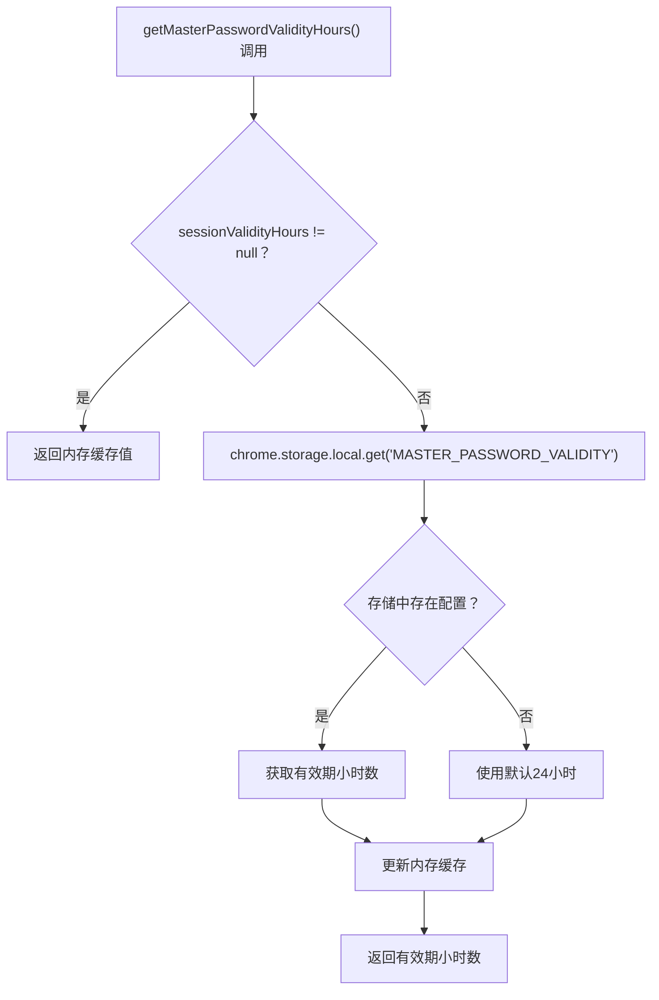

**图表来源**
- [utils/storage.ts](file://utils/storage.ts#L731-L749)

**章节来源**
- [utils/storage.ts](file://utils/storage.ts#L731-L749)

### **新增** 缓存失效机制详解
**新增** INVALIDATE_PASSWORD_CACHE 消息处理机制：

1. **消息发送**：会话创建和清理时发送 INVALIDATE_PASSWORD_CACHE 消息
2. **消息接收**：后台脚本监听消息并调用 invalidatePasswordCache()
3. **缓存清理**：将 passwordCache 置为 null，确保下次访问时重新加载
4. **存储监听**：监听 chrome.storage.onChanged 事件自动失效缓存

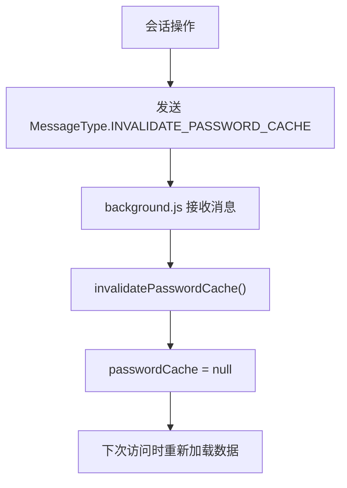

**图表来源**
- [utils/storage.ts](file://utils/storage.ts#L975-L981)
- [entrypoints/background.ts](file://entrypoints/background.ts#L189-L194)

**章节来源**
- [utils/storage.ts](file://utils/storage.ts#L975-L981)
- [entrypoints/background.ts](file://entrypoints/background.ts#L189-L194)