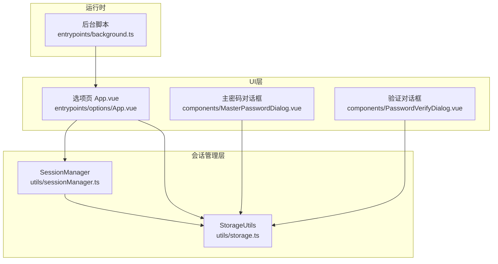
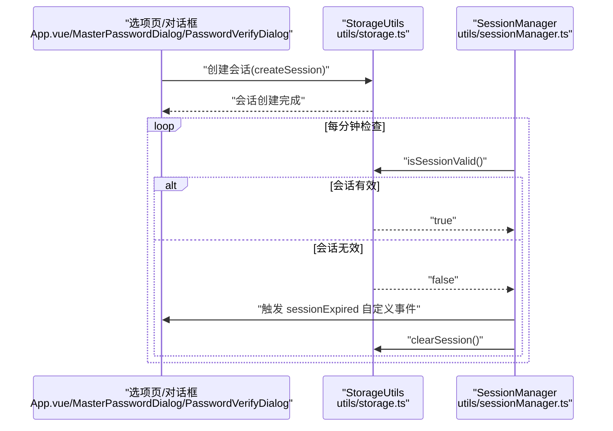
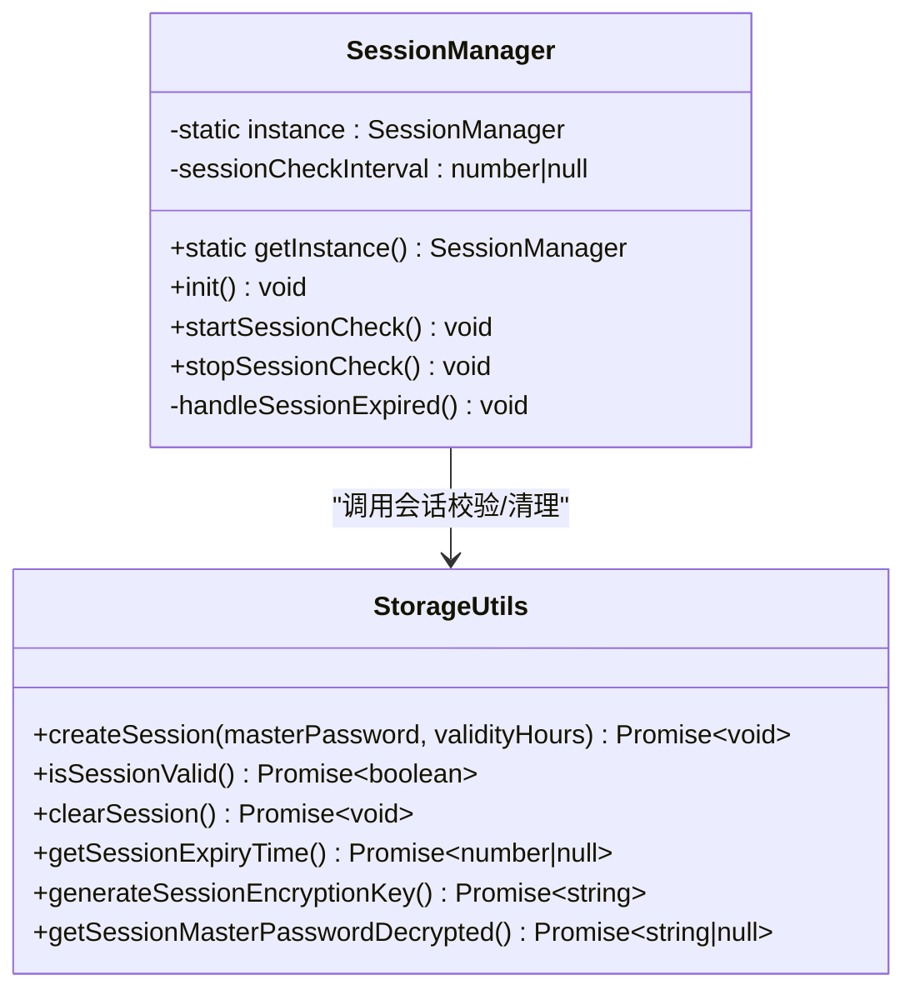
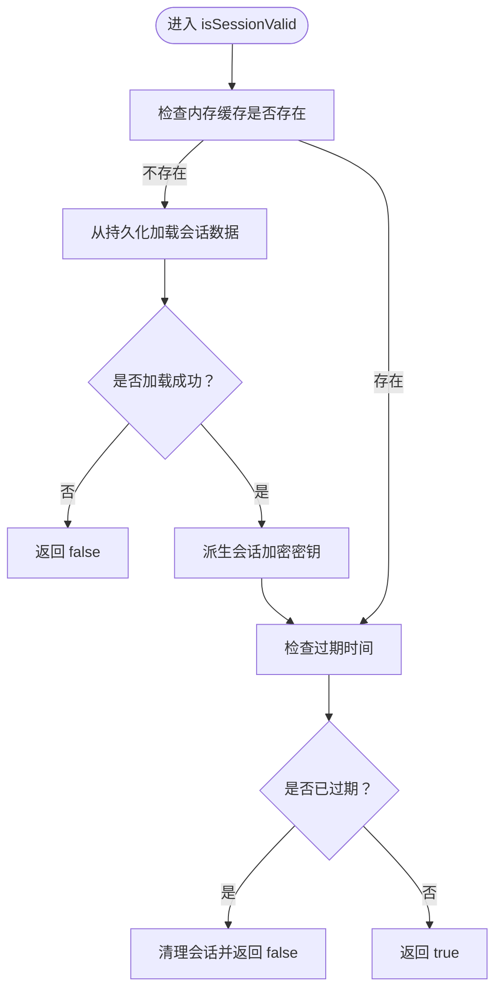
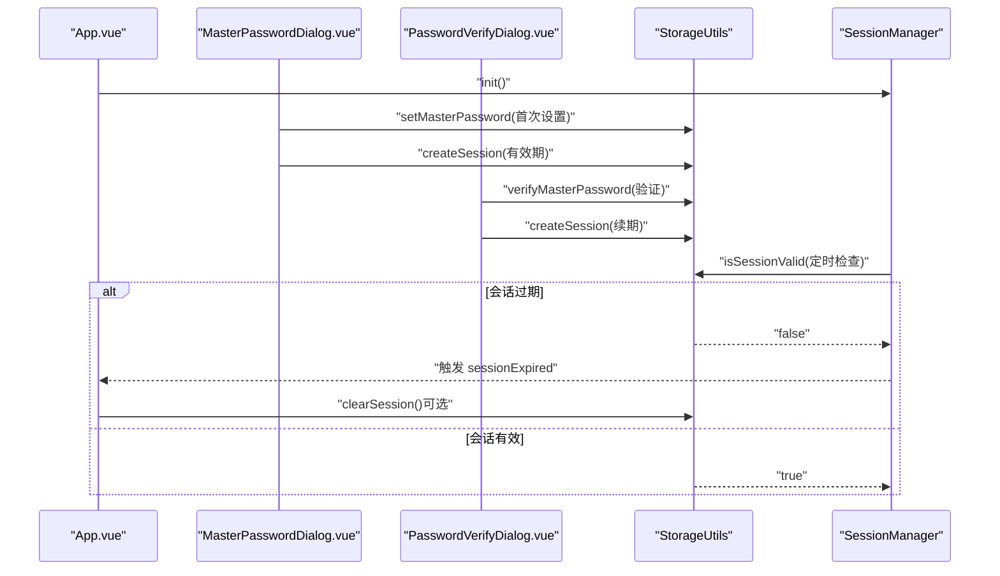
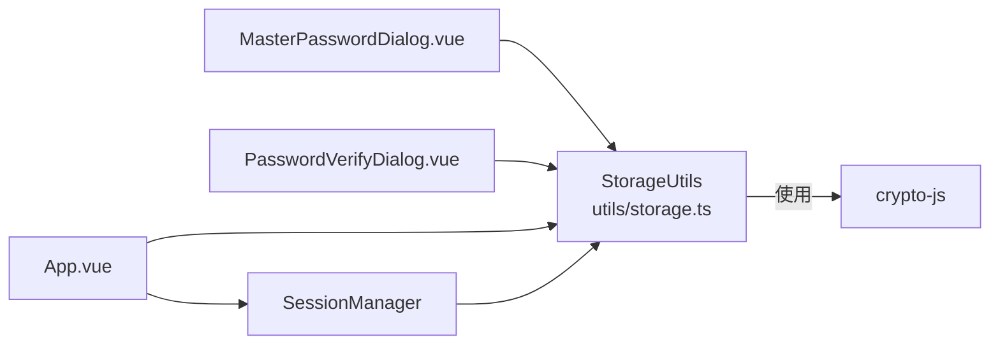

# 会话管理

<cite>
**本文引用的文件**
- [utils/sessionManager.ts](file://utils/sessionManager.ts)
- [utils/storage.ts](file://utils/storage.ts)
- [entrypoints/options/App.vue](file://entrypoints/options/App.vue)
- [components/MasterPasswordDialog.vue](file://components/MasterPasswordDialog.vue)
- [components/PasswordVerifyDialog.vue](file://components/PasswordVerifyDialog.vue)
- [entrypoints/background.ts](file://entrypoints/background.ts)
- [utils/types.ts](file://utils/types.ts)
- [package.json](file://package.json)
</cite>

## 目录
1. [简介](#简介)
2. [项目结构](#项目结构)
3. [核心组件](#核心组件)
4. [架构总览](#架构总览)
5. [详细组件分析](#详细组件分析)
6. [依赖分析](#依赖分析)
7. [性能考虑](#性能考虑)
8. [故障排查指南](#故障排查指南)
9. [结论](#结论)
10. [附录](#附录)

## 简介
本章节面向 Account Password Helper 的“会话管理”模块，系统性阐述 SessionManager 类的设计与实现，覆盖主密码验证、会话缓存机制、有效期管理、安全验证流程、会话状态跟踪、内存缓存策略、持久化存储方案、超时处理与异常恢复策略，并结合实际代码路径给出会话建立、验证、更新与清理的流程图与序列图，帮助开发者快速理解并安全地扩展会话能力。

## 项目结构
会话管理涉及以下关键文件与职责划分：
- utils/sessionManager.ts：全局会话管理器，负责周期性检查会话有效性、触发过期事件、清理会话与生命周期管理。
- utils/storage.ts：存储与会话核心逻辑，包含主密码配置、会话创建/校验/清理、有效期设置与读取、内存缓存与持久化交互。
- entrypoints/options/App.vue：选项页入口，负责初始化会话管理器、监听会话过期事件、引导用户进行主密码设置或验证。
- components/MasterPasswordDialog.vue 与 components/PasswordVerifyDialog.vue：主密码设置与验证对话框，驱动会话建立与续期。
- entrypoints/background.ts：后台脚本，提供插件运行时能力（与会话无直接耦合，但影响页面行为）。
- utils/types.ts：类型定义，包括密码条目与消息类型等。
- package.json：依赖声明，包含加密库 crypto-js 等。

**图表来源**
- [utils/sessionManager.ts](file://utils/sessionManager.ts#L1-L87)
- [utils/storage.ts](file://utils/storage.ts#L1-L120)
- [entrypoints/options/App.vue](file://entrypoints/options/App.vue#L956-L1049)
- [components/MasterPasswordDialog.vue](file://components/MasterPasswordDialog.vue#L177-L237)
- [components/PasswordVerifyDialog.vue](file://components/PasswordVerifyDialog.vue#L153-L202)
- [entrypoints/background.ts](file://entrypoints/background.ts#L1-L232)

**章节来源**
- [utils/sessionManager.ts](file://utils/sessionManager.ts#L1-L87)
- [utils/storage.ts](file://utils/storage.ts#L1-L120)
- [entrypoints/options/App.vue](file://entrypoints/options/App.vue#L956-L1049)

## 核心组件
- SessionManager：单例会话管理器，负责启动/停止会话检查、处理会话过期事件、清理会话。
- StorageUtils：会话与存储的核心实现，提供主密码设置/验证、会话创建/校验/清理、有效期设置/读取、内存缓存与持久化同步、加解密辅助等。

关键职责与边界：
- 会话检查：每分钟检查一次，若无效则触发过期事件并清理会话。
- 会话建立：基于主密码与有效期创建会话，加密存储会话主密码与过期时间。
- 会话验证：恢复内存缓存、校验过期时间、必要时清理并返回无效。
- 会话清理：清除内存与持久化中的会话数据，停止定时器。

**章节来源**
- [utils/sessionManager.ts](file://utils/sessionManager.ts#L6-L87)
- [utils/storage.ts](file://utils/storage.ts#L791-L916)

## 架构总览
会话管理采用“UI驱动 + 存储驱动 + 定时器驱动”的模式：
- UI层通过对话框发起主密码设置/验证，调用 StorageUtils 创建/校验会话。
- StorageUtils 维护内存缓存（会话主密码、过期时间、有效期小时数、会话加密密钥），并持久化到 chrome.storage.local。
- SessionManager 以定时器周期性调用 StorageUtils.isSessionValid，一旦无效触发自定义事件，UI 层监听并引导用户重新验证。

**图表来源**
- [utils/storage.ts](file://utils/storage.ts#L865-L894)
- [utils/storage.ts](file://utils/storage.ts#L791-L841)
- [utils/sessionManager.ts](file://utils/sessionManager.ts#L27-L45)
- [utils/sessionManager.ts](file://utils/sessionManager.ts#L60-L66)
- [entrypoints/options/App.vue](file://entrypoints/options/App.vue#L972-L991)

## 详细组件分析

### SessionManager 类分析
- 设计要点
  - 单例模式：getInstance 确保全局唯一实例。
  - 定时器：每分钟执行一次 isSessionValid 检查；支持 start/stop 控制。
  - 事件驱动：会话过期时触发自定义事件，供 UI 层监听并处理。
  - 生命周期：init 时启动检查并在 beforeunload 停止定时器，避免泄漏。

- 关键方法与行为
  - startSessionCheck：启动定时器，调用 isSessionValid 并处理过期。
  - stopSessionCheck：清理定时器。
  - handleSessionExpired：触发 sessionExpired 事件并调用 StorageUtils.clearSession。
  - init：启动检查并绑定 beforeunload 清理。

**图表来源**
- [utils/sessionManager.ts](file://utils/sessionManager.ts#L6-L87)
- [utils/storage.ts](file://utils/storage.ts#L791-L916)

**章节来源**
- [utils/sessionManager.ts](file://utils/sessionManager.ts#L6-L87)

### StorageUtils 会话机制分析
- 内存缓存策略
  - 会话主密码：encryptedSessionMasterPassword（加密存储于持久化层，内存中仅持有引用）
  - 过期时间：sessionPasswordExpiry（毫秒时间戳）
  - 有效期小时数：sessionValidityHours（默认24，可配置）
  - 会话加密密钥：sessionEncryptionKey（用于加密内存中的会话主密码）

- 持久化存储方案
  - 使用 chrome.storage.local 存储会话相关键：
    - SESSION_STORAGE_KEYS.MASTER_PASSWORD：加密后的会话主密码
    - SESSION_STORAGE_KEYS.PASSWORD_EXPIRY：过期时间戳
    - SESSION_STORAGE_KEYS.VALIDITY_HOURS：有效期小时数
  - 主密码配置与有效期配置分别存储于不同键空间，互不影响。

- 会话建立流程
  - 依据主密码配置的盐值派生稳定会话加密密钥，或回退生成临时密钥。
  - 加密主密码并写入持久化，同时计算过期时间并写入。
  - 更新内存缓存。

- 会话验证流程
  - 若内存缓存缺失，尝试从持久化恢复。
  - 校验过期时间，若已过期则清理并返回无效。
  - 异常时清理会话，确保安全。

- 会话清理流程
  - 清空内存缓存并从持久化移除会话键。

**图表来源**
- [utils/storage.ts](file://utils/storage.ts#L791-L841)
- [utils/storage.ts](file://utils/storage.ts#L865-L894)
- [utils/storage.ts](file://utils/storage.ts#L899-L916)

**章节来源**
- [utils/storage.ts](file://utils/storage.ts#L20-L36)
- [utils/storage.ts](file://utils/storage.ts#L791-L916)

### UI 集成与会话生命周期
- 选项页初始化
  - onMounted 中调用 sessionManager.init() 启动会话检查。
  - 监听 window.sessionExpired 事件，切换到验证页面并初始化有效期。

- 主密码设置与验证
  - MasterPasswordDialog：首次设置主密码并通过 StorageUtils.setMasterPassword 与 createSession 完成会话建立。
  - PasswordVerifyDialog：验证主密码后通过 StorageUtils.verifyMasterPassword 与 createSession 完成会话续期。

**图表来源**
- [entrypoints/options/App.vue](file://entrypoints/options/App.vue#L956-L1049)
- [components/MasterPasswordDialog.vue](file://components/MasterPasswordDialog.vue#L177-L237)
- [components/PasswordVerifyDialog.vue](file://components/PasswordVerifyDialog.vue#L153-L202)
- [utils/storage.ts](file://utils/storage.ts#L791-L916)
- [utils/sessionManager.ts](file://utils/sessionManager.ts#L27-L45)

**章节来源**
- [entrypoints/options/App.vue](file://entrypoints/options/App.vue#L956-L1049)
- [components/MasterPasswordDialog.vue](file://components/MasterPasswordDialog.vue#L177-L237)
- [components/PasswordVerifyDialog.vue](file://components/PasswordVerifyDialog.vue#L153-L202)

## 依赖分析
- 外部依赖
  - crypto-js：提供 MD5、PBKDF2、AES 加解密能力，用于主密码哈希、密钥派生与会话数据加密。
  - element-plus：UI 组件库，用于对话框与表单。
  - vue：前端框架，承载会话 UI 与交互。
  - xlsx：Excel 导入导出工具（与会话无直接关系）。

- 内部依赖
  - App.vue 依赖 SessionManager 与 StorageUtils。
  - MasterPasswordDialog.vue 与 PasswordVerifyDialog.vue 依赖 StorageUtils。
  - SessionManager 依赖 StorageUtils 的 isSessionValid/clearSession/createSession。

**图表来源**
- [package.json](file://package.json#L22-L27)
- [utils/storage.ts](file://utils/storage.ts#L1-L2)
- [components/MasterPasswordDialog.vue](file://components/MasterPasswordDialog.vue#L96)
- [components/PasswordVerifyDialog.vue](file://components/PasswordVerifyDialog.vue#L104)
- [entrypoints/options/App.vue](file://entrypoints/options/App.vue#L956-L1049)
- [utils/sessionManager.ts](file://utils/sessionManager.ts#L1-L2)

**章节来源**
- [package.json](file://package.json#L22-L27)

## 性能考虑
- 定时检查频率：每分钟检查一次，折中考虑用户体验与资源消耗。可根据场景调整（需同步修改定时器间隔）。
- 内存缓存命中：优先使用内存缓存，减少持久化读取次数；仅在内存缺失时才从持久化恢复。
- 加密成本：PBKDF2 与 AES 加解密在移动端可能带来额外开销，建议：
  - 仅在必要时进行解密（如加载密码列表时）。
  - 避免频繁重复派生密钥，复用已派生的 sessionEncryptionKey。
- I/O 优化：批量读取/写入 chrome.storage.local，减少多次往返。

[本节为通用指导，不直接分析具体文件]

## 故障排查指南
- 会话过期未触发 UI
  - 确认 SessionManager.init 是否被调用，定时器是否启动。
  - 检查 window.sessionExpired 事件监听是否注册。
  - 参考：[utils/sessionManager.ts](file://utils/sessionManager.ts#L71-L79)，[entrypoints/options/App.vue](file://entrypoints/options/App.vue#L956-L970)

- 会话验证失败
  - 检查 StorageUtils.isSessionValid 的返回值与异常日志。
  - 确认持久化中的会话数据是否完整（主密码、过期时间、有效期小时数）。
  - 参考：[utils/storage.ts](file://utils/storage.ts#L791-L841)

- 会话清理后仍提示已登录
  - 确认 clearSession 是否被调用，内存与持久化是否同步清空。
  - 参考：[utils/storage.ts](file://utils/storage.ts#L899-L916)

- 主密码设置/验证异常
  - 检查 setMasterPassword/verifyMasterPassword 的错误日志与返回值。
  - 参考：[utils/storage.ts](file://utils/storage.ts#L76-L143)，[components/MasterPasswordDialog.vue](file://components/MasterPasswordDialog.vue#L177-L237)，[components/PasswordVerifyDialog.vue](file://components/PasswordVerifyDialog.vue#L153-L202)

**章节来源**
- [utils/sessionManager.ts](file://utils/sessionManager.ts#L71-L79)
- [entrypoints/options/App.vue](file://entrypoints/options/App.vue#L956-L991)
- [utils/storage.ts](file://utils/storage.ts#L791-L916)
- [components/MasterPasswordDialog.vue](file://components/MasterPasswordDialog.vue#L177-L237)
- [components/PasswordVerifyDialog.vue](file://components/PasswordVerifyDialog.vue#L153-L202)

## 结论
会话管理模块通过“UI驱动 + 存储驱动 + 定时器驱动”的协同，实现了主密码验证、会话缓存与有效期管理的安全闭环。SessionManager 负责周期性检查与事件分发，StorageUtils 负责会话数据的内存与持久化同步，UI 层负责引导用户完成会话建立与续期。整体设计清晰、边界明确，具备良好的可维护性与扩展性。

[本节为总结性内容，不直接分析具体文件]

## 附录

### 会话配置选项
- 有效期小时数（1-24 小时）
  - 设置：StorageUtils.setMasterPasswordValidityHours(hours)
  - 读取：StorageUtils.getMasterPasswordValidityHours()
  - 默认：24 小时
  - 参考：[utils/storage.ts](file://utils/storage.ts#L719-L760)

### 会话建立/验证/更新/清理示例路径
- 建立会话（首次设置主密码）
  - [components/MasterPasswordDialog.vue](file://components/MasterPasswordDialog.vue#L192-L209)
  - [utils/storage.ts](file://utils/storage.ts#L76-L143)
  - [utils/storage.ts](file://utils/storage.ts#L865-L894)

- 验证会话（登录/续期）
  - [components/PasswordVerifyDialog.vue](file://components/PasswordVerifyDialog.vue#L169-L202)
  - [utils/storage.ts](file://utils/storage.ts#L119-L143)
  - [utils/storage.ts](file://utils/storage.ts#L865-L894)

- 更新有效期
  - [entrypoints/options/App.vue](file://entrypoints/options/App.vue#L1389-L1398)
  - [utils/storage.ts](file://utils/storage.ts#L742-L760)

- 清理会话
  - [entrypoints/options/App.vue](file://entrypoints/options/App.vue#L1400-L1439)
  - [utils/storage.ts](file://utils/storage.ts#L899-L916)

### 数据一致性与安全机制
- 数据一致性
  - 会话建立时同时更新内存与持久化，确保两者一致。
  - 定时检查失败时主动清理会话，避免状态漂移。
  - 参考：[utils/storage.ts](file://utils/storage.ts#L865-L894)，[utils/storage.ts](file://utils/storage.ts#L899-L916)

- 安全机制
  - 会话主密码在内存中以加密形式存储，仅在需要时解密。
  - PBKDF2 与 AES 加密用于保护敏感数据。
  - 会话过期自动清理，降低泄露风险。
  - 参考：[utils/storage.ts](file://utils/storage.ts#L164-L186)，[utils/storage.ts](file://utils/storage.ts#L191-L214)，[utils/storage.ts](file://utils/storage.ts#L847-L958)