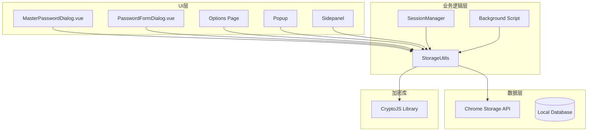
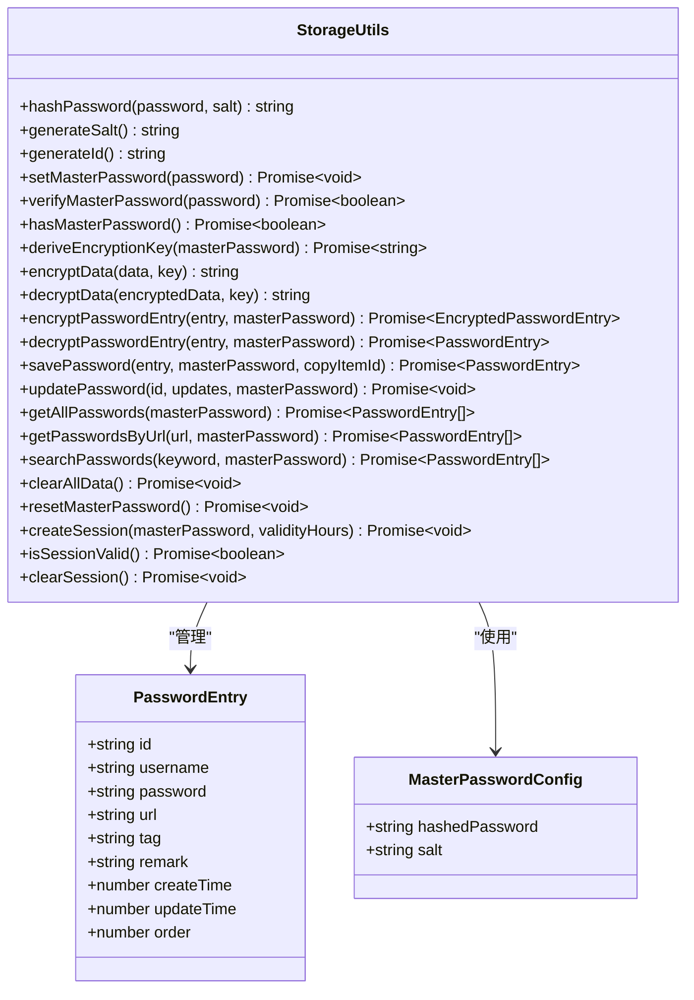
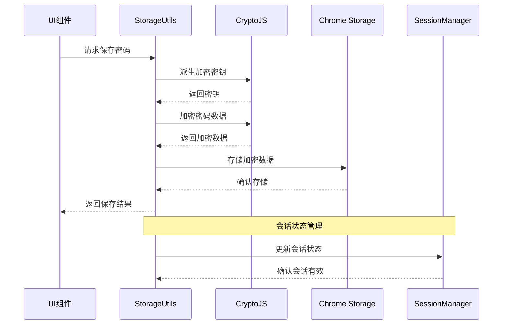
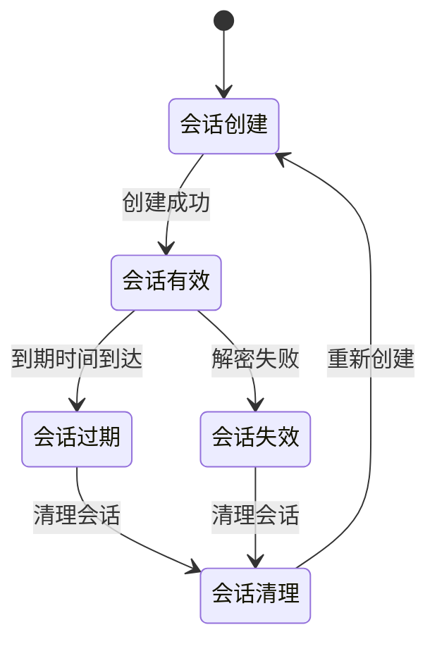
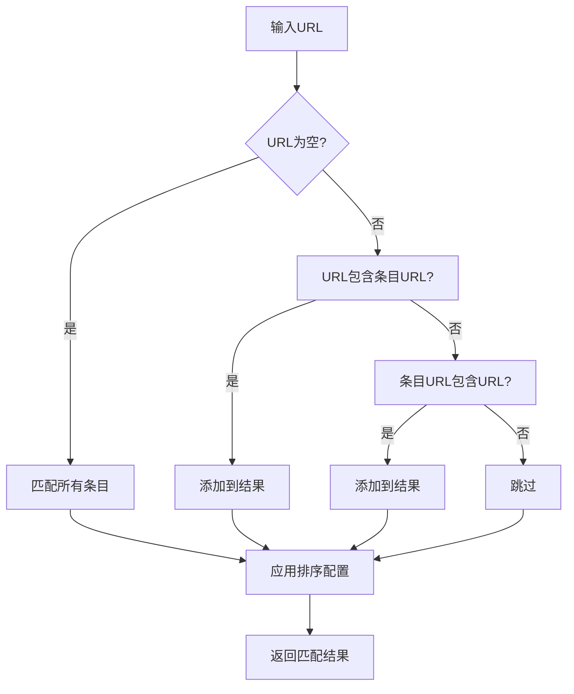
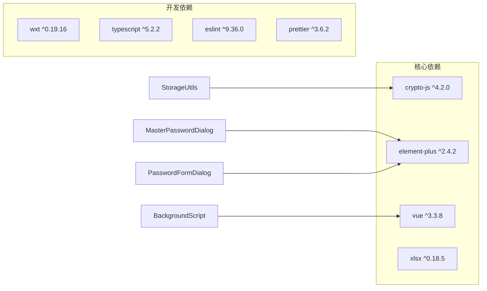
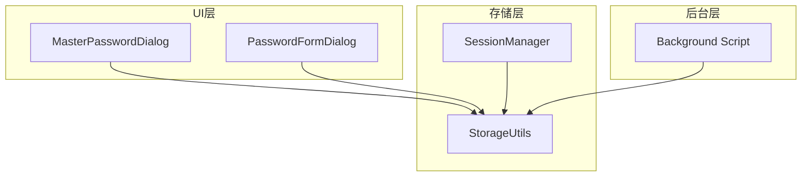

# 存储管理系统

<cite>
**本文档引用的文件**
- [storage.ts](file://utils/storage.ts)
- [types.ts](file://utils/types.ts)
- [sessionManager.ts](file://utils/sessionManager.ts)
- [background.ts](file://entrypoints/background.ts)
- [MasterPasswordDialog.vue](file://components/MasterPasswordDialog.vue)
- [PasswordFormDialog.vue](file://components/PasswordFormDialog.vue)
- [package.json](file://package.json)
- [README.md](file://README.md)
</cite>

## 目录
1. [简介](#简介)
2. [项目结构](#项目结构)
3. [核心组件](#核心组件)
4. [架构概览](#架构概览)
5. [详细组件分析](#详细组件分析)
6. [依赖关系分析](#依赖关系分析)
7. [性能考虑](#性能考虑)
8. [故障排除指南](#故障排除指南)
9. [结论](#结论)
10. [附录](#附录)

## 简介

Account Password Helper 是一个基于Chrome扩展的账号密码管理工具，专注于提供安全、便捷的密码存储和自动填充功能。本文档深入分析其存储管理系统，特别是StorageUtils类的设计架构和实现细节。

该系统采用多层安全策略：主密码保护、数据加密存储、会话状态管理，以及完整的数据持久化机制。系统支持密码条目管理、加密存储机制、数据持久化策略和会话状态管理等功能。

## 项目结构

项目采用模块化架构，主要分为以下几个层次：

**图表来源**
- [storage.ts](file://utils/storage.ts#L37-L981)
- [sessionManager.ts](file://utils/sessionManager.ts#L1-L87)
- [background.ts](file://entrypoints/background.ts#L1-L232)

**章节来源**
- [storage.ts](file://utils/storage.ts#L1-L981)
- [types.ts](file://utils/types.ts#L1-L96)
- [package.json](file://package.json#L1-L49)

## 核心组件

### StorageUtils 类架构

StorageUtils 是整个存储系统的核心类，提供了完整的密码管理功能：

**图表来源**
- [storage.ts](file://utils/storage.ts#L37-L981)
- [types.ts](file://utils/types.ts#L4-L49)

### 数据模型设计

系统采用清晰的数据模型设计：

**PasswordEntry 接口**：
- 唯一标识符 (id)
- 用户凭据 (username, password)
- 网站信息 (url)
- 分类标签 (tag)
- 备注信息 (remark)
- 时间戳 (createTime, updateTime)
- 排序索引 (order)

**MasterPasswordConfig 接口**：
- 哈希后的主密码
- 随机盐值

**章节来源**
- [types.ts](file://utils/types.ts#L4-L49)

## 架构概览

存储管理系统采用分层架构，确保数据安全性和系统稳定性：

**图表来源**
- [storage.ts](file://utils/storage.ts#L377-L426)
- [sessionManager.ts](file://utils/sessionManager.ts#L34-L44)

## 详细组件分析

### 加密存储机制

系统实现了多层次的加密策略：

#### 主密码保护机制

**图表来源**
- [storage.ts](file://utils/storage.ts#L76-L114)

#### AES加密实现

系统使用CryptoJS库实现高级AES加密：

**加密流程**：
1. 从主密码和盐值派生256位密钥
2. 生成随机初始化向量(IV)
3. 使用AES-256-CBC模式加密
4. 将IV和密文组合并Base64编码

**解密流程**：
1. Base64解码组合数据
2. 提取IV和密文
3. 使用相同密钥和IV解密
4. 返回明文数据

**章节来源**
- [storage.ts](file://utils/storage.ts#L164-L297)

### 数据持久化策略

#### 存储键值管理

系统定义了统一的存储键值常量：

| 键名 | 用途 | 数据类型 |
|------|------|----------|
| `account_passwords` | 密码条目集合 | Array |
| `master_password_config` | 主密码配置 | Object |
| `app_settings` | 应用设置 | Object |
| `master_password_validity` | 主密码有效期 | Number |
| `password_sort_config` | 排序配置 | Object |

#### 会话状态管理

**图表来源**
- [storage.ts](file://utils/storage.ts#L865-L916)
- [sessionManager.ts](file://utils/sessionManager.ts#L27-L66)

**章节来源**
- [storage.ts](file://utils/storage.ts#L12-L35)
- [storage.ts](file://utils/storage.ts#L865-L981)
- [sessionManager.ts](file://utils/sessionManager.ts#L1-L87)

### 密码条目管理

#### CRUD操作实现

系统提供了完整的密码条目管理功能：

**保存密码流程**：
1. 获取现有密码列表
2. 生成唯一ID和时间戳
3. 根据是否提供主密码决定加密策略
4. 插入到指定位置（支持复制功能）
5. 持久化存储

**更新密码流程**：
1. 获取当前密码列表
2. 查找目标条目
3. 合并更新字段
4. 根据加密状态重新加密
5. 更新存储

**章节来源**
- [storage.ts](file://utils/storage.ts#L377-L461)

### 搜索和排序功能

#### URL匹配算法

系统实现了灵活的URL匹配机制：

**图表来源**
- [storage.ts](file://utils/storage.ts#L560-L576)

#### 排序配置管理

系统支持多种排序方式和持久化配置：

**支持的排序字段**：
- username (用户名)
- url (网站地址)
- tag (标签)
- remark (备注)
- createTime (创建时间)
- updateTime (更新时间)

**排序方向**：
- ascending (升序)
- descending (降序)

**章节来源**
- [storage.ts](file://utils/storage.ts#L607-L670)

## 依赖关系分析

### 外部依赖

系统主要依赖以下外部库：

**图表来源**
- [package.json](file://package.json#L22-L46)

### 内部模块依赖

**图表来源**
- [storage.ts](file://utils/storage.ts#L1-L981)
- [sessionManager.ts](file://utils/sessionManager.ts#L1-L87)
- [MasterPasswordDialog.vue](file://components/MasterPasswordDialog.vue#L96)
- [PasswordFormDialog.vue](file://components/PasswordFormDialog.vue#L91)

**章节来源**
- [package.json](file://package.json#L22-L46)

## 性能考虑

### 加密性能优化

系统在加密性能方面采用了多项优化措施：

1. **PBKDF2迭代优化**：使用10000次迭代确保安全性同时控制性能影响
2. **内存缓存策略**：会话加密密钥在内存中缓存，避免重复计算
3. **增量加密**：仅对必要的字段进行加密，减少处理开销

### 存储性能优化

1. **批量操作支持**：支持批量删除和更新操作
2. **延迟加载**：密码列表按需解密，避免不必要的解密操作
3. **索引优化**：使用order字段进行快速排序和定位

### 内存管理

1. **会话生命周期管理**：自动清理过期会话
2. **错误隔离**：单个条目解密失败不影响其他条目
3. **资源释放**：及时清理定时器和事件监听器

## 故障排除指南

### 常见问题及解决方案

#### 主密码相关问题

**问题**：主密码设置失败
- 检查密码输入是否为空
- 确认Chrome存储API可用性
- 验证磁盘空间充足

**问题**：主密码验证失败
- 确认输入密码正确
- 检查盐值是否匹配
- 验证存储配置完整性

#### 加密相关问题

**问题**：数据解密失败
- 检查会话状态是否有效
- 验证加密密钥是否正确
- 确认数据格式是否正确

**问题**：加密性能问题
- 检查PBKDF2迭代次数
- 优化批量操作频率
- 监控内存使用情况

#### 存储相关问题

**问题**：数据丢失
- 检查Chrome存储配额限制
- 验证数据格式正确性
- 确认备份策略执行

**章节来源**
- [storage.ts](file://utils/storage.ts#L110-L114)
- [storage.ts](file://utils/storage.ts#L139-L143)
- [storage.ts](file://utils/storage.ts#L285-L297)

### 调试工具

系统提供了完善的调试功能：

1. **主密码调试**：获取主密码配置的详细信息
2. **会话状态监控**：实时监控会话有效性
3. **错误日志记录**：详细的错误信息输出

**章节来源**
- [storage.ts](file://utils/storage.ts#L960-L979)

## 结论

Account Password Helper的存储管理系统展现了优秀的架构设计和实现质量。系统通过多层安全策略、高效的加密算法、完善的会话管理机制，为用户提供了安全可靠的密码管理解决方案。

**主要优势**：
- 多层次安全保护机制
- 高效的加密存储实现
- 完善的会话状态管理
- 用户友好的数据持久化策略
- 良好的性能和可维护性

**技术亮点**：
- 基于PBKDF2的密钥派生算法
- AES-256-CBC的加密存储
- 智能的会话生命周期管理
- 灵活的搜索和排序功能

该系统为Chrome扩展的存储管理提供了优秀的参考实现，具有很高的学习价值和实用意义。

## 附录

### 存储配置选项

| 配置项 | 默认值 | 说明 |
|--------|--------|------|
| PBKDF2迭代次数 | 10000 | 安全性与性能平衡 |
| 会话有效期 | 24小时 | 可配置的有效期范围 |
| AES密钥长度 | 256位 | 现代加密标准 |
| 盐值长度 | 16字节 | 随机性保证 |

### 数据迁移指南

当需要升级或迁移数据时，建议遵循以下步骤：

1. **备份现有数据**：使用导出功能备份所有密码条目
2. **验证备份完整性**：检查备份文件的完整性和可读性
3. **清理旧版本**：卸载旧版本插件
4. **安装新版本**：安装新版本插件
5. **恢复数据**：使用导入功能恢复备份数据
6. **验证功能**：测试所有功能正常运行

### 最佳实践

1. **定期备份**：建议每周导出一次密码数据
2. **安全存储**：将备份文件存储在安全位置
3. **性能监控**：定期检查存储使用情况
4. **错误监控**：关注系统日志中的错误信息
5. **安全更新**：及时更新加密库和依赖包