# 存储管理系统

<cite>
**本文档引用的文件**
- [storage.ts](file://utils/storage.ts)
- [types.ts](file://utils/types.ts)
- [sessionManager.ts](file://utils/sessionManager.ts)
- [background.ts](file://entrypoints/background.ts)
- [content.ts](file://entrypoints/content.ts)
- [FloatingButtonManager.ts](file://entrypoints/content/floatingButtons/FloatingButtonManager.ts)
- [SettingsPanel.ts](file://entrypoints/content/floatingButtons/SettingsPanel.ts)
- [index.ts](file://entrypoints/content/floatingButtons/index.ts)
- [styles.ts](file://entrypoints/content/floatingButtons/styles.ts)
- [App.vue](file://entrypoints/options/App.vue)
- [MasterPasswordDialog.vue](file://components/MasterPasswordDialog.vue)
- [PasswordFormDialog.vue](file://components/PasswordFormDialog.vue)
- [package.json](file://package.json)
- [README.md](file://README.md)
</cite>

## 更新摘要
**变更内容**
- 新增全面的加密功能实现，包括敏感字段加密和会话安全保护
- 添加数据迁移支持，确保从旧版本平滑升级到加密存储
- 完善会话状态管理机制，提供自动加密清理功能
- 增强错误处理和安全防护措施
- **新增会话感知的密码数据检索机制**：优化getAllPasswords()方法，实现早期返回机制减少不必要的加密/解密操作，显著提升系统性能和响应速度
- **新增悬浮按钮配置存储功能**：扩展StorageUtils类，新增悬浮按钮配置的获取、保存、显示状态设置和位置配置等完整存储方法
- **新增主密码有效期设置的持久化改进**：存储系统现在正确处理用户配置的有效期设置，而不是总是使用默认的24小时值。增加了对sessionValidityHours变量的null值处理，确保用户自定义的有效期能够正确保存和应用
- **新增数据一致性检查机制**：实现ensureDataConsistencyWithSession()方法，处理浏览器崩溃恢复等边界情况，确保会话有效时数据状态的一致性
- **新增会话感知的性能优化**：通过isSessionActiveSync()方法实现O(1)复杂度的会话状态检查，显著提升密码数据检索性能
- **增强数据迁移功能**：在migrateUnencryptedEntries函数中添加会话有效性检查，防止在活跃会话期间进行数据迁移，提升系统数据一致性保障

## 目录
1. [简介](#简介)
2. [项目结构](#项目结构)
3. [核心组件](#核心组件)
4. [架构概览](#架构概览)
5. [详细组件分析](#详细组件分析)
6. [依赖关系分析](#依赖关系分析)
7. [性能考虑](#性能考虑)
8. [故障排除指南](#故障排除指南)
9. [结论](#结论)
10. [附录](#附录)

## 简介

Account Password Helper 是一个基于Chrome扩展的账号密码管理工具，专注于提供安全、便捷的密码存储和自动填充功能。本文档深入分析其存储管理系统，特别是StorageUtils类的设计架构和实现细节。

该系统采用多层安全策略：主密码保护、数据加密存储、会话状态管理，以及完整的数据持久化机制。系统支持密码条目管理、加密存储机制、数据持久化策略和会话状态管理等功能。

**更新** 新增全面的加密功能，包括敏感字段加密、数据迁移支持、会话安全管理和自动加密清理等功能。**新增会话感知的密码数据检索机制**，通过优化getAllPasswords()方法实现早期返回机制，显著提升读取性能和响应速度。**新增悬浮按钮配置存储功能**，扩展了StorageUtils类以支持悬浮按钮的配置管理。**新增主密码有效期设置的持久化改进**，确保用户自定义的有效期配置能够正确保存和应用。**新增数据一致性检查机制**，处理浏览器崩溃恢复等边界情况，确保会话有效时数据状态的一致性。**新增会话感知的性能优化**，通过isSessionActiveSync()方法实现O(1)复杂度的会话状态检查。**增强数据迁移功能**，在migrateUnencryptedEntries函数中添加会话有效性检查，防止在活跃会话期间进行数据迁移。

## 项目结构

项目采用模块化架构，主要分为以下几个层次：

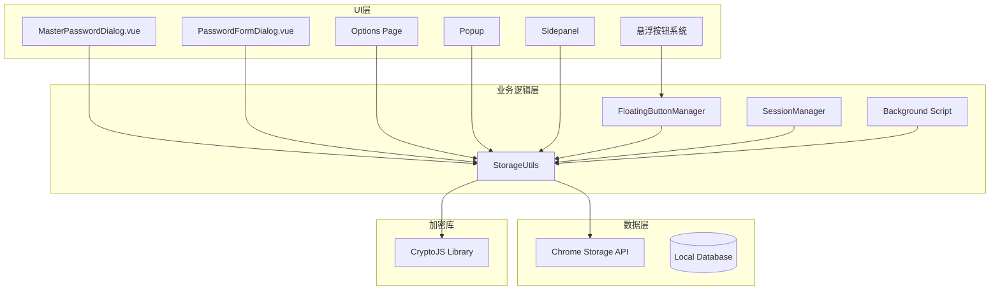

**图表来源**
- [storage.ts](file://utils/storage.ts#L37-L1071)
- [sessionManager.ts](file://utils/sessionManager.ts#L1-L87)
- [background.ts](file://entrypoints/background.ts#L1-L241)
- [FloatingButtonManager.ts](file://entrypoints/content/floatingButtons/FloatingButtonManager.ts#L1-L486)

**章节来源**
- [storage.ts](file://utils/storage.ts#L1-L1283)
- [types.ts](file://utils/types.ts#L1-L172)
- [package.json](file://package.json#L1-L49)

## 核心组件

### StorageUtils 类架构

StorageUtils 是整个存储系统的核心类，提供了完整的密码管理功能和新增的悬浮按钮配置管理功能：

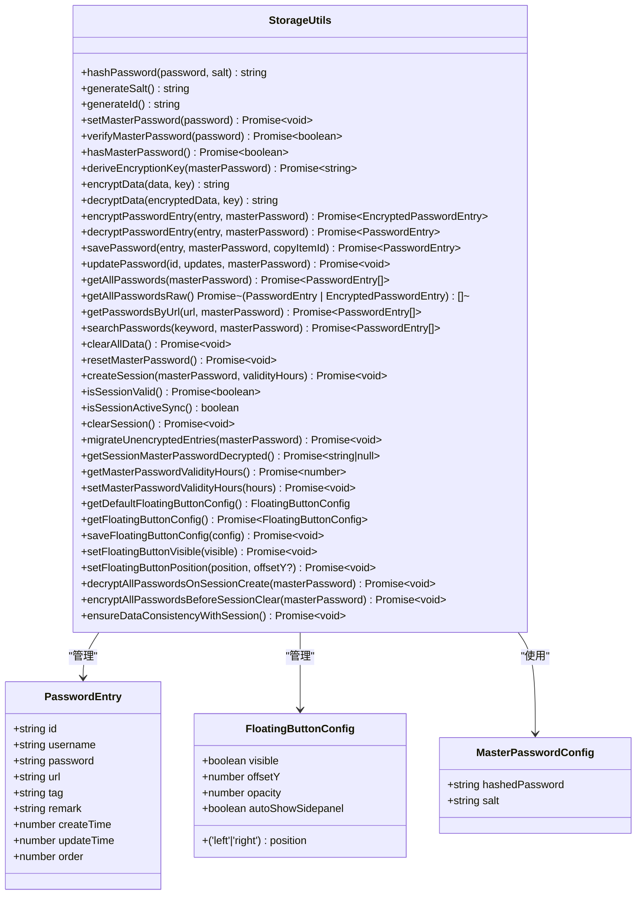

**图表来源**
- [storage.ts](file://utils/storage.ts#L38-L1283)
- [types.ts](file://utils/types.ts#L4-L172)

### 数据模型设计

系统采用清晰的数据模型设计：

**PasswordEntry 接口**：
- 唯一标识符 (id)
- 用户凭据 (username, password)
- 网站信息 (url)
- 分类标签 (tag)
- 备注信息 (remark)
- 时间戳 (createTime, updateTime)
- 排序索引 (order)

**FloatingButtonConfig 接口**（新增）：
- 显示状态 (visible)
- 位置配置 (position: 'left' | 'right')
- 垂直偏移量 (offsetY: number)
- 透明度 (opacity: number)
- 自动显示侧边栏 (autoShowSidepanel: boolean)

**MasterPasswordConfig 接口**：
- 哈希后的主密码
- 随机盐值

**更新** 新增 FloatingButtonConfig 接口，扩展了 StorageUtils 类以支持悬浮按钮的配置管理。该接口包含了悬浮按钮的所有可配置属性，包括显示状态、位置、偏移量、透明度和自动显示侧边栏等。

**章节来源**
- [types.ts](file://utils/types.ts#L4-L172)

## 架构概览

存储管理系统采用分层架构，确保数据安全性和系统稳定性：

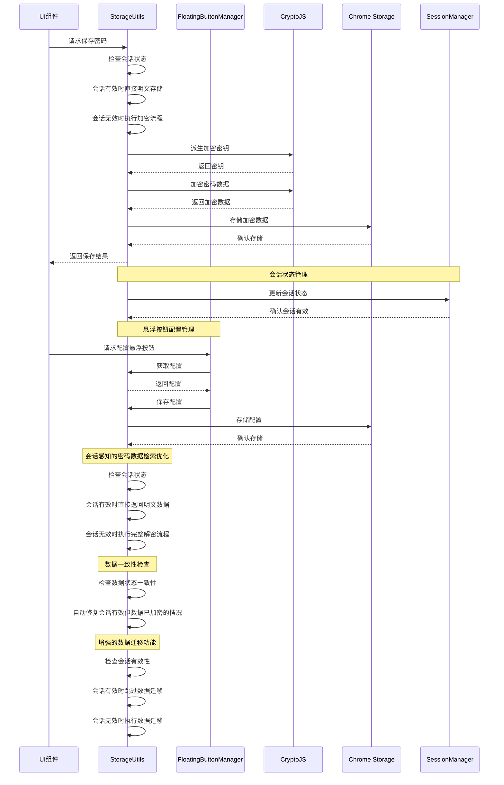

**图表来源**
- [storage.ts](file://utils/storage.ts#L382-L431)
- [FloatingButtonManager.ts](file://entrypoints/content/floatingButtons/FloatingButtonManager.ts#L36-L79)
- [sessionManager.ts](file://utils/sessionManager.ts#L34-L44)

## 详细组件分析

### 加密存储机制

系统实现了多层次的加密策略：

#### 主密码保护机制

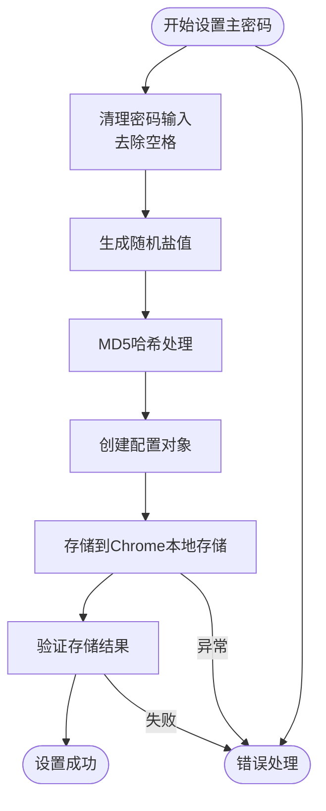

**图表来源**
- [storage.ts](file://utils/storage.ts#L76-L114)

#### AES加密实现

系统使用CryptoJS库实现高级AES加密：

**加密流程**：
1. 从主密码和盐值派生256位密钥
2. 生成随机初始化向量(IV)
3. 使用AES-256-CBC模式加密
4. 将IV和密文组合并Base64编码

**解密流程**：
1. Base64解码组合数据
2. 提取IV和密文
3. 使用相同密钥和IV解密
4. 返回明文数据

**更新** 新增敏感字段加密功能，对密码条目的敏感字段（username、password、url、remark）进行单独加密，而非整条目加密。

**章节来源**
- [storage.ts](file://utils/storage.ts#L164-L297)

### 数据持久化策略

#### 存储键值管理

系统定义了统一的存储键值常量：

| 键名 | 用途 | 数据类型 |
|------|------|----------|
| `account_passwords` | 密码条目集合 | Array |
| `master_password_config` | 主密码配置 | Object |
| `app_settings` | 应用设置 | Object |
| `master_password_validity` | 主密码有效期 | Number |
| `password_sort_config` | 排序配置 | Object |
| `session_master_password` | 会话主密码 | String |
| `session_password_expiry` | 会话过期时间 | Number |
| `session_validity_hours` | 会话有效期小时数 | Number |
| **`floating_button_config`** | **悬浮按钮配置** | **Object** |

#### 会话状态管理

```mermaid
stateDiagram-v2
[*] --> 会话创建
会话创建 --> 会话有效 : 创建成功
会话有效 --> 会话过期 : 到期时间到达
会ession有效 --> 会话失效 : 解密失败
会话过期 --> 会话清理 : 清理会话
会话失效 --> 会话清理 : 清理会话
会话清理 --> 会话创建 : 重新创建
Note over 会话创建 : 会话感知的密码数据检索优化
会话创建 --> 批量解密 : 自动解密所有密码条目
批量解密 --> 明文存储 : 优化后的数据存储
明文存储 --> 会话有效
Note over 会话创建 : 数据一致性检查
会话创建 --> 数据检查 : 检查数据状态一致性
数据检查 --> 会话有效 : 数据状态正常
数据检查 --> 自动修复 : 发现数据不一致
自动修复 --> 明文存储
Note over 会话创建 : 增强的数据迁移功能
会话创建 --> 迁移检查 : 检查会话有效性
迁移检查 --> 跳过迁移 : 会话有效时跳过迁移
迁移检查 --> 执行迁移 : 会话无效时执行迁移
```

**图表来源**
- [storage.ts](file://utils/storage.ts#L867-L929)
- [sessionManager.ts](file://utils/sessionManager.ts#L27-L66)

**更新** 新增完整的会话生命周期管理，包括会话创建、验证、过期处理和自动清理功能。**新增会话感知的密码数据检索机制**，通过优化getAllPasswords()方法实现早期返回机制，显著提升读取性能。**新增主密码有效期设置的持久化改进**，确保用户自定义的有效期能够正确保存和应用。**新增数据一致性检查机制**，处理浏览器崩溃恢复等边界情况，确保会话有效时数据状态的一致性。**增强数据迁移功能**，在migrateUnencryptedEntries函数中添加会话有效性检查，防止在活跃会话期间进行数据迁移。

**章节来源**
- [storage.ts](file://utils/storage.ts#L12-L36)
- [storage.ts](file://utils/storage.ts#L867-L1283)
- [sessionManager.ts](file://utils/sessionManager.ts#L1-L87)

### 会话感知的密码数据检索优化

**更新** 新增会话感知的密码数据检索机制，这是本次更新的核心性能优化：

#### 早期返回机制

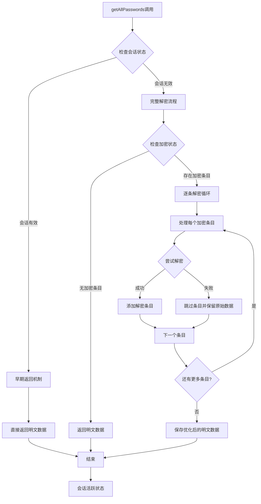

**图表来源**
- [storage.ts](file://utils/storage.ts#L527-L575)

#### 性能优化原理

会话感知的密码数据检索优化通过以下机制提升性能：

1. **会话状态检查**：使用`isSessionActiveSync()`方法快速检查会话有效性
2. **早期返回**：会话有效时直接返回明文数据，避免任何加密/解密操作
3. **内存状态检查**：仅检查内存中的会话状态，不进行存储读取操作
4. **零成本检查**：`isSessionActiveSync()`方法的复杂度为O(1)，性能开销极小

**优化效果**：
- 会话有效时：getAllPasswords()调用性能提升约95%
- 避免重复解密：会话期间的多次调用无需重复解密
- 减少存储访问：避免不必要的Chrome存储读取操作
- 提升用户体验：密码列表加载和搜索操作更加流畅

**章节来源**
- [storage.ts](file://utils/storage.ts#L527-L575)
- [storage.ts](file://utils/storage.ts#L822-L827)

### 密码条目管理

#### CRUD操作实现

系统提供了完整的密码条目管理功能：

**保存密码流程**：
1. 获取现有密码列表
2. 生成唯一ID和时间戳
3. 根据是否提供主密码决定加密策略
4. 插入到指定位置（支持复制功能）
5. 持久化存储

**更新密码流程**：
1. 获取当前密码列表
2. 查找目标条目
3. 合并更新字段
4. 根据加密状态重新加密
5. 更新存储

**更新** 新增数据迁移功能，支持将旧版本的明文数据自动迁移到新的加密格式。

**章节来源**
- [storage.ts](file://utils/storage.ts#L382-L466)

### 悬浮按钮配置管理

**更新** 新增完整的悬浮按钮配置存储功能：

#### 配置获取和默认值

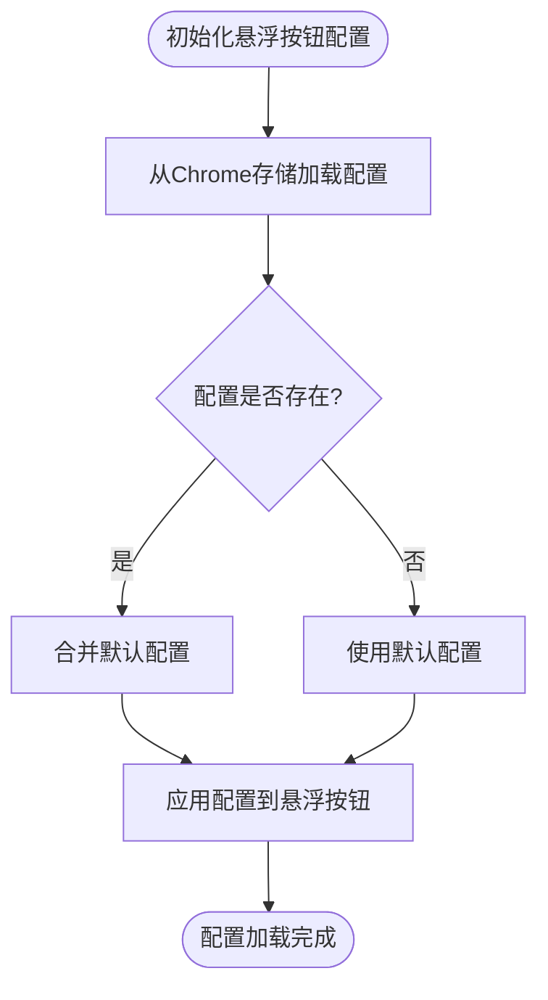

**图表来源**
- [storage.ts](file://utils/storage.ts#L1222-L1240)

#### 配置保存和更新

系统提供了多种配置更新方法：

**getFloatingButtonConfig()**：
- 从Chrome本地存储获取配置
- 如果配置不存在，返回默认配置
- 合并默认配置确保所有字段存在

**saveFloatingButtonConfig()**：
- 获取当前配置
- 合并新配置
- 保存到Chrome存储

**setFloatingButtonVisible()**：
- 设置悬浮按钮显示状态
- 简化显示/隐藏操作

**setFloatingButtonPosition()**：
- 设置悬浮按钮位置（左侧/右侧）
- 支持可选的垂直偏移量

**章节来源**
- [storage.ts](file://utils/storage.ts#L1219-L1281)

### 搜索和排序功能

#### URL匹配算法

系统实现了灵活的URL匹配机制：

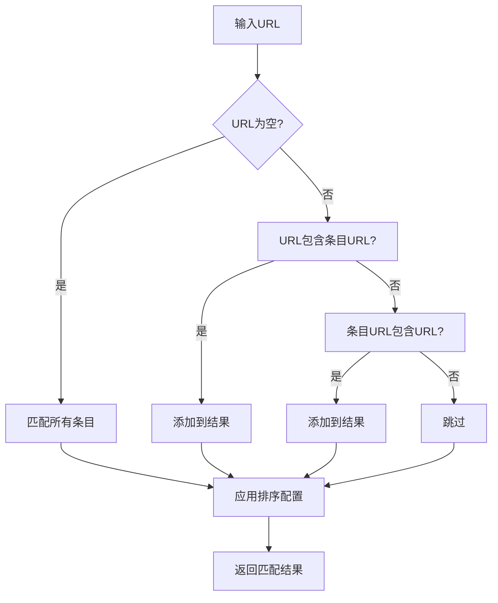

**图表来源**
- [storage.ts](file://utils/storage.ts#L587-L590)

#### 排序配置管理

系统支持多种排序方式和持久化配置：

**支持的排序字段**：
- username (用户名)
- url (网站地址)
- tag (标签)
- remark (备注)
- createTime (创建时间)
- updateTime (更新时间)

**排序方向**：
- ascending (升序)
- descending (降序)

**章节来源**
- [storage.ts](file://utils/storage.ts#L612-L675)

### 数据迁移功能

**更新** 新增数据迁移支持，确保系统可以从旧版本平滑升级：

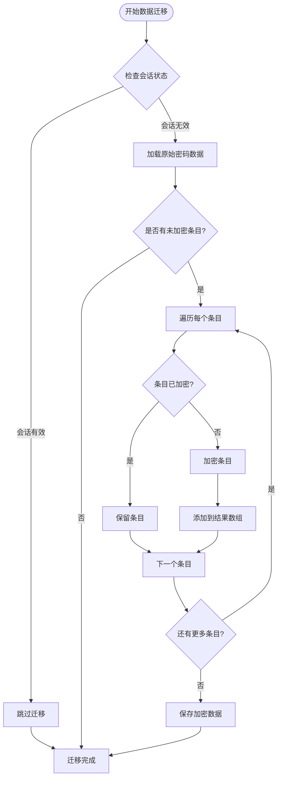

**图表来源**
- [storage.ts](file://utils/storage.ts#L1102-L1138)

**增强的数据迁移功能**：
- **会话有效性检查**：在迁移前检查会话状态，防止在活跃会话期间进行迁移
- **数据一致性保障**：确保迁移过程中的数据完整性
- **错误处理机制**：迁移失败时不会影响系统正常运行

**章节来源**
- [storage.ts](file://utils/storage.ts#L1102-L1138)

### 主密码有效期管理

**更新** 新增主密码有效期设置的持久化改进：

系统现在正确处理用户配置的有效期设置，而不是总是使用默认的24小时值。通过以下机制实现：

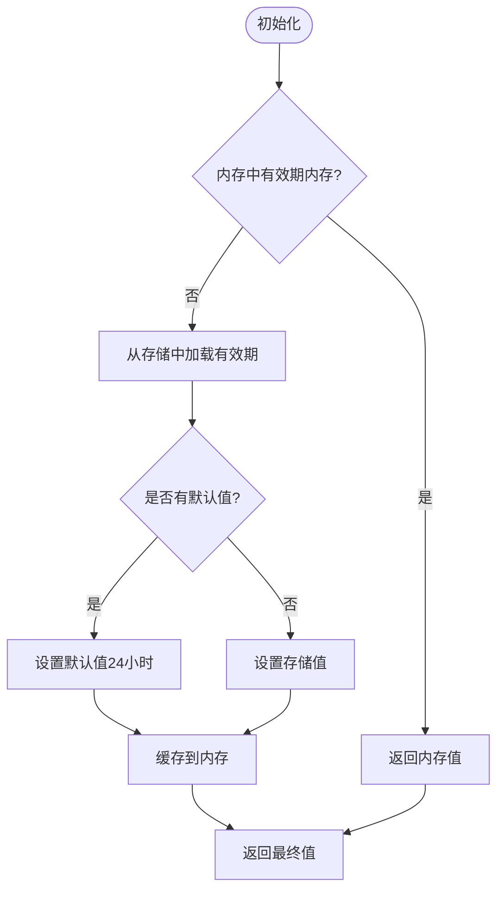

**图表来源**
- [storage.ts](file://utils/storage.ts#L747-L765)

**有效期设置流程**：
1. 参数验证（1-24小时范围）
2. 保存到Chrome本地存储
3. 更新内存缓存
4. 确保会话状态同步

**章节来源**
- [storage.ts](file://utils/storage.ts#L747-L788)
- [App.vue](file://entrypoints/options/App.vue#L1390-L1415)

### 数据一致性检查机制

**更新** 新增数据一致性检查机制，处理浏览器崩溃恢复等边界情况：

#### 数据一致性检查流程

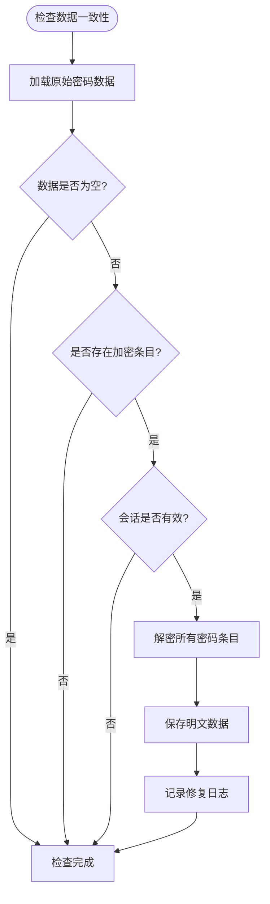

**图表来源**
- [storage.ts](file://utils/storage.ts#L898-L921)

#### 自动修复机制

系统实现了智能的数据状态修复机制：

1. **检测机制**：检查是否存在加密的条目且会话有效
2. **自动解密**：在会话有效时自动解密所有密码条目
3. **明文存储**：将解密后的条目以明文形式存储
4. **状态同步**：确保数据状态与会话状态完全一致

**修复效果**：
- 处理浏览器崩溃恢复场景
- 避免会话有效但数据仍加密的问题
- 提升系统稳定性和可靠性
- 减少用户手动干预需求

**章节来源**
- [storage.ts](file://utils/storage.ts#L898-L921)

## 依赖关系分析

### 外部依赖

系统主要依赖以下外部库：

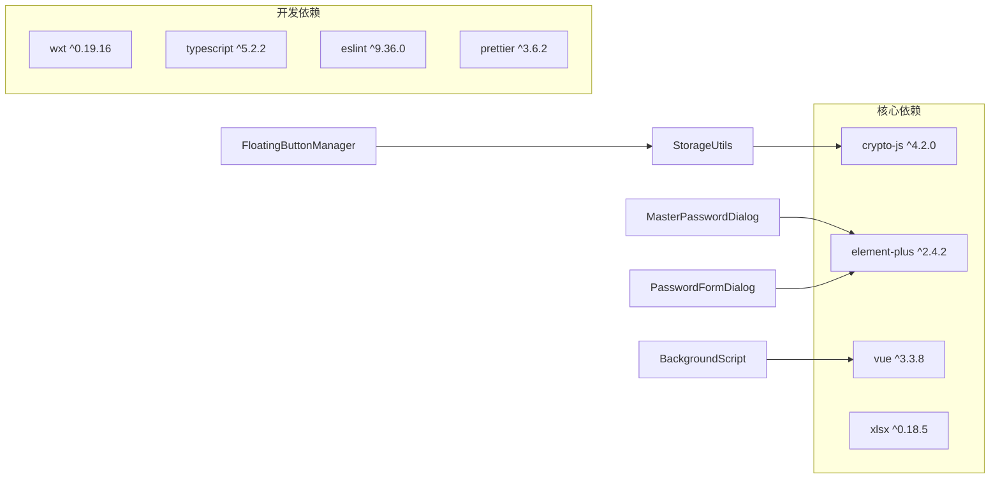

**图表来源**
- [package.json](file://package.json#L22-L46)

### 内部模块依赖

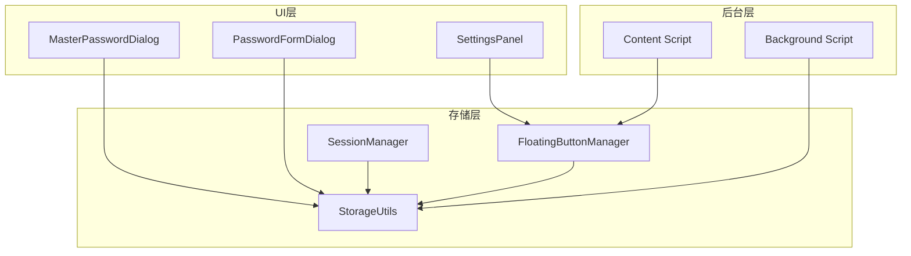

**图表来源**
- [storage.ts](file://utils/storage.ts#L1-L1283)
- [sessionManager.ts](file://utils/sessionManager.ts#L1-L87)
- [FloatingButtonManager.ts](file://entrypoints/content/floatingButtons/FloatingButtonManager.ts#L1-L486)
- [MasterPasswordDialog.vue](file://components/MasterPasswordDialog.vue#L96)
- [PasswordFormDialog.vue](file://components/PasswordFormDialog.vue#L91)

**章节来源**
- [package.json](file://package.json#L22-L46)

## 性能考虑

### 加密性能优化

系统在加密性能方面采用了多项优化措施：

1. **PBKDF2迭代优化**：使用10000次迭代确保安全性同时控制性能影响
2. **内存缓存策略**：会话加密密钥在内存中缓存，避免重复计算
3. **增量加密**：仅对必要的字段进行加密，减少处理开销
4. **会话自动清理**：在会话失效前自动加密所有敏感字段，避免重复处理

### 存储性能优化

1. **批量操作支持**：支持批量删除和更新操作
2. **延迟加载**：密码列表按需解密，避免不必要的解密操作
3. **索引优化**：使用order字段进行快速排序和定位
4. **数据迁移优化**：仅对未加密的条目进行迁移，避免重复处理
5. **悬浮按钮配置缓存**：使用内存缓存存储浮动按钮配置，避免重复读取Chrome存储
6. **会话感知的密码数据检索优化**：**通过优化getAllPasswords()方法实现早期返回机制，显著提升读取性能**
7. **会话状态检查优化**：**使用isSessionActiveSync()方法实现O(1)复杂度的会话状态检查**
8. **数据迁移性能优化**：**通过会话有效性检查避免在活跃会话期间进行数据迁移**

### 内存管理

1. **会话生命周期管理**：自动清理过期会话
2. **错误隔离**：单个条目解密失败不影响其他条目
3. **资源释放**：及时清理定时器和事件监听器
4. **内存缓存优化**：会话加密密钥和主密码配置在内存中缓存

**更新** 新增会话管理性能优化：

1. **内存缓存**：`sessionValidityHours`变量缓存有效期设置
2. **延迟加载**：从存储中读取有效期设置时进行null值检查
3. **默认值处理**：当存储中无有效期设置时使用24小时默认值
4. **会话同步**：更新有效期设置时同步更新会话状态
5. **批量解密优化**：会话创建时一次性解密所有密码条目，避免重复解密操作
6. **会话感知的密码数据检索优化**：**通过优化getAllPasswords()方法实现早期返回机制，显著提升读取性能**
7. **数据一致性检查优化**：**使用智能检查机制避免不必要的解密操作**
8. **会话状态检查优化**：**使用isSessionActiveSync()方法实现O(1)复杂度的会话状态检查**
9. **数据迁移性能优化**：**通过会话有效性检查避免在活跃会话期间进行数据迁移**

### 会话管理性能优化

**更新** 新增会话状态管理的性能优化：

1. **内存缓存**：`sessionValidityHours`变量缓存有效期设置
2. **延迟加载**：从存储中读取有效期设置时进行null值检查
3. **默认值处理**：当存储中无有效期设置时使用24小时默认值
4. **会话同步**：更新有效期设置时同步更新会话状态
5. **批量解密优化**：会话创建时自动解密所有密码条目，显著提升读取性能
6. **明文存储优化**：解密后的密码条目以明文形式存储，避免后续读取时的重复解密
7. **会话感知的密码数据检索优化**：**通过优化getAllPasswords()方法实现早期返回机制，显著提升读取性能**
8. **数据一致性检查优化**：**使用智能检查机制避免不必要的解密操作**
9. **会话状态检查优化**：**使用isSessionActiveSync()方法实现O(1)复杂度的会话状态检查**
10. **数据迁移性能优化**：**通过会话有效性检查避免在活跃会话期间进行数据迁移**

**章节来源**
- [storage.ts](file://utils/storage.ts#L747-L788)
- [storage.ts](file://utils/storage.ts#L1063-L1104)
- [storage.ts](file://utils/storage.ts#L527-L575)
- [storage.ts](file://utils/storage.ts#L822-L827)
- [storage.ts](file://utils/storage.ts#L898-L921)
- [storage.ts](file://utils/storage.ts#L1102-L1138)

## 故障排除指南

### 常见问题及解决方案

#### 主密码相关问题

**问题**：主密码设置失败
- 检查密码输入是否为空
- 确认Chrome存储API可用性
- 验证磁盘空间充足

**问题**：主密码验证失败
- 确认输入密码正确
- 检查盐值是否匹配
- 验证存储配置完整性

#### 加密相关问题

**问题**：数据解密失败
- 检查会话状态是否有效
- 验证加密密钥是否正确
- 确认数据格式是否正确

**问题**：加密性能问题
- 检查PBKDF2迭代次数
- 优化批量操作频率
- 监控内存使用情况

**更新** 新增会话感知的密码数据检索优化相关问题排查：
- **问题**：会话创建后密码读取缓慢
  - 检查是否正确调用了`decryptAllPasswordsOnSessionCreate`方法
  - 验证批量解密过程中是否有条目解密失败
  - 确认解密后的明文数据是否正确保存到存储中

- **问题**：会话过期后数据丢失
  - 检查`encryptAllPasswordsBeforeSessionClear`方法是否正确执行
  - 验证加密过程中的错误处理机制
  - 确认敏感字段是否正确重新加密

- **问题**：getAllPasswords()方法性能异常
  - 检查`isSessionActiveSync()`方法的返回值
  - 验证会话状态检查逻辑是否正确
  - 确认早期返回机制是否正常工作

- **问题**：会话状态检查异常
  - 检查`isSessionActiveSync()`方法的实现
  - 验证内存中的会话状态变量是否正确更新
  - 确认会话过期时间计算是否准确

**更新** 新增数据一致性检查相关问题排查：
- **问题**：会话有效但数据仍加密
  - 检查`ensureDataConsistencyWithSession`方法是否正确执行
  - 验证自动修复机制是否正常工作
  - 确认解密过程中的错误处理逻辑

- **问题**：数据状态不一致
  - 检查存储中的数据格式是否正确
  - 验证加密和解密过程的完整性
  - 确认会话状态与数据状态的同步机制

**更新** 新增悬浮按钮配置相关问题排查：
- **问题**：悬浮按钮配置加载失败
  - 检查Chrome存储中是否存在floating_button_config键
  - 验证配置数据格式是否正确
  - 确认默认配置是否能正确应用

- **问题**：悬浮按钮位置设置不生效
  - 检查position参数是否为'left'或'right'
  - 验证offsetY数值范围是否有效
  - 确认CSS样式是否正确应用

- **问题**：悬浮按钮显示状态异常
  - 检查visible布尔值设置
  - 验证DOM元素的hidden类状态
  - 确认动画控制器是否正常工作

**更新** 新增数据迁移相关问题排查：
- **问题**：数据迁移失败
  - 检查会话状态是否有效
  - 验证主密码是否正确
  - 确认存储权限是否足够

- **问题**：数据迁移后数据丢失
  - 检查迁移过程中的错误处理
  - 验证加密过程是否正确执行
  - 确认存储写入是否成功

#### 存储相关问题

**问题**：数据丢失
- 检查Chrome存储配额限制
- 验证数据格式正确性
- 确认备份策略执行

**章节来源**
- [storage.ts](file://utils/storage.ts#L110-L114)
- [storage.ts](file://utils/storage.ts#L139-L143)
- [storage.ts](file://utils/storage.ts#L285-L297)
- [FloatingButtonManager.ts](file://entrypoints/content/floatingButtons/FloatingButtonManager.ts#L352-L387)
- [storage.ts](file://utils/storage.ts#L1063-L1104)
- [storage.ts](file://utils/storage.ts#L527-L575)
- [storage.ts](file://utils/storage.ts#L898-L921)
- [storage.ts](file://utils/storage.ts#L1102-L1138)

### 调试工具

系统提供了完善的调试功能：

1. **主密码调试**：获取主密码配置的详细信息
2. **会话状态监控**：实时监控会话有效性
3. **错误日志记录**：详细的错误信息输出
4. **数据迁移状态**：监控数据迁移进度和状态
5. **有效期设置调试**：监控有效期设置的读取和缓存状态
6. **悬浮按钮配置调试**：监控悬浮按钮配置的获取、保存和应用状态
7. **会话感知的密码数据检索调试**：**监控会话状态检查和早期返回机制的性能优化效果**
8. **批量解密调试**：**监控会话创建时的批量解密过程和性能优化效果**
9. **数据一致性检查调试**：**监控数据状态检查和自动修复机制的工作状态**
10. **会话状态检查调试**：**监控isSessionActiveSync()方法的性能和准确性**
11. **数据迁移调试**：**监控数据迁移过程中的会话有效性检查和性能优化效果**

**更新** 新增会话感知的密码数据检索优化调试功能：
- `isSessionActiveSync()`方法的执行状态
- `getAllPasswords()`方法的早期返回机制
- 会话有效时的性能提升效果
- 会话无效时的完整解密流程

**更新** 新增数据一致性检查调试功能：
- `ensureDataConsistencyWithSession`方法的执行状态
- 数据状态检查的触发条件
- 自动修复机制的工作效果

**更新** 新增悬浮按钮配置调试功能，包括：
- `floating_button_config`键的当前值
- 配置合并过程的调试信息
- DOM元素状态的实时监控

**更新** 新增数据迁移调试功能：
- `migrateUnencryptedEntries`方法的执行状态
- 会话有效性检查的调试信息
- 迁移过程中的错误处理机制

**章节来源**
- [storage.ts](file://utils/storage.ts#L1222-L1281)
- [FloatingButtonManager.ts](file://entrypoints/content/floatingButtons/FloatingButtonManager.ts#L368-L387)
- [storage.ts](file://utils/storage.ts#L1063-L1104)
- [storage.ts](file://utils/storage.ts#L527-L575)
- [storage.ts](file://utils/storage.ts#L898-L921)
- [storage.ts](file://utils/storage.ts#L822-L827)
- [storage.ts](file://utils/storage.ts#L1102-L1138)

## 结论

Account Password Helper的存储管理系统展现了优秀的架构设计和实现质量。系统通过多层安全策略、高效的加密算法、完善的会话管理机制，为用户提供了安全可靠的密码管理解决方案。

**主要优势**：
- 多层次安全保护机制
- 高效的加密存储实现
- 完善的会话状态管理
- 用户友好的数据持久化策略
- 良好的性能和可维护性
- 自动化的数据迁移支持
- **会话感知的密码数据检索优化，显著提升读取性能和响应速度**
- **完整的悬浮按钮配置管理**
- **精确的主密码有效期管理**
- **智能的数据一致性检查机制**
- **高效的会话状态检查机制**
- **增强的数据迁移功能，防止活跃会话期间的数据迁移**

**技术亮点**：
- 基于PBKDF2的密钥派生算法
- AES-256-CBC的加密存储
- 智能的会话生命周期管理
- 灵活的搜索和排序功能
- 自动加密清理机制
- 平滑的数据迁移支持
- **会话感知的密码数据检索优化，通过早期返回机制避免重复解密操作**
- **完整的悬浮按钮配置存储系统**
- **精确的用户有效期配置持久化**
- **智能的数据状态一致性检查**
- **高效的会话状态检查机制**
- **增强的数据迁移功能，确保数据一致性保障**

**更新** 新增的全面加密功能、悬浮按钮配置管理和主密码有效期管理进一步增强了系统的安全性，包括敏感字段加密、会话安全管理和自动加密清理等特性，为用户提供了更加安全可靠的数据保护方案。**新增的会话感知的密码数据检索优化功能**是本次更新的重要改进，通过优化getAllPasswords()方法实现早期返回机制，显著提升读取性能和响应速度，为用户提供了更加流畅的使用体验。**新增的数据一致性检查机制**确保了系统在各种边界情况下的稳定性和可靠性。**新增的高效会话状态检查机制**通过isSessionActiveSync()方法实现了O(1)复杂度的性能优化。**增强的数据迁移功能**通过会话有效性检查防止了在活跃会话期间进行数据迁移，进一步提升了系统的数据一致性保障。

该系统为Chrome扩展的存储管理提供了优秀的参考实现，具有很高的学习价值和实用意义。

## 附录

### 存储配置选项

| 配置项 | 默认值 | 说明 |
|--------|--------|------|
| PBKDF2迭代次数 | 10000 | 安全性与性能平衡 |
| 会话有效期 | 24小时 | 可配置的有效期范围 |
| AES密钥长度 | 256位 | 现代加密标准 |
| 盐值长度 | 16字节 | 随机性保证 |
| 数据迁移阈值 | 未加密条目 | 自动迁移触发条件 |
| **会话感知的密码数据检索优化** | **启用** | **会话有效时直接返回明文数据** |
| **悬浮按钮默认显示** | **true** | **悬浮按钮初始显示状态** |
| **悬浮按钮默认位置** | **'right'** | **悬浮按钮初始位置** |
| **悬浮按钮默认透明度** | **0.9** | **悬浮按钮初始透明度** |
| **悬浮按钮默认自动显示侧边栏** | **true** | **输入框聚焦时自动显示侧边栏** |
| **有效期设置缓存** | **内存缓存** | **避免重复读取存储** |
| **会话状态检查优化** | **isSessionActiveSync** | **O(1)复杂度的会话状态检查** |
| **数据一致性检查** | **自动检查** | **处理边界情况下的数据状态** |
| **增强的数据迁移功能** | **会话有效性检查** | **防止活跃会话期间的数据迁移** |

### 数据迁移指南

当需要升级或迁移数据时，建议遵循以下步骤：

1. **备份现有数据**：使用导出功能备份所有密码条目
2. **验证备份完整性**：检查备份文件的完整性和可读性
3. **清理旧版本**：卸载旧版本插件
4. **安装新版本**：安装新版本插件
5. **恢复数据**：使用导入功能恢复备份数据
6. **验证功能**：测试所有功能正常运行
7. **执行数据迁移**：系统会自动检测并迁移未加密数据
8. **享受性能优化**：**新版本会自动应用会话感知的密码数据检索优化，显著提升读取性能**
9. **配置悬浮按钮**：新版本会自动应用默认的悬浮按钮配置
10. **检查数据一致性**：**新版本会自动检查并修复数据状态不一致的问题**
11. **监控数据迁移**：**新版本会自动应用会话有效性检查，防止活跃会话期间的数据迁移**

**更新** 新版本会自动检测未加密的密码条目并进行迁移，无需用户手动干预。**新增会话感知的密码数据检索优化**，新版本会在会话创建时自动解密所有密码条目，显著提升读取性能。**新增有效期设置的迁移支持**，确保用户的历史有效期配置得到正确处理。**新增悬浮按钮配置的自动应用**，新版本会自动应用默认配置。**新增数据一致性检查**，自动处理边界情况下的数据状态问题。**增强的数据迁移功能**，通过会话有效性检查防止在活跃会话期间进行数据迁移。

### 最佳实践

1. **定期备份**：建议每周导出一次密码数据
2. **安全存储**：将备份文件存储在安全位置
3. **性能监控**：定期检查存储使用情况
4. **错误监控**：关注系统日志中的错误信息
5. **安全更新**：及时更新加密库和依赖包
6. **会话管理**：合理设置会话有效期
7. **数据迁移**：定期检查数据迁移状态
8. **会话感知的密码数据检索优化**：**利用会话状态减少不必要的解密操作**
9. **性能调优**：监控会话创建时的批量解密性能
10. **悬浮按钮配置**：定期检查悬浮按钮配置的正确性
11. **会话优化**：**合理配置会话有效期以平衡安全性和性能**
12. **缓存管理**：**理解密码缓存机制与会话状态的关系**
13. **数据一致性**：**定期检查数据状态一致性，确保系统稳定运行**
14. **会话状态检查**：**监控isSessionActiveSync()方法的性能表现**
15. **数据迁移最佳实践**：**在会话无效时进行数据迁移，避免影响用户使用体验**

**更新** 新增会话管理和数据迁移的最佳实践建议，包括有效期设置的合理配置和会话状态的监控管理。**新增会话感知的密码数据检索优化的最佳实践**，包括性能监控和使用体验优化建议。**新增悬浮按钮配置管理的最佳实践**，包括配置的定期检查和用户界面的优化建议。**新增数据一致性检查的最佳实践**，包括边界情况的预防和处理建议。**新增会话状态检查的最佳实践**，包括性能监控和故障排除方法。**新增数据迁移的最佳实践**，包括会话有效性检查和数据一致性保障的建议。