# 悬浮按钮系统

<cite>
**本文档引用的文件**
- [index.ts](file://entrypoints/content/floatingButtons/index.ts)
- [FloatingButtonManager.ts](file://entrypoints/content/floatingButtons/FloatingButtonManager.ts)
- [DragHandler.ts](file://entrypoints/content/floatingButtons/DragHandler.ts)
- [AnimationController.ts](file://entrypoints/content/floatingButtons/AnimationController.ts)
- [SettingsPanel.ts](file://entrypoints/content/floatingButtons/SettingsPanel.ts)
- [styles.ts](file://entrypoints/content/floatingButtons/styles.ts)
- [icons.ts](file://entrypoints/content/floatingButtons/icons.ts)
- [storage.ts](file://utils/storage.ts)
- [types.ts](file://utils/types.ts)
- [content.ts](file://entrypoints/content.ts)
- [background.ts](file://entrypoints/background.ts)
- [README.md](file://README.md)
</cite>

## 更新摘要
**变更内容**
- 新增拖拽检测机制，包括hasDragged标志位和200ms重置延迟
- 改进点击过滤逻辑，防止拖拽结束后误触发点击事件
- 增加悬停提示禁用的样式规则，优化用户体验
- 扩展配置选项，支持自动展示侧边栏设置
- 增强表单检测器的智能显示逻辑
- 更新设置面板，移除快捷方式链接，专注于核心配置选项

## 目录
1. [简介](#简介)
2. [项目结构](#项目结构)
3. [核心组件](#核心组件)
4. [架构概览](#架构概览)
5. [详细组件分析](#详细组件分析)
6. [依赖关系分析](#依赖关系分析)
7. [性能考虑](#性能考虑)
8. [故障排除指南](#故障排除指南)
9. [结论](#结论)

## 简介

悬浮按钮系统是Chrome浏览器插件Account Password Helper的核心交互组件，为用户提供便捷的密码管理入口。该系统采用现代化的Web技术栈，包括Shadow DOM、CSS动画和TypeScript，实现了高度可定制的悬浮按钮界面。

系统主要功能包括：
- 智能表单检测和自动填充
- 可拖拽定位的悬浮按钮
- 多种交互模式（展开/折叠状态）
- 用户友好的设置面板
- 完整的动画效果和视觉反馈
- **新增** 拖拽检测机制，防止拖拽结束后误触发点击事件
- **新增** 悬停提示禁用功能，在折叠和拖拽状态下自动隐藏提示
- **新增** 自动侧边栏显示功能，提升用户体验

**更新** 新增了智能的拖拽检测机制，通过hasDragged标志位和200ms重置延迟，有效防止拖拽操作结束后误触发点击事件。同时增加了悬停提示禁用功能，优化了折叠和拖拽状态下的用户体验。

## 项目结构

悬浮按钮系统位于插件的content脚本模块中，采用模块化设计：

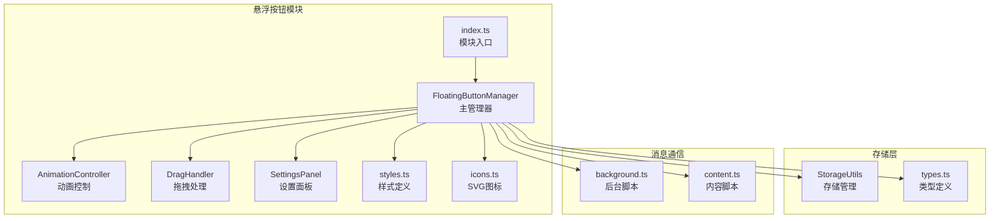

**图表来源**
- [index.ts](file://entrypoints/content/floatingButtons/index.ts#L1-L10)
- [FloatingButtonManager.ts](file://entrypoints/content/floatingButtons/FloatingButtonManager.ts#L1-L50)

**章节来源**
- [index.ts](file://entrypoints/content/floatingButtons/index.ts#L1-L10)
- [FloatingButtonManager.ts](file://entrypoints/content/floatingButtons/FloatingButtonManager.ts#L1-L50)

## 核心组件

悬浮按钮系统由四个核心组件构成，每个组件都有明确的职责分工：

### FloatingButtonManager - 主管理器
负责悬浮按钮的完整生命周期管理，包括初始化、渲染、事件绑定和配置管理。

### AnimationController - 动画控制
管理按钮的所有动画效果，包括展开/折叠、拖拽动画、显示/隐藏动画等。

### DragHandler - 拖拽处理
处理用户的拖拽交互，包括拖拽开始、移动、结束和吸附效果。**新增** 智能拖拽检测机制，防止拖拽结束后误触发点击。

### SettingsPanel - 设置面板
提供用户配置界面，允许调整按钮位置、透明度等设置，**新增** 自动展示侧边栏功能。

**更新** DragHandler组件新增了hasDragged标志位和200ms重置延迟机制，配合FloatingButtonManager的改进点击过滤逻辑，有效解决了拖拽操作的误触发问题。

**章节来源**
- [FloatingButtonManager.ts](file://entrypoints/content/floatingButtons/FloatingButtonManager.ts#L15-L493)
- [AnimationController.ts](file://entrypoints/content/floatingButtons/AnimationController.ts#L13-L185)
- [DragHandler.ts](file://entrypoints/content/floatingButtons/DragHandler.ts#L31-L380)
- [SettingsPanel.ts](file://entrypoints/content/floatingButtons/SettingsPanel.ts#L15-L259)

## 架构概览

系统采用分层架构设计，确保各组件间的低耦合和高内聚：

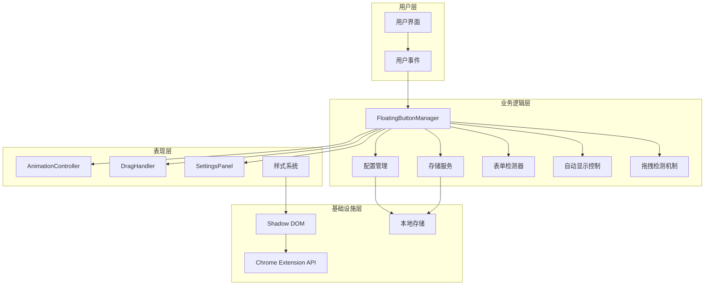

**图表来源**
- [FloatingButtonManager.ts](file://entrypoints/content/floatingButtons/FloatingButtonManager.ts#L36-L79)
- [content.ts](file://entrypoints/content.ts#L1-L800)

系统架构特点：
- **模块化设计**：每个组件职责单一，便于维护和测试
- **事件驱动**：通过消息传递和事件监听实现组件间通信
- **状态管理**：集中管理配置状态，支持实时更新
- **性能优化**：使用requestAnimationFrame和防抖机制
- **智能交互**：集成拖拽检测和悬停提示禁用功能，提升用户体验
- **智能交互**：集成自动侧边栏显示功能，提升用户体验

## 详细组件分析

### FloatingButtonManager - 核心管理器

FloatingButtonManager是整个悬浮按钮系统的核心，负责协调所有子组件的工作。

#### 类图设计

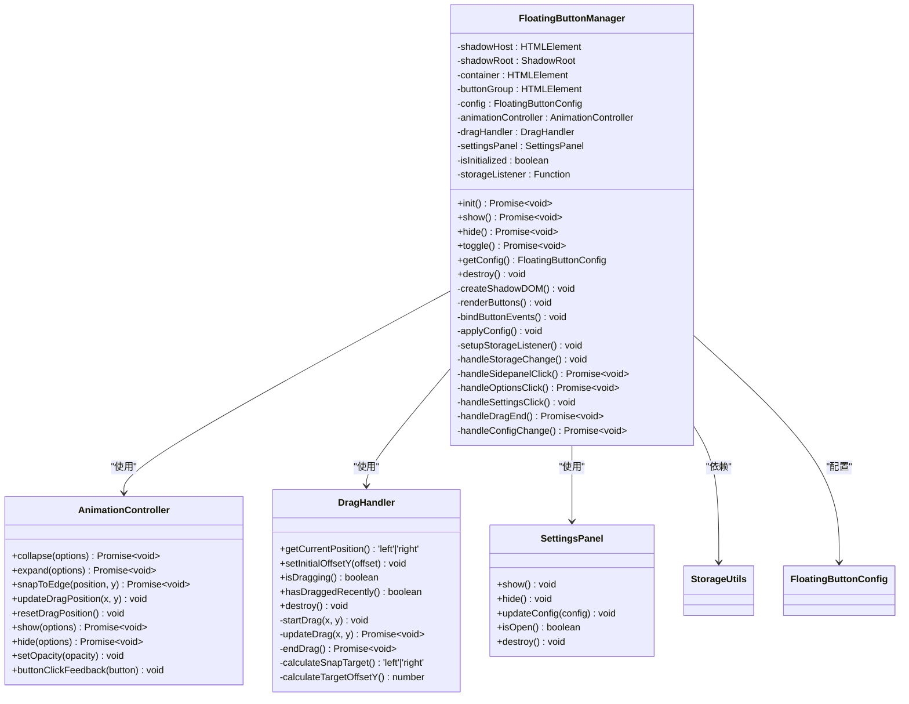

**图表来源**
- [FloatingButtonManager.ts](file://entrypoints/content/floatingButtons/FloatingButtonManager.ts#L15-L493)
- [AnimationController.ts](file://entrypoints/content/floatingButtons/AnimationController.ts#L13-L185)
- [DragHandler.ts](file://entrypoints/content/floatingButtons/DragHandler.ts#L31-L380)
- [SettingsPanel.ts](file://entrypoints/content/floatingButtons/SettingsPanel.ts#L15-L259)

#### 初始化流程

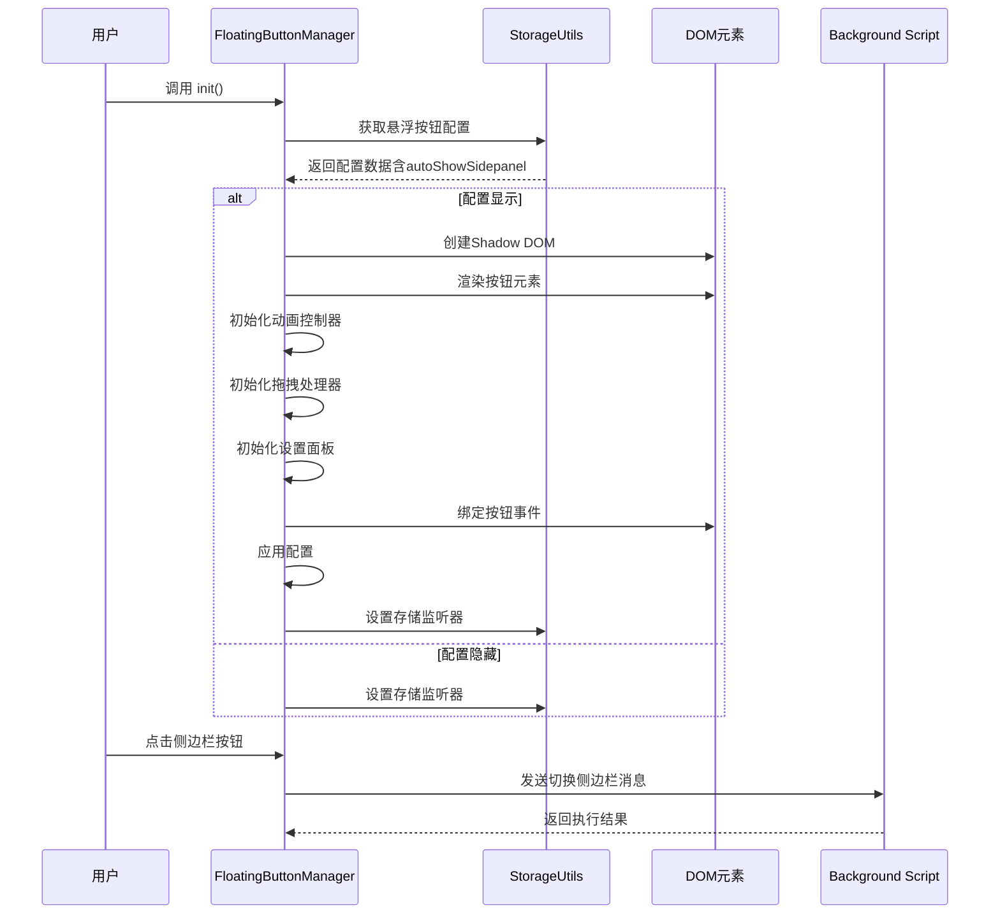

**图表来源**
- [FloatingButtonManager.ts](file://entrypoints/content/floatingButtons/FloatingButtonManager.ts#L36-L79)
- [background.ts](file://entrypoints/background.ts#L91-L186)

**章节来源**
- [FloatingButtonManager.ts](file://entrypoints/content/floatingButtons/FloatingButtonManager.ts#L15-L493)

### AnimationController - 动画控制系统

AnimationController专门负责处理所有动画效果，确保流畅的用户体验。

#### 动画状态机

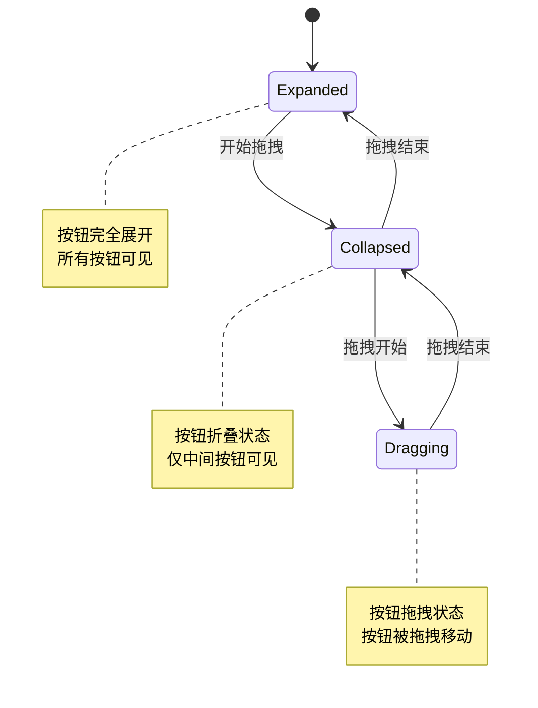

**图表来源**
- [AnimationController.ts](file://entrypoints/content/floatingButtons/AnimationController.ts#L5-L66)

#### 动画序列流程

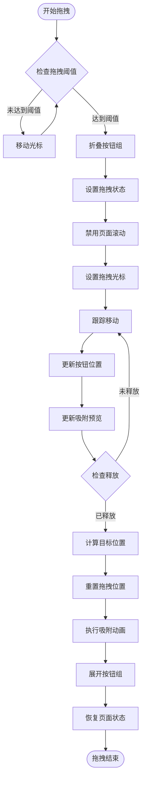

**图表来源**
- [DragHandler.ts](file://entrypoints/content/floatingButtons/DragHandler.ts#L205-L274)
- [AnimationController.ts](file://entrypoints/content/floatingButtons/AnimationController.ts#L105-L124)

**章节来源**
- [AnimationController.ts](file://entrypoints/content/floatingButtons/AnimationController.ts#L13-L185)
- [DragHandler.ts](file://entrypoints/content/floatingButtons/DragHandler.ts#L31-L380)

### DragHandler - 拖拽交互处理

DragHandler负责处理复杂的拖拽交互逻辑，包括多点触控支持和精确的位置计算。**新增** 智能拖拽检测机制，防止拖拽结束后误触发点击事件。

#### 拖拽状态管理

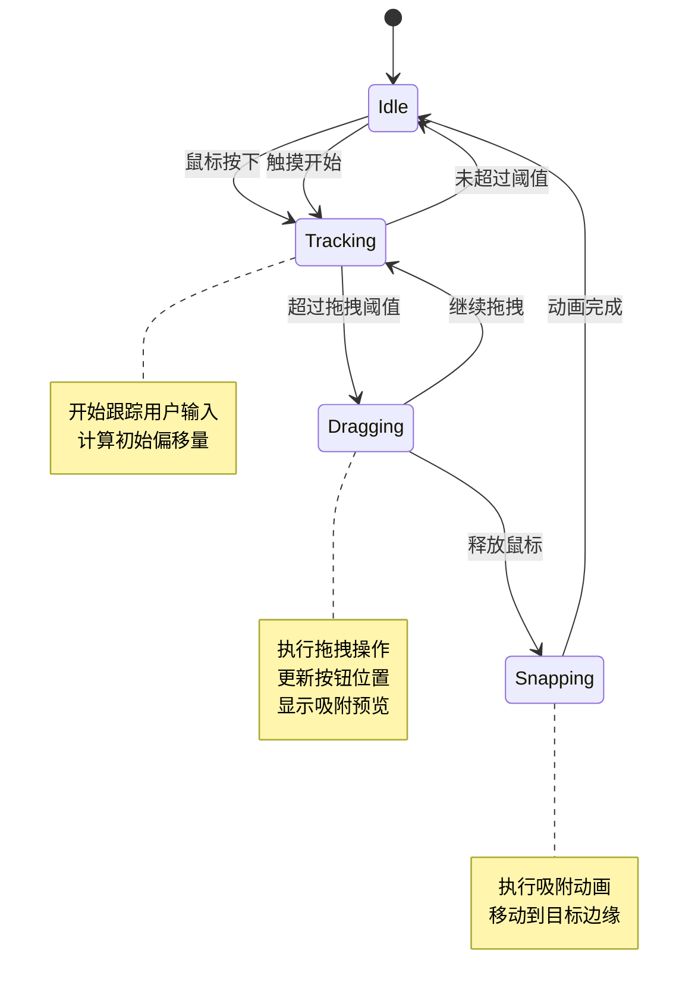

**图表来源**
- [DragHandler.ts](file://entrypoints/content/floatingButtons/DragHandler.ts#L184-L274)

#### 位置计算算法

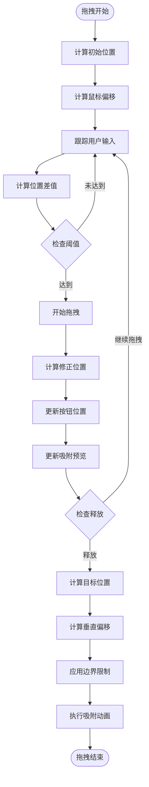

**更新** 新增了hasDragged标志位和200ms重置延迟机制，确保拖拽结束后不会立即触发点击事件。改进了点击过滤逻辑，通过`hasDraggedRecently()`方法检查最近是否有拖拽操作。

**图表来源**
- [DragHandler.ts](file://entrypoints/content/floatingButtons/DragHandler.ts#L205-L301)

**章节来源**
- [DragHandler.ts](file://entrypoints/content/floatingButtons/DragHandler.ts#L31-L380)

### SettingsPanel - 设置面板

SettingsPanel提供用户友好的配置界面，支持实时预览和即时保存。

#### 设置面板交互流程

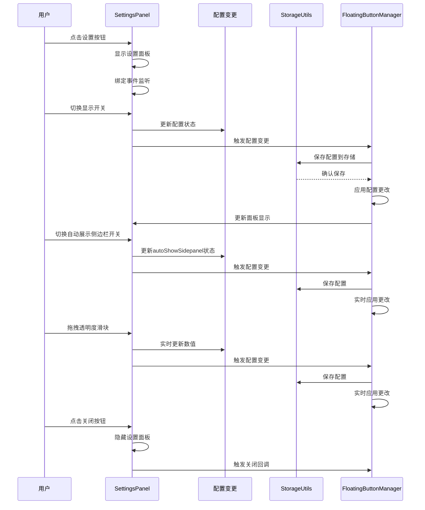

**更新** 设置面板已简化，移除了快捷方式链接功能，专注于显示开关、自动展示侧边栏开关和透明度调节。新增了autoShowSidepanel配置项的实时更新和保存。

**图表来源**
- [SettingsPanel.ts](file://entrypoints/content/floatingButtons/SettingsPanel.ts#L196-L215)
- [FloatingButtonManager.ts](file://entrypoints/content/floatingButtons/FloatingButtonManager.ts#L309-L324)

**章节来源**
- [SettingsPanel.ts](file://entrypoints/content/floatingButtons/SettingsPanel.ts#L15-L259)

### 智能拖拽检测机制

**新增功能** 系统集成了智能的拖拽检测机制，通过hasDragged标志位和200ms重置延迟，有效防止拖拽结束后误触发点击事件。

#### 拖拽检测状态机

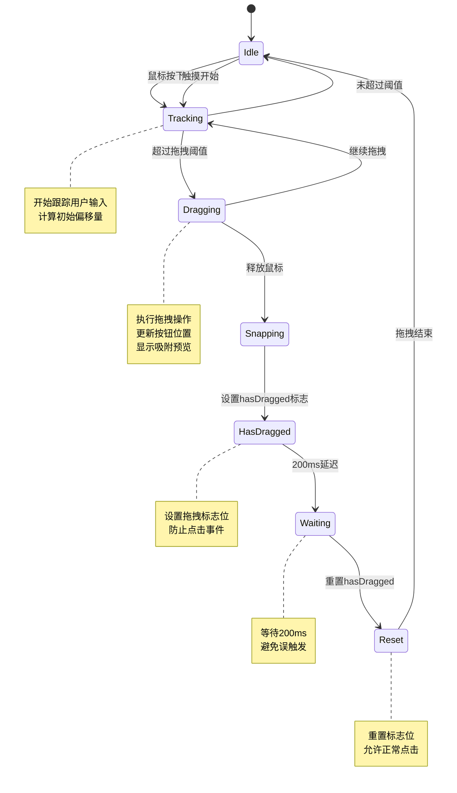

**图表来源**
- [DragHandler.ts](file://entrypoints/content/floatingButtons/DragHandler.ts#L255-L302)
- [FloatingButtonManager.ts](file://entrypoints/content/floatingButtons/FloatingButtonManager.ts#L254-L258)

#### 拖拽检测流程

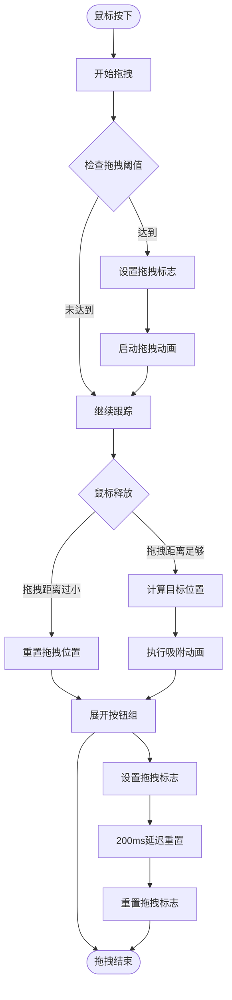

**更新** 新增了完整的拖拽检测机制，包括hasDragged标志位、200ms延迟重置和改进的点击过滤逻辑。

**图表来源**
- [DragHandler.ts](file://entrypoints/content/floatingButtons/DragHandler.ts#L255-L302)
- [FloatingButtonManager.ts](file://entrypoints/content/floatingButtons/FloatingButtonManager.ts#L254-L258)

**章节来源**
- [DragHandler.ts](file://entrypoints/content/floatingButtons/DragHandler.ts#L42-L302)
- [FloatingButtonManager.ts](file://entrypoints/content/floatingButtons/FloatingButtonManager.ts#L206-L282)

### 悬停提示禁用功能

**新增功能** 系统集成了悬停提示禁用功能，在按钮折叠和拖拽状态下自动隐藏悬停提示，优化用户体验。

#### 悬停提示状态机

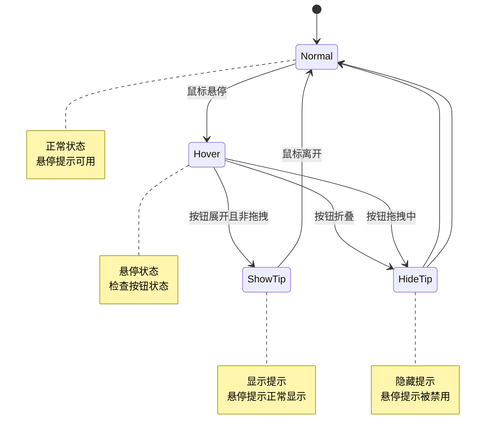

**图表来源**
- [styles.ts](file://entrypoints/content/floatingButtons/styles.ts#L452-L457)

#### CSS样式规则

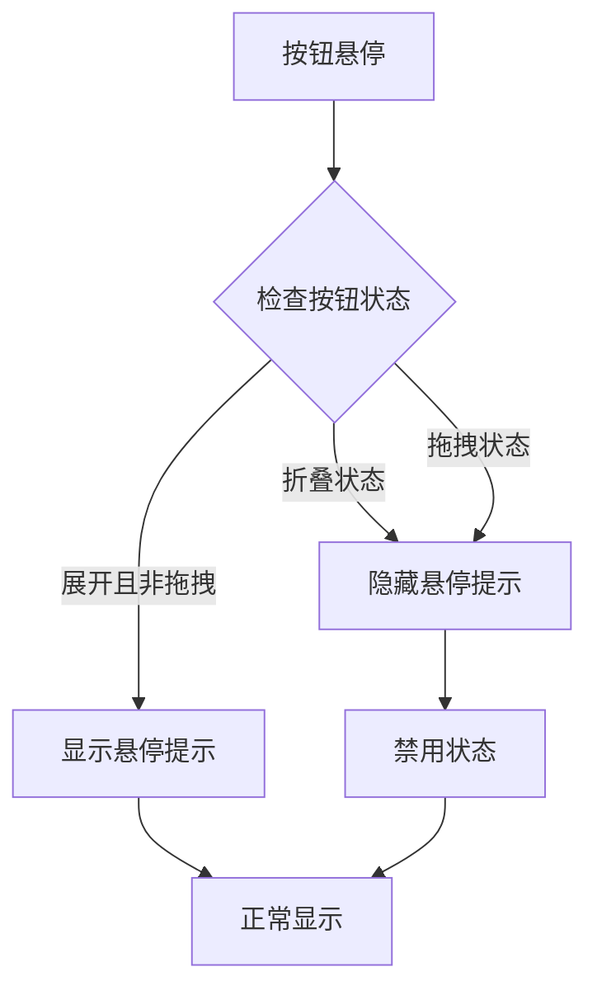

**更新** 新增了针对折叠和拖拽状态的悬停提示禁用样式规则，通过CSS选择器`.button-group[data-state="collapsed"] .btn[title]::before`和`.button-group[data-state="dragging"] .btn[title]::before`实现。

**图表来源**
- [styles.ts](file://entrypoints/content/floatingButtons/styles.ts#L452-L457)

**章节来源**
- [styles.ts](file://entrypoints/content/floatingButtons/styles.ts#L420-L457)

### 自动侧边栏显示功能

**新增功能** 系统集成了智能的自动侧边栏显示功能，通过表单检测器自动识别登录场景并展示侧边栏。

#### 自动显示状态机

```mermaid
stateDiagram-v2
[*] --> Idle
Idle --> Detecting : 输入框获得焦点
Detecting --> LoginForm{检测登录表单}
LoginForm --> |是| CheckAutoShow{检查autoShowSidepanel}
LoginForm --> |否| Idle
CheckAutoShow --> |开启| ShowPanel : 显示侧边栏
CheckAutoShow --> |关闭| Idle
ShowPanel --> PanelVisible : 侧边栏显示
PanelVisible --> Idle : 用户交互或手动关闭
```

**图表来源**
- [content.ts](file://entrypoints/content.ts#L658-L680)

#### 自动显示流程

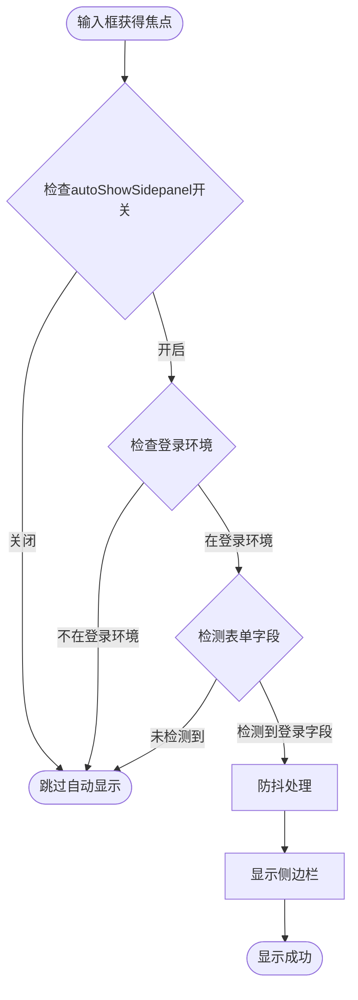

**更新** 新增了完整的自动侧边栏显示功能，包括智能表单检测、防抖优化和用户交互处理。

**图表来源**
- [content.ts](file://entrypoints/content.ts#L658-L680)

**章节来源**
- [content.ts](file://entrypoints/content.ts#L658-L680)

## 依赖关系分析

悬浮按钮系统具有清晰的依赖层次结构，确保模块间的松耦合：

```mermaid
graph TB
subgraph "外部依赖"
ChromeAPI[Chrome Extension API]
CryptoJS[crypto-js]
WXT[WXT框架]
end
subgraph "内部模块"
FloatingManager[FloatingButtonManager]
AnimationCtrl[AnimationController]
DragHandler[DragHandler]
SettingsPanel[SettingsPanel]
StorageUtils[StorageUtils]
Types[类型定义]
Icons[SVG图标]
Styles[样式定义]
FormDetector[表单检测器]
end
subgraph "UI组件"
ShadowDOM[Shadow DOM]
ButtonGroup[按钮组]
SettingsOverlay[设置遮罩]
end
FloatingManager --> AnimationCtrl
FloatingManager --> DragHandler
FloatingManager --> SettingsPanel
FloatingManager --> StorageUtils
FloatingManager --> Types
FloatingManager --> Icons
FloatingManager --> Styles
FloatingManager --> ShadowDOM
AnimationCtrl --> ShadowDOM
DragHandler --> ShadowDOM
SettingsPanel --> ShadowDOM
StorageUtils --> ChromeAPI
StorageUtils --> CryptoJS
ShadowDOM --> ButtonGroup
ShadowDOM --> SettingsOverlay
FormDetector --> StorageUtils
FormDetector --> Types
```

**图表来源**
- [FloatingButtonManager.ts](file://entrypoints/content/floatingButtons/FloatingButtonManager.ts#L6-L13)
- [storage.ts](file://utils/storage.ts#L1-L10)

**章节来源**
- [FloatingButtonManager.ts](file://entrypoints/content/floatingButtons/FloatingButtonManager.ts#L6-L13)
- [storage.ts](file://utils/storage.ts#L1-L10)

## 性能考虑

悬浮按钮系统在设计时充分考虑了性能优化：

### 渲染性能优化
- 使用Shadow DOM隔离样式，避免全局样式污染
- 采用requestAnimationFrame优化动画性能
- 实现防抖机制减少事件处理频率
- 使用CSS transforms而非改变布局属性

### 内存管理
- 组件销毁时清理所有事件监听器
- 及时移除DOM元素防止内存泄漏
- 使用WeakMap和WeakSet避免循环引用
- 单例模式管理共享实例

### 交互性能
- 拖拽操作使用transform属性实现硬件加速
- 吸附预览使用CSS过渡动画
- 按钮点击反馈使用CSS动画
- 配置变更采用异步保存机制
- **新增** 智能拖拽检测机制，使用200ms延迟避免频繁触发
- **新增** 悬停提示禁用功能，减少不必要的DOM操作
- **新增** 自动侧边栏显示使用防抖优化，避免频繁触发

**更新** 新增了拖拽检测机制的性能优化，包括200ms延迟重置和改进的点击过滤逻辑，有效减少了误触发事件的处理开销。

## 故障排除指南

### 常见问题及解决方案

#### 悬浮按钮不显示
1. **检查配置状态**：确认配置中的visible字段为true
2. **验证初始化**：检查isInitialized标志是否正确设置
3. **检查存储监听**：确认chrome.storage.onChanged监听器正常工作

#### 拖拽功能异常
1. **事件监听检查**：验证mousedown和touchstart事件是否正确绑定
2. **阈值设置**：确认dragThreshold参数设置为10px
3. **边界检查**：验证位置计算和边界限制逻辑
4. **鼠标偏移计算**：检查鼠标偏移量计算是否正确
5. **拖拽标志位**：检查hasDragged标志位是否正确设置和重置

#### 动画效果卡顿
1. **检查requestAnimationFrame**：确认动画帧调度正常
2. **CSS优化**：验证transform属性使用正确
3. **性能监控**：使用浏览器开发者工具分析性能瓶颈

#### 设置面板无法打开
1. **遮罩层检查**：确认settings-overlay元素正确创建
2. **事件绑定**：验证点击事件监听器是否正常
3. **可见性状态**：检查visible类名切换逻辑

#### **新增** 拖拽结束后误触发点击
1. **检查hasDragged标志**：确认拖拽开始时hasDragged设置为true
2. **验证200ms延迟**：检查setTimeout是否正确执行
3. **检查点击过滤逻辑**：确认handleOptionsClick和bindButtonEvents中的过滤条件
4. **验证hasDraggedRecently方法**：确认方法返回正确的状态

#### **新增** 悬停提示显示异常
1. **检查CSS选择器**：确认折叠和拖拽状态的选择器正确
2. **验证data-state属性**：检查按钮组的data-state属性是否正确更新
3. **检查样式优先级**：确认禁用规则的CSS优先级正确

#### **新增** 自动侧边栏显示问题
1. **检查autoShowSidepanel开关**：确认设置面板中的自动显示开关已启用
2. **表单检测验证**：验证表单检测器是否正确识别登录场景
3. **防抖机制**：检查debouncedShowSidePanel函数是否正常工作
4. **焦点事件监听**：确认focusin事件委托是否正确设置

**更新** 新增了拖拽检测机制、悬停提示禁用功能和自动侧边栏显示相关的故障排除指导。

**章节来源**
- [FloatingButtonManager.ts](file://entrypoints/content/floatingButtons/FloatingButtonManager.ts#L442-L468)
- [DragHandler.ts](file://entrypoints/content/floatingButtons/DragHandler.ts#L336-L343)
- [SettingsPanel.ts](file://entrypoints/content/floatingButtons/SettingsPanel.ts#L252-L257)

## 结论

悬浮按钮系统展现了现代Web应用开发的最佳实践，通过精心设计的架构和实现，为用户提供了流畅、直观的交互体验。系统的主要优势包括：

### 技术优势
- **模块化设计**：清晰的职责分离和依赖管理
- **性能优化**：多种优化策略确保流畅的用户体验
- **可维护性**：良好的代码结构和文档支持
- **扩展性**：灵活的架构支持功能扩展
- **智能交互**：集成拖拽检测、悬停提示禁用和自动侧边栏显示功能，提供更好的用户体验

### 用户体验
- **直观交互**：符合用户期望的拖拽和点击行为
- **视觉反馈**：丰富的动画效果增强交互感知
- **个性化配置**：支持位置、透明度、自动显示等自定义选项
- **响应式设计**：适配不同屏幕尺寸和设备
- **智能功能**：拖拽检测防止误触发，悬停提示禁用优化显示，自动侧边栏显示减少用户操作步骤

### 架构价值
该系统为类似的浏览器扩展开发提供了优秀的参考模板，展示了如何在受限的浏览器环境中实现复杂的功能。其设计理念和技术实现值得在其他项目中借鉴和学习。

**更新** 新版本的悬浮按钮系统在用户体验方面有了显著提升，通过新增的拖拽检测机制（hasDragged标志位和200ms重置延迟）、悬停提示禁用功能和自动侧边栏显示功能（autoShowSidepanel），默认启用，为用户提供了更加智能化和便捷的密码管理体验。设置面板的简化也使得核心功能更加突出，整体系统更加专注于提供优质的用户体验。

通过持续的优化和改进，悬浮按钮系统将继续为用户提供卓越的密码管理体验，成为Chrome扩展生态中的优秀实践案例。