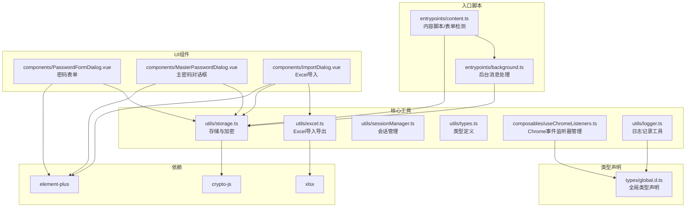
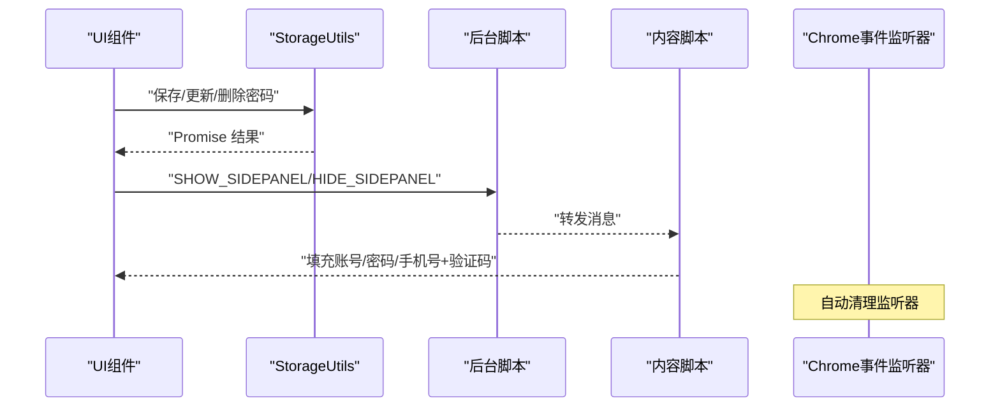
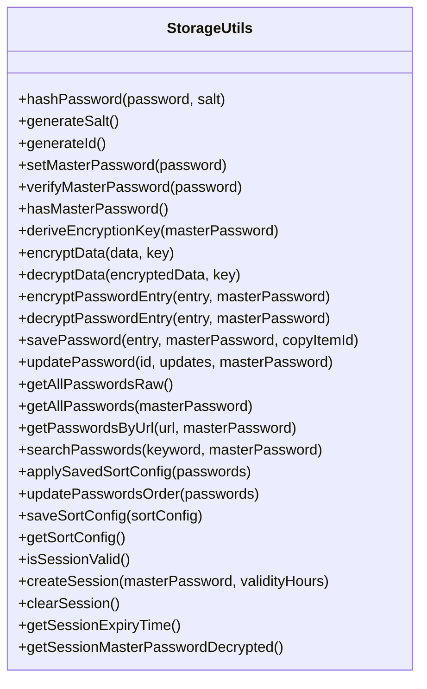
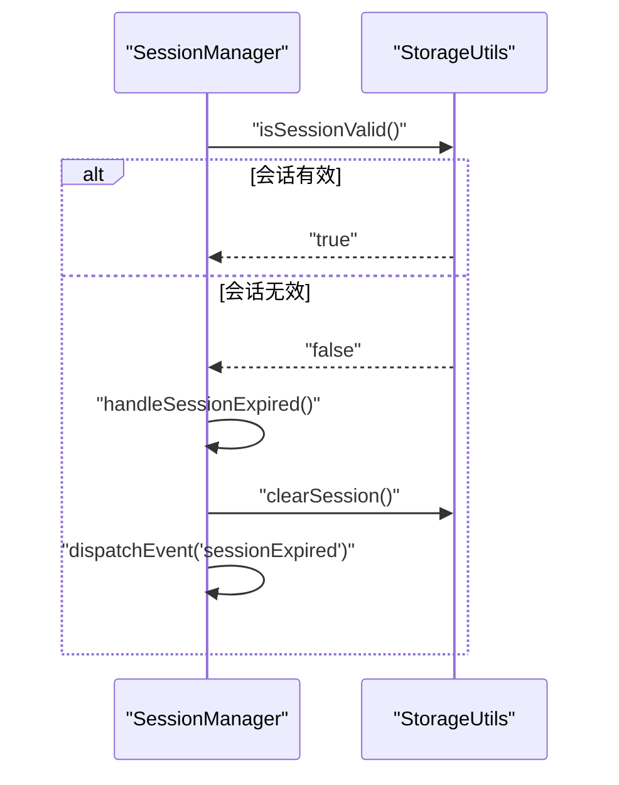
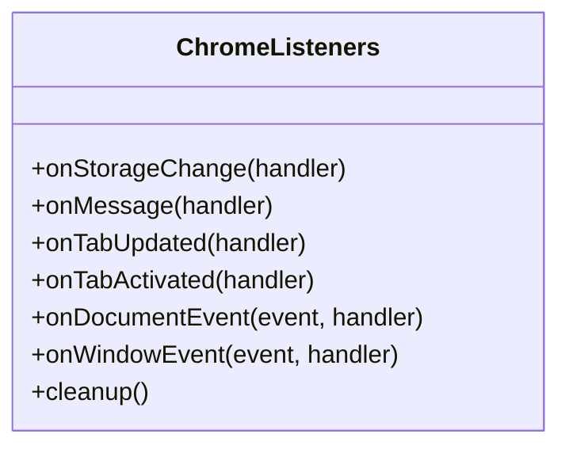
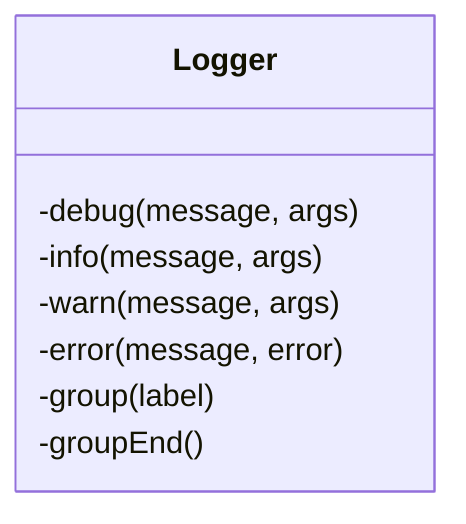
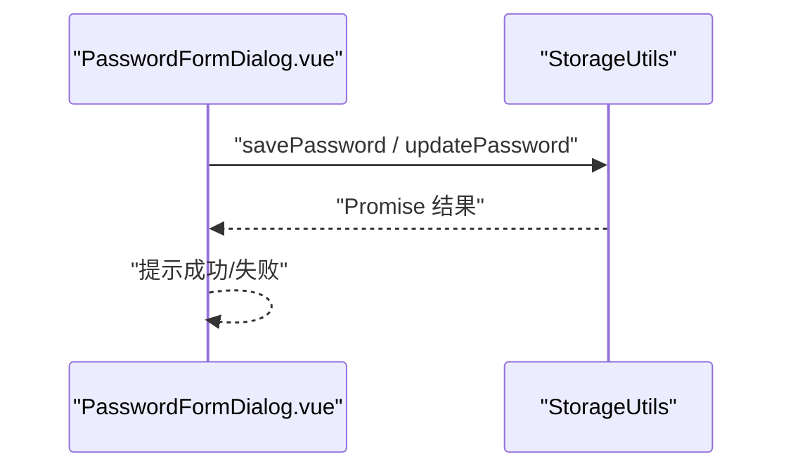
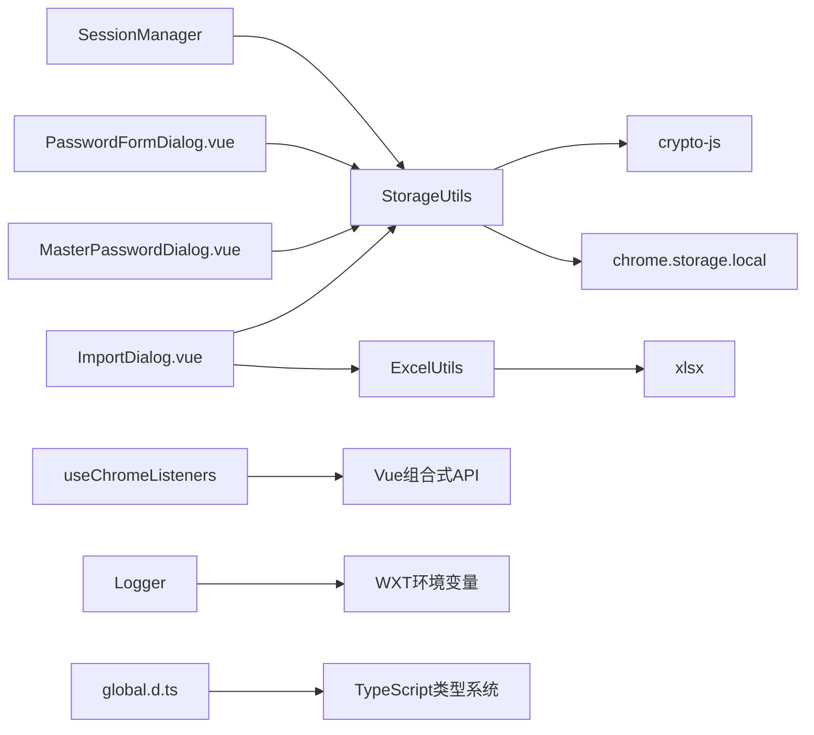

# 核心模块

<cite>
**本文引用的文件**
- [utils/storage.ts](file://utils/storage.ts)
- [utils/excel.ts](file://utils/excel.ts)
- [utils/sessionManager.ts](file://utils/sessionManager.ts)
- [utils/types.ts](file://utils/types.ts)
- [composables/useChromeListeners.ts](file://composables/useChromeListeners.ts)
- [utils/logger.ts](file://utils/logger.ts)
- [entrypoints/background.ts](file://entrypoints/background.ts)
- [entrypoints/content.ts](file://entrypoints/content.ts)
- [components/PasswordFormDialog.vue](file://components/PasswordFormDialog.vue)
- [components/MasterPasswordDialog.vue](file://components/MasterPasswordDialog.vue)
- [components/ImportDialog.vue](file://components/ImportDialog.vue)
- [types/global.d.ts](file://types/global.d.ts)
- [package.json](file://package.json)
</cite>

## 更新摘要
**所做更改**
- 新增 Chrome 事件监听器组合式工具模块，提供统一的监听器管理机制
- 新增日志记录工具模块，支持开发环境与生产环境的日志级别控制
- 扩展类型定义，新增手机号+验证码填充消息类型、悬浮按钮配置接口、密码缓存接口等
- 更新全局类型声明，补充 Chrome 129+ sidePanel.close API 类型支持

## 目录
1. [简介](#简介)
2. [项目结构](#项目结构)
3. [核心组件](#核心组件)
4. [架构总览](#架构总览)
5. [详细组件分析](#详细组件分析)
6. [依赖分析](#依赖分析)
7. [性能考量](#性能考量)
8. [故障排查指南](#故障排查指南)
9. [结论](#结论)
10. [附录](#附录)

## 简介
本文件面向 Account Password Helper 的核心模块，系统梳理并解释以下关键子系统的设计与实现：
- 存储管理系统：负责主密码配置、密码条目的加密/解密、持久化与检索、排序与搜索、会话有效期管理等。
- Excel 数据处理：负责密码数据的导入与导出，支持多语言列名映射与模板下载。
- 会话管理：负责主密码会话的建立、校验、过期处理与清理。
- 类型定义：统一的数据模型与消息类型定义，确保模块间契约清晰。
- **新增** Chrome 事件监听器组合式工具：提供统一的 Chrome API 事件监听管理，自动清理监听器防止内存泄漏。
- **新增** 日志记录工具：根据环境自动控制日志输出，支持调试、信息、警告、错误等多级别日志。

文档将从职责边界、接口设计、内部协作机制、数据模型、加密策略、文件处理流程、安全验证机制等方面展开，并提供调用链与依赖关系图示，帮助开发者进行扩展与定制。

## 项目结构
项目采用基于功能域的组织方式，核心逻辑集中在 utils 目录，UI 组件位于 components 目录，入口脚本位于 entrypoints 目录，类型定义位于 utils/types.ts 与 types/global.d.ts。**新增** composables 目录用于存放组合式工具函数，**新增** utils/logger.ts 提供统一的日志管理。

**图表来源**
- [utils/storage.ts:37-981](file://utils/storage.ts#L37-L981)
- [utils/excel.ts:4-155](file://utils/excel.ts#L4-L155)
- [utils/sessionManager.ts:6-87](file://utils/sessionManager.ts#L6-L87)
- [utils/types.ts:4-234](file://utils/types.ts#L4-L234)
- [composables/useChromeListeners.ts:1-112](file://composables/useChromeListeners.ts#L1-L112)
- [utils/logger.ts:1-68](file://utils/logger.ts#L1-L68)
- [entrypoints/background.ts:4-403](file://entrypoints/background.ts#L4-L403)
- [entrypoints/content.ts:1-2118](file://entrypoints/content.ts#L1-L2118)
- [components/PasswordFormDialog.vue:91-336](file://components/PasswordFormDialog.vue#L91-L336)
- [components/MasterPasswordDialog.vue:96-237](file://components/MasterPasswordDialog.vue#L96-L237)
- [components/ImportDialog.vue:120-195](file://components/ImportDialog.vue#L120-L195)
- [types/global.d.ts:1-56](file://types/global.d.ts#L1-L56)
- [package.json:22-26](file://package.json#L22-L26)

**章节来源**
- [package.json:1-49](file://package.json#L1-L49)

## 核心组件
- 存储与加密模块（StorageUtils）
  - 主密码设置/验证/重置
  - PBKDF2 派生密钥、AES-256-CBC 加密/解密
  - 密码条目保存/更新/删除/批量删除
  - 原始数据与解密数据的双模式访问
  - URL/关键词搜索与排序配置持久化
  - 会话有效期与会话缓存（主密码加密存储、过期时间、临时会话密钥）
- Excel 工具模块（ExcelUtils）
  - 导出：用户名、密码、URL、标签、备注、创建/更新时间
  - 导入：多语言列名映射、数据清洗、错误处理
  - 模板下载：标准列头与示例行
- 会话管理器（SessionManager）
  - 单例模式、定时检查、会话过期事件、清理
- 类型定义（types）
  - PasswordEntry、MasterPasswordConfig、Message、MessageType
  - **新增** FloatingButtonConfig、PasswordCache、FillMobileCodeData 等接口
  - **扩展** MessageType 枚举，新增手机号+验证码填充消息类型
- **新增** Chrome 事件监听器组合式工具（useChromeListeners）
  - 统一管理 Chrome API 事件监听器，自动清理防止内存泄漏
  - 支持 Storage 变化、Runtime 消息、标签页更新/激活、DOM/window 事件监听
- **新增** 日志记录工具（Logger）
  - 根据环境自动控制日志输出，开发环境启用调试日志，生产环境禁用
  - 支持 debug、info、warn、error、group/groupEnd 等日志级别

**章节来源**
- [utils/storage.ts:37-981](file://utils/storage.ts#L37-L981)
- [utils/excel.ts:4-155](file://utils/excel.ts#L4-L155)
- [utils/sessionManager.ts:6-87](file://utils/sessionManager.ts#L6-L87)
- [utils/types.ts:4-234](file://utils/types.ts#L4-L234)
- [composables/useChromeListeners.ts:1-112](file://composables/useChromeListeners.ts#L1-L112)
- [utils/logger.ts:1-68](file://utils/logger.ts#L1-L68)

## 架构总览
整体架构围绕"内容脚本 + 后台脚本 + UI 组件 + 工具模块"的分层设计：
- 内容脚本负责页面表单检测与消息转发
- 后台脚本负责侧边栏控制与跨页面消息桥接
- UI 组件通过工具模块与浏览器存储交互
- 工具模块封装加密、存储、Excel 处理、会话管理与事件监听
- **新增** 组合式工具提供统一的事件监听管理，**新增** 日志工具提供统一的日志输出控制

**图表来源**
- [entrypoints/background.ts:34-73](file://entrypoints/background.ts#L34-L73)
- [entrypoints/content.ts:998-1028](file://entrypoints/content.ts#L998-L1028)
- [components/PasswordFormDialog.vue:159-336](file://components/PasswordFormDialog.vue#L159-L336)
- [components/ImportDialog.vue:175-195](file://components/ImportDialog.vue#L175-L195)
- [composables/useChromeListeners.ts:97-100](file://composables/useChromeListeners.ts#L97-L100)

## 详细组件分析

### 存储与加密模块（StorageUtils）
职责边界
- 主密码生命周期管理：设置、验证、重置、有效性配置
- 密码条目生命周期管理：保存、更新、删除、批量删除
- 数据访问模式：原始数据读取（不解密）、解密读取（需主密码）
- 搜索与排序：URL 匹配、关键词检索、排序配置持久化
- 会话管理：会话创建、校验、过期处理、清理

接口设计
- setMasterPassword(password)
- verifyMasterPassword(password)
- hasMasterPassword()
- resetMasterPassword()
- deriveEncryptionKey(masterPassword)
- encryptData(data, key)
- decryptData(encryptedData, key)
- encryptPasswordEntry(entry, masterPassword)
- decryptPasswordEntry(entry, masterPassword)
- savePassword(entry, masterPassword?, copyItemId?)
- updatePassword(id, updates, masterPassword?)
- getAllPasswordsRaw()
- getAllPasswords(masterPassword?)
- getPasswordsByUrl(url, masterPassword?)
- searchPasswords(keyword, masterPassword?)
- applySavedSortConfig(passwords)
- updatePasswordsOrder(passwords)
- saveSortConfig(sortConfig)
- getSortConfig()
- isSessionValid()
- createSession(masterPassword, validityHours)
- clearSession()
- getSessionExpiryTime()
- getSessionMasterPasswordDecrypted()

内部协作机制
- 与 chrome.storage.local 交互进行持久化
- 与 CryptoJS 进行哈希、PBKDF2、AES 加解密
- 与会话管理器配合维护会话状态
- 与 Excel 工具模块配合导入/导出

数据模型与复杂度
- 密码条目模型：包含 id、username、password、url、tag、remark、createTime、updateTime、order
- 搜索与排序：线性扫描 + 排序，时间复杂度 O(n log n)，n 为条目数量
- 加密/解密：O(1) 每字段，整体 O(n) 遍历

加密存储策略
- 主密码：MD5 + 盐值存储，盐值与哈希分离
- 条目加密：PBKDF2 从主密码+盐值派生密钥，AES-256-CBC 加密，IV 与密文拼接 Base64
- 会话加密：会话主密码加密存储，过期时间与有效期小时数持久化

文件处理流程
- 导出：映射字段 → 创建工作簿 → 写入列宽 → 写出文件
- 导入：FileReader 读取二进制 → XLSX 解析 → JSON 映射 → 清洗与过滤 → 返回条目数组

安全验证机制
- setMasterPassword：保存后立即验证；失败抛错
- verifyMasterPassword：输入一致性处理；盐值参与哈希
- decryptData：健壮的错误分支与降级（返回原始数据或空串）
- 会话过期：定时检查，过期自动清理并触发事件

**图表来源**
- [utils/storage.ts:37-981](file://utils/storage.ts#L37-L981)

**章节来源**
- [utils/storage.ts:37-981](file://utils/storage.ts#L37-L981)

### Excel 数据处理模块（ExcelUtils）
职责边界
- 导出：将密码条目映射为中文列头，写入工作簿并写出文件
- 导入：读取 Excel 文件，支持多语言列名映射，清洗与过滤无效数据
- 模板：提供标准列头与示例行，便于用户快速填写

接口设计
- exportToExcel(passwords, filename)
- importFromExcel(file)
- downloadTemplate()

数据流
- 导出：映射 → book/new → json_to_sheet → book_append_sheet → writeFile
- 导入：FileReader → XLSX.read → sheet_to_json → 多语言列名映射 → 清洗过滤

**图表来源**
- [utils/excel.ts:50-114](file://utils/excel.ts#L50-L114)

**章节来源**
- [utils/excel.ts:4-155](file://utils/excel.ts#L4-L155)

### 会话管理器（SessionManager）
职责边界
- 单例管理会话生命周期
- 定时检查会话有效性
- 会话过期时触发事件并清理

接口设计
- startSessionCheck()
- stopSessionCheck()
- init()
- getInstance()

**图表来源**
- [utils/sessionManager.ts:27-66](file://utils/sessionManager.ts#L27-L66)
- [utils/storage.ts:793-841](file://utils/storage.ts#L793-L841)

**章节来源**
- [utils/sessionManager.ts:6-87](file://utils/sessionManager.ts#L6-L87)
- [utils/storage.ts:793-916](file://utils/storage.ts#L793-L916)

### 类型定义（types）
职责边界
- 统一数据模型与消息类型，确保模块间契约清晰

关键类型
- PasswordEntry：密码条目字段集合
- MasterPasswordConfig：主密码哈希与盐值
- MessageType：消息类型枚举（心跳、表单检测、填充、侧边栏控制、URL 变化、获取密码列表）
- Message：消息接口
- **新增** FloatingButtonConfig：悬浮按钮配置接口，包含显示状态、位置、偏移量、透明度等配置
- **新增** PasswordCache：密码缓存接口，包含缓存数据、域名、时间戳、认证状态
- **新增** FillMobileCodeData：手机号验证码填充数据接口
- **扩展** MessageType：新增 FILL_MOBILE_CODE 消息类型，支持手机号+验证码填充

**章节来源**
- [utils/types.ts:4-234](file://utils/types.ts#L4-L234)

### Chrome 事件监听器组合式工具（useChromeListeners）
职责边界
- 统一管理 Chrome API 事件监听器，自动清理防止内存泄漏
- 提供多种事件类型的监听器注册方法
- 在组件卸载时自动清理所有监听器

接口设计
- onStorageChange(handler)：监听 Chrome Storage 变化
- onMessage(handler)：监听 Chrome Runtime 消息
- onTabUpdated(handler)：监听标签页更新
- onTabActivated(handler)：监听标签页激活
- onDocumentEvent(event, handler)：监听 DOM 事件
- onWindowEvent(event, handler)：监听 Window 事件
- cleanup()：手动清理所有监听器

内部协作机制
- 使用 Vue 的 onUnmounted 生命周期钩子自动清理
- 维护监听器清理函数数组，支持批量清理
- 与 Vue 组合式 API 集成，提供响应式事件管理

**图表来源**
- [composables/useChromeListeners.ts:20-111](file://composables/useChromeListeners.ts#L20-L111)

**章节来源**
- [composables/useChromeListeners.ts:1-112](file://composables/useChromeListeners.ts#L1-L112)

### 日志记录工具（Logger）
职责边界
- 根据环境自动控制日志输出，开发环境启用调试日志，生产环境禁用
- 提供多级别的日志输出方法，支持分组日志
- 作为统一的日志入口，便于集中管理和调试

接口设计
- debug(message, ...args)：调试日志，仅开发环境输出
- info(message, ...args)：信息日志，仅开发环境输出
- warn(message, ...args)：警告日志，始终输出
- error(message, error?)：错误日志，始终输出
- group(label)：分组日志，仅开发环境输出
- groupEnd()：结束分组日志

内部协作机制
- 通过 WXT 框架的 import.meta.env.DEV 检测开发环境
- 使用单例模式提供全局日志实例
- 与 TypeScript 类型系统集成，提供完整的类型支持

**图表来源**
- [utils/logger.ts:5-67](file://utils/logger.ts#L5-L67)

**章节来源**
- [utils/logger.ts:1-68](file://utils/logger.ts#L1-L68)

### 全局类型声明（global.d.ts）
职责边界
- 解决 CSS 文件导入的 TypeScript 类型问题
- 提供 Vue 单文件组件和样式文件的类型声明
- **新增** Chrome 129+ sidePanel.close API 类型补充

关键类型
- Vue 单文件组件声明：支持 *.vue 文件导入
- CSS 模块声明：支持 *.css、*.scss、*.less 文件导入
- Element Plus 样式文件声明：解决样式导入类型问题
- **新增** Chrome sidePanel.close API 类型：支持可选的 tabId 和 windowId 参数

**章节来源**
- [types/global.d.ts:1-56](file://types/global.d.ts#L1-L56)

### UI 组件与调用链
- 密码表单对话框（PasswordFormDialog.vue）
  - 触发 StorageUtils.savePassword 或 updatePassword
  - 成功后提示并关闭弹窗
- 主密码对话框（MasterPasswordDialog.vue）
  - 首次使用设置主密码，后续验证主密码
  - 调用 StorageUtils.setMasterPassword 或 verifyMasterPassword
- Excel 导入对话框（ImportDialog.vue）
  - 调用 ExcelUtils.importFromExcel 解析文件
  - 逐条调用 StorageUtils.savePassword 保存

**图表来源**
- [components/PasswordFormDialog.vue:159-336](file://components/PasswordFormDialog.vue#L159-L336)
- [utils/storage.ts:377-461](file://utils/storage.ts#L377-L461)

**章节来源**
- [components/PasswordFormDialog.vue:91-336](file://components/PasswordFormDialog.vue#L91-L336)
- [components/MasterPasswordDialog.vue:177-237](file://components/MasterPasswordDialog.vue#L177-L237)
- [components/ImportDialog.vue:147-195](file://components/ImportDialog.vue#L147-L195)

## 依赖分析
- 外部依赖
  - crypto-js：MD5、PBKDF2、AES 加解密
  - xlsx：Excel 读写
  - element-plus：UI 组件库
- 内部耦合
  - StorageUtils 与 CryptoJS、chrome.storage.local 紧密耦合
  - ExcelUtils 与 xlsx 紧密耦合
  - SessionManager 依赖 StorageUtils 的会话接口
  - UI 组件通过 StorageUtils/ExcelUtils 与存储/文件交互
  - **新增** useChromeListeners 与 Vue 组合式 API 紧密耦合
  - **新增** Logger 与 WXT 框架环境变量集成

**图表来源**
- [utils/storage.ts:1-2](file://utils/storage.ts#L1-L2)
- [utils/excel.ts:1-2](file://utils/excel.ts#L1-L2)
- [utils/sessionManager.ts](file://utils/sessionManager.ts#L1)
- [components/PasswordFormDialog.vue](file://components/PasswordFormDialog.vue#L91)
- [components/MasterPasswordDialog.vue](file://components/MasterPasswordDialog.vue#L96)
- [components/ImportDialog.vue:120-121](file://components/ImportDialog.vue#L120-L121)
- [composables/useChromeListeners.ts](file://composables/useChromeListeners.ts#L1)
- [utils/logger.ts:8-12](file://utils/logger.ts#L8-L12)
- [types/global.d.ts:1-56](file://types/global.d.ts#L1-L56)

**章节来源**
- [package.json:22-26](file://package.json#L22-L26)

## 性能考量
- 加密性能
  - PBKDF2 迭代次数较高，建议在主线程避免频繁派生密钥；可结合会话缓存降低重复派生成本
  - AES 加解密按条目进行，建议批量操作时合并调用以减少存储写入次数
- 存储访问
  - 批量删除/保存使用一次 set 操作，避免多次往返
  - 搜索与排序为内存操作，建议限制条目规模或增加分页
- UI 交互
  - 表单检测使用 MutationObserver 与事件委托，避免为每个字段单独绑定监听器
  - 防抖与可见性监听减少不必要的侧边栏切换
- **新增** 事件监听器管理
  - 使用组合式工具统一管理监听器，避免内存泄漏
  - 组件卸载时自动清理，提升应用稳定性
- **新增** 日志性能
  - 开发环境启用详细日志，生产环境禁用调试日志，减少不必要的日志输出开销

## 故障排查指南
- 主密码设置失败
  - 检查 setMasterPassword 的返回与验证逻辑，确认保存后立即验证
  - 若验证失败，检查盐值与哈希一致性
- 解密异常
  - decryptData 对畸形数据与空密钥有降级处理；若仍失败，检查密钥来源与条目是否加密
- 会话过期
  - 定时检查 isSessionValid，过期自动清理并触发 sessionExpired 事件
  - 如需延长会话，调整有效期小时数
- Excel 导入失败
  - 确认列名映射与数据清洗逻辑；检查文件格式与读取权限
- **新增** 事件监听器泄漏
  - 检查是否正确使用 useChromeListeners 组合式工具
  - 确认组件卸载时监听器被正确清理
- **新增** 日志输出异常
  - 检查 WXT 框架的 import.meta.env.DEV 环境变量设置
  - 确认日志级别与环境配置匹配

**章节来源**
- [utils/storage.ts:79-114](file://utils/storage.ts#L79-L114)
- [utils/storage.ts:219-297](file://utils/storage.ts#L219-L297)
- [utils/storage.ts:793-841](file://utils/storage.ts#L793-L841)
- [utils/excel.ts:50-114](file://utils/excel.ts#L50-L114)
- [composables/useChromeListeners.ts:86-95](file://composables/useChromeListeners.ts#L86-L95)
- [utils/logger.ts:8-12](file://utils/logger.ts#L8-L12)

## 结论
本项目通过清晰的模块划分与严格的接口约束，实现了从数据存储、加密、文件处理到会话管理的完整闭环。StorageUtils 提供了稳健的主密码与条目加密能力；ExcelUtils 支持灵活的数据导入导出；SessionManager 保障了会话安全与用户体验。**新增** 的 Chrome 事件监听器组合式工具提供了统一的事件管理机制，防止内存泄漏；**新增** 的日志记录工具支持环境化的日志输出控制。UI 组件通过统一的工具模块与浏览器 API 交互，形成高内聚、低耦合的架构。

## 附录
- 最佳实践
  - 优先使用会话缓存减少主密码派生与解密开销
  - 批量操作时合并存储写入，避免频繁 I/O
  - 导入数据前进行严格清洗与校验，保证数据质量
  - 对敏感操作（设置/验证主密码、解密）提供明确的错误反馈
  - **新增** 使用组合式工具管理 Chrome 事件监听器，避免内存泄漏
  - **新增** 使用统一的日志工具进行调试，开发环境启用详细日志
- 扩展与定制
  - 新增字段：在 PasswordEntry 中扩展字段并在 StorageUtils 的映射处同步处理
  - 新增排序维度：在 applySavedSortConfig 中扩展比较逻辑
  - 新增消息类型：在 MessageType 中扩展并在内容/后台脚本中处理
  - 新增 Excel 列：在 ExcelUtils.importFromExcel 中扩展列名映射
  - **新增** 新增事件类型：在 useChromeListeners 中扩展监听器类型
  - **新增** 新增日志级别：在 Logger 中扩展日志输出方法