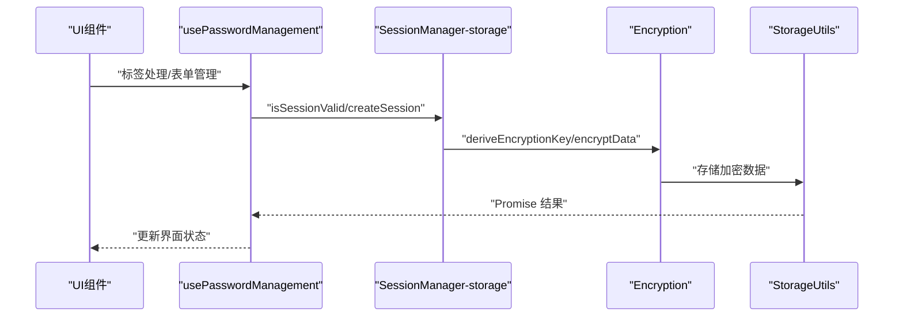
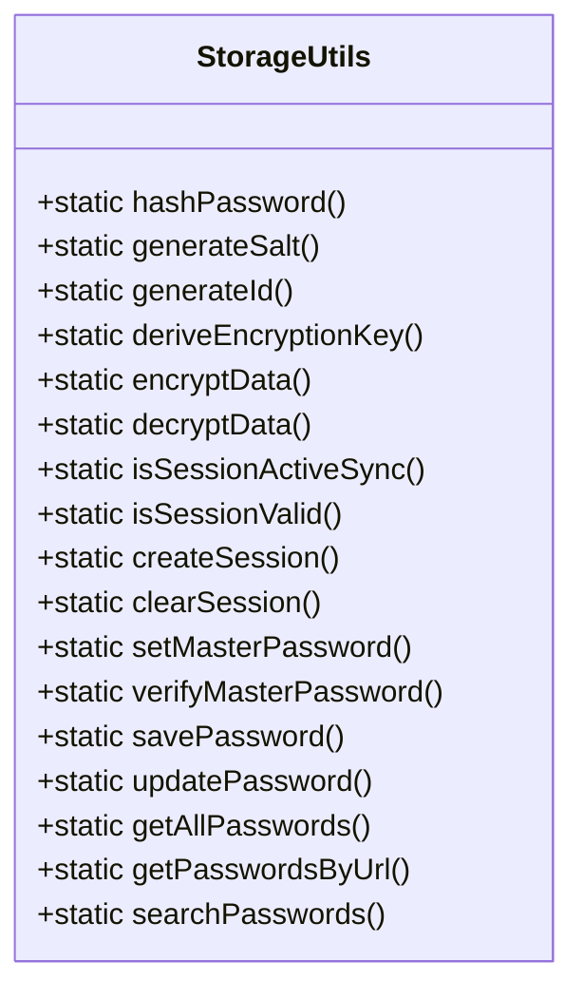
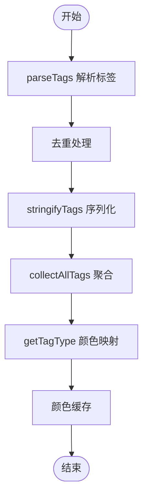
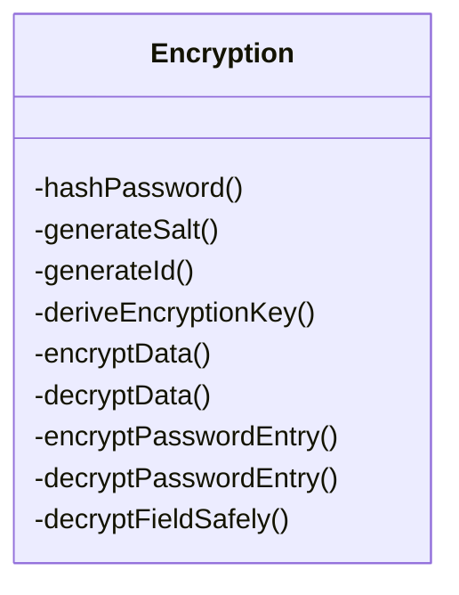
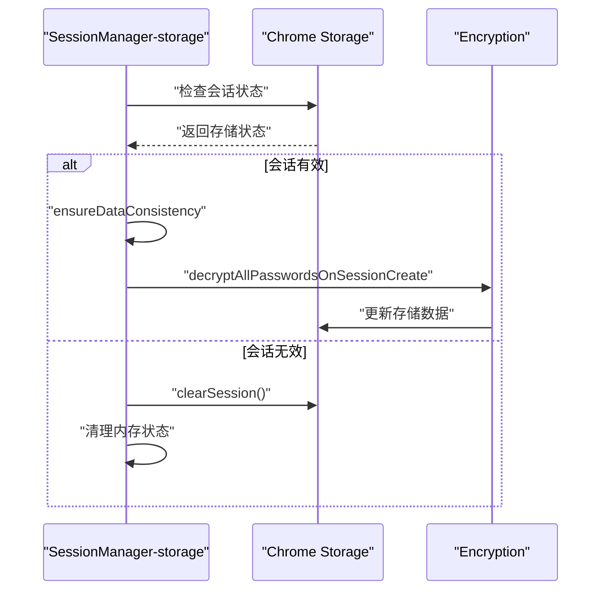
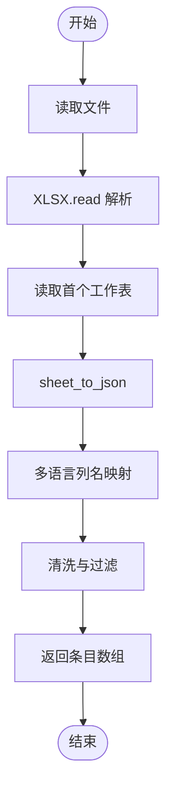
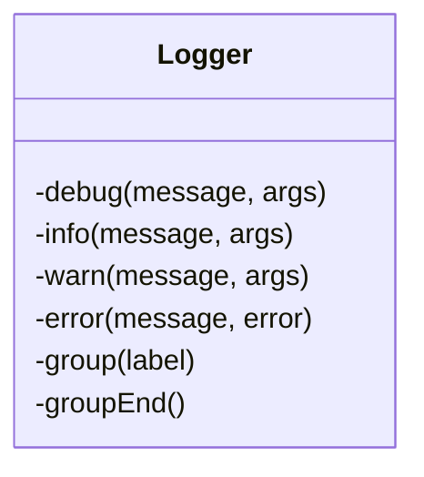
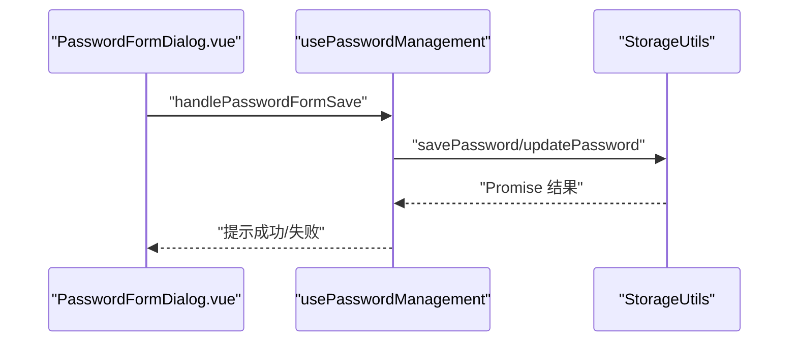
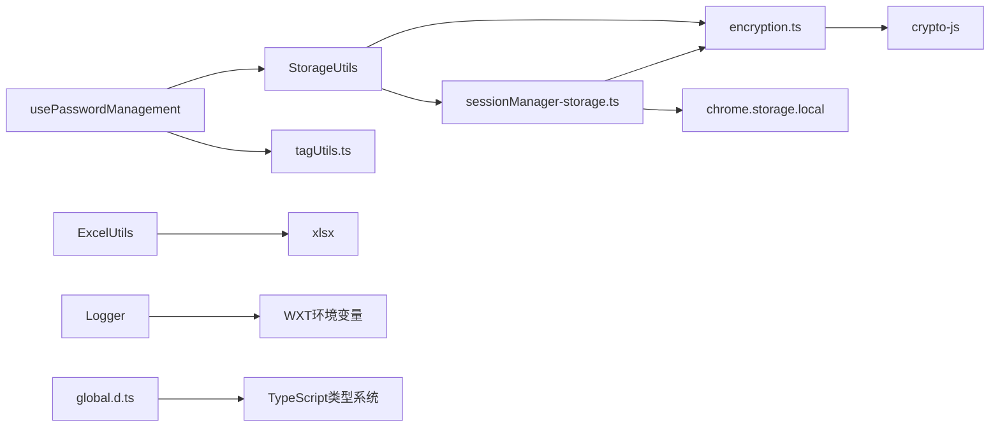

# 核心模块

<cite>
**本文档引用的文件**
- [utils/storage.ts](file://utils/storage.ts)
- [utils/encryption.ts](file://utils/encryption.ts)
- [utils/sessionManager-storage.ts](file://utils/sessionManager-storage.ts)
- [utils/excel.ts](file://utils/excel.ts)
- [utils/tagUtils.ts](file://utils/tagUtils.ts)
- [utils/types.ts](file://utils/types.ts)
- [composables/usePasswordManagement.ts](file://composables/usePasswordManagement.ts)
- [composables/useSessionTimer.ts](file://composables/useSessionTimer.ts)
- [composables/useChromeListeners.ts](file://composables/useChromeListeners.ts)
- [utils/logger.ts](file://utils/logger.ts)
- [entrypoints/background.ts](file://entrypoints/background.ts)
- [entrypoints/content.ts](file://entrypoints/content.ts)
- [components/PasswordFormDialog.vue](file://components/PasswordFormDialog.vue)
- [components/MasterPasswordDialog.vue](file://components/MasterPasswordDialog.vue)
- [components/ImportDialog.vue](file://components/ImportDialog.vue)
- [components/ValidityHoursSelect.vue](file://components/ValidityHoursSelect.vue)
- [components/ValiditySettingDialog.vue](file://components/ValiditySettingDialog.vue)
- [types/global.d.ts](file://types/global.d.ts)
- [package.json](file://package.json)
</cite>

## 更新摘要
**所做更改**
- 新增标签系统模块（tagUtils），提供标签解析、序列化、颜色映射和聚合功能
- 新增加密工具模块（encryption），提供独立的加密/解密、密钥派生和数据保护功能
- 新增会话管理模块（sessionManager-storage），提供会话状态管理、数据一致性检查和自动迁移
- 新增密码管理组合式工具（usePasswordManagement），集成标签处理和表单管理
- 新增会话定时器组合式工具（useSessionTimer），提供会话有效期管理和倒计时显示
- 扩展类型定义，新增标签相关接口和消息类型
- 更新存储管理器，重构为模块化架构，分离关注点

## 目录
1. [简介](#简介)
2. [项目结构](#项目结构)
3. [核心组件](#核心组件)
4. [架构总览](#架构总览)
5. [详细组件分析](#详细组件分析)
6. [依赖分析](#依赖分析)
7. [性能考量](#性能考量)
8. [故障排查指南](#故障排查指南)
9. [结论](#结论)
10. [附录](#附录)

## 简介
本文件面向 Account Password Helper 的核心模块，系统梳理并解释以下关键子系统的设计与实现：
- 存储管理系统：负责主密码配置、密码条目的加密/解密、持久化与检索、排序与搜索、会话有效期管理等。
- 标签系统：负责标签的解析、序列化、颜色映射和聚合，提供智能标签管理功能。
- 加密工具：提供独立的加密/解密、密钥派生和数据保护功能，支持会话安全。
- Excel 数据处理：负责密码数据的导入与导出，支持多语言列名映射与模板下载。
- 会话管理：负责主密码会话的建立、校验、过期处理与清理，确保数据安全。
- 组合式工具：提供密码管理和会话定时器等业务逻辑封装。
- 类型定义：统一的数据模型与消息类型定义，确保模块间契约清晰。
- 日志记录：提供统一的日志管理，支持开发环境与生产环境的日志级别控制。

文档将从职责边界、接口设计、内部协作机制、数据模型、加密策略、文件处理流程、安全验证机制等方面展开，并提供调用链与依赖关系图示，帮助开发者进行扩展与定制。

## 项目结构
项目采用基于功能域的组织方式，核心逻辑集中在 utils 目录，UI 组件位于 components 目录，入口脚本位于 entrypoints 目录，类型定义位于 utils/types.ts 与 types/global.d.ts。**新增** composables 目录用于存放组合式工具函数，**新增** utils/logger.ts 提供统一的日志管理。

```mermaid
graph TB
subgraph "核心工具模块"
S["utils/storage.ts<br/>存储与加密管理"]
E["utils/encryption.ts<br/>独立加密工具"]
SMS["utils/sessionManager-storage.ts<br/>会话管理"]
TU["utils/tagUtils.ts<br/>标签系统"]
EU["utils/excel.ts<br/>Excel导入导出"]
LG["utils/logger.ts<br/>日志记录工具"]
end
subgraph "组合式工具"
UPM["composables/usePasswordManagement.ts<br/>密码管理"]
UST["composables/useSessionTimer.ts<br/>会话定时器"]
UCL["composables/useChromeListeners.ts<br/>Chrome事件监听器"]
end
subgraph "入口脚本"
BG["entrypoints/background.ts<br/>后台消息处理"]
CT["entrypoints/content.ts<br/>内容脚本/表单检测"]
end
subgraph "UI组件"
PFD["components/PasswordFormDialog.vue<br/>密码表单"]
MPD["components/MasterPasswordDialog.vue<br/>主密码对话框"]
ID["components/ImportDialog.vue<br/>Excel导入"]
VHS["components/ValidityHoursSelect.vue<br/>有效期选择"]
VSD["components/ValiditySettingDialog.vue<br/>有效期设置"]
end
subgraph "类型声明"
GD["types/global.d.ts<br/>全局类型声明"]
end
subgraph "依赖"
CJS["crypto-js"]
XLSX["xlsx"]
EP["element-plus"]
```

**图表来源**
- [utils/storage.ts:34-672](file://utils/storage.ts#L34-L672)
- [utils/encryption.ts:1-242](file://utils/encryption.ts#L1-L242)
- [utils/sessionManager-storage.ts:1-373](file://utils/sessionManager-storage.ts#L1-L373)
- [utils/tagUtils.ts:1-188](file://utils/tagUtils.ts#L1-L188)
- [utils/excel.ts:1-178](file://utils/excel.ts#L1-L178)
- [composables/usePasswordManagement.ts:1-511](file://composables/usePasswordManagement.ts#L1-L511)
- [composables/useSessionTimer.ts:1-225](file://composables/useSessionTimer.ts#L1-L225)
- [composables/useChromeListeners.ts:1-112](file://composables/useChromeListeners.ts#L1-L112)
- [utils/logger.ts:1-68](file://utils/logger.ts#L1-L68)

**章节来源**
- [package.json:1-49](file://package.json#L1-L49)

## 核心组件
- 存储与加密管理（StorageUtils）
  - 主密码设置/验证/重置
  - PBKDF2 派生密钥、AES-256-CBC 加密/解密
  - 密码条目保存/更新/删除/批量删除
  - 原始数据与解密数据的双模式访问
  - URL/关键词搜索与排序配置持久化
  - 会话有效期与会话缓存（主密码加密存储、过期时间、临时会话密钥）
  - **重构**：分离为模块化架构，委托到 encryption 和 sessionManager-storage 模块
- 标签系统（TagUtils）
  - 标签解析：支持英文逗号和中文逗号分隔，自动去空白、过滤空项并去重
  - 标签序列化：规范化为以英文逗号拼接的字符串
  - 标签聚合：收集所有密码条目中的标签，返回去重后的候选项
  - 标签颜色映射：根据标签内容匹配预定义类别，返回对应的 Element Plus Tag 类型
- 加密工具（Encryption）
  - 独立加密模块，提供 MD5 哈希、随机盐值生成、唯一ID生成
  - PBKDF2 密钥派生，高级AES加密/解密（使用随机IV增强安全性）
  - 密码条目加密/解密，支持安全字段解密
  - 存储键名常量管理
- 会话管理（SessionManager-storage）
  - 会话状态管理：内存状态与存储状态同步
  - 数据一致性检查：自动修复加密状态不一致的问题
  - 会话生命周期管理：创建、验证、过期处理、清理
  - 数据迁移：未加密条目的自动迁移和加密
- Excel 工具模块（ExcelUtils）
  - 导出：用户名、密码、URL、标签、备注、创建/更新时间
  - 导入：多语言列名映射、数据清洗、错误处理
  - 模板下载：标准列头与示例行
- 组合式工具
  - **新增** usePasswordManagement：集成标签处理、表单管理、CRUD操作
  - **新增** useSessionTimer：会话有效期设置、倒计时显示、清除会话
- 类型定义（types）
  - PasswordEntry、MasterPasswordConfig、Message、MessageType
  - **新增** PasswordEntryWithUI、FloatingButtonConfig、PasswordCache、FillMobileCodeData
  - **扩展** MessageType 枚举，新增手机号+验证码填充消息类型
- 日志记录工具（Logger）
  - 根据环境自动控制日志输出，开发环境启用调试日志，生产环境禁用
  - 支持 debug、info、warn、error、group/groupEnd 等日志级别

**章节来源**
- [utils/storage.ts:34-672](file://utils/storage.ts#L34-L672)
- [utils/encryption.ts:1-242](file://utils/encryption.ts#L1-L242)
- [utils/sessionManager-storage.ts:1-373](file://utils/sessionManager-storage.ts#L1-L373)
- [utils/tagUtils.ts:1-188](file://utils/tagUtils.ts#L1-L188)
- [utils/excel.ts:1-178](file://utils/excel.ts#L1-L178)
- [composables/usePasswordManagement.ts:1-511](file://composables/usePasswordManagement.ts#L1-L511)
- [composables/useSessionTimer.ts:1-225](file://composables/useSessionTimer.ts#L1-L225)
- [utils/types.ts:1-246](file://utils/types.ts#L1-L246)
- [utils/logger.ts:1-68](file://utils/logger.ts#L1-L68)

## 架构总览
整体架构围绕"内容脚本 + 后台脚本 + UI 组件 + 工具模块"的分层设计：
- 内容脚本负责页面表单检测与消息转发
- 后台脚本负责侧边栏控制与跨页面消息桥接
- UI 组件通过工具模块与浏览器存储交互
- 工具模块封装加密、存储、Excel 处理、会话管理与事件监听
- **新增** 组合式工具提供业务逻辑封装，**新增** 标签系统提供智能标签管理



**图表来源**
- [composables/usePasswordManagement.ts:79-114](file://composables/usePasswordManagement.ts#L79-L114)
- [utils/sessionManager-storage.ts:42-89](file://utils/sessionManager-storage.ts#L42-L89)
- [utils/encryption.ts:53-72](file://utils/encryption.ts#L53-L72)
- [utils/storage.ts:75-117](file://utils/storage.ts#L75-L117)

## 详细组件分析

### 存储与加密管理模块（StorageUtils）
**重构**：模块化架构设计，分离关注点

职责边界
- **新增** 加密功能委托：将加密/解密功能委托到 encryption.ts 模块
- **新增** 会话管理委托：将会话状态管理委托到 sessionManager-storage.ts 模块
- 主密码生命周期管理：设置、验证、重置、有效性配置
- 密码条目生命周期管理：保存、更新、删除、批量删除
- 数据访问模式：原始数据读取（不解密）、解密读取（需主密码）
- 搜索与排序：URL 匹配、关键词检索、排序配置持久化
- **新增** 模块化重构：通过导出函数和类方法实现模块间通信

接口设计
- **委托方法**：hashPassword、generateSalt、generateId、deriveEncryptionKey、encryptData、decryptData
- **会话方法**：isSessionActiveSync、isSessionValid、createSession、clearSession
- **主密码方法**：setMasterPassword、verifyMasterPassword、hasMasterPassword
- **CRUD方法**：savePassword、updatePassword、getAllPasswords、deletePassword、deletePasswords
- **搜索方法**：getPasswordsByUrl、searchPasswords、applySavedSortConfig

内部协作机制
- **模块间通信**：通过导出函数实现模块间调用
- **状态管理**：与 chrome.storage.local 交互进行持久化
- **错误处理**：统一的错误捕获和日志记录
- **性能优化**：会话状态缓存，避免重复解密操作



**图表来源**
- [utils/storage.ts:34-117](file://utils/storage.ts#L34-L117)

**章节来源**
- [utils/storage.ts:34-672](file://utils/storage.ts#L34-L672)

### 标签系统模块（TagUtils）
职责边界
- **标签解析**：支持英文逗号和中文逗号分隔符，自动去空白、过滤空项并去重
- **标签序列化**：将标签数组规范化为以英文逗号拼接的字符串
- **标签聚合**：收集所有密码条目中的标签，返回去重后的候选项
- **标签颜色映射**：根据标签内容匹配预定义类别，返回对应的 Element Plus Tag 类型

接口设计
- parseTags(tag: string | undefined | null): string[]
- stringifyTags(tags: string[] | undefined | null): string
- collectAllTags(passwords: Array<Pick<PasswordEntry, 'tag'>>): string[]
- getTagType(tag: string): string

内部协作机制
- **缓存机制**：标签颜色映射使用 Map 缓存，确保同一标签始终使用相同颜色
- **智能匹配**：支持多语言标签匹配（中文关键词 + 英文关键词）
- **去重算法**：使用 Set 实现高效去重，支持大小写不敏感匹配



**图表来源**
- [utils/tagUtils.ts:17-71](file://utils/tagUtils.ts#L17-L71)
- [utils/tagUtils.ts:90-187](file://utils/tagUtils.ts#L90-L187)

**章节来源**
- [utils/tagUtils.ts:1-188](file://utils/tagUtils.ts#L1-L188)

### 加密工具模块（Encryption）
职责边界
- **基础加密**：MD5 哈希、随机盐值生成、唯一ID生成
- **密钥派生**：PBKDF2 从主密码+盐值派生密钥，支持自定义迭代次数
- **高级加密**：AES-256-CBC 加密，使用随机IV增强安全性
- **数据保护**：密码条目加密/解密，支持安全字段解密

接口设计
- hashPassword(password: string, salt: string): string
- generateSalt(): string
- generateId(): string
- deriveEncryptionKey(masterPassword: string): Promise<string>
- encryptData(data: string, key: string): string
- decryptData(encryptedData: string, key: string): string
- encryptPasswordEntry(entry: PasswordEntry, masterPassword: string): Promise<EncryptedPasswordEntry>
- decryptPasswordEntry(entry: EncryptedPasswordEntry, masterPassword: string): Promise<PasswordEntry>

内部协作机制
- **错误处理**：健壮的错误分支与降级（返回原始数据或空串）
- **日志记录**：使用统一的 logger 进行调试和错误记录
- **类型安全**：通过 TypeScript 接口确保数据结构一致性



**图表来源**
- [utils/encryption.ts:25-242](file://utils/encryption.ts#L25-L242)

**章节来源**
- [utils/encryption.ts:1-242](file://utils/encryption.ts#L1-L242)

### 会话管理模块（SessionManager-storage）
职责边界
- **会话状态管理**：内存状态与存储状态同步，支持同步检查和异步验证
- **数据一致性**：自动检查和修复数据状态不一致的问题
- **生命周期管理**：创建、验证、过期处理、清理会话缓存
- **数据迁移**：未加密条目的自动迁移和加密

接口设计
- isSessionActiveSync(): boolean
- isSessionValid(): Promise<boolean>
- createSession(masterPassword: string, validityHours: number): Promise<void>
- clearSession(): Promise<void>
- getSessionMasterPassword(): string | undefined
- getSessionMasterPasswordDecrypted(): Promise<string | null>
- getSessionExpiryTime(): Promise<number | null>
- generateSessionEncryptionKey(): Promise<string>
- migrateUnencryptedEntries(masterPassword: string): Promise<void>
- getMasterPasswordValidityHours(): Promise<number>
- setMasterPasswordValidityHours(hours: number): Promise<void>

内部协作机制
- **状态同步**：内存变量与 chrome.storage.local 同步，避免重复读取
- **自动修复**：检测到数据状态不一致时自动修复，确保数据完整性
- **安全加密**：会话主密码使用专用加密密钥，避免与主密码配置混淆



**图表来源**
- [utils/sessionManager-storage.ts:42-114](file://utils/sessionManager-storage.ts#L42-L114)
- [utils/sessionManager-storage.ts:243-279](file://utils/sessionManager-storage.ts#L243-L279)

**章节来源**
- [utils/sessionManager-storage.ts:1-373](file://utils/sessionManager-storage.ts#L1-L373)

### Excel 数据处理模块（ExcelUtils）
职责边界
- 导出：将密码条目映射为中文列头，写入工作簿并写出文件
- 导入：读取 Excel 文件，支持多语言列名映射，清洗与过滤无效数据
- 模板：提供标准列头与示例行，便于用户快速填写

接口设计
- exportToExcel(passwords: PasswordEntry[], filename: string): void
- importFromExcel(file: File): Promise<Omit<PasswordEntry, 'id' | 'order'>[]>
- downloadTemplate(): void

数据流
- 导出：映射 → book/new → json_to_sheet → book_append_sheet → writeFile
- 导入：FileReader → XLSX.read → sheet_to_json → 多语言列名映射 → 清洗过滤



**图表来源**
- [utils/excel.ts:50-136](file://utils/excel.ts#L50-L136)

**章节来源**
- [utils/excel.ts:1-178](file://utils/excel.ts#L1-L178)

### 密码管理组合式工具（usePasswordManagement）
职责边界
- **标签处理**：集成标签解析、序列化、聚合和颜色映射功能
- **表单管理**：密码表单的验证、提交、编辑和删除操作
- **CRUD 操作**：密码条目的创建、读取、更新、删除和批量操作
- **搜索排序**：关键词搜索、URL 匹配和排序配置管理

接口设计
- loadPasswords(): Promise<void>
- handlePasswordFormSave(): Promise<void>
- exportPasswords(): Promise<void>
- downloadTemplate(): void
- availableTags: ComputedRef<string[]>
- tagArray: ComputedRef<string[]>

内部协作机制
- **标签集成**：直接使用 tagUtils 模块提供的标签处理功能
- **状态管理**：使用 Vue 响应式系统管理组件状态
- **错误处理**：统一的错误捕获和用户反馈

**章节来源**
- [composables/usePasswordManagement.ts:1-511](file://composables/usePasswordManagement.ts#L1-L511)

### 会话定时器组合式工具（useSessionTimer）
职责边界
- **会话管理**：会话有效期设置、倒计时显示、清除会话
- **状态同步**：与 StorageUtils 同步会话状态和剩余时间
- **用户交互**：提供有效期设置弹窗和会话清除确认对话框

接口设计
- openValiditySetting(): Promise<void>
- handleValiditySave(): Promise<void>
- handleClearSession(): Promise<void>
- updateSessionInfo(): Promise<void>
- startSessionTimer(): void
- stopSessionTimer(): void

内部协作机制
- **定时更新**：使用 setInterval 实现秒级倒计时更新
- **状态同步**：定期从 StorageUtils 获取会话状态
- **用户反馈**：通过 Element Plus 提供友好的用户界面

**章节来源**
- [composables/useSessionTimer.ts:1-225](file://composables/useSessionTimer.ts#L1-L225)

### 类型定义（types）
职责边界
- 统一数据模型与消息类型，确保模块间契约清晰

关键类型
- PasswordEntry：密码条目字段集合
- MasterPasswordConfig：主密码哈希与盐值
- MessageType：消息类型枚举（心跳、表单检测、填充、侧边栏控制、URL 变化、获取密码列表）
- Message：消息接口
- **新增** PasswordEntryWithUI：带UI状态的密码条目
- **新增** FloatingButtonConfig：悬浮按钮配置接口，包含显示状态、位置、偏移量、透明度等配置
- **新增** PasswordCache：密码缓存接口，包含缓存数据、域名、时间戳、认证状态
- **新增** FillMobileCodeData：手机号验证码填充数据接口
- **扩展** MessageType：新增 FILL_MOBILE_CODE 消息类型，支持手机号+验证码填充

**章节来源**
- [utils/types.ts:1-246](file://utils/types.ts#L1-L246)

### 日志记录工具（Logger）
职责边界
- 根据环境自动控制日志输出，开发环境启用调试日志，生产环境禁用
- 提供多级别的日志输出方法，支持分组日志
- 作为统一的日志入口，便于集中管理和调试

接口设计
- debug(message: string, ...args): void：调试日志，仅开发环境输出
- info(message: string, ...args): void：信息日志，仅开发环境输出
- warn(message: string, ...args): void：警告日志，始终输出
- error(message: string, error?: Error): void：错误日志，始终输出
- group(label: string): void：分组日志，仅开发环境输出
- groupEnd(): void：结束分组日志

内部协作机制
- 通过 WXT 框架的 import.meta.env.DEV 检测开发环境
- 使用单例模式提供全局日志实例
- 与 TypeScript 类型系统集成，提供完整的类型支持



**图表来源**
- [utils/logger.ts:5-67](file://utils/logger.ts#L5-L67)

**章节来源**
- [utils/logger.ts:1-68](file://utils/logger.ts#L1-L68)

### 全局类型声明（global.d.ts）
职责边界
- 解决 CSS 文件导入的 TypeScript 类型问题
- 提供 Vue 单文件组件和样式文件的类型声明
- **新增** Chrome 129+ sidePanel.close API 类型补充

关键类型
- Vue 单文件组件声明：支持 *.vue 文件导入
- CSS 模块声明：支持 *.css、*.scss、*.less 文件导入
- Element Plus 样式文件声明：解决样式导入类型问题
- **新增** Chrome sidePanel.close API 类型：支持可选的 tabId 和 windowId 参数

**章节来源**
- [types/global.d.ts:1-56](file://types/global.d.ts#L1-L56)

### UI 组件与调用链
- 密码表单对话框（PasswordFormDialog.vue）
  - 触发 StorageUtils.savePassword 或 updatePassword
  - 成功后提示并关闭弹窗
- 主密码对话框（MasterPasswordDialog.vue）
  - 首次使用设置主密码，后续验证主密码
  - 调用 StorageUtils.setMasterPassword 或 verifyMasterPassword
- Excel 导入对话框（ImportDialog.vue）
  - 调用 ExcelUtils.importFromExcel 解析文件
  - 逐条调用 StorageUtils.savePassword 保存
- **新增** 有效期设置组件（ValidityHoursSelect.vue、ValiditySettingDialog.vue）
  - 集成 useSessionTimer 组合式工具
  - 提供会话有效期设置和管理界面



**图表来源**
- [components/PasswordFormDialog.vue:159-336](file://components/PasswordFormDialog.vue#L159-L336)
- [composables/usePasswordManagement.ts:272-317](file://composables/usePasswordManagement.ts#L272-L317)
- [utils/storage.ts:204-294](file://utils/storage.ts#L204-L294)

**章节来源**
- [components/PasswordFormDialog.vue:91-336](file://components/PasswordFormDialog.vue#L91-L336)
- [components/MasterPasswordDialog.vue:177-237](file://components/MasterPasswordDialog.vue#L177-L237)
- [components/ImportDialog.vue:147-195](file://components/ImportDialog.vue#L147-L195)
- [components/ValidityHoursSelect.vue](file://components/ValidityHoursSelect.vue)
- [components/ValiditySettingDialog.vue](file://components/ValiditySettingDialog.vue)

## 依赖分析
- 外部依赖
  - crypto-js：MD5、PBKDF2、AES 加解密
  - xlsx：Excel 读写
  - element-plus：UI 组件库
- 内部耦合
  - StorageUtils 与 CryptoJS、chrome.storage.local 紧密耦合
  - ExcelUtils 与 xlsx 紧密耦合
  - **新增** encryption 与 CryptoJS 紧密耦合
  - **新增** sessionManager-storage 与 encryption 模块紧密耦合
  - **新增** usePasswordManagement 与 tagUtils 模块紧密耦合
  - UI 组件通过 StorageUtils/ExcelUtils 与存储/文件交互
  - **新增** useChromeListeners 与 Vue 组合式 API 紧密耦合
  - **新增** Logger 与 WXT 框架环境变量集成



**图表来源**
- [utils/storage.ts:1-28](file://utils/storage.ts#L1-L28)
- [utils/encryption.ts:1-3](file://utils/encryption.ts#L1-L3)
- [utils/sessionManager-storage.ts:1-11](file://utils/sessionManager-storage.ts#L1-L11)
- [composables/usePasswordManagement.ts:8](file://composables/usePasswordManagement.ts#L8)

**章节来源**
- [package.json:22-26](file://package.json#L22-L26)

## 性能考量
- **模块化架构**：重构后的存储管理器通过委托模式分离关注点，提高代码可维护性和测试性
- **加密性能**
  - PBKDF2 迭代次数较高，建议在主线程避免频繁派生密钥；可结合会话缓存降低重复派生成本
  - AES 加解密按条目进行，建议批量操作时合并调用以减少存储写入次数
  - **新增** 独立加密模块提供更好的性能隔离和缓存机制
- **会话管理性能**
  - **新增** 会话状态同步检查，避免重复读取存储状态
  - **新增** 数据一致性自动修复，减少手动干预
  - **新增** 内存状态缓存，提升会话验证性能
- **标签系统性能**
  - **新增** 标签颜色映射缓存，避免重复计算
  - **新增** 去重算法优化，使用 Set 实现高效去重
- **存储访问**
  - 批量删除/保存使用一次 set 操作，避免多次往返
  - 搜索与排序为内存操作，建议限制条目规模或增加分页
- **UI 交互**
  - 表单检测使用 MutationObserver 与事件委托，避免为每个字段单独绑定监听器
  - 防抖与可见性监听减少不必要的侧边栏切换
  - **新增** 组合式工具提供更好的状态管理和性能优化
- **日志性能**
  - 开发环境启用详细日志，生产环境禁用调试日志，减少不必要的日志输出开销

## 故障排查指南
- **模块化架构问题**
  - 检查模块间导出函数是否正确，确认委托调用链路
  - 验证模块依赖关系，确保正确的导入顺序
- **主密码设置失败**
  - 检查 setMasterPassword 的返回与验证逻辑，确认保存后立即验证
  - 若验证失败，检查盐值与哈希一致性
- **解密异常**
  - decryptData 对畸形数据与空密钥有降级处理；若仍失败，检查密钥来源与条目是否加密
  - **新增** 检查 encryption 模块的错误处理和日志输出
- **会话过期**
  - 定时检查 isSessionValid，过期自动清理并触发 sessionExpired 事件
  - 如需延长会话，调整有效期小时数
  - **新增** 检查 sessionManager-storage 模块的状态同步和自动修复机制
- **标签处理异常**
  - **新增** 检查标签解析和序列化功能，确认分隔符处理和去重逻辑
  - **新增** 验证标签颜色映射缓存的一致性
- **Excel 导入失败**
  - 确认列名映射与数据清洗逻辑；检查文件格式与读取权限
- **组合式工具问题**
  - **新增** 检查 usePasswordManagement 的标签处理功能
  - **新增** 验证 useSessionTimer 的定时器管理和状态同步
- **日志输出异常**
  - 检查 WXT 框架的 import.meta.env.DEV 环境变量设置
  - 确认日志级别与环境配置匹配

**章节来源**
- [utils/storage.ts:79-114](file://utils/storage.ts#L79-L114)
- [utils/storage.ts:219-297](file://utils/storage.ts#L219-L297)
- [utils/encryption.ts:99-164](file://utils/encryption.ts#L99-L164)
- [utils/sessionManager-storage.ts:42-89](file://utils/sessionManager-storage.ts#L42-L89)
- [utils/tagUtils.ts:17-71](file://utils/tagUtils.ts#L17-L71)
- [utils/excel.ts:50-136](file://utils/excel.ts#L50-L136)
- [composables/usePasswordManagement.ts:79-114](file://composables/usePasswordManagement.ts#L79-L114)
- [composables/useSessionTimer.ts:54-92](file://composables/useSessionTimer.ts#L54-L92)
- [utils/logger.ts:8-12](file://utils/logger.ts#L8-L12)

## 结论
本项目通过清晰的模块划分与严格的接口约束，实现了从数据存储、加密、文件处理到会话管理的完整闭环。**重构后的 StorageUtils** 通过模块化架构分离关注点，提高了代码的可维护性和扩展性。**新增的标签系统** 提供了智能的标签管理功能，增强了用户体验。**独立的加密工具** 模块确保了数据安全性和性能优化。**会话管理模块** 保障了会话安全与数据一致性。**组合式工具** 提供了更好的业务逻辑封装和用户体验。UI 组件通过统一的工具模块与浏览器 API 交互，形成高内聚、低耦合的架构。

## 附录
- **最佳实践**
  - 优先使用会话缓存减少主密码派生与解密开销
  - 批量操作时合并存储写入，避免频繁 I/O
  - 导入数据前进行严格清洗与校验，保证数据质量
  - 对敏感操作（设置/验证主密码、解密）提供明确的错误反馈
  - **新增** 利用模块化架构的优势，合理使用委托模式分离关注点
  - **新增** 充分利用标签系统的智能功能，提升标签管理效率
  - **新增** 使用独立加密模块确保数据安全，避免重复加密逻辑
  - **新增** 利用会话管理的自动修复机制，减少手动干预
- **扩展与定制**
  - 新增字段：在 PasswordEntry 中扩展字段并在 StorageUtils 的映射处同步处理
  - 新增排序维度：在 applySavedSortConfig 中扩展比较逻辑
  - 新增消息类型：在 MessageType 中扩展并在内容/后台脚本中处理
  - 新增 Excel 列：在 ExcelUtils.importFromExcel 中扩展列名映射
  - **新增** 新增标签类别：在 tagUtils.getTagType 中扩展标签匹配规则
  - **新增** 新增加密算法：在 encryption 模块中扩展加密/解密方法
  - **新增** 新增会话策略：在 sessionManager-storage 模块中扩展会话管理逻辑
  - **新增** 新增组合式工具：在 composables 目录中扩展业务逻辑封装