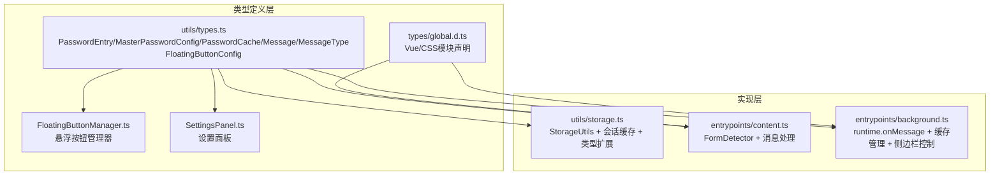
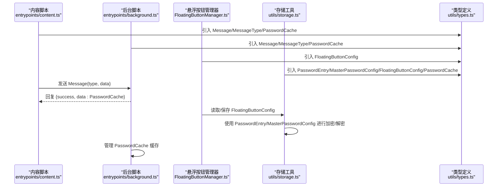
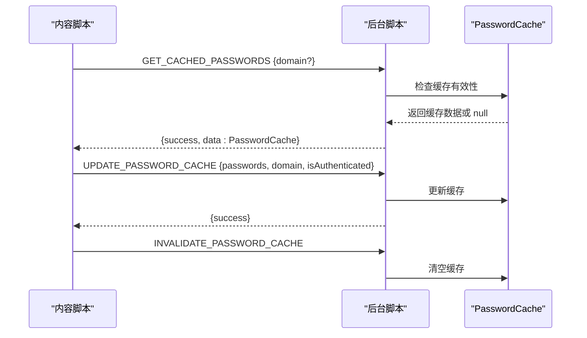
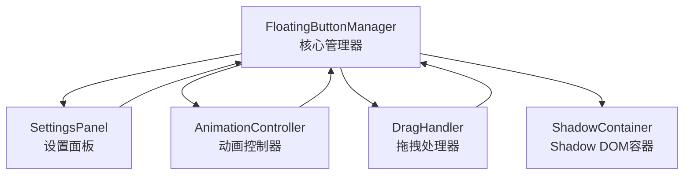
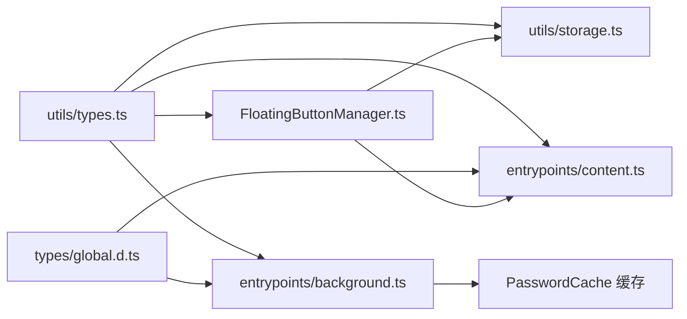

# 类型定义

<cite>
**本文引用的文件**
- [types/global.d.ts](file://types/global.d.ts)
- [utils/types.ts](file://utils/types.ts)
- [utils/storage.ts](file://utils/storage.ts)
- [entrypoints/background.ts](file://entrypoints/background.ts)
- [entrypoints/content.ts](file://entrypoints/content.ts)
- [entrypoints/content/floatingButtons/FloatingButtonManager.ts](file://entrypoints/content/floatingButtons/FloatingButtonManager.ts)
- [entrypoints/content/floatingButtons/SettingsPanel.ts](file://entrypoints/content/floatingButtons/SettingsPanel.ts)
- [entrypoints/content/floatingButtons/index.ts](file://entrypoints/content/floatingButtons/index.ts)
- [package.json](file://package.json)
- [tsconfig.json](file://tsconfig.json)
</cite>

## 更新摘要
**变更内容**
- 新增PasswordCache接口，定义了缓存数据结构
- 新增MessageType枚举中的三个缓存相关消息类型：GET_CACHED_PASSWORDS、UPDATE_PASSWORD_CACHE、INVALIDATE_PASSWORD_CACHE
- 新增会话缓存机制，与主密码会话有效期保持一致
- 新增悬浮按钮配置接口 FloatingButtonConfig
- 新增手机号+验证码填充消息类型 FILL_MOBILE_CODE
- 新增悬浮按钮管理器相关类型定义和使用

## 目录
1. [简介](#简介)
2. [项目结构与类型组织](#项目结构与类型组织)
3. [核心类型系统](#核心类型系统)
4. [架构概览](#架构概览)
5. [详细类型分析](#详细类型分析)
6. [缓存系统](#缓存系统)
7. [悬浮按钮配置系统](#悬浮按钮配置系统)
8. [依赖关系分析](#依赖关系分析)
9. [性能与类型安全考量](#性能与类型安全考量)
10. [故障排查与最佳实践](#故障排查与最佳实践)
11. [结论](#结论)

## 简介
本文件系统化梳理 Account Password Helper 的 TypeScript 类型定义体系，重点覆盖以下方面：
- 核心数据模型：PasswordEntry、MasterPasswordConfig
- 缓存数据模型：PasswordCache
- 消息通信类型：Message、MessageType 枚举
- 悬浮按钮配置类型：FloatingButtonConfig
- 类型扩展与接口继承：EncryptedPasswordEntry 的扩展模式
- 泛型与类型推导：Omit、Partial 等工具类型的使用
- 全局类型声明与模块类型定义：CSS/组件模块声明
- 类型在实际业务中的使用：内容脚本、后台脚本、存储工具之间的协作

## 项目结构与类型组织
类型定义主要分布在三个位置：
- utils/types.ts：核心业务类型与消息类型定义，包括新增的 PasswordCache 接口
- types/global.d.ts：全局模块声明，解决样式文件与 Vue 组件的类型导入问题
- utils/storage.ts：类型使用与扩展，结合存储与加密流程，实现会话缓存机制
- entrypoints/background.ts、entrypoints/content.ts：类型消费与消息通信，包括缓存相关的消息处理
- entrypoints/content/floatingButtons/：悬浮按钮相关类型定义

**图表来源**
- [utils/types.ts](file://utils/types.ts#L1-L172)
- [types/global.d.ts](file://types/global.d.ts#L1-L36)
- [utils/storage.ts](file://utils/storage.ts#L1-L1149)
- [entrypoints/content.ts](file://entrypoints/content.ts#L1-L1966)
- [entrypoints/background.ts](file://entrypoints/background.ts#L1-L384)
- [entrypoints/content/floatingButtons/FloatingButtonManager.ts](file://entrypoints/content/floatingButtons/FloatingButtonManager.ts#L1-L486)
- [entrypoints/content/floatingButtons/SettingsPanel.ts](file://entrypoints/content/floatingButtons/SettingsPanel.ts#L1-L273)

**章节来源**
- [utils/types.ts](file://utils/types.ts#L1-L172)
- [types/global.d.ts](file://types/global.d.ts#L1-L36)
- [utils/storage.ts](file://utils/storage.ts#L1-L1149)
- [entrypoints/background.ts](file://entrypoints/background.ts#L1-L384)
- [entrypoints/content.ts](file://entrypoints/content.ts#L1-L1966)
- [entrypoints/content/floatingButtons/FloatingButtonManager.ts](file://entrypoints/content/floatingButtons/FloatingButtonManager.ts#L1-L486)
- [entrypoints/content/floatingButtons/SettingsPanel.ts](file://entrypoints/content/floatingButtons/SettingsPanel.ts#L1-L273)

## 核心类型系统
本项目的核心类型由五部分构成：
- 数据模型：PasswordEntry、MasterPasswordConfig、PasswordCache
- 消息类型：Message、MessageType 枚举
- 悬浮按钮配置：FloatingButtonConfig
- 扩展类型：EncryptedPasswordEntry（基于 PasswordEntry 的扩展）

**章节来源**
- [utils/types.ts](file://utils/types.ts#L1-L172)
- [utils/storage.ts](file://utils/storage.ts#L4-L7)

## 架构概览
类型在系统中的流转路径如下：
- 内容脚本（content.ts）通过 Message/MessageType 与后台脚本（background.ts）通信
- 悬浮按钮管理器（FloatingButtonManager.ts）通过 FloatingButtonConfig 控制按钮显示状态
- 存储工具（storage.ts）负责数据持久化与加密，使用 PasswordEntry/MasterPasswordConfig/FloatingButtonConfig，并实现会话缓存机制
- 全局类型声明（global.d.ts）保证样式与 Vue 组件的类型可用性

**图表来源**
- [entrypoints/content.ts](file://entrypoints/content.ts#L1-L1966)
- [entrypoints/background.ts](file://entrypoints/background.ts#L1-L384)
- [entrypoints/content/floatingButtons/FloatingButtonManager.ts](file://entrypoints/content/floatingButtons/FloatingButtonManager.ts#L1-L486)
- [utils/storage.ts](file://utils/storage.ts#L1-L1149)
- [utils/types.ts](file://utils/types.ts#L1-L172)

## 详细类型分析

### PasswordEntry 数据模型
- 字段与含义
  - id：字符串，唯一标识符
  - username：字符串，账号/邮箱/手机号/用户名/用户号
  - password：字符串，密码
  - url：字符串，网站或应用地址
  - tag：字符串，标签
  - remark：字符串，备注
  - createTime：数字，毫秒时间戳
  - updateTime：数字，毫秒时间戳
  - order：数字，排列顺序
- 约束与语义
  - createTime/updateTime 通常由系统维护，用于排序与审计
  - order 用于 UI 层的排序展示
  - url 支持模糊匹配，用于按站点筛选
- 使用场景
  - 存储与检索：通过 StorageUtils 的 getAllPasswords/savePassword/updatePassword/deletePassword 等方法
  - 加密存储：当存在主密码时，PasswordEntry 会被扩展为 EncryptedPasswordEntry 并写入本地存储

**章节来源**
- [utils/types.ts](file://utils/types.ts#L4-L41)
- [utils/storage.ts](file://utils/storage.ts#L377-L461)

### MasterPasswordConfig 主密码配置
- 字段与含义
  - hashedPassword：字符串，主密码经盐值哈希后的值
  - salt：字符串，盐值
- 约束与语义
  - 用于验证主密码与派生加密密钥
  - 与 PBKDF2 算法配合，迭代次数可配置以增强安全性
- 使用场景
  - setMasterPassword：生成盐值并保存哈希
  - verifyMasterPassword：校验输入主密码
  - deriveEncryptionKey：从主密码+盐值派生对称密钥

**章节来源**
- [utils/types.ts](file://utils/types.ts#L46-L49)
- [utils/storage.ts](file://utils/storage.ts#L76-L143)
- [utils/storage.ts](file://utils/storage.ts#L164-L186)

### PasswordCache 缓存数据模型
**新增** 本节介绍新增的缓存数据结构，用于优化密码数据的访问性能。

- 字段与含义
  - passwords：PasswordEntry[]，缓存的密码条目数组
  - domain：字符串，缓存对应的域名
  - timestamp：数字，缓存创建的时间戳（毫秒）
  - isAuthenticated：布尔值，表示缓存是否已通过认证
- 约束与语义
  - 缓存有效期与主密码会话有效期保持一致，默认24小时
  - domain 字段用于域名匹配，确保缓存适用于正确的网站
  - timestamp 用于缓存过期检查
  - isAuthenticated 用于标识缓存数据的认证状态
- 使用场景
  - 通过 GET_CACHED_PASSWORDS 消息获取缓存数据
  - 通过 UPDATE_PASSWORD_CACHE 消息更新缓存
  - 通过 INVALIDATE_PASSWORD_CACHE 消息使缓存失效

**章节来源**
- [utils/types.ts](file://utils/types.ts#L153-L171)
- [entrypoints/background.ts](file://entrypoints/background.ts#L8-L9)
- [entrypoints/background.ts](file://entrypoints/background.ts#L323-L347)

### Message 与 MessageType 消息类型
**更新** MessageType 枚举新增了三个缓存相关的消息类型。

- Message 接口
  - type：MessageType
  - data：任意数据体（可选）
- MessageType 枚举
  - PING：心跳
  - DETECT_FORM：检测表单
  - FILL_PASSWORD：填充账号+密码
  - FILL_MOBILE_CODE：填充手机号（不含验证码）
  - SHOW_SIDEPANEL/HIDE_SIDEPANEL：显示/隐藏侧边栏
  - TOGGLE_SIDEPANEL：切换侧边栏（用于悬浮按钮）
  - CLOSE_SIDEPANEL：关闭侧边栏（发送给sidepanel，让它自己关闭）
  - URL_CHANGED：URL 变化
  - GET_PASSWORDS：获取密码列表
  - OPEN_OPTIONS_PAGE：打开密码管理页面
  - TOGGLE_FLOATING_BUTTONS：切换悬浮按钮显示状态
  - **新增** GET_CACHED_PASSWORDS：获取缓存的密码列表
  - **新增** UPDATE_PASSWORD_CACHE：更新密码缓存
  - **新增** INVALIDATE_PASSWORD_CACHE：使密码缓存失效
- 使用场景
  - 内容脚本与后台脚本通过 chrome.runtime.onMessage 交换消息
  - 后台脚本根据 MessageType 分发处理逻辑
  - 缓存相关的消息用于优化密码数据的访问性能

**章节来源**
- [utils/types.ts](file://utils/types.ts#L108-L171)
- [utils/types.ts](file://utils/types.ts#L54-L103)
- [entrypoints/background.ts](file://entrypoints/background.ts#L168-L194)
- [entrypoints/content.ts](file://entrypoints/content.ts#L108-L111)

### 类型扩展：EncryptedPasswordEntry
- 扩展点
  - 在 PasswordEntry 基础上增加可选字段 encrypted?: boolean
- 作用
  - 标识存储条目是否已被加密
  - 与 StorageUtils.encryptPasswordEntry/decryptPasswordEntry 协作
- 使用注意
  - 解密时需移除 encrypted 字段，确保返回标准 PasswordEntry

**章节来源**
- [utils/storage.ts](file://utils/storage.ts#L4-L7)
- [utils/storage.ts](file://utils/storage.ts#L302-L356)

### 泛型与类型推导
- Omit<PasswordEntry, 'id' | 'order'>
  - 语义：从 PasswordEntry 中剔除 id 与 order 字段，用于保存新条目时的输入约束
  - 使用：savePassword 的第一个参数
- Partial<FloatingButtonConfig>
  - 语义：将 FloatingButtonConfig 的所有字段设为可选，用于更新配置时的部分更新
  - 使用：saveFloatingButtonConfig 的参数
- any
  - 语义：Message.data 为 any，允许灵活传递不同结构的数据
  - 使用：fillPassword/fillMobileCode 的 data 结构

**章节来源**
- [utils/storage.ts](file://utils/storage.ts#L377-L381)
- [utils/storage.ts](file://utils/storage.ts#L1110-L1129)

### 全局类型声明与模块类型定义
- Vue 单文件组件声明：允许 *.vue 文件作为模块导入
- CSS/SCSS/Less 模块声明：允许样式文件作为模块导入
- Element Plus 特定样式声明：解决主题样式模块的类型问题
- 作用：消除构建期类型错误，保证 IDE 类型提示与编译通过

**章节来源**
- [types/global.d.ts](file://types/global.d.ts#L5-L36)

## 缓存系统

### PasswordCache 接口详解
**新增** PasswordCache 接口是本次更新的核心，用于实现密码数据的缓存机制。

- 设计目标
  - 提高密码数据访问性能，避免频繁的存储读取
  - 与主密码会话机制集成，确保安全性
  - 提供域名级别的缓存隔离
- 生命周期管理
  - 通过 UPDATE_PASSWORD_CACHE 消息创建和更新
  - 通过 INVALIDATE_PASSWORD_CACHE 消息失效
  - 自动过期检查，与会话有效期保持一致
- 域名匹配机制
  - 支持按域名过滤缓存数据
  - 确保缓存数据适用于正确的网站环境

### 缓存消息处理流程
**新增** 后台脚本实现了完整的缓存消息处理逻辑：

**图表来源**
- [entrypoints/background.ts](file://entrypoints/background.ts#L168-L194)
- [entrypoints/background.ts](file://entrypoints/background.ts#L323-L368)

### 会话缓存机制
**新增** 会话缓存机制与主密码会话有效期保持一致：

- 会话激活时
  - 解密所有密码条目并明文存储
  - 提升读取性能
- 会话过期时
  - 自动加密所有敏感字段
  - 清除会话相关数据
- 缓存策略
  - 缓存有效期与会话有效期同步
  - 存储变化时自动失效缓存

**章节来源**
- [utils/storage.ts](file://utils/storage.ts#L914-L1037)
- [utils/storage.ts](file://utils/storage.ts#L926-L950)
- [entrypoints/background.ts](file://entrypoints/background.ts#L308-L317)
- [entrypoints/background.ts](file://entrypoints/background.ts#L370-L382)

## 悬浮按钮配置系统

### FloatingButtonConfig 悬浮按钮配置接口
- 字段与含义
  - visible：布尔值，是否显示悬浮按钮
  - position：'left' | 'right'，按钮位置（左侧/右侧）
  - offsetY：数字，垂直偏移量（像素）
  - opacity：数字，按钮透明度（0-1）
  - autoShowSidepanel：布尔值，输入框获取焦点时是否自动展示侧边栏
- 约束与语义
  - 默认配置：visible=true, position='right', offsetY=0, opacity=0.9, autoShowSidepanel=false
  - position 仅接受 'left' 或 'right' 值
  - opacity 必须在 0 到 1 之间
- 使用场景
  - 悬浮按钮管理器初始化与配置应用
  - 设置面板的配置编辑与保存
  - 存储工具的配置持久化

### 悬浮按钮管理器架构
- FloatingButtonManager：核心管理类，负责悬浮按钮的生命周期管理、渲染和事件处理
- SettingsPanel：设置面板，提供悬浮按钮配置界面
- AnimationController：动画控制器，处理按钮显示/隐藏动画
- DragHandler：拖拽处理器，支持按钮位置拖拽调整
- 事件流：用户交互 -> 按钮点击 -> 消息发送 -> 后台脚本处理 -> 配置更新

**图表来源**
- [entrypoints/content/floatingButtons/FloatingButtonManager.ts](file://entrypoints/content/floatingButtons/FloatingButtonManager.ts#L1-L486)
- [entrypoints/content/floatingButtons/SettingsPanel.ts](file://entrypoints/content/floatingButtons/SettingsPanel.ts#L1-L273)

**章节来源**
- [utils/types.ts](file://utils/types.ts#L125-L149)
- [utils/storage.ts](file://utils/storage.ts#L1076-L1147)
- [entrypoints/content/floatingButtons/FloatingButtonManager.ts](file://entrypoints/content/floatingButtons/FloatingButtonManager.ts#L1-L486)
- [entrypoints/content/floatingButtons/SettingsPanel.ts](file://entrypoints/content/floatingButtons/SettingsPanel.ts#L1-L273)

## 依赖关系分析
- utils/types.ts 是类型定义的根，被 storage.ts、content.ts、background.ts、FloatingButtonManager.ts 引用
- utils/storage.ts 依赖 utils/types.ts 中的接口与枚举，同时扩展 PasswordEntry
- entrypoints/background.ts、entrypoints/content.ts 依赖 utils/types.ts 的 Message/MessageType/PasswordCache
- entrypoints/content/floatingButtons/* 依赖 utils/types.ts 的 FloatingButtonConfig
- types/global.d.ts 为全局模块声明，服务于 Vue 与样式文件的类型导入

**图表来源**
- [utils/types.ts](file://utils/types.ts#L1-L172)
- [utils/storage.ts](file://utils/storage.ts#L1-L1149)
- [entrypoints/content.ts](file://entrypoints/content.ts#L1-L1966)
- [entrypoints/background.ts](file://entrypoints/background.ts#L1-L384)
- [entrypoints/content/floatingButtons/FloatingButtonManager.ts](file://entrypoints/content/floatingButtons/FloatingButtonManager.ts#L1-L486)
- [types/global.d.ts](file://types/global.d.ts#L1-L36)

**章节来源**
- [utils/types.ts](file://utils/types.ts#L1-L172)
- [utils/storage.ts](file://utils/storage.ts#L1-L1149)
- [entrypoints/background.ts](file://entrypoints/background.ts#L1-L384)
- [entrypoints/content.ts](file://entrypoints/content.ts#L1-L1966)
- [entrypoints/content/floatingButtons/FloatingButtonManager.ts](file://entrypoints/content/floatingButtons/FloatingButtonManager.ts#L1-L486)
- [types/global.d.ts](file://types/global.d.ts#L1-L36)

## 性能与类型安全考量
- 类型安全
  - 使用 MessageType 枚举限定消息类型，避免字符串魔法值带来的运行时错误
  - 使用 Omit/Partial 等工具类型约束输入输出，减少不必要的字段暴露
  - EncryptedPasswordEntry 的扩展模式确保加密状态的显式标注
  - FloatingButtonConfig 的联合类型约束确保 position 字段的有效性
  - PasswordCache 接口确保缓存数据结构的一致性和完整性
- 性能
  - StorageUtils.applySavedSortConfig 对列表排序时，优先读取保存的排序配置，避免重复计算
  - FormDetector 使用 WeakMap/WeakSet 缓存字段类型与检测结果，降低内存占用与重复计算
  - FloatingButtonManager 使用 Shadow DOM 和 CSS 变量优化渲染性能
  - **新增** 会话缓存机制显著提升密码数据访问性能
  - **新增** 缓存过期检查与域名匹配机制确保数据准确性
- 错误处理
  - StorageUtils.decryptFieldSafely 在解密失败时返回原始数据，保证健壮性
  - getAllPasswords 在缺少主密码时抛出明确错误，避免静默失败
  - 悬浮按钮配置合并默认值，确保配置完整性
  - **新增** 缓存失效时的优雅降级处理

**章节来源**
- [utils/types.ts](file://utils/types.ts#L54-L103)
- [utils/storage.ts](file://utils/storage.ts#L607-L670)
- [entrypoints/content.ts](file://entrypoints/content.ts#L39-L51)
- [utils/storage.ts](file://utils/storage.ts#L361-L372)
- [utils/storage.ts](file://utils/storage.ts#L1097-L1101)
- [entrypoints/background.ts](file://entrypoints/background.ts#L323-L347)

## 故障排查与最佳实践
- 常见问题
  - 无法解密数据：检查主密码是否正确、是否提供了主密码参数给 getAllPasswords
  - 侧边栏无法打开：确认 Chrome 版本支持 sidePanel API，或检查 setOptions 是否被禁用
  - URL 变化未触发：确认 MutationObserver 与 popstate 监听是否生效
  - 悬浮按钮不显示：检查 FloatingButtonConfig 的 visible 字段，确认存储中配置正确
  - 消息类型错误：确认 MessageType 枚举值是否正确，避免字符串拼写错误
  - **新增** 缓存数据为空：检查会话是否有效、域名是否匹配、缓存是否过期
  - **新增** 缓存更新失败：确认 UPDATE_PASSWORD_CACHE 消息格式正确
- 最佳实践
  - 严格区分明文与加密条目：保存/更新时根据是否提供主密码决定是否加密
  - 使用 MessageType 枚举而非字符串字面量，便于重构与 IDE 提示
  - 对外部传入的 data 使用类型守卫或解构默认值，避免运行时异常
  - 对复杂 UI 交互（如表单检测）使用缓存与防抖，提升性能与稳定性
  - 悬浮按钮配置使用 Partial 类型进行部分更新，避免覆盖不需要修改的字段
  - **新增** 合理使用缓存机制，避免频繁的缓存更新操作
  - **新增** 监控缓存状态，在数据变化时及时使缓存失效

**章节来源**
- [utils/storage.ts](file://utils/storage.ts#L514-L555)
- [entrypoints/background.ts](file://entrypoints/background.ts#L113-L115)
- [entrypoints/content.ts](file://entrypoints/content.ts#L93-L170)
- [utils/storage.ts](file://utils/storage.ts#L1110-L1129)
- [entrypoints/background.ts](file://entrypoints/background.ts#L364-L368)

## 结论
本项目的类型定义体系经过本次更新变得更加完善和高效：
- utils/types.ts 提供核心业务类型与消息类型，包括新增的 PasswordCache 接口和悬浮按钮配置类型
- utils/storage.ts 通过类型扩展实现"明文/加密"双态存储、会话缓存管理和悬浮按钮配置管理
- entrypoints/* 通过 MessageType/Message 实现跨脚本通信，包括新增的缓存相关消息类型
- entrypoints/content/floatingButtons/* 提供完整的悬浮按钮功能实现
- types/global.d.ts 保障样式与组件的类型可用性

**主要改进**：
- 新增 PasswordCache 接口，提供高效的密码数据缓存机制
- 新增三个缓存相关的消息类型，完善了 UI 与后台服务间的通信通道
- 实现会话缓存机制，与主密码会话有效期保持一致
- 优化了密码数据的访问性能和安全性

建议后续演进方向：
- 为 Message.data 引入更严格的结构约束（如 LoginFillPayload、MobileCodeFillPayload），减少 any 的使用
- 对排序配置与有效期等设置引入更细粒度的类型校验
- 在 UI 层引入类型驱动的表单校验与提示，进一步提升类型安全
- 为悬浮按钮配置添加更完善的验证规则和默认值处理
- 考虑将 MessageType 的枚举值迁移到独立的常量文件，便于维护和测试
- **新增** 扩展缓存系统的监控和调试功能，便于性能优化和问题排查