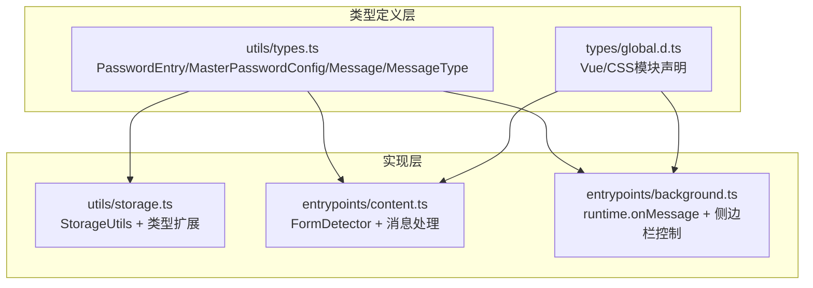
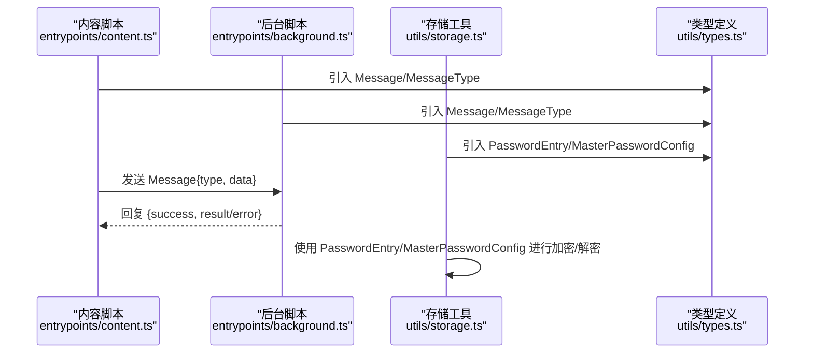
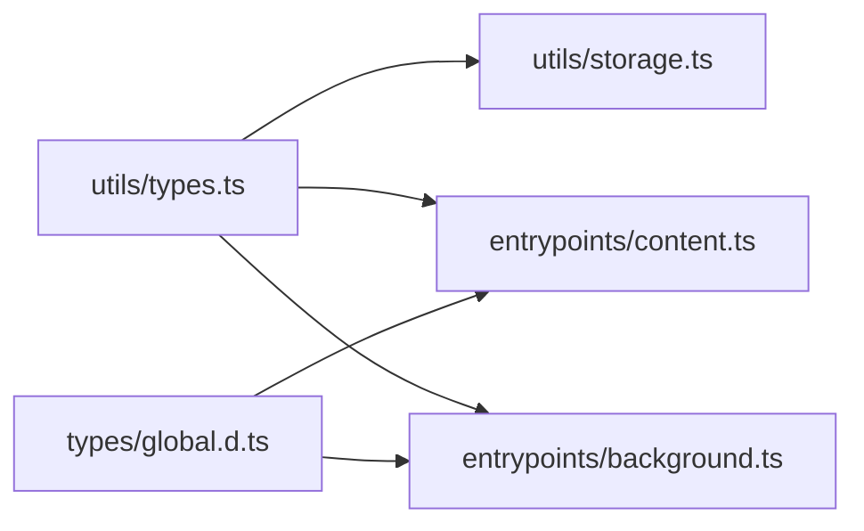

# 类型定义

<cite>
**本文引用的文件**
- [types/global.d.ts](file://types/global.d.ts)
- [utils/types.ts](file://utils/types.ts)
- [utils/storage.ts](file://utils/storage.ts)
- [entrypoints/background.ts](file://entrypoints/background.ts)
- [entrypoints/content.ts](file://entrypoints/content.ts)
- [package.json](file://package.json)
- [tsconfig.json](file://tsconfig.json)
</cite>

## 目录
1. [简介](#简介)
2. [项目结构与类型组织](#项目结构与类型组织)
3. [核心类型系统](#核心类型系统)
4. [架构概览](#架构概览)
5. [详细类型分析](#详细类型分析)
6. [依赖关系分析](#依赖关系分析)
7. [性能与类型安全考量](#性能与类型安全考量)
8. [故障排查与最佳实践](#故障排查与最佳实践)
9. [结论](#结论)

## 简介
本文件系统化梳理 Account Password Helper 的 TypeScript 类型定义体系，重点覆盖以下方面：
- 核心数据模型：PasswordEntry、MasterPasswordConfig
- 消息通信类型：Message、MessageType 枚举
- 类型扩展与接口继承：EncryptedPasswordEntry 的扩展模式
- 泛型与类型推导：Omit、Partial 等工具类型的使用
- 全局类型声明与模块类型定义：CSS/组件模块声明
- 类型在实际业务中的使用：内容脚本、后台脚本、存储工具之间的协作

## 项目结构与类型组织
类型定义主要分布在两个位置：
- utils/types.ts：核心业务类型与消息类型定义
- types/global.d.ts：全局模块声明，解决样式文件与 Vue 组件的类型导入问题
- utils/storage.ts：类型使用与扩展，结合存储与加密流程
- entrypoints/background.ts、entrypoints/content.ts：类型消费与消息通信

图表来源
- [utils/types.ts](file://utils/types.ts#L1-L96)
- [types/global.d.ts](file://types/global.d.ts#L1-L36)
- [utils/storage.ts](file://utils/storage.ts#L1-L980)
- [entrypoints/content.ts](file://entrypoints/content.ts#L1-L1892)
- [entrypoints/background.ts](file://entrypoints/background.ts#L1-L232)

章节来源
- [utils/types.ts](file://utils/types.ts#L1-L96)
- [types/global.d.ts](file://types/global.d.ts#L1-L36)
- [utils/storage.ts](file://utils/storage.ts#L1-L980)
- [entrypoints/background.ts](file://entrypoints/background.ts#L1-L232)
- [entrypoints/content.ts](file://entrypoints/content.ts#L1-L1892)

## 核心类型系统
本项目的核心类型由三部分构成：
- 数据模型：PasswordEntry、MasterPasswordConfig
- 消息类型：Message、MessageType 枚举
- 扩展类型：EncryptedPasswordEntry（基于 PasswordEntry 的扩展）

章节来源
- [utils/types.ts](file://utils/types.ts#L1-L96)
- [utils/storage.ts](file://utils/storage.ts#L4-L7)

## 架构概览
类型在系统中的流转路径如下：
- 内容脚本（content.ts）通过 Message/MessageType 与后台脚本（background.ts）通信
- 存储工具（storage.ts）负责数据持久化与加密，使用 PasswordEntry/MasterPasswordConfig
- 全局类型声明（global.d.ts）保证样式与 Vue 组件的类型可用性

图表来源
- [entrypoints/content.ts](file://entrypoints/content.ts#L1-L1217)
- [entrypoints/background.ts](file://entrypoints/background.ts#L1-L232)
- [utils/storage.ts](file://utils/storage.ts#L1-L980)
- [utils/types.ts](file://utils/types.ts#L1-L96)

## 详细类型分析

### PasswordEntry 数据模型
- 字段与含义
  - id：字符串，唯一标识符
  - username：字符串，账号/邮箱/手机号/用户名/用户号
  - password：字符串，密码
  - url：字符串，网站或应用地址
  - tag：字符串，标签
  - remark：字符串，备注
  - createTime：数字，毫秒时间戳
  - updateTime：数字，毫秒时间戳
  - order：数字，排列顺序
- 约束与语义
  - createTime/updateTime 通常由系统维护，用于排序与审计
  - order 用于 UI 层的排序展示
  - url 支持模糊匹配，用于按站点筛选
- 使用场景
  - 存储与检索：通过 StorageUtils 的 getAllPasswords/savePassword/updatePassword/deletePassword 等方法
  - 加密存储：当存在主密码时，PasswordEntry 会被扩展为 EncryptedPasswordEntry 并写入本地存储

章节来源
- [utils/types.ts](file://utils/types.ts#L4-L41)
- [utils/storage.ts](file://utils/storage.ts#L377-L461)

### MasterPasswordConfig 主密码配置
- 字段与含义
  - hashedPassword：字符串，主密码经盐值哈希后的值
  - salt：字符串，盐值
- 约束与语义
  - 用于验证主密码与派生加密密钥
  - 与 PBKDF2 算法配合，迭代次数可配置以增强安全性
- 使用场景
  - setMasterPassword：生成盐值并保存哈希
  - verifyMasterPassword：校验输入主密码
  - deriveEncryptionKey：从主密码+盐值派生对称密钥

章节来源
- [utils/types.ts](file://utils/types.ts#L46-L49)
- [utils/storage.ts](file://utils/storage.ts#L76-L143)
- [utils/storage.ts](file://utils/storage.ts#L164-L186)

### Message 与 MessageType 消息类型
- Message 接口
  - type：MessageType
  - data：任意数据体（可选）
- MessageType 枚举
  - PING：心跳
  - DETECT_FORM：检测表单
  - FILL_PASSWORD：填充账号+密码
  - FILL_MOBILE_CODE：填充手机号（不含验证码）
  - SHOW_SIDEPANEL/HIDE_SIDEPANEL：显示/隐藏侧边栏
  - URL_CHANGED：URL 变化
  - GET_PASSWORDS：获取密码列表
- 使用场景
  - 内容脚本与后台脚本通过 chrome.runtime.onMessage 交换消息
  - 后台脚本根据 MessageType 分发处理逻辑

章节来源
- [utils/types.ts](file://utils/types.ts#L92-L95)
- [utils/types.ts](file://utils/types.ts#L54-L87)
- [entrypoints/background.ts](file://entrypoints/background.ts#L34-L73)
- [entrypoints/content.ts](file://entrypoints/content.ts#L1184-L1217)

### 类型扩展：EncryptedPasswordEntry
- 扩展点
  - 在 PasswordEntry 基础上增加可选字段 encrypted?: boolean
- 作用
  - 标识存储条目是否已被加密
  - 与 StorageUtils.encryptPasswordEntry/decryptPasswordEntry 协作
- 使用注意
  - 解密时需移除 encrypted 字段，确保返回标准 PasswordEntry

章节来源
- [utils/storage.ts](file://utils/storage.ts#L4-L7)
- [utils/storage.ts](file://utils/storage.ts#L302-L356)

### 泛型与类型推导
- Omit<PasswordEntry, 'id' | 'order'>
  - 语义：从 PasswordEntry 中剔除 id 与 order 字段，用于保存新条目时的输入约束
  - 使用：savePassword 的第一个参数
- Partial<PasswordEntry>
  - 语义：将 PasswordEntry 的所有字段设为可选，用于更新场景
  - 使用：updatePassword 的第二个参数
- any
  - 语义：Message.data 为 any，允许灵活传递不同结构的数据
  - 使用：fillPassword/fillMobileCode 的 data 结构

章节来源
- [utils/storage.ts](file://utils/storage.ts#L377-L381)
- [utils/storage.ts](file://utils/storage.ts#L431-L432)

### 全局类型声明与模块类型定义
- Vue 单文件组件声明：允许 *.vue 文件作为模块导入
- CSS/SCSS/Less 模块声明：允许样式文件作为模块导入
- Element Plus 特定样式声明：解决主题样式模块的类型问题
- 作用：消除构建期类型错误，保证 IDE 类型提示与编译通过

章节来源
- [types/global.d.ts](file://types/global.d.ts#L5-L36)

## 依赖关系分析
- utils/types.ts 是类型定义的根，被 storage.ts、content.ts、background.ts 引用
- utils/storage.ts 依赖 utils/types.ts 中的接口与枚举，同时扩展 PasswordEntry
- entrypoints/background.ts、entrypoints/content.ts 依赖 utils/types.ts 的 Message/MessageType
- types/global.d.ts 为全局模块声明，服务于 Vue 与样式文件的类型导入

图表来源
- [utils/types.ts](file://utils/types.ts#L1-L96)
- [utils/storage.ts](file://utils/storage.ts#L1-L980)
- [entrypoints/content.ts](file://entrypoints/content.ts#L1-L1892)
- [entrypoints/background.ts](file://entrypoints/background.ts#L1-L232)
- [types/global.d.ts](file://types/global.d.ts#L1-L36)

章节来源
- [utils/types.ts](file://utils/types.ts#L1-L96)
- [utils/storage.ts](file://utils/storage.ts#L1-L980)
- [entrypoints/background.ts](file://entrypoints/background.ts#L1-L232)
- [entrypoints/content.ts](file://entrypoints/content.ts#L1-L1892)
- [types/global.d.ts](file://types/global.d.ts#L1-L36)

## 性能与类型安全考量
- 类型安全
  - 使用 MessageType 枚举限定消息类型，避免字符串魔法值带来的运行时错误
  - 使用 Omit/Partial 等工具类型约束输入输出，减少不必要的字段暴露
  - EncryptedPasswordEntry 的扩展模式确保加密状态的显式标注
- 性能
  - StorageUtils.applySavedSortConfig 对列表排序时，优先读取保存的排序配置，避免重复计算
  - FormDetector 使用 WeakMap/WeakSet 缓存字段类型与检测结果，降低内存占用与重复计算
- 错误处理
  - StorageUtils.decryptFieldSafely 在解密失败时返回原始数据，保证健壮性
  - getAllPasswords 在缺少主密码时抛出明确错误，避免静默失败

章节来源
- [utils/types.ts](file://utils/types.ts#L54-L87)
- [utils/storage.ts](file://utils/storage.ts#L607-L670)
- [entrypoints/content.ts](file://entrypoints/content.ts#L39-L51)
- [utils/storage.ts](file://utils/storage.ts#L361-L372)

## 故障排查与最佳实践
- 常见问题
  - 无法解密数据：检查主密码是否正确、是否提供了主密码参数给 getAllPasswords
  - 侧边栏无法打开：确认 Chrome 版本支持 sidePanel API，或检查 setOptions 是否被禁用
  - URL 变化未触发：确认 MutationObserver 与 popstate 监听是否生效
- 最佳实践
  - 严格区分明文与加密条目：保存/更新时根据是否提供主密码决定是否加密
  - 使用 MessageType 枚举而非字符串字面量，便于重构与 IDE 提示
  - 对外部传入的 data 使用类型守卫或解构默认值，避免运行时异常
  - 对复杂 UI 交互（如表单检测）使用缓存与防抖，提升性能与稳定性

章节来源
- [utils/storage.ts](file://utils/storage.ts#L514-L555)
- [entrypoints/background.ts](file://entrypoints/background.ts#L76-L109)
- [entrypoints/content.ts](file://entrypoints/content.ts#L93-L170)

## 结论
本项目的类型定义体系清晰、职责分明：
- utils/types.ts 提供核心业务类型与消息类型
- utils/storage.ts 通过类型扩展实现“明文/加密”双态存储
- entrypoints/* 通过 MessageType/Message 实现跨脚本通信
- types/global.d.ts 保障样式与组件的类型可用性

建议后续演进方向：
- 为 Message.data 引入更严格的结构约束（如 LoginFillPayload），减少 any 的使用
- 对排序配置与有效期等设置引入更细粒度的类型校验
- 在 UI 层引入类型驱动的表单校验与提示，进一步提升类型安全