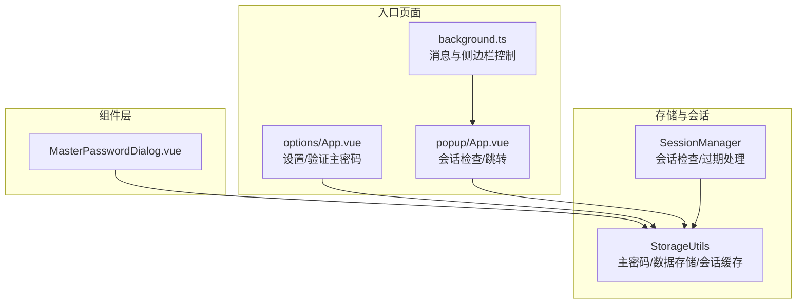
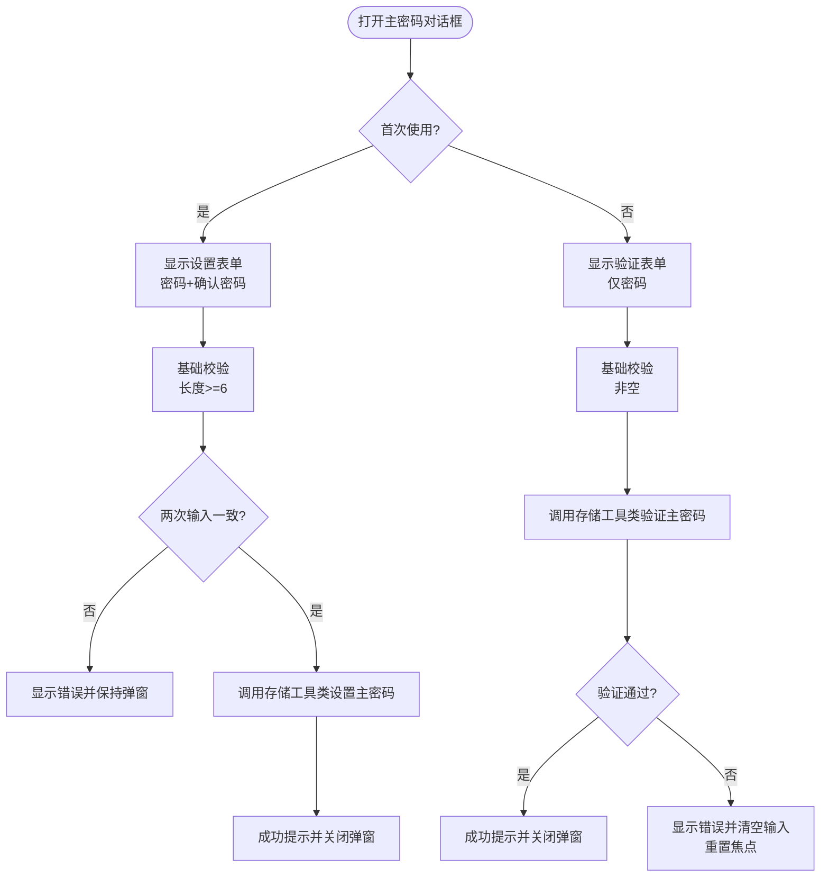
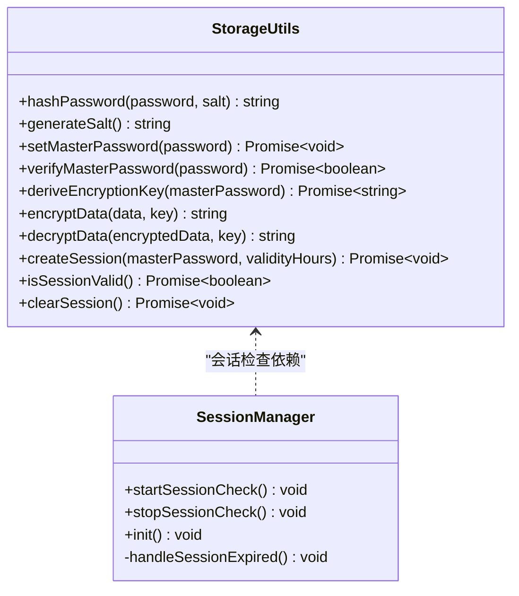
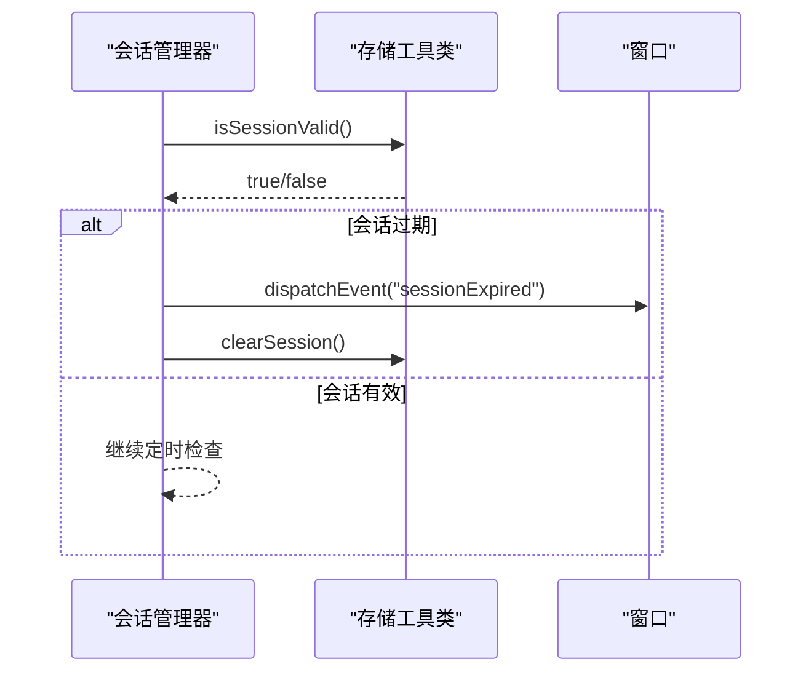
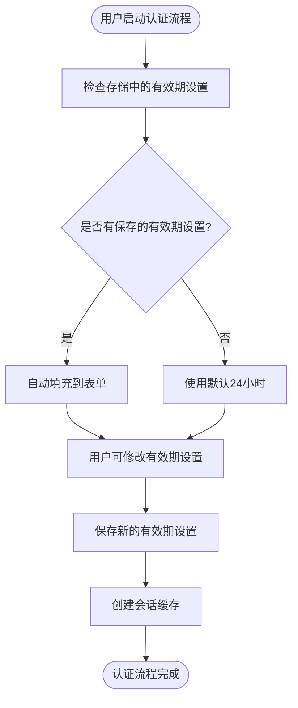
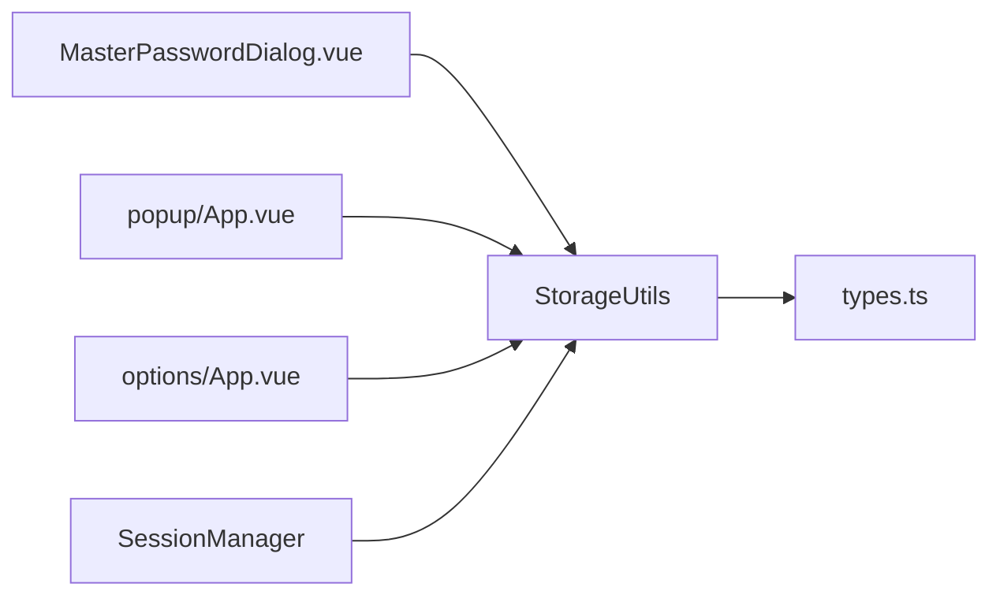
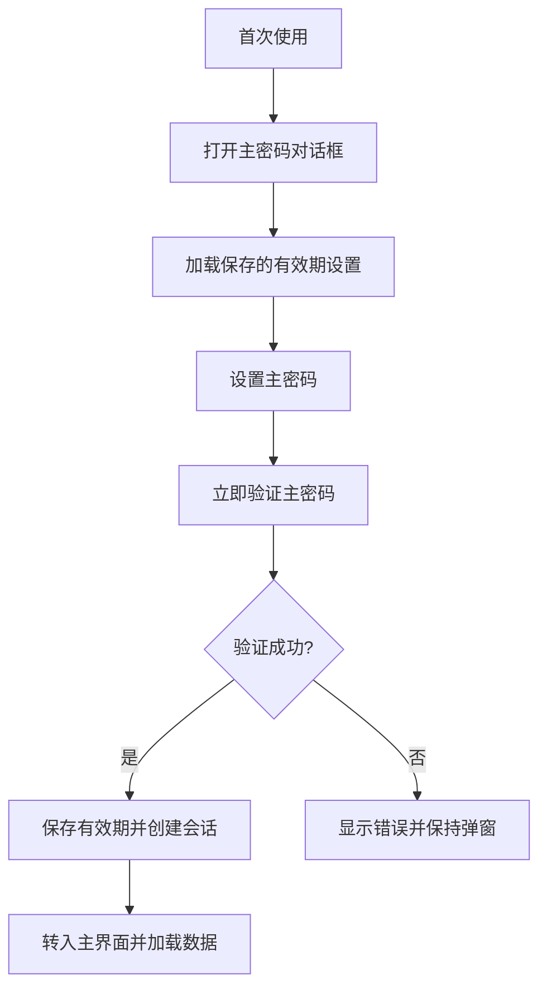

# 主密码对话框组件

<cite>
**本文档引用的文件**
- [MasterPasswordDialog.vue](file://components/MasterPasswordDialog.vue)
- [storage.ts](file://utils/storage.ts)
- [sessionManager.ts](file://utils/sessionManager.ts)
- [types.ts](file://utils/types.ts)
- [App.vue](file://entrypoints/options/App.vue)
- [background.ts](file://entrypoints/background.ts)
- [popup/App.vue](file://entrypoints/popup/App.vue)
- [README.md](file://README.md)
</cite>

## 更新摘要
**变更内容**
- 更新了主密码对话框组件的有效期设置加载机制
- 增强了用户启动认证流程时的表单自动填充功能
- 改进了会话偏好在应用程序重启和会话边界之间的保持机制
- 优化了有效期设置的持久化和恢复策略

## 目录
1. [简介](#简介)
2. [项目结构](#项目结构)
3. [核心组件](#核心组件)
4. [架构总览](#架构总览)
5. [详细组件分析](#详细组件分析)
6. [依赖关系分析](#依赖关系分析)
7. [性能考虑](#性能考虑)
8. [故障排除指南](#故障排除指南)
9. [结论](#结论)
10. [附录](#附录)

## 简介
本文件为主密码对话框组件的详细技术文档，覆盖主密码设置与验证的完整实现机制，包括密码强度校验、确认验证、安全存储策略、与会话管理器的集成、会话建立与缓存管理策略、完整的使用流程、安全最佳实践、密码策略配置与用户体验优化方案，以及故障排除指南。

## 项目结构
主密码对话框组件位于组件层，配合存储工具类、会话管理器与入口页面共同构成完整的主密码安全体系。关键模块职责如下：
- 组件层：主密码对话框负责用户交互与基础校验
- 存储层：提供主密码配置、哈希、派生密钥、加密解密、会话缓存等能力
- 会话管理层：周期性检查会话有效性，过期时清理并触发事件
- 入口页面：选项页与弹出页在会话有效时提供功能访问，在无效时引导至验证流程



**图表来源**
- [MasterPasswordDialog.vue](file://components/MasterPasswordDialog.vue#L1-L447)
- [storage.ts](file://utils/storage.ts#L37-L1072)
- [sessionManager.ts](file://utils/sessionManager.ts#L1-L87)
- [App.vue](file://entrypoints/options/App.vue#L1-L2460)
- [popup/App.vue](file://entrypoints/popup/App.vue#L1-L264)
- [background.ts](file://entrypoints/background.ts#L1-L232)

**章节来源**
- [MasterPasswordDialog.vue](file://components/MasterPasswordDialog.vue#L1-L447)
- [storage.ts](file://utils/storage.ts#L37-L1072)
- [sessionManager.ts](file://utils/sessionManager.ts#L1-L87)
- [App.vue](file://entrypoints/options/App.vue#L1-L2460)
- [popup/App.vue](file://entrypoints/popup/App.vue#L1-L264)
- [background.ts](file://entrypoints/background.ts#L1-L232)

## 核心组件
- 主密码对话框组件：提供首次设置与后续验证两种模式，内置基础校验规则与错误提示，调用存储工具类完成主密码设置与验证，并在成功后触发事件。
- 存储工具类：封装主密码配置存储、哈希与盐值生成、PBKDF2派生密钥、AES加密解密、会话缓存创建与清理、会话有效性检查等。
- 会话管理器：定时检查会话有效性，过期时清理并触发自定义事件，供其他组件响应。
- 入口页面：选项页负责设置/验证主密码并创建会话；弹出页在会话有效时提供功能入口，在无效时引导至验证流程。

**章节来源**
- [MasterPasswordDialog.vue](file://components/MasterPasswordDialog.vue#L92-L238)
- [storage.ts](file://utils/storage.ts#L37-L1072)
- [sessionManager.ts](file://utils/sessionManager.ts#L1-L87)
- [App.vue](file://entrypoints/options/App.vue#L1071-L1114)
- [popup/App.vue](file://entrypoints/popup/App.vue#L59-L90)

## 架构总览
主密码安全架构围绕"主密码配置 + 会话缓存 + 会话检查"展开。组件通过存储工具类完成主密码设置与验证，验证成功后创建会话缓存并持久化有效期；会话管理器定时检查会话有效性，过期时清理并触发事件；入口页面在会话有效时提供功能访问，在无效时引导至验证流程。

```mermaid
sequenceDiagram
participant U as "用户"
participant MPD as "主密码对话框"
participant SU as "存储工具类"
participant SM as "会话管理器"
participant OPT as "选项页"
participant POP as "弹出页"
U->>MPD : 打开设置/验证主密码
MPD->>SU : setMasterPassword()/verifyMasterPassword()
SU-->>MPD : 返回结果
alt 验证成功
MPD->>SU : createSession(validityHours)
SU-->>MPD : 会话缓存创建完成
MPD-->>U : 成功提示并关闭弹窗
SM->>SU : 定时检查 isSessionValid()
SU-->>SM : 会话有效/过期
else 验证失败
MPD-->>U : 错误提示并保持弹窗
end
OPT->>SU : 验证主密码并创建会话
POP->>SU : 检查 isSessionValid()
SU-->>POP : 有效/无效
```

**图表来源**
- [MasterPasswordDialog.vue](file://components/MasterPasswordDialog.vue#L177-L237)
- [storage.ts](file://utils/storage.ts#L793-L841)
- [sessionManager.ts](file://utils/sessionManager.ts#L27-L66)
- [App.vue](file://entrypoints/options/App.vue#L1085-L1114)
- [popup/App.vue](file://entrypoints/popup/App.vue#L63-L83)

## 详细组件分析

### 主密码对话框组件
- 功能模式
  - 首次使用：显示设置主密码表单，包含密码与确认密码字段，基础长度校验与重复输入一致性校验。
  - 后续使用：显示验证主密码表单，仅密码字段，验证失败时不清空输入框，便于用户重试。
- 安全设计
  - 密码输入隐藏：使用密码输入框类型与自动完成策略，避免浏览器自动填充。
  - 重复输入验证：通过自定义校验器确保两次输入一致。
  - 错误提示机制：集中显示错误消息，失败时清空输入并聚焦到输入框，提升用户体验。
- 与存储工具类交互
  - 设置主密码：调用存储工具类设置主密码并立即验证，成功后触发事件。
  - 验证主密码：调用存储工具类验证，成功后触发事件，失败时显示错误并重置焦点。
- 与入口页面集成
  - 选项页在设置成功后转入主界面并加载数据；弹出页在会话有效时提供功能入口。



**图表来源**
- [MasterPasswordDialog.vue](file://components/MasterPasswordDialog.vue#L124-L153)
- [MasterPasswordDialog.vue](file://components/MasterPasswordDialog.vue#L177-L237)

**章节来源**
- [MasterPasswordDialog.vue](file://components/MasterPasswordDialog.vue#L1-L447)

### 存储工具类（主密码与会话）
- 主密码配置与校验
  - 生成随机盐值与MD5哈希，保存主密码配置；设置后立即验证确保一致性。
  - 验证时根据存储的盐值对输入密码进行哈希比对。
- PBKDF2派生密钥与AES加密
  - 使用PBKDF2从主密码与盐值派生密钥，结合AES-256-CBC加密，增强数据安全。
  - 支持条目级加密与解密，解密失败时安全回退为明文或空字符串。
- 会话缓存与有效期
  - 会话缓存存储加密后的主密码、过期时间与有效期小时数，内存中维护会话密钥。
  - isSessionValid()检查内存缓存或从存储恢复，过期则清理并返回无效。
  - createSession()创建会话并持久化；clearSession()清理内存与存储。
- 数据存储键与排序配置
  - 统一管理主密码配置、密码条目、设置、排序配置等键名，保证数据隔离与一致性。



**图表来源**
- [storage.ts](file://utils/storage.ts#L37-L1072)
- [sessionManager.ts](file://utils/sessionManager.ts#L6-L87)

**章节来源**
- [storage.ts](file://utils/storage.ts#L37-L1072)
- [types.ts](file://utils/types.ts#L4-L49)

### 会话管理器
- 单例模式：提供全局唯一的会话管理器实例。
- 定时检查：每分钟检查一次会话有效性，过期时触发自定义事件并清理会话。
- 生命周期：初始化时启动检查，页面卸载时停止检查，确保资源释放。



**图表来源**
- [sessionManager.ts](file://utils/sessionManager.ts#L27-L66)
- [storage.ts](file://utils/storage.ts#L793-L841)

**章节来源**
- [sessionManager.ts](file://utils/sessionManager.ts#L1-L87)

### 入口页面与主密码流程
- 选项页（设置/验证主密码）
  - 设置主密码：表单校验后调用存储工具类设置主密码，随后保存有效期并创建会话，转入主界面。
  - 验证主密码：校验通过后保存有效期并创建会话，转入主界面。
- 弹出页（会话检查）
  - 初始化时检查会话有效性，有效则加载密码数量，无效则跳转至选项页进行验证。

```mermaid
sequenceDiagram
participant POP as "弹出页"
participant SU as "存储工具类"
participant OPT as "选项页"
POP->>SU : isSessionValid()
alt 会话有效
POP->>SU : getSessionMasterPassword()
POP->>SU : getAllPasswords(masterPassword)
POP-->>POP : 显示密码数量
else 会话无效
POP->>OPT : 打开选项页
end
```

**图表来源**
- [popup/App.vue](file://entrypoints/popup/App.vue#L63-L83)
- [App.vue](file://entrypoints/options/App.vue#L1085-L1114)

**章节来源**
- [App.vue](file://entrypoints/options/App.vue#L1071-L1114)
- [popup/App.vue](file://entrypoints/popup/App.vue#L59-L90)

### 有效期设置与偏好保持机制
**更新** 主密码对话框组件现在能够正确加载和应用保存的有效期设置，包括在用户启动认证流程时自动填充表单字段。

- 有效期设置加载
  - 首次使用时：从存储中读取之前保存的有效期设置，自动填充到设置表单中。
  - 验证时：从存储中读取有效期设置，自动填充到验证表单中。
  - 会话设置：在有效期设置弹窗中显示当前会话状态和剩余时间。
- 自动填充机制
  - 页面挂载时自动检查存储中的有效期设置并填充表单。
  - 会话过期事件触发时，自动加载并填充有效期设置。
  - 用户操作后，新的有效期设置会被立即保存并应用到当前会话。
- 偏好保持策略
  - 会话边界之间：通过chrome.storage.local持久化有效期设置。
  - 应用程序重启：从存储中恢复有效期设置，确保用户偏好不丢失。
  - 默认值处理：如果存储中没有有效期设置，默认使用24小时。



**图表来源**
- [App.vue](file://entrypoints/options/App.vue#L1007-L1048)
- [App.vue](file://entrypoints/options/App.vue#L982-L994)

**章节来源**
- [App.vue](file://entrypoints/options/App.vue#L1007-L1048)
- [App.vue](file://entrypoints/options/App.vue#L982-L994)
- [storage.ts](file://utils/storage.ts#L724-L765)

## 依赖关系分析
- 组件依赖存储工具类：主密码对话框直接调用存储工具类进行设置与验证。
- 会话管理器依赖存储工具类：会话检查基于存储工具类的会话有效性判断。
- 入口页面依赖存储工具类：选项页与弹出页均依赖存储工具类进行会话检查与数据访问。
- 类型定义：统一的接口与枚举确保跨模块类型一致性。



**图表来源**
- [MasterPasswordDialog.vue](file://components/MasterPasswordDialog.vue#L96)
- [storage.ts](file://utils/storage.ts#L1-L1072)
- [types.ts](file://utils/types.ts#L1-L96)
- [sessionManager.ts](file://utils/sessionManager.ts#L1-L87)
- [App.vue](file://entrypoints/options/App.vue#L1-L2460)
- [popup/App.vue](file://entrypoints/popup/App.vue#L1-L264)

**章节来源**
- [MasterPasswordDialog.vue](file://components/MasterPasswordDialog.vue#L92-L238)
- [storage.ts](file://utils/storage.ts#L37-L1072)
- [sessionManager.ts](file://utils/sessionManager.ts#L1-L87)
- [App.vue](file://entrypoints/options/App.vue#L1-L2460)
- [popup/App.vue](file://entrypoints/popup/App.vue#L1-L264)
- [types.ts](file://utils/types.ts#L1-L96)

## 性能考虑
- 会话检查频率：每分钟检查一次，平衡性能与安全性。
- 加密成本：PBKDF2迭代次数与AES加解密在设置/验证时执行，属于低频操作，对用户体验影响有限。
- 存储访问：主密码与会话信息通过chrome.storage.local访问，建议避免频繁读写，合并操作以减少I/O。
- UI响应：表单校验与错误提示在前端即时反馈，避免不必要的网络请求。
- 有效期设置缓存：内存中缓存有效期设置，减少存储访问频率。

## 故障排除指南
- 设置主密码失败
  - 现象：设置后立即验证失败或保存失败。
  - 排查：检查存储工具类的设置流程与验证逻辑，确认盐值与哈希生成正确。
  - 参考路径：[storage.ts](file://utils/storage.ts#L76-L114)
- 验证主密码失败
  - 现象：输入正确主密码仍提示错误。
  - 排查：确认存储中主密码配置存在且包含盐值与哈希；检查哈希计算与比对逻辑。
  - 参考路径：[storage.ts](file://utils/storage.ts#L119-L143)
- 会话过期导致功能不可用
  - 现象：会话检查返回无效，无法访问密码列表。
  - 排查：检查会话缓存是否正确创建与持久化；确认定时检查是否正常运行；查看过期时间是否正确。
  - 参考路径：[storage.ts](file://utils/storage.ts#L793-L841)，[sessionManager.ts](file://utils/sessionManager.ts#L27-L66)
- 弹出页无法显示密码数量
  - 现象：会话无效时不显示密码数量。
  - 排查：确认弹出页初始化时的会话检查逻辑；检查存储工具类的会话有效性判断。
  - 参考路径：[popup/App.vue](file://entrypoints/popup/App.vue#L63-L83)
- AES解密异常
  - 现象：解密失败或返回空字符串。
  - 排查：检查密钥生成与派生过程；确认Base64解析与IV提取逻辑；查看解密失败时的安全回退。
  - 参考路径：[storage.ts](file://utils/storage.ts#L219-L297)
- 有效期设置加载失败
  - 现象：用户启动认证流程时，有效期设置未自动填充。
  - 排查：检查getMasterPasswordValidityHours()方法是否正确从存储中读取设置；确认内存缓存逻辑。
  - 参考路径：[storage.ts](file://utils/storage.ts#L724-L765)，[App.vue](file://entrypoints/options/App.vue#L1007-L1048)

**章节来源**
- [storage.ts](file://utils/storage.ts#L76-L143)
- [storage.ts](file://utils/storage.ts#L793-L841)
- [storage.ts](file://utils/storage.ts#L219-L297)
- [sessionManager.ts](file://utils/sessionManager.ts#L27-L66)
- [popup/App.vue](file://entrypoints/popup/App.vue#L63-L83)
- [storage.ts](file://utils/storage.ts#L724-L765)
- [App.vue](file://entrypoints/options/App.vue#L1007-L1048)

## 结论
主密码对话框组件通过简洁的UI与严格的校验规则，结合存储工具类的主密码配置与会话缓存机制，实现了安全可控的主密码设置与验证流程。最新的改进增强了有效期设置的加载和应用能力，确保用户偏好在应用程序重启和会话边界之间得到尊重。会话管理器的定时检查进一步增强了安全性与用户体验。整体架构清晰、职责分离明确，具备良好的可维护性与扩展性。

## 附录

### 安全最佳实践
- 密码策略配置
  - 首次设置时建议采用更强的密码策略（如包含字母、数字、特殊字符且长度≥8），并在选项页提供有效期选择（1-24小时）。
  - 参考路径：[App.vue](file://entrypoints/options/App.vue#L26-L33)，[App.vue](file://entrypoints/options/App.vue#L77-L103)
- 输入隐藏与自动完成
  - 使用密码输入框类型与自动完成策略，避免浏览器自动填充，降低泄露风险。
  - 参考路径：[MasterPasswordDialog.vue](file://components/MasterPasswordDialog.vue#L49-L75)
- 会话有效期与清理
  - 合理设置会话有效期，过期后自动清理会话缓存，防止长时间占用内存。
  - 参考路径：[storage.ts](file://utils/storage.ts#L742-L760)，[storage.ts](file://utils/storage.ts#L899-L916)
- 错误处理与回退
  - 解密失败时安全回退为明文或空字符串，避免数据损坏影响整体功能。
  - 参考路径：[storage.ts](file://utils/storage.ts#L285-L296)
- 有效期设置持久化
  - 通过chrome.storage.local持久化有效期设置，确保用户偏好在重启后仍然有效。
  - 参考路径：[storage.ts](file://utils/storage.ts#L747-L765)，[App.vue](file://entrypoints/options/App.vue#L1007-L1048)

### 使用流程图（概念性）


[本图为概念性流程示意，不对应具体源码文件]

### 有效期设置工作流
```mermaid
sequenceDiagram
participant U as "用户"
participant OPT as "选项页"
participant SU as "存储工具类"
U->>OPT : 启动认证流程
OPT->>SU : getMasterPasswordValidityHours()
SU-->>OPT : 返回保存的有效期设置
OPT->>OPT : 自动填充到表单
U->>OPT : 修改有效期设置
OPT->>SU : setMasterPasswordValidityHours()
OPT->>SU : createSession()
OPT-->>U : 认证成功
```

**图表来源**
- [App.vue](file://entrypoints/options/App.vue#L1007-L1048)
- [storage.ts](file://utils/storage.ts#L724-L765)
- [storage.ts](file://utils/storage.ts#L870-L899)