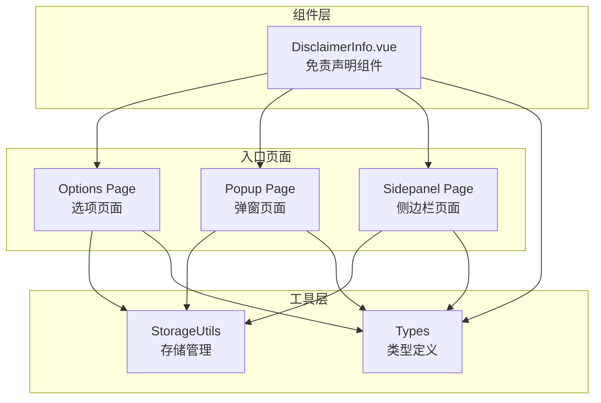
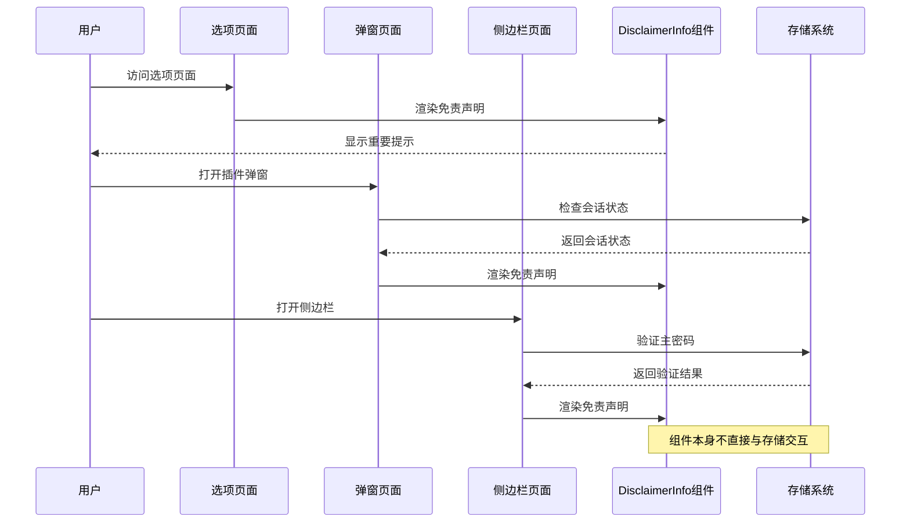
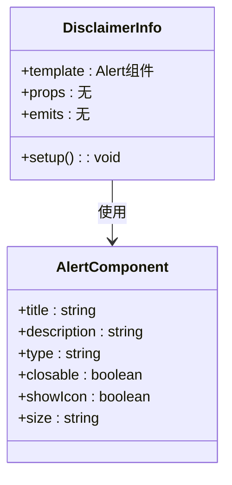
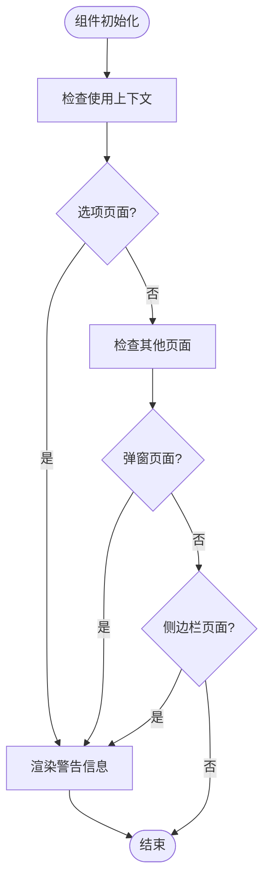
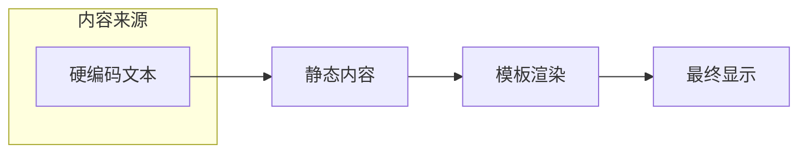
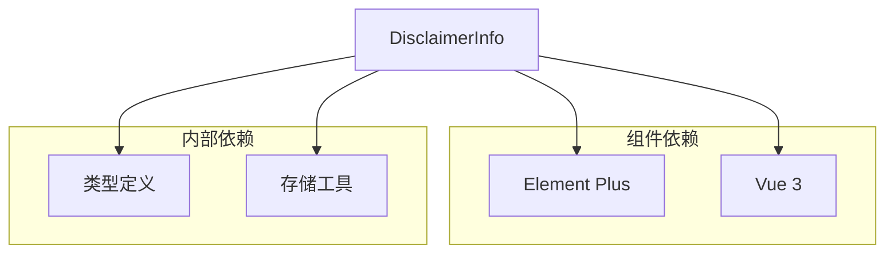

# 免责声明信息组件

<cite>
**本文档引用的文件**
- [DisclaimerInfo.vue](file://components/DisclaimerInfo.vue)
- [App.vue（选项页面）](file://entrypoints/options/App.vue)
- [App.vue（弹窗页面）](file://entrypoints/popup/App.vue)
- [App.vue（侧边栏页面）](file://entrypoints/sidepanel/App.vue)
- [storage.ts](file://utils/storage.ts)
- [types.ts](file://utils/types.ts)
- [package.json](file://package.json)
- [README.md](file://README.md)
</cite>

## 目录
1. [简介](#简介)
2. [项目结构](#项目结构)
3. [核心组件](#核心组件)
4. [架构概览](#架构概览)
5. [详细组件分析](#详细组件分析)
6. [依赖关系分析](#依赖关系分析)
7. [性能考量](#性能考量)
8. [故障排查指南](#故障排查指南)
9. [结论](#结论)
10. [附录](#附录)

## 简介
免责声明信息组件是一个轻量级的Vue组件，用于在插件界面中展示重要的法律和安全提示信息。该组件采用Element Plus的Alert组件实现，主要承担以下职责：
- 向用户明确插件的使用范围和限制
- 强调数据本地存储的安全特性
- 提醒用户不要保存敏感密码
- 说明插件仅用于开发和测试环境

组件设计简洁，专注于信息传达，不涉及复杂的业务逻辑或状态管理。

## 项目结构
该项目采用模块化架构，免责声明组件位于components目录下，被多个入口页面引用：

**图表来源**
- [DisclaimerInfo.vue](file://components/DisclaimerInfo.vue#L1-L20)
- [App.vue（选项页面）](file://entrypoints/options/App.vue#L118-L120)
- [App.vue（弹窗页面）](file://entrypoints/popup/App.vue#L1-L234)
- [App.vue（侧边栏页面）](file://entrypoints/sidepanel/App.vue#L1-L911)

**章节来源**
- [DisclaimerInfo.vue](file://components/DisclaimerInfo.vue#L1-L20)
- [App.vue（选项页面）](file://entrypoints/options/App.vue#L1-L2414)

## 核心组件
免责声明信息组件的核心实现非常简洁，主要包含以下要素：

### 组件结构
- **模板结构**：使用Element Plus的Alert组件包装
- **标题**："重要提示"
- **描述**：详细的使用限制和安全提醒
- **类型**：warning警告类型
- **样式**：小尺寸，带图标，不可关闭

### 设计特点
- **信息密度高**：在有限的空间内传达关键信息
- **视觉突出**：使用警告色和图标吸引注意
- **不可关闭**：确保用户必须看到这些重要信息
- **本地化**：中文内容，符合目标用户语言习惯

**章节来源**
- [DisclaimerInfo.vue](file://components/DisclaimerInfo.vue#L1-L20)

## 架构概览
免责声明组件在整个系统中的位置和交互关系如下：

**图表来源**
- [App.vue（选项页面）](file://entrypoints/options/App.vue#L118-L120)
- [App.vue（弹窗页面）](file://entrypoints/popup/App.vue#L59-L90)
- [App.vue（侧边栏页面）](file://entrypoints/sidepanel/App.vue#L649-L687)

## 详细组件分析

### 组件实现分析
免责声明组件采用Vue 3 Composition API的setup语法糖，实现了极简的设计理念：

**图表来源**
- [DisclaimerInfo.vue](file://components/DisclaimerInfo.vue#L1-L20)

### 展示逻辑分析
组件的展示逻辑遵循以下规则：

**图表来源**
- [App.vue（选项页面）](file://entrypoints/options/App.vue#L118-L120)
- [App.vue（弹窗页面）](file://entrypoints/popup/App.vue#L1-L234)
- [App.vue（侧边栏页面）](file://entrypoints/sidepanel/App.vue#L1-L911)

### 样式设计分析
组件采用Element Plus的Alert组件，样式设计遵循以下原则：

| 属性 | 值 | 设计意图 |
|------|-----|----------|
| type | warning | 强调重要性和潜在风险 |
| size | small | 适配各种页面布局 |
| showIcon | true | 视觉引导用户关注 |
| closable | false | 确保信息必须被阅读 |

### 内容管理机制
免责声明的内容管理采用静态配置方式：

**图表来源**
- [DisclaimerInfo.vue](file://components/DisclaimerInfo.vue#L4-L11)

**章节来源**
- [DisclaimerInfo.vue](file://components/DisclaimerInfo.vue#L1-L20)

## 依赖关系分析

### 外部依赖
组件的外部依赖关系相对简单：

**图表来源**
- [DisclaimerInfo.vue](file://components/DisclaimerInfo.vue#L1-L20)
- [package.json](file://package.json#L22-L27)

### 内部耦合度
组件与系统的耦合度极低：
- **无状态依赖**：不依赖应用状态
- **无业务逻辑**：仅负责信息展示
- **无存储访问**：不直接访问数据存储
- **无网络请求**：不进行任何网络通信

**章节来源**
- [DisclaimerInfo.vue](file://components/DisclaimerInfo.vue#L1-L20)
- [storage.ts](file://utils/storage.ts#L37-L981)

## 性能考量
由于组件的极简设计，性能开销几乎可以忽略：

### 渲染性能
- **无条件渲染**：在所有引用页面中都会渲染
- **无复杂计算**：不涉及任何计算属性或侦听器
- **无事件监听**：不绑定任何DOM事件

### 内存占用
- **零状态管理**：不持有任何组件状态
- **零生命周期钩子**：不需要mounted/unmounted等钩子
- **零外部资源**：不加载任何额外资源

## 故障排查指南

### 常见问题
1. **组件不显示**
   - 检查组件是否正确导入
   - 确认父组件中正确使用了组件标签

2. **样式异常**
   - 检查Element Plus是否正确安装
   - 确认CSS样式是否被覆盖

3. **内容过时**
   - 检查组件中的硬编码文本
   - 确认是否需要更新免责声明内容

### 调试建议
- 使用Vue DevTools检查组件树
- 查看浏览器控制台是否有错误信息
- 确认组件在所有目标页面中都正确渲染

**章节来源**
- [DisclaimerInfo.vue](file://components/DisclaimerInfo.vue#L1-L20)

## 结论
免责声明信息组件虽然功能简单，但在整个插件系统中扮演着重要的角色。它通过简洁而有效的设计，确保用户能够清晰地理解插件的使用限制和安全注意事项。组件的极简架构使其具有良好的可维护性和稳定性，同时保持了较低的性能开销。

## 附录

### 法律意义说明
免责声明组件在法律层面的作用：
- **风险告知**：明确告知用户插件的使用限制
- **责任声明**：强调数据本地存储和用户责任
- **合规提醒**：提醒用户不要保存敏感密码

### 用户同意流程
组件参与的用户同意流程：
1. 用户首次访问插件界面
2. 组件自动显示免责声明
3. 用户继续使用插件即表示接受条款
4. 后续操作中再次提醒重要注意事项

### 集成方式
组件在三个主要页面中的集成方式：
- **选项页面**：作为设置主密码流程的一部分
- **弹窗页面**：在插件图标点击时显示
- **侧边栏页面**：在密码快速填充功能中显示

### 内容更新策略
建议的内容更新策略：
- **定期审查**：每季度审查一次免责声明内容
- **合规更新**：根据法律法规变化及时调整
- **用户反馈**：收集用户对免责声明的理解反馈
- **版本管理**：将免责声明版本与插件版本关联

### 最佳实践
- **信息准确性**：确保免责声明内容准确反映插件功能
- **用户体验**：避免过度警告影响用户体验
- **可访问性**：确保免责声明对所有用户都可读
- **多语言支持**：考虑未来可能的国际化需求