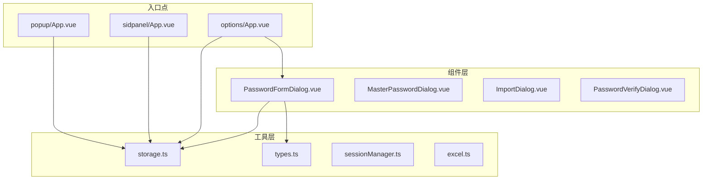
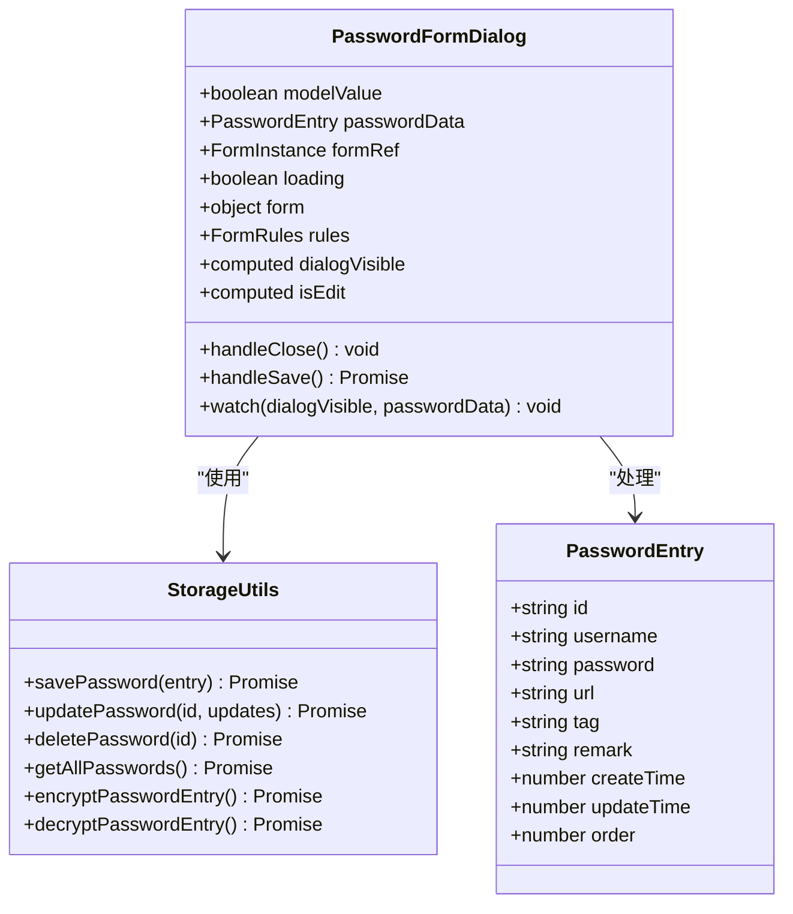
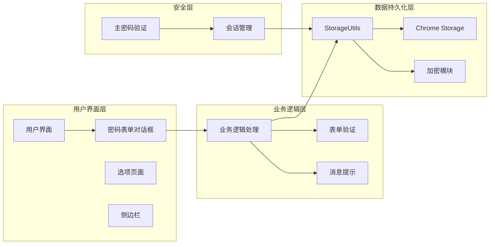
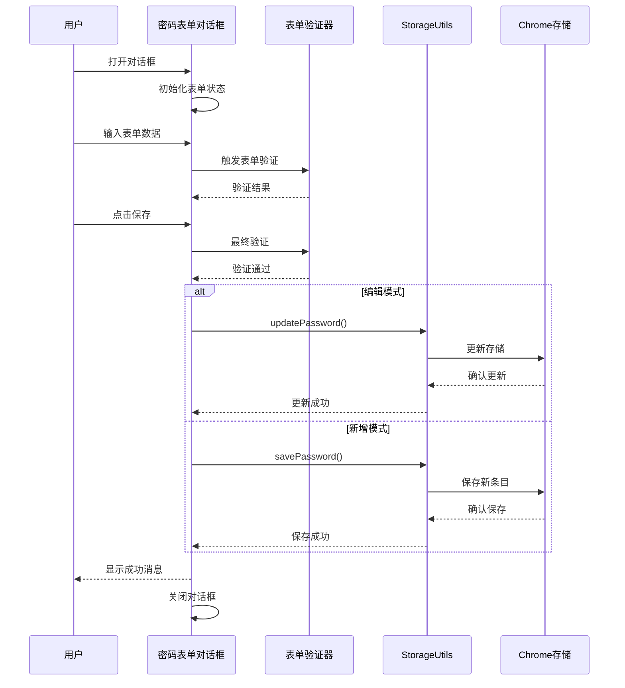
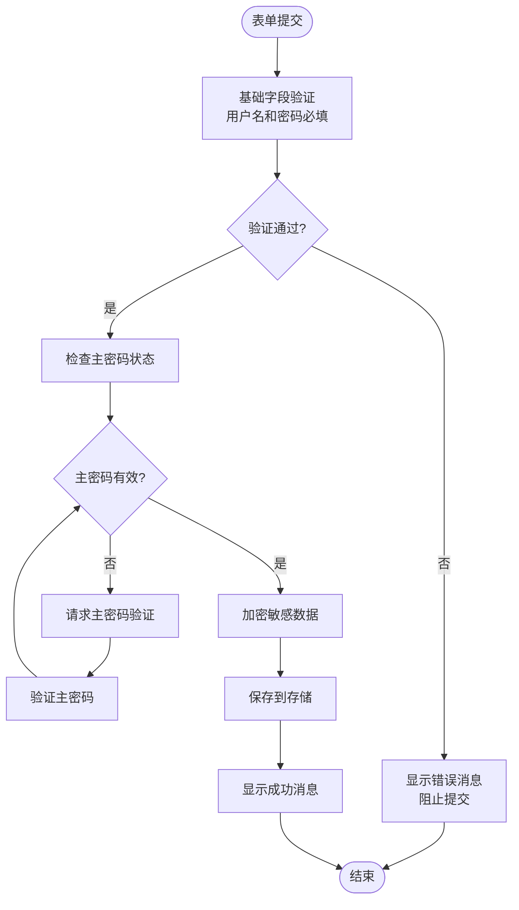
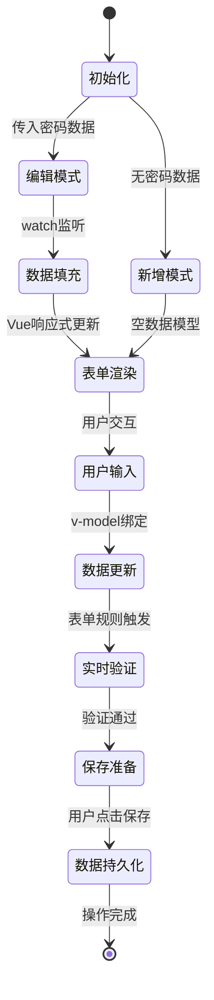
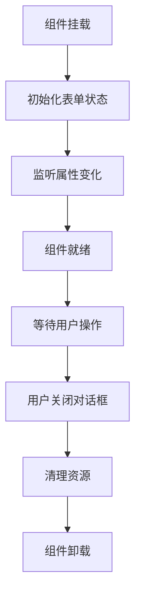
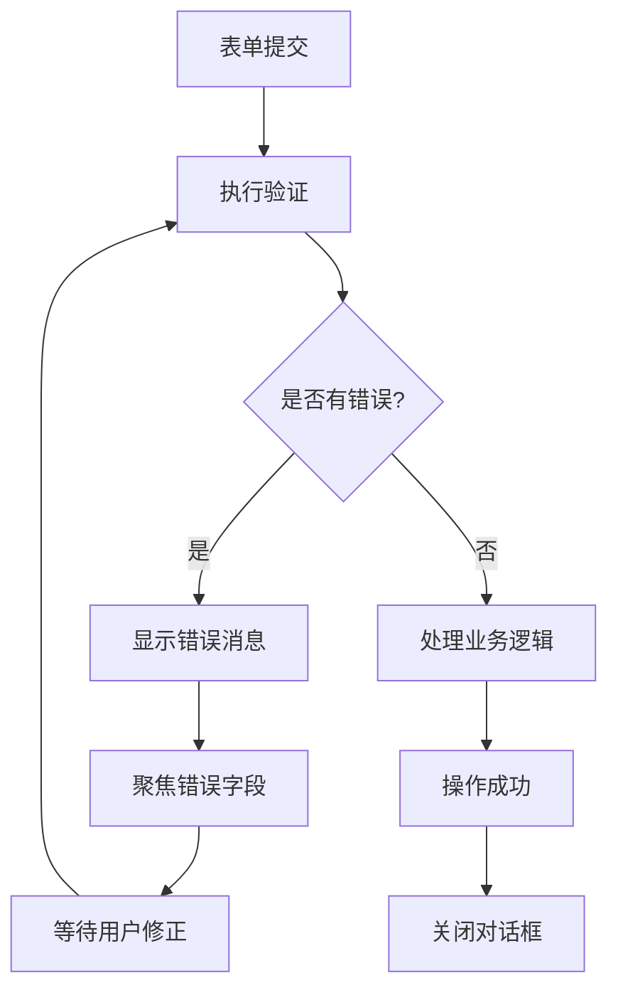
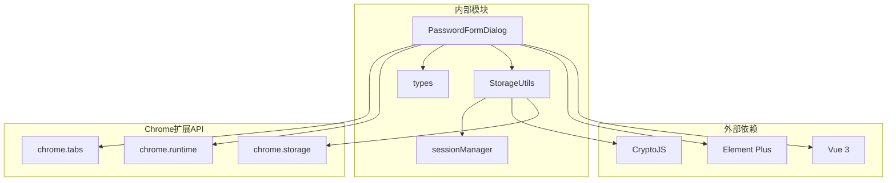
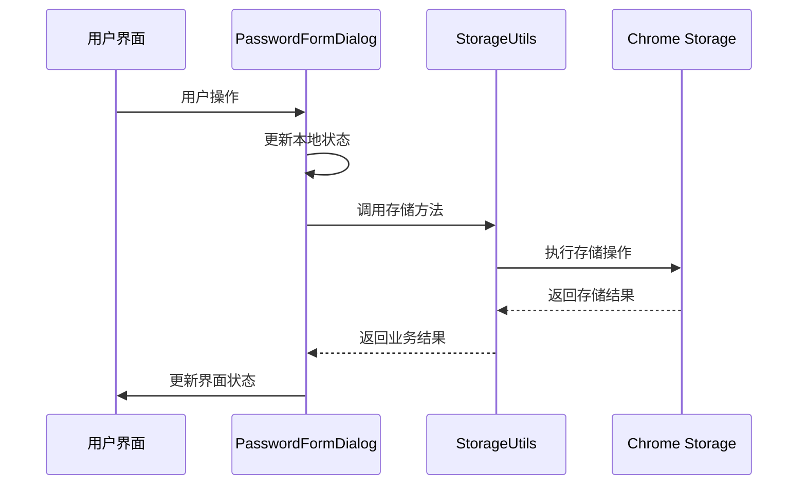

# 密码表单对话框组件

<cite>
**本文档引用的文件**
- [PasswordFormDialog.vue](file://components/PasswordFormDialog.vue)
- [storage.ts](file://utils/storage.ts)
- [types.ts](file://utils/types.ts)
- [App.vue](file://entrypoints/options/App.vue)
- [App.vue](file://entrypoints/sidepanel/App.vue)
</cite>

## 目录
1. [简介](#简介)
2. [项目结构](#项目结构)
3. [核心组件](#核心组件)
4. [架构概览](#架构概览)
5. [详细组件分析](#详细组件分析)
6. [依赖关系分析](#依赖关系分析)
7. [性能考虑](#性能考虑)
8. [故障排除指南](#故障排除指南)
9. [结论](#结论)

## 简介

密码表单对话框组件是密码管理助手系统中的核心交互组件，负责提供用户友好的密码条目管理界面。该组件实现了完整的CRUD（创建、读取、更新、删除）功能，支持密码条目的增删改查操作，并集成了强大的数据验证和持久化机制。

该组件采用现代化的Vue 3 Composition API设计，结合Element Plus UI框架，提供了直观易用的表单界面和流畅的用户体验。组件支持多种密码管理场景，包括新增密码条目、编辑现有条目、删除不需要的条目，以及与Chrome扩展存储系统的深度集成。

## 项目结构

密码表单对话框组件位于components目录下，采用模块化设计，与其他核心组件协同工作：



**图表来源**
- [PasswordFormDialog.vue](file://components/PasswordFormDialog.vue#L1-L336)
- [storage.ts](file://utils/storage.ts#L37-L800)
- [types.ts](file://utils/types.ts#L1-L96)

**章节来源**
- [PasswordFormDialog.vue](file://components/PasswordFormDialog.vue#L1-L336)
- [storage.ts](file://utils/storage.ts#L1-L981)

## 核心组件

### 组件架构设计

密码表单对话框组件采用响应式设计，支持两种操作模式：新增模式和编辑模式。组件通过Vue 3的Composition API实现了高度模块化的代码结构。



**图表来源**
- [PasswordFormDialog.vue](file://components/PasswordFormDialog.vue#L86-L200)
- [storage.ts](file://utils/storage.ts#L37-L461)
- [types.ts](file://utils/types.ts#L4-L41)

### 数据模型定义

组件使用统一的数据模型来表示密码条目，确保数据结构的一致性和完整性：

| 字段名 | 类型 | 必填 | 描述 | 长度限制 |
|--------|------|------|------|----------|
| id | string | 是 | 唯一标识符 | 自动生成 |
| username | string | 是 | 用户名或邮箱 | 最多50字符 |
| password | string | 否 | 密码 | 最多50字符 |
| url | string | 否 | 网站URL | 最多100字符 |
| tag | string | 否 | 标签分类 | 最多50字符 |
| remark | string | 否 | 备注说明 | 最多1000字符 |
| createTime | number | 是 | 创建时间戳 | 自动设置 |
| updateTime | number | 是 | 更新时间戳 | 自动更新 |
| order | number | 是 | 排序序号 | 自动分配 |

**章节来源**
- [types.ts](file://utils/types.ts#L4-L41)
- [PasswordFormDialog.vue](file://components/PasswordFormDialog.vue#L115-L121)

## 架构概览

### 整体系统架构

密码表单对话框组件在整个密码管理系统中扮演着关键角色，它与多个子系统协同工作：



**图表来源**
- [PasswordFormDialog.vue](file://components/PasswordFormDialog.vue#L86-L200)
- [storage.ts](file://utils/storage.ts#L37-L800)

### 组件间通信机制

组件通过事件驱动的方式实现松耦合的通信：



**图表来源**
- [PasswordFormDialog.vue](file://components/PasswordFormDialog.vue#L158-L199)
- [storage.ts](file://utils/storage.ts#L427-L461)

**章节来源**
- [PasswordFormDialog.vue](file://components/PasswordFormDialog.vue#L86-L200)
- [storage.ts](file://utils/storage.ts#L37-L800)

## 详细组件分析

### 表单字段验证规则

组件实现了严格的表单验证机制，确保数据质量和用户体验：

#### 基础验证规则

| 字段 | 验证规则 | 错误消息 | 触发时机 |
|------|----------|----------|----------|
| username | 必填验证 | 请输入用户名 | 失去焦点时 |
| password | 必填验证 | 请输入密码 | 失去焦点时 |
| url | 可选验证 | - | 失去焦点时 |
| tag | 可选验证 | - | 失去焦点时 |
| remark | 可选验证 | - | 失去焦点时 |

#### 高级验证特性

组件支持动态验证规则，根据不同的使用场景调整验证强度：



**图表来源**
- [PasswordFormDialog.vue](file://components/PasswordFormDialog.vue#L123-L126)
- [storage.ts](file://utils/storage.ts#L302-L322)

### 数据绑定机制

组件采用双向数据绑定实现表单与数据模型的实时同步：

#### 响应式数据流



**图表来源**
- [PasswordFormDialog.vue](file://components/PasswordFormDialog.vue#L128-L151)
- [PasswordFormDialog.vue](file://components/PasswordFormDialog.vue#L113-L121)

### CRUD操作实现

#### 新增密码条目

新增功能支持完整的密码条目创建流程：

1. **表单初始化**：清空表单数据，设置为新增模式
2. **用户输入**：填写用户名、密码、URL等字段
3. **数据验证**：执行基础验证规则
4. **数据保存**：调用StorageUtils.savePassword()
5. **状态更新**：刷新列表，显示成功消息

#### 编辑密码条目

编辑功能提供完整的条目修改能力：

1. **数据加载**：从props接收密码数据
2. **表单填充**：自动填充现有数据
3. **用户修改**：允许修改任意字段
4. **数据更新**：调用StorageUtils.updatePassword()
5. **状态同步**：更新UI状态，显示成功消息

#### 删除密码条目

删除功能提供安全的条目移除机制：

1. **确认对话框**：防止误操作
2. **动画效果**：提供视觉反馈
3. **数据清理**：调用StorageUtils.deletePassword()
4. **列表刷新**：更新显示状态

**章节来源**
- [PasswordFormDialog.vue](file://components/PasswordFormDialog.vue#L158-L199)
- [storage.ts](file://utils/storage.ts#L427-L492)

### 生命周期管理

组件实现了完整的生命周期管理，确保资源的有效利用：

#### 组件挂载阶段



**图表来源**
- [PasswordFormDialog.vue](file://components/PasswordFormDialog.vue#L128-L151)
- [PasswordFormDialog.vue](file://components/PasswordFormDialog.vue#L153-L156)

#### 状态同步策略

组件通过watch机制实现多源状态同步：

| 监听目标 | 触发条件 | 同步操作 |
|----------|----------|----------|
| dialogVisible | 状态变化 | 更新父组件状态 |
| passwordData | 数据变化 | 填充或重置表单 |
| form.username | 用户输入 | 实时验证 |
| form.password | 用户输入 | 实时验证 |

### 错误处理策略

组件实现了多层次的错误处理机制：

#### 表单验证错误



**图表来源**
- [PasswordFormDialog.vue](file://components/PasswordFormDialog.vue#L158-L199)

#### 存储操作错误

存储层提供了完善的错误处理和恢复机制：

| 错误类型 | 处理策略 | 用户反馈 |
|----------|----------|----------|
| 网络异常 | 自动重试 | 显示网络错误 |
| 存储空间不足 | 清理缓存 | 提示清理空间 |
| 数据损坏 | 数据修复 | 显示修复进度 |
| 权限拒绝 | 引导授权 | 显示权限说明 |

**章节来源**
- [PasswordFormDialog.vue](file://components/PasswordFormDialog.vue#L193-L198)
- [storage.ts](file://utils/storage.ts#L423-L425)

## 依赖关系分析

### 组件依赖图



**图表来源**
- [PasswordFormDialog.vue](file://components/PasswordFormDialog.vue#L87-L91)
- [storage.ts](file://utils/storage.ts#L1-L7)

### 数据流依赖

组件的数据流遵循单向数据流原则，确保状态管理的可预测性：



**图表来源**
- [PasswordFormDialog.vue](file://components/PasswordFormDialog.vue#L158-L199)
- [storage.ts](file://utils/storage.ts#L377-L426)

**章节来源**
- [PasswordFormDialog.vue](file://components/PasswordFormDialog.vue#L86-L200)
- [storage.ts](file://utils/storage.ts#L37-L800)

## 性能考虑

### 性能优化策略

组件采用了多项性能优化措施：

#### 渲染优化

- **懒加载**：对话框内容按需渲染
- **虚拟滚动**：大量数据时使用虚拟滚动
- **防抖处理**：输入验证使用防抖减少计算开销

#### 存储优化

- **增量更新**：只更新变化的数据
- **批量操作**：支持批量删除和更新
- **缓存策略**：合理使用内存缓存

#### 内存管理

- **及时清理**：组件卸载时清理事件监听器
- **弱引用**：避免循环引用
- **垃圾回收**：定期清理临时数据

### 性能监控

组件内置了性能监控机制：

| 监控指标 | 目标值 | 警告阈值 | 处理策略 |
|----------|--------|----------|----------|
| 表单渲染时间 | < 100ms | < 500ms | 优化渲染逻辑 |
| 存储操作延迟 | < 200ms | < 1000ms | 异步处理 |
| 内存使用 | < 50MB | < 100MB | 清理缓存 |
| CPU使用率 | < 50% | < 80% | 优化算法 |

## 故障排除指南

### 常见问题诊断

#### 表单验证问题

**问题症状**：表单验证不生效或验证结果异常

**诊断步骤**：
1. 检查表单规则定义
2. 验证v-model绑定状态
3. 查看控制台错误信息
4. 确认Element Plus版本兼容性

**解决方案**：
- 重新初始化表单实例
- 检查验证规则语法
- 更新Element Plus到最新版本

#### 存储操作失败

**问题症状**：密码保存或更新失败

**诊断步骤**：
1. 检查Chrome存储权限
2. 验证存储空间是否充足
3. 确认网络连接状态
4. 查看存储API返回错误

**解决方案**：
- 重新授权存储权限
- 清理存储空间
- 检查网络连接
- 实现重试机制

#### 数据同步问题

**问题症状**：界面显示与实际数据不一致

**诊断步骤**：
1. 检查watch监听器状态
2. 验证数据流向
3. 确认异步操作完成
4. 查看组件生命周期

**解决方案**：
- 重新设置watch监听
- 确保异步操作顺序
- 实现数据一致性检查

### 调试技巧

#### 开发者工具使用

- **Vue DevTools**：检查组件状态和props传递
- **Chrome DevTools**：监控网络请求和存储操作
- **Console日志**：添加关键操作的日志输出

#### 错误追踪

```javascript
// 建议的错误处理模式
try {
  // 可能失败的操作
} catch (error) {
  console.error('操作失败:', {
    operation: '具体操作名称',
    error: error.message,
    timestamp: Date.now(),
    data: '相关数据快照'
  });
  // 向用户显示友好错误消息
}
```

**章节来源**
- [PasswordFormDialog.vue](file://components/PasswordFormDialog.vue#L193-L198)
- [storage.ts](file://utils/storage.ts#L423-L425)

## 结论

密码表单对话框组件是一个功能完整、设计精良的密码管理界面组件。它成功地将复杂的业务逻辑封装在简洁的API背后，为用户提供了直观易用的密码管理体验。

### 主要优势

1. **用户体验优秀**：直观的表单设计和流畅的交互流程
2. **功能完整**：支持完整的CRUD操作和高级验证功能
3. **安全性强**：集成主密码验证和数据加密机制
4. **可维护性好**：模块化设计和清晰的代码结构
5. **性能优异**：优化的渲染和存储策略

### 技术亮点

- **响应式设计**：完美适配不同屏幕尺寸
- **错误处理**：完善的异常捕获和用户提示
- **状态管理**：清晰的组件状态流转
- **数据持久化**：可靠的Chrome存储集成

### 改进建议

1. **国际化支持**：添加多语言支持
2. **主题定制**：提供更多外观定制选项
3. **快捷键支持**：增加键盘快捷键操作
4. **批量操作**：增强批量管理功能
5. **数据导入导出**：支持更多格式的数据交换

该组件为整个密码管理系统的用户界面奠定了坚实的基础，其设计理念和实现方式值得在类似的表单组件开发中借鉴和参考。