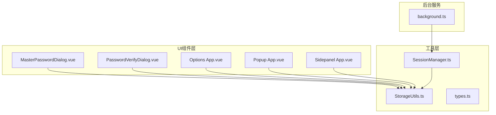
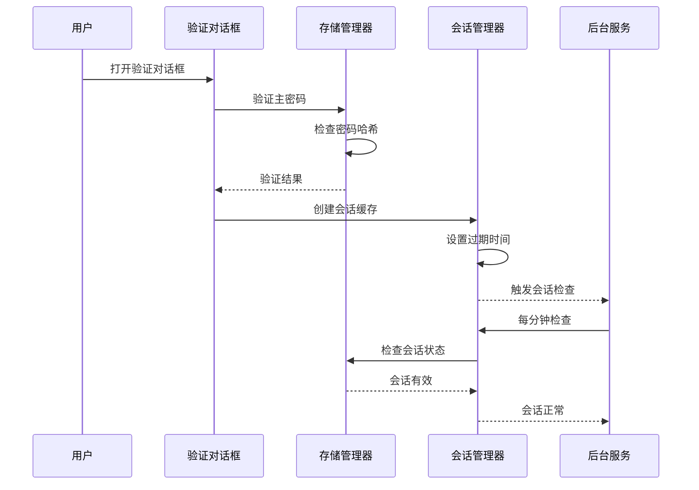
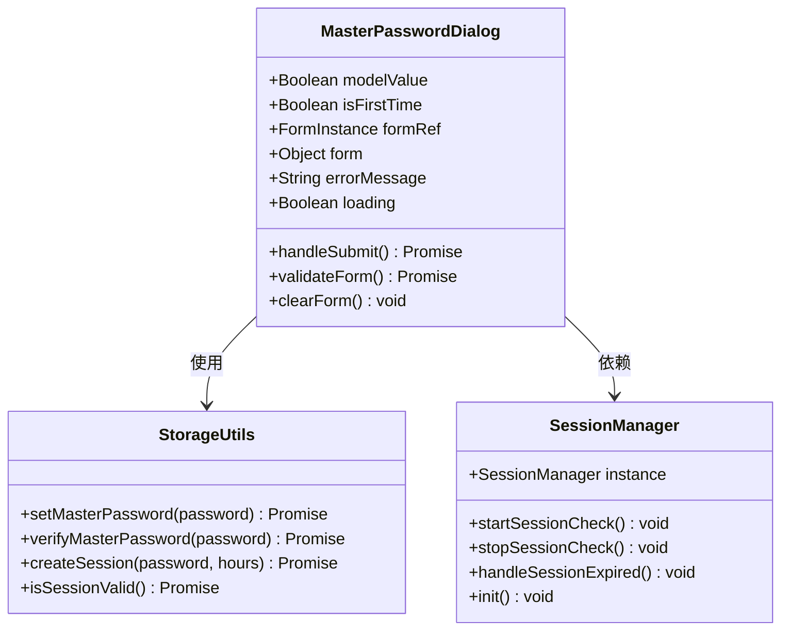
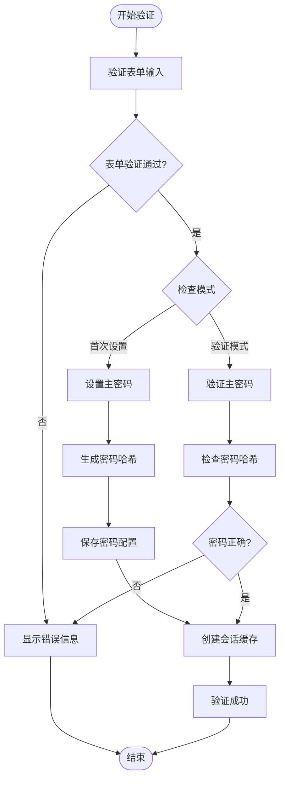
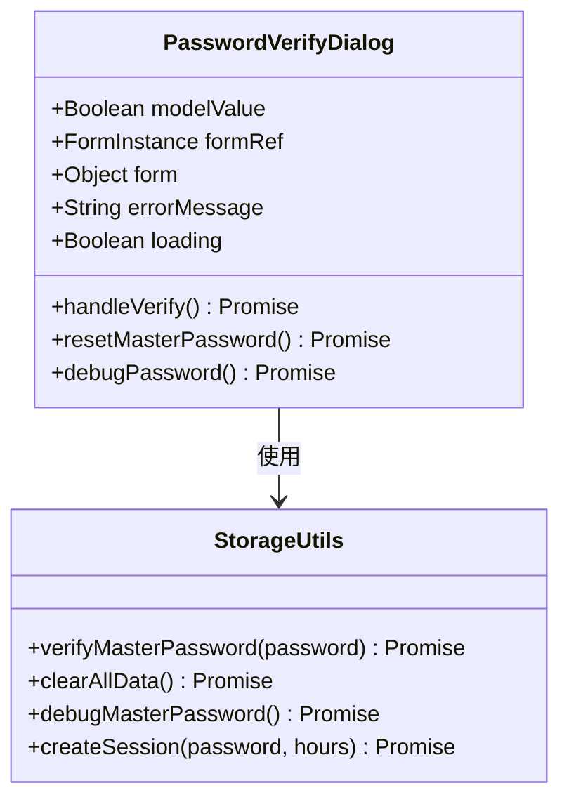
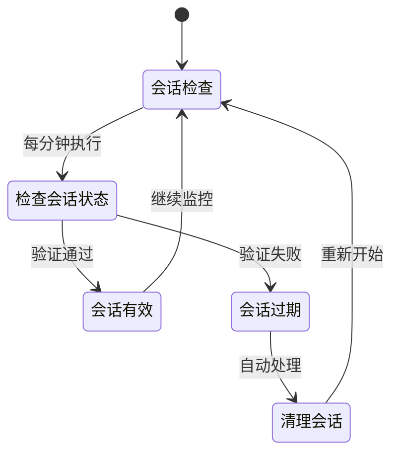
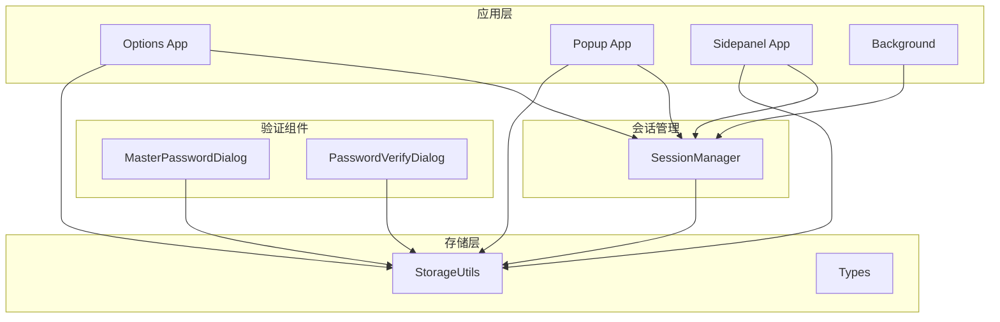

# 密码验证对话框组件

<cite>
**本文档引用的文件**
- [MasterPasswordDialog.vue](file://components/MasterPasswordDialog.vue)
- [PasswordVerifyDialog.vue](file://components/PasswordVerifyDialog.vue)
- [sessionManager.ts](file://utils/sessionManager.ts)
- [storage.ts](file://utils/storage.ts)
- [types.ts](file://utils/types.ts)
- [App.vue（选项页面）](file://entrypoints/options/App.vue)
- [App.vue（弹窗页面）](file://entrypoints/popup/App.vue)
- [App.vue（侧边栏页面）](file://entrypoints/sidepanel/App.vue)
- [background.ts](file://entrypoints/background.ts)
- [package.json](file://package.json)
</cite>

## 目录
1. [简介](#简介)
2. [项目结构](#项目结构)
3. [核心组件](#核心组件)
4. [架构概览](#架构概览)
5. [详细组件分析](#详细组件分析)
6. [依赖关系分析](#依赖关系分析)
7. [性能考虑](#性能考虑)
8. [故障排除指南](#故障排除指南)
9. [结论](#结论)

## 简介

密码验证对话框组件是Chrome扩展"账号密码助手"中的核心安全组件，负责管理主密码验证、会话状态检查和权限授权流程。该组件实现了完整的密码验证机制，包括首次设置主密码、验证现有主密码、会话生命周期管理和自动续期策略。

系统采用多层安全架构，结合前端Vue组件、后端存储管理和会话管理器，确保用户数据的安全性和用户体验的流畅性。

## 项目结构

项目采用模块化架构，主要分为以下几个核心模块：

**图表来源**
- [MasterPasswordDialog.vue](file://components/MasterPasswordDialog.vue#L1-L447)
- [PasswordVerifyDialog.vue](file://components/PasswordVerifyDialog.vue#L1-L474)
- [sessionManager.ts](file://utils/sessionManager.ts#L1-L87)
- [storage.ts](file://utils/storage.ts#L1-L981)

**章节来源**
- [package.json](file://package.json#L1-L49)

## 核心组件

### 主密码对话框组件

主密码对话框组件负责处理主密码的首次设置和验证流程：

- **首次设置模式**：提供密码强度验证、确认密码功能
- **验证模式**：验证用户输入的主密码正确性
- **错误处理**：完善的错误提示和重试机制
- **用户体验**：全屏对话框设计，专注验证体验

### 密码验证对话框组件

独立的密码验证组件，提供标准的验证界面：

- **简洁界面**：专注于密码输入和验证
- **调试功能**：内置主密码配置调试信息
- **重置功能**：提供数据重置选项
- **安全提示**：警告信息提醒用户注意安全

### 会话管理器

全局会话管理器负责：
- **会话状态监控**：每分钟检查会话有效性
- **自动过期处理**：会话过期时自动清理
- **事件通知**：通过自定义事件通知组件
- **生命周期管理**：完整的会话创建、维护和清理

**章节来源**
- [MasterPasswordDialog.vue](file://components/MasterPasswordDialog.vue#L92-L238)
- [PasswordVerifyDialog.vue](file://components/PasswordVerifyDialog.vue#L100-L202)
- [sessionManager.ts](file://utils/sessionManager.ts#L6-L86)

## 架构概览

系统采用分层架构设计，确保安全性和可维护性：

**图表来源**
- [App.vue（选项页面）](file://entrypoints/options/App.vue#L1085-L1136)
- [storage.ts](file://utils/storage.ts#L865-L894)
- [sessionManager.ts](file://utils/sessionManager.ts#L27-L44)

## 详细组件分析

### 主密码对话框组件分析

#### 组件结构

**图表来源**
- [MasterPasswordDialog.vue](file://components/MasterPasswordDialog.vue#L92-L238)
- [storage.ts](file://utils/storage.ts#L76-L143)
- [sessionManager.ts](file://utils/sessionManager.ts#L6-L86)

#### 验证逻辑流程

**图表来源**
- [MasterPasswordDialog.vue](file://components/MasterPasswordDialog.vue#L177-L237)
- [storage.ts](file://utils/storage.ts#L76-L143)

#### 错误处理机制

组件实现了多层次的错误处理：

1. **表单验证错误**：实时验证用户输入
2. **密码验证错误**：密码错误时的友好提示
3. **系统错误处理**：捕获和处理异常情况
4. **自动重置机制**：错误发生时自动清理状态

### 密码验证对话框组件分析

#### 组件特性

**图表来源**
- [PasswordVerifyDialog.vue](file://components/PasswordVerifyDialog.vue#L100-L248)
- [storage.ts](file://utils/storage.ts#L119-L143)

#### 验证流程

组件提供标准的密码验证流程：

1. **表单验证**：确保用户输入非空
2. **密码验证**：调用存储管理器验证密码
3. **会话创建**：验证成功后创建会话缓存
4. **状态更新**：触发父组件状态更新

#### 安全功能

- **调试信息**：提供主密码配置的调试信息
- **数据重置**：提供完整的数据重置功能
- **安全提示**：明确的警告信息

**章节来源**
- [PasswordVerifyDialog.vue](file://components/PasswordVerifyDialog.vue#L153-L202)

### 会话管理器分析

#### 会话生命周期

**图表来源**
- [sessionManager.ts](file://utils/sessionManager.ts#L27-L66)

#### 自动续期策略

会话管理器实现了智能的自动续期机制：

1. **定时检查**：每分钟检查会话状态
2. **状态恢复**：会话过期时自动清理
3. **事件通知**：通过自定义事件通知组件
4. **资源清理**：确保会话过期时释放资源

**章节来源**
- [sessionManager.ts](file://utils/sessionManager.ts#L27-L86)

## 依赖关系分析

### 组件间依赖关系

**图表来源**
- [MasterPasswordDialog.vue](file://components/MasterPasswordDialog.vue#L96)
- [PasswordVerifyDialog.vue](file://components/PasswordVerifyDialog.vue#L104)
- [App.vue（选项页面）](file://entrypoints/options/App.vue#L796)
- [App.vue（弹窗页面）](file://entrypoints/popup/App.vue#L54)
- [App.vue（侧边栏页面）](file://entrypoints/sidepanel/App.vue#L168)

### 数据流分析

系统采用双向数据绑定和事件驱动的设计模式：

1. **用户交互**：用户通过对话框进行密码输入
2. **组件通信**：组件通过事件和状态共享数据
3. **存储交互**：组件与存储管理器进行数据交换
4. **会话同步**：会话状态通过事件在组件间同步

**章节来源**
- [storage.ts](file://utils/storage.ts#L793-L841)
- [sessionManager.ts](file://utils/sessionManager.ts#L60-L66)

## 性能考虑

### 会话缓存优化

系统采用了高效的会话缓存策略：

- **内存缓存**：会话信息存储在内存中，提高访问速度
- **加密存储**：会话数据加密存储，确保安全性
- **自动清理**：会话过期时自动清理，释放内存
- **延迟加载**：仅在需要时加载会话数据

### 错误处理优化

- **防抖处理**：防止重复提交和频繁验证
- **渐进式验证**：先进行客户端验证，再进行服务器验证
- **优雅降级**：在网络异常时提供友好的错误提示
- **资源回收**：及时清理临时资源和事件监听器

## 故障排除指南

### 常见问题及解决方案

#### 会话验证失败

**问题现象**：用户输入正确密码但仍提示验证失败

**可能原因**：
1. 会话缓存损坏
2. 存储空间不足
3. 浏览器扩展权限问题

**解决步骤**：
1. 清除浏览器扩展缓存
2. 重新设置主密码
3. 检查扩展权限设置

#### 会话过期频繁

**问题现象**：会话频繁过期，需要重复验证

**可能原因**：
1. 会话有效期设置过短
2. 系统时间不同步
3. 浏览器休眠导致检查中断

**解决步骤**：
1. 调整会话有效期设置
2. 同步系统时间
3. 检查浏览器电源管理设置

#### 验证对话框无法打开

**问题现象**：验证对话框无法正常显示

**可能原因**：
1. Vue组件加载失败
2. Element Plus样式冲突
3. 浏览器兼容性问题

**解决步骤**：
1. 检查浏览器控制台错误
2. 更新Vue和Element Plus版本
3. 检查浏览器扩展兼容性

**章节来源**
- [MasterPasswordDialog.vue](file://components/MasterPasswordDialog.vue#L209-L227)
- [PasswordVerifyDialog.vue](file://components/PasswordVerifyDialog.vue#L179-L194)

## 结论

密码验证对话框组件是一个设计精良的安全组件，具有以下特点：

### 技术优势

1. **安全性**：采用加密存储和会话管理，确保用户数据安全
2. **用户体验**：提供直观的验证界面和友好的错误提示
3. **可维护性**：模块化设计，易于维护和扩展
4. **性能优化**：高效的会话缓存和错误处理机制

### 最佳实践

1. **密码强度**：建议用户设置复杂度高的主密码
2. **会话管理**：合理设置会话有效期，平衡安全性和便利性
3. **错误处理**：完善的错误处理机制，提升用户体验
4. **安全审计**：定期检查调试信息，确保系统安全

### 安全考虑

1. **数据加密**：所有敏感数据都经过加密处理
2. **会话安全**：会话过期自动清理，防止长期有效会话
3. **权限控制**：严格的权限检查和访问控制
4. **日志记录**：详细的日志记录，便于安全审计

该组件为Chrome扩展提供了可靠的密码验证和会话管理功能，是整个系统安全架构的重要组成部分。