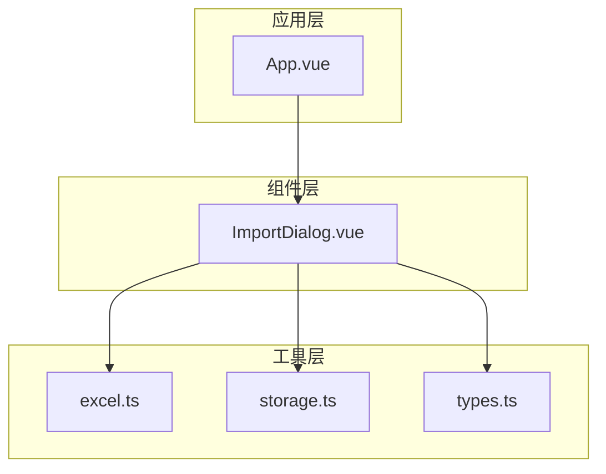
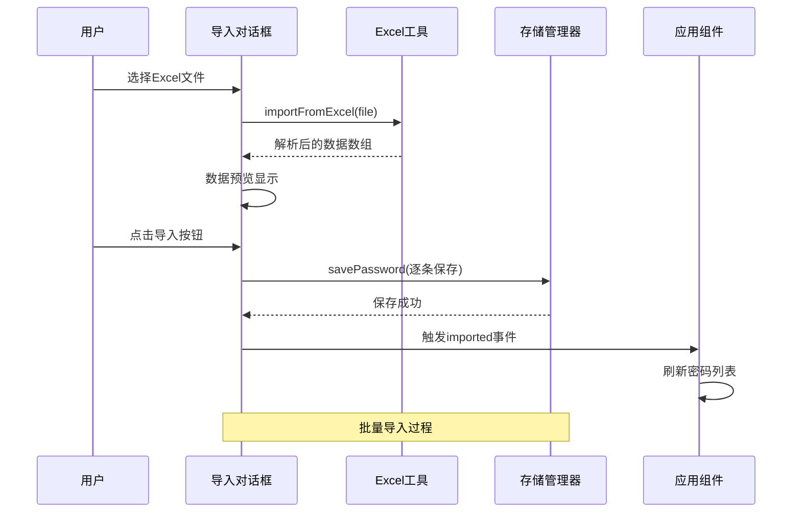
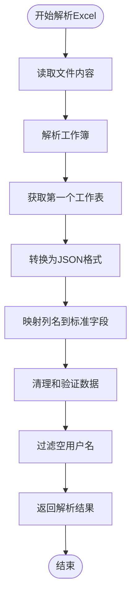
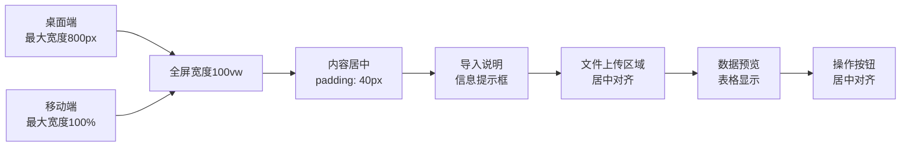
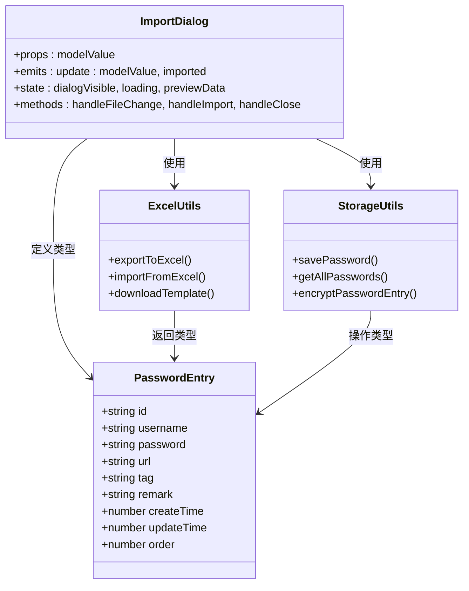

# 导入对话框组件

<cite>
**本文档引用的文件**
- [ImportDialog.vue](file://components/ImportDialog.vue)
- [excel.ts](file://utils/excel.ts)
- [storage.ts](file://utils/storage.ts)
- [types.ts](file://utils/types.ts)
- [App.vue](file://entrypoints/options/App.vue)
- [global.d.ts](file://types/global.d.ts)
</cite>

## 目录
1. [简介](#简介)
2. [项目结构](#项目结构)
3. [核心组件](#核心组件)
4. [架构概览](#架构概览)
5. [详细组件分析](#详细组件分析)
6. [依赖关系分析](#依赖关系分析)
7. [性能考虑](#性能考虑)
8. [故障排除指南](#故障排除指南)
9. [结论](#结论)
10. [附录](#附录)

## 简介
导入对话框组件是一个专门用于Excel文件导入的Vue组件，提供了完整的文件上传、数据预览、格式验证和批量导入功能。该组件支持多语言列名格式，具备完善的错误处理机制和用户体验优化策略。

## 项目结构
导入对话框组件位于components目录下，与Excel工具类、存储管理器和类型定义共同构成了完整的导入功能体系。



**图表来源**
- [ImportDialog.vue](file://components/ImportDialog.vue#L1-L343)
- [excel.ts](file://utils/excel.ts#L1-L155)
- [storage.ts](file://utils/storage.ts#L1-L981)
- [App.vue](file://entrypoints/options/App.vue#L551-L556)

**章节来源**
- [ImportDialog.vue](file://components/ImportDialog.vue#L1-L343)
- [excel.ts](file://utils/excel.ts#L1-L155)
- [storage.ts](file://utils/storage.ts#L1-L981)
- [App.vue](file://entrypoints/options/App.vue#L551-L556)

## 核心组件
导入对话框组件采用Vue 3 Composition API实现，具有以下核心特性：

### 组件架构
- **响应式状态管理**：使用ref和computed管理组件状态
- **事件驱动设计**：通过v-model双向绑定控制显示状态
- **异步处理**：支持Promise异步操作和错误处理
- **类型安全**：完整的TypeScript类型定义

### 主要功能模块
1. **文件上传处理**：支持.xlsx和.xls格式文件
2. **数据预览**：实时显示解析后的数据
3. **格式验证**：多语言列名支持和数据校验
4. **批量导入**：逐条保存到存储系统

**章节来源**
- [ImportDialog.vue](file://components/ImportDialog.vue#L115-L206)
- [excel.ts](file://utils/excel.ts#L50-L114)
- [storage.ts](file://utils/storage.ts#L377-L426)

## 架构概览
导入对话框组件采用分层架构设计，各层职责清晰分离：



**图表来源**
- [ImportDialog.vue](file://components/ImportDialog.vue#L147-L195)
- [excel.ts](file://utils/excel.ts#L50-L114)
- [storage.ts](file://utils/storage.ts#L377-L426)
- [App.vue](file://entrypoints/options/App.vue#L1663-L1665)

## 详细组件分析

### 组件属性配置
导入对话框组件支持以下props配置：

| 属性名 | 类型 | 必填 | 默认值 | 描述 |
|--------|------|------|--------|------|
| modelValue | boolean | 是 | - | 控制对话框显示/隐藏的布尔值 |

组件通过计算属性实现v-model双向绑定：
- **get**: 返回props.modelValue值
- **set**: 通过update:modelValue事件向外发出状态变更

**章节来源**
- [ImportDialog.vue](file://components/ImportDialog.vue#L124-L139)

### 事件发射机制
组件定义了两个主要事件：

1. **update:modelValue**: 当对话框显示状态改变时触发
   - 参数: boolean - 新的显示状态
   - 用途: 同步父组件的显示状态

2. **imported**: 当导入操作完成后触发
   - 参数: 无
   - 用途: 通知父组件刷新数据

**章节来源**
- [ImportDialog.vue](file://components/ImportDialog.vue#L128-L131)

### 内部状态管理
组件维护以下关键状态：

| 状态名 | 类型 | 描述 | 用途 |
|--------|------|------|------|
| dialogVisible | computed | 对话框显示状态 | v-model绑定 |
| loading | ref<boolean> | 导入加载状态 | 显示加载指示器 |
| previewData | ref | 预览数据数组 | 存储解析后的数据 |
| selectedFile | ref<File\|undefined> | 选中的文件 | 存储当前文件引用 |

**章节来源**
- [ImportDialog.vue](file://components/ImportDialog.vue#L136-L144)

### Excel文件解析流程

#### 支持的列名格式
组件支持多种语言和格式的列名映射：

| 功能字段 | 支持的列名格式 |
|----------|----------------|
| 用户名 | 用户名/username/Username/账号 |
| 密码 | 密码/password/Password |
| URL | URL/url/网址/链接 |
| 标签 | 标签/tag/Tag/分类 |
| 备注 | 备注/remark/Remark/说明 |
| 创建时间 | 创建时间/createTime/CreateTime |
| 更新时间 | 更新时间/updateTime/UpdateTime/修改时间/modifyTime |

#### 数据验证规则
1. **必填字段**: 用户名必须存在
2. **数据清理**: 自动去除首尾空白字符
3. **类型转换**: 所有数据转换为字符串格式
4. **时间处理**: 支持多种时间格式，缺失时使用当前时间



**图表来源**
- [excel.ts](file://utils/excel.ts#L50-L114)

**章节来源**
- [excel.ts](file://utils/excel.ts#L68-L96)

### 批量导入机制

#### 导入流程
1. **文件选择**: 用户选择Excel文件
2. **数据解析**: 使用Excel工具解析文件内容
3. **预览显示**: 在对话框中显示解析结果
4. **批量保存**: 逐条调用存储管理器保存数据
5. **状态更新**: 发出imported事件通知父组件

#### 错误处理策略
- **文件读取失败**: 显示错误提示并清空预览数据
- **格式验证失败**: 提供具体的错误信息
- **存储保存失败**: 记录错误日志并显示友好提示

**章节来源**
- [ImportDialog.vue](file://components/ImportDialog.vue#L174-L195)
- [storage.ts](file://utils/storage.ts#L377-L426)

### 用户界面设计

#### 响应式布局
组件采用全屏对话框设计，支持移动端和桌面端：



**图表来源**
- [ImportDialog.vue](file://components/ImportDialog.vue#L208-L342)

#### 样式定制方案
组件提供了丰富的CSS自定义选项：

| 样式类 | 作用域 | 自定义内容 |
|--------|--------|------------|
| .import-content | 深度选择器 | 对话框主体背景色和阴影 |
| .upload-area | 本地样式 | 上传区域布局和对齐 |
| .preview-section | 本地样式 | 预览区域样式 |
| .dialog-footer | 深度选择器 | 底部按钮区域样式 |
| :deep(.el-dialog) | 深度选择器 | 全屏对话框样式 |

**章节来源**
- [ImportDialog.vue](file://components/ImportDialog.vue#L208-L342)

## 依赖关系分析

### 组件间依赖关系



**图表来源**
- [ImportDialog.vue](file://components/ImportDialog.vue#L115-L131)
- [excel.ts](file://utils/excel.ts#L4-L155)
- [storage.ts](file://utils/storage.ts#L37-L555)
- [types.ts](file://utils/types.ts#L4-L41)

### 外部依赖分析
- **Element Plus**: UI组件库，提供对话框、上传、表格等组件
- **xlsx**: Excel文件处理库，支持.xlsx和.xls格式
- **CryptoJS**: 加密库，用于数据安全存储

**章节来源**
- [ImportDialog.vue](file://components/ImportDialog.vue#L117-L122)
- [excel.ts](file://utils/excel.ts#L1)
- [storage.ts](file://utils/storage.ts#L1)

## 性能考虑

### 导入性能优化
1. **渐进式处理**: 逐条保存数据，避免内存峰值
2. **异步操作**: 使用Promise处理异步任务
3. **错误隔离**: 单条数据失败不影响整体导入
4. **状态管理**: 合理的状态更新减少不必要的重渲染

### 内存管理
- **文件清理**: 关闭对话框时自动清理文件引用
- **数据截断**: 预览只显示前5条数据
- **状态复位**: 导入完成后重置所有状态

## 故障排除指南

### 常见问题及解决方案

#### Excel文件解析失败
**症状**: 选择文件后显示解析失败
**原因**: 文件格式不支持或文件损坏
**解决方案**: 
1. 确认文件为.xlsx或.xls格式
2. 检查文件是否被其他程序占用
3. 重新下载模板文件并填写数据

#### 导入数据为空
**症状**: 解析成功但数据显示为0条
**原因**: Excel文件中缺少用户名列或数据格式不正确
**解决方案**:
1. 确保至少包含用户名列
2. 检查列名是否符合支持格式
3. 验证数据格式是否正确

#### 导入过程中断
**症状**: 导入过程中出现错误
**原因**: 存储空间不足或网络异常
**解决方案**:
1. 检查浏览器存储权限
2. 清理浏览器缓存
3. 重新尝试导入操作

**章节来源**
- [ImportDialog.vue](file://components/ImportDialog.vue#L161-L165)
- [excel.ts](file://utils/excel.ts#L98-L101)

## 结论
导入对话框组件提供了完整的Excel文件导入解决方案，具有以下优势：

1. **功能完整**: 支持文件上传、数据预览、格式验证和批量导入
2. **用户体验优秀**: 响应式设计、加载状态管理和错误提示
3. **技术实现稳健**: TypeScript类型安全、异步错误处理
4. **扩展性强**: 模块化设计便于功能扩展和维护

该组件可以作为密码管理系统的标准导入工具，为用户提供便捷的数据迁移体验。

## 附录

### 使用示例

#### 基本使用
```vue
<template>
  <ImportDialog
    v-model="showImportDialog"
    @imported="handleImported"
  />
</template>

<script setup>
const showImportDialog = ref(false)

const handleImported = () => {
  console.log('数据导入完成')
  // 刷新密码列表
}
</script>
```

#### 集成到应用组件
在主应用中集成导入对话框：

```vue
<!-- 在App.vue中 -->
<ImportDialog
  v-model="showImportDialog"
  @imported="handlePasswordsImported"
/>
```

**章节来源**
- [App.vue](file://entrypoints/options/App.vue#L551-L556)
- [App.vue](file://entrypoints/options/App.vue#L1663-L1665)

### API参考

#### Props
- `modelValue` (boolean): 控制对话框显示状态

#### Events
- `update:modelValue` (boolean): 对话框状态变更事件
- `imported` (): 导入完成事件

#### Methods
- `handleFileChange`: 处理文件选择
- `handleImport`: 执行导入操作
- `handleClose`: 关闭对话框